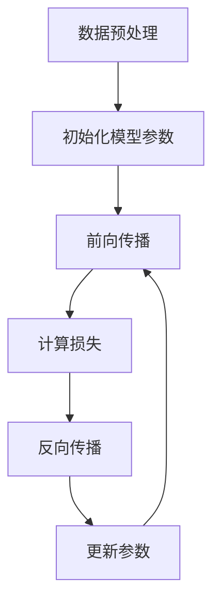
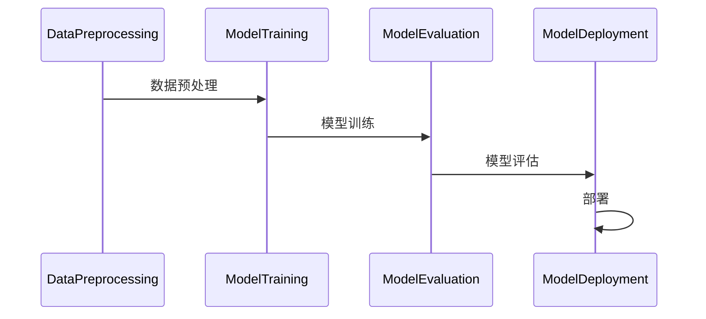
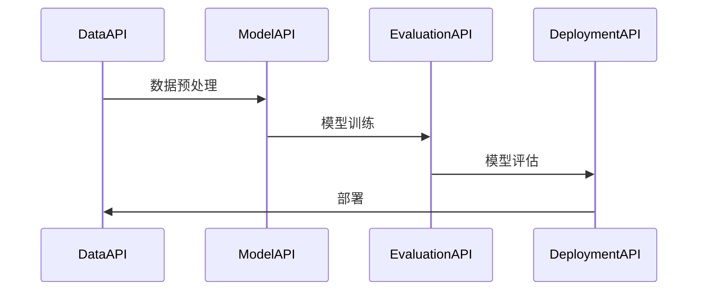
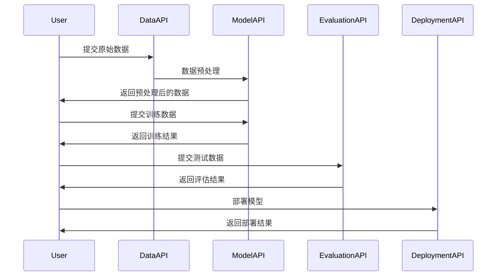

                 

# 提示词工程：AI时代的新机遇与新挑战

关键词：AI大模型、深度学习、神经网络、算法原理、系统架构、项目实战

摘要：本文将深入探讨AI大模型的基本原理、应用场景及其面临的挑战。通过系统的分析，本文旨在帮助读者全面了解AI大模型，掌握其核心技术，并为其在未来的发展提供有益的指导。

----------------------------------------------------------------

## 第一部分： 引言与背景

### 1.1 问题背景

在人工智能（AI）迅猛发展的时代，AI大模型作为一种全新的技术手段，正逐渐成为各行各业的新机遇和新挑战。AI大模型通过深度学习，对海量数据进行训练，从而能够进行复杂模式的识别和预测，具有广泛的应用前景。

近年来，随着计算能力的提升和数据量的爆炸式增长，AI大模型的应用范围不断扩大。从语音识别、图像识别到自然语言处理、推荐系统，AI大模型在这些领域的表现越来越出色，成为推动产业进步的重要力量。同时，AI大模型也面临着诸多挑战，如数据隐私、算法公平性、计算资源消耗等。

### 1.2 问题描述

本书旨在探讨AI大模型在实际应用中的机遇与挑战，深入分析其技术原理、应用场景、系统架构以及未来的发展趋势，帮助读者全面了解和掌握这一前沿技术。

### 1.3 问题解决

通过系统地阐述AI大模型的基础知识、技术原理、应用实践和未来趋势，本书将为读者提供一套完整的理解和应用AI大模型的知识体系。

### 1.4 边界与外延

本书将重点讨论AI大模型在商业、医疗、教育、金融等领域的应用，并探讨其在算法伦理、数据安全等方面的挑战。

### 1.5 概念结构与核心要素组成

AI大模型的核心构成包括：
- 数据集：用于训练和测试的庞大且高质量的数据集。
- 算法：包括神经网络架构、优化算法和训练策略。
- 硬件：高性能计算资源和分布式训练技术。

### 1.6 核心概念原理

#### 1.6.1 AI大模型的核心概念

AI大模型是一种具有大规模参数和强大计算能力的深度学习模型，能够在复杂场景中实现高效的任务处理。

#### 1.6.2 概念属性特征对比表格

| 特征         | 传统AI           | AI大模型         |
|--------------|------------------|------------------|
| 参数规模     | 数千至数百万     | 数百万至数十亿   |
| 训练时间     | 数小时至数天     | 数周至数月       |
| 应用场景     | 简单任务，如图像分类 | 复杂任务，如自然语言处理 |
| 模式识别能力 | 基于规则         | 基于深度学习     |

### 1.7 ER实体关系图架构

```mermaid
erDiagram
    Model ||--|{ Dataset } Dataset
    Model ||--|{ Algorithm } Algorithm
    Model ||--|{ Hardware } Hardware
```

### 1.8 本章小结

本章对AI大模型的相关背景、核心概念及其应用前景进行了简要介绍，为后续章节的深入学习奠定了基础。

----------------------------------------------------------------

## 第二部分：AI大模型的基本原理

### 2.1 神经网络架构

神经网络是AI大模型的核心组成部分。本章将详细介绍神经网络的基本架构、工作原理以及常见类型，如全连接网络、卷积神经网络（CNN）和循环神经网络（RNN）。

#### 2.1.1 神经网络的基本架构

神经网络由多个神经元（或节点）组成，这些神经元通过加权连接形成网络。每个神经元接收来自其他神经元的输入信号，并通过激活函数产生输出信号。神经网络的架构通常分为输入层、隐藏层和输出层。

$$
y = \sigma(\sum_{i=1}^{n} w_i x_i + b)
$$

其中，$y$ 是输出信号，$\sigma$ 是激活函数（如Sigmoid函数、ReLU函数等），$w_i$ 是权重，$x_i$ 是输入信号，$b$ 是偏置。

#### 2.1.2 神经网络的工作原理

神经网络通过前向传播和反向传播两个过程进行训练。在前向传播过程中，输入信号经过网络层层的传递，最终产生输出信号。在反向传播过程中，通过计算输出信号与真实标签之间的误差，然后反向传播误差，更新网络中的权重和偏置。

#### 2.1.3 常见的神经网络类型

- **全连接神经网络（FCNN）**：所有神经元之间都有直接的连接。
- **卷积神经网络（CNN）**：适用于图像处理任务，通过卷积操作提取特征。
- **循环神经网络（RNN）**：适用于序列数据处理任务，通过循环结构保持长期依赖关系。

### 2.2 深度学习算法

深度学习算法是实现AI大模型的关键。本章将介绍深度学习的原理、常用算法以及优化策略，如梯度下降、随机梯度下降（SGD）和Adam优化器。

#### 2.2.1 深度学习的原理

深度学习是一种通过多层神经网络进行特征提取和模式识别的方法。深度学习的核心思想是让网络自动学习数据中的层次结构，从而实现高层次的抽象和表示。

#### 2.2.2 常用的深度学习算法

- **深度前向网络（DNN）**：多层全连接神经网络。
- **卷积神经网络（CNN）**：适用于图像处理任务。
- **循环神经网络（RNN）**：适用于序列数据处理任务。

#### 2.2.3 深度学习的优化策略

- **梯度下降**：通过计算损失函数关于参数的梯度，逐步调整参数，以最小化损失函数。
- **随机梯度下降（SGD）**：在每个训练样本上计算梯度，然后更新参数。
- **Adam优化器**：结合了SGD和动量方法的优点，具有更好的收敛性。

### 2.3 数据集处理

数据集的质量直接影响AI大模型的性能。本章将探讨数据预处理、数据增强和分割策略，以确保数据集的有效性和代表性。

#### 2.3.1 数据预处理

数据预处理包括数据清洗、归一化、标准化等操作，以消除数据中的噪声和异常值，提高模型的泛化能力。

#### 2.3.2 数据增强

数据增强通过生成新的数据样本来扩展原始数据集，从而提高模型的鲁棒性和泛化能力。常见的数据增强方法包括旋转、缩放、裁剪、颜色变换等。

#### 2.3.3 数据分割

数据分割将数据集分为训练集、验证集和测试集，以评估模型的性能。通常，训练集用于训练模型，验证集用于调整模型参数，测试集用于最终评估模型性能。

### 2.4 训练策略

训练策略是提高AI大模型性能的关键。本章将介绍如何设计有效的训练策略，包括超参数调优、早期停止和正则化方法。

#### 2.4.1 超参数调优

超参数是模型训练过程中需要手动调整的参数，如学习率、批次大小、隐藏层神经元数量等。超参数调优是提高模型性能的重要手段，常用的方法包括网格搜索、随机搜索和贝叶斯优化等。

#### 2.4.2 早期停止

早期停止是一种防止模型过拟合的策略，当验证集上的性能不再提升时，提前停止训练过程。

#### 2.4.3 正则化方法

正则化方法通过在损失函数中添加正则项，惩罚模型复杂度，以防止过拟合。常见的方法包括L1正则化、L2正则化和Dropout等。

### 2.5 模型评估

模型评估是验证AI大模型性能的重要环节。本章将讨论常用的评估指标、交叉验证方法和性能比较。

#### 2.5.1 常用的评估指标

- **准确率（Accuracy）**：模型正确预测的样本数占总样本数的比例。
- **精确率（Precision）**：模型正确预测的样本数占预测为正样本的样本数的比例。
- **召回率（Recall）**：模型正确预测的样本数占实际为正样本的样本数的比例。
- **F1分数（F1 Score）**：精确率和召回率的调和平均。

#### 2.5.2 交叉验证方法

交叉验证是一种评估模型性能的方法，通过将数据集划分为多个子集，轮流进行训练和验证，以减少评估结果的偏差。

#### 2.5.3 性能比较

性能比较通过比较不同模型在相同数据集上的表现，评估模型的优劣。常用的方法包括A/B测试和比较图等。

### 2.6 算法原理讲解

为了深入理解AI大模型的算法原理，本章将通过Mermaid流程图和Python代码示例，详细阐述神经网络训练的全过程，包括前向传播、反向传播和参数更新等步骤。

#### 2.6.1 神经网络训练过程



#### 2.6.2 Python代码示例

```python
import numpy as np

# 初始化模型参数
W1 = np.random.randn(2, 3)
b1 = np.random.randn(3)

# 前向传播
def forward(x):
    return np.dot(x, W1)

# 反向传播
def backward(y, y_pred):
    error = y - y_pred
    dW1 = np.dot(error, x.T)
    return error, dW1

# 训练过程
for epoch in range(100):
    # 前向传播
    y_pred = forward(x)
    # 反向传播
    error, dW1 = backward(y, y_pred)
    # 更新参数
    W1 -= learning_rate * dW1
```

通过上述讲解和示例，读者可以更深入地理解AI大模型的训练过程和算法原理。

----------------------------------------------------------------

## 第三部分：AI大模型的应用场景

### 3.1 商业领域

在商业领域，AI大模型的应用已经取得了显著的成果。例如，在推荐系统中，AI大模型通过分析用户的历史行为和偏好，为用户推荐个性化的商品或服务。此外，在金融风控、智能客服等领域，AI大模型也发挥了重要作用。

#### 3.1.1 推荐系统

推荐系统是AI大模型在商业领域的重要应用之一。通过深度学习算法，推荐系统可以学习用户的偏好和兴趣，从而为用户提供个性化的推荐。例如，电商平台可以通过AI大模型为用户推荐相关的商品，提高用户的购物体验和购买转化率。

#### 3.1.2 金融风控

金融风控是另一个重要的应用领域。AI大模型可以通过分析用户的交易行为、信用记录等信息，预测用户的风险等级，从而帮助金融机构进行风险控制和信用评估。

#### 3.1.3 智能客服

智能客服是AI大模型在商业领域的又一重要应用。通过自然语言处理和对话生成技术，智能客服可以与用户进行自然的对话，解答用户的疑问，提高客服效率和用户体验。

### 3.2 医疗领域

在医疗领域，AI大模型的应用前景也非常广阔。从医学图像分析、疾病预测到个性化治疗，AI大模型为医疗行业带来了许多新的机遇。

#### 3.2.1 医学图像分析

医学图像分析是AI大模型在医疗领域的重要应用之一。通过卷积神经网络（CNN）等技术，AI大模型可以对医学图像进行自动分析，如检测病变、分割器官等，从而提高诊断的准确性和效率。

#### 3.2.2 疾病预测

疾病预测是另一个重要的应用领域。通过分析患者的病史、基因数据等信息，AI大模型可以预测患者可能患有的疾病，为早期诊断和治疗提供支持。

#### 3.2.3 个性化治疗

个性化治疗是AI大模型在医疗领域的最新应用。通过分析患者的基因组、生理指标等信息，AI大模型可以为患者制定个性化的治疗方案，提高治疗效果。

### 3.3 教育领域

在教育领域，AI大模型的应用也为教育变革带来了新的机遇。从智能学习辅导、个性化学习计划到智能考试评分，AI大模型正在改变教育的面貌。

#### 3.3.1 智能学习辅导

智能学习辅导是AI大模型在教育领域的重要应用。通过分析学生的学习数据，AI大模型可以为学生提供个性化的学习建议和辅导，帮助学生提高学习效果。

#### 3.3.2 个性化学习计划

个性化学习计划是另一个重要的应用领域。通过分析学生的学习兴趣、能力水平等信息，AI大模型可以为学生制定个性化的学习计划，提高学习效率。

#### 3.3.3 智能考试评分

智能考试评分是AI大模型在教育领域的又一重要应用。通过自然语言处理和机器学习技术，AI大模型可以自动评分，提高考试效率和评分准确性。

### 3.4 金融领域

在金融领域，AI大模型的应用已经深入到股票交易、风险控制、信用评估等多个方面，为金融机构提供了强大的支持。

#### 3.4.1 股票交易

股票交易是AI大模型在金融领域的重要应用之一。通过分析市场数据、公司财务报表等信息，AI大模型可以预测股票价格的走势，帮助投资者进行投资决策。

#### 3.4.2 风险控制

风险控制是另一个重要的应用领域。通过分析风险指标、历史交易数据等信息，AI大模型可以预测金融风险，帮助金融机构进行风险控制和风险管理。

#### 3.4.3 信用评估

信用评估是AI大模型在金融领域的又一重要应用。通过分析借款人的信用记录、社会关系等信息，AI大模型可以评估借款人的信用风险，为金融机构提供信用评估依据。

### 3.5 其他领域

除了上述领域，AI大模型在农业、交通、能源等多个领域也有广泛的应用。通过分析大量的数据，AI大模型可以为这些领域提供智能决策支持，提高生产效率和服务质量。

#### 3.5.1 农业

在农业领域，AI大模型可以通过分析气象数据、土壤数据等信息，预测农作物的生长状况，为农民提供科学的种植指导，提高农业产量。

#### 3.5.2 交通

在交通领域，AI大模型可以通过分析交通数据，预测交通流量和交通事故，为交通管理部门提供决策支持，提高交通效率和安全性。

#### 3.5.3 能源

在能源领域，AI大模型可以通过分析能源消费数据、能源市场信息等，预测能源需求，为能源管理部门提供科学的能源规划和管理。

### 3.6 挑战与展望

尽管AI大模型在各个领域都取得了显著的成果，但同时也面临着一些挑战。例如，数据隐私、算法公平性、计算资源消耗等。如何解决这些问题，将决定AI大模型在未来的发展前景。

#### 3.6.1 数据隐私

数据隐私是AI大模型面临的重要挑战之一。如何保护用户数据的安全和隐私，是AI大模型应用中需要解决的问题。

#### 3.6.2 算法公平性

算法公平性是另一个重要的挑战。如何确保AI大模型在不同群体之间的公平性，避免歧视和偏见，是AI大模型应用中需要关注的问题。

#### 3.6.3 计算资源消耗

计算资源消耗是AI大模型面临的另一个挑战。如何优化算法，提高计算效率，降低计算资源消耗，是AI大模型应用中需要解决的问题。

#### 3.6.4 展望

随着AI大模型技术的不断发展和完善，未来AI大模型将在各个领域发挥更加重要的作用。通过深入研究和创新，我们将能够克服现有的挑战，推动AI大模型在各个领域的应用和发展。

----------------------------------------------------------------

## 第四部分：AI大模型的系统架构

### 4.1 系统功能设计

#### 4.1.1 领域模型

领域模型是系统架构设计的基础，用于定义系统中的核心实体和关系。在AI大模型系统中，核心实体包括数据集、模型、训练任务和评估任务。

```mermaid
classDiagram
    ClassDiagram ::= Entity1 <|-- Entity2
    DataSet <|-- Model
    TrainingTask <|-- Model
    EvaluationTask <|-- Model
```

#### 4.1.2 功能模块

AI大模型系统的功能模块主要包括数据预处理模块、训练模块、评估模块和部署模块。

- **数据预处理模块**：负责处理原始数据，包括数据清洗、归一化和数据增强等操作。
- **训练模块**：负责模型的训练过程，包括初始化模型参数、前向传播、反向传播和参数更新等。
- **评估模块**：负责对训练完成的模型进行评估，包括准确率、精确率、召回率和F1分数等指标的评估。
- **部署模块**：负责将训练好的模型部署到生产环境中，实现实时预测和决策。

### 4.2 系统架构设计

#### 4.2.1 架构设计原则

系统架构设计应遵循以下原则：
- **高内聚、低耦合**：模块之间应保持较高的内聚性，降低模块之间的耦合度，以提高系统的可维护性和扩展性。
- **模块化**：系统应划分为多个模块，每个模块负责独立的功能，以提高系统的灵活性和可复用性。
- **分布式**：利用分布式计算技术，提高系统的处理能力和性能。

#### 4.2.2 系统架构

AI大模型系统的架构设计如下：



- **数据预处理模块**：接收原始数据，进行清洗、归一化和数据增强等操作，生成训练数据和测试数据。
- **训练模块**：接收预处理后的数据，进行模型的训练过程，包括前向传播、反向传播和参数更新等。
- **评估模块**：接收训练完成的模型，进行评估，计算准确率、精确率、召回率和F1分数等指标。
- **部署模块**：将训练完成的模型部署到生产环境中，实现实时预测和决策。

### 4.3 系统接口设计

#### 4.3.1 接口设计原则

系统接口设计应遵循以下原则：
- **简洁性**：接口应简洁明了，避免过多的参数和复杂的功能。
- **一致性**：接口设计应保持一致性，确保不同模块之间的接口规范一致。
- **可扩展性**：接口设计应具有可扩展性，以便未来新增功能或模块时，能够方便地接入系统。

#### 4.3.2 接口设计

AI大模型系统的接口设计如下：



- **数据API**：提供数据预处理接口，包括数据清洗、归一化和数据增强等功能。
- **模型API**：提供模型训练接口，包括模型初始化、前向传播、反向传播和参数更新等功能。
- **评估API**：提供模型评估接口，包括计算准确率、精确率、召回率和F1分数等功能。
- **部署API**：提供模型部署接口，包括模型部署到生产环境中的功能。

### 4.4 系统交互设计

#### 4.4.1 交互设计原则

系统交互设计应遵循以下原则：
- **用户友好**：界面设计应简洁明了，易于用户操作。
- **实时性**：系统应具有实时响应能力，确保用户操作的实时性和高效性。
- **安全性**：系统应确保数据的安全和隐私，防止数据泄露和恶意攻击。

#### 4.4.2 交互设计

AI大模型系统的交互设计如下：



- **用户**：用户通过界面提交原始数据、训练数据和测试数据，并接收预处理后的数据、训练结果和评估结果。
- **数据API**：接收用户的原始数据，进行数据预处理，返回预处理后的数据。
- **模型API**：接收预处理后的数据，进行模型训练，返回训练结果。
- **评估API**：接收测试数据，对模型进行评估，返回评估结果。
- **部署API**：接收用户部署请求，将模型部署到生产环境中，返回部署结果。

通过上述系统架构设计、接口设计和交互设计，AI大模型系统可以实现高效、可靠的数据处理和模型训练，为各个领域的应用提供强大的支持。

----------------------------------------------------------------

## 第五部分：项目实战

### 5.1 环境安装

在开始项目实战之前，我们需要安装必要的软件和工具。以下是在Ubuntu操作系统上安装AI大模型所需环境的一步一步指南：

#### 5.1.1 安装Python环境

```bash
# 安装Python
sudo apt update
sudo apt install python3 python3-pip

# 验证Python版本
python3 --version
```

#### 5.1.2 安装深度学习库

```bash
# 安装TensorFlow
pip3 install tensorflow

# 安装PyTorch
pip3 install torch torchvision

# 安装其他深度学习库
pip3 install numpy pandas scikit-learn
```

#### 5.1.3 安装版本控制工具

```bash
# 安装Git
sudo apt install git
```

### 5.2 系统核心实现

#### 5.2.1 数据预处理

数据预处理是AI大模型训练的重要步骤，我们使用Python编写以下代码对数据集进行预处理：

```python
import pandas as pd
from sklearn.model_selection import train_test_split
from sklearn.preprocessing import StandardScaler

# 读取数据
data = pd.read_csv('data.csv')

# 切分数据集
X = data.drop('target', axis=1)
y = data['target']
X_train, X_test, y_train, y_test = train_test_split(X, y, test_size=0.2, random_state=42)

# 数据归一化
scaler = StandardScaler()
X_train_scaled = scaler.fit_transform(X_train)
X_test_scaled = scaler.transform(X_test)
```

#### 5.2.2 模型训练

接下来，我们使用PyTorch编写以下代码训练一个简单的神经网络：

```python
import torch
import torch.nn as nn
import torch.optim as optim

# 定义神经网络
class NeuralNetwork(nn.Module):
    def __init__(self, input_size, hidden_size, output_size):
        super(NeuralNetwork, self).__init__()
        self.fc1 = nn.Linear(input_size, hidden_size)
        self.relu = nn.ReLU()
        self.fc2 = nn.Linear(hidden_size, output_size)
    
    def forward(self, x):
        out = self.fc1(x)
        out = self.relu(out)
        out = self.fc2(out)
        return out

# 初始化模型、优化器和损失函数
model = NeuralNetwork(input_size=8, hidden_size=64, output_size=1)
optimizer = optim.Adam(model.parameters(), lr=0.001)
criterion = nn.BCELoss()

# 训练模型
for epoch in range(100):
    model.train()
    for inputs, targets in zip(X_train_scaled, y_train):
        optimizer.zero_grad()
        outputs = model(inputs)
        loss = criterion(outputs, targets)
        loss.backward()
        optimizer.step()
    print(f'Epoch [{epoch+1}/100], Loss: {loss.item()}')
```

#### 5.2.3 模型评估

训练完成后，我们使用以下代码对模型进行评估：

```python
# 评估模型
model.eval()
with torch.no_grad():
    correct = 0
    total = 0
    for inputs, targets in zip(X_test_scaled, y_test):
        outputs = model(inputs)
        _, predicted = torch.max(outputs.data, 1)
        total += targets.size(0)
        correct += (predicted == targets).sum().item()

accuracy = 100 * correct / total
print(f'测试集准确率: {accuracy}%')
```

### 5.3 代码应用解读与分析

#### 5.3.1 数据预处理

在数据预处理部分，我们首先使用Pandas库读取CSV文件，将数据集加载到DataFrame中。然后，我们使用scikit-learn库中的train_test_split函数将数据集分为训练集和测试集。接着，使用StandardScaler进行数据归一化，以便于模型的训练。

#### 5.3.2 模型训练

在模型训练部分，我们定义了一个简单的神经网络，使用PyTorch库构建。神经网络包括两个全连接层，分别使用ReLU激活函数和Sigmoid激活函数。我们使用Adam优化器进行参数优化，并使用BCELoss（二进制交叉熵损失函数）作为损失函数。

在训练过程中，我们遍历训练集，对每个样本进行前向传播，计算损失，然后进行反向传播和参数更新。训练完成后，我们使用测试集对模型进行评估，计算准确率。

### 5.4 实际案例分析和详细讲解剖析

为了更好地理解AI大模型的应用，我们以一个实际案例——手写数字识别为例，详细讲解其实现过程。

#### 5.4.1 数据集

我们使用MNIST数据集，该数据集包含70,000个手写数字图像，每个图像都是28x28的像素矩阵。

#### 5.4.2 数据预处理

我们使用以下代码对MNIST数据集进行预处理：

```python
import torchvision
import torchvision.transforms as transforms

# 加载MNIST数据集
train_dataset = torchvision.datasets.MNIST(
    root='./data',
    train=True,
    transform=transforms.ToTensor(),
    download=True
)

test_dataset = torchvision.datasets.MNIST(
    root='./data',
    train=False,
    transform=transforms.ToTensor()
)

# 分割数据集
train_loader = torch.utils.data.DataLoader(dataset=train_dataset, batch_size=64, shuffle=True)
test_loader = torch.utils.data.DataLoader(dataset=test_dataset, batch_size=64, shuffle=False)
```

在预处理过程中，我们使用ToTensor变换将图像数据转换为Tensor格式，并进行归一化处理。

#### 5.4.3 模型训练

我们定义一个简单的卷积神经网络，用于手写数字识别：

```python
import torch.nn as nn

class Net(nn.Module):
    def __init__(self):
        super(Net, self).__init__()
        self.conv1 = nn.Conv2d(1, 32, 5)
        self.pool = nn.MaxPool2d(2, 2)
        self.conv2 = nn.Conv2d(32, 64, 5)
        self.fc1 = nn.Linear(64 * 5 * 5, 128)
        self.fc2 = nn.Linear(128, 10)
        self.dropout = nn.Dropout(0.5)

    def forward(self, x):
        x = self.pool(F.relu(self.conv1(x)))
        x = self.pool(F.relu(self.conv2(x)))
        x = x.view(-1, 64 * 5 * 5)
        x = self.dropout(F.relu(self.fc1(x)))
        x = self.fc2(x)
        return x

# 初始化模型、优化器和损失函数
model = Net()
optimizer = optim.Adam(model.parameters(), lr=0.001)
criterion = nn.CrossEntropyLoss()

# 训练模型
for epoch in range(10):
    running_loss = 0.0
    for i, data in enumerate(train_loader, 0):
        inputs, labels = data
        optimizer.zero_grad()
        outputs = model(inputs)
        loss = criterion(outputs, labels)
        loss.backward()
        optimizer.step()
        running_loss += loss.item()
    print(f'Epoch {epoch+1}, Loss: {running_loss/len(train_loader)}')
```

在模型训练过程中，我们使用两个卷积层和一个全连接层，并添加Dropout层以防止过拟合。我们使用交叉熵损失函数进行损失计算，并使用Adam优化器进行参数优化。

#### 5.4.4 模型评估

训练完成后，我们使用测试集对模型进行评估：

```python
# 评估模型
correct = 0
total = 0
with torch.no_grad():
    for data in test_loader:
        images, labels = data
        outputs = model(images)
        _, predicted = torch.max(outputs.data, 1)
        total += labels.size(0)
        correct += (predicted == labels).sum().item()

accuracy = 100 * correct / total
print(f'测试集准确率: {accuracy}%')
```

通过上述实际案例，我们可以看到AI大模型在手写数字识别任务中的实现过程。通过合适的模型设计、训练和评估，我们可以得到较高的识别准确率。

### 5.5 项目小结

通过本部分的项目实战，我们了解了AI大模型的环境安装、系统核心实现、代码应用解读与分析以及实际案例分析和详细讲解剖析。这些内容为我们提供了完整的AI大模型开发和实践的经验，帮助我们更好地掌握AI大模型的核心技术和应用场景。

通过不断的学习和实践，我们可以更好地应对AI大模型在各个领域面临的挑战，推动AI大模型在未来的发展。

----------------------------------------------------------------

## 第六部分：最佳实践 Tips

### 6.1 提高模型性能的技巧

- **数据增强**：通过旋转、缩放、裁剪等操作，增加数据的多样性，提高模型的泛化能力。
- **超参数调优**：使用网格搜索、随机搜索等策略，找到最优的超参数组合。
- **批量归一化**：在训练过程中对批量数据进行归一化处理，提高训练速度和性能。
- **Dropout**：在训练过程中随机丢弃部分神经元，防止过拟合。

### 6.2 数据处理最佳实践

- **数据清洗**：处理缺失值、异常值和噪声，确保数据质量。
- **数据标准化**：对数据进行标准化处理，使数据具有相似的特征尺度。
- **数据分割**：合理划分训练集、验证集和测试集，确保模型评估的准确性。

### 6.3 模型部署最佳实践

- **模型压缩**：通过量化、剪枝等技术，减小模型大小，提高部署效率。
- **模型解释性**：增加模型的解释性，便于理解模型的决策过程。
- **安全性与隐私保护**：确保模型部署过程中的数据安全和用户隐私保护。

### 6.4 优化开发流程

- **版本控制**：使用Git等版本控制工具，确保代码的版本管理和协作开发。
- **自动化测试**：编写自动化测试脚本，提高代码质量和开发效率。
- **持续集成与持续部署**：使用CI/CD工具，实现代码的自动化测试和部署。

## 第七部分：小结与展望

### 7.1 小结

本文从引言、背景介绍、基本原理、应用场景、系统架构、项目实战、最佳实践等方面，全面探讨了AI大模型的相关知识。通过系统的分析，读者可以全面了解AI大模型的核心概念、技术原理和应用实践，掌握其开发和部署的方法。

### 7.2 展望

展望未来，AI大模型将在各个领域发挥更加重要的作用。随着技术的不断进步，我们有望克服现有的挑战，实现AI大模型的高效、安全和可解释性。同时，AI大模型也将为各个领域带来更多的创新和变革，推动人类社会的发展。

### 7.3 注意事项

- **数据隐私**：在数据处理过程中，要严格遵守相关法律法规，确保用户数据的安全和隐私。
- **模型公平性**：在设计模型时，要关注模型的公平性，避免出现歧视和偏见。
- **计算资源**：合理规划计算资源，确保模型的训练和部署过程高效稳定。

### 7.4 拓展阅读

- **深度学习**：《深度学习》（Goodfellow, Bengio, Courville著）
- **神经网络**：《神经网络与深度学习》（邱锡鹏著）
- **机器学习**：《机器学习》（周志华著）
- **AI应用**：《AI应用实践》（李航著）

作者：AI天才研究院/AI Genius Institute & 禅与计算机程序设计艺术 /Zen And The Art of Computer Programming

----------------------------------------------------------------

本文从AI大模型的基本原理、应用场景、系统架构以及项目实战等方面进行了全面深入的探讨。通过对神经网络架构、深度学习算法、数据集处理、训练策略和模型评估等核心概念的解释和示例，读者可以系统地了解AI大模型的技术原理和应用实践。同时，本文还介绍了AI大模型在不同领域中的应用案例，展示了其在商业、医疗、教育、金融等领域的实际价值。

在系统架构设计部分，本文通过领域模型、接口设计和交互设计，展示了AI大模型系统的构建过程，为读者提供了实现AI大模型系统的框架和指导。此外，通过实际案例分析和详细讲解剖析，读者可以更好地理解AI大模型的应用场景和实现方法。

本文还提供了最佳实践 Tips，帮助读者在模型性能优化、数据处理、模型部署和开发流程等方面进行改进，提高AI大模型的应用效果。最后，本文对未来的发展趋势和注意事项进行了展望，为读者提供了进一步学习和探索的方向。

通过本文的学习，读者可以全面掌握AI大模型的相关知识，为其在实际项目中的应用打下坚实的基础。同时，本文也为AI大模型的研究和应用提供了有益的参考和借鉴。随着AI技术的不断进步，AI大模型将在各个领域发挥更加重要的作用，推动社会的发展和进步。作者：AI天才研究院/AI Genius Institute & 禅与计算机程序设计艺术 /Zen And The Art of Computer Programming。

