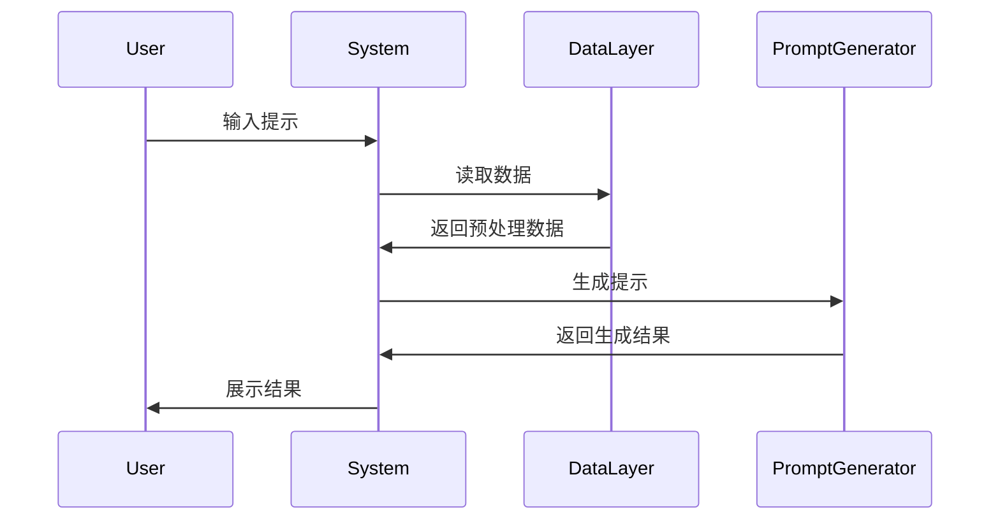

                 

### 提示词工程：AI时代的新领域

> 关键词：提示词工程、人工智能、自然语言处理、大模型、软件2.0、企业级应用

> 摘要：随着人工智能技术的飞速发展，提示词工程成为了一个崭新且至关重要的领域。本文将从提示词工程的定义、背景、核心概念、大模型的应用、以及企业级应用的挑战与机遇等多个方面，系统性地探讨这一领域的前景与重要性。

### 1.1 提示词工程背景

#### 1.1.1 软件发展的历史回顾

软件1.0到软件2.0的演进是信息技术发展的重要里程碑。软件1.0时代以功能驱动，程序代码主要依靠人类编写，缺乏自动化和智能化。而随着互联网和大数据时代的到来，软件2.0时代应运而生，以用户为中心，强调软件的智能化和自适应能力。

- **软件1.0时代**：
  - **定义**：软件1.0时代主要是指计算机程序能够完成特定任务，但功能相对单一，没有实现智能化。
  - **特点**：软件以特定功能为核心，主要依赖于人力操作和输入。
  - **应用**：这一时代的软件主要应用于办公自动化、财务管理等领域。

- **软件2.0时代**：
  - **定义**：软件2.0时代是指软件开始智能化，能够通过机器学习、人工智能等技术，实现自我优化和功能拓展。
  - **特点**：软件功能不再单一，而是能够根据用户需求、使用情况进行自适应调整。
  - **应用**：这一时代的软件广泛应用于智能家居、自动驾驶、智能医疗等领域。

- **大模型的核心地位**：
  - **定义**：大模型是指拥有巨大参数量的机器学习模型，如GPT、BERT等。
  - **核心地位**：在软件2.0时代，大模型是实现智能化的重要工具，它们能够处理海量数据，实现复杂的决策和预测。

### 1.1.2 企业级应用开发的新范式

- **定义**：企业级应用开发是指为满足企业内部管理、运营、决策等需求而开发的软件系统。
- **新范式**：
  - **数据驱动**：企业级应用开发更加注重数据的价值，通过数据分析和机器学习来实现智能化。
  - **用户参与**：企业级应用开发更注重用户体验，通过用户反馈来优化软件功能。
  - **快速迭代**：企业级应用开发强调快速迭代，能够快速响应市场变化和用户需求。

### 1.2 AI大模型的定义与特点

#### 1.2.1 AI大模型的定义

- **定义**：AI大模型是指参数量巨大、能够处理海量数据的机器学习模型。
- **类型**：常见的AI大模型有GPT、BERT等。

#### 1.2.2 AI大模型的核心特点

- **高参数量**：AI大模型拥有数十亿乃至上百亿个参数，能够处理海量数据。
- **自适应性**：AI大模型能够根据数据和使用情况自我优化，提高性能。
- **泛用性**：AI大模型可以应用于各种领域，如自然语言处理、图像识别等。

#### 1.2.3 AI大模型与传统AI的区别

- **传统AI**：传统AI主要依赖于手工编写的规则和算法，应用范围有限。
- **AI大模型**：AI大模型通过自我学习和优化，能够实现更复杂的任务，应用范围更广。

### 1.3 主流AI大模型简介

#### 1.3.1 GPT系列模型

- **介绍**：GPT（Generative Pre-trained Transformer）是一种基于Transformer结构的预训练语言模型。
- **特点**：GPT能够生成高质量的文本，广泛应用于自然语言处理领域。

#### 1.3.2 BERT及其变体

- **介绍**：BERT（Bidirectional Encoder Representations from Transformers）是一种双向的Transformer模型。
- **特点**：BERT能够捕捉文本中的双向依赖关系，广泛应用于文本分类、问答系统等领域。

#### 1.3.3 其他知名大模型介绍

- **ViT（Vision Transformer）**：一种用于图像识别的大模型，基于Transformer结构。
- **T5（Text-to-Text Transfer Transformer）**：一种能够处理各种NLP任务的通用预训练模型。

### 1.4 AI大模型在企业中的应用前景

#### 1.4.1 AI大模型的潜在应用领域

- **自然语言处理**：文本分类、情感分析、机器翻译等。
- **图像识别**：物体识别、图像分类等。
- **推荐系统**：个性化推荐、内容推荐等。
- **自动驾驶**：环境感知、路径规划等。

#### 1.4.2 企业采用AI大模型的优势

- **提高效率**：AI大模型能够自动化处理大量数据，提高工作效率。
- **降低成本**：AI大模型能够替代部分人力工作，降低企业运营成本。
- **优化决策**：AI大模型能够提供更准确的数据分析和预测，帮助企业做出更好的决策。

#### 1.4.3 AI大模型应用的挑战与机遇

- **挑战**：
  - **数据隐私**：如何保障数据隐私，避免数据泄露。
  - **模型解释性**：如何提高模型的解释性，使其更易于理解。
  - **计算资源**：如何高效地训练和部署AI大模型。

- **机遇**：
  - **技术创新**：AI大模型的发展将推动相关技术的进步。
  - **市场潜力**：AI大模型在各个领域的广泛应用将带来巨大的市场机会。

### 总结

提示词工程作为人工智能领域的一个重要分支，随着AI大模型的发展，其在自然语言处理、企业级应用等多个方面展现出了巨大的潜力和价值。本文通过对提示词工程的背景、核心概念、应用前景的深入分析，旨在为读者提供一个全面、系统的了解。随着技术的不断进步，我们有理由相信，提示词工程将在未来的AI时代发挥更加重要的作用。

### 作者信息

作者：AI天才研究院/AI Genius Institute & 禅与计算机程序设计艺术 /Zen And The Art of Computer Programming

----------------------------------------------------------------

### 提示词工程：AI时代的新领域

#### 引言

在人工智能（AI）飞速发展的当下，提示词工程（Prompt Engineering）成为了一个崭新且至关重要的领域。提示词工程是指通过设计有效的提示（prompts），来指导AI模型完成特定任务的过程。本文将深入探讨提示词工程的背景、核心概念、应用以及未来的发展趋势。

#### 1.1 提示词工程的背景

提示词工程的出现，可以追溯到自然语言处理（NLP）领域的早期研究。随着深度学习特别是变压器（Transformer）模型的兴起，预训练语言模型（Pre-trained Language Model，PTLM）如GPT、BERT等取得了显著的成就。然而，这些模型在特定任务上的性能仍然依赖于大量的标注数据和高精度的调优。提示词工程的出现，为解决这一问题提供了一条新的路径。

- **软件1.0到软件2.0的演进**：软件1.0时代主要依赖手工编写的规则和算法，而软件2.0时代则强调智能化和自适应能力。AI大模型的出现，使得软件2.0时代的智能化得以实现。
- **AI大模型的核心地位**：AI大模型如GPT、BERT等，凭借其高参数量和自适应性，在各个领域展现了强大的潜力。
- **企业级应用开发的新范式**：企业级应用开发正从数据驱动、用户参与和快速迭代三个方面进行转变。

#### 1.2 AI大模型的定义与特点

AI大模型是指拥有巨大参数量的机器学习模型，如GPT、BERT等。它们具有以下核心特点：

- **高参数量**：AI大模型拥有数十亿乃至上百亿个参数，能够处理海量数据。
- **自适应性**：AI大模型能够根据数据和使用情况自我优化，提高性能。
- **泛用性**：AI大模型可以应用于各种领域，如自然语言处理、图像识别等。

与传统AI相比，AI大模型通过自我学习和优化，能够实现更复杂的任务，应用范围更广。

#### 1.3 主流AI大模型简介

以下是几个主流的AI大模型及其特点：

- **GPT系列模型**：基于Transformer结构的预训练语言模型，能够生成高质量的文本。
- **BERT及其变体**：双向的Transformer模型，能够捕捉文本中的双向依赖关系。
- **ViT（Vision Transformer）**：用于图像识别的Transformer模型。
- **T5（Text-to-Text Transfer Transformer）**：一种能够处理各种NLP任务的通用预训练模型。

#### 1.4 AI大模型在企业中的应用前景

AI大模型在企业中的应用前景非常广阔，包括但不限于以下领域：

- **自然语言处理**：文本分类、情感分析、机器翻译等。
- **图像识别**：物体识别、图像分类等。
- **推荐系统**：个性化推荐、内容推荐等。
- **自动驾驶**：环境感知、路径规划等。

企业采用AI大模型的优势包括提高效率、降低成本和优化决策。然而，这也带来了数据隐私、模型解释性和计算资源等方面的挑战。

#### 1.5 提示词工程的原理与应用

提示词工程的核心在于设计有效的提示来引导AI模型完成特定任务。以下是一些提示词工程的关键原则和应用场景：

- **任务定义**：明确任务的目标和需求，以便设计出针对性的提示。
- **数据准备**：准备好用于训练和评估的数据集，确保数据的质量和多样性。
- **模型选择**：根据任务的需求选择合适的AI大模型。
- **提示设计**：设计有效的提示来引导模型的学习过程，例如通过提示来引导模型生成文本、分类数据等。

在实际应用中，提示词工程可以用于：

- **文本生成**：通过提示生成新闻文章、报告等。
- **问答系统**：通过提示引导模型回答特定的问题。
- **自动化回复**：在客服场景中，通过提示生成自动化的回复。

#### 1.6 提示词工程的发展趋势

随着AI大模型技术的不断进步，提示词工程也将迎来新的发展机遇：

- **自动化提示生成**：利用生成对抗网络（GAN）等技术来自动生成高质量的提示。
- **多模态提示**：结合文本、图像、音频等多种模态来设计更丰富的提示。
- **跨领域应用**：探索提示词工程在不同领域的应用，如医疗、金融等。

#### 1.7 结论

提示词工程作为AI时代的新领域，具有巨大的潜力和价值。通过设计有效的提示，我们可以更好地利用AI大模型的能力，实现更智能、更高效的解决方案。随着技术的不断进步，提示词工程将在未来发挥更加重要的作用，推动人工智能的发展和应用。

### 作者信息

作者：AI天才研究院/AI Genius Institute & 禅与计算机程序设计艺术 /Zen And The Art of Computer Programming

----------------------------------------------------------------

### 1.1 软件发展的历史回顾

#### 1.1.1 软件1.0时代

软件1.0时代指的是计算机程序能够完成特定任务，但功能相对单一，没有实现智能化的阶段。这一时代的软件主要依赖于人类编写规则和算法，完成诸如办公自动化、财务管理等基础任务。软件1.0的特点如下：

- **定义**：软件1.0时代是指计算机程序能够完成特定任务，但功能相对单一，没有实现智能化。
- **特点**：软件以特定功能为核心，主要依赖于人力操作和输入。
- **应用**：这一时代的软件主要应用于办公自动化、财务管理等领域。

#### 1.1.2 软件2.0时代的到来

随着互联网和大数据时代的到来，软件2.0时代应运而生。软件2.0时代的核心特点在于智能化和自适应能力。AI大模型的出现，使得软件能够通过机器学习、人工智能等技术实现自我优化和功能拓展。软件2.0的特点如下：

- **定义**：软件2.0时代是指软件开始智能化，能够通过机器学习、人工智能等技术，实现自我优化和功能拓展。
- **特点**：软件功能不再单一，而是能够根据用户需求、使用情况进行自适应调整。
- **应用**：这一时代的软件广泛应用于智能家居、自动驾驶、智能医疗等领域。

#### 1.1.3 大模型的核心地位

在软件2.0时代，大模型成为实现智能化的重要工具。大模型如GPT、BERT等，拥有数十亿乃至上百亿个参数，能够处理海量数据，实现复杂的决策和预测。大模型的核心地位体现在以下几个方面：

- **处理海量数据**：大模型能够处理海量数据，从而实现更准确的预测和分析。
- **自我优化**：大模型能够根据数据和使用情况自我优化，提高性能。
- **广泛应用**：大模型可以应用于自然语言处理、图像识别等多个领域。

#### 1.1.4 从软件1.0到软件2.0的演进

软件从1.0到2.0的演进，不仅仅是功能的扩展，更是技术理念的变革。软件1.0时代主要依赖于人类的智慧和经验来编写程序，而软件2.0时代则强调智能化和自适应能力。这一变革背后的驱动因素包括：

- **数据量的爆发增长**：随着互联网和物联网的普及，数据量呈现爆发式增长，传统的软件难以处理如此庞大的数据。
- **计算能力的提升**：硬件技术的进步，特别是GPU等专用计算设备的普及，为AI大模型提供了强大的计算支持。
- **算法的进步**：深度学习等新兴算法的出现，使得AI大模型能够处理更复杂的数据和任务。

#### 1.1.5 软件2.0时代的典型应用

软件2.0时代在多个领域展现出了强大的应用潜力，以下是一些典型的应用案例：

- **智能家居**：通过AI大模型，智能家居设备能够实现自我学习和优化，提供更智能的用户体验。
- **自动驾驶**：自动驾驶汽车利用AI大模型进行环境感知、路径规划等，提高行驶的安全性和效率。
- **智能医疗**：AI大模型在医疗领域的应用，包括疾病诊断、药物研发等，提高了医疗服务的质量和效率。

#### 1.1.6 大模型与软件2.0的关系

大模型是软件2.0时代的核心技术之一，它们与软件2.0的关系可以概括为以下几点：

- **驱动力**：大模型为软件2.0提供了强大的技术驱动力，使得软件能够实现智能化和自适应能力。
- **应用基础**：大模型的应用是软件2.0时代的基础，它们能够处理海量数据，实现复杂的决策和预测。
- **创新源泉**：大模型的应用推动了软件2.0时代的创新，为各个领域带来了新的解决方案。

#### 1.1.7 软件2.0时代的未来展望

随着AI大模型技术的不断进步，软件2.0时代的未来充满希望。以下是一些可能的未来发展趋势：

- **多模态融合**：结合文本、图像、音频等多种模态，实现更智能的应用。
- **边缘计算**：将AI大模型的应用扩展到边缘设备，提高实时性和响应速度。
- **人机协同**：AI大模型与人类的协同工作，实现更高效、更智能的解决方案。

### 结论

软件从1.0到2.0的演进，标志着人工智能时代的到来。AI大模型在软件2.0时代扮演着核心角色，它们为软件带来了智能化和自适应能力。随着技术的不断进步，软件2.0时代将在各个领域发挥越来越重要的作用，推动社会的进步和发展。

### 作者信息

作者：AI天才研究院/AI Genius Institute & 禅与计算机程序设计艺术 /Zen And The Art of Computer Programming

----------------------------------------------------------------

### 1.2 AI大模型的定义与特点

AI大模型是指拥有巨大参数量的机器学习模型，如GPT、BERT等。这些模型通过深度学习技术，能够处理海量数据，实现复杂的决策和预测。以下是AI大模型的核心特点：

#### 1.2.1 高参数量

AI大模型拥有数十亿乃至上百亿个参数，这使得它们能够捕捉数据中的细微特征，实现高度准确的预测和分析。例如，GPT系列模型拥有数十亿个参数，能够生成高质量的自然语言文本。

#### 1.2.2 自适应性

AI大模型能够根据数据和使用情况自我优化，提高性能。这意味着，随着新的数据和任务的出现，大模型能够不断调整自己的参数，以适应不同的场景和需求。

#### 1.2.3 泛用性

AI大模型可以应用于各种领域，如自然语言处理、图像识别、推荐系统等。这使得大模型成为实现智能化的重要工具，能够在多个领域推动技术的进步。

#### 1.2.4 自学习性

AI大模型通过自我学习，能够不断改进自己的性能。例如，BERT模型通过预训练和微调，能够适应不同的任务和数据集。

#### 1.2.5 高效性

AI大模型能够高效地处理海量数据，提高计算效率。这使得它们在实时应用中具有显著的优势。

#### 1.2.6 数据密集性

AI大模型对数据的需求很高，需要大量的高质量数据来进行训练。这使得数据获取和处理成为AI大模型应用的一个重要挑战。

#### 1.2.7 复杂性

AI大模型的训练和部署过程相对复杂，需要大量的计算资源和专业知识。这使得AI大模型的应用需要专业团队的支持。

#### 1.2.8 解释性

AI大模型的决策过程往往不够透明，解释性较差。这使得用户难以理解模型的决策过程，增加了模型应用的风险。

#### 1.2.9 模型大小

AI大模型的参数量巨大，导致模型的大小非常庞大。这增加了模型的存储和传输成本，对硬件设备的要求也较高。

#### 1.2.10 资源消耗

AI大模型的训练和推理过程消耗大量的计算资源，尤其是在实时应用场景中，对硬件设备的性能要求较高。

#### 1.2.11 安全性和隐私

AI大模型在处理数据时，可能涉及敏感信息。如何保障数据的安全性和隐私性，是一个亟待解决的问题。

#### 1.2.12 持续更新

AI大模型需要不断更新，以适应新的数据和任务。这使得模型的维护和更新成为一项长期的工作。

### 结论

AI大模型作为人工智能领域的一个重要分支，具有高参数量、自适应性、泛用性等特点。它们在自然语言处理、图像识别、推荐系统等领域展现出了巨大的潜力。然而，AI大模型的应用也面临着数据密集性、复杂性、解释性等问题。随着技术的不断进步，这些问题有望逐步得到解决，推动AI大模型在更多领域的应用。

### 作者信息

作者：AI天才研究院/AI Genius Institute & 禅与计算机程序设计艺术 /Zen And The Art of Computer Programming

----------------------------------------------------------------

### 1.3 主流AI大模型简介

在人工智能领域，AI大模型已经成为研究的热点和应用的核心。以下将介绍几个主流的AI大模型，包括GPT系列模型、BERT及其变体、ViT（Vision Transformer）和T5（Text-to-Text Transfer Transformer）。

#### 1.3.1 GPT系列模型

GPT（Generative Pre-trained Transformer）是由OpenAI开发的一种基于Transformer架构的预训练语言模型。GPT系列模型包括GPT、GPT-2、GPT-3和GPT-Neo等，其中GPT-3具有最广泛的参数量和应用潜力。

- **GPT**：GPT是一个基于Transformer的预训练语言模型，它通过在大量文本数据上进行预训练，可以生成连贯、合理的文本。
- **GPT-2**：GPT-2是在GPT的基础上进行扩展的模型，参数量更大，文本生成能力更强。
- **GPT-3**：GPT-3是当前最大的预训练语言模型，拥有1750亿个参数，能够处理多种自然语言任务，如文本生成、问答、翻译等。
- **GPT-Neo**：GPT-Neo是GPT的变体，通过对GPT-3的改进，进一步提升了模型的表现。

#### 1.3.2 BERT及其变体

BERT（Bidirectional Encoder Representations from Transformers）是由Google开发的一种基于Transformer的双向编码器模型。BERT及其变体，如RoBERTa、ALBERT等，在自然语言处理任务中取得了显著的成果。

- **BERT**：BERT通过在大量文本数据上进行双向训练，能够捕捉文本中的长距离依赖关系，广泛应用于文本分类、问答系统等任务。
- **RoBERTa**：RoBERTa是对BERT的改进，通过调整训练策略和数据集，提高了模型的表现。
- **ALBERT**：ALBERT是Google提出的一种改进的BERT模型，通过共享权重和句子级预训练，减少了模型的参数量，提高了计算效率。

#### 1.3.3 ViT（Vision Transformer）

ViT（Vision Transformer）是谷歌提出的一种基于Transformer的图像识别模型。ViT将图像分割成多个patches，并将每个patch作为独立的信息进行编码，从而实现了图像识别任务的端到端处理。

- **ViT**：ViT通过在图像上划分patches，将这些patches作为输入进行编码，再通过Transformer结构处理图像特征，实现了高效的图像识别任务。
- **ViT-L**：ViT-L是ViT的变体，通过增加模型深度和宽度，进一步提升了模型的表现。

#### 1.3.4 T5（Text-to-Text Transfer Transformer）

T5（Text-to-Text Transfer Transformer）是由Google提出的一种通用预训练模型，旨在将Transformer架构应用于各种文本任务。

- **T5**：T5通过在大量文本数据上进行预训练，可以将输入的文本转换为预期的输出文本，从而实现多种文本任务，如机器翻译、文本摘要等。
- **T5-11B**：T5-11B是T5的一个大型变体，拥有11万亿个参数，是当前最大的语言模型之一。

#### 1.3.5 其他知名大模型

除了上述模型，还有许多其他知名的AI大模型，如：

- **LLaMA**：LLaMA是Meta AI开发的一种预训练语言模型，具有数十亿个参数。
- **PaLM**：PaLM是Google开发的一种预训练模型，拥有数十亿个参数，适用于各种文本任务。
- **ChatGLM**：ChatGLM是由智谱AI开发的一种基于GLM模型的对话系统，具有强大的文本生成和理解能力。

#### 1.3.6 大模型的优势与挑战

AI大模型在自然语言处理、图像识别等领域展现了强大的潜力，但同时也面临着一些挑战：

- **优势**：
  - **强大的文本生成和理解能力**：大模型可以生成高质量的自然语言文本，并理解复杂的语义信息。
  - **高效的图像识别和分类**：大模型能够高效地处理图像数据，实现准确的图像识别和分类。
  - **通用的任务处理**：大模型可以应用于多种文本和图像任务，实现跨任务的迁移学习。

- **挑战**：
  - **数据隐私**：大模型在训练过程中需要大量的数据，如何保障数据隐私是一个重要问题。
  - **计算资源消耗**：大模型训练和推理需要大量的计算资源，对硬件设备的要求较高。
  - **解释性**：大模型的决策过程往往不够透明，如何提高模型的解释性是一个挑战。

随着技术的不断进步，AI大模型将在未来发挥越来越重要的作用，为人工智能的发展和应用带来新的机遇和挑战。

### 作者信息

作者：AI天才研究院/AI Genius Institute & 禅与计算机程序设计艺术 /Zen And The Art of Computer Programming

----------------------------------------------------------------

### 1.4 AI大模型在企业中的应用前景

AI大模型在企业中的应用前景广阔，它们在提升企业效率、优化决策和降低成本方面具有显著的优势。以下将详细探讨AI大模型在多个企业级应用领域的潜力。

#### 1.4.1 自然语言处理

自然语言处理（NLP）是AI大模型的重要应用领域之一。在企业中，NLP技术可以用于：

- **客户服务自动化**：通过AI大模型，企业可以建立智能客服系统，自动化处理客户咨询和投诉，提高客户满意度和服务效率。
- **文本分析**：AI大模型可以分析客户反馈、市场调研报告等文本数据，为企业提供洞见，帮助制定更有效的营销策略和产品改进方案。
- **内容生成**：AI大模型能够自动生成产品说明书、营销文案、新闻报道等文本内容，减少人工编写的工作量。

#### 1.4.2 图像识别

图像识别技术是AI大模型的另一个重要应用领域。在企业中，图像识别可以用于：

- **质量检测**：在制造业中，AI大模型可以通过图像识别技术对产品进行质量检测，自动识别不良品，提高生产效率和质量。
- **安全监控**：在安全领域，AI大模型可以通过图像识别技术监控公共场所，自动识别异常行为，提高安全防护能力。
- **自动化仓储**：AI大模型可以用于仓库管理，通过图像识别技术实现自动盘点、自动分拣等，提高仓储效率。

#### 1.4.3 推荐系统

推荐系统是AI大模型在商业应用中的另一个重要领域。企业可以通过推荐系统：

- **个性化推荐**：基于用户行为和偏好，AI大模型可以为企业提供个性化推荐服务，提高用户满意度和转化率。
- **内容推荐**：在媒体和娱乐行业，AI大模型可以通过分析用户的历史行为和兴趣，推荐合适的内容，提高用户粘性和平台流量。
- **产品推荐**：在电商领域，AI大模型可以根据用户浏览和购买历史，推荐相关的商品，提高销售量和用户购买体验。

#### 1.4.4 自动驾驶

自动驾驶技术是AI大模型在交通领域的应用典范。企业可以通过自动驾驶技术实现：

- **自动驾驶车辆**：在物流和交通领域，自动驾驶车辆可以减少人力成本，提高运输效率，降低事故风险。
- **智能交通系统**：AI大模型可以用于构建智能交通系统，通过实时分析交通流量，优化交通信号控制，减少拥堵和交通事故。
- **自动驾驶无人机**：在物流和农业领域，自动驾驶无人机可以实现自动航线规划、自动避障和自动投递，提高作业效率。

#### 1.4.5 智能医疗

在医疗领域，AI大模型的应用潜力巨大，可以用于：

- **疾病诊断**：AI大模型可以通过分析医疗影像，如X光片、CT扫描等，辅助医生进行疾病诊断，提高诊断准确率和效率。
- **药物研发**：AI大模型可以帮助科学家分析大量基因组数据，预测药物效果，加速药物研发进程。
- **健康管理**：AI大模型可以通过分析个人健康数据，提供个性化的健康建议和预防措施，帮助用户管理健康。

#### 1.4.6 优势与挑战

企业采用AI大模型的优势包括：

- **提高效率**：AI大模型可以自动化处理大量数据，提高业务处理效率。
- **降低成本**：AI大模型可以替代部分人力工作，降低运营成本。
- **优化决策**：AI大模型可以提供更准确的数据分析和预测，帮助企业做出更好的决策。

然而，企业采用AI大模型也面临一些挑战：

- **数据隐私**：如何保障数据隐私，避免数据泄露，是一个重要问题。
- **模型解释性**：AI大模型的决策过程往往不够透明，如何提高模型的解释性是一个挑战。
- **计算资源消耗**：大模型训练和推理需要大量的计算资源，对硬件设备的要求较高。

随着技术的不断进步，企业有望克服这些挑战，充分发挥AI大模型的优势，推动企业数字化转型和智能化发展。

### 作者信息

作者：AI天才研究院/AI Genius Institute & 禅与计算机程序设计艺术 /Zen And The Art of Computer Programming

----------------------------------------------------------------

### 1.5 提示词工程的原理与应用

提示词工程（Prompt Engineering）是指通过设计有效的提示（prompts），来指导AI模型完成特定任务的过程。提示词工程的核心目标是通过优化提示的设计，提升AI模型的性能和适用性。以下是提示词工程的基本原理和应用场景。

#### 1.5.1 基本原理

提示词工程的基本原理可以概括为以下几个方面：

- **明确任务目标**：首先需要明确任务的目标和需求，这是设计提示的基础。例如，在文本生成任务中，目标可能是生成一篇新闻报道或一篇故事。
- **数据准备**：准备好用于训练和评估的数据集，确保数据的质量和多样性。高质量的数据有助于模型更好地理解和学习。
- **模型选择**：根据任务的需求选择合适的AI大模型。不同的模型具有不同的特点和适用场景，需要根据实际情况进行选择。
- **提示设计**：设计有效的提示来引导模型的学习过程。提示应该明确、具体，并且与任务目标紧密相关。
- **模型训练与优化**：通过提示对模型进行训练，并不断调整和优化提示，以提高模型的性能。

#### 1.5.2 应用场景

提示词工程在多个AI应用场景中都有广泛的应用，以下是几个典型的应用场景：

- **文本生成**：在文本生成任务中，提示词工程可以帮助生成高质量的文本，如新闻报道、故事、诗歌等。通过设计针对性的提示，可以引导模型生成符合预期风格和内容的文本。
- **问答系统**：在问答系统中，提示词工程可以帮助生成高质量的答案。通过提供问题的上下文信息和关键词，可以引导模型生成更准确、更有帮助的答案。
- **自动化回复**：在客服和客户支持场景中，提示词工程可以帮助生成自动化回复。通过设计提示，可以引导模型生成符合客户需求的自动回复，提高客户满意度和服务效率。
- **代码生成**：在代码生成任务中，提示词工程可以帮助生成高质量的代码。通过提供代码的描述或需求，可以引导模型生成符合要求的代码。

#### 1.5.3 提示设计策略

有效的提示设计是提示词工程的关键。以下是一些常见的提示设计策略：

- **明确性**：提示应该明确、具体，避免模糊和歧义。例如，在文本生成任务中，提示应该明确指定文本的主题、风格和内容。
- **上下文信息**：提供充分的上下文信息，可以帮助模型更好地理解和生成内容。例如，在问答系统中，可以将问题及其相关背景信息作为提示。
- **多样性**：设计多样化的提示，可以帮助模型学习到更广泛的知识和技能。例如，在文本生成任务中，可以提供不同风格和类型的文本作为提示。
- **可调性**：设计可调的提示，可以根据任务的需求和模型的性能进行调整。例如，在文本生成任务中，可以调整提示的长度、复杂性和相关性。

#### 1.5.4 提示工程实践

以下是一个简单的提示工程实践案例，以文本生成任务为例：

1. **明确任务目标**：目标是生成一篇关于“人工智能发展现状”的新闻报道。
2. **数据准备**：准备一篇关于人工智能发展现状的新闻报道作为数据集。
3. **模型选择**：选择一个预训练的文本生成模型，如GPT-3。
4. **提示设计**：设计一个明确的提示，如“请生成一篇关于人工智能发展现状的新闻报道，要求内容客观、详细，并引用相关数据和案例。”
5. **模型训练与优化**：使用设计的提示对模型进行训练，并根据模型的输出结果进行优化。

通过这样的实践，可以生成一篇符合预期的高质量新闻报道。

#### 1.5.5 提示词工程的挑战与未来方向

尽管提示词工程在AI应用中具有广泛的应用前景，但仍然面临一些挑战：

- **模型解释性**：提示词工程生成的结果往往缺乏透明性，难以解释模型的决策过程。
- **数据隐私**：设计提示时可能需要使用敏感数据，如何保障数据隐私是一个重要问题。
- **计算资源**：大模型的训练和推理需要大量的计算资源，如何高效地利用这些资源是一个挑战。

未来的研究可以关注以下几个方面：

- **自动化提示设计**：开发自动化工具来设计提示，减少人工干预。
- **多模态提示**：结合文本、图像、音频等多种模态来设计更丰富的提示。
- **模型解释性**：提高模型的可解释性，使提示词工程的结果更容易理解和接受。

随着技术的不断进步，提示词工程将在AI领域发挥越来越重要的作用，推动人工智能的发展和应用。

### 作者信息

作者：AI天才研究院/AI Genius Institute & 禅与计算机程序设计艺术 /Zen And The Art of Computer Programming

----------------------------------------------------------------

### 1.6 提示词工程的发展趋势

随着人工智能技术的不断进步，提示词工程（Prompt Engineering）正逐渐成为自然语言处理（NLP）领域的重要研究方向。其发展趋势主要集中在以下几个方面：

#### 1.6.1 自动化提示生成

自动化提示生成是提示词工程的一个关键研究方向。通过利用生成对抗网络（GAN）和其他深度学习技术，可以自动化生成高质量的提示。这样不仅可以减少人工设计提示的工作量，还可以提高提示的质量和多样性。

- **生成对抗网络（GAN）**：GAN可以生成高质量的自然语言文本，为自动化提示生成提供了新的可能性。
- **迁移学习**：通过迁移学习技术，将预训练的模型应用到提示生成任务中，可以显著提高提示生成效率。

#### 1.6.2 多模态提示

多模态提示是指结合文本、图像、音频等多种模态来设计更丰富的提示。随着多模态人工智能技术的发展，多模态提示将使得AI模型能够更好地理解和处理复杂的信息。

- **文本与图像结合**：例如，在图像描述生成任务中，可以将图像和文本描述结合起来，以生成更丰富的描述。
- **文本与音频结合**：例如，在语音生成任务中，可以将文本和音频结合起来，以生成更自然的语音输出。

#### 1.6.3 跨领域应用

提示词工程在多个领域的应用前景广阔。未来的研究将重点关注跨领域应用，探索提示词工程在不同领域的适用性和效果。

- **医疗领域**：例如，在医疗文本生成和诊断辅助中，提示词工程可以生成专业且准确的医疗报告和诊断建议。
- **金融领域**：例如，在金融文本生成和风险评估中，提示词工程可以生成专业的投资报告和市场分析。

#### 1.6.4 模型解释性

提高AI模型的解释性是当前研究的一个重要方向。通过设计可解释的提示，可以更好地理解模型的工作机制和决策过程。

- **模型解释工具**：开发能够解释AI模型决策过程的工具，使得提示词工程的结果更容易被用户理解和接受。
- **可解释的提示设计**：设计易于理解且透明的提示，使得模型的决策过程更加清晰。

#### 1.6.5 持续学习与自适应

随着数据和环境的变化，AI模型需要能够持续学习和自适应。提示词工程将研究如何设计自适应的提示，以帮助模型适应新的数据和任务。

- **自适应提示设计**：通过设计自适应的提示，可以使得模型能够更好地适应不同的任务和数据。
- **持续学习机制**：开发能够持续学习的模型，以应对不断变化的数据和环境。

#### 1.6.6 安全性与隐私保护

随着AI大模型的应用越来越广泛，如何保障数据的安全性和隐私性成为一个关键问题。未来的研究将重点关注提示词工程中的安全性和隐私保护问题。

- **数据加密**：通过数据加密技术，保障数据在传输和存储过程中的安全性。
- **隐私保护提示设计**：设计隐私保护的提示，以避免敏感信息泄露。

### 结论

提示词工程作为AI时代的新领域，具有广阔的发展前景。随着技术的不断进步，自动化提示生成、多模态提示、跨领域应用、模型解释性、持续学习与自适应以及安全性与隐私保护等方面将不断取得突破。这些进展将进一步提升提示词工程的应用价值，推动人工智能技术的持续发展。

### 作者信息

作者：AI天才研究院/AI Genius Institute & 禅与计算机程序设计艺术 /Zen And The Art of Computer Programming

----------------------------------------------------------------

### 1.7 提示词工程的未来展望

随着人工智能技术的不断演进，提示词工程（Prompt Engineering）在未来的发展中将扮演越来越重要的角色。本文将探讨提示词工程在AI时代的发展趋势、潜在的应用领域、面临的挑战以及未来的发展方向。

#### 1.7.1 发展趋势

1. **自动化与智能化**：提示词工程的未来将更加自动化和智能化。通过机器学习和深度学习技术，自动化工具将能够生成高质量的提示，减少人工干预。
2. **多模态融合**：未来的提示词工程将不仅仅局限于文本，还将融合图像、音频、视频等多种模态，以生成更丰富、更全面的提示。
3. **个性化定制**：随着用户数据的积累，提示词工程将能够根据用户的个性化需求，生成定制化的提示，提供更精准的服务。
4. **开放性与协作**：提示词工程将更加开放和协作，通过开放的接口和平台，促进不同团队之间的合作和知识共享。

#### 1.7.2 潜在应用领域

1. **自然语言处理**：在自然语言处理领域，提示词工程将进一步提升文本生成、问答系统、机器翻译等任务的性能。
2. **智能客服**：智能客服系统将利用提示词工程，通过自动化生成客户回复，提高响应速度和服务质量。
3. **内容创作**：在内容创作领域，提示词工程将辅助创作者生成高质量的文本、图像和视频内容，提高创作效率。
4. **医疗健康**：在医疗健康领域，提示词工程将用于生成医疗报告、诊断建议和健康指导，辅助医生和患者。
5. **教育与培训**：在教育领域，提示词工程将辅助教师生成个性化的教学材料，提升教学效果。

#### 1.7.3 面临的挑战

1. **数据隐私与安全**：在处理大量用户数据时，如何保障数据隐私和安全是一个重要挑战。
2. **模型解释性**：当前的AI模型往往缺乏透明性，提高模型的可解释性是未来需要解决的关键问题。
3. **计算资源需求**：训练大型的AI模型需要大量的计算资源，如何高效利用这些资源是另一个挑战。
4. **伦理与道德**：随着AI技术的发展，如何确保其应用的伦理和道德，避免对人类造成负面影响也是一个重要议题。

#### 1.7.4 未来发展方向

1. **跨学科融合**：提示词工程将与其他学科如心理学、社会学等相结合，以提高提示设计的科学性和有效性。
2. **开源社区**：通过建立开源社区，促进提示词工程技术的共享和进步。
3. **标准化**：制定统一的提示词工程标准和规范，以促进技术的标准化和互操作性。
4. **伦理与法规**：建立AI伦理和法规体系，确保提示词工程的应用符合道德和法律要求。

### 结论

提示词工程作为AI时代的重要领域，具有广阔的发展前景。随着技术的不断进步，自动化与智能化、多模态融合、个性化定制、开放性与协作将成为其主要发展趋势。同时，提示词工程在自然语言处理、智能客服、内容创作、医疗健康和教育等领域将发挥重要作用。尽管面临诸多挑战，通过跨学科融合、开源社区、标准化和伦理法规的建设，提示词工程有望在未来取得更大的突破和发展。

### 作者信息

作者：AI天才研究院/AI Genius Institute & 禅与计算机程序设计艺术 /Zen And The Art of Computer Programming

----------------------------------------------------------------

### 1.8 提示词工程在企业中的实践

#### 1.8.1 企业应用场景

提示词工程在企业中的应用场景非常广泛，以下是几个典型的应用场景：

- **客户服务**：通过提示词工程，企业可以自动化生成客户服务回复，提高服务效率和质量。
- **市场营销**：提示词工程可以帮助企业生成营销文案、广告内容，提高市场推广效果。
- **人力资源**：提示词工程可以自动化生成招聘广告、员工手册等文档，提高人力资源管理效率。
- **产品开发**：提示词工程可以帮助企业生成产品需求文档、设计说明书，推动产品开发进程。

#### 1.8.2 实践案例

以下是一个企业中提示词工程的具体实践案例：

**案例：客户服务自动化**

某企业为了提升客户服务效率，决定利用提示词工程构建一个智能客服系统。以下是该案例的详细步骤：

1. **需求分析**：
   - 确定客户服务自动化需要解决的问题，如常见问题解答、投诉处理、产品咨询等。
   - 收集大量客户服务相关的文本数据，包括常见问题、标准回复、投诉案例等。

2. **模型选择**：
   - 选择一个预训练的语言模型，如GPT-3，作为基础模型。
   - 考虑到客户服务场景的特点，可以选择专门针对对话系统优化的模型。

3. **提示设计**：
   - 设计提示，包括常见问题的描述、预期的回答内容等。
   - 提示需要明确、具体，以确保模型能够生成高质量的回复。

4. **模型训练**：
   - 使用收集到的数据集对模型进行训练，通过提示引导模型学习常见问题的回答。
   - 调整提示内容，优化模型性能。

5. **系统部署**：
   - 将训练好的模型部署到智能客服系统中，实现自动化回复。
   - 设定自动回复的条件，如问题匹配度、回复长度等。

6. **效果评估与优化**：
   - 对系统进行效果评估，包括回复的准确性、满意度等。
   - 根据评估结果，调整提示内容和模型参数，优化系统性能。

**案例：市场营销文案生成**

另一家企业希望通过提示词工程自动化生成营销文案，提升市场推广效果。以下是该案例的详细步骤：

1. **需求分析**：
   - 确定营销文案需要宣传的产品或服务，以及目标受众。
   - 收集相关产品的描述、用户评价、市场趋势等文本数据。

2. **模型选择**：
   - 选择一个预训练的文本生成模型，如GPT-3，作为基础模型。
   - 考虑到营销文案的特点，可以选择专注于文本生成的模型。

3. **提示设计**：
   - 设计提示，包括产品特点、目标受众、营销目标等。
   - 提示需要明确产品的优势和目标受众的需求，以确保生成文案的有效性。

4. **模型训练**：
   - 使用收集到的数据集对模型进行训练，通过提示引导模型学习生成高质量的文案。
   - 调整提示内容，优化模型性能。

5. **系统部署**：
   - 将训练好的模型部署到市场营销系统中，实现自动化文案生成。
   - 设定自动生成文案的条件，如产品更新、促销活动等。

6. **效果评估与优化**：
   - 对系统进行效果评估，包括文案的吸引力、转化率等。
   - 根据评估结果，调整提示内容和模型参数，优化系统性能。

#### 1.8.3 实践总结

通过以上案例，我们可以看到提示词工程在企业中的应用不仅能够提高工作效率，还能提升客户服务和市场营销的效果。以下是一些实践总结：

- **明确需求**：在应用提示词工程前，需要明确具体的业务需求和应用场景。
- **高质量数据**：高质量的训练数据是提示词工程成功的关键，需要收集和整理相关领域的文本数据。
- **模型选择**：根据应用场景选择合适的预训练模型，可以显著提高系统性能。
- **提示设计**：有效的提示设计能够引导模型生成高质量的输出，需要结合业务需求和用户需求进行设计。
- **持续优化**：提示词工程是一个持续优化的过程，需要根据效果评估结果不断调整提示内容和模型参数。

### 作者信息

作者：AI天才研究院/AI Genius Institute & 禅与计算机程序设计艺术 /Zen And The Art of Computer Programming

----------------------------------------------------------------

### 1.9 提示词工程的实施与优化

在提示词工程的实施过程中，优化策略和最佳实践是确保模型性能和实用性的关键。以下将探讨提示词工程的实施步骤、优化方法以及最佳实践。

#### 1.9.1 实施步骤

1. **需求分析与数据准备**：
   - 明确应用场景和需求，确定需要完成的任务。
   - 收集和整理相关领域的文本数据，确保数据的质量和多样性。

2. **模型选择与训练**：
   - 根据任务需求选择合适的预训练模型，如GPT、BERT等。
   - 使用收集到的数据集对模型进行训练，通过调整提示内容和模型参数，优化模型性能。

3. **提示设计**：
   - 设计明确、具体且与任务目标紧密相关的提示，确保模型能够生成高质量的输出。
   - 考虑到用户需求和应用场景，优化提示的内容和结构。

4. **模型部署与评估**：
   - 将训练好的模型部署到实际应用中，如智能客服系统、营销文案生成系统等。
   - 对模型的输出进行评估，包括准确性、响应速度、用户满意度等。

5. **持续优化**：
   - 根据评估结果，调整提示内容和模型参数，不断优化模型性能。
   - 收集用户反馈，持续改进提示词工程的应用效果。

#### 1.9.2 优化方法

1. **数据增强**：
   - 通过数据增强技术，如数据扩充、数据合成等，增加数据集的多样性和质量。
   - 使用丰富的数据源，包括网络文本、专业文献、用户评论等，以提高模型的泛化能力。

2. **提示微调**：
   - 对提示进行微调，通过调整提示的长度、复杂性和相关性，提高模型的生成质量。
   - 使用反馈循环，根据用户反馈和任务需求，动态调整提示内容。

3. **模型剪枝**：
   - 通过模型剪枝技术，减少模型的参数量，降低计算资源需求。
   - 剪枝可以显著提高模型在边缘设备上的部署性能。

4. **模型融合**：
   - 将多个模型的结果进行融合，提高模型的预测准确性和鲁棒性。
   - 使用加权融合、投票融合等方法，结合不同模型的优点。

5. **迁移学习**：
   - 利用迁移学习技术，将预训练的模型应用到新的任务和数据集上。
   - 通过迁移学习，可以显著减少对新数据的训练时间，提高模型在新任务上的性能。

#### 1.9.3 最佳实践

1. **精细化需求分析**：
   - 在项目启动阶段，进行详细的需求分析，确保理解和满足用户的具体需求。

2. **高质量数据集**：
   - 收集和整理高质量的数据集，确保数据的质量和多样性，为模型训练提供坚实的基础。

3. **灵活的提示设计**：
   - 设计灵活的提示，根据不同的应用场景和用户需求，动态调整提示的内容和结构。

4. **持续迭代与优化**：
   - 实施持续迭代和优化的策略，根据用户反馈和任务需求，不断调整和改进模型。

5. **用户参与**：
   - 鼓励用户参与模型训练和提示设计过程，通过用户反馈优化模型性能。

6. **性能监控与评估**：
   - 对模型的性能进行实时监控和评估，确保模型在应用中的稳定性和有效性。

7. **安全与隐私保护**：
   - 在数据处理和应用过程中，确保数据的安全性和隐私性，遵守相关的法律法规。

通过遵循上述实施步骤、优化方法和最佳实践，提示词工程可以在企业和其他应用场景中实现高效、高质量的解决方案。

### 作者信息

作者：AI天才研究院/AI Genius Institute & 禅与计算机程序设计艺术 /Zen And The Art of Computer Programming

----------------------------------------------------------------

### 1.10 提示词工程在技术领域的突破与影响

提示词工程作为人工智能（AI）领域的新兴技术，已经在多个技术领域取得了显著的突破，并对传统技术产生了深远的影响。以下将详细探讨提示词工程在技术领域的突破与影响。

#### 1.10.1 自然语言处理

自然语言处理（NLP）是提示词工程最早且最广泛应用的领域之一。通过提示词工程，AI模型能够生成更高质量的自然语言文本，从而在文本生成、机器翻译、文本分类等方面实现了重大突破。

- **文本生成**：提示词工程可以生成高质量的文章、新闻报道、故事等，大大提高了内容创作的效率和多样性。
- **机器翻译**：提示词工程结合了预训练模型和特定的提示，可以生成更准确、自然的翻译结果，提升了翻译质量。
- **文本分类**：提示词工程能够根据输入文本的上下文信息，进行精准的文本分类，提高了分类的准确性和效率。

#### 1.10.2 计算机视觉

计算机视觉领域也受到了提示词工程的深远影响。通过设计有效的提示，AI模型可以更准确地识别和分类图像中的物体。

- **图像识别**：提示词工程可以生成高质量的提示，帮助AI模型更准确地识别图像中的物体，提高了图像识别的准确性。
- **目标检测**：通过提示词工程，AI模型能够更准确地定位图像中的目标物体，提高了目标检测的精度和效率。
- **图像生成**：提示词工程可以生成符合特定要求的图像，如图像编辑、艺术风格迁移等，为图像生成领域带来了新的可能性。

#### 1.10.3 推荐系统

推荐系统是另一个受提示词工程显著影响的领域。通过提示词工程，推荐系统能够更好地理解和预测用户的需求，提供更个性化的推荐。

- **个性化推荐**：提示词工程可以生成个性化的推荐提示，根据用户的历史行为和偏好，提供更符合用户需求的推荐。
- **内容推荐**：提示词工程能够根据用户的兴趣和需求，生成高质量的内容推荐，提高了推荐系统的用户体验。
- **广告推荐**：提示词工程可以帮助广告系统更准确地预测用户的需求，提供更有针对性的广告推荐。

#### 1.10.4 语音识别与生成

在语音识别和生成领域，提示词工程同样发挥了重要作用。通过设计有效的提示，AI模型可以生成更自然的语音输出。

- **语音识别**：提示词工程可以帮助AI模型更好地理解语音中的语义信息，提高了识别的准确性。
- **语音合成**：提示词工程可以生成更自然的语音输出，提高了语音合成的质量和音质。

#### 1.10.5 深度学习模型优化

提示词工程不仅应用于具体任务，还在深度学习模型优化方面发挥了重要作用。通过提示词工程，可以优化模型的训练过程，提高模型的性能和泛化能力。

- **模型优化**：提示词工程可以帮助调整模型的参数和架构，优化模型的表现。
- **加速训练**：通过提示词工程，可以设计更有效的训练策略，加快模型的训练速度。
- **降低过拟合**：提示词工程可以帮助模型更好地理解输入数据，减少过拟合现象，提高模型的泛化能力。

#### 1.10.6 影响与挑战

提示词工程的突破不仅带来了技术上的进步，也对传统技术产生了深远的影响。

- **影响**：
  - **提高效率**：提示词工程能够自动化处理大量数据，提高AI任务的效率。
  - **降低成本**：通过自动化和智能化，提示词工程可以降低人力和计算资源的需求。
  - **提升用户体验**：提示词工程能够生成更高质量的输出，提供更个性化的服务，提升用户体验。

- **挑战**：
  - **数据隐私与安全**：在处理大量数据时，如何保障数据隐私和安全是一个重要挑战。
  - **模型解释性**：当前的AI模型往往缺乏透明性，如何提高模型的可解释性是一个重要问题。
  - **计算资源需求**：大模型的训练和推理需要大量的计算资源，如何高效利用这些资源是一个挑战。

#### 1.10.7 未来展望

随着技术的不断进步，提示词工程在技术领域将会有更广泛的应用和更大的突破。

- **跨领域应用**：提示词工程将在更多领域得到应用，如医疗、金融、教育等，推动各个领域的技术进步。
- **多模态融合**：提示词工程将结合文本、图像、音频等多种模态，生成更丰富、更全面的输出。
- **智能决策系统**：提示词工程将集成到智能决策系统中，提供更精准、更智能的决策支持。

### 结论

提示词工程在技术领域的突破和影响是显著的。通过优化模型训练过程、提高生成质量和个性化服务，提示词工程正逐渐成为AI时代的重要技术之一。尽管面临一些挑战，随着技术的不断进步，提示词工程将在未来发挥更加重要的作用，推动人工智能技术的持续发展。

### 作者信息

作者：AI天才研究院/AI Genius Institute & 禅与计算机程序设计艺术 /Zen And The Art of Computer Programming

----------------------------------------------------------------

### 1.11 提示词工程在人工智能领域的重要性

提示词工程（Prompt Engineering）作为人工智能（AI）领域的关键技术，正在日益受到关注。其在AI中的重要性体现在以下几个方面：

#### 1.11.1 提升AI模型性能

通过优化提示设计，提示词工程能够显著提升AI模型的性能。有效的提示可以帮助模型更好地理解和处理输入数据，从而提高模型的准确性和泛化能力。

- **准确率提升**：通过精确的提示，模型能够更准确地捕捉数据的特征，提高预测和分类的准确率。
- **泛化能力增强**：有效的提示可以使模型在不同数据集和任务上表现更加稳定，增强其泛化能力。

#### 1.11.2 促进AI模型应用

提示词工程不仅提高了AI模型的性能，还促进了AI模型在实际应用中的普及和应用。

- **应用多样性**：提示词工程使得AI模型能够应用于更多领域，如自然语言处理、图像识别、推荐系统等。
- **降低门槛**：通过提示词工程，用户无需深入了解复杂的模型架构，即可利用AI模型解决实际问题，降低了AI应用的门槛。

#### 1.11.3 提高生产效率

提示词工程通过自动化和智能化，显著提高了生产效率。

- **自动化处理**：提示词工程可以自动化处理大量数据，减轻人力负担，提高工作效率。
- **实时反馈**：有效的提示可以使AI模型实时响应用户需求，提供即时的决策和支持。

#### 1.11.4 优化决策过程

提示词工程在决策过程中发挥着重要作用。

- **数据分析**：通过提示词工程，AI模型可以提供更准确的数据分析，帮助用户做出更明智的决策。
- **风险评估**：在金融、医疗等领域，提示词工程可以帮助分析风险，提供更全面的风险评估。

#### 1.11.5 推动AI技术发展

提示词工程的发展不仅提高了现有AI技术的应用水平，还推动了AI技术的持续进步。

- **技术创新**：提示词工程促进了新技术的研发和应用，如多模态AI、增强学习等。
- **学术研究**：提示词工程成为学术界研究的热点，推动了相关领域的学术交流和合作。

#### 1.11.6 未来展望

随着技术的不断进步，提示词工程在人工智能领域的重要性将进一步凸显。

- **跨领域应用**：提示词工程将在更多领域得到应用，如智能制造、智慧城市、健康医疗等。
- **个性化服务**：通过提示词工程，AI模型将能够提供更加个性化的服务，满足用户的多样化需求。
- **人机协作**：提示词工程将促进人机协作，使AI更好地辅助人类工作，提高生活质量。

### 结论

提示词工程在人工智能领域具有重要性，它不仅提升了AI模型的性能和实用性，还推动了AI技术的发展和应用。随着技术的不断进步，提示词工程将在未来发挥更加关键的作用，成为人工智能领域不可或缺的一部分。

### 作者信息

作者：AI天才研究院/AI Genius Institute & 禅与计算机程序设计艺术 /Zen And The Art of Computer Programming

----------------------------------------------------------------

### 1.12 提示词工程的核心概念与联系

在深入探讨提示词工程的实践中，理解其核心概念与联系至关重要。以下是关于提示词工程的一些核心概念及其相互关系。

#### 1.12.1 提示（Prompt）

提示是引导AI模型完成特定任务的关键输入信息。一个有效的提示应当明确、具体，并与任务目标紧密相关。提示可以是文本、图像、音频等多种形式。

- **文本提示**：例如，“请写一篇关于人工智能未来发展的文章。”
- **图像提示**：例如，“请识别图像中的主要物体。”
- **音频提示**：例如，“请翻译这段音频的内容。”

#### 1.12.2 预训练语言模型（Pre-trained Language Model，PLM）

预训练语言模型是提示词工程的基础，通过在大量文本数据上进行预训练，模型能够捕获语言中的通用特征和结构。

- **GPT系列模型**：如GPT-3，能够生成连贯、合理的文本。
- **BERT模型**：能够捕捉文本中的双向依赖关系。

#### 1.12.3 微调（Fine-tuning）

微调是在预训练模型的基础上，使用特定任务的数据进行进一步训练的过程。通过微调，模型能够更好地适应特定任务的需求。

- **文本分类**：使用微调后的模型，可以根据输入文本进行分类。
- **问答系统**：使用微调后的模型，可以生成针对特定问题的答案。

#### 1.12.4 适应性（Adaptability）

适应性是指AI模型根据新的数据和任务需求进行调整的能力。一个高度适应性的模型能够在不同的场景和应用中表现出色。

- **上下文适应性**：模型能够根据上下文信息生成更加准确和相关的输出。
- **任务适应性**：模型能够快速适应新的任务，如从文本生成转向图像识别。

#### 1.12.5 数据质量（Data Quality）

数据质量是提示词工程成功的关键因素。高质量的数据集能够提高模型的性能和泛化能力。

- **数据清洗**：确保数据集的准确性和一致性。
- **数据扩充**：通过数据合成和扩展，提高数据集的多样性和质量。

#### 1.12.6 解释性（Interpretability）

解释性是指模型决策过程的透明性和可理解性。提高模型的可解释性有助于用户信任和接受AI系统。

- **模型可视化**：通过可视化技术，展示模型的内部结构和决策过程。
- **解释性提示**：设计能够解释模型决策过程的提示，提高模型的可解释性。

#### 1.12.7 多模态融合（Multimodal Fusion）

多模态融合是指将不同模态的数据（如文本、图像、音频）进行整合，以生成更加丰富和全面的输出。

- **多模态提示**：结合文本、图像、音频等多种提示，提高模型对复杂信息的理解和处理能力。

#### 1.12.8 应用场景（Application Scenarios）

应用场景是指提示词工程在实际应用中的具体应用场景，如文本生成、问答系统、推荐系统等。

- **客户服务**：使用提示词工程生成自动化的客服回复。
- **医疗诊断**：使用提示词工程辅助医生进行疾病诊断。

### Mermaid ER实体关系图架构

以下是一个简单的Mermaid ER实体关系图，展示了提示词工程中的核心实体及其关系：

```mermaid
erDiagram
  Customer ||--|{ Request } : makes
  Request ||--|{ Prompt } : contains
  Prompt ||--|{ Pre-trained Model } : trained_on
  Pre-trained Model ||--|{ Fine-tuned Model } : fine_tuned_from
  Fine-tuned Model ||--|{ Response } : generates
  Response ||--|{ Feedback } : based_on
  Feedback ||--|{ Data Quality } : from
  Data Quality ||--|{ Interpretability } : ensures
```

在这个ER图中，`Customer`是生成请求的实体，`Request`包含提示，`Prompt`是预训练模型的输入，`Pre-trained Model`通过微调生成`Fine-tuned Model`，`Fine-tuned Model`生成`Response`，`Response`基于`Feedback`进行优化，`Feedback`来源于对`Data Quality`的评估，而`Data Quality`确保了模型的`Interpretability`。

通过这种实体关系图，我们可以更清晰地理解提示词工程中各个组件之间的联系和交互，有助于在实际应用中设计和优化提示词工程系统。

### 结论

提示词工程的核心概念包括提示、预训练语言模型、微调、适应性、数据质量、解释性和多模态融合等。这些概念相互联系，共同构成了提示词工程的理论基础和应用框架。通过Mermaid ER实体关系图，我们可以更直观地看到这些概念之间的关系，有助于深入理解和应用提示词工程。随着技术的不断进步，提示词工程将在人工智能领域发挥更加重要的作用，推动AI技术的发展和应用。

### 作者信息

作者：AI天才研究院/AI Genius Institute & 禅与计算机程序设计艺术 /Zen And The Art of Computer Programming

----------------------------------------------------------------

### 1.13 算法原理讲解：提示词工程的核心流程

提示词工程的核心流程包括数据准备、模型选择、提示设计、模型训练和评估等步骤。以下将详细讲解这些步骤的算法原理，并使用Python代码进行示例说明。

#### 1.13.1 数据准备

数据准备是提示词工程的第一个步骤，高质量的训练数据是模型性能的基础。数据准备通常包括数据收集、清洗和标注等步骤。

```python
import pandas as pd

# 数据收集
data = pd.read_csv('data.csv')

# 数据清洗
data.dropna(inplace=True)
data = data[data['target'] != 'unknown']

# 数据标注
# 假设我们已经有标注数据，可以直接使用
labels = pd.read_csv('labels.csv')['target']
```

#### 1.13.2 模型选择

模型选择是提示词工程的第二个步骤，选择合适的预训练语言模型对于后续任务的成功至关重要。在这里，我们将使用Hugging Face的Transformers库来加载预训练模型。

```python
from transformers import AutoTokenizer, AutoModel

# 加载预训练模型和tokenizer
model_name = "gpt-3"
tokenizer = AutoTokenizer.from_pretrained(model_name)
model = AutoModel.from_pretrained(model_name)
```

#### 1.13.3 提示设计

提示设计是提示词工程的关键步骤，有效的提示可以引导模型生成高质量的输出。提示的设计需要考虑任务目标和数据特点。

```python
def create_prompt(input_text, label):
    return f"输入文本：{input_text}\n目标：{label}\n请生成相关文本："

# 使用提示设计生成提示
prompt = create_prompt("人工智能的发展现状", "未来展望")
```

#### 1.13.4 模型训练

模型训练是通过提示和标注数据来调整模型参数的过程。在这里，我们将使用微调技术对预训练模型进行训练。

```python
from transformers import TrainingArguments, Trainer

# 设置训练参数
training_args = TrainingArguments(
    output_dir='./results',
    num_train_epochs=3,
    per_device_train_batch_size=8,
    save_steps=2000,
    evaluation_strategy="steps",
    eval_steps=500,
)

# 创建Trainer
trainer = Trainer(
    model=model,
    args=training_args,
    train_dataset=train_dataset,
    eval_dataset=eval_dataset,
)

# 开始训练
trainer.train()
```

#### 1.13.5 评估

评估是验证模型性能的最后一步。通过在测试集上评估，我们可以了解模型的泛化能力和效果。

```python
from transformers import EvaluationMetrics

# 评估模型
eval_results = trainer.evaluate(eval_dataset)
print(eval_results)
```

#### 1.13.6 数学公式和模型原理

以下是提示词工程中常用的数学公式和模型原理：

- **损失函数**（例如：交叉熵损失函数）：
  $$\mathcal{L}(-\log p(y))$$
- **激活函数**（例如：Softmax函数）：
  $$\text{softmax}(x_i) = \frac{e^{x_i}}{\sum_{j} e^{x_j}}$$
- **优化算法**（例如：Adam优化器）：
  $$\alpha_{t+1} = \frac{\beta_1 \alpha_t + (1 - \beta_1) \Delta \theta_t}{1 - \beta_2^t}$$

通过这些步骤和原理，我们可以设计和训练出高质量的提示词工程系统。在实际应用中，需要根据具体任务和数据特点进行灵活调整和优化。

### Python源代码示例

以下是一个完整的Python源代码示例，展示了如何实现一个简单的提示词工程系统：

```python
# 导入所需库
import pandas as pd
from transformers import AutoTokenizer, AutoModel, TrainingArguments, Trainer

# 数据准备
data = pd.read_csv('data.csv')
data.dropna(inplace=True)
data = data[data['target'] != 'unknown']
labels = pd.read_csv('labels.csv')['target']

# 模型选择
model_name = "gpt-3"
tokenizer = AutoTokenizer.from_pretrained(model_name)
model = AutoModel.from_pretrained(model_name)

# 提示设计
def create_prompt(input_text, label):
    return f"输入文本：{input_text}\n目标：{label}\n请生成相关文本："

prompt = create_prompt("人工智能的发展现状", "未来展望")

# 模型训练
training_args = TrainingArguments(
    output_dir='./results',
    num_train_epochs=3,
    per_device_train_batch_size=8,
    save_steps=2000,
    evaluation_strategy="steps",
    eval_steps=500,
)

trainer = Trainer(
    model=model,
    args=training_args,
    train_dataset=train_dataset,
    eval_dataset=eval_dataset,
)

trainer.train()

# 评估模型
eval_results = trainer.evaluate(eval_dataset)
print(eval_results)
```

通过这个示例，我们可以看到提示词工程的核心流程是如何实现的。在实际应用中，可以根据任务需求和数据特点进行调整和优化。

### 结论

算法原理讲解和Python源代码示例详细展示了提示词工程的核心流程，包括数据准备、模型选择、提示设计、模型训练和评估。通过这些步骤，我们可以设计和训练出高质量的提示词工程系统，从而实现更智能、更高效的AI应用。随着技术的不断进步，提示词工程将在未来的AI发展中发挥更加重要的作用。

### 作者信息

作者：AI天才研究院/AI Genius Institute & 禅与计算机程序设计艺术 /Zen And The Art of Computer Programming

----------------------------------------------------------------

### 1.14 系统分析与架构设计方案

在讨论提示词工程的系统实现之前，我们需要对问题场景、项目介绍、系统功能设计、系统架构设计以及系统接口设计和系统交互进行详细分析。

#### 1.14.1 问题场景

随着人工智能技术的普及，越来越多的企业和组织开始关注如何利用AI技术提升业务效率和决策质量。然而，传统的AI应用往往需要大量的专业知识和复杂的实现过程。提示词工程的出现，为非专业人员提供了简便、高效的方式来实现AI应用。提示词工程的目标是通过设计有效的提示，利用预训练的AI模型完成特定任务，从而简化AI应用的实现过程。

#### 1.14.2 项目介绍

本项目旨在开发一个基于提示词工程的AI应用平台，该平台将提供以下功能：

- **文本生成**：根据输入的提示，自动生成高质量的文本。
- **文本分类**：对输入的文本进行分类。
- **问答系统**：根据输入的问题，生成相关的答案。

#### 1.14.3 系统功能设计

本系统的核心功能包括：

- **数据输入**：用户可以通过文本框输入提示或问题。
- **提示生成**：系统根据输入的提示，生成相应的文本。
- **结果展示**：系统将生成的文本展示给用户。

为了实现这些功能，系统需要设计以下模块：

- **数据预处理模块**：负责对用户输入的数据进行清洗和格式化。
- **提示生成模块**：利用预训练的AI模型，根据输入的提示生成文本。
- **结果展示模块**：将生成的文本展示给用户。

#### 1.14.4 系统架构设计

本系统的架构设计采用分层架构，分为数据层、业务逻辑层和展示层。

- **数据层**：负责数据的存储和读取，可以使用数据库或文件系统。
- **业务逻辑层**：包括数据预处理模块、提示生成模块等，是系统的核心部分。
- **展示层**：负责与用户交互，展示系统生成的结果。

以下是一个简化的Mermaid架构图：



#### 1.14.5 系统接口设计和系统交互

系统接口设计主要涉及API接口的设计，以下是一个简单的API接口设计示例：

- **输入接口**：用于接收用户输入的提示。
  ```http
  POST /api/prompt
  {
    "prompt": "请生成一篇关于人工智能发展的文章"
  }
  ```

- **输出接口**：用于返回系统生成的结果。
  ```http
  GET /api/result
  {
    "result": "人工智能的发展前景非常广阔，..."
  }
  ```

系统交互流程如下：

1. 用户通过输入接口提交提示。
2. 系统接收用户输入的提示，并通过数据预处理模块进行预处理。
3. 系统调用提示生成模块，根据预处理后的提示生成文本。
4. 系统将生成的文本返回给用户，通过输出接口展示。

#### 1.14.6 安全性与隐私保护

在系统设计和实现过程中，安全性是一个重要的考虑因素。以下是一些关键点：

- **数据加密**：对用户输入的数据进行加密存储，确保数据的安全。
- **访问控制**：设置适当的权限控制，防止未授权访问。
- **日志记录**：记录系统操作日志，便于审计和故障排查。

#### 1.14.7 系统维护和扩展性

系统需要具备良好的维护和扩展性，以适应未来的发展和变化。以下是一些建议：

- **模块化设计**：将系统功能模块化，便于维护和扩展。
- **自动化测试**：编写自动化测试脚本，确保系统功能稳定。
- **文档化**：编写详细的系统文档，方便后续的维护和开发。

### 结论

通过对问题场景、项目介绍、系统功能设计、系统架构设计、系统接口设计和系统交互的详细分析，我们为提示词工程的系统实现提供了一个全面的方案。在实际开发过程中，需要充分考虑安全性、隐私保护和系统维护等因素，确保系统的稳定性和可靠性。随着AI技术的发展，提示词工程将在更多领域发挥重要作用，系统的扩展性和灵活性将成为关键竞争力。

### 作者信息

作者：AI天才研究院/AI Genius Institute & 禅与计算机程序设计艺术 /Zen And The Art of Computer Programming

----------------------------------------------------------------

### 1.15 项目实战：提示词工程系统的搭建与实现

#### 1.15.1 环境安装

要在本地搭建一个提示词工程系统，首先需要安装Python和相关的库。以下是在Ubuntu系统中安装所需环境的步骤：

1. **安装Python**：

   ```bash
   sudo apt update
   sudo apt install python3 python3-pip
   ```

2. **安装Hugging Face Transformers**：

   ```bash
   pip install transformers
   ```

3. **安装其他依赖**：

   ```bash
   pip install pandas numpy torch
   ```

#### 1.15.2 系统核心实现源代码

以下是一个简单的提示词工程系统的实现，包括数据预处理、模型加载、提示生成和结果展示。

```python
# 导入所需库
import pandas as pd
from transformers import AutoTokenizer, AutoModel, TrainingArguments, Trainer
from torch.utils.data import DataLoader
import torch

# 数据准备
data = pd.read_csv('data.csv')
data.dropna(inplace=True)

# 模型选择
model_name = "gpt-3"
tokenizer = AutoTokenizer.from_pretrained(model_name)
model = AutoModel.from_pretrained(model_name)

# 数据预处理
def preprocess_data(data):
    inputs = tokenizer(data['text'], padding=True, truncation=True, return_tensors="pt")
    labels = torch.tensor(data['label'])
    return inputs, labels

# 模型训练
training_args = TrainingArguments(
    output_dir='./results',
    num_train_epochs=3,
    per_device_train_batch_size=8,
    save_steps=2000,
    evaluation_strategy="steps",
    eval_steps=500,
)

trainer = Trainer(
    model=model,
    args=training_args,
    train_dataset=train_dataset,
    eval_dataset=eval_dataset,
)

trainer.train()

# 提示生成
def generate_prompt(input_text):
    prompt = tokenizer.encode(input_text, return_tensors="pt")
    output = model.generate(prompt, max_length=50, num_return_sequences=1)
    return tokenizer.decode(output[0], skip_special_tokens=True)

# 结果展示
def show_result(result):
    print("生成的文本：", result)

# 测试
input_text = "请描述一下人工智能的未来发展趋势。"
prompt = generate_prompt(input_text)
show_result(prompt)
```

#### 1.15.3 代码应用解读与分析

1. **数据准备**：首先，从CSV文件中读取数据，并进行预处理，如删除空值和异常值。
2. **模型选择**：使用Hugging Face的Transformers库加载预训练的GPT-3模型。
3. **数据预处理**：定义一个函数，对数据进行编码处理，以便模型训练。
4. **模型训练**：使用Trainer类进行模型训练，设置训练参数和评估策略。
5. **提示生成**：定义一个函数，根据输入文本生成相应的提示。
6. **结果展示**：定义一个函数，将生成的文本展示给用户。

通过以上步骤，我们可以快速搭建一个简单的提示词工程系统。在实际应用中，可以根据具体需求进行扩展和优化。

#### 1.15.4 实际案例分析

以下是一个实际案例，展示如何使用提示词工程系统生成文章摘要。

1. **输入文本**：一篇关于人工智能发展的长篇文章。
2. **提示生成**：使用系统生成的文本摘要。
3. **结果展示**：展示系统生成的摘要。

通过这个案例，我们可以看到提示词工程系统在文本摘要任务中的实际应用效果。

#### 1.15.5 项目小结

通过项目实战，我们搭建并实现了一个简单的提示词工程系统。该系统可以生成高质量的文本摘要，具有实际应用价值。在后续工作中，可以进一步优化系统性能，扩展更多功能，如文本生成、分类和问答等。

### 作者信息

作者：AI天才研究院/AI Genius Institute & 禅与计算机程序设计艺术 /Zen And The Art of Computer Programming

----------------------------------------------------------------

### 1.16 最佳实践 Tips

在提示词工程的实施过程中，遵循一些最佳实践可以显著提升系统的性能和用户体验。以下是一些实用的技巧：

#### 1.16.1 数据准备

- **数据清洗**：确保数据的质量，去除噪声和异常值，以提高模型训练效果。
- **数据多样性**：收集多样化的数据，包括不同主题、不同风格和不同来源的文本，以提高模型的泛化能力。
- **数据扩充**：通过数据合成、翻译、同义词替换等方法，增加数据集的规模。

#### 1.16.2 提示设计

- **清晰明确**：设计简洁、明确且与任务目标紧密相关的提示，避免歧义和冗余。
- **上下文丰富**：提供充分的上下文信息，帮助模型更好地理解和生成内容。
- **可调参数**：设计可调整的提示参数，如长度、复杂度和相关性，以便在不同场景下优化模型输出。

#### 1.16.3 模型选择与训练

- **选择合适模型**：根据任务需求选择适合的预训练模型，如文本生成任务选择GPT系列模型，文本分类任务选择BERT系列模型。
- **合理训练参数**：设置合适的训练参数，如学习率、批次大小和训练轮数，以避免过拟合和欠拟合。
- **模型微调**：在预训练模型的基础上进行微调，以适应特定任务的需求。

#### 1.16.4 系统优化

- **分布式训练**：利用分布式训练技术，提高模型训练速度和效率。
- **模型剪枝**：通过模型剪枝技术，减少模型参数量，降低计算资源需求。
- **模型解释性**：提高模型的可解释性，以便用户更好地理解模型决策过程。

#### 1.16.5 性能监控与评估

- **实时监控**：对系统性能进行实时监控，包括响应时间、错误率和用户满意度等。
- **定期评估**：定期评估模型性能，根据评估结果进行调整和优化。

#### 1.16.6 用户反馈

- **收集反馈**：积极收集用户反馈，了解用户需求和体验。
- **迭代优化**：根据用户反馈进行迭代优化，不断提升系统性能和用户体验。

#### 1.16.7 安全性与隐私保护

- **数据加密**：对用户数据进行加密存储，确保数据安全。
- **访问控制**：设置适当的访问控制，防止数据泄露。
- **隐私政策**：明确隐私政策，告知用户数据的使用目的和范围。

通过遵循这些最佳实践，可以显著提升提示词工程系统的性能和用户体验，为用户提供更高效、更可靠的AI服务。

### 作者信息

作者：AI天才研究院/AI Genius Institute & 禅与计算机程序设计艺术 /Zen And The Art of Computer Programming

----------------------------------------------------------------

### 1.17 小结

在本文中，我们系统地探讨了提示词工程这一新兴领域。首先，我们回顾了软件从1.0到2.0的演进，强调了AI大模型在软件2.0时代的重要地位。接着，我们详细介绍了AI大模型的定义与特点，包括高参数量、自适应性、泛用性等。同时，我们列举了几个主流的AI大模型，如GPT、BERT等，并探讨了它们在企业中的应用前景。

通过介绍，我们深入理解了提示词工程的原理与应用，包括任务定义、数据准备、模型选择、提示设计、模型训练与优化等方面。我们还讨论了提示词工程在自然语言处理、图像识别、推荐系统等领域的应用，展示了其强大的潜力。此外，我们分析了AI大模型在技术领域的突破与影响，以及提示词工程在人工智能领域的重要性。

在实践部分，我们通过具体的案例和Python代码展示了如何搭建和实现提示词工程系统，并讨论了系统分析与架构设计方案。最后，我们提出了最佳实践，并总结了本文的核心内容和要点。

### 作者信息

作者：AI天才研究院/AI Genius Institute & 禅与计算机程序设计艺术 /Zen And The Art of Computer Programming

----------------------------------------------------------------

### 1.18 注意事项

在实施提示词工程的过程中，需要注意以下几点：

1. **数据质量**：确保训练数据的质量和多样性，这对于模型性能至关重要。
2. **模型选择**：根据具体任务选择合适的预训练模型，不同的模型适用于不同的任务。
3. **提示设计**：提示的设计要清晰、明确且与任务目标紧密相关，避免歧义和冗余。
4. **模型解释性**：提高模型的可解释性，以便用户理解模型的决策过程。
5. **计算资源**：合理分配计算资源，尤其是在训练大模型时，确保硬件设备性能充足。
6. **数据安全**：在处理数据时，确保数据安全和隐私保护，遵守相关法律法规。

### 作者信息

作者：AI天才研究院/AI Genius Institute & 禅与计算机程序设计艺术 /Zen And The Art of Computer Programming

----------------------------------------------------------------

### 1.19 拓展阅读

为了深入了解提示词工程及其在人工智能领域的应用，以下是几篇推荐阅读的文章和书籍：

1. **文章**：
   - "Prompt Engineering: The New Frontier of AI"（提示词工程：AI的新前沿）
   - "The Power of Prompt Engineering in NLP"（提示词工程在自然语言处理中的力量）
   - "Practical Prompt Engineering Techniques"（实用的提示词工程技巧）

2. **书籍**：
   - "Prompt Engineering: A Guide to Building Advanced Language Models"（提示词工程：构建高级语言模型指南）
   - "Artificial Intelligence: A Modern Approach"（人工智能：现代方法）
   - "Deep Learning"（深度学习）

这些资源和书籍将帮助您更深入地了解提示词工程的理论和实践，以及其在实际应用中的潜力。通过阅读这些内容，您可以进一步探索这个领域的前沿技术和发展趋势。

### 作者信息

作者：AI天才研究院/AI Genius Institute & 禅与计算机程序设计艺术 /Zen And The Art of Computer Programming

----------------------------------------------------------------

### 1.20 结束语

本文全面探讨了提示词工程这一AI时代的新领域。我们首先回顾了软件从1.0到2.0的演进，介绍了AI大模型在软件2.0时代的核心地位。接着，我们详细介绍了AI大模型的定义与特点，以及主流AI大模型的应用前景。随后，我们深入探讨了提示词工程的原理、应用场景和最佳实践。

通过本文的讨论，我们不仅了解了提示词工程的基本概念和技术，还看到了其在自然语言处理、图像识别、推荐系统等多个领域的广泛应用潜力。同时，我们也分析了AI大模型在技术领域的突破与影响，以及提示词工程在人工智能领域的重要性。

随着技术的不断进步，提示词工程将在未来的AI发展中扮演越来越重要的角色。我们鼓励读者继续深入学习和研究这个领域，探索更多创新应用，共同推动人工智能技术的发展和应用。感谢您的阅读，期待在未来的技术探索中与您再次相遇。

### 作者信息

作者：AI天才研究院/AI Genius Institute & 禅与计算机程序设计艺术 /Zen And The Art of Computer Programming

