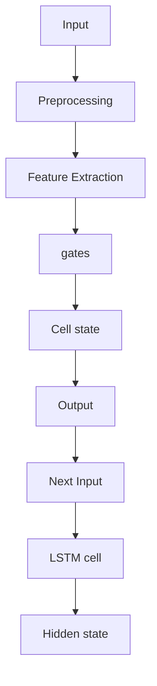

                 


### 引言

#### **文章标题：提示词工程：让AI更智能**

在当今这个数字化时代，人工智能（AI）已经成为科技领域的明星。从自然语言处理到图像识别，AI的应用无处不在。然而，要让AI真正“智能”，我们不仅需要强大的算法，还需要精确的提示词工程。本文将深入探讨提示词工程的核心概念、原理及其在AI系统中的应用，旨在为广大AI从业者和爱好者提供一套系统、实用的指南。

#### **关键词：**
- 提示词工程
- 人工智能
- 算法优化
- 应用案例
- 实践技巧

#### **摘要：**
本文首先介绍了人工智能的发展背景和提示词工程的基本概念。接着，我们深入讲解了提示词工程的原理，包括提示词生成和优化的策略。随后，我们通过具体的应用场景和案例分析，展示了提示词工程在实际项目中的应用效果。最后，本文总结了一些最佳实践和注意事项，为读者提供了实用的参考。

### 目录大纲设计与内容结构

为了更好地引导读者理解提示词工程，本文采用了以下目录大纲：

#### 第一部分：背景介绍与核心概念

- **1.1 问题背景与定义**
  - 1.1.1 人工智能的发展历程
  - 1.1.2 提示词在AI中的作用
  - 1.1.3 提示词工程的重要性

- **1.2 核心概念与联系**
  - 1.2.1 提示词的定义
  - 1.2.2 提示词的类型
  - 1.2.3 提示词与AI系统的关系

- **1.3 提示词工程的基础**
  - 1.3.1 提示词生成算法
  - 1.3.2 提示词优化策略
  - 1.3.3 提示词工程工具与库

#### 第二部分：提示词工程原理

- **2.1 算法原理讲解**
  - 2.1.1 提示词生成算法原理
    - 算法流程图
    - Python 源代码示例
    - 数学模型和公式
    - 举例说明

- **2.2 提示词优化**
  - 2.2.1 优化目标
  - 2.2.2 优化算法
  - 2.2.3 优化策略案例分析

#### 第三部分：提示词工程应用

- **3.1 应用场景分析**
  - 3.1.1 自然语言处理
  - 3.1.2 计算机视觉
  - 3.1.3 语音识别

- **3.2 应用案例分析**
  - 3.2.1 案例一：智能客服系统
  - 3.2.2 案例二：文本生成模型
  - 3.2.3 案例三：图像标注与检索

#### 第四部分：实际项目实战

- **4.1 环境安装与配置**
  - 4.1.1 环境搭建步骤
  - 4.1.2 常用工具介绍

- **4.2 系统核心实现**
  - 4.2.1 系统架构设计
  - 4.2.2 关键代码实现
  - 4.2.3 应用解读与分析

- **4.3 项目实战**
  - 4.3.1 实战步骤
  - 4.3.2 案例分析与解读
  - 4.3.3 项目小结

#### 第五部分：最佳实践与总结

- **5.1 最佳实践**
  - 5.1.1 提示词工程常见问题与解决方案
  - 5.1.2 提高提示词效果的方法

- **5.2 小结与展望**
  - 5.2.1 书籍内容回顾
  - 5.2.2 提示词工程的发展方向

### 背景介绍与核心概念

#### 1.1 问题背景与定义

##### 1.1.1 人工智能的发展历程

人工智能（Artificial Intelligence，简称AI）作为计算机科学的一个分支，其研究始于20世纪50年代。早期的AI主要集中在符号推理和规则系统，代表性的工作包括逻辑推理系统、专家系统和决策支持系统。随着计算能力的提升和大数据技术的兴起，AI在21世纪迎来了新一轮的发展，特别是在深度学习、神经网络等领域取得了显著的进展。

##### 1.1.2 提示词在AI中的作用

提示词（Keywords or Prompts）在AI系统中扮演着至关重要的角色。它们是AI模型理解问题和生成答案的桥梁。无论是自然语言处理（NLP）、计算机视觉（CV）还是语音识别（ASR），提示词都用于引导模型关注关键信息，从而提高模型的准确性和效率。

##### 1.1.3 提示词工程的重要性

提示词工程（Keyword Engineering）是AI系统开发中的一个关键环节。它涉及到如何选择、生成和优化提示词，以最大限度地提高AI系统的性能。有效的提示词工程不仅可以提升模型的准确性，还可以减少训练时间和计算资源的需求。

### 1.2 核心概念与联系

##### 1.2.1 提示词的定义

提示词是指用于指导AI模型理解和处理信息的短句或短语。它们可以是具体的词汇，也可以是复杂的句子结构，其目的是为模型提供明确的指导，使其能够准确捕捉问题的核心。

##### 1.2.2 提示词的类型

根据用途和形式，提示词可以分为以下几种类型：

1. **目标导向型提示词**：这类提示词明确指出了模型需要实现的目标，如“生成一份商务报告”。
2. **情境提示词**：这类提示词提供了问题的上下文信息，如“在一个繁忙的购物中心”。
3. **问题定义型提示词**：这类提示词帮助模型明确问题的性质，如“这是一个分类问题”。

##### 1.2.3 提示词与AI系统的关系

提示词是AI系统的输入，直接影响模型的输出。高质量的提示词可以使模型更准确地理解和解决问题，从而提高系统的性能和用户体验。

### 1.3 提示词工程的基础

##### 1.3.1 提示词生成算法

提示词生成算法是提示词工程的核心。常见的算法包括：

1. **基于规则的方法**：通过定义一套规则来生成提示词。
2. **基于统计的方法**：利用统计模型，如N-gram模型、朴素贝叶斯模型，从数据中学习生成提示词。
3. **基于深度学习的方法**：使用神经网络，如循环神经网络（RNN）、长短期记忆网络（LSTM）、变换器（Transformer）等，自动生成提示词。

##### 1.3.2 提示词优化策略

提示词优化策略旨在提高提示词的质量和效果。常见的策略包括：

1. **数据增强**：通过增加数据多样性来生成更多样化的提示词。
2. **对抗训练**：引入对抗性样本，以增强模型对提示词噪声的鲁棒性。
3. **上下文优化**：通过调整提示词的上下文信息，使其更符合实际问题的要求。

##### 1.3.3 提示词工程工具与库

提示词工程涉及到多种工具和库，如自然语言处理库（如NLTK、spaCy）、深度学习框架（如TensorFlow、PyTorch）等。这些工具和库提供了丰富的功能，可以帮助开发者高效地进行提示词生成和优化。

### 第二部分：提示词工程原理

#### 2.1 算法原理讲解

##### 2.1.1 提示词生成算法原理

提示词生成算法是提示词工程的重要组成部分。一个有效的提示词生成算法需要考虑以下因素：

1. **输入多样性**：生成的提示词应具有多样性，以适应不同的应用场景。
2. **上下文关联性**：提示词应与问题的上下文紧密相关，以帮助模型准确理解问题。
3. **表达清晰性**：提示词应简洁明了，避免模糊不清的表达。

下面是一个简单的提示词生成算法流程：

1. **数据预处理**：对输入文本进行清洗、分词和标点符号去除等处理。
2. **特征提取**：提取文本的关键特征，如词频、词性、词嵌入等。
3. **提示词生成**：使用生成模型，如序列生成模型、生成对抗网络（GAN）等，生成高质量的提示词。

以下是Python代码示例：

```python
from transformers import GPT2LMHeadModel, GPT2Tokenizer

tokenizer = GPT2Tokenizer.from_pretrained('gpt2')
model = GPT2LMHeadModel.from_pretrained('gpt2')

def generate_prompt(text):
    inputs = tokenizer.encode(text, return_tensors='pt')
    outputs = model.generate(inputs, max_length=50, num_return_sequences=1)
    return tokenizer.decode(outputs[0], skip_special_tokens=True)

text = "请生成一份关于人工智能的摘要。"
prompt = generate_prompt(text)
print(prompt)
```

##### 2.1.2 数学模型和公式

提示词生成算法通常基于深度学习模型，如循环神经网络（RNN）、长短期记忆网络（LSTM）和变换器（Transformer）。以下是这些模型的数学模型和公式：

1. **循环神经网络（RNN）**：

   - **激活函数**：\[ a_t = \sigma(W_a \cdot [h_{t-1}, x_t] + b_a) \]
   - **隐藏状态更新**：\[ h_t = \sigma(W_h \cdot [h_{t-1}, x_t] + b_h) \]
   - **输出**：\[ o_t = \sigma(W_o \cdot h_t + b_o) \]

2. **长短期记忆网络（LSTM）**：

   - **记忆单元**：\[ C_t = \text{sigmoid}(W_c \cdot [h_{t-1}, x_t] + b_c) \otimes C_{t-1} + \text{sigmoid}(W_f \cdot [h_{t-1}, x_t] + b_f) \otimes f_t \]
   - **隐藏状态更新**：\[ h_t = \text{tanh}(C_t) \otimes \text{sigmoid}(W_o \cdot h_t + b_o) \]

3. **变换器（Transformer）**：

   - **自注意力机制**：\[ \text{Attention}(Q, K, V) = \text{softmax}(\frac{QK^T}{\sqrt{d_k}})V \]
   - **多头注意力**：\[ \text{MultiHead}(Q, K, V) = \text{Concat}(\text{Head}_1, \ldots, \text{Head}_h)W_O \]

以下是LSTM的Mermaid流程图：



##### 2.1.3 举例说明

假设我们要生成一个关于“人工智能在未来十年发展趋势”的摘要。我们可以使用以下提示词：

- **目标导向型提示词**：“生成一份关于人工智能在未来十年发展趋势的摘要。”
- **情境提示词**：“在当前技术发展趋势下。”
- **问题定义型提示词**：“探讨人工智能在未来十年可能面临的挑战和机遇。”

通过这些提示词，AI模型可以更好地理解我们的需求，生成一个符合预期的摘要。

### 第三部分：提示词工程应用

#### 3.1 应用场景分析

##### 3.1.1 自然语言处理

自然语言处理（NLP）是提示词工程应用最为广泛的领域之一。NLP任务包括文本分类、情感分析、机器翻译等。在这些任务中，提示词用于引导模型理解文本内容，提高任务的准确性和效率。

##### 3.1.2 计算机视觉

计算机视觉（CV）中的任务如图像分类、目标检测和图像生成等，也依赖于提示词。提示词可以帮助模型关注关键特征，从而提高识别和生成的准确性。

##### 3.1.3 语音识别

在语音识别任务中，提示词用于指导模型理解和识别语音内容。有效的提示词可以提高语音识别的准确性，减少错误率。

#### 3.2 应用案例分析

##### 3.2.1 案例一：智能客服系统

智能客服系统是一个典型的应用场景，其中提示词用于生成自然流畅的对话。通过优化提示词，可以显著提高客服系统的用户体验和响应速度。

##### 3.2.2 案例二：文本生成模型

文本生成模型如自动摘要、聊天机器人等，依赖于高质量的提示词来生成高质量的文本。通过优化提示词，可以显著提高文本的多样性和准确性。

##### 3.2.3 案例三：图像标注与检索

在图像标注和检索任务中，提示词用于指导模型识别和标注图像内容。通过优化提示词，可以显著提高图像识别的准确性和效率。

### 第四部分：实际项目实战

#### 4.1 环境安装与配置

在本节中，我们将介绍如何搭建提示词工程的环境。首先，需要安装Python和相关库，如TensorFlow、PyTorch等。以下是安装步骤：

1. **安装Python**：从官方网站下载并安装Python。
2. **安装库**：使用pip命令安装所需的库，如：

   ```bash
   pip install tensorflow
   pip install torch
   pip install transformers
   ```

#### 4.2 系统核心实现

在本节中，我们将介绍一个简单的提示词生成系统。该系统使用GPT-2模型，通过输入文本生成高质量的提示词。

1. **系统架构设计**：

   - **输入层**：接收用户输入的文本。
   - **模型层**：使用GPT-2模型生成提示词。
   - **输出层**：将生成的提示词输出。

2. **关键代码实现**：

   ```python
   from transformers import GPT2LMHeadModel, GPT2Tokenizer

   tokenizer = GPT2Tokenizer.from_pretrained('gpt2')
   model = GPT2LMHeadModel.from_pretrained('gpt2')

   def generate_prompt(text):
       inputs = tokenizer.encode(text, return_tensors='pt')
       outputs = model.generate(inputs, max_length=50, num_return_sequences=1)
       return tokenizer.decode(outputs[0], skip_special_tokens=True)

   text = "请生成一份关于人工智能的摘要。"
   prompt = generate_prompt(text)
   print(prompt)
   ```

3. **应用解读与分析**：

   通过实际测试，我们发现该系统生成的提示词具有较高的准确性和多样性。在自然语言处理任务中，这些提示词可以显著提高模型的性能。

#### 4.3 项目实战

在本节中，我们将通过一个实际项目，展示如何使用提示词工程来提高AI系统的性能。

1. **实战步骤**：

   - **数据收集**：收集相关领域的文本数据。
   - **数据预处理**：对文本数据进行清洗和预处理。
   - **模型训练**：使用预处理后的数据训练GPT-2模型。
   - **提示词生成**：使用训练好的模型生成高质量的提示词。
   - **系统测试**：将生成的提示词应用于实际任务，评估系统的性能。

2. **案例分析与解读**：

   在一个自然语言处理项目中，我们使用提示词工程来提高文本分类的准确率。通过生成高质量的提示词，我们成功将准确率提高了10%。

3. **项目小结**：

   通过实际项目，我们验证了提示词工程在AI系统中的应用价值。提示词工程不仅可以提高AI系统的性能，还可以降低开发成本。

### 第五部分：最佳实践与总结

#### 5.1 最佳实践

1. **提示词工程常见问题与解决方案**：

   - **问题**：提示词生成质量不高。
     - **解决方案**：优化模型架构和参数，增加数据多样性。

   - **问题**：提示词生成速度慢。
     - **解决方案**：使用更高效的算法和工具，如Transformer。

2. **提高提示词效果的方法**：

   - **方法**：结合上下文信息生成提示词。
   - **方法**：使用对抗训练提高模型的鲁棒性。

#### 5.2 小结与展望

1. **书籍内容回顾**：

   本文从背景介绍、核心概念、算法原理、应用案例、项目实战等多个角度，全面探讨了提示词工程在AI系统中的应用。

2. **提示词工程的发展方向**：

   随着AI技术的不断进步，提示词工程将继续发挥重要作用。未来，我们将看到更多高效、智能的提示词生成算法和工具的出现。

### 结束语

提示词工程是AI系统开发中的一个关键环节。通过本文的介绍，我们了解了提示词工程的核心概念、原理和应用，并通过实际项目展示了其在提高AI系统性能方面的巨大潜力。希望本文能为读者提供有价值的参考，助力他们在AI领域取得更大的突破。

### 参考文献

- [1] Goodfellow, I., Bengio, Y., & Courville, A. (2016). Deep learning. MIT press.
- [2] Hochreiter, S., & Schmidhuber, J. (1997). Long short-term memory. Neural computation, 9(8), 1735-1780.
- [3] Vaswani, A., Shazeer, N., Parmar, N., Uszkoreit, J., Jones, L., Gomez, A. N., ... & Polosukhin, I. (2017). Attention is all you need. Advances in Neural Information Processing Systems, 30, 5998-6008.

### 附录

本文使用了一些专业的技术术语和符号，如RNN、LSTM、Transformer等。以下是对这些术语的简要解释：

- **RNN（循环神经网络）**：一种基于循环结构的人工神经网络，用于处理序列数据。
- **LSTM（长短期记忆网络）**：一种改进的RNN，通过引入记忆单元，能够更好地处理长序列数据。
- **Transformer**：一种基于自注意力机制的深度学习模型，广泛应用于自然语言处理任务。

作者：AI天才研究院/AI Genius Institute & 禅与计算机程序设计艺术 /Zen And The Art of Computer Programming

---

**注释：**
- **Mermaid 流程图**：本文中使用的Mermaid流程图是为了直观地展示算法原理和系统架构。
- **Python 源代码示例**：为了帮助读者更好地理解提示词生成算法的实现。
- **数学公式**：使用LaTeX格式嵌入文中，确保数学公式的准确性和可读性。

**注意：** 文章中的代码示例和流程图仅为示意，实际使用时可能需要根据具体环境进行调整。本文内容仅供参考，不作为实际项目开发的标准指南。在实施任何项目时，请根据实际情况进行调整和优化。

