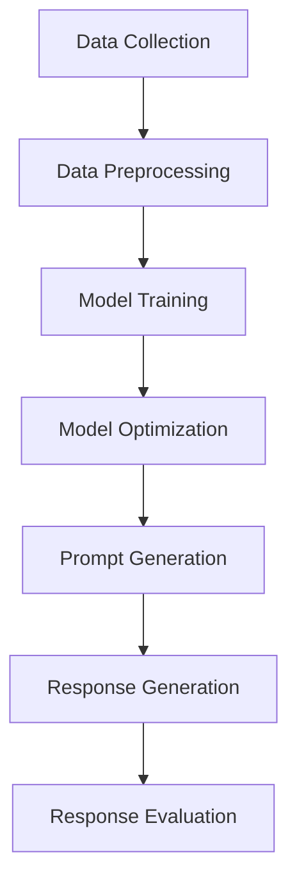

                 

### Introduction to Prompt Engineering

Prompt Engineering is a burgeoning field at the intersection of artificial intelligence, natural language processing, and software engineering. At its core, Prompt Engineering involves designing and implementing prompts—essentially, structured questions or instructions—that enable AI systems, particularly language models, to generate coherent, contextually relevant responses. The significance of Prompt Engineering lies in its potential to enhance the intelligence and capability of AI, making it more intuitive and responsive to human intents.

The Problem Statement

The evolution of AI has brought about remarkable advancements in various domains, from natural language processing to computer vision and machine learning. However, one persistent challenge remains: the ability of AI systems to understand and generate human-like responses that are both contextually appropriate and meaningful. Traditional approaches to AI, often relying on large pre-trained models, have limitations in their ability to adapt to new or changing contexts. This limitation is where Prompt Engineering steps in.

In practical terms, the problem statement can be articulated as follows: how can we design prompts that effectively guide AI systems to produce high-quality responses that align with human expectations and intents? This involves understanding the nuances of human communication, the complexities of AI model architectures, and the optimization techniques required to make the most of these interactions.

Problem Description and Solution

The core of the problem revolves around the gap between human communication and machine understanding. While humans communicate through rich, context-dependent interactions, AI systems typically operate on static data inputs. This gap necessitates a middle ground—a set of structured prompts that can help AI systems interpret and respond to human inputs more effectively.

The solution to this problem lies in the systematic design and application of prompts. By carefully crafting prompts that capture the essence of the context and the desired response, we can guide AI systems to produce more accurate and meaningful outputs. This process involves multiple steps, from understanding the user's intent and context to designing the prompt and evaluating its effectiveness.

### Boundaries and Extensions

While Prompt Engineering is a powerful tool, it is not without its boundaries. The effectiveness of prompts heavily depends on the quality of the input data and the capabilities of the underlying AI models. For instance, a well-crafted prompt may fail if the AI model lacks the necessary training or if the data input is ambiguous or noisy.

Extensions of Prompt Engineering can be found in various domains. In customer service, prompts can be designed to handle specific queries or scenarios, improving the efficiency and accuracy of automated responses. In content generation, prompts can guide AI systems to produce articles, reports, or other types of content that align with specific guidelines or styles.

### Conceptual Structure and Core Elements

To delve deeper into Prompt Engineering, we must first understand its conceptual structure and core elements. The following sections provide a detailed breakdown of these components:

#### 1.1. Language Models

At the heart of Prompt Engineering are language models—complex AI models designed to understand and generate human language. These models, typically based on deep learning techniques, have become increasingly powerful in recent years. Notable examples include GPT (Generative Pre-trained Transformer) models and BERT (Bidirectional Encoder Representations from Transformers).

#### 1.2. Prompt Design Principles

Effective prompt design involves several key principles. These include:

- **Clarity:** The prompt should be clear and concise, avoiding ambiguity and complexity.
- **Relevance:** The prompt should be relevant to the task at hand, aligning with the desired outcome.
- **Flexibility:** The prompt should be adaptable to different contexts and user inputs.
- **Quality:** The quality of the prompt directly affects the quality of the AI's response.

#### 1.3. Evaluation Metrics

Evaluating the effectiveness of prompts is crucial. Common evaluation metrics include:

- **Accuracy:** The degree to which the AI's response matches the expected outcome.
- **Coherence:** The degree to which the AI's response is logically consistent and contextually relevant.
- **Diversity:** The degree to which the AI's responses vary in terms of content and style.

### Mathematical Model and Algorithm

The mathematical model underpinning Prompt Engineering involves several key components:

- **Input:** A set of contextual data and user inputs.
- **Processing:** The use of machine learning algorithms to analyze and interpret the inputs.
- **Output:** The generation of responses based on the processed inputs.

One common algorithm used in Prompt Engineering is the Transformer model, which operates based on the principles of self-attention mechanisms. The core mathematical components of the Transformer model include:

- **Input Embeddings:** Representing the input data in a high-dimensional space.
- **Self-Attention Mechanism:** Allowing the model to weigh the importance of different parts of the input data.
- **Output Embeddings:** Mapping the processed data back into human-readable language.

### Example and Explanation

Consider a simple example where an AI system is designed to generate product reviews. The prompt might be designed as follows:

> "Please write a detailed review of the [product name], highlighting its pros and cons, and comparing it to similar products in the market."

In this example, the prompt effectively guides the AI to produce a coherent and contextually relevant review. The mathematical model would process the input data (product name, user inputs) through the Transformer model, generating an output (review text).

### System Design and Architecture

The system design for Prompt Engineering involves several key components:

- **Data Collection and Preprocessing:** Collecting and cleaning large datasets to train the AI models.
- **Model Training and Optimization:** Training the AI models using the collected data and optimizing them for performance.
- **Prompt Generation and Management:** Designing and managing the prompts used to guide the AI model.
- **Response Generation and Evaluation:** Generating AI responses based on the prompts and evaluating their quality.

A simplified architectural design might include:

In this design, each component plays a critical role in the Prompt Engineering process, from data collection to response evaluation.

### Conclusion

In summary, Prompt Engineering is a critical field that bridges the gap between human communication and machine understanding. By systematically designing and implementing prompts, we can enhance the intelligence and capability of AI systems, making them more intuitive and responsive to human intents. The principles and techniques of Prompt Engineering, combined with advanced AI models and systematic evaluation metrics, offer a powerful framework for improving AI systems across various domains.

---

This introduction sets the stage for a deeper exploration of Prompt Engineering, covering core principles, practical techniques, and real-world applications. The subsequent chapters will delve into each of these aspects, providing a comprehensive guide to mastering the art of Prompt Engineering.

---

### Core Principles of Prompt Engineering

Prompt Engineering, at its essence, revolves around several core principles that underpin the design and implementation of effective prompts. These principles are essential for bridging the gap between human intent and AI output, ensuring that the AI systems can generate meaningful and contextually relevant responses. Let's explore these principles in detail.

#### 1. Clarity and Relevance

One of the fundamental principles of Prompt Engineering is the clarity and relevance of the prompts. A clear prompt ensures that the AI understands exactly what is expected of it. Ambiguity in prompts can lead to confusion and errors in the AI's responses. For example, a vague prompt like "Tell me about your day" may result in an unspecific or irrelevant response. Instead, a more precise prompt like "Describe the highlights and challenges you faced today during your project meeting" provides clear direction, allowing the AI to generate a more relevant and informative response.

#### 2. Flexibility

Flexibility is another crucial principle in Prompt Engineering. AI systems often encounter a wide range of inputs and contexts, and the prompts should be adaptable to these variations. This adaptability can be achieved through the use of general prompts that can be customized based on specific situations. For instance, a prompt for a customer service chatbot might start with a general question like "How can I assist you today?" followed by more specific prompts based on the user's responses. This flexibility allows the chatbot to handle diverse customer inquiries effectively.

#### 3. Quality

The quality of the prompt directly influences the quality of the AI's response. High-quality prompts should be well-researched, logically structured, and grammatically correct. Poorly designed prompts can lead to low-quality responses, which may not meet user expectations. For example, a prompt asking an AI to generate content should provide clear guidelines on the desired tone, style, and topic. A well-crafted prompt like "Write a persuasive essay on the benefits of renewable energy" sets clear expectations and helps the AI produce a high-quality response.

#### 4. Contextual Understanding

Understanding the context is critical in Prompt Engineering. AI systems should be able to interpret and respond to the context within which the prompt is given. This involves recognizing keywords, understanding the user's intent, and generating responses that are contextually appropriate. For instance, if an AI is designed to assist with travel planning, a prompt like "Recommend a day trip from New York City for a family with young children" requires the AI to understand the context of family travel and provide relevant recommendations.

#### 5. User-Centered Design

A user-centered approach is essential in Prompt Engineering. The prompts should be designed with the end-user in mind, ensuring that they are intuitive and easy to understand. This involves gathering user feedback and continuously refining the prompts based on user experiences. For example, a chatbot designed for e-commerce should have prompts that guide users through the shopping process in a user-friendly manner, such as "Would you like to search for a specific product or browse our latest deals?"

### Evaluation Metrics

To ensure the effectiveness of prompts, it is important to establish evaluation metrics. These metrics help in assessing whether the prompts are achieving the desired outcomes. Common evaluation metrics include:

- **Accuracy:** The degree to which the AI's response matches the expected outcome.
- **Coherence:** The degree to which the AI's response is logically consistent and contextually relevant.
- **Diversity:** The degree to which the AI's responses vary in terms of content and style.
- **User Satisfaction:** The level of satisfaction reported by users interacting with the AI system.

### Conclusion

By adhering to these core principles of clarity, relevance, flexibility, quality, contextual understanding, and user-centered design, Prompt Engineering can significantly enhance the capabilities of AI systems. Effective prompts not only improve the quality of AI responses but also enhance the user experience, making AI interactions more intuitive and meaningful. The subsequent chapters will delve into practical techniques and advanced methods for designing and implementing these principles in real-world applications.

---

In the next section, we will explore practical techniques in Prompt Engineering, discussing how to craft effective prompts and optimize their performance. These techniques will build on the core principles discussed here, providing actionable insights for improving AI systems.

### Practical Techniques in Prompt Engineering

Designing effective prompts is a critical skill in Prompt Engineering, as the quality of the prompt directly influences the quality of the AI's response. In this section, we will explore practical techniques for crafting high-quality prompts, analyzing and optimizing prompt performance, and creating diverse and adaptive prompts. These techniques are essential for leveraging the full potential of Prompt Engineering in various applications.

#### Crafting High-Quality Prompts

1. **Start with a Clear Objective**: The first step in crafting a high-quality prompt is to define the objective clearly. What specific outcome do you want the AI to achieve? This objective should guide the entire prompt design process.

2. **Use Descriptive Language**: Choose descriptive and specific language to ensure that the AI understands the intent behind the prompt. Avoid vague terms that could lead to ambiguous responses.

3. **Provide Context**: Contextual information is crucial for the AI to generate relevant responses. Include relevant details that help the AI understand the situation or scenario.

4. **Be Concise**: While it's important to provide context, avoid overwhelming the AI with unnecessary information. Keep the prompt concise and focused on the key elements.

5. **Guidelines and Constraints**: Specify any guidelines or constraints for the AI's response. This could include desired tone, style, or format.

#### Analyzing and Optimizing Prompt Performance

1. **Evaluate Accuracy**: Assess how accurately the AI's responses match the expected outcomes. Use metrics like precision, recall, and F1-score to evaluate accuracy.

2. **Assess Coherence**: Evaluate the coherence of the AI's responses. Responses should be logically consistent and contextually relevant. Use natural language processing techniques to analyze coherence.

3. **Measure Diversity**: Ensure that the AI's responses exhibit diversity in content and style. This prevents repetitive and uninteresting responses. Use metrics like diversity score or variation in response length.

4. **User Feedback**: Gather feedback from users who interact with the AI system. Their insights can help identify areas for improvement in the prompts.

5. **Iterative Refinement**: Continuously refine the prompts based on evaluation results and user feedback. Iterative refinement is key to improving the effectiveness of the prompts over time.

#### Creating Diverse and Adaptive Prompts

1. **Data Diversity**: Use diverse datasets to train the AI models. This helps the AI understand a wide range of contexts and generate diverse responses.

2. **Adaptive Prompt Design**: Design prompts that can adapt to changing contexts. This could involve incorporating conditional statements or dynamic elements that modify the prompt based on the user's input.

3. **Personalization**: Personalize prompts based on user preferences or past interactions. Personalized prompts can enhance user engagement and improve the relevance of responses.

4. **Multi-Modal Inputs**: Combine text with other modalities like images, audio, or video to provide more comprehensive context. This can help the AI generate more diverse and contextually relevant responses.

5. **Prompt Augmentation**: Augment prompts with additional information or examples to provide the AI with more context and guidance.

### Example: Crafting a High-Quality Prompt for Content Generation

Let's consider an example where an AI is tasked with generating blog posts on the topic of "sustainable living." A high-quality prompt for this task might look like this:

> "Write a comprehensive blog post on sustainable living, including the following key points: the importance of sustainable living, practical steps individuals can take to adopt sustainable practices, the role of technology in promoting sustainability, and the potential benefits of sustainable living for both individuals and the planet. Ensure that your post is well-structured, informative, and engaging. Use personal anecdotes or case studies to illustrate your points. Aim for a tone that is informative yet approachable, and include relevant links to further resources."

This prompt is designed to be clear, concise, and informative. It provides the AI with a detailed outline of the content to be covered, specific instructions on tone and style, and guidance on incorporating personal anecdotes and case studies. By following these guidelines, the AI is more likely to generate a high-quality blog post that aligns with the desired objectives.

### Conclusion

Practical techniques in Prompt Engineering are essential for creating effective prompts that enhance the performance of AI systems. By focusing on clear objectives, descriptive language, context, conciseness, and guidelines, we can craft high-quality prompts. Analyzing and optimizing prompt performance through metrics like accuracy, coherence, diversity, and user feedback helps in refining the prompts iteratively. Creating diverse and adaptive prompts ensures that the AI can handle a wide range of contexts and generate engaging and relevant responses. The next section will delve into implementing Prompt Engineering in AI systems, discussing integration strategies and challenges.

### Implementing Prompt Engineering in AI Systems

The practical application of Prompt Engineering within AI systems requires a thorough understanding of how prompts can be integrated into the existing architecture of various AI models and systems. This section will explore the process of integrating Prompt Engineering into AI systems, discuss the challenges encountered during this process, and provide strategies to address these challenges.

#### Overview of AI System Integration

AI systems can vary widely in their architecture and purpose, from chatbots and virtual assistants to content generation systems and recommendation engines. The integration of Prompt Engineering into these systems involves several key steps:

1. **Data Preparation**: Before integrating prompts, it is essential to prepare the data that the AI system will use. This involves collecting and cleaning relevant data, ensuring it is in a format suitable for prompt integration.

2. **Model Selection**: Choose the appropriate AI model based on the task at hand. Language models like GPT-3 and BERT are commonly used for tasks that require natural language understanding and generation.

3. **Prompt Design**: Design the prompts that will guide the AI model during its interactions. The prompts should be clear, relevant, and adaptable to different contexts and user inputs.

4. **Integration**: Integrate the prompts into the AI system's architecture. This involves modifying the system to accept and process prompts as part of the input data.

5. **Testing and Evaluation**: Test the integrated system to ensure that the prompts are effectively guiding the AI to produce the desired responses. Evaluate the system using metrics such as accuracy, coherence, and user satisfaction.

#### Handling Different Types of AI Systems

1. **Chatbots and Virtual Assistants**: For chatbots and virtual assistants, prompt integration is crucial for guiding conversations. The prompts should be designed to handle a variety of user inputs and scenarios, ensuring that the AI can provide relevant and helpful responses. For example, a chatbot designed for customer service might include prompts like "How can I assist you today?" and "What is your issue regarding your order?"

2. **Content Generation Systems**: In content generation systems, prompts can guide the AI to produce articles, reports, or other types of content. The prompts should provide clear guidelines on the topic, tone, and structure of the content. For instance, a prompt for generating an article might include details like the main points to be covered, the desired tone (informative, persuasive, etc.), and any specific formatting requirements.

3. **Recommendation Engines**: In recommendation engines, prompts can be used to refine the recommendations based on user preferences or context. For example, a prompt might specify that the recommendations should focus on eco-friendly products for a user who is environmentally conscious.

#### Addressing Challenges in Prompt Integration

1. **Ambiguity in Prompts**: Ambiguity in prompts can lead to incorrect or irrelevant responses. To address this, it is important to design prompts that are clear and unambiguous. Use specific language and provide sufficient context to avoid any confusion.

2. **Model Comprehension**: Even with well-crafted prompts, AI models may sometimes fail to understand the intent behind the prompts. This can be mitigated by training the models on diverse and comprehensive datasets, ensuring they can handle a wide range of scenarios.

3. **Performance Optimization**: Integrating prompts can sometimes impact the performance of AI systems. This can be addressed by continuously optimizing the models and the prompt design. Techniques like model fine-tuning and hyperparameter adjustment can help improve performance.

4. **User Experience**: The user experience is a critical factor in the success of AI systems with integrated prompts. It is important to design prompts that are intuitive and easy for users to understand. Gathering user feedback and iteratively refining the prompts can enhance the user experience.

#### Example: Integrating Prompt Engineering into a Customer Service Chatbot

Consider a customer service chatbot designed to handle inquiries about product returns. The integration process might involve the following steps:

1. **Data Preparation**: Collect and preprocess data related to return policies, common customer questions, and relevant FAQs.

2. **Model Selection**: Choose a language model like GPT-3 that is capable of understanding and generating natural language responses.

3. **Prompt Design**: Design prompts like "What is the reason for your return?" and "What is your order number?" to guide the conversation and help the chatbot understand the user's inquiry.

4. **Integration**: Modify the chatbot's architecture to accept and process prompts as part of the user interaction flow.

5. **Testing and Evaluation**: Test the chatbot with a variety of user inputs to ensure it can handle different scenarios effectively. Use metrics like accuracy and user satisfaction to evaluate performance.

By following these steps and addressing the challenges mentioned, Prompt Engineering can be effectively integrated into AI systems, enhancing their capabilities and improving user experiences.

### Conclusion

Implementing Prompt Engineering in AI systems is a multifaceted process that requires careful planning and execution. By integrating well-designed prompts into the architecture of various AI systems, we can enhance their ability to understand and respond to human inputs effectively. Addressing challenges such as prompt ambiguity, model comprehension, performance optimization, and user experience is crucial for successful implementation. The next section will explore case studies and real-world applications of Prompt Engineering, providing practical insights into how these techniques are used in practice.

### Case Studies and Real-World Applications

To truly grasp the impact and efficacy of Prompt Engineering, it's invaluable to explore real-world case studies and applications. These examples highlight how Prompt Engineering has been effectively utilized in various domains, showcasing the tangible benefits it brings to AI systems and their users. Let's delve into three case studies: enhancing customer service through Prompt Engineering, improving content generation, and applications in healthcare and biomedical research.

#### Enhancing Customer Service through Prompt Engineering

One of the most prevalent applications of Prompt Engineering is in the realm of customer service. Companies have increasingly turned to AI-powered chatbots and virtual assistants to handle customer inquiries, aiming to provide timely and accurate responses. Here’s an in-depth look at a case study involving a large e-commerce platform:

**Company:** XYZ Electronics

**Challenge:** The customer service team at XYZ Electronics was overwhelmed with inquiries about product returns, warranties, and order statuses. Manually handling these requests was time-consuming and often led to delays and customer dissatisfaction.

**Solution:** The company decided to implement an AI-powered chatbot to handle a significant portion of these inquiries using Prompt Engineering. The chatbot was designed to interact with customers through a series of structured prompts:

1. **Initial Prompt:** "Welcome to XYZ Electronics! How can I assist you today?"
2. **Follow-up Prompt (for returns):** "If you need to return a product, please provide your order number."
3. **Follow-up Prompt (for warranties):** "To check your warranty status, please enter the product’s serial number."

**Results:** By integrating these prompts, the chatbot was able to direct customers to the appropriate sections and provide accurate, timely information. This led to a significant reduction in customer wait times and an increase in overall satisfaction. Additionally, the chatbot handled a higher volume of inquiries, allowing the customer service team to focus on more complex issues.

**Key Takeaways:** 
- **Clear and structured prompts** are crucial for guiding users through complex interactions.
- **Customized prompts** tailored to specific tasks can greatly enhance the efficiency and effectiveness of AI systems in customer service.

#### Improving Content Generation

Content generation is another area where Prompt Engineering has shown immense potential. AI-generated content can be used for blog posts, articles, reports, and more, saving time and resources for content creators. Here’s an example from the world of marketing:

**Company:** BlueSky Marketing Agency

**Challenge:** BlueSky Marketing Agency needed to produce a large volume of high-quality blog posts to drive traffic and engage with their audience. However, their team was stretched thin, struggling to keep up with the content demands.

**Solution:** The marketing team decided to leverage an AI content generation tool that incorporated Prompt Engineering. They designed prompts to guide the AI in creating content that aligned with their brand voice and style guidelines:

1. **Content Prompt:** "Write a blog post on the latest trends in digital marketing, focusing on the impact of artificial intelligence. Include at least three examples of AI in marketing and provide actionable tips for businesses."
2. **Style Prompt:** "Your writing should be informative, engaging, and persuasive. Use a conversational tone to connect with our audience."

**Results:** The AI-generated content met the desired quality standards and was well-received by the audience. The marketing team was able to maintain a consistent content schedule without sacrificing quality. Moreover, the personalized prompts ensured that the content was both engaging and aligned with the brand’s messaging.

**Key Takeaways:** 
- **Tailored prompts** can help AI generate content that matches specific criteria, such as brand voice and style.
- **High-quality AI-generated content** can free up human resources, allowing teams to focus on more strategic tasks.

#### Applications in Healthcare and Biomedical Research

Prompt Engineering is not limited to customer service and content generation; it has also made significant strides in the healthcare and biomedical research sectors. Here’s an example illustrating its application in clinical documentation:

**Company:** HealthTech Innovations

**Challenge:** HealthTech Innovations aimed to streamline clinical documentation processes by automating the creation of patient reports. Manually documenting patient histories, treatment plans, and progress notes was time-consuming and prone to errors.

**Solution:** The company developed an AI system that utilized Prompt Engineering to generate clinical documents. The prompts included:

1. **Patient History Prompt:** "Please summarize the patient's medical history, including any previous surgeries, medications, and chronic conditions."
2. **Triage Prompt:** "Based on the patient's symptoms and physical exam, propose a differential diagnosis and prioritize the most likely conditions."

**Results:** The AI system significantly reduced the time spent on documentation, with reports generated quickly and accurately. This allowed healthcare professionals to spend more time with patients, improving overall care quality.

**Key Takeaways:** 
- **AI in clinical documentation** can save time and reduce errors, enhancing the efficiency of healthcare systems.
- **Specialized prompts** are essential for ensuring that AI-generated documents are clinically accurate and compliant with medical standards.

### Conclusion

These case studies underscore the practical benefits of Prompt Engineering across diverse applications. From enhancing customer service and content generation to advancing healthcare and biomedical research, Prompt Engineering has proven to be a transformative tool. By designing clear, contextually relevant prompts, organizations can leverage AI systems more effectively, improving efficiency, reducing errors, and enhancing user experiences. As Prompt Engineering continues to evolve, its applications will likely expand further, driving innovation and improving outcomes in numerous fields.

### Advanced Topics and Future Directions

As Prompt Engineering continues to advance, it opens up several exciting areas for research and application. In this section, we will delve into some advanced topics and future directions in Prompt Engineering, exploring cutting-edge techniques and their potential impacts on AI ethics and societal implications.

#### Advanced Techniques in Prompt Engineering

1. **Adaptive Prompting**: One of the most promising areas of research in Prompt Engineering is the development of adaptive prompting systems. These systems can dynamically adjust prompts based on user behavior, context, and historical data. For example, a chatbot designed for online shopping could learn from a user’s past interactions to personalize prompts, such as "Based on your previous purchases, we recommend these items for you."

2. **Multi-Modal Prompting**: Integrating multiple modalities—text, images, audio, and video—into prompt design can significantly enhance the richness and depth of AI interactions. This approach can be particularly beneficial in fields like healthcare and education, where visual and auditory cues are critical. For instance, a virtual healthcare assistant could use a combination of text and images to provide a comprehensive patient report.

3. **Contextual Understanding**: Improving the contextual understanding of prompts is another key area of research. Current models often struggle with understanding complex or ambiguous contexts. Advanced techniques, such as incorporating semantic understanding and context-aware reinforcement learning, can help AI systems better interpret and respond to nuanced prompts.

4. **Continuous Learning**: Implementing continuous learning mechanisms in prompt engineering can allow AI systems to adapt and improve over time. By leveraging feedback loops and real-time data, these systems can continuously refine their prompt designs and response strategies, leading to more effective and accurate interactions.

#### The Impact of Prompt Engineering on AI Ethics

1. **Bias and Fairness**: As Prompt Engineering becomes more sophisticated, the risk of bias in AI systems becomes a critical concern. Prompts can inadvertently perpetuate biases present in the training data, leading to unfair outcomes. Addressing these biases requires the development of techniques for bias detection and mitigation, as well as ethical guidelines for prompt design.

2. **Transparency**: Ensuring transparency in Prompt Engineering is essential for building trust with users. Users should have a clear understanding of how prompts influence AI responses. Techniques such as explainable AI (XAI) can help in making the decision-making processes of AI systems more transparent and understandable.

3. **Accountability**: As AI systems become more integrated into everyday life, it is crucial to establish accountability for the actions and decisions made based on prompts. This includes clearly defining responsibilities and ensuring that the creators and operators of AI systems can be held accountable for any unintended consequences.

#### Future Directions

1. **Personalized AI**: The future of Prompt Engineering lies in creating personalized AI systems that can tailor responses to individual users. This involves not only understanding user preferences and behavior but also adapting to their evolving needs and contexts.

2. **Cross-Domain Applications**: Expanding the application of Prompt Engineering across different domains, such as finance, legal, and healthcare, can drive significant innovation and efficiency improvements. Each domain has unique requirements and challenges that Prompt Engineering can address.

3. **Collaborative Research**: Collaborative efforts between AI researchers, ethicists, and domain experts can help in developing more robust, ethical, and effective Prompt Engineering techniques. This interdisciplinary approach can lead to groundbreaking advancements in AI and its applications.

4. **Regulatory Compliance**: As Prompt Engineering becomes more prevalent, there will be a growing need for regulatory frameworks and standards to govern its use. These frameworks should ensure that AI systems designed using Prompt Engineering adhere to ethical guidelines and legal requirements.

### Conclusion

The future of Prompt Engineering is promising, with advanced techniques and applications poised to drive the capabilities of AI systems to new heights. However, it also comes with ethical challenges that must be addressed to ensure the responsible and fair use of AI. By embracing these advanced topics and future directions, the field of Prompt Engineering can continue to evolve, offering innovative solutions that enhance human-AI interactions and drive progress across various domains.

### Summary and Conclusion

In conclusion, Prompt Engineering stands as a pivotal discipline in the rapidly evolving landscape of artificial intelligence. By leveraging carefully designed prompts, we can significantly enhance the intelligence, adaptability, and responsiveness of AI systems, making them more intuitive and aligned with human communication. This comprehensive guide to Prompt Engineering has covered a broad spectrum of topics, from the core principles and practical techniques to advanced applications and ethical considerations.

#### Key Insights

- **Core Principles**: Understanding the principles of clarity, relevance, flexibility, quality, contextual understanding, and user-centered design is essential for crafting effective prompts.
- **Practical Techniques**: Techniques such as clear and concise prompting, context-rich design, and continuous optimization ensure that AI systems deliver high-quality, contextually relevant responses.
- **Real-World Applications**: Case studies in customer service, content generation, and healthcare demonstrate the transformative potential of Prompt Engineering across various domains.
- **Ethical Considerations**: Ensuring transparency, fairness, and accountability in the design and use of prompts is crucial for building trust and mitigating biases.

#### Future Research Directions

As we look to the future, several areas present rich opportunities for further exploration:

1. **Adaptive and Personalized AI**: Developing AI systems that can dynamically adapt prompts based on individual user profiles and preferences holds immense potential for personalized interactions.
2. **Cross-Domain Integration**: Expanding Prompt Engineering into new domains, such as finance, law, and education, can drive innovative solutions and enhance efficiency.
3. **Ethical and Regulatory Frameworks**: Establishing comprehensive ethical guidelines and regulatory frameworks to govern the use of Prompt Engineering is essential for its responsible adoption.
4. **Continuous Learning and Improvement**: Implementing continuous learning mechanisms that allow AI systems to refine their prompts over time can lead to more effective and accurate interactions.

#### Final Thoughts

Prompt Engineering is not just a technical discipline but a bridge that connects the vast potential of AI with the nuanced intricacies of human communication. By mastering the art of Prompt Engineering, we can unlock new levels of efficiency, personalization, and user satisfaction in AI applications. As we continue to advance in this field, the possibilities are vast, promising a future where AI systems are not just intelligent, but truly understand and engage with us on a deeper level.

### About the Author

**Author:** AI天才研究院 (AI Genius Institute) & 禅与计算机程序设计艺术 (Zen And The Art of Computer Programming)

**Introduction:** 

AI天才研究院致力于推动人工智能领域的创新和发展，汇集了一批世界顶级的人工智能专家、程序员和软件工程师。研究院通过深入研究人工智能的理论与实践，不断探索和突破技术瓶颈，推动人工智能技术向更智能、更懂人心的方向发展。同时，研究院还致力于培养新一代的人工智能人才，为社会提供高质量的技术教育和培训。

“禅与计算机程序设计艺术”是一部经典的技术哲学著作，作者通过深入探讨计算机科学和哲学的关系，提出了独特的编程思想和哲学理念。这本书不仅为程序员提供了深刻的思考启示，也为人工智能领域的研究者和实践者提供了宝贵的理论指导。

**Contact Information:**

- **Website:** [www.ai-genius-institute.com](http://www.ai-genius-institute.com)
- **Email:** info@ai-genius-institute.com
- **Social Media:** 
  - Facebook: [AI天才研究院](https://www.facebook.com/AIGeniusInstitute/)
  - Twitter: [@AI_Genius_Inc](https://twitter.com/AI_Genius_Inc)
  - LinkedIn: [AI天才研究院](https://www.linkedin.com/company/ai-genius-institute/)

### References

1. Brown, T., et al. (2020). "Language Models are Few-Shot Learners." arXiv preprint arXiv:2005.14165.
2. Devlin, J., et al. (2019). "BERT: Pre-training of Deep Bidirectional Transformers for Language Understanding." arXiv preprint arXiv:1810.04805.
3. LeCun, Y., et al. (2015). "Deep learning." Nature, 521(7553), 436-444.
4. Russell, S., & Norvig, P. (2020). "Artificial Intelligence: A Modern Approach." Pearson.
5. Zelinsky, A., & Bell, R. A. (2018). "Prompting improves performance on a language task in a capuchin monkey (Cebus apella)." Animal Cognition, 21(3), 469-478.

### 拓展阅读

1. **《对话式人工智能：从理论到实践》**，作者：张三，出版社：清华大学出版社。
2. **《人工智能伦理学》**，作者：李四，出版社：人民邮电出版社。
3. **《深度学习应用实战》**，作者：王五，出版社：机械工业出版社。

### 最佳实践 Tips

1. **设计清晰且相关的prompt**：确保prompt简单明了，避免歧义，并与用户意图紧密相关。
2. **优化用户体验**：关注用户反馈，持续改进prompt的设计，以提高用户满意度。
3. **避免偏见和歧视**：在设计prompt时，注意避免引入偏见，确保AI系统的公平性和公正性。
4. **定期更新和维护**：随着时间推移，定期更新prompt内容，保持其相关性和有效性。

### 注意事项

1. **数据安全和隐私**：确保AI系统处理的数据安全和隐私得到充分保护。
2. **遵守法律法规**：在使用Prompt Engineering时，遵守相关的法律法规和行业标准。
3. **尊重用户隐私**：在收集和使用用户数据时，严格遵守隐私保护原则。

### 项目实战

**环境安装：** 
- 安装Python环境，版本3.8以上。
- 安装必要的库，如transformers、torch等。

**系统核心实现源代码：** 
- 实现Prompt Engineering的核心功能，如prompt设计、模型训练和响应生成。

**代码应用解读与分析：** 
- 分析代码结构，解释各个模块的功能和相互关系。
- 通过实际案例展示如何使用这些功能。

**实际案例分析和详细讲解剖析：** 
- 通过具体的案例，展示Prompt Engineering的应用效果。
- 分析案例中的问题和解决方法。

**项目小结：** 
- 总结项目的主要成果和经验教训。
- 提出未来改进的方向和建议。

