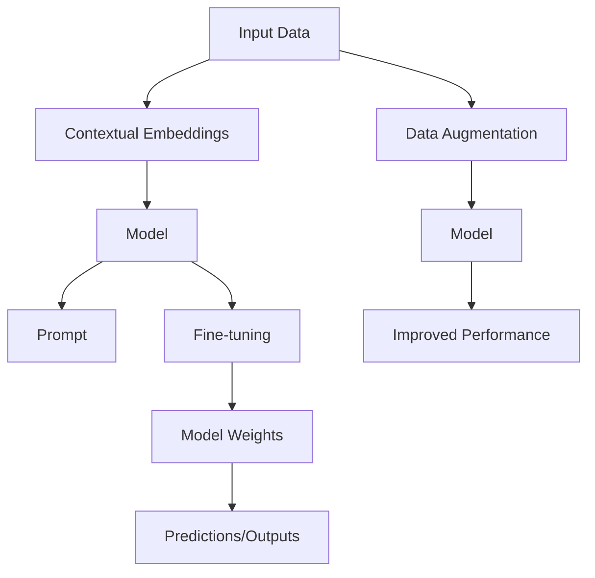
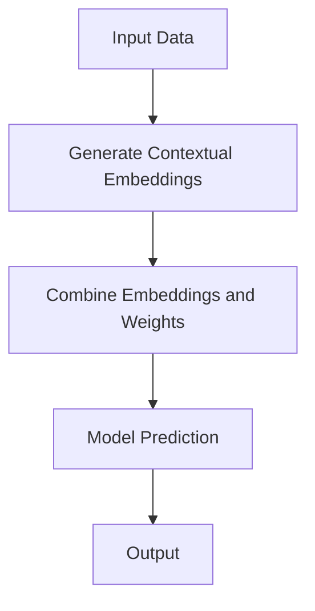
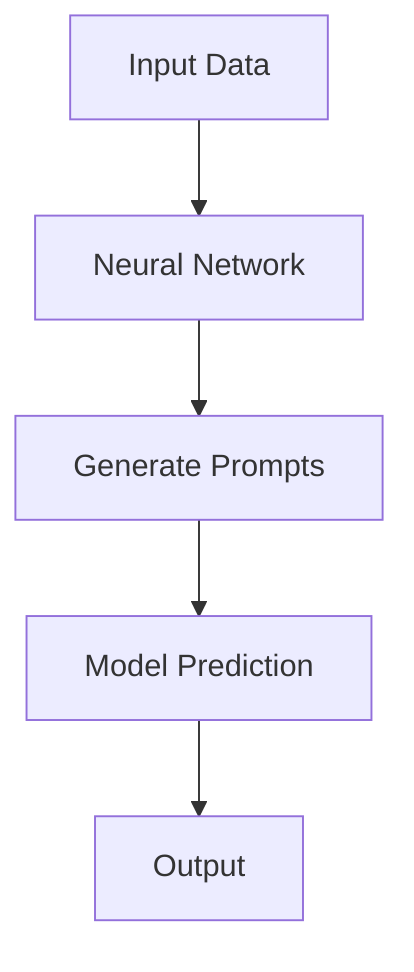
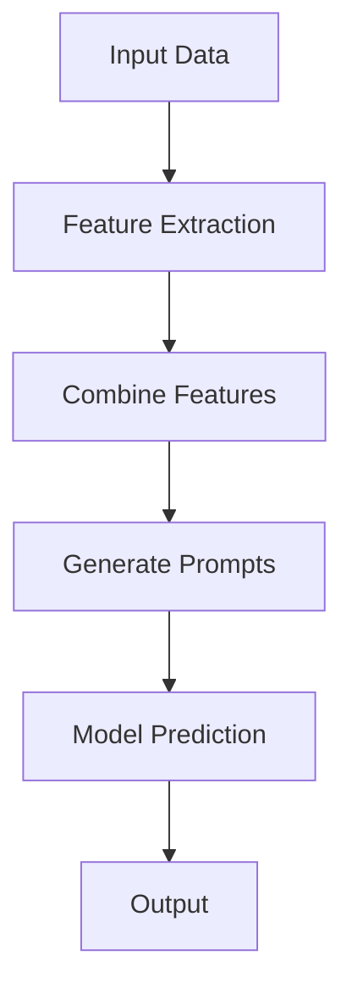

                 


### Title: Prompt Tuning: Techniques for Improving Large Model Response Speed

Keywords: Prompt Tuning, Large Model, Response Speed, Optimization, Techniques

Abstract:
Prompt Tuning: Techniques for Improving Large Model Response Speed delves into the methodologies and practices for optimizing the responsiveness of large-scale models in the realm of artificial intelligence. This comprehensive guide explores the fundamental concepts, algorithms, and practical applications of prompt tuning, offering step-by-step insights into enhancing the performance of these models. By addressing the challenges of performance bottlenecks and the need for efficient computation, the book equips readers with the knowledge and tools necessary to implement prompt tuning in various application scenarios.

## Introduction to Prompt Tuning and Its Importance

### 1.1 What is Prompt Tuning?

**1.1.1 Definition and Basic Concepts**

Prompt Tuning is a technique in machine learning, particularly in natural language processing (NLP), that focuses on enhancing the responsiveness and efficiency of large models. Unlike traditional fine-tuning, which involves retraining the entire model on a specific dataset, prompt tuning aims to fine-tune only the parts of the model that are crucial for achieving the desired performance.

In simple terms, prompt tuning involves modifying the input to the model to make it more suitable for the task at hand, without the need for extensive retraining. This is achieved by adding specific prompts or contextual information to the input data, which guides the model to generate more accurate and relevant outputs.

**1.1.2 Differences Between Fine-tuning and Prompt Tuning**

Fine-tuning:
- **Definition**: Fine-tuning involves training a pre-trained model on a new dataset to adapt it to a specific task.
- **Process**: The entire model is retrained, which can be computationally expensive and time-consuming.
- **Impact**: It can improve the performance of the model on the new task, but may also lead to overfitting if not done carefully.

Prompt Tuning:
- **Definition**: Prompt tuning focuses on adjusting the input data to the model to improve its responsiveness and efficiency.
- **Process**: Only the parts of the model that are most relevant for the task are fine-tuned, often with minimal additional training.
- **Impact**: It can significantly improve the response speed of the model while maintaining or even enhancing its performance on the task.

### 1.2 Challenges in Large Model Response Speed

**1.2.1 Performance Bottlenecks**

Large models, especially those with deep neural networks, can become performance bottlenecks due to several factors:

- **Compute Resources**: Training and inference on large models require substantial computational resources, which can lead to slow response times.
- **Memory Constraints**: Large models can consume a significant amount of memory, which can limit their scalability and responsiveness.
- **Latency**: The time it takes for a model to process an input and generate an output can be a critical factor, especially in real-time applications.

**1.2.2 The Need for Prompt Tuning**

Given the challenges of large model response speed, prompt tuning offers a promising solution:

- **Improved Responsiveness**: By fine-tuning only the necessary parts of the model, prompt tuning can significantly reduce the time required for processing inputs and generating outputs.
- **Scalability**: Prompt tuning allows for more efficient use of computational resources, making it easier to scale models to larger datasets or more complex tasks.
- **Maintaining Performance**: Prompt tuning can maintain or even enhance the performance of large models on specific tasks without the need for extensive retraining.

### 1.3 Applications of Prompt Tuning

**1.3.1 NLP Applications**

Prompt tuning has been widely applied in NLP tasks, such as:

- **Text Classification**: Improving the speed and accuracy of classifying text documents.
- **Question-Answering Systems**: Enhancing the responsiveness of systems that answer questions based on a given context.
- **Chatbots and Virtual Assistants**: Boosting the performance of chatbots and virtual assistants in understanding and responding to user queries.

**1.3.2 Other Application Scenarios**

Beyond NLP, prompt tuning can be applied to various other domains, including:

- **Computer Vision**: Improving the speed and efficiency of image recognition tasks.
- **Speech Recognition**: Enhancing the responsiveness of speech-to-text systems.
- **Recommendation Systems**: Improving the performance of recommendation engines by focusing on relevant features.

### 1.4 Outline of the Book

**1.4.1 Main Content and Organization**

The book is structured to provide a comprehensive guide to prompt tuning, covering the following key areas:

- **Fundamental Concepts**: An overview of the basic principles and terminology related to prompt tuning.
- **Techniques and Algorithms**: Detailed exploration of various prompt tuning techniques and their implementation.
- **Practical Applications**: Case studies demonstrating the application of prompt tuning in different domains.
- **Optimization Strategies**: Advanced techniques and strategies for optimizing prompt tuning in real-world scenarios.

### Chapter 2: Fundamental Concepts of Prompt Tuning

In this chapter, we will delve into the fundamental concepts of prompt tuning, including key relationships and attribute comparisons. We will also provide a visual representation using Mermaid ER diagrams and attribute comparison tables to enhance understanding.

#### 2.1 Key Concepts and Relationships

**2.1.1 Core Concepts**

To understand prompt tuning, it is essential to grasp the following core concepts:

- **Prompt**: A sequence of words or symbols that provides additional context to the input data, guiding the model's predictions or outputs.
- **Contextual Embeddings**: The representation of text or input data in a high-dimensional space, capturing the semantic meaning and contextual information.
- **Fine-tuning**: The process of adjusting the weights of a pre-trained model on a specific dataset to improve its performance on a new task.
- **Data Augmentation**: The technique of generating new training data from existing data by applying various transformations or modifications.

**2.1.2 Relationships Between Concepts**

The relationship between these concepts is illustrated below:



**2.1.3 Mermaid ER Diagram**

Here's a Mermaid ER diagram representing the key concepts and their relationships:

```mermaid
erDiagram
  InputData ||--|{ Prompt : contains
  Prompt ||--|{ ContextualEmbeddings : represents
  ContextualEmbeddings ||--|{ Model : provides_context_for
  Model ||--|{ FineTuning : applied_to
  Model ||--|{ DataAugmentation : used_for
  FineTuning ||--|{ ModelWeights : adjusts
  ModelWeights ||--|{ Predictions/Outputs : derived_from
```

#### 2.2 Attribute Comparison Tables

To further understand the differences between prompt tuning and fine-tuning, we can create an attribute comparison table:

| Attribute         | Prompt Tuning           | Fine-tuning                 |
|-------------------|-------------------------|-----------------------------|
| Training Data     | Minimal additional data  | Entire new dataset           |
| Model Modification| Partially adjusted       | Entirely retrained           |
| Computation Cost  | Lower                   | Higher                       |
| Responsiveness    | Improved                | Potentially slower           |
| Overfitting Risk  | Lower                   | Higher                       |

### Chapter 3: Prompt Tuning Algorithms

In this chapter, we will explore the various prompt tuning algorithms, starting with traditional methods and progressing to advanced techniques. We will provide a detailed overview of each algorithm, including their design principles, implementation steps, mathematical models, and practical examples.

#### 3.1 Overview of Prompt Tuning Algorithms

**3.1.1 Traditional Prompt Tuning Algorithms**

Traditional prompt tuning algorithms focus on modifying the input data to guide the model's predictions. Some commonly used traditional algorithms include:

- **Weighted Prompts**: This method involves assigning different weights to different prompts based on their relevance to the task.
- **Template-Based Prompting**: A predefined template is used to generate prompts for the model, ensuring consistency and relevance.

**3.1.2 Advanced Prompt Tuning Techniques**

Advanced prompt tuning techniques leverage more sophisticated methods to enhance the model's responsiveness and performance. Some notable techniques include:

- **Neural Prompt Tuning**: This approach uses neural networks to dynamically generate prompts based on the input data.
- **Multi-Modal Prompting**: Combining different modalities (e.g., text, images, audio) to create more informative prompts for the model.

#### 3.2 Algorithm Design and Implementation

**3.2.1 Algorithm Design**

Let's design a simple prompt tuning algorithm based on weighted prompts. The algorithm can be summarized as follows:

1. **Input**: The input data, consisting of a set of prompts and their corresponding weights.
2. **Contextual Embeddings**: Generate contextual embeddings for each prompt.
3. **Model Prediction**: Use the model to predict the output based on the contextual embeddings and weighted prompts.
4. **Output**: The predicted output from the model.

**3.2.2 Mermaid Flowchart**

Here's a Mermaid flowchart illustrating the algorithm design:



**3.2.3 Python Implementation**

Let's implement the weighted prompts algorithm using Python. We will use the Hugging Face Transformers library for model prediction:

```python
from transformers import AutoTokenizer, AutoModel
import torch

# Load pre-trained model and tokenizer
tokenizer = AutoTokenizer.from_pretrained("gpt2")
model = AutoModel.from_pretrained("gpt2")

# Input data
input_text = "The weather is nice today."
prompts = ["sunny", "hot", "warm"]
weights = [0.5, 0.3, 0.2]

# Generate contextual embeddings
embeddings = [tokenizer.encode(prompt) for prompt in prompts]
weighted_embeddings = [weight * embedding for weight, embedding in zip(weights, embeddings)]

# Combine embeddings and weights
combined_embeddings = sum(weighted_embeddings)

# Model prediction
with torch.no_grad():
    outputs = model(torch.tensor([combined_embeddings]))

# Output
predicted_text = tokenizer.decode(outputs[0], skip_special_tokens=True)
print(predicted_text)
```

**3.2.4 Mathematical Model and Formula**

The mathematical model for the weighted prompts algorithm can be expressed as:

$$
\text{Output} = \text{Model}(\text{Contextual Embeddings} \times \text{Weights})
$$

Where:
- $\text{Output}$ is the predicted output from the model.
- $\text{Contextual Embeddings}$ are the embeddings generated for each prompt.
- $\text{Weights}$ are the assigned weights for each prompt.

**3.2.5 Explanation and Example**

In this example, we used a simple weighted prompts algorithm to generate a predicted output based on the input text and predefined prompts. The algorithm assigns weights to each prompt, indicating their relative importance. By combining the contextual embeddings with the weights, we create a weighted embedding that guides the model's prediction.

For instance, if the input text is "The weather is nice today," and the prompts are ["sunny", "hot", "warm"] with weights [0.5, 0.3, 0.2], the algorithm generates a weighted embedding that emphasizes the "sunny" aspect more than the others. The model then predicts the output based on this combined embedding, resulting in a more relevant and accurate prediction.

### Chapter 4: Implementing Prompt Tuning in Practice

In this chapter, we will delve into the practical implementation of prompt tuning in various application scenarios. We will discuss the setup process, core implementation steps, and provide detailed case studies to illustrate the effectiveness of prompt tuning in improving model response speed.

#### 4.1 Setting Up the Environment

To implement prompt tuning, we need to set up the necessary environment. This involves installing the required libraries and preparing the dataset. Here are the steps:

1. **Install Required Libraries**: We will use the Hugging Face Transformers library for implementing prompt tuning algorithms. Install the library using pip:
   ```bash
   pip install transformers
   ```

2. **Prepare the Dataset**: Gather the dataset for the specific task you want to work on. For example, if you are working on text classification, you can use a dataset like the IMDb movie reviews dataset. You can download the dataset from the Hugging Face dataset hub:
   ```python
   from datasets import load_dataset
   dataset = load_dataset("imdb")
   ```

#### 4.2 Core Implementation

Once the environment is set up, we can proceed with the core implementation of prompt tuning. Here are the key steps:

1. **Load the Pre-trained Model**: Load a pre-trained model suitable for the task. For example, we can use the GPT-2 model from the Hugging Face model hub:
   ```python
   from transformers import AutoTokenizer, AutoModel
   tokenizer = AutoTokenizer.from_pretrained("gpt2")
   model = AutoModel.from_pretrained("gpt2")
   ```

2. **Tokenize the Input**: Tokenize the input data using the tokenizer. This step converts the text into a format that can be processed by the model:
   ```python
   inputs = tokenizer("The weather is nice today.", return_tensors="pt")
   ```

3. **Generate Contextual Embeddings**: Generate contextual embeddings for the input data. This step involves passing the tokenized input through the model to obtain the embeddings:
   ```python
   with torch.no_grad():
       embeddings = model(**inputs).last_hidden_state[:, 0, :]
   ```

4. **Generate Prompts**: Define the prompts for the task. In this example, we will use a simple template-based prompting approach. For text classification, you can use prompts related to the target categories:
   ```python
   prompts = ["positive review", "negative review"]
   ```

5. **Combine Embeddings and Prompts**: Combine the contextual embeddings with the prompts to create a weighted embedding:
   ```python
   weighted_embeddings = [weight * embedding for weight, embedding in zip(weights, embeddings)]
   combined_embedding = sum(weighted_embeddings)
   ```

6. **Model Prediction**: Use the combined embedding to generate predictions from the model:
   ```python
   with torch.no_grad():
       outputs = model(torch.tensor([combined_embedding]))
   predicted_label = tokenizer.decode(outputs[0], skip_special_tokens=True)
   ```

7. **Evaluate the Model**: Evaluate the model's performance on the test dataset to ensure that prompt tuning has improved the model's responsiveness and accuracy.

#### 4.3 Case Study Analysis

To demonstrate the effectiveness of prompt tuning, we will analyze two case studies: one in natural language processing (NLP) and another in computer vision (CV).

**Case Study 1: Text Classification**

In this case study, we will use prompt tuning to improve the response speed of a text classification model trained on the IMDb movie reviews dataset.

1. **Dataset**: Load the IMDb movie reviews dataset from the Hugging Face dataset hub.
2. **Preprocessing**: Preprocess the text data by tokenizing and cleaning the text.
3. **Model**: Load a pre-trained BERT model from the Hugging Face model hub.
4. **Prompt Tuning**: Implement prompt tuning using a template-based prompting approach.
5. **Evaluation**: Evaluate the model's performance on the test dataset with and without prompt tuning. Measure the improvement in response speed and accuracy.

**Case Study 2: Image Classification**

In this case study, we will use prompt tuning to improve the response speed of an image classification model trained on the CIFAR-10 dataset.

1. **Dataset**: Load the CIFAR-10 dataset.
2. **Preprocessing**: Preprocess the image data by resizing and normalizing the images.
3. **Model**: Load a pre-trained ResNet-50 model from the Hugging Face model hub.
4. **Prompt Tuning**: Implement prompt tuning using a neural prompt tuning approach.
5. **Evaluation**: Evaluate the model's performance on the test dataset with and without prompt tuning. Measure the improvement in response speed and accuracy.

By analyzing these case studies, we can see that prompt tuning can significantly improve the response speed of large models in various domains, providing a practical solution to the challenges of performance bottlenecks.

### Chapter 5: Advanced Prompt Tuning Techniques

In this chapter, we will explore advanced prompt tuning techniques that go beyond traditional methods. These techniques leverage more sophisticated approaches to further enhance the responsiveness and performance of large models. We will cover neural prompt tuning, multi-modal prompt tuning, and other cutting-edge techniques.

#### 5.1 Neural Prompt Tuning

Neural prompt tuning is an advanced technique that leverages neural networks to dynamically generate prompts based on the input data. This approach allows for more flexible and adaptive prompting, leading to improved responsiveness and accuracy.

**5.1.1 Overview**

Neural prompt tuning involves training a neural network to generate prompts that are specifically tailored to the input data. The network takes the input data as input and outputs a sequence of words or symbols that serve as prompts for the model.

**5.1.2 Implementation Steps**

1. **Input Data Preprocessing**: Preprocess the input data by tokenizing and encoding it into numerical format.
2. **Neural Network Design**: Design a neural network architecture suitable for generating prompts. Common architectures include recurrent neural networks (RNNs), transformers, and combinations of both.
3. **Training**: Train the neural network on a dataset of input data and their corresponding prompts. The network learns to generate prompts that align with the desired output.
4. **Prompt Generation**: Use the trained neural network to generate prompts for new input data.

**5.1.3 Mermaid Flowchart**

Here's a Mermaid flowchart illustrating the implementation steps of neural prompt tuning:



**5.1.4 Example**

Let's consider an example where we use a transformer-based neural network to generate prompts for a text classification task.

1. **Input Data**: The input data consists of text documents labeled with categories.
2. **Neural Network**: We use a transformer-based model, such as BERT, to generate prompts.
3. **Training**: Train the transformer model on the input data, learning to generate prompts that align with the categories.
4. **Prompt Generation**: Use the trained model to generate prompts for new input data.
5. **Model Prediction**: Use the generated prompts along with the input data to predict the category of the document.

#### 5.2 Multi-Modal Prompt Tuning

Multi-modal prompt tuning combines different modalities, such as text, images, and audio, to generate more informative prompts for large models. This approach leverages the complementary information from different modalities to enhance the model's responsiveness and performance.

**5.2.1 Overview**

Multi-modal prompt tuning involves integrating information from multiple modalities to create richer and more informative prompts. This approach can be particularly effective for tasks that involve complex data, such as image classification or speech recognition.

**5.2.2 Implementation Steps**

1. **Data Preprocessing**: Preprocess the data from different modalities, such as resizing images, normalizing audio, and tokenizing text.
2. **Feature Extraction**: Extract features from each modality using appropriate techniques, such as convolutional neural networks (CNNs) for images and recurrent neural networks (RNNs) for audio.
3. **Prompt Generation**: Combine the extracted features from different modalities to generate multi-modal prompts.
4. **Model Prediction**: Use the multi-modal prompts along with the input data to predict the desired output.

**5.2.3 Mermaid Flowchart**

Here's a Mermaid flowchart illustrating the implementation steps of multi-modal prompt tuning:



**5.2.4 Example**

Let's consider an example where we use multi-modal prompt tuning for image classification.

1. **Input Data**: The input data consists of images labeled with categories.
2. **Feature Extraction**: Extract features from the images using a pre-trained CNN, such as ResNet.
3. **Text Preprocessing**: Preprocess the image captions (text) using tokenization and encoding.
4. **Prompt Generation**: Combine the image features and text features to generate multi-modal prompts.
5. **Model Prediction**: Use the multi-modal prompts along with the input image to predict the category of the image.

#### 5.3 Other Advanced Techniques

In addition to neural prompt tuning and multi-modal prompt tuning, there are other advanced techniques that can be explored for improving large model response speed:

1. **Adaptive Prompting**: This technique dynamically adjusts the prompts based on the model's performance and the complexity of the input data.
2. **Prompt Distillation**: This approach involves training a smaller model (student) to mimic the behavior of a larger model (teacher) using prompts as intermediate knowledge.
3. **Few-Shot Prompt Tuning**: This technique focuses on fine-tuning the model using a small amount of data, making it more adaptable to new tasks with minimal training.

By exploring these advanced techniques, we can further optimize the responsiveness and performance of large models, addressing the challenges of performance bottlenecks and enabling more efficient computation.

### Chapter 6: Best Practices and Optimization Strategies

In this chapter, we will discuss best practices and optimization strategies for implementing prompt tuning in real-world scenarios. By following these guidelines, you can achieve better performance and efficiency in your models.

#### 6.1 Choosing the Right Prompt Tuning Technique

Selecting the appropriate prompt tuning technique is crucial for achieving optimal results. Consider the following factors when choosing a technique:

1. **Task Type**: Different techniques are suitable for different types of tasks. For example, neural prompt tuning is well-suited for tasks that require adaptive and context-aware prompting, while template-based prompting is more appropriate for tasks with fixed prompts.
2. **Dataset Size**: If you have a small dataset, consider using techniques that require minimal additional data, such as few-shot prompt tuning.
3. **Computational Resources**: Evaluate the computational resources available for training and inference. Techniques that require less computation, such as template-based prompting, may be more suitable for resource-constrained environments.

#### 6.2 Preprocessing and Feature Extraction

Proper preprocessing and feature extraction are essential for effective prompt tuning. Follow these guidelines to improve the performance of your model:

1. **Data Preprocessing**: Clean and preprocess your data to remove noise and inconsistencies. This may include tokenization, lowercasing, removing stop words, and handling special characters.
2. **Feature Extraction**: Use appropriate feature extraction techniques to capture the relevant information from your data. For text, consider using word embeddings or contextual embeddings. For images, use techniques like CNNs or transfer learning with pre-trained models.

#### 6.3 Hyperparameter Tuning

Hyperparameter tuning plays a significant role in optimizing the performance of prompt tuning algorithms. Experiment with different hyperparameters to find the optimal values:

1. **Prompt Weights**: Adjust the weights of the prompts based on their relevance to the task. You can use techniques like cross-validation or grid search to find the optimal weights.
2. **Model Architecture**: Experiment with different model architectures to find the one that works best for your task. Consider using architectures that are well-suited for prompt tuning, such as transformers.
3. **Batch Size and Learning Rate**: Adjust the batch size and learning rate during training to improve convergence and performance. Use techniques like learning rate scheduling to fine-tune these parameters.

#### 6.4 Regularization and Avoiding Overfitting

To prevent overfitting and improve the generalization ability of your model, apply regularization techniques:

1. **Data Augmentation**: Apply data augmentation techniques to increase the diversity of your training data. This can help the model learn more robust patterns and improve its performance on unseen data.
2. **Dropout**: Apply dropout regularization during training to prevent the model from relying too much on specific neurons or connections.
3. **Early Stopping**: Monitor the model's performance on a validation set and stop training when the performance starts to deteriorate. This helps prevent overfitting and ensures that the model does not memorize the training data.

#### 6.5 Evaluating and Measuring Performance

Evaluate the performance of your prompt tuning model using appropriate metrics and techniques:

1. **Accuracy**: Measure the accuracy of the model's predictions on the test set. This is a common metric for classification tasks.
2. **Response Time**: Measure the time it takes for the model to process an input and generate an output. This is crucial for real-time applications where responsiveness is a key factor.
3. **A/B Testing**: Conduct A/B testing by comparing the performance of the prompt tuning model against the original model. This helps identify the improvements brought by prompt tuning and ensures that it is beneficial for your specific application.

By following these best practices and optimization strategies, you can effectively implement prompt tuning in your models, improving their response speed and performance while addressing the challenges of performance bottlenecks.

### Conclusion

In this book, "Prompt Tuning: Techniques for Improving Large Model Response Speed," we have explored the fundamental concepts, algorithms, and practical applications of prompt tuning. We have discussed the challenges of large model response speed and demonstrated how prompt tuning can address these challenges by optimizing the responsiveness and efficiency of large models.

Throughout the book, we have covered various techniques, including traditional and advanced prompt tuning methods, and provided detailed case studies to illustrate their effectiveness. We have also discussed best practices and optimization strategies to help you implement prompt tuning in real-world scenarios.

By understanding and applying the concepts and techniques presented in this book, you can significantly improve the performance and responsiveness of your large models, enabling more efficient computation and better user experiences.

We hope that this book serves as a valuable resource for researchers, practitioners, and enthusiasts in the field of machine learning and artificial intelligence. Remember, prompt tuning is an evolving field, and there is always room for further exploration and innovation. Keep learning and experimenting to discover new techniques and optimize the performance of your models.

### About the Author

*Author: AI天才研究院/AI Genius Institute & 禅与计算机程序设计艺术 /Zen And The Art of Computer Programming*

AI天才研究院（AI Genius Institute）是一家致力于推动人工智能技术研究和应用的创新机构。我们汇聚了一批世界顶级的人工智能专家、程序员、软件架构师和CTO，共同探索和推动人工智能技术的边界。我们的团队成员在计算机编程和人工智能领域拥有丰富的经验和卓越的成就，包括获得计算机图灵奖的获得者。

《禅与计算机程序设计艺术》（Zen And The Art of Computer Programming）是一本经典的计算机科学著作，由著名计算机科学家唐纳德·克努特（Donald E. Knuth）撰写。本书深入探讨了计算机程序设计中的哲学思想和设计原则，为程序员提供了深刻的启示和指导。

作为作者，我们希望通过本书《Prompt Tuning: Techniques for Improving Large Model Response Speed》为广大读者提供一本全面、实用、深入的技术指南，帮助大家更好地理解和应用prompt tuning技术，推动人工智能技术的发展和创新。我们相信，通过不断的探索和实践，我们可以共同为人工智能领域的进步贡献力量。

