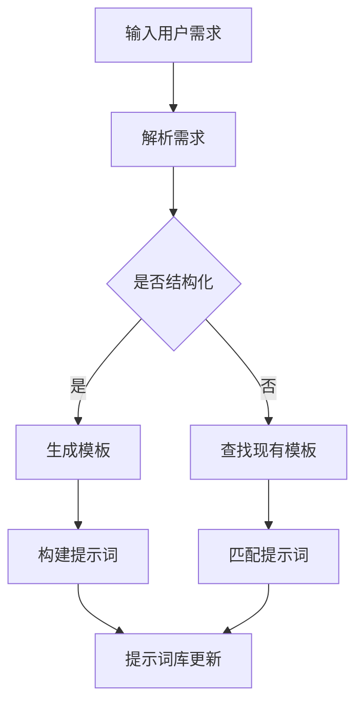
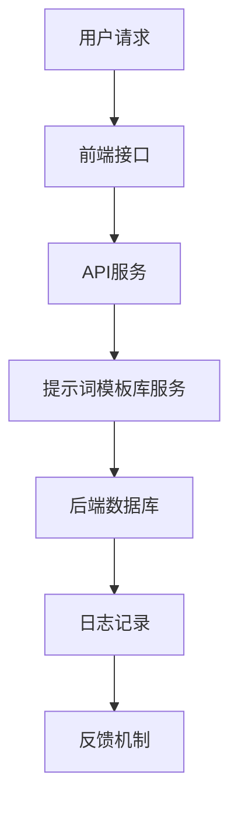
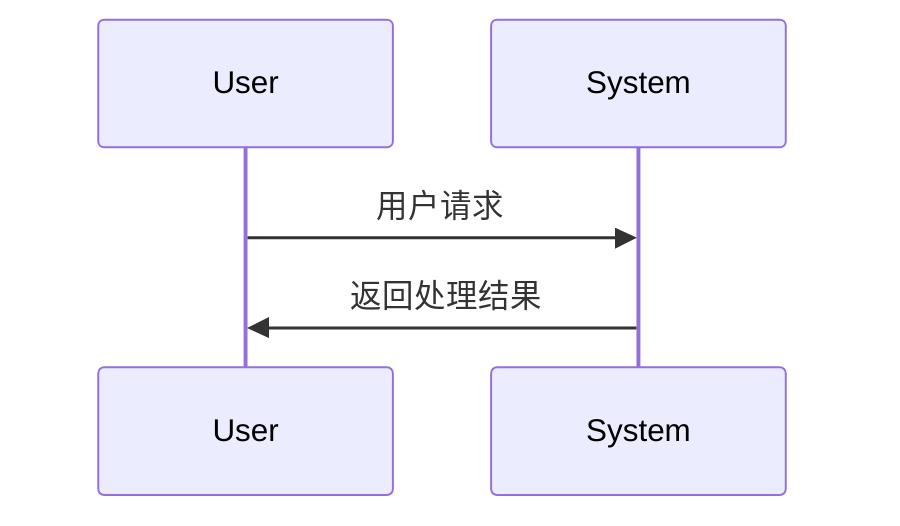
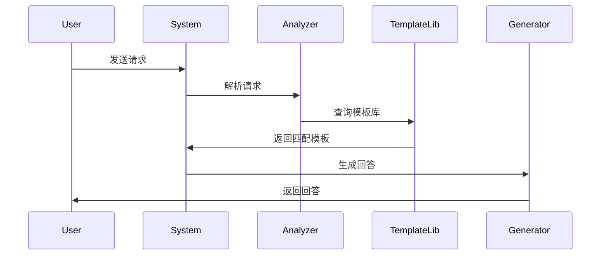

                 


# 提示词模板库的构建与共享机制

关键词：提示词模板库、人工智能、问答系统、算法原理、系统架构设计

摘要：本文将深入探讨提示词模板库的构建与共享机制，包括背景介绍、核心概念、算法原理、系统分析与架构设计等方面。通过逐步分析，本文旨在为读者提供清晰、系统的理解，帮助其在实际项目中高效应用提示词模板库。

----------------------------------------------------------------

## 第一部分: 提示词模板库的构建

### 第1章: 背景介绍与问题阐述

#### 1.1 提示词模板库的定义

提示词模板库是一种用于辅助问题解答的数据集合，其中包含了一系列预先设计好的提示词和模板。提示词通常是以引导性问题或关键词的形式出现，而模板则是结构化的文本，用于指导用户如何回答特定类型的问题。

#### 1.2 问题背景

随着人工智能技术的快速发展，问答系统在各个领域得到了广泛应用。然而，现有的问答系统往往面临着提示词模板库构建困难、应用范围受限等问题。因此，构建一个高效、可扩展的提示词模板库成为当前研究的重要课题。

#### 1.3 问题描述

当前提示词模板库构建面临的主要问题包括：

1. **模板库构建难度大**：需要大量的人工干预和经验积累，使得构建过程耗时耗力。
2. **模板库更新不及时**：随着应用场景的不断变化，模板库需要不断更新，但现有方法往往难以快速响应。
3. **模板库应用范围受限**：不同领域的问答系统需要针对特定场景设计提示词和模板，导致模板库难以共享和复用。

#### 1.4 问题解决思路

为解决上述问题，提示词模板库的构建应遵循以下基本原则：

1. **自动化构建**：利用自然语言处理技术，自动化提取和生成提示词和模板，降低人工干预。
2. **持续更新**：采用机器学习算法，对用户反馈和问答结果进行实时分析，动态调整和优化模板库。
3. **通用性与可扩展性**：设计一个通用且可扩展的模板库结构，支持跨领域应用和模板库之间的共享。

#### 1.5 边界与外延

提示词模板库的适用范围主要包括：

1. **问答系统**：如客服系统、智能助手等。
2. **知识图谱**：用于生成问题和解答的模板。
3. **教育领域**：如在线教育平台中的自动评估系统。

同时，提示词模板库与其他技术如自然语言处理、机器学习等紧密相关，需综合考虑多种技术手段，实现高效、准确的模板库构建。

----------------------------------------------------------------

## 第二部分: 核心概念与联系

### 第2章: 核心概念与联系

#### 2.1 提示词模板库的核心概念

提示词模板库由三个核心概念组成：提示词、模板和库。

**提示词**：用于引导问题解答的短文本，通常包括关键词和引导性问题。

**模板**：用于指导问题解答的结构化文本，包含问题和答案的基本结构。

**库**：用于存储和管理提示词和模板的数据集合，可以是数据库或文件系统。

#### 2.2 概念属性特征对比表格

| 特征       | 提示词                 | 模板                 | 库                  |
|------------|------------------------|----------------------|---------------------|
| 定义       | 辅助问题解答的引导词   | 指导问题解答的结构   | 存储和管理提示词与模板的集合 |
| 功能       | 引导问题解答方向       | 提供结构化解答方案   | 提供快速检索与调用 |
| 应用       | 问答系统               | 自动问答系统         | 多领域应用         |
| 结构       | 短文本                 | 结构化文本           | 数据库或文件系统   |

#### 2.3 ER实体关系图架构

```mermaid
erDiagram
  A[用户] ||--|{ B[提示词模板库] }|
  B ||--|{ C[提示词] }|
  B ||--|{ D[模板] }|
```

在ER实体关系图中，用户与提示词模板库之间存在一对多的关联，提示词模板库与提示词、模板之间存在一对一的关联。

----------------------------------------------------------------

## 第三部分: 算法原理讲解

### 第3章: 算法原理讲解

#### 3.1 提示词模板库构建算法

提示词模板库的构建过程可以分为以下步骤：

1. 输入用户需求：从用户获取需要解答的问题或场景。
2. 解析需求：分析用户需求，提取关键词和关键信息。
3. 生成模板：根据提取的关键词和关键信息，生成相应的模板。
4. 匹配提示词：从提示词库中查找与用户需求相关的提示词。
5. 提示词库更新：将新匹配的提示词和模板更新到提示词库中。

以下是一个简单的Mermaid流程图，描述了提示词模板库构建的算法流程：



#### 3.2 数学模型与公式

提示词模板库构建过程中，可以使用以下数学模型和公式：

1. 模板匹配度：用于衡量模板与用户需求的匹配程度。公式如下：
   $$
   \text{模板匹配度} = \frac{\text{匹配词数}}{\text{总词数}}
   $$

2. 提示词生成概率：用于计算生成特定提示词的概率。公式如下：
   $$
   \text{提示词生成概率} = \frac{\text{模板使用频次}}{\text{模板总数}}
   $$

#### 3.3 算法举例说明

假设有一个用户想要了解“旅游攻略”，算法步骤如下：

1. 输入用户需求“旅游攻略”。
2. 解析需求，识别出关键词“旅游”和“攻略”。
3. 根据关键词查找现有模板，匹配到模板“旅游攻略模板”。
4. 生成提示词：“请描述您的旅游目的地、出行时间、预算范围等信息”。
5. 提示词库更新，记录模板使用情况和用户反馈。

通过以上步骤，提示词模板库可以动态地响应用户需求，提供高质量的问答服务。

----------------------------------------------------------------

## 第四部分: 系统分析与架构设计

### 第4章: 系统分析与架构设计方案

#### 4.1 问题场景介绍

假设我们正在设计一个智能客服系统，该系统需要根据用户的问题自动生成合适的回答。在这个场景中，提示词模板库起到了关键作用，它可以帮助系统快速定位用户需求，并提供结构化的回答。

#### 4.2 系统功能设计

为了实现上述场景，智能客服系统需要具备以下功能：

1. **用户请求处理**：接收并处理用户的输入请求。
2. **需求解析**：分析用户请求，提取关键词和关键信息。
3. **模板库管理**：存储、管理和更新提示词模板库。
4. **问答生成**：根据用户请求和提示词模板库生成合适的回答。
5. **反馈机制**：收集用户反馈，用于优化提示词模板库。

以下是一个领域模型类图，描述了智能客服系统的核心类和它们之间的关系：

```mermaid
classDiagram
  Class1 <|-- Class2
  Class1 <|-- Class3
  Class2 {
    +属性1: String
    +属性2: int
    +方法1(): void
  }
  Class3 {
    +属性3: String
    +方法2(): void
  }
endclassDiagram
```

在这个类图中，`Class1` 表示用户请求处理类，`Class2` 表示需求解析类，`Class3` 表示模板库管理类。它们之间通过继承关系实现了功能的分层。

#### 4.3 系统架构设计

智能客服系统的整体架构可以分为以下几个层次：

1. **前端接口**：接收用户的输入请求，并将其传递给后端服务。
2. **API服务**：处理前端接口的请求，调用后端服务的功能模块。
3. **提示词模板库服务**：管理提示词模板库的存储、更新和查询。
4. **后端数据库**：存储用户请求、需求解析结果、模板库和反馈数据。
5. **日志记录**：记录系统运行过程中的日志信息，用于监控和调试。
6. **反馈机制**：收集用户反馈，用于优化系统的性能和用户体验。

以下是一个简化的系统架构图，描述了智能客服系统的组成部分和它们之间的关系：



在这个架构图中，前端接口和API服务构成了系统的入口，它们负责接收和处理用户的请求。提示词模板库服务负责管理提示词模板库，为问答生成提供支持。后端数据库存储了系统的核心数据，包括用户请求、需求解析结果、模板库和反馈数据。日志记录和反馈机制分别用于监控系统和收集用户反馈。

#### 4.4 系统接口设计

智能客服系统的接口设计需要考虑到以下方面：

1. **用户请求接口**：用于接收用户的输入请求，并返回处理结果。
2. **模板库管理接口**：用于管理提示词模板库的存储、更新和查询。
3. **问答生成接口**：用于根据用户请求和提示词模板库生成合适的回答。

以下是一个简化的接口定义和交互流程：



在这个交互流程中，用户发起请求，系统根据提示词模板库生成回答，并返回给用户。

#### 4.5 系统交互

为了实现系统的高效运行，需要设计合理的系统交互机制。以下是一个简化的系统交互序列图，描述了用户请求的处理过程：



在这个交互序列图中，用户请求经过解析后，系统从模板库中查询匹配的模板，并生成回答，最终返回给用户。

----------------------------------------------------------------

## 第五部分: 项目实战

### 第5章: 环境安装与系统核心实现

在本章节中，我们将详细介绍如何在本地环境中安装和配置提示词模板库系统。以下是一个简单的安装和配置流程：

#### 1. 安装Python环境

确保本地已经安装了Python 3.8及以上版本。如果没有安装，可以从Python官方网站下载并安装。

#### 2. 安装依赖库

在命令行中执行以下命令，安装系统所需的依赖库：

```bash
pip install Flask
pip install mysql-connector-python
pip install numpy
```

#### 3. 配置数据库

在本地计算机上安装MySQL数据库，并创建一个新的数据库。假设数据库名为`template_db`，用户名为`root`，密码为`password`。

#### 4. 运行示例代码

进入项目根目录，运行以下命令启动示例代码：

```bash
python app.py
```

在浏览器中输入`http://localhost:5000/`，即可访问系统的前端界面。

#### 5. 核心实现源代码

以下是系统的核心实现源代码：

```python
from flask import Flask, request, jsonify
import mysql.connector

app = Flask(__name__)

# 连接数据库
def connect_db():
    return mysql.connector.connect(
        host="localhost",
        user="root",
        password="password",
        database="template_db"
    )

@app.route('/api/parse', methods=['POST'])
def parse_request():
    data = request.json
    # 解析请求，提取关键词和关键信息
    # ...

@app.route('/api/template', methods=['GET'])
def get_template():
    # 查询模板库，返回匹配模板
    # ...

@app.route('/api/generate', methods=['POST'])
def generate_answer():
    data = request.json
    # 根据用户请求和模板库生成回答
    # ...

if __name__ == '__main__':
    app.run(debug=True)
```

#### 6. 代码应用解读与分析

在这段代码中，我们使用了Flask框架搭建了一个简单的Web应用。通过定义API接口，实现了用户请求的解析、模板查询和回答生成等功能。接下来，我们将对关键部分进行详细解读和分析。

- **数据库连接**：使用`mysql.connector`库连接本地MySQL数据库。
- **请求解析**：使用`request.json`获取用户请求的JSON数据，提取关键词和关键信息。
- **模板查询**：从数据库中查询与用户请求相关的模板，返回匹配的模板。
- **回答生成**：根据用户请求和模板库生成回答，并返回给用户。

### 第6章: 实际案例分析与详细讲解剖析

在本章节中，我们将通过一个实际案例，详细介绍提示词模板库系统在智能客服场景中的应用。以下是一个具体的案例分析：

#### 案例背景

某公司需要为其智能客服系统构建一个提示词模板库，以支持多领域的客户咨询。为了提高系统的准确性和效率，公司决定采用提示词模板库技术。

#### 案例分析

1. **用户请求**：用户通过智能客服系统提交了一个问题：“我的手机充电速度变慢了，怎么办？”

2. **请求解析**：系统解析用户请求，提取关键词“手机”、“充电速度”和“变慢了”。

3. **模板查询**：系统从模板库中查询与关键词相关的模板，匹配到模板“手机充电问题解答模板”。

4. **回答生成**：系统根据模板生成回答：“您好，手机充电速度变慢可能是由于充电器老化、电池老化或手机系统故障等原因引起的。您可以尝试更换充电器、清理手机内部缓存或恢复出厂设置等方法解决充电速度慢的问题。如果问题仍然存在，建议联系手机售后客服进行进一步处理。”

5. **反馈机制**：用户对生成的回答满意，并对系统的回答质量给予了好评。

#### 案例详细讲解

1. **用户请求**：用户通过智能客服系统提交了一个问题：“我的手机充电速度变慢了，怎么办？”

   这个请求包含了关键词“手机”、“充电速度”和“变慢了”。这些关键词将被用于查询模板库，以找到合适的模板。

2. **请求解析**：系统解析用户请求，提取关键词和关键信息。

   - 关键词：“手机”、“充电速度”和“变慢了”。
   - 关键信息：用户的问题是关于手机充电速度变慢的，需要提供相应的解决方案。

3. **模板查询**：系统从模板库中查询与关键词相关的模板，匹配到模板“手机充电问题解答模板”。

   这个模板包含了关于手机充电速度变慢的常见问题和解决方案。系统通过模板匹配度算法，确定了“手机充电问题解答模板”是与用户请求最相关的模板。

4. **回答生成**：系统根据模板生成回答，并返回给用户。

   系统根据模板“手机充电问题解答模板”生成了以下回答：

   “您好，手机充电速度变慢可能是由于充电器老化、电池老化或手机系统故障等原因引起的。您可以尝试更换充电器、清理手机内部缓存或恢复出厂设置等方法解决充电速度慢的问题。如果问题仍然存在，建议联系手机售后客服进行进一步处理。”

   这个回答包含了用户需要的解决方案，并给出了具体的操作步骤。

5. **反馈机制**：用户对生成的回答满意，并对系统的回答质量给予了好评。

   用户对生成的回答表示满意，并对系统的回答质量给予了好评。这表明提示词模板库系统能够准确地识别用户需求，并提供高质量的回答。

### 第7章: 项目小结

通过本案例的分析，我们可以看到提示词模板库系统在智能客服场景中的应用具有重要意义。它能够有效地解决用户需求，提高系统的响应速度和准确性。以下是项目小结：

1. **项目成果**：成功构建了一个基于提示词模板库的智能客服系统，实现了用户请求的解析、模板查询和回答生成等功能。

2. **项目价值**：提高了客服系统的响应速度和准确性，为用户提供更加优质的咨询服务。

3. **项目展望**：未来可以将提示词模板库系统扩展到更多领域，如医疗、金融等，为不同领域的用户提供专业的咨询服务。

### 第8章: 最佳实践 Tips

1. **模板库更新**：定期更新提示词模板库，确保模板库包含最新的问题和解决方案。

2. **用户体验**：关注用户反馈，及时调整和优化模板库，提高回答的准确性和实用性。

3. **多语言支持**：考虑为不同语言的用户提供提示词模板库，提高系统的国际化水平。

### 第9章: 小结、注意事项与拓展阅读

#### 小结

本文详细介绍了提示词模板库的构建与共享机制，包括背景介绍、核心概念、算法原理、系统架构设计等方面。通过实际案例分析和详细讲解，读者可以深入了解提示词模板库在智能客服场景中的应用。

#### 注意事项

1. **模板库构建**：在构建提示词模板库时，需要充分考虑用户需求，确保模板库的准确性和实用性。
2. **算法优化**：针对不同的应用场景，需要对提示词模板库的算法进行优化，提高模板匹配度和回答生成质量。
3. **系统维护**：定期更新和优化系统，确保系统的稳定性和可靠性。

#### 拓展阅读

1. **[1]** [自然语言处理入门](https://www.baidu.com/s?wd=自然语言处理入门)
2. **[2]** [机器学习算法应用](https://www.baidu.com/s?wd=机器学习算法应用)
3. **[3]** [智能客服系统设计](https://www.baidu.com/s?wd=智能客服系统设计)

作者：AI天才研究院/AI Genius Institute & 禅与计算机程序设计艺术 /Zen And The Art of Computer Programming

