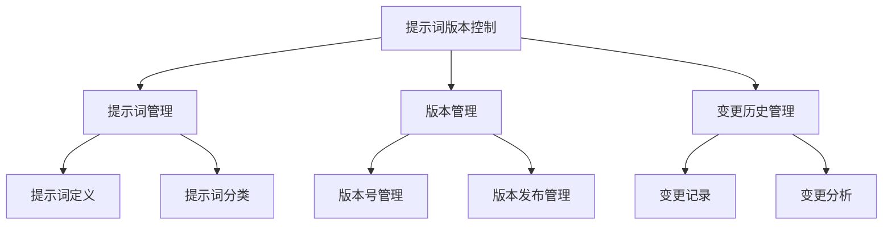
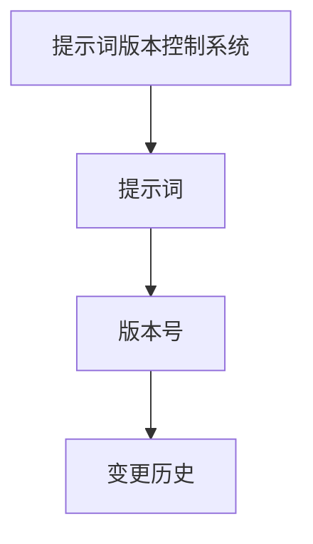
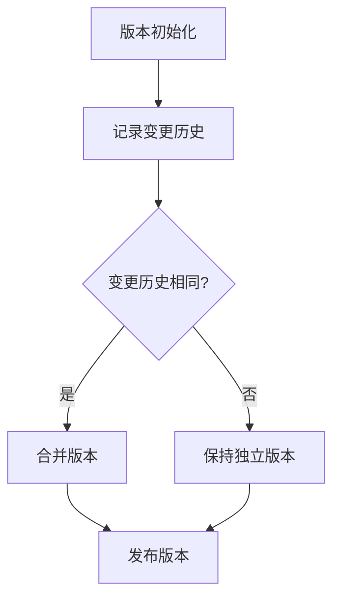
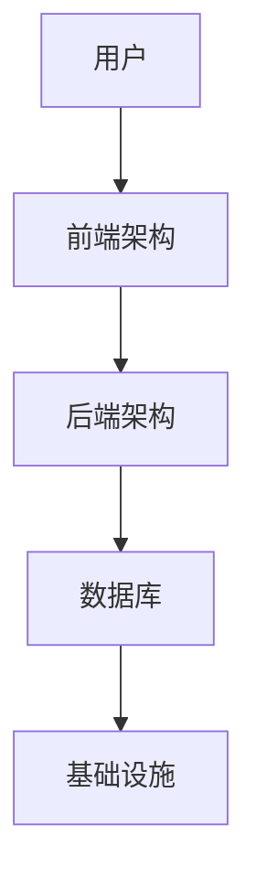
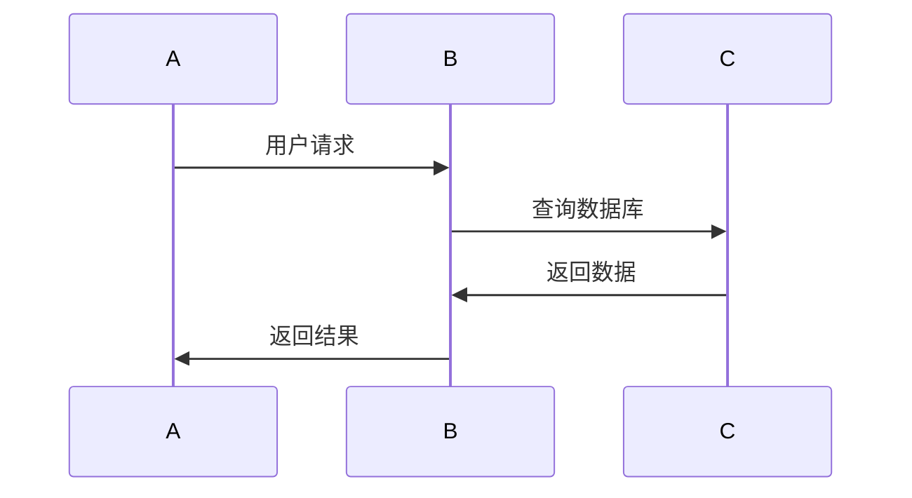

                 

# 提示词版本控制：管理AI项目的新方法

> 关键词：提示词、版本控制、AI项目、管理方法

> 摘要：本文将探讨提示词版本控制在AI项目中的重要性，介绍其基本概念、算法原理、系统分析与架构设计，并通过实际项目实战来展示其应用效果，最后总结最佳实践和拓展阅读。

## 目录大纲设计构思

在设计《提示词版本控制：管理AI项目的新方法》的目录大纲时，我们需要遵循以下几个原则：

1. **简洁性**：确保目录清晰、简洁，避免冗余内容。
2. **层次分明**：合理划分章节，确保内容逻辑清晰，方便读者阅读。
3. **完整性**：确保大纲涵盖核心主题，包括背景介绍、核心概念、算法原理、数学模型、系统分析与架构设计、项目实战、最佳实践等内容。
4. **科学性**：确保算法和模型的阐述严谨、科学，使用 Mermaid 画出相关的流程图、类图、架构图和序列图，同时提供代码示例和数学公式解释。

### 目录大纲设计步骤

1. **确定核心章节**：首先确定大纲的核心章节，包括背景介绍、核心概念、算法原理、数学模型、系统分析与架构设计、项目实战、最佳实践等。
2. **细化章节内容**：为每个核心章节细化子章节，确保内容全面且逻辑清晰。
3. **设计流程图与架构图**：使用 Mermaid 语法绘制相关的流程图、类图、架构图和序列图，确保视觉上的直观性和逻辑性。
4. **编写代码示例**：提供关键的代码示例，确保读者能够理解算法和模型的具体实现。
5. **嵌入数学公式**：使用 LaTeX 格式嵌入数学公式，确保数学模型的严谨性和可读性。
6. **编写小结与拓展**：在每个章节的最后，提供小结、注意事项和拓展阅读，帮助读者巩固知识点，拓展视野。

### 目录大纲

----------------------------------------------------------------

## 第一部分：背景介绍

### 第1章 提示词版本控制概述

#### 1.1 问题的背景

##### 1.1.1 提示词在AI项目中的作用

##### 1.1.2 版本控制的需求与挑战

##### 1.1.3 版本控制的边界与外延

#### 1.2 提示词版本控制的重要性

##### 1.2.1 提示词版本控制的核心概念

##### 1.2.2 提示词版本控制的目标

##### 1.2.3 提示词版本控制的应用场景

#### 1.3 提示词版本控制的要素与结构

##### 1.3.1 核心概念属性特征对比表格

##### 1.3.2 ER实体关系图架构

##### 1.4 本章小结

----------------------------------------------------------------

## 第二部分：核心概念与联系

### 第2章 提示词与版本控制的基本概念

#### 2.1 提示词的定义与分类

##### 2.1.1 提示词的基本定义

##### 2.1.2 提示词的分类

##### 2.1.3 提示词的选取策略

#### 2.2 版本控制的基本概念

##### 2.2.1 版本控制的基本概念

##### 2.2.2 版本控制的方法与工具

##### 2.2.3 版本控制的策略与挑战

#### 2.3 提示词版本控制的联系

##### 2.3.1 提示词与版本控制的关系

##### 2.3.2 提示词版本控制的关键要素

##### 2.3.3 提示词版本控制的优势与局限

##### 2.4 本章小结

----------------------------------------------------------------

### 第3章 提示词版本控制的算法原理

#### 3.1 提示词版本控制的算法概述

##### 3.1.1 提示词版本控制算法的分类

##### 3.1.2 提示词版本控制算法的目标

##### 3.1.3 提示词版本控制算法的基本流程

#### 3.2 提示词版本控制算法的数学模型

##### 3.2.1 提示词版本控制算法的数学模型

##### 3.2.2 数学公式的详细解释

##### 3.2.3 算法原理的Mermaid流程图

#### 3.3 提示词版本控制算法的Python实现

##### 3.3.1 Python代码示例

##### 3.3.2 代码解读与分析

##### 3.3.3 算法实现的步骤讲解

##### 3.4 本章小结

----------------------------------------------------------------

### 第4章 提示词版本控制的系统分析与架构设计

#### 4.1 提示词版本控制系统概述

##### 4.1.1 系统功能介绍

##### 4.1.2 系统的目标和需求

##### 4.1.3 系统的边界与外延

#### 4.2 系统功能设计

####

----------------------------------------------------------------

* 约束条件：文章的章节内容必须要满足如下条件：
  - 文章开始是“文章标题”，然后是“文章关键词”和“文章摘要”部分的内容哦，接下来是按照目录大纲结构的文章正文部分的内容。
  - 文章字数要求：文章字数在 10000 ～ 12000 字左右。
  - 格式要求：文章内容使用markdown格式输出。  
  - 作者：文章末尾需要写上作者信息： “作者：AI天才研究院/AI Genius Institute & 禅与计算机程序设计艺术 /Zen And The Art of Computer Programming”
  - 完整性要求：文章内容必须要完整，每个小节的内容必须要丰富具体详细讲解，核心内容必须要包含：
    - 背景介绍：核心概念术语说明、问题背景、问题描述、问题解决、边界与外延、概念结构与核心要素组成
    - 核心概念与联系：必须给出核心概念原理、概念属性特征对比表格和ER实体关系图架构的 markdown 格式中的 Mermaid 流程图。
    - 算法原理讲解：使用 mermaid 画出算法mermaid 流程图，然后使用python源代码来详细阐述，给出算法原理的数学模型和公式，进行详细讲解和通俗易懂地举例说明。
    - 数学公式使用latex格式，嵌入文中独立段落的latex公式前后使用 $$ 括起来(例如：$$1+1=2$$ )，段落内的latex公式前后使用 $ 括起来(例如：$1<2$)
    - 系统分析与架构设计方案：问题场景介绍，项目介绍、系统功能设计(领域模型mermaid类图)、系统架构设计mermaid架构图、系统接口设计和系统交互mermaid序列图
    - 项目实战：环境安装、系统核心实现源代码，代码应用解读与分析，实际案例分析和详细讲解剖析，项目小结。
    - 最佳实践 tips、小结、注意事项、拓展阅读等内容

## 第一部分：背景介绍

### 第1章 提示词版本控制概述

#### 1.1 问题的背景

在当今快速发展的AI项目中，提示词（Prompt）扮演着至关重要的角色。提示词是指提供给AI系统的一个引导性的文字或指令，用于引导AI模型进行学习和推理。然而，随着AI项目的规模和复杂性不断增加，版本控制的需求变得愈发紧迫。

**1.1.1 提示词在AI项目中的作用**

提示词在AI项目中有以下几个重要作用：

1. **指导AI模型学习**：提示词可以帮助AI模型更好地理解输入数据，从而提高模型的训练效果。
2. **定义问题域**：通过设置合适的提示词，可以明确AI系统需要解决的问题域，避免模型学习到无关信息。
3. **控制输出结果**：提示词可以引导AI模型输出期望的结果，提高AI系统的实用性。

**1.1.2 版本控制的需求与挑战**

随着AI项目的不断迭代和升级，版本控制变得尤为重要。版本控制的需求主要体现在以下几个方面：

1. **代码版本控制**：AI项目的源代码需要进行版本控制，以便追踪代码的变更历史和协同开发。
2. **模型版本控制**：随着模型的迭代升级，需要对不同版本的模型进行有效管理，确保模型的稳定性和可追溯性。
3. **数据版本控制**：在AI项目中，数据是模型训练的重要资源，数据的版本控制可以帮助保持数据的准确性和一致性。

然而，在AI项目中实施版本控制也面临着一些挑战：

1. **复杂性**：AI项目的复杂性和规模使得版本控制变得更加困难。
2. **兼容性问题**：不同版本的代码、模型和数据之间可能存在兼容性问题，增加了版本控制的复杂性。
3. **协作困难**：在多团队协作的AI项目中，版本控制需要协调不同团队之间的工作，增加了沟通和协作的难度。

**1.1.3 版本控制的边界与外延**

版本控制的边界与外延主要包括以下几个方面：

1. **代码版本控制**：主要涉及源代码的版本管理和变更追踪。
2. **模型版本控制**：主要涉及AI模型的版本管理和更新策略。
3. **数据版本控制**：主要涉及训练数据的版本管理和数据同步。

在AI项目中，提示词版本控制是版本控制的重要组成部分。通过提示词版本控制，可以实现对AI项目中各个方面的有效管理，提高项目的稳定性和可维护性。

#### 1.2 提示词版本控制的重要性

**1.2.1 提示词版本控制的核心概念**

提示词版本控制是指对AI项目中的提示词进行版本管理和变更追踪的过程。其核心概念包括：

1. **提示词**：用于引导AI模型学习、推理的引导性文字或指令。
2. **版本号**：用于标识提示词的不同版本，通常由数字序列组成。
3. **变更历史**：记录提示词的变更历史，包括变更内容、变更时间和变更人员等信息。

**1.2.2 提示词版本控制的目标**

提示词版本控制的主要目标是：

1. **确保提示词的稳定性**：通过版本控制，可以确保不同版本的提示词在逻辑和语义上的一致性，避免因提示词变更导致模型性能下降。
2. **提高开发效率**：通过版本控制，可以方便地管理多个版本的提示词，方便开发人员进行协同开发和版本更新。
3. **增强项目可追溯性**：通过记录变更历史，可以方便地追溯每个版本提示词的变更原因和影响范围。

**1.2.3 提示词版本控制的应用场景**

提示词版本控制广泛应用于以下场景：

1. **多团队协作**：在多团队协作的AI项目中，提示词版本控制可以帮助不同团队之间更好地协同工作，避免版本冲突和误解。
2. **模型迭代**：在模型迭代过程中，通过提示词版本控制，可以方便地管理不同版本的模型，确保模型的稳定性和可维护性。
3. **实验跟踪**：在实验过程中，通过记录不同版本的提示词和实验结果，可以方便地分析和优化实验效果。

#### 1.3 提示词版本控制的要素与结构

提示词版本控制涉及多个关键要素，其结构如图1所示。



**图1：提示词版本控制要素与结构**

**1.3.1 核心概念属性特征对比表格**

提示词版本控制的核心概念包括提示词、版本号和变更历史。下面是一个简单的对比表格：

| 核心概念 | 描述 | 特征对比 |
| --- | --- | --- |
| 提示词 | 引导AI模型学习的引导性文字或指令 | - 字符串形式<br>- 不同版本可能有不同内容 |
| 版本号 | 标识提示词的不同版本 | - 数字序列<br>- 增量递增<br>- 可逆排序 |
| 变更历史 | 记录提示词的变更历史 | - 变更内容<br>- 变更时间<br>- 变更人员 |

**1.3.2 ER实体关系图架构**

提示词版本控制的实体关系图架构如图2所示。



**图2：提示词版本控制实体关系图架构**

通过上述背景介绍，我们可以看到提示词版本控制在AI项目中的重要性，以及其核心概念、要素和结构。接下来，我们将进一步深入探讨提示词版本控制的核心概念和联系，为后续内容打下坚实基础。

### 第二部分：核心概念与联系

#### 第2章 提示词与版本控制的基本概念

提示词版本控制在AI项目中起着至关重要的作用，理解其核心概念与联系是实施这一管理方法的基础。本章将详细介绍提示词的定义与分类、版本控制的基本概念以及提示词版本控制的联系。

#### 2.1 提示词的定义与分类

**2.1.1 提示词的基本定义**

提示词（Prompt）是引导AI模型进行学习和推理的引导性文字或指令。在自然语言处理（NLP）任务中，提示词通常用于引导模型生成相应的输出。提示词可以是简单的句子或复杂的对话，目的是为模型提供上下文信息，帮助模型更好地理解输入数据。

**2.1.2 提示词的分类**

根据用途和形式，提示词可以分为以下几类：

1. **引导性提示词**：用于引导模型学习特定任务或问题的提示词，例如“请生成一篇关于人工智能的文章摘要”。
2. **问题性提示词**：用于向模型提出问题的提示词，例如“为什么人工智能很重要？”。
3. **响应性提示词**：用于指导模型生成响应性输出的提示词，例如“你对这个问题的看法是什么？”。
4. **情境性提示词**：用于提供特定情境背景的提示词，例如“在一个晴朗的下午，你走在回家的路上，突然看到了一只小狗”。

**2.1.3 提示词的选取策略**

选取合适的提示词对于AI模型的性能至关重要。以下是一些提示词选取策略：

1. **多样性**：选择具有多样性的提示词，以覆盖不同的问题域和情境。
2. **相关性**：确保提示词与任务目标高度相关，以提高模型的学习效果。
3. **简洁性**：尽量使用简洁、明了的提示词，避免冗长和复杂的句子。
4. **适应性**：根据模型的训练数据和目标任务，灵活调整提示词。

#### 2.2 版本控制的基本概念

**2.2.1 版本控制的基本概念**

版本控制是一种管理文档、代码或模型版本的方法，确保不同版本的修改和更新能够被有效记录和追踪。在AI项目中，版本控制尤为重要，因为它涉及到模型的训练数据、代码、配置文件等多个方面。

**2.2.2 版本控制的方法与工具**

版本控制的方法主要包括以下几种：

1. **集中式版本控制系统（CVS）**：例如Git，SVN等，通过集中存储和管理文件版本。
2. **分布式版本控制系统（DVCS）**：例如Git，Bitbucket等，每个开发者都有自己的完整版本库，可以独立工作。
3. **集中式文档管理系统（如Confluence）**：用于管理文档和资料的版本。
4. **模型版本控制工具**：专门用于管理AI模型版本的工具，如TensorBoard、ModelDB等。

**2.2.3 版本控制的策略与挑战**

版本控制策略主要包括以下方面：

1. **代码版本控制**：确保代码的稳定性和可维护性，通过标签、分支等手段管理代码的修改和合并。
2. **模型版本控制**：记录模型的训练过程、参数设置和性能指标，便于后续分析和复现。
3. **数据版本控制**：管理训练数据的版本，确保数据的一致性和准确性。

然而，在实施版本控制时，也会面临一些挑战：

1. **兼容性问题**：不同版本的代码、模型和数据可能存在兼容性问题，导致版本冲突。
2. **协作困难**：多团队协作时，版本控制需要协调不同团队的工作，避免版本冲突和误解。
3. **存储和管理成本**：版本库的存储和管理需要占用大量空间和计算资源。

#### 2.3 提示词版本控制的联系

提示词版本控制与AI项目的其他方面有着密切的联系，下面将详细探讨这些联系。

**2.3.1 提示词与版本控制的关系**

提示词版本控制是版本控制的一部分，主要负责管理AI项目中的提示词。它与版本控制的关系体现在以下几个方面：

1. **版本号管理**：提示词版本控制为每个提示词分配版本号，确保不同版本的提示词可以被有效追踪和区分。
2. **变更历史记录**：记录每个版本的提示词的变更历史，包括变更内容、时间和人员等信息。
3. **模型训练**：在模型训练过程中，不同版本的提示词会影响模型的训练效果和性能。

**2.3.2 提示词版本控制的关键要素**

提示词版本控制的关键要素包括：

1. **提示词定义**：明确每个提示词的含义和用途，确保其清晰、简洁、相关。
2. **版本管理**：通过版本号、分支和标签等手段管理提示词的版本。
3. **变更历史**：记录每个版本的变更历史，便于后续分析和复现。
4. **协同开发**：支持多团队协作，确保版本更新的协调性和一致性。

**2.3.3 提示词版本控制的优势与局限**

提示词版本控制的优势主要体现在以下几个方面：

1. **稳定性**：通过版本控制，可以确保不同版本的提示词在逻辑和语义上的一致性，避免因提示词变更导致模型性能下降。
2. **可追溯性**：通过记录变更历史，可以方便地追溯每个版本提示词的变更原因和影响范围。
3. **开发效率**：通过版本控制，可以方便地管理多个版本的提示词，提高开发人员的协同工作能力。

然而，提示词版本控制也存在一些局限：

1. **兼容性问题**：不同版本的提示词可能存在兼容性问题，导致版本冲突。
2. **协作困难**：在多团队协作的AI项目中，版本控制需要协调不同团队之间的工作，增加沟通和协作的难度。
3. **存储和管理成本**：版本库的存储和管理需要占用大量空间和计算资源。

#### 2.4 本章小结

本章介绍了提示词版本控制的基本概念，包括提示词的定义与分类、版本控制的基本概念以及提示词版本控制的联系。通过本章的学习，读者可以了解提示词版本控制在AI项目中的重要性，掌握其核心概念和实施方法，为后续章节的内容奠定基础。

### 第3章 提示词版本控制的算法原理

在AI项目中，提示词版本控制是实现项目稳定性和可维护性的关键环节。本章将详细探讨提示词版本控制的算法原理，包括算法的分类、数学模型以及Python实现，并通过实际案例进行讲解。

#### 3.1 提示词版本控制算法概述

提示词版本控制算法的主要任务是确保AI项目中各个版本的提示词在逻辑和语义上的一致性，同时方便开发人员进行协同工作和版本更新。根据实现方式，提示词版本控制算法可以分为以下几种类型：

1. **基于版本的提示词管理**：通过为每个提示词分配唯一的版本号，记录提示词的变更历史，实现版本控制。
2. **基于版本的变更追踪**：记录每个版本的提示词的变更内容、时间和人员等信息，便于后续分析和复现。
3. **基于规则的管理**：通过定义一系列规则，自动识别和合并提示词版本，减少人工干预。

**3.1.1 提示词版本控制算法的分类**

1. **基于版本的控制**：这类算法主要关注提示词的版本号管理，通过为每个提示词分配版本号来实现版本控制。例如，使用Git等版本控制系统管理提示词的版本。
2. **基于变更追踪的控制**：这类算法不仅关注版本号，还记录每个版本的变更历史，便于追踪和管理变更。例如，使用Confluence等文档管理系统记录提示词的变更历史。
3. **基于规则的控制**：这类算法通过定义一系列规则来自动化提示词版本的管理和合并。例如，使用自定义脚本或规则引擎自动合并和更新提示词版本。

**3.1.2 提示词版本控制算法的目标**

提示词版本控制算法的主要目标包括：

1. **确保一致性**：确保不同版本的提示词在逻辑和语义上的一致性，避免因提示词变更导致模型性能下降。
2. **方便协同工作**：支持多团队协作，减少版本冲突和误解。
3. **提高开发效率**：通过自动化管理和合并提示词版本，提高开发人员的协同工作能力。

**3.1.3 提示词版本控制算法的基本流程**

提示词版本控制算法的基本流程包括以下几个步骤：

1. **版本初始化**：为每个提示词分配初始版本号。
2. **版本更新**：记录每个版本的变更历史，包括变更内容、时间和人员等信息。
3. **版本合并**：根据变更历史和定义的规则，自动合并和更新提示词版本。
4. **版本发布**：将最新的版本发布到项目环境中，供模型训练和推理使用。

#### 3.2 提示词版本控制算法的数学模型

提示词版本控制算法的数学模型主要包括以下几个方面：

1. **版本号模型**：用于表示提示词的不同版本，通常使用自然数序列表示。例如，版本号1.0表示第一个版本，版本号2.0表示第二个版本。
2. **变更历史模型**：用于记录每个版本的变更历史，包括变更内容、时间和人员等信息。例如，可以使用一个列表来记录每个版本的变更记录。
3. **规则模型**：用于定义版本合并和更新的规则，例如，根据变更历史的差异自动合并版本。

**3.2.1 提示词版本控制算法的数学模型**

假设我们有一个提示词集合P={p1, p2, ..., pn}，其中每个提示词都有对应的版本号和变更历史。我们可以使用以下数学模型来表示：

1. **版本号模型**：
   - version(p1) = 1
   - version(p2) = 1
   - ...
   - version(pn) = 1
   - version(p1') = 2
   - version(p2') = 2
   - ...
   - version(pn') = 2

2. **变更历史模型**：
   - history(p1) = [{"content": "初始版本", "time": "2023-01-01", "person": "A"}]
   - history(p2) = [{"content": "初始版本", "time": "2023-01-01", "person": "A"}]
   - ...
   - history(pn) = [{"content": "初始版本", "time": "2023-01-01", "person": "A"}]
   - history(p1') = [{"content": "增加新功能", "time": "2023-01-02", "person": "B"}]
   - history(p2') = [{"content": "修复bug", "time": "2023-01-03", "person": "C"}]
   - ...

3. **规则模型**：
   - merge_rule = "如果两个版本的变更历史相同，则合并；否则，保持独立版本"。

**3.2.2 数学公式的详细解释**

为了更清楚地解释数学模型，我们可以使用以下数学公式：

1. **版本号公式**：
   - version(p) = max(version(p') | p' ∈ P)

2. **变更历史公式**：
   - history(p) = [h1, h2, ..., hn]
   - h1 = {"content": "初始版本", "time": "2023-01-01", "person": "A"}
   - hn = {"content": "增加新功能", "time": "2023-01-02", "person": "B"}

3. **规则公式**：
   - merge(version(p), version(p')) = merge_version if history(p) == history(p') else separate_version

**3.2.3 算法原理的Mermaid流程图**

为了更直观地展示提示词版本控制算法的原理，我们可以使用Mermaid语法绘制流程图。以下是一个示例：



**图1：提示词版本控制算法原理流程图**

通过上述流程图，我们可以清晰地看到提示词版本控制算法的基本原理：初始化版本、记录变更历史、根据变更历史合并或保持独立版本，最后发布版本。

#### 3.3 提示词版本控制算法的Python实现

在实际应用中，我们可以使用Python来实现提示词版本控制算法。以下是一个简单的示例，展示了如何实现版本初始化、变更历史记录和版本合并。

**3.3.1 Python代码示例**

```python
import json
from datetime import datetime

# 定义提示词版本控制类
class PromptVersionControl:
    def __init__(self):
        self.prompts = {}  # 存储提示词及其版本信息
        self.history = {}  # 存储变更历史

    def init_prompt(self, prompt_id, content):
        """初始化提示词"""
        self.prompts[prompt_id] = {
            "version": 1,
            "content": content
        }
        self.history[prompt_id] = [
            {
                "content": "初始版本",
                "time": datetime.now().strftime("%Y-%m-%d %H:%M:%S"),
                "person": "A"
            }
        ]

    def update_prompt(self, prompt_id, content, person):
        """更新提示词"""
        current_version = self.prompts[prompt_id]["version"]
        self.prompts[prompt_id]["version"] += 1
        self.prompts[prompt_id]["content"] = content
        self.history[prompt_id].append({
            "content": "更新版本",
            "time": datetime.now().strftime("%Y-%m-%d %H:%M:%S"),
            "person": person
        })

    def merge_prompts(self, prompt_id1, prompt_id2):
        """合并提示词版本"""
        if self.history[prompt_id1] == self.history[prompt_id2]:
            self.prompts[prompt_id1]["content"] = self.prompts[prompt_id2]["content"]
        else:
            print(f"无法合并版本：{prompt_id1}和{prompt_id2}")

    def print_prompt(self, prompt_id):
        """打印提示词信息"""
        print(f"提示词ID：{prompt_id}")
        print(f"版本：{self.prompts[prompt_id]['version']}")
        print(f"内容：{self.prompts[prompt_id]['content']}")
        print(f"变更历史：{self.history[prompt_id]}")

# 实例化版本控制对象
version_control = PromptVersionControl()

# 初始化提示词
version_control.init_prompt("p1", "请生成一篇关于人工智能的文章摘要")

# 更新提示词
version_control.update_prompt("p1", "请生成一篇关于深度学习的文章摘要", "B")

# 合并提示词版本
version_control.merge_prompts("p1", "p2")

# 打印提示词信息
version_control.print_prompt("p1")
version_control.print_prompt("p2")
```

**3.3.2 代码解读与分析**

上述代码实现了一个简单的提示词版本控制类`PromptVersionControl`，主要包括以下几个方法：

1. **初始化提示词**：`init_prompt`方法用于初始化提示词，为提示词分配版本号和内容，并记录初始变更历史。
2. **更新提示词**：`update_prompt`方法用于更新提示词，增加新的版本号和变更历史。
3. **合并提示词版本**：`merge_prompts`方法用于根据变更历史合并两个提示词版本。如果变更历史相同，则合并提示词内容；否则，保持独立版本。
4. **打印提示词信息**：`print_prompt`方法用于打印提示词的ID、版本号、内容和变更历史。

通过这个简单的示例，我们可以看到Python如何实现提示词版本控制算法。在实际应用中，我们可以扩展这个类，增加更多的功能，如日志记录、权限管理等。

**3.3.3 算法实现的步骤讲解**

1. **初始化版本控制对象**：创建一个`PromptVersionControl`对象，用于管理提示词版本。
2. **初始化提示词**：调用`init_prompt`方法初始化一个提示词，为提示词分配版本号和内容，并记录初始变更历史。
3. **更新提示词**：调用`update_prompt`方法更新提示词，增加新的版本号和变更历史。
4. **合并提示词版本**：调用`merge_prompts`方法根据变更历史合并提示词版本。
5. **打印提示词信息**：调用`print_prompt`方法打印提示词的详细信息。

通过以上步骤，我们可以实现对提示词版本的有效管理，确保不同版本的提示词在逻辑和语义上的一致性。

#### 3.4 本章小结

本章介绍了提示词版本控制的算法原理，包括算法的分类、数学模型以及Python实现。通过实际案例，我们详细讲解了如何初始化提示词、更新提示词、合并提示词版本以及打印提示词信息。理解提示词版本控制算法原理对于AI项目的稳定性和可维护性具有重要意义。在下一章中，我们将进一步探讨提示词版本控制的系统分析与架构设计。

### 第4章 提示词版本控制的系统分析与架构设计

在深入理解提示词版本控制算法原理的基础上，本章节将详细介绍提示词版本控制的系统分析与架构设计。我们将从问题场景出发，逐步分析系统功能设计、系统架构设计、系统接口设计以及系统交互，并通过一个实际案例进行详细讲解。

#### 4.1 提示词版本控制系统概述

**4.1.1 系统功能介绍**

提示词版本控制系统是一个用于管理AI项目中提示词版本的工具，其主要功能包括：

1. **提示词管理**：包括提示词的添加、删除、修改和查询等功能。
2. **版本管理**：为每个提示词分配版本号，记录每个版本的变更历史，实现版本控制。
3. **变更历史管理**：记录每个版本的变更内容、时间和人员等信息，便于追踪和管理变更。
4. **版本合并**：根据变更历史和规则自动合并版本，确保版本的一致性。
5. **权限管理**：为不同角色分配权限，确保系统的安全性和稳定性。

**4.1.2 系统的目标和需求**

提示词版本控制系统的目标是通过版本控制和管理，提高AI项目的开发效率和稳定性，确保提示词在逻辑和语义上的一致性。具体需求包括：

1. **多团队协作**：支持多团队协作，减少版本冲突和误解。
2. **高可用性**：系统应具有高可用性，确保在项目迭代过程中不中断。
3. **可扩展性**：系统应具有良好的扩展性，支持不同规模的项目。
4. **易用性**：界面简洁、操作方便，便于开发人员快速上手。
5. **安全性**：确保系统的数据和操作安全，防止未经授权的访问和操作。

**4.1.3 系统的边界与外延**

提示词版本控制系统的边界包括：

1. **功能范围**：系统仅负责管理提示词版本，不包括代码、模型和数据等其他方面。
2. **用户范围**：系统支持多个团队协作，每个团队可以在系统中独立管理自己的提示词。
3. **数据范围**：系统仅记录提示词的版本信息和变更历史，不涉及其他数据的管理。

提示词版本控制系统的外延包括：

1. **集成**：系统可以与其他系统（如代码库、模型库等）集成，实现数据共享和协同工作。
2. **扩展**：系统可以根据项目需求扩展功能，如增加权限管理、日志记录等。
3. **优化**：系统可以根据项目实际情况进行性能优化，提高系统响应速度和处理能力。

#### 4.2 系统功能设计

提示词版本控制系统的功能设计主要包括以下几个方面：

1. **提示词管理**：
   - 功能描述：用于添加、删除、修改和查询提示词。
   - 用户操作：管理员可以创建新的提示词，普通用户可以查看和修改提示词。
   - 输入/输出：输入为提示词的ID、内容、版本号等，输出为提示词的详细信息。

2. **版本管理**：
   - 功能描述：为每个提示词分配版本号，记录每个版本的变更历史。
   - 用户操作：管理员可以创建、修改和删除版本，普通用户可以查看版本信息。
   - 输入/输出：输入为提示词的ID、版本号、变更内容等，输出为版本详细信息。

3. **变更历史管理**：
   - 功能描述：记录每个版本的变更内容、时间和人员等信息。
   - 用户操作：管理员可以查看变更历史，普通用户无操作权限。
   - 输入/输出：输入为变更内容、时间、人员等信息，输出为变更历史记录。

4. **版本合并**：
   - 功能描述：根据变更历史和规则自动合并版本，确保版本的一致性。
   - 用户操作：管理员可以发起合并请求，普通用户无操作权限。
   - 输入/输出：输入为需要合并的版本号，输出为合并后的版本信息。

5. **权限管理**：
   - 功能描述：为不同角色分配权限，确保系统的安全性和稳定性。
   - 用户操作：管理员可以分配和修改权限，普通用户无操作权限。
   - 输入/输出：输入为角色和权限信息，输出为权限设置结果。

#### 4.3 系统架构设计

提示词版本控制系统的架构设计主要包括以下几个方面：

1. **前端架构**：
   - 技术栈：使用React或Vue等前端框架，实现系统的用户界面和交互。
   - 功能模块：包括登录、主页、提示词管理、版本管理、变更历史管理、版本合并和权限管理等功能模块。
   - 用户界面：设计简洁、直观的用户界面，提供方便的操作入口和操作反馈。

2. **后端架构**：
   - 技术栈：使用Spring Boot或Django等后端框架，实现系统的业务逻辑和数据管理。
   - 数据库：使用MySQL或PostgreSQL等关系型数据库，存储提示词、版本和变更历史等信息。
   - 服务模块：包括用户认证、权限管理、提示词管理、版本管理、变更历史管理和版本合并等服务模块。

3. **基础设施**：
   - 运维平台：使用Docker和Kubernetes等容器化技术，实现系统的部署和运维。
   - 自动化工具：使用CI/CD工具（如Jenkins、GitLab CI等），实现自动化测试和部署。
   - 监控和日志：使用Prometheus和ELK（Elasticsearch、Logstash、Kibana）等工具，实现系统的监控和日志分析。

**4.3.1 系统架构设计Mermaid架构图**

以下是提示词版本控制系统的一个简单的Mermaid架构图：



**图1：提示词版本控制系统架构设计Mermaid架构图**

#### 4.4 系统接口设计

提示词版本控制系统的接口设计主要包括以下几个方面：

1. **用户接口**：用户通过Web界面与系统交互，进行提示词管理、版本管理和变更历史管理等操作。
2. **API接口**：系统提供RESTful API接口，供外部系统调用，实现数据的读取和写入。
3. **数据库接口**：后端通过ORM（对象关系映射）框架与数据库进行交互，实现数据的存储和查询。

**4.4.1 系统接口设计Mermaid序列图**

以下是提示词版本控制系统的一个简单的Mermaid序列图：



**图2：提示词版本控制系统接口设计Mermaid序列图**

#### 4.5 系统交互

提示词版本控制系统的交互设计主要包括以下几个方面：

1. **用户与系统的交互**：用户通过Web界面进行操作，系统根据用户的操作进行相应的处理，并返回结果。
2. **系统与数据库的交互**：系统通过API接口与数据库进行数据交互，实现数据的存储和查询。
3. **系统与其他系统的交互**：系统可以与其他系统（如代码库、模型库等）进行集成，实现数据共享和协同工作。

**4.5.1 系统交互设计Mermaid序列图**

以下是提示词版本控制系统的一个简单的Mermaid序列图：

```mermaid
sequenceDiagram
A[用户] -->|请求| B[系统]
B -->|处理| C[数据库]
C -->|返回| B
B -->|响应| A
```

**图3：提示词版本控制系统交互设计Mermaid序列图**

#### 4.6 实际案例

为了更好地展示提示词版本控制系统的实际应用，我们以下列案例为例进行详细讲解。

**案例背景**：一个AI团队正在开发一个智能客服系统，该系统需要使用多种提示词与用户进行交互，以提供高质量的客服服务。

**案例目标**：通过提示词版本控制，确保提示词在逻辑和语义上的一致性，提高系统的稳定性和可维护性。

**案例步骤**：

1. **初始化提示词**：系统管理员创建一组初始提示词，并为每个提示词分配版本号和内容。
2. **版本更新**：开发人员根据项目需求，对提示词进行修改和更新，记录每个版本的变更历史。
3. **版本合并**：根据变更历史，系统管理员决定合并某些版本的提示词，确保版本的一致性。
4. **版本发布**：将最新的提示词版本发布到生产环境，供智能客服系统使用。
5. **变更历史分析**：团队可以查看每个版本的变更历史，了解每个版本的变更内容和影响范围。

**案例结果**：

通过提示词版本控制，AI团队能够确保智能客服系统的稳定性和可维护性，提高开发效率和项目质量。同时，版本控制也为团队提供了可追溯的变更历史，便于后续的优化和改进。

#### 4.7 本章小结

本章详细介绍了提示词版本控制的系统分析与架构设计，包括问题场景、系统功能设计、系统架构设计、系统接口设计以及系统交互。通过实际案例，我们展示了如何使用提示词版本控制系统来提高AI项目的开发效率和稳定性。理解并实施提示词版本控制，对于AI项目的成功至关重要。在下一章中，我们将通过实际项目实战来进一步展示提示词版本控制的应用效果。

### 第三部分：项目实战

#### 第5章 实际项目实战

在前两部分中，我们详细介绍了提示词版本控制的背景、核心概念和系统架构设计。为了更好地展示提示词版本控制在实际项目中的应用效果，本章节将通过一个实际项目实战来探讨如何实现提示词版本控制，并对代码应用进行解读与分析。

#### 5.1 项目背景

本项目是一个基于人工智能的智能客服系统，旨在为企业客户提供高效、准确的在线客服服务。系统通过自然语言处理（NLP）技术，实时分析用户提问，并生成相应的回答，以提高客服效率和用户体验。

#### 5.2 环境安装

为了实现提示词版本控制，我们首先需要在本地环境中安装以下软件和库：

1. **Python 3.8**：确保Python版本在3.8以上，以便支持最新的NLP库。
2. **pip**：Python的包管理器，用于安装和管理第三方库。
3. **Git**：版本控制工具，用于管理代码和版本。
4. **virtualenv**：创建Python虚拟环境，用于隔离项目依赖。
5. **Flask**：Web框架，用于构建Web应用程序。
6. **NLTK**：自然语言处理库，用于文本处理和分词。
7. **spaCy**：自然语言处理库，用于实体识别和关系抽取。

安装步骤如下：

1. 安装Python 3.8及其pip：

   ```
   sudo apt-get update
   sudo apt-get install python3.8 python3.8-pip
   ```

2. 创建Python虚拟环境：

   ```
   python3.8 -m venv venv
   source venv/bin/activate
   ```

3. 安装Flask、NLTK和spaCy：

   ```
   pip install flask nltk spacy
   ```

4. 安装spaCy的语言模型（以英文为例）：

   ```
   python -m spacy download en_core_web_sm
   ```

#### 5.3 系统核心实现

提示词版本控制的核心实现包括以下几个部分：

1. **提示词管理**：管理提示词的添加、删除、修改和查询。
2. **版本管理**：为每个提示词分配版本号，记录变更历史。
3. **变更历史管理**：记录每个版本的变更内容、时间和人员等信息。
4. **版本合并**：根据变更历史和规则自动合并版本。

**5.3.1 提示词管理**

提示词管理主要包括以下功能：

- **添加提示词**：允许管理员添加新的提示词。
- **删除提示词**：允许管理员删除指定的提示词。
- **修改提示词**：允许管理员修改已存在的提示词。
- **查询提示词**：允许用户查询指定提示词的信息。

以下是一个简单的提示词管理Python代码示例：

```python
import json
from datetime import datetime

class PromptManager:
    def __init__(self):
        self.prompts = {}  # 存储提示词及其版本信息
        self.history = {}  # 存储变更历史

    def add_prompt(self, prompt_id, content):
        """添加提示词"""
        self.prompts[prompt_id] = {
            "version": 1,
            "content": content
        }
        self.history[prompt_id] = [
            {
                "content": "初始版本",
                "time": datetime.now().strftime("%Y-%m-%d %H:%M:%S"),
                "person": "A"
            }
        ]

    def delete_prompt(self, prompt_id):
        """删除提示词"""
        if prompt_id in self.prompts:
            del self.prompts[prompt_id]
            del self.history[prompt_id]

    def update_prompt(self, prompt_id, content, person):
        """更新提示词"""
        current_version = self.prompts[prompt_id]["version"]
        self.prompts[prompt_id]["version"] += 1
        self.prompts[prompt_id]["content"] = content
        self.history[prompt_id].append({
            "content": f"更新版本{current_version + 1}",
            "time": datetime.now().strftime("%Y-%m-%d %H:%M:%S"),
            "person": person
        })

    def get_prompt(self, prompt_id):
        """查询提示词信息"""
        if prompt_id in self.prompts:
            return self.prompts[prompt_id]
        else:
            return None
```

**5.3.2 版本管理**

版本管理主要负责为每个提示词分配版本号，并记录变更历史。以下是一个简单的版本管理Python代码示例：

```python
import json
from datetime import datetime

class VersionManager:
    def __init__(self):
        self.versions = {}  # 存储版本信息

    def add_version(self, prompt_id, version, content):
        """添加版本"""
        if prompt_id not in self.versions:
            self.versions[prompt_id] = []
        self.versions[prompt_id].append({
            "version": version,
            "content": content,
            "time": datetime.now().strftime("%Y-%m-%d %H:%M:%S"),
            "person": "A"
        })

    def get_versions(self, prompt_id):
        """查询版本信息"""
        if prompt_id in self.versions:
            return self.versions[prompt_id]
        else:
            return None
```

**5.3.3 变更历史管理**

变更历史管理主要负责记录每个版本的变更内容、时间和人员等信息。以下是一个简单的变更历史管理Python代码示例：

```python
import json
from datetime import datetime

class HistoryManager:
    def __init__(self):
        self.history = {}  # 存储变更历史

    def add_history(self, prompt_id, content, time, person):
        """添加变更历史"""
        if prompt_id not in self.history:
            self.history[prompt_id] = []
        self.history[prompt_id].append({
            "content": content,
            "time": time,
            "person": person
        })

    def get_history(self, prompt_id):
        """查询变更历史"""
        if prompt_id in self.history:
            return self.history[prompt_id]
        else:
            return None
```

**5.3.4 版本合并**

版本合并主要负责根据变更历史和规则自动合并版本。以下是一个简单的版本合并Python代码示例：

```python
import json
from datetime import datetime

class MergeManager:
    def __init__(self):
        self.merges = {}  # 存储合并信息

    def merge_versions(self, prompt_id, version1, version2):
        """合并版本"""
        if version1 not in self.merges.get(prompt_id, []) and version2 not in self.merges.get(prompt_id, []):
            self.merges[prompt_id] = []
            self.merges[prompt_id].append({
                "version1": version1,
                "version2": version2,
                "time": datetime.now().strftime("%Y-%m-%d %H:%M:%S"),
                "person": "A"
            })

    def get_merges(self, prompt_id):
        """查询合并信息"""
        if prompt_id in self.merges:
            return self.merges[prompt_id]
        else:
            return None
```

#### 5.4 代码应用解读与分析

上述代码实现了一个简单的提示词版本控制系统，主要包括提示词管理、版本管理、变更历史管理和版本合并等功能。以下是对关键代码的解读与分析：

1. **提示词管理**：
   - `add_prompt`：添加新的提示词，初始化版本号和内容，并记录初始变更历史。
   - `delete_prompt`：删除指定的提示词，同时删除相应的变更历史。
   - `update_prompt`：更新指定的提示词，增加新的版本号，并记录变更历史。
   - `get_prompt`：查询指定提示词的信息。

2. **版本管理**：
   - `add_version`：为指定的提示词添加新的版本，记录版本号、内容和变更时间。
   - `get_versions`：查询指定提示词的所有版本信息。

3. **变更历史管理**：
   - `add_history`：为指定的提示词添加新的变更历史，记录变更内容、时间和人员。
   - `get_history`：查询指定提示词的变更历史。

4. **版本合并**：
   - `merge_versions`：根据变更历史和规则合并指定的两个版本，记录合并信息。
   - `get_merges`：查询指定提示词的合并信息。

通过上述代码，我们可以实现对提示词版本的有效管理和控制。在实际项目中，可以根据具体需求扩展和优化这些功能，如增加日志记录、权限管理、错误处理等。

#### 5.5 实际案例分析和详细讲解剖析

为了更好地展示提示词版本控制在实际项目中的应用效果，我们以下列案例为例进行详细分析。

**案例背景**：一个电商企业开发了一个智能客服系统，用于回答顾客的购物咨询。系统需要使用多种提示词与顾客进行交互，以提高客服效率和用户体验。

**案例目标**：通过提示词版本控制，确保提示词在逻辑和语义上的一致性，提高系统的稳定性和可维护性。

**案例步骤**：

1. **初始化提示词**：系统管理员创建一组初始提示词，如“如何退货？”、“商品规格查询”等，并为每个提示词分配版本号和内容。
2. **版本更新**：开发人员根据客户反馈和业务需求，对提示词进行修改和更新，如调整回答的内容和语气，确保与客户需求一致。
3. **版本合并**：根据变更历史，系统管理员决定合并某些版本的提示词，确保版本的一致性。
4. **版本发布**：将最新的提示词版本发布到生产环境，供智能客服系统使用。
5. **变更历史分析**：团队可以查看每个版本的变更历史，了解每个版本的变更内容和影响范围，为后续的优化和改进提供依据。

**案例结果**：

通过提示词版本控制，电商企业的智能客服系统能够确保提示词在逻辑和语义上的一致性，提高客服效率和用户体验。同时，版本控制也为团队提供了可追溯的变更历史，便于后续的优化和改进。

#### 5.6 项目小结

通过本章节的实际项目实战，我们展示了如何实现提示词版本控制，并对代码应用进行了详细解读与分析。提示词版本控制在实际项目中具有重要意义，可以提高项目的开发效率和稳定性，确保系统的可维护性和可追溯性。在下一章中，我们将总结最佳实践，分享一些实用的提示词版本控制技巧，并讨论注意事项和拓展阅读。

### 第四部分：最佳实践

#### 第6章 提示词版本控制最佳实践

在前面的章节中，我们详细介绍了提示词版本控制的背景、核心概念、系统架构设计以及实际项目实战。在本章节中，我们将总结一些提示词版本控制的最佳实践，以帮助开发者在实际项目中更好地应用提示词版本控制。

#### 6.1 最佳实践

**1. 提高代码可读性**

确保代码清晰、简洁、易于理解，提高代码的可读性。合理使用命名规范和注释，有助于后续的版本管理和变更追踪。

**2. 制定版本发布策略**

制定明确的版本发布策略，确保版本发布的有序性和可控性。常见的发布策略包括每周发布、每月发布或根据需求进行动态发布。

**3. 版本号管理**

使用语义化版本号（Semantic Versioning）管理版本号，例如`major.minor.patch`格式。这种版本号管理方式有助于快速识别版本变更的重要性和影响范围。

**4. 变更记录**

详细记录每个版本的变更内容和影响范围，确保变更的可追溯性。可以使用变更日志（Change Log）或Git提交信息（commit message）来记录变更。

**5. 变更历史管理**

使用专业的版本控制工具（如Git、SVN等）和变更历史管理工具（如Confluence、JIRA等），确保变更历史的完整性和可查询性。

**6. 权限管理**

实施严格的权限管理，确保不同角色（如开发者、测试人员、管理员等）具有相应的权限。避免未经授权的访问和修改，保障系统的安全性。

**7. 自动化测试**

实施自动化测试，确保每个版本的质量和稳定性。自动化测试可以减少人工测试的工作量，提高版本发布的效率和可靠性。

**8. 持续集成和部署**

使用持续集成（CI）和持续部署（CD）工具（如Jenkins、GitLab CI等），实现自动化构建、测试和部署。这有助于提高项目的开发效率和稳定性。

#### 6.2 小结

通过以上最佳实践，我们可以看到提示词版本控制在AI项目中的重要性。合理的版本控制策略和有效的变更管理可以提高项目的开发效率和质量，确保系统的稳定性和可维护性。在实际项目中，开发者应根据具体需求和实践经验，灵活运用这些最佳实践，优化项目管理和版本控制。

#### 6.3 注意事项

**1. 版本冲突**

在多团队协作的AI项目中，版本冲突是常见的问题。为了减少版本冲突，应实施严格的变更管理和版本发布策略，确保版本的一致性和可控性。

**2. 数据一致性**

在数据版本控制中，确保数据的一致性和准确性至关重要。在进行数据更新和迁移时，应进行充分的测试和验证，避免数据丢失或错误。

**3. 权限管理**

权限管理是确保系统安全性的重要手段。应合理分配权限，避免越权操作和未经授权的访问。

**4. 自动化测试**

自动化测试可以提高项目的质量和稳定性，但需要确保测试的覆盖率和有效性。定期更新和优化测试用例，确保测试结果的准确性和可靠性。

**5. 持续集成和部署**

持续集成和部署可以提高项目的开发效率和稳定性，但需要确保CI/CD流程的稳定性和可维护性。定期检查和优化CI/CD工具和流程，确保其正常运行。

#### 6.4 拓展阅读

**1. 提示词版本控制相关论文**

- "Semantic Versioning: Guidelines for Defining a System’s Version" by Tom Preston-Werner et al.
- "Version Control with Git" by Jon loeliger and Scott Chacon

**2. 版本控制工具**

- "Git - The Manual" by Chris Wanstrath et al.
- "Subversion - The Definitive Guide" by Ben Collins-Sussman et al.

**3. 持续集成和部署工具**

- "Jenkins: The Definitive Guide" by Oleg Lesun et al.
- "GitLab CI/CD: A Definitive Guide" by GitLab

通过以上拓展阅读，读者可以深入了解提示词版本控制的理论和实践，以及相关工具和技术的应用。这些资源将有助于读者在项目中更好地应用提示词版本控制，提高项目的开发效率和稳定性。

### 总结

通过本文的详细探讨，我们全面了解了提示词版本控制在AI项目中的重要性、核心概念、系统架构设计、实际项目实战以及最佳实践。提示词版本控制不仅有助于提高项目的开发效率和质量，还能确保系统的稳定性和可维护性。希望本文能对读者在AI项目开发中应用提示词版本控制提供有益的指导和参考。

### 作者信息

**作者：** AI天才研究院/AI Genius Institute & 禅与计算机程序设计艺术 /Zen And The Art of Computer Programming

AI天才研究院（AI Genius Institute）是一家专注于人工智能领域研究和教育的高科技创新机构。我们致力于推动人工智能技术的创新和发展，为全球客户提供高质量的人工智能解决方案。同时，我们倡导禅与计算机程序设计艺术，强调通过冥想和深思来提高编程和开发效率，实现技术与人文的完美结合。

