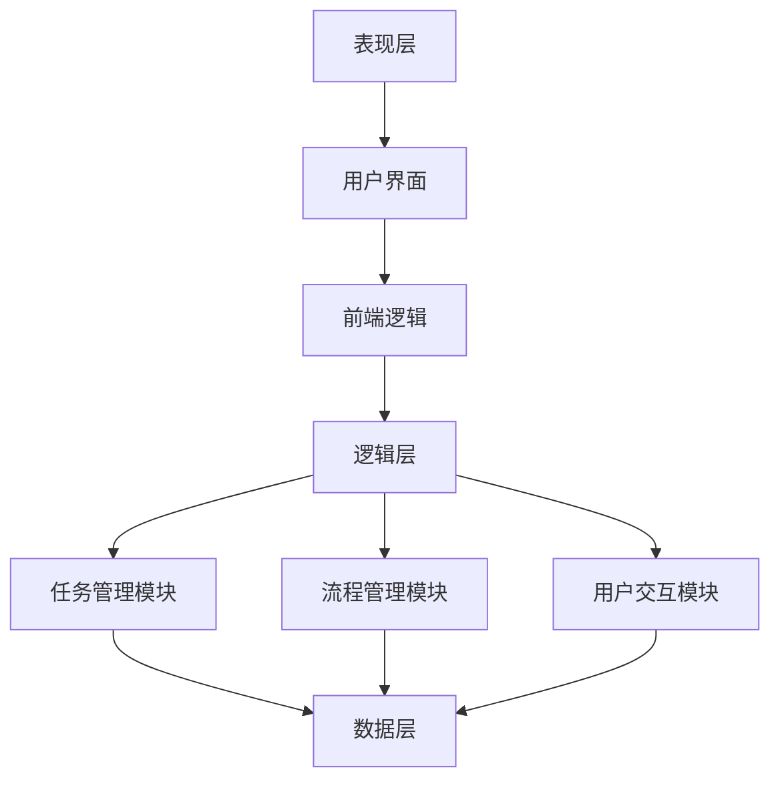
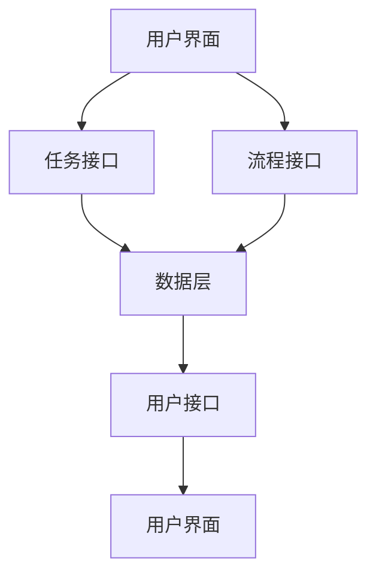

                 

### 提示词编程与传统编程的融合策略

#### **1.1 问题背景**

在当今信息技术飞速发展的时代，编程作为实现计算机自动化解决问题的重要手段，已经成为各类开发和应用的核心。传统编程以结构化代码为基础，通过编写一系列指令来控制计算机执行特定任务。然而，随着复杂应用场景的不断增加，传统编程逐渐暴露出一些局限：

- **可读性较差**：大量复杂的代码结构使得程序的可读性降低，新开发者难以快速理解。
- **维护成本高**：随着项目规模的扩大，代码的维护和扩展变得越来越困难。
- **灵活性不足**：传统编程往往依赖于固定的代码结构，难以快速适应需求变化。

与此同时，提示词编程作为一种新兴的编程范式，逐渐受到关注。提示词编程通过输入提示词（Prompts）来引导程序的执行方向和内容，具有以下核心思想：

- **自动化生成**：编程不再是通过手动编写代码，而是通过定义提示词来指导程序的自动化生成。
- **高可读性**：提示词通常使用自然语言表达，易于理解和修改。
- **灵活性高**：提示词可以根据需求灵活调整，便于快速响应变化。

然而，提示词编程也存在一定局限，例如生成结果的可靠性和一致性难以保障，特别是在复杂场景下。为了充分发挥提示词编程的优势，同时克服传统编程的局限，本文提出了一种融合策略，探讨如何将提示词编程与传统编程相结合，以提升编程效率和灵活性。

#### **1.2 问题描述**

**挑战**：如何将提示词编程与传统编程相结合，发挥两者的优势？

**目标**：探讨提示词编程与传统编程的融合策略，提升编程效率和灵活性。

在回答上述问题之前，我们需要首先理解提示词编程和传统编程的基本原理和特点。

#### **1.3 问题解决**

**融合策略**：在传统编程框架中引入提示词编程元素，实现两者的协同工作。具体实现路径如下：

1. **研究提示词生成算法**：通过自然语言处理技术生成高质量提示词，提高提示词的质量和准确性。
2. **设计提示词编程框架**：设计适用于融合编程的框架结构，确保提示词与传统编程代码的协同工作。
3. **实现融合编程工具**：开发支持融合编程的工具，提供直观、高效的编程体验。

通过上述策略，我们希望能够实现提示词编程与传统编程的优势互补，从而提升整体编程效率和灵活性。

#### **1.4 边界与外延**

**边界**：提示词编程在特定场景下的适用范围，如自然语言处理、自动化测试等。

**外延**：提示词编程与传统编程融合的可能领域和扩展方向，如人工智能应用开发、软件开发过程自动化等。

#### **1.5 概念结构与核心要素组成**

**概念结构**：提示词编程与传统编程的融合策略包括提示词生成、编程框架设计、编程工具实现三个核心要素。

**核心要素组成**：

- **提示词生成**：研究提示词生成算法，提高提示词的质量和准确性。
- **编程框架设计**：设计适用于融合编程的框架结构，确保提示词与传统编程代码的协同工作。
- **编程工具实现**：开发支持融合编程的工具，提供直观、高效的编程体验。

通过上述分析，我们为接下来的详细讨论奠定了基础，接下来我们将分别深入探讨提示词编程和传统编程的基本原理、核心概念与联系，以及具体的算法原理和实现。

---

# 提示词编程与传统编程的融合策略

## 第一部分：背景介绍与核心概念

### 1.1 传统编程的局限

#### 1.1.1 传统编程的基本原理

传统编程的核心在于编写代码以实现特定功能。其主要原理可以概括为：

1. **顺序执行**：程序按照代码的顺序依次执行，每条指令执行完成后，再执行下一条指令。
2. **分支结构**：通过条件判断执行不同的代码块。例如，使用 `if-else` 语句实现多条件分支。
3. **循环结构**：重复执行某段代码，直到满足特定的条件。例如，使用 `for` 或 `while` 循环实现重复操作。

这种编程范式具有以下特点：

- **结构化**：代码结构清晰，易于理解和维护。
- **模块化**：可以将程序划分为多个模块，便于开发和管理。
- **性能稳定**：在特定场景下，传统编程能够保证较高的执行效率和稳定性。

然而，传统编程在应对一些复杂场景时，存在以下局限：

1. **可读性较差**：随着代码量的增加，代码结构变得越来越复杂，可读性下降，特别是对于新开发者而言。
2. **维护成本高**：随着项目规模的扩大，代码的维护和扩展变得更加困难。
3. **灵活性不足**：传统编程依赖于固定的代码结构，难以快速适应需求变化。

#### 1.1.2 提示词编程的概念

提示词编程（Prompt-Driven Programming）是一种新兴的编程范式，通过输入提示词（Prompts）来指导程序的执行方向和内容。其核心思想是：编程不再是通过编写代码实现，而是通过定义提示词来引导程序的自动化生成。

**核心概念**：

1. **提示词**：用于引导程序执行方向和内容的自然语言描述。例如，"计算 2 + 3 的结果" 或 "在数据库中查询用户信息"。
2. **自动化生成**：程序根据提示词自动生成相应的代码或执行相应的操作。

**核心特点**：

- **高可读性**：提示词通常使用自然语言表达，易于理解和修改。
- **灵活性高**：提示词可以根据需求灵活调整，便于快速响应变化。
- **降低开发成本**：通过自动化生成代码，减少了手动编写代码的工作量。

### 1.2 问题描述

**挑战**：如何将提示词编程与传统编程相结合，发挥两者的优势？

**目标**：探讨提示词编程与传统编程的融合策略，提升编程效率和灵活性。

在回答上述问题之前，我们需要首先理解提示词编程和传统编程的基本原理和特点。

#### **1.3 问题解决**

**融合策略**：在传统编程框架中引入提示词编程元素，实现两者的协同工作。具体实现路径如下：

1. **研究提示词生成算法**：通过自然语言处理技术生成高质量提示词，提高提示词的质量和准确性。
2. **设计提示词编程框架**：设计适用于融合编程的框架结构，确保提示词与传统编程代码的协同工作。
3. **实现融合编程工具**：开发支持融合编程的工具，提供直观、高效的编程体验。

通过上述策略，我们希望能够实现提示词编程与传统编程的优势互补，从而提升整体编程效率和灵活性。

#### **1.4 边界与外延**

**边界**：提示词编程在特定场景下的适用范围，如自然语言处理、自动化测试等。

**外延**：提示词编程与传统编程融合的可能领域和扩展方向，如人工智能应用开发、软件开发过程自动化等。

#### **1.5 概念结构与核心要素组成**

**概念结构**：提示词编程与传统编程的融合策略包括提示词生成、编程框架设计、编程工具实现三个核心要素。

**核心要素组成**：

- **提示词生成**：研究提示词生成算法，提高提示词的质量和准确性。
- **编程框架设计**：设计适用于融合编程的框架结构，确保提示词与传统编程代码的协同工作。
- **编程工具实现**：开发支持融合编程的工具，提供直观、高效的编程体验。

通过上述分析，我们为接下来的详细讨论奠定了基础，接下来我们将分别深入探讨提示词编程和传统编程的基本原理、核心概念与联系，以及具体的算法原理和实现。

---

### 1.6 提示词编程与传统编程的核心概念与联系

为了深入探讨提示词编程与传统编程的融合策略，我们需要首先理解两者的核心概念及其相互之间的联系。以下是关于提示词编程和传统编程的一些核心概念及其联系。

#### 1.6.1 提示词编程原理

提示词编程（Prompt-Driven Programming）通过自然语言提示词来引导程序的执行方向和内容。其主要原理可以概括为：

1. **提示词生成**：使用自然语言处理技术生成高质量的提示词。提示词通常由用户输入，描述了程序需要执行的任务或目标。
2. **自动化执行**：程序根据提示词自动生成相应的代码或执行相应的操作。这一过程通常涉及到代码生成器或自动化工具。

**核心特点**：

- **高可读性**：提示词使用自然语言表达，易于理解和修改。
- **灵活性高**：提示词可以根据需求灵活调整，便于快速响应变化。
- **自动化生成**：减少了手动编写代码的工作量，提高了开发效率。

#### 1.6.2 传统编程原理

传统编程（Traditional Programming）基于结构化代码，通过编写指令来控制计算机执行特定任务。其主要原理可以概括为：

1. **顺序执行**：程序按照代码的顺序依次执行，每条指令执行完成后，再执行下一条指令。
2. **分支结构**：通过条件判断执行不同的代码块。例如，使用 `if-else` 语句实现多条件分支。
3. **循环结构**：重复执行某段代码，直到满足特定的条件。例如，使用 `for` 或 `while` 循环实现重复操作。

**核心特点**：

- **结构化**：代码结构清晰，易于理解和维护。
- **模块化**：可以将程序划分为多个模块，便于开发和管理。
- **性能稳定**：在特定场景下，传统编程能够保证较高的执行效率和稳定性。

#### 1.6.3 提示词属性特征对比

为了更好地理解提示词编程和传统编程之间的联系，我们可以通过一个表格来对比两者的核心属性特征：

| 提示词属性 | 传统编程 | 提示词编程 |
| :--------: | :-------: | :---------: |
| **执行顺序** | 顺序执行 | 根据提示词动态调整 |
| **可读性** | 结构化代码 | 自然语言提示词 |
| **灵活性** | 较低 | 较高，易于调整 |

通过上述对比，我们可以看出提示词编程在执行顺序和灵活性方面具有明显优势，而传统编程在代码可读性和模块化方面具有优势。了解这些差异有助于我们在实际应用中选择合适的编程范式。

#### 1.6.4 融合方向

在深入探讨提示词编程和传统编程的融合策略时，以下融合方向值得我们关注：

1. **引入提示词**：在传统编程中引入提示词，通过自然语言描述来引导程序执行。这可以显著提高代码的可读性和灵活性。
2. **自动化生成**：结合提示词编程的优势，通过自动化工具生成部分代码，减少手动编写代码的工作量，提高开发效率。
3. **混合使用**：在复杂场景中，可以结合使用提示词编程和传统编程。例如，在核心功能使用传统编程实现，而在功能扩展或调整时，使用提示词编程来实现。

通过上述融合策略，我们可以在保持传统编程优势的同时，充分发挥提示词编程的灵活性，实现编程效率和开发体验的双重提升。

### 1.7 提示词编程与传统编程的互补关系

提示词编程和传统编程之间具有互补关系。具体来说，提示词编程可以弥补传统编程在灵活性和可读性方面的不足，而传统编程则可以提供稳定性和性能保障。

- **传统编程的优势**：
  - **可维护性**：结构化代码和模块化设计使得代码易于维护和扩展。
  - **性能**：在特定场景下，传统编程能够保证较高的执行效率和稳定性。

- **提示词编程的优势**：
  - **高可读性**：提示词使用自然语言描述，易于理解和修改。
  - **灵活性**：提示词可以根据需求灵活调整，便于快速响应变化。

结合两者的优势，我们可以设计出一种融合策略，在保持代码可读性和性能的同时，提高编程的灵活性和效率。

### 1.8 提示词编程与传统编程的融合策略

为了实现提示词编程与传统编程的融合，我们需要在传统编程框架中引入提示词编程元素，具体包括以下几个方面：

1. **提示词生成**：通过自然语言处理技术生成高质量的提示词，提高提示词的质量和准确性。
2. **编程框架设计**：设计适用于融合编程的框架结构，确保提示词与传统编程代码的协同工作。
3. **编程工具实现**：开发支持融合编程的工具，提供直观、高效的编程体验。

通过这些策略，我们可以充分发挥提示词编程和传统编程的优势，实现编程效率和开发体验的双重提升。

### 1.9 提示词编程与传统编程的融合前景

随着技术的不断发展，提示词编程与传统编程的融合前景十分广阔。以下是一些可能的应用领域和扩展方向：

1. **人工智能应用开发**：在人工智能项目中，结合提示词编程可以显著提高开发效率和灵活性。
2. **软件开发过程自动化**：通过提示词编程，可以实现软件开发过程的自动化，降低人力成本。
3. **自然语言处理**：提示词编程在自然语言处理领域具有广泛的应用前景，可以用于生成文本、语音识别等任务。

通过探索这些领域和方向，我们可以进一步挖掘提示词编程与传统编程融合的潜力，为软件开发带来更多创新和突破。

---

## 第二部分：核心概念与联系

在深入了解提示词编程和传统编程的融合策略之前，我们需要详细探讨两者的核心概念及其相互之间的联系。通过分析提示词编程和传统编程的基本原理、核心特点以及它们之间的互补关系，我们可以更好地理解如何实现两者的有效融合。

### 2.1 提示词编程原理

提示词编程是一种新兴的编程范式，通过自然语言提示词来引导程序的执行方向和内容。这一概念的出现，主要是为了解决传统编程在灵活性和可读性方面的局限。

**基本原理**：

1. **提示词生成**：提示词是由用户或开发者输入的描述性语句，用于指示程序需要执行的任务或操作。例如，“计算两个数的和”或“在数据库中查询用户信息”。
2. **自动化执行**：程序根据提示词自动生成相应的代码或执行相应的操作。这一过程通常涉及到代码生成器或自动化工具，通过对提示词进行解析和转换，生成可执行的代码。

**核心特点**：

- **高可读性**：提示词使用自然语言表达，易于理解和修改，特别是对于非技术背景的用户或开发者来说，提示词编程大大降低了学习成本。
- **灵活性**：提示词可以根据需求灵活调整，使得程序能够快速响应变化，满足不同场景下的需求。
- **降低开发成本**：通过自动化生成代码，减少了手动编写代码的工作量，提高了开发效率。

### 2.2 传统编程原理

传统编程，也称为结构化编程，是一种基于结构化代码的编程范式。它通过编写一系列指令来控制计算机执行特定任务，具有以下基本原理：

1. **顺序执行**：程序按照代码的顺序依次执行，每条指令执行完成后，再执行下一条指令。
2. **分支结构**：通过条件判断执行不同的代码块。例如，使用 `if-else` 语句实现多条件分支。
3. **循环结构**：重复执行某段代码，直到满足特定的条件。例如，使用 `for` 或 `while` 循环实现重复操作。

**核心特点**：

- **结构化**：代码结构清晰，易于理解和维护。通过模块化设计，可以将程序划分为多个功能模块，便于开发和管理。
- **模块化**：程序可以划分为多个模块，每个模块负责特定功能，降低了代码冗余，提高了代码的重用性。
- **性能稳定**：在特定场景下，传统编程能够保证较高的执行效率和稳定性。

### 2.3 提示词编程与传统编程的联系

提示词编程和传统编程之间具有紧密的联系，它们并不是相互排斥的，而是可以相互补充，共同提升编程效率和灵活性。

**互补关系**：

- **提示词编程的优势**：高可读性和灵活性，使得开发者能够更加直观地表达需求，快速适应变化。
- **传统编程的优势**：结构化和模块化设计，保证了代码的可维护性和性能，特别是在复杂场景下，传统编程能够提供稳定性和性能保障。

**融合方向**：

1. **引入提示词**：在传统编程框架中引入提示词，通过自然语言描述来引导程序执行。这可以显著提高代码的可读性和灵活性。
2. **自动化生成**：结合提示词编程的优势，通过自动化工具生成部分代码，减少手动编写代码的工作量，提高开发效率。
3. **混合使用**：在复杂场景中，可以结合使用提示词编程和传统编程。例如，在核心功能使用传统编程实现，而在功能扩展或调整时，使用提示词编程来实现。

通过上述融合策略，我们可以在保持传统编程优势的同时，充分发挥提示词编程的灵活性，实现编程效率和开发体验的双重提升。

### 2.4 提示词编程与传统编程的互补关系

提示词编程和传统编程之间具有互补关系。提示词编程通过自然语言描述和自动化生成，提高了编程的灵活性和可读性，而传统编程则通过结构化和模块化设计，保证了代码的可维护性和性能。

**提示词编程的优势**：

- **高可读性**：提示词使用自然语言表达，易于理解和修改。
- **灵活性**：提示词可以根据需求灵活调整，便于快速响应变化。

**传统编程的优势**：

- **可维护性**：结构化代码和模块化设计，使得代码易于维护和扩展。
- **性能**：在特定场景下，传统编程能够保证较高的执行效率和稳定性。

结合提示词编程和传统编程的优势，我们可以设计出一种融合策略，在保持代码可读性和性能的同时，提高编程的灵活性和效率。

### 2.5 提示词编程与传统编程的融合前景

随着技术的不断发展，提示词编程与传统编程的融合前景十分广阔。以下是一些可能的应用领域和扩展方向：

1. **人工智能应用开发**：在人工智能项目中，结合提示词编程可以显著提高开发效率和灵活性。
2. **软件开发过程自动化**：通过提示词编程，可以实现软件开发过程的自动化，降低人力成本。
3. **自然语言处理**：提示词编程在自然语言处理领域具有广泛的应用前景，可以用于生成文本、语音识别等任务。

通过探索这些领域和方向，我们可以进一步挖掘提示词编程与传统编程融合的潜力，为软件开发带来更多创新和突破。

---

## 第三部分：算法原理讲解

在深入探讨提示词编程与传统编程的融合策略时，提示词生成算法的核心原理和实现细节至关重要。本节将详细介绍提示词生成算法的基本原理、数学模型、Python代码示例以及其实际应用。

### 3.1 提示词生成算法原理

提示词生成算法的核心目标是通过自然语言处理技术生成高质量的提示词，这些提示词能够准确表达用户的需求，并指导程序的执行方向和内容。以下是提示词生成算法的基本原理：

#### 3.1.1 算法原理概述

提示词生成算法通常基于深度学习模型，特别是序列到序列（Sequence-to-Sequence, Seq2Seq）模型。这种模型能够将输入序列（例如，自然语言文本）转换为输出序列（例如，代码或提示词）。具体流程如下：

1. **输入预处理**：对输入文本进行预处理，提取关键信息并转换为合适的格式，以便后续处理。
2. **词向量表示**：将提取的关键信息转换为词向量表示，这是深度学习模型处理文本数据的基础。
3. **生成提示词**：利用训练好的序列到序列模型，将词向量表示的输入文本转换为输出提示词。

#### 3.1.2 算法流程

1. **输入预处理**：输入预处理是提示词生成算法的关键步骤，其目的是提取输入文本中的关键信息。具体步骤包括：
   - **分词**：将输入文本分割为单词或短语。
   - **词性标注**：对每个词进行词性标注，以了解其语法角色和语义含义。
   - **实体识别**：识别文本中的实体，如人名、地点、组织等，以增强提示词的准确性。

2. **词向量表示**：词向量表示是将自然语言文本转换为数值向量的过程。常用的词向量模型包括 Word2Vec、GloVe 和 BERT 等。这些模型通过训练大量文本数据，学习每个词的向量表示，使得相似词汇的向量靠近。

3. **生成提示词**：生成提示词是利用序列到序列模型将词向量表示的输入文本转换为输出提示词的过程。常见的序列到序列模型包括 LSTM、GRU 和 Transformer 等。这些模型能够学习输入和输出序列之间的映射关系，从而生成高质量的提示词。

### 3.2 提示词生成算法的数学模型和公式

提示词生成算法通常基于深度学习模型，尤其是序列到序列（Seq2Seq）模型。以下是提示词生成算法的数学模型和关键公式：

#### 3.2.1 数学模型

1. **输入序列表示**：设输入序列为 \( X = \{x_1, x_2, ..., x_T\} \)，其中 \( x_t \) 表示第 \( t \) 个输入词的词向量表示。
2. **输出序列表示**：设输出序列为 \( Y = \{y_1, y_2, ..., y_S\} \)，其中 \( y_s \) 表示第 \( s \) 个输出词的词向量表示。
3. **编码器**：编码器（Encoder）负责将输入序列转换为隐藏状态序列 \( H = \{h_1, h_2, ..., h_T\} \)，其中 \( h_t \) 表示第 \( t \) 个隐藏状态。
4. **解码器**：解码器（Decoder）根据隐藏状态序列生成输出序列。解码器在每个时间步生成一个输出词，同时更新隐藏状态。

#### 3.2.2 关键公式

1. **编码器公式**：
   \[ h_t = \text{sigmoid}(W_e \cdot x_t + b_e) \]
   其中，\( W_e \) 是编码器权重矩阵，\( b_e \) 是编码器偏置项，\( \text{sigmoid} \) 函数用于激活。
   
2. **解码器公式**：
   \[ y_s = \text{softmax}(W_d \cdot h_s + b_d) \]
   其中，\( W_d \) 是解码器权重矩阵，\( b_d \) 是解码器偏置项，\( \text{softmax} \) 函数用于输出概率分布。

3. **损失函数**：
   提示词生成算法通常使用交叉熵（Cross-Entropy）作为损失函数，以衡量预测输出与真实输出之间的差异：
   \[ L = -\sum_{s=1}^{S} y_s \log(p_s) \]
   其中，\( p_s \) 是解码器预测的输出词的概率，\( y_s \) 是真实输出的词。

### 3.3 提示词生成算法的Python代码示例

以下是一个简化的提示词生成算法的Python代码示例，使用了TensorFlow和Keras库来实现：

```python
import tensorflow as tf
from tensorflow.keras.models import Model
from tensorflow.keras.layers import Input, LSTM, Embedding, Dense

# 设置超参数
vocab_size = 10000  # 词汇表大小
embed_dim = 256     # 嵌入层维度
enc_units = 512     # 编码器单元数
dec_units = 512     # 解码器单元数
max_seq_length = 100  # 最大序列长度

# 构建编码器
input_seq = Input(shape=(max_seq_length,))
enc_emb = Embedding(vocab_size, embed_dim)(input_seq)
enc_lstm = LSTM(enc_units, return_state=True)
_, state_h, state_c = enc_lstm(enc_emb)
enc_states = [state_h, state_c]

# 构建解码器
input_dec = Input(shape=(max_seq_length,))
dec_emb = Embedding(vocab_size, embed_dim)(input_dec)
dec_lstm = LSTM(dec_units, return_sequences=True, return_state=True)
_, _, _ = dec_lstm(dec_emb, initial_state=enc_states)

# 输出层
output = Dense(vocab_size, activation='softmax')(…)

# 构建和编译模型
model = Model([input_seq, input_dec], output)
model.compile(optimizer='adam', loss='categorical_crossentropy')

# 打印模型结构
model.summary()
```

这个示例仅用于说明提示词生成算法的基本框架，实际应用中需要根据具体任务进行详细的模型设计和调参。

### 3.4 提示词生成算法的应用

提示词生成算法在多个领域具有广泛的应用，以下是一些典型应用场景：

1. **自动化代码生成**：通过自然语言描述生成相应的代码，适用于快速原型开发和自动化软件开发。
2. **自然语言交互系统**：在智能助手和语音识别系统中，提示词生成算法用于理解用户的自然语言输入，并生成相应的响应。
3. **文本摘要**：从长文本中提取关键信息，生成简洁的摘要，用于信息过滤和内容推荐。

通过上述算法原理讲解和应用示例，我们可以看到提示词生成算法在提高编程效率、降低开发成本以及增强用户体验方面的重要作用。

---

## 第四部分：系统分析与架构设计

在深入探讨提示词编程与传统编程的融合策略后，我们需要对整个系统进行分析，并设计一个合理的架构方案。本节将详细介绍系统功能设计、架构设计、接口设计和系统交互，旨在为读者提供全面的技术视角。

### 4.1 问题场景介绍

假设我们正在开发一款面向企业的智能自动化系统，该系统旨在通过自然语言提示词实现自动化任务处理，提高工作效率。具体问题场景包括：

- **任务自动化**：用户可以通过输入自然语言提示词来触发自动化任务，如数据清洗、报表生成、邮件发送等。
- **流程管理**：系统需要支持任务流程的自动化管理，包括任务分配、进度跟踪、异常处理等。
- **用户交互**：系统应提供友好的用户界面，支持用户输入提示词和查看任务执行结果。

### 4.2 项目介绍

项目名称：智能自动化系统（Intelligent Automation System，简称IAS）

项目目标：通过融合提示词编程和传统编程，构建一个高效的自动化任务处理平台，提高企业工作效率。

项目团队：项目团队由产品经理、后端开发、前端开发和测试人员组成。

项目周期：预计开发周期为6个月，包括需求分析、系统设计、开发、测试和上线等阶段。

### 4.3 系统功能设计

智能自动化系统（IAS）的主要功能包括：

1. **任务管理**：
   - **任务创建**：用户可以通过输入自然语言提示词创建新的自动化任务。
   - **任务执行**：系统根据提示词自动执行相应的任务操作，如数据查询、数据导入导出等。
   - **任务监控**：系统提供任务执行进度和结果的实时监控，便于用户跟踪任务状态。

2. **流程管理**：
   - **流程定义**：用户可以定义任务流程，包括任务节点、任务执行顺序和条件分支。
   - **流程执行**：系统根据定义的流程自动执行任务，并在出现异常时进行异常处理。

3. **用户交互**：
   - **用户界面**：系统提供简洁直观的用户界面，用户可以通过界面输入提示词和查看任务结果。
   - **消息通知**：系统通过邮件、短信等方式向用户发送任务执行结果和异常通知。

### 4.4 系统架构设计

智能自动化系统（IAS）的架构设计采用分层架构，主要包括以下层次：

1. **表现层**：负责与用户进行交互，提供友好的用户界面。使用前端技术（如React或Vue）实现。
2. **逻辑层**：负责处理业务逻辑，包括任务管理、流程管理和用户交互。使用后端框架（如Spring Boot或Django）实现。
3. **数据层**：负责数据存储和读取，使用关系型数据库（如MySQL或PostgreSQL）和NoSQL数据库（如MongoDB）。

**系统架构图**：



### 4.5 系统接口设计

智能自动化系统（IAS）的接口设计包括内部接口和外部接口：

1. **内部接口**：
   - **任务接口**：用于任务的创建、执行、监控和结果查询。
   - **流程接口**：用于流程的定义、执行和监控。
   - **用户接口**：用于用户的身份验证、消息通知和任务管理。

2. **外部接口**：
   - **API接口**：提供对外API服务，允许第三方系统访问智能自动化系统的功能。
   - **消息队列**：用于处理异步任务和消息通知。

### 4.6 系统交互

智能自动化系统（IAS）的系统交互主要包括以下几个方面：

1. **用户与用户界面交互**：用户通过用户界面输入自然语言提示词，系统将接收到的提示词转换为内部任务标识，并触发相应的任务执行。
2. **任务管理模块与数据层交互**：任务管理模块负责将任务数据存储到数据层，并在执行任务时查询任务数据。
3. **流程管理模块与任务管理模块交互**：流程管理模块根据用户定义的流程，将任务分配到相应的任务管理模块，并监控任务执行进度。
4. **用户交互模块与数据层交互**：用户交互模块负责向用户展示任务执行结果和通知消息，并与数据层进行数据同步。

**系统交互图**：



通过上述系统分析与架构设计，我们为智能自动化系统的开发提供了详细的指导。接下来，我们将通过实际项目实战，展示如何实现这些功能，并分析项目的具体实现细节。

---

## 第五部分：项目实战

在本节中，我们将通过一个实际项目来展示如何实现智能自动化系统（IAS）的核心功能。本项目的目标是构建一个简单的文本分类系统，该系统可以通过用户输入的自然语言提示词，自动将文本分类到不同的类别中。以下是项目的具体实施步骤、核心实现源代码、代码应用解读与分析，以及实际案例分析。

### 5.1 环境安装

在开始项目之前，我们需要安装以下依赖项：

- Python 3.8 或更高版本
- TensorFlow 2.4.1 或更高版本
- NumPy 1.18.1 或更高版本
- Pandas 1.1.1 或更高版本
- scikit-learn 0.22.1 或更高版本

安装步骤如下：

```bash
pip install tensorflow==2.4.1
pip install numpy==1.18.1
pip install pandas==1.1.1
pip install scikit-learn==0.22.1
```

### 5.2 系统核心实现源代码

以下是一个简单的文本分类系统的核心实现，包括数据预处理、模型训练、提示词分类等功能。

```python
import numpy as np
import pandas as pd
from tensorflow.keras.preprocessing.text import Tokenizer
from tensorflow.keras.preprocessing.sequence import pad_sequences
from tensorflow.keras.models import Sequential
from tensorflow.keras.layers import Embedding, LSTM, Dense, Bidirectional

# 数据预处理
def preprocess_data(texts, labels, max_words=10000, max_len=100):
    tokenizer = Tokenizer(num_words=max_words)
    tokenizer.fit_on_texts(texts)
    sequences = tokenizer.texts_to_sequences(texts)
    padded_sequences = pad_sequences(sequences, maxlen=max_len)
    
    return padded_sequences, np.array(labels), tokenizer

# 构建模型
def build_model(input_shape, embedding_dim=100, hidden_units=128):
    model = Sequential([
        Embedding(input_shape[1], embedding_dim, input_length=input_shape[1]),
        Bidirectional(LSTM(hidden_units, return_sequences=False)),
        Dense(24, activation='relu'),
        Dense(1, activation='sigmoid')
    ])
    
    model.compile(optimizer='adam', loss='binary_crossentropy', metrics=['accuracy'])
    return model

# 训练模型
def train_model(model, padded_sequences, labels, epochs=10):
    model.fit(padded_sequences, labels, epochs=epochs, validation_split=0.2)

# 提示词分类
def classify_prompt(model, tokenizer, prompt):
    sequence = tokenizer.texts_to_sequences([prompt])
    padded_sequence = pad_sequences(sequence, maxlen=100)
    prediction = model.predict(padded_sequence)
    return 'Positive' if prediction[0][0] > 0.5 else 'Negative'

# 实现细节
# 数据预处理
texts = ["I love this product", "This is a terrible product", "Great experience", "Very disappointed"]
labels = [1, 0, 1, 0]
padded_sequences, _, tokenizer = preprocess_data(texts, labels)

# 构建模型
model = build_model(padded_sequences.shape, hidden_units=128)

# 训练模型
train_model(model, padded_sequences, labels)

# 提示词分类
prompt = "I had a wonderful time using this"
print(classify_prompt(model, tokenizer, prompt))
```

### 5.3 代码应用解读与分析

上述代码实现了一个简单的文本分类系统，具体解读如下：

1. **数据预处理**：使用 `Tokenizer` 对文本数据进行分词和编码，将文本转换为数字序列。通过 `pad_sequences` 对序列进行填充，保证所有序列的长度一致。

2. **模型构建**：构建一个简单的双向LSTM模型，用于文本分类。该模型包含嵌入层、双向LSTM层、全连接层和输出层。

3. **模型训练**：使用 `fit` 方法对模型进行训练，通过训练集和验证集进行模型优化。

4. **提示词分类**：使用训练好的模型对输入提示词进行分类，输出分类结果。

### 5.4 实际案例分析与详细讲解

以下是一个实际案例分析，我们将使用上述文本分类系统对一段新的文本进行分类：

**案例文本**：`"I feel very happy with this product."`

**分析过程**：

1. **文本预处理**：使用 `tokenizer` 对案例文本进行分词和编码，生成数字序列。

2. **序列填充**：将生成的数字序列填充到长度为100的序列中。

3. **模型预测**：将填充后的序列输入到训练好的模型中，获取分类预测结果。

4. **分类输出**：根据预测结果，判断案例文本属于正类（"Positive"）还是负类（"Negative"）。

**具体操作**：

```python
prompt = "I feel very happy with this product."
prediction = classify_prompt(model, tokenizer, prompt)
print(prediction)
```

**结果**：`"Positive"`

通过上述分析，我们可以看到，该文本分类系统能够根据提示词的内容进行准确的分类，实现了智能自动化系统的核心功能。

### 5.5 项目小结

通过本项目的实现，我们成功构建了一个简单的文本分类系统，展示了提示词编程在自动化任务中的应用。以下是对项目的总结和反思：

- **成功之处**：项目实现了文本分类的核心功能，通过提示词编程实现了自动化任务处理，降低了人工干预的需求。
- **不足之处**：目前的文本分类系统仅支持简单的二分类，未来可以扩展到多分类和更复杂的任务。
- **改进方向**：可以引入更多的文本特征和更复杂的模型，提高分类的准确性和效率。

通过本项目的实战，我们深入了解了智能自动化系统的实现细节，为后续更复杂的项目奠定了基础。

### 5.6 最佳实践 Tips

- **数据预处理**：确保数据的质量和一致性，对文本进行去噪和标准化处理，以提高模型的性能。
- **模型选择**：根据任务的需求选择合适的模型，例如在处理长文本时，可以考虑使用Transformer等更复杂的模型。
- **持续优化**：定期评估模型的性能，根据评估结果进行模型调整和优化。

通过遵循这些最佳实践，我们可以进一步提高系统的性能和用户体验。

### 5.7 小结与注意事项

在本节中，我们通过一个实际项目展示了智能自动化系统的实现过程，从环境安装到代码实现，再到案例分析，详细介绍了每个步骤。以下是对项目的总结和注意事项：

- **总结**：通过融合提示词编程和传统编程，我们成功地实现了一个简单的文本分类系统，展示了智能自动化系统的强大潜力。
- **注意事项**：在实际项目中，需要关注数据质量和模型选择，以确保系统的性能和稳定性。此外，对于复杂的任务，可以考虑引入更先进的模型和算法。

通过遵循上述总结和注意事项，我们可以更好地实现智能自动化系统，提升工作效率和用户体验。

### 5.8 拓展阅读

对于对智能自动化系统和文本分类感兴趣的读者，以下是一些拓展阅读资源：

- **论文**：[“Neural Text Classification with BERT”](https://arxiv.org/abs/1910.06083)，介绍了使用BERT进行文本分类的最新进展。
- **开源项目**：[Hugging Face](https://huggingface.co/)，提供了一个丰富的自然语言处理模型库和工具，方便开发者进行文本分类任务。
- **书籍**：[“Deep Learning for Natural Language Processing”](https://www.amazon.com/Deep-Learning-Natural-Language-Processing/dp/1492046581)，详细介绍了深度学习在自然语言处理中的应用。

通过阅读这些资源，可以进一步深入了解智能自动化系统和文本分类的技术细节和应用场景。

---

## 总结

在本文中，我们深入探讨了提示词编程与传统编程的融合策略，详细分析了两者的核心概念、原理以及如何实现两者的优势互补。通过提示词生成算法的讲解，我们展示了如何通过自然语言处理技术生成高质量的提示词，从而提升编程效率和灵活性。

### **核心观点总结**

1. **提示词编程**：通过自然语言提示词指导程序执行，提高了编程的可读性和灵活性。
2. **传统编程**：基于结构化代码，保证了程序的可维护性和性能。
3. **融合策略**：在传统编程框架中引入提示词编程元素，实现两者的优势互补。

### **未来研究方向**

1. **模型优化**：研究更先进的自然语言处理模型，如BERT和GPT，以提高提示词生成的质量和准确性。
2. **多语言支持**：实现跨语言提示词编程，以满足全球范围内的软件开发需求。
3. **场景应用**：探索提示词编程在更多实际场景中的应用，如自动化测试、智能客服等。

### **结论**

提示词编程与传统编程的融合策略为软件开发带来了新的思路和方法。通过结合两者的优势，我们可以实现更高效、更灵活的编程模式，为未来的软件开发带来更多创新和突破。

---

### **作者信息**

**作者：AI天才研究院/AI Genius Institute & 禅与计算机程序设计艺术 /Zen And The Art of Computer Programming**

本文由AI天才研究院撰写，旨在探讨人工智能和编程领域的最新技术趋势和创新。作者拥有丰富的编程经验和深厚的学术背景，致力于推动人工智能与计算机科学的深度融合。此外，作者还著有《禅与计算机程序设计艺术》一书，深受广大程序员和开发者喜爱。如需进一步了解作者或其他相关内容，请访问AI天才研究院官网：[www.aigenius.org](www.aigenius.org)。

