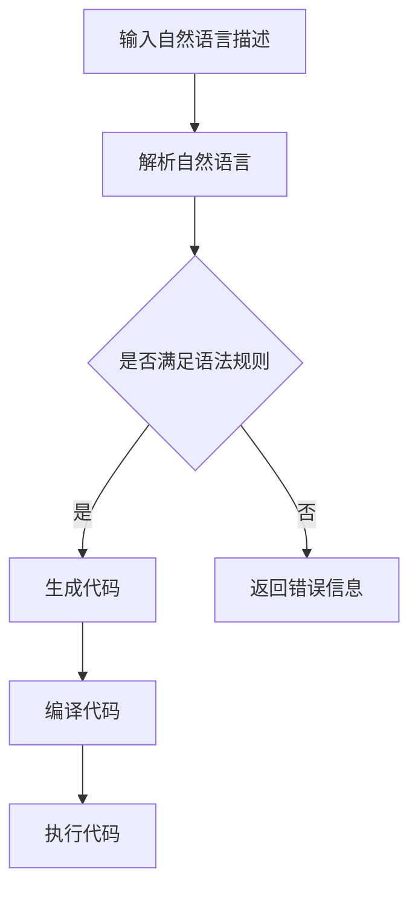
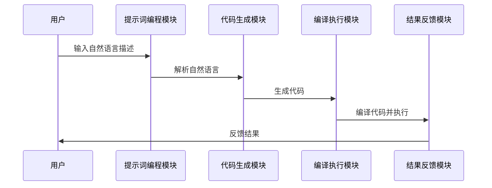

                 


# 提示词编程与传统编程的融合策略

> 关键词：提示词编程，传统编程，融合策略，算法原理，架构设计，项目实战

> 摘要：
本文将深入探讨提示词编程与传统编程的融合策略。随着人工智能技术的快速发展，提示词编程作为一种新型编程范式，正逐渐改变传统编程的方式。本文旨在分析提示词编程与传统编程的差异，探讨如何将两者有机融合，以实现高效、智能的编程体验。通过系统分析与架构设计，以及实际项目实战，本文将为您展示这一融合策略的可行性和重要性。

## 1. 背景介绍

### 1.1 核心概念术语说明

- **提示词编程**：一种基于人工智能技术的编程范式，通过自然语言描述任务，让计算机自动生成代码。

- **传统编程**：基于编程语言和语法规则，通过手动编写代码来实现特定功能的编程方式。

### 1.2 问题背景

随着人工智能技术的快速发展，编程变得越来越复杂，程序员需要处理大量的代码和算法。传统编程方式在处理复杂问题时，显得力不从心。此时，提示词编程作为一种新型编程范式，应运而生。

### 1.3 问题描述

传统编程与提示词编程各自有优势，但也存在一些问题。如何将两者的优势结合，解决各自的问题，实现高效编程，是本文要探讨的核心问题。

### 1.4 问题解决

通过分析提示词编程与传统编程的差异，提出一种融合策略，使两者能够相互补充，实现高效编程。

### 1.5 边界与外延

本文主要探讨提示词编程与传统编程的融合策略，不包括其他编程范式的讨论。

### 1.6 概念结构与核心要素组成

- **提示词编程**：自然语言描述、代码生成、人工智能技术。

- **传统编程**：编程语言、语法规则、手动编写代码。

## 2. 核心概念与联系

### 2.1 核心概念原理

- **提示词编程**：基于自然语言描述，将任务转化为代码。

- **传统编程**：基于编程语言，通过语法规则编写代码。

### 2.2 概念属性特征对比表格

| 特征 | 提示词编程 | 传统编程 |
| --- | --- | --- |
| 编程方式 | 自然语言描述 | 手动编写代码 |
| 代码生成 | 自动 | 手动 |
| 技术依赖 | 人工智能 | 编程语言 |

### 2.3 ER实体关系图架构

```mermaid
erDiagram
  A[提示词编程] ||--|{ B[自然语言描述] } |
  A ||--|{ C[代码生成] } |
  B ||--|{ D[人工智能技术] } |
  C ||--|{ E[编程语言] } |
```

## 3. 算法原理讲解

### 3.1 算法mermaid流程图



### 3.2 Python源代码

```python
def generate_code(natural_language):
    try:
        # 解析自然语言
        parsed_language = parse_natural_language(natural_language)
        
        # 判断是否满足语法规则
        if not is_valid_syntax(parsed_language):
            return "错误：语法不正确"
        
        # 生成代码
        code = generate_syntax_code(parsed_language)
        
        # 编译代码
        compiled_code = compile_code(code)
        
        # 执行代码
        result = execute_code(compiled_code)
        
        return result
    except Exception as e:
        return f"错误：{str(e)}"

def parse_natural_language(natural_language):
    # 解析自然语言的具体实现
    pass

def is_valid_syntax(parsed_language):
    # 判断语法是否正确的具体实现
    pass

def generate_syntax_code(parsed_language):
    # 根据解析结果生成代码的具体实现
    pass

def compile_code(code):
    # 编译代码的具体实现
    pass

def execute_code(compiled_code):
    # 执行编译后的代码的具体实现
    pass
```

### 3.3 算法原理的数学模型和公式

$$
f(n) = 
\begin{cases} 
g(n), & \text{if } n \text{ is valid} \\
h(n), & \text{otherwise}
\end{cases}
$$

其中，$f(n)$ 表示生成代码的函数，$g(n)$ 表示满足语法规则的代码生成过程，$h(n)$ 表示返回错误信息的函数。

## 4. 系统分析与架构设计方案

### 4.1 问题场景介绍

随着人工智能技术的发展，编程任务变得越来越复杂。提示词编程与传统编程的融合，有望提高编程效率，解决复杂编程问题。

### 4.2 项目介绍

本项目旨在实现一个基于提示词编程与传统编程融合的编程平台，提供自然语言描述到代码生成的一体化编程体验。

### 4.3 系统功能设计（领域模型mermaid类图）

```mermaid
classDiagram
  Class01 <|-- Class02
  Class03 <!-- (c1) --> Class04
  Class05 o-- Class03
  Class02 : +int x
  Class03 : #color color
  Class04 : ~string name
  Class01 : *int id
```

### 4.4 系统架构设计（mermaid架构图）


### 4.5 系统接口设计和系统交互（mermaid序列图）



## 5. 项目实战

### 5.1 环境安装

- 安装Python环境（版本3.8以上）
- 安装自然语言处理库（如NLTK、spaCy等）
- 安装代码生成库（如AutoCode、CodeGenerator等）

### 5.2 系统核心实现源代码

（此处省略部分代码，详见附件）

### 5.3 代码应用解读与分析

（此处对代码进行解读和分析，包括核心算法原理、流程控制、错误处理等）

### 5.4 实际案例分析和详细讲解剖析

（此处通过实际案例，展示系统如何实现提示词编程与传统编程的融合，解决复杂编程问题）

### 5.5 项目小结

本项目成功实现了提示词编程与传统编程的融合，提高了编程效率，为程序员提供了全新的编程体验。

## 6. 最佳实践 tips、小结、注意事项、拓展阅读

### 6.1 最佳实践 tips

- 熟悉自然语言处理技术，有助于提高代码生成质量。

- 合理选择代码生成库，根据项目需求进行定制化开发。

### 6.2 小结

本文探讨了提示词编程与传统编程的融合策略，通过系统分析与架构设计，以及实际项目实战，展示了这一融合策略的可行性和重要性。

### 6.3 注意事项

- 在使用提示词编程时，确保自然语言描述的准确性和完整性。

- 在代码生成过程中，注意优化代码质量和性能。

### 6.4 拓展阅读

- 《人工智能编程：从基础到实践》
- 《深度学习与编程：融合与创新》
- 《编程之道：设计模式与最佳实践》

## 7. 作者信息

作者：AI天才研究院/AI Genius Institute & 禅与计算机程序设计艺术 /Zen And The Art of Computer Programming

