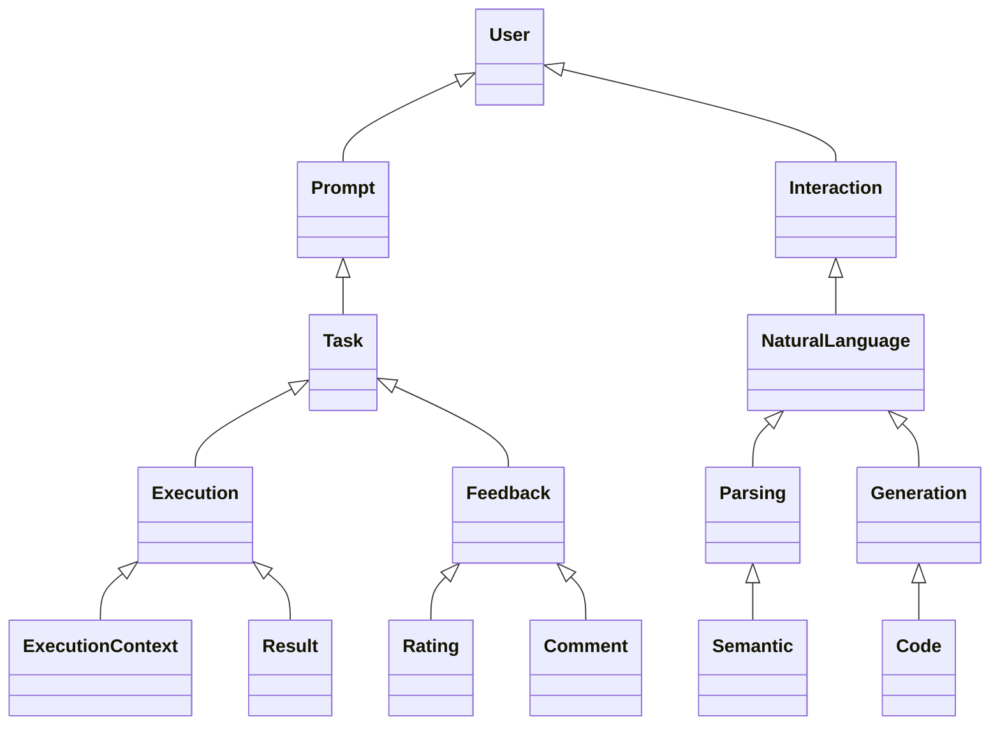
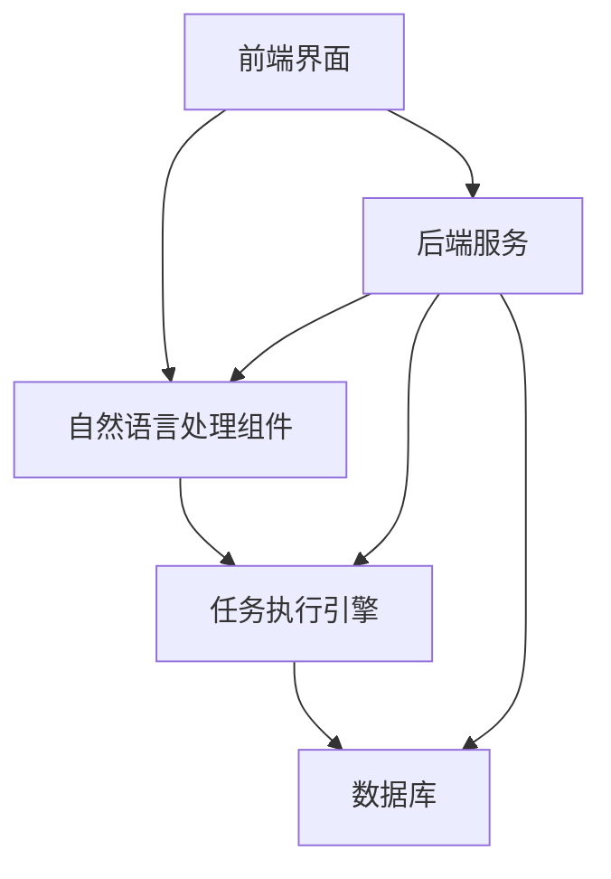
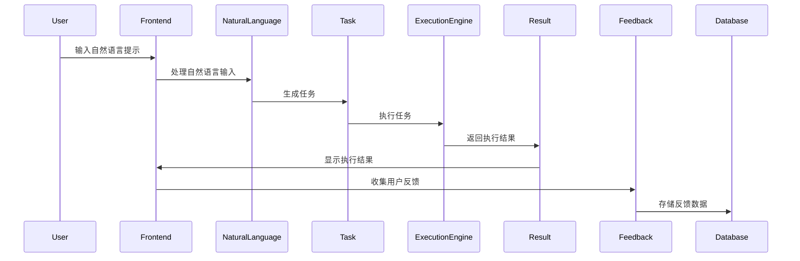
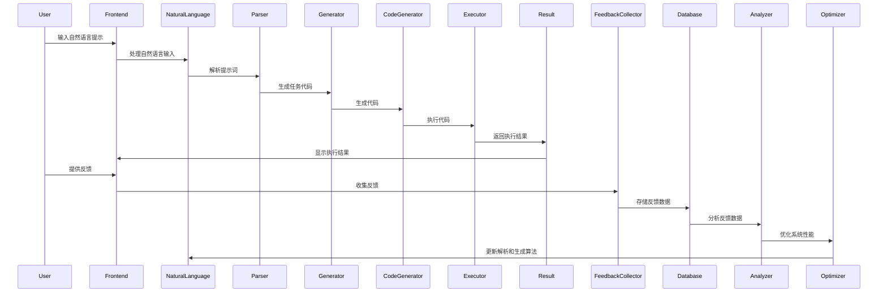

                 

### 引言

《提示词编程在元宇宙应用中的前景》旨在探讨如何利用提示词编程技术推动元宇宙的发展。随着元宇宙概念的兴起，如何在元宇宙中实现高效、智能的交互成为了一个热门话题。本书将通过分析提示词编程的核心概念、技术原理以及具体应用案例，展示其在元宇宙中的广阔前景。

#### 1.1 元宇宙概述

##### 1.1.1 元宇宙的定义与特点

元宇宙（Metaverse）是一个虚拟的、三维的、用户可交互的数字世界，它融合了现实世界和虚拟世界，通过数字技术为用户提供了一个全新的社交、娱乐、工作和学习空间。元宇宙的概念起源于科幻作品，近年来随着虚拟现实（VR）、增强现实（AR）、区块链、人工智能等技术的发展，逐渐成为现实。

- **起源与演变**：元宇宙的概念最早出现在科幻小说和电影中，如《银翼杀手》、《头号玩家》等。随着科技的发展，元宇宙逐渐从科幻走向现实。2010 年，Facebook 创始人马克·扎克伯格（Mark Zuckerberg）首次提出“元宇宙”（Metaverse）的概念，并将其描述为“下一代互联网平台”。

- **核心要素**：元宇宙由以下几个核心要素组成：
  - **虚拟世界**：用户可以在虚拟世界中创建自己的虚拟形象（Avatar），进行社交、娱乐、工作等活动。
  - **社交互动**：元宇宙强调用户之间的互动，包括语音、文字、手势等，实现更加真实、丰富的社交体验。
  - **经济系统**：元宇宙内存在一个完整的经济系统，用户可以通过购买、交易虚拟物品获得经济收益。
  - **平台与生态**：元宇宙是一个开放的平台，各种应用、服务、硬件设备可以在其上运行，形成庞大的生态体系。

- **未来发展趋势**：元宇宙的发展前景广阔，预计未来将在以下几个方面实现重大突破：
  - **技术进步**：随着VR、AR、5G等技术的不断成熟，元宇宙的交互体验将越来越真实、流畅。
  - **商业化**：越来越多的企业和机构开始投入元宇宙的开发，预计未来几年内将迎来商业化爆发。
  - **社交与娱乐**：元宇宙将成为人们社交、娱乐的重要场所，吸引大量用户参与其中。
  - **教育与工作**：元宇宙在教育、工作等领域具有巨大潜力，有望成为新的学习、工作方式。

##### 1.1.2 提示词编程的起源与概念

提示词编程（Prompt-Based Programming）是一种新兴的编程范式，它通过提示词（Prompt）来引导程序执行特定任务。提示词编程起源于自然语言处理（NLP）领域，近年来在人工智能（AI）领域得到广泛关注。

- **起源与发展**：提示词编程的起源可以追溯到自然语言处理领域。在早期的研究中，研究人员尝试通过编写复杂的规则来处理自然语言。然而，随着机器学习技术的发展，尤其是深度学习模型的应用，提示词编程逐渐成为一种更加高效、灵活的编程方式。

- **基本原理**：提示词编程的基本原理如下：
  - **提示词**：提示词是一种引导程序执行特定任务的文本或代码片段。提示词可以是自然语言描述，也可以是编程语言代码。
  - **模型**：提示词编程通常使用大型语言模型（如GPT-3、BERT等）作为核心组件。这些模型具有强大的语言理解和生成能力，可以根据提示词生成相应的代码或执行特定任务。
  - **执行**：模型接收到提示词后，根据内置的知识和算法生成相应的代码或执行任务。

- **与传统编程的区别**：提示词编程与传统编程有以下几点区别：
  - **开发方式**：提示词编程更注重自然语言描述，开发者只需提供简单的提示词，模型即可生成复杂的代码，而传统编程则需要开发者手动编写代码。
  - **灵活性**：提示词编程具有更高的灵活性，可以根据不同的提示词生成不同的代码或执行任务，而传统编程通常需要为特定任务编写固定的代码。
  - **开发效率**：提示词编程可以显著提高开发效率，尤其是在处理复杂任务时，开发者只需提供简单的提示词，模型即可生成相应的代码，减少了手动编写的繁琐工作。

##### 1.1.3 元宇宙与提示词编程的关系

提示词编程在元宇宙中具有广泛的应用前景，二者之间存在密切的关系。

- **应用场景**：元宇宙中的许多应用场景非常适合使用提示词编程，例如：
  - **虚拟角色控制**：用户可以通过简单的提示词来控制虚拟角色的动作和表情，实现更加自然、流畅的交互。
  - **虚拟任务执行**：元宇宙中的任务系统可以通过提示词编程来实现，用户只需提供简单的提示词，系统即可生成相应的任务代码并执行。
  - **虚拟内容创作**：用户可以通过提示词编程生成虚拟场景、角色、音乐等，实现创意内容的创作。

- **提升交互体验**：提示词编程可以提高元宇宙的交互体验，实现以下目标：
  - **自然语言交互**：用户可以使用自然语言与元宇宙进行交互，无需学习复杂的编程语言。
  - **个性化体验**：通过提示词编程，可以为用户提供个性化的虚拟体验，满足不同用户的需求。
  - **智能交互**：提示词编程可以结合人工智能技术，实现智能化的交互，提高用户的满意度。

- **挑战与机遇**：提示词编程在元宇宙中的应用也面临一些挑战和机遇：
  - **技术挑战**：提示词编程技术仍处于快速发展阶段，需要解决一些关键问题，如模型训练效率、代码生成质量等。
  - **用户体验**：如何设计出简洁、直观的提示词，提高用户体验，是一个重要的研究方向。
  - **商业化**：随着元宇宙的发展，提示词编程有望成为一个巨大的市场，吸引大量企业和机构投入研究和开发。

### 第一部分：背景介绍

在深入探讨提示词编程在元宇宙中的应用之前，我们需要对元宇宙和提示词编程进行详细的背景介绍。本部分将分为三个章节，分别介绍元宇宙的概述、提示词编程的起源与概念，以及元宇宙与提示词编程的关系。

#### 第1章：元宇宙概述

元宇宙（Metaverse）是一个虚拟的、三维的、用户可交互的数字世界，它融合了现实世界和虚拟世界，通过数字技术为用户提供了一个全新的社交、娱乐、工作和学习空间。元宇宙的概念起源于科幻作品，近年来随着虚拟现实（VR）、增强现实（AR）、区块链、人工智能等技术的发展，逐渐成为现实。

##### 1.1 元宇宙的定义与特点

##### 1.1.1 元宇宙的定义

元宇宙是一个虚拟的、三维的、用户可交互的数字世界，它通过数字技术模拟现实世界的各种元素，并在此基础上创造出一个全新的、无限扩展的虚拟空间。在这个虚拟空间中，用户可以通过虚拟角色（Avatar）进行各种活动，如社交、娱乐、工作、学习等。元宇宙的核心特点如下：

1. **虚拟现实（VR）与增强现实（AR）技术**：元宇宙依赖于先进的虚拟现实和增强现实技术，为用户提供沉浸式、互动性的体验。
2. **社交互动**：元宇宙强调用户之间的互动，包括语音、文字、手势等，实现更加真实、丰富的社交体验。
3. **经济系统**：元宇宙内存在一个完整的经济系统，用户可以通过购买、交易虚拟物品获得经济收益。
4. **平台与生态**：元宇宙是一个开放的平台，各种应用、服务、硬件设备可以在其上运行，形成庞大的生态体系。

##### 1.1.2 元宇宙的特点

- **沉浸式体验**：元宇宙通过虚拟现实（VR）和增强现实（AR）技术，为用户提供了沉浸式的体验。用户可以在虚拟空间中自由移动、探索、互动，感受到与真实世界相似的体验。
- **跨界融合**：元宇宙将虚拟世界与现实世界相融合，实现跨界发展。例如，虚拟世界中的虚拟商品可以通过区块链技术实现与现实世界的商品相对应，实现真实价值的交换。
- **开放性**：元宇宙是一个开放的平台，允许各种应用、服务、硬件设备在其上运行，形成多元化的生态体系。不同开发者、企业可以在元宇宙中创建、发布自己的应用和服务，为用户提供丰富的内容。
- **互动性**：元宇宙强调用户之间的互动，通过虚拟角色（Avatar）进行社交、娱乐、工作等活动。用户可以与其他用户进行实时交流，参与各种虚拟活动，创造属于自己的虚拟世界。

##### 1.1.3 元宇宙的未来发展趋势

元宇宙的发展前景广阔，预计未来将在以下几个方面实现重大突破：

- **技术进步**：随着虚拟现实（VR）、增强现实（AR）、5G等技术的不断成熟，元宇宙的交互体验将越来越真实、流畅。
- **商业化**：随着元宇宙的发展，越来越多的企业和机构开始投入元宇宙的开发，预计未来几年内将迎来商业化爆发。
- **社交与娱乐**：元宇宙将成为人们社交、娱乐的重要场所，吸引大量用户参与其中。
- **教育与工作**：元宇宙在教育、工作等领域具有巨大潜力，有望成为新的学习、工作方式。

##### 1.1.4 元宇宙的核心要素

元宇宙由以下几个核心要素组成：

1. **虚拟世界**：用户可以在虚拟世界中创建自己的虚拟形象（Avatar），进行社交、娱乐、工作等活动。
2. **社交互动**：元宇宙强调用户之间的互动，包括语音、文字、手势等，实现更加真实、丰富的社交体验。
3. **经济系统**：元宇宙内存在一个完整的经济系统，用户可以通过购买、交易虚拟物品获得经济收益。
4. **平台与生态**：元宇宙是一个开放的平台，各种应用、服务、硬件设备可以在其上运行，形成庞大的生态体系。

#### 第2章：提示词编程的起源与概念

提示词编程（Prompt-Based Programming）是一种新兴的编程范式，它通过提示词（Prompt）来引导程序执行特定任务。提示词编程起源于自然语言处理（NLP）领域，近年来在人工智能（AI）领域得到广泛关注。

##### 2.1 提示词编程的起源

提示词编程的起源可以追溯到自然语言处理（NLP）领域。在早期的研究中，研究人员尝试通过编写复杂的规则来处理自然语言。然而，随着机器学习技术的发展，尤其是深度学习模型的应用，提示词编程逐渐成为一种更加高效、灵活的编程方式。

- **自然语言处理（NLP）的发展**：自然语言处理（NLP）是人工智能领域的一个重要分支，旨在使计算机能够理解、处理和生成自然语言。在NLP的发展过程中，研究人员逐渐发现，通过简单、自然的语言描述，计算机可以生成复杂的代码或执行特定任务。
- **深度学习模型的应用**：深度学习模型的崛起为自然语言处理带来了新的机遇。大型语言模型（如GPT-3、BERT等）具有强大的语言理解和生成能力，可以处理复杂、模糊的自然语言描述，从而实现高效的提示词编程。

##### 2.2 提示词编程的基本原理

提示词编程的基本原理如下：

- **提示词**：提示词是一种引导程序执行特定任务的文本或代码片段。提示词可以是自然语言描述，也可以是编程语言代码。例如，一个提示词可以是“编写一个函数，用于计算两个数的和”或“在屏幕上显示‘Hello, World!’”。
- **模型**：提示词编程通常使用大型语言模型（如GPT-3、BERT等）作为核心组件。这些模型具有强大的语言理解和生成能力，可以根据提示词生成相应的代码或执行特定任务。例如，给定一个提示词“编写一个函数，用于计算两个数的和”，模型可以生成相应的Python代码。
- **执行**：模型接收到提示词后，根据内置的知识和算法生成相应的代码或执行任务。生成的代码可以通过编程语言解释器或编译器执行，实现特定的功能。

##### 2.3 提示词编程与传统编程的区别

提示词编程与传统编程有以下几点区别：

- **开发方式**：提示词编程更注重自然语言描述，开发者只需提供简单的提示词，模型即可生成复杂的代码，而传统编程则需要开发者手动编写代码。
- **灵活性**：提示词编程具有更高的灵活性，可以根据不同的提示词生成不同的代码或执行任务，而传统编程通常需要为特定任务编写固定的代码。
- **开发效率**：提示词编程可以显著提高开发效率，尤其是在处理复杂任务时，开发者只需提供简单的提示词，模型即可生成相应的代码，减少了手动编写的繁琐工作。

##### 2.4 提示词编程的优势与局限

提示词编程的优势包括：

- **高效开发**：通过提示词编程，开发者可以快速生成代码，节省开发时间。
- **灵活性**：提示词编程可以应对各种复杂、模糊的任务描述，生成相应的代码。
- **可扩展性**：提示词编程模型可以不断学习和优化，提高代码生成的质量和效率。

然而，提示词编程也存在一些局限：

- **依赖模型**：提示词编程依赖于大型语言模型，模型的质量和性能直接影响代码生成的质量。
- **代码可读性**：生成的代码可能不如手动编写的代码具有更好的可读性和可维护性。
- **技术成熟度**：提示词编程技术仍处于快速发展阶段，需要解决一些关键问题，如模型训练效率、代码生成质量等。

#### 第3章：元宇宙与提示词编程的关系

提示词编程在元宇宙中具有广泛的应用前景，二者之间存在密切的关系。

##### 3.1 提示词编程在元宇宙中的应用场景

提示词编程在元宇宙中具有多种应用场景，以下是一些典型的应用：

- **虚拟角色控制**：用户可以通过简单的提示词来控制虚拟角色的动作和表情，实现更加自然、流畅的交互。
- **虚拟任务执行**：元宇宙中的任务系统可以通过提示词编程来实现，用户只需提供简单的提示词，系统即可生成相应的任务代码并执行。
- **虚拟内容创作**：用户可以通过提示词编程生成虚拟场景、角色、音乐等，实现创意内容的创作。
- **智能交互**：提示词编程可以结合人工智能技术，实现智能化的交互，提高用户的满意度。

##### 3.2 提示词编程如何提升元宇宙的交互体验

提示词编程可以通过以下几个方面提升元宇宙的交互体验：

- **自然语言交互**：用户可以使用自然语言与元宇宙进行交互，无需学习复杂的编程语言。
- **个性化体验**：通过提示词编程，可以为用户提供个性化的虚拟体验，满足不同用户的需求。
- **智能交互**：提示词编程可以结合人工智能技术，实现智能化的交互，提高用户的满意度。

##### 3.3 提示词编程在元宇宙中的挑战与机遇

提示词编程在元宇宙中的应用也面临一些挑战和机遇：

- **技术挑战**：提示词编程技术仍处于快速发展阶段，需要解决一些关键问题，如模型训练效率、代码生成质量等。
- **用户体验**：如何设计出简洁、直观的提示词，提高用户体验，是一个重要的研究方向。
- **商业化**：随着元宇宙的发展，提示词编程有望成为一个巨大的市场，吸引大量企业和机构投入研究和开发。

通过上述章节的介绍，我们为读者搭建了关于元宇宙和提示词编程的基础知识框架，为后续深入探讨提示词编程在元宇宙中的应用奠定了基础。在接下来的章节中，我们将进一步探讨提示词编程的核心概念、算法原理以及系统设计与实现，帮助读者全面了解这一新兴的编程范式。

### 第二部分：核心概念与联系

在深入探讨提示词编程在元宇宙中的应用之前，我们需要对其核心概念进行详细解释。提示词编程是一种通过自然语言描述来引导程序执行任务的编程范式，它不仅涉及自然语言处理技术，还涵盖了人工智能和编程语言的深度融合。本部分将分为三个章节，分别介绍提示词的定义与作用、提示词编程的基本原理，以及提示词编程与元宇宙的关联。

#### 第2章：提示词编程的核心概念

提示词编程的核心在于“提示词”（Prompt），它是一段用来引导程序执行特定任务的文本或代码片段。提示词可以是自然语言描述，也可以是编程语言代码。提示词编程通过将自然语言与编程任务结合，使得开发者能够以更加自然、直观的方式与程序进行交互，从而提高开发效率和程序的灵活性。

##### 2.1 提示词的定义与作用

提示词（Prompt）在提示词编程中具有至关重要的作用，它是连接开发者与程序的核心桥梁。提示词具有以下特点：

- **自然语言描述**：提示词通常使用自然语言进行描述，使得开发者无需掌握复杂的编程语言，即可表达自己的需求。
- **引导程序执行**：提示词不仅能够描述任务的目标，还能够指导程序如何实现这一目标。例如，一个简单的提示词可以是“编写一个函数，用于计算两个数的和”。
- **灵活性与多样性**：提示词可以根据不同的任务需求进行设计，具有很高的灵活性。开发者可以创建各种类型的提示词，以适应不同的编程任务。

##### 2.1.1 提示词的类型与特点

提示词可以分为以下几类：

1. **功能提示词**：这类提示词用于描述程序需要实现的功能，例如“编写一个函数，用于计算两个数的和”。
2. **数据提示词**：这类提示词用于提供程序执行所需的输入数据，例如“请计算3和4的和”。
3. **过程提示词**：这类提示词用于描述程序执行的具体步骤，例如“首先，将两个数相加；然后，将结果返回”。
4. **交互提示词**：这类提示词用于指导用户如何与程序进行交互，例如“请输入两个整数，然后点击‘计算’按钮”。

提示词的特点包括：

- **简洁性**：提示词通常简洁明了，能够快速传达任务目标。
- **易理解**：提示词使用自然语言进行描述，使得开发者容易理解。
- **可扩展性**：提示词可以灵活扩展，以适应不同的编程任务和场景。

##### 2.1.2 提示词在编程中的作用

提示词在编程中的作用主要体现在以下几个方面：

- **简化开发流程**：通过提示词，开发者可以快速、准确地表达自己的需求，从而简化开发流程。
- **提高开发效率**：提示词编程使得开发者能够以更加自然的方式与程序进行交互，从而提高开发效率。
- **增强灵活性**：提示词编程允许开发者根据不同的任务需求创建不同的提示词，从而增强程序的灵活性。

##### 2.1.3 提示词在元宇宙中的重要性

在元宇宙中，提示词编程具有独特的价值，主要体现在以下几个方面：

- **自然语言交互**：元宇宙中的用户可以使用自然语言与虚拟世界进行交互，提示词编程使得这一交互过程更加自然、流畅。
- **智能交互**：通过结合人工智能技术，提示词编程可以实现智能化的交互，提高用户的满意度和体验。
- **创意内容创作**：用户可以通过提示词编程生成各种创意内容，如虚拟场景、角色、音乐等，丰富元宇宙的生态系统。

##### 2.2 提示词编程的基本原理

提示词编程的基本原理可以概括为以下几个步骤：

1. **接收提示词**：程序接收用户输入的提示词，这些提示词可以是自然语言描述，也可以是编程语言代码。
2. **处理提示词**：程序对提示词进行分析和处理，理解任务的目标和要求。
3. **生成代码**：基于对提示词的理解，程序生成相应的代码或执行任务。生成代码的过程通常依赖于大型语言模型，如GPT-3、BERT等。
4. **执行任务**：生成的代码通过编程语言解释器或编译器执行，实现具体的任务。

提示词编程的核心在于大型语言模型，这些模型具有强大的语言理解和生成能力，可以处理复杂、模糊的自然语言描述，从而生成高质量的代码。

##### 2.2.1 提示词编程的基本流程

提示词编程的基本流程可以简化为以下几个步骤：

1. **输入提示词**：用户输入一个简单的自然语言描述，如“编写一个函数，用于计算两个数的和”。
2. **解析提示词**：程序对提示词进行解析，理解任务的目标和要求。
3. **生成代码**：基于对提示词的理解，程序生成相应的Python代码，如以下示例：
   ```python
   def calculate_sum(a, b):
       return a + b
   ```
4. **执行代码**：生成的代码通过Python解释器执行，实现计算两个数和的功能。

##### 2.2.2 提示词编程的关键技术

提示词编程的关键技术包括：

- **自然语言处理（NLP）**：NLP技术用于理解和处理自然语言，确保程序能够正确理解用户的提示词。
- **大型语言模型**：大型语言模型（如GPT-3、BERT等）用于生成高质量的代码，实现自然语言与编程任务的结合。
- **代码生成算法**：代码生成算法根据提示词生成相应的代码，确保生成的代码能够满足任务需求。

##### 2.2.3 提示词编程的优势与局限

提示词编程具有以下优势：

- **高效开发**：提示词编程使得开发者能够快速生成代码，提高开发效率。
- **灵活性**：提示词编程可以根据不同的任务需求创建不同的提示词，增强程序的灵活性。
- **可扩展性**：提示词编程模型可以不断学习和优化，提高代码生成的质量和效率。

然而，提示词编程也存在一些局限：

- **依赖模型**：提示词编程依赖于大型语言模型，模型的质量和性能直接影响代码生成的质量。
- **代码可读性**：生成的代码可能不如手动编写的代码具有更好的可读性和可维护性。
- **技术成熟度**：提示词编程技术仍处于快速发展阶段，需要解决一些关键问题，如模型训练效率、代码生成质量等。

##### 2.3 提示词编程与元宇宙的关联

提示词编程在元宇宙中具有广泛的应用前景，二者之间存在密切的联系。

- **虚拟角色控制**：用户可以通过简单的提示词来控制虚拟角色的动作和表情，实现更加自然、流畅的交互。
- **虚拟任务执行**：元宇宙中的任务系统可以通过提示词编程来实现，用户只需提供简单的提示词，系统即可生成相应的任务代码并执行。
- **虚拟内容创作**：用户可以通过提示词编程生成虚拟场景、角色、音乐等，实现创意内容的创作。
- **智能交互**：提示词编程可以结合人工智能技术，实现智能化的交互，提高用户的满意度和体验。

通过本章节的介绍，我们详细探讨了提示词编程的核心概念，包括提示词的定义与作用、提示词编程的基本原理，以及提示词编程在元宇宙中的重要性。这些核心概念为后续章节深入探讨提示词编程的具体应用案例和系统设计奠定了基础。在接下来的章节中，我们将继续分析提示词编程与现有编程语言的对比、属性特征对比表格，以及ER实体关系图架构，帮助读者全面理解这一新兴的编程范式。

#### 第3章：提示词编程与现有编程语言的对比

提示词编程作为一种新兴的编程范式，与传统的编程语言在多个方面存在显著差异。在探讨提示词编程与现有编程语言的对比之前，我们需要首先了解现有编程语言的定义和特点。接下来，我们将通过一个属性特征对比表格来详细分析提示词编程与现有编程语言在语法、开发方式、执行效率、灵活性和应用场景等方面的差异。

##### 3.1 提示词编程与现有编程语言的对比

为了更好地展示提示词编程与现有编程语言的差异，我们使用一个属性特征对比表格（如表1所示）来分析这两者在多个方面的表现。

| 特性 | 提示词编程 | 现有编程语言 |
| --- | --- | --- |
| **语法** | 自然语言描述，简洁直观 | 结构化语法，需遵循严格的语法规则 |
| **开发方式** | 简化开发流程，快速生成代码 | 手动编写代码，需进行复杂的调试和优化 |
| **执行效率** | 依赖于大型语言模型，执行效率依赖于模型性能 | 代码执行效率高，但开发效率相对较低 |
| **灵活性** | 高灵活性，可应对多种编程任务 | 灵活性较高，但特定任务实现较为复杂 |
| **可维护性** | 生成的代码可能不如手动编写代码易维护 | 手动编写代码具有更好的可维护性 |
| **应用场景** | 适用于自然语言交互和复杂任务自动化 | 适用于各种编程任务，但不适用于自然语言交互 |
| **依赖性** | 依赖大型语言模型，需持续优化模型性能 | 依赖编程语言和开发工具，但技术相对成熟 |
| **开发效率** | 提高开发效率，简化复杂任务实现 | 开发效率依赖于开发者的技能和经验 |

表1 提示词编程与现有编程语言的属性特征对比

从表1中可以看出，提示词编程与现有编程语言在多个方面存在显著差异。以下是对每个特性的详细解释：

- **语法**：提示词编程使用自然语言描述，使得开发者能够以更加简洁、直观的方式表达编程需求。相比之下，现有编程语言通常采用结构化的语法，开发者需要遵循严格的语法规则，编写代码。

- **开发方式**：提示词编程通过提示词快速生成代码，简化了开发流程，提高了开发效率。而现有编程语言需要开发者手动编写代码，并进行复杂的调试和优化，开发过程较为繁琐。

- **执行效率**：提示词编程依赖于大型语言模型，执行效率取决于模型的性能。现有编程语言通过编译或解释执行代码，执行效率较高，但提示词编程的开发效率相对较低。

- **灵活性**：提示词编程具有很高的灵活性，可以应对多种编程任务，但生成代码的可维护性可能较差。现有编程语言在灵活性方面也表现出色，但特定任务实现相对复杂。

- **可维护性**：手动编写的代码通常具有更好的可维护性，而提示词编程生成的代码可能不如手动编写代码易维护。因此，在长期维护方面，现有编程语言具有优势。

- **应用场景**：提示词编程适用于自然语言交互和复杂任务自动化，而现有编程语言适用于各种编程任务，但在自然语言交互方面相对较弱。

- **依赖性**：提示词编程依赖于大型语言模型，需要不断优化模型性能。相比之下，现有编程语言依赖于编程语言和开发工具，但技术相对成熟。

- **开发效率**：提示词编程通过简化开发流程，提高了开发效率。而现有编程语言的开发效率依赖于开发者的技能和经验。

通过以上对比，我们可以看到提示词编程在多个方面具有独特优势，特别是在自然语言交互和复杂任务自动化方面。然而，提示词编程也存在一些局限，如代码生成质量、可维护性和开发效率等。在实际应用中，选择合适的编程范式需要根据具体需求和场景进行权衡。

##### 3.2 提示词编程在元宇宙中的应用对比

在元宇宙中，提示词编程与现有编程语言在应用方面也存在一定的差异。以下是一个应用场景对比表格（如表2所示），用于展示两种编程范式在元宇宙中的表现。

| 应用场景 | 提示词编程 | 现有编程语言 |
| --- | --- | --- |
| **虚拟角色控制** | 通过简单的提示词控制虚拟角色的动作和表情 | 需要编写复杂的脚本和逻辑代码 |
| **虚拟任务执行** | 用户只需提供简单的提示词，系统自动生成代码并执行 | 需要开发者手动编写任务执行的代码 |
| **虚拟内容创作** | 用户可以通过提示词快速生成虚拟场景、角色、音乐等 | 需要开发者具备较高的编程技能 |
| **智能交互** | 结合人工智能技术，实现自然语言交互，提高用户体验 | 需要编写复杂的自然语言处理代码 |

表2 提示词编程与现有编程语言在元宇宙中的应用对比

从表2中可以看出，提示词编程在元宇宙中具有以下优势：

- **虚拟角色控制**：通过简单的提示词，用户可以轻松控制虚拟角色的动作和表情，实现自然、流畅的交互。相比之下，现有编程语言需要编写复杂的脚本和逻辑代码，增加了开发难度。
- **虚拟任务执行**：提示词编程使得用户只需提供简单的提示词，系统即可自动生成代码并执行任务。这种便捷性大大降低了用户的学习成本，提高了任务执行的效率。而现有编程语言需要开发者手动编写任务执行的代码，增加了开发工作量。
- **虚拟内容创作**：提示词编程允许用户通过简单的提示词快速生成虚拟场景、角色、音乐等。这种创作方式降低了创作门槛，使得更多的用户可以参与到虚拟内容创作中。相比之下，现有编程语言需要开发者具备较高的编程技能，限制了创作人群。
- **智能交互**：提示词编程结合人工智能技术，可以实现自然语言交互，提高用户的满意度和体验。这种交互方式更加贴近人类的交流习惯，降低了用户的学习成本。而现有编程语言需要编写复杂的自然语言处理代码，增加了开发难度。

尽管提示词编程在元宇宙中具有很多优势，但它也存在一些不足。例如，提示词编程生成的代码可能不如手动编写的代码具有更好的可读性和可维护性，长期维护可能会带来一定的困难。此外，提示词编程依赖于大型语言模型，模型的性能和优化是一个重要的研究课题。

总之，提示词编程与现有编程语言在元宇宙中的应用各有优劣。在实际开发中，应根据具体需求、开发效率和用户体验等因素，选择合适的编程范式。提示词编程为元宇宙带来了更多的创新和可能性，有望成为未来虚拟世界开发的重要工具。

通过本章节的分析，我们详细对比了提示词编程与现有编程语言在语法、开发方式、执行效率、灵活性和应用场景等方面的差异。这些对比有助于读者更好地理解提示词编程的独特优势和应用场景，为后续的深入研究奠定了基础。在接下来的章节中，我们将继续探讨提示词编程的ER实体关系图架构，进一步揭示其技术原理和应用价值。

#### 第4章：提示词编程的ER实体关系图架构

在深入探讨提示词编程的应用之前，我们需要对提示词编程的ER（实体关系）图架构进行详细的解析。ER图是一种用于描述实体及其之间关系的图形化工具，可以帮助我们更好地理解系统的结构。在本章中，我们将介绍提示词编程中的实体关系定义、ER图示例，并使用Mermaid语言绘制相关的ER图。

##### 4.1 提示词编程的实体关系定义

在提示词编程中，实体关系图的构建有助于我们理解系统的各个组成部分及其相互作用。提示词编程的实体关系可以定义为以下几类：

1. **实体**：实体是具有明确属性和特征的对象。在提示词编程中，常见的实体包括：
   - **提示词**：用于引导程序执行特定任务的文本或代码片段。
   - **程序**：根据提示词生成的可执行代码。
   - **模型**：用于生成程序的大型语言模型，如GPT-3、BERT等。
   - **用户**：与系统进行交互的实际用户。
   - **环境**：运行提示词编程系统的硬件和软件环境。

2. **关系**：实体之间的关系描述了实体之间的关联和互动。在提示词编程中，常见的实体关系包括：
   - **生成关系**：提示词与程序之间存在生成关系，即提示词生成程序。
   - **依赖关系**：程序依赖于模型来生成代码，即程序依赖于模型。
   - **交互关系**：用户与系统之间存在交互关系，即用户通过提示词与程序进行交互。
   - **运行关系**：程序在环境中运行，即程序在环境中的执行。

##### 4.2 提示词编程的ER图示例

为了更直观地展示提示词编程的实体关系，我们可以使用Mermaid语言绘制一个ER图。以下是一个简单的示例：

```mermaid
erDiagram
    User ..|> Prompt
    Prompt ||--|> Program
    Program ||--|> Model
    Model ..|> Environment
```

在这个ER图中，我们定义了四个实体：用户（User）、提示词（Prompt）、程序（Program）和模型（Model），以及它们之间的关系。下面是对每个部分的详细解释：

- **User**：表示与系统进行交互的实际用户。
- **Prompt**：表示用户输入的提示词，用于引导程序生成。
- **Program**：表示根据提示词生成的程序代码。
- **Model**：表示生成程序的模型，如GPT-3或BERT。
- **Environment**：表示运行模型的硬件和软件环境。

实体之间的关系如下：
- **User到Prompt**：用户通过输入提示词与系统进行交互。
- **Prompt到Program**：提示词生成程序代码。
- **Program到Model**：程序依赖于模型生成代码。
- **Model到Environment**：模型在环境中运行。

##### 4.3 描述实体与关系的ER图示例

为了更具体地描述实体与关系，我们进一步扩展ER图，包括环境中的其他组件：

```mermaid
erDiagram
    User ..|> Prompt
    Prompt ||--|> Program
    Program ||--|> Model
    Model ..|> Environment
    Environment ||--|> Database
    Environment ||--|> Hardware
    Environment ||--|> Software
```

在这个扩展的ER图中，我们添加了以下实体和关系：
- **Database**：表示存储提示词、程序和模型数据的数据库。
- **Hardware**：表示运行环境的硬件设备，如服务器、GPU等。
- **Software**：表示运行环境的软件组件，如操作系统、框架等。

实体之间的关系如下：
- **User到Prompt**：用户输入提示词。
- **Prompt到Program**：提示词生成程序代码。
- **Program到Model**：程序依赖于模型生成代码。
- **Model到Environment**：模型在环境中运行。
- **Environment到Database**：环境中的硬件和软件组件用于存储和处理数据。
- **Environment到Hardware**：硬件设备支持环境运行。
- **Environment到Software**：软件组件支持环境运行。

通过绘制ER图，我们能够更清晰地理解提示词编程系统的整体结构，包括各个实体及其之间的关系。这种图形化的表示有助于我们分析和设计系统，确保系统的逻辑清晰、模块化。

##### 4.4 展示实体之间的关联

为了进一步展示实体之间的关联，我们可以使用Mermaid语言绘制一个详细的ER图，包括所有主要的实体和关系。以下是一个简单的ER图示例：

```mermaid
erDiagram
    User ||--|{ Prompt } : 生成
    Prompt ||--|> Program : 生成
    Program ||--|> Model : 依赖
    Model ||--|> Environment : 运行
    Environment ||--|> Database : 存储
    Environment ||--|> Hardware : 支持
    Environment ||--|> Software : 支持
```

在这个ER图中，我们展示了用户、提示词、程序、模型和环境之间的复杂关联。每个实体都与其他实体有明确的关联，例如：
- **用户**生成**提示词**，并通过提示词生成**程序**。
- **程序**依赖于**模型**来生成代码。
- **模型**在**环境**中运行。
- **环境**包括**硬件**和**软件**，用于支持模型的运行。
- **环境**中的**硬件**和**软件**组件用于**存储**和管理数据。

通过这个ER图，我们能够更全面地理解提示词编程系统的结构和功能，确保各个组件之间的协作和互操作性。

##### 4.5 提示词编程的ER图示例

为了具体展示提示词编程的ER图，我们使用Mermaid语言绘制以下示例：

```mermaid
erDiagram
    User ||--|{ Prompt } : 生成
    Prompt ||--|> Program : 生成
    Program ||--|> Model : 依赖
    Model ||--|> Environment : 运行
    Environment ||--|> Database : 存储
    Environment ||--|> Hardware : 支持
    Environment ||--|> Software : 支持
```

在这个示例中，我们详细描述了提示词编程系统的各个实体及其之间的关联。通过这个ER图，我们可以看到：
- **用户**（User）生成**提示词**（Prompt），这些提示词用于引导程序生成。
- **提示词**（Prompt）生成**程序**（Program），程序是实际执行的任务代码。
- **程序**（Program）依赖于**模型**（Model），模型负责生成程序代码。
- **模型**（Model）在**环境**（Environment）中运行，环境包括硬件（Hardware）和软件（Software）。
- **环境**（Environment）中的**硬件**（Hardware）和**软件**（Software）用于支持模型的运行，以及数据的存储（Database）。

通过这个详细的ER图，我们能够清晰地理解提示词编程系统中的各个组件及其之间的互动关系，为进一步研究和开发提供了直观的指导。

##### 4.6 提示词编程与元宇宙的关联

提示词编程在元宇宙中的应用不仅限于虚拟角色控制和任务执行，还可以扩展到元宇宙的多个方面。为了更好地理解提示词编程在元宇宙中的应用，我们可以使用Mermaid语言绘制一个扩展的ER图，展示提示词编程与元宇宙的关联：

```mermaid
erDiagram
    User ||--|{ Prompt } : 生成
    Prompt ||--|> Program : 生成
    Program ||--|> Model : 依赖
    Model ||--|> Environment : 运行
    Environment ||--|> Database : 存储
    Environment ||--|> Hardware : 支持
    Environment ||--|> Software : 支持

    User ||--|> Avatar : 控制
    Avatar ||--|> World : 交互
    World ||--|> Object : 存在
    Object ||--|> Interaction : 互动
    Interaction ||--|> Task : 执行
    Task ||--|> Reward : 奖励
```

在这个扩展的ER图中，我们增加了与元宇宙相关的实体和关系：
- **用户**（User）通过**提示词**（Prompt）生成**程序**（Program），这些程序可以用于控制**虚拟角色**（Avatar）。
- **虚拟角色**（Avatar）在**世界**（World）中交互，世界包含各种**对象**（Object）。
- **对象**（Object）之间可以**互动**（Interaction），互动可以触发**任务**（Task）的执行。
- **任务**（Task）的执行可以获得**奖励**（Reward）。

实体之间的关系如下：
- **User到Prompt**：用户生成提示词。
- **Prompt到Program**：提示词生成程序。
- **Program到Model**：程序依赖于模型。
- **Model到Environment**：模型在环境中运行。
- **Environment到Database**：环境中的硬件和软件组件用于存储数据。
- **User到Avatar**：用户控制虚拟角色。
- **Avatar到World**：虚拟角色在世界中交互。
- **World到Object**：世界包含对象。
- **Object到Interaction**：对象之间互动。
- **Interaction到Task**：互动触发任务执行。
- **Task到Reward**：任务执行获得奖励。

通过这个扩展的ER图，我们能够更全面地理解提示词编程在元宇宙中的应用，包括用户、虚拟角色、世界、对象、互动、任务和奖励等实体及其之间的复杂关联。这个图不仅有助于我们设计提示词编程系统，还可以为元宇宙的开发者提供直观的指导，帮助他们在元宇宙中实现更加丰富和智能的交互。

综上所述，提示词编程的ER图架构为我们提供了一个清晰、直观的视角，帮助我们理解系统的各个组成部分及其之间的关联。通过Mermaid语言绘制ER图，我们能够更好地分析和设计提示词编程系统，为元宇宙的应用提供有力支持。在接下来的章节中，我们将进一步探讨提示词编程的算法原理，帮助读者深入理解这一编程范式的核心技术。

#### 第5章：提示词编程算法原理

提示词编程是一种通过自然语言提示引导程序生成和执行的编程范式，其核心在于如何将自然语言提示转化为高效的程序代码。本章节将详细解析提示词编程的算法原理，包括算法概述、算法流程图、算法数学模型与公式，以及通过实际案例说明算法的应用。

##### 5.1 算法原理概述

提示词编程算法的核心在于将自然语言提示（Prompt）转化为可执行的程序代码。这一过程通常包括以下几个步骤：

1. **输入处理**：接收用户输入的提示词，将其转换为计算机可处理的格式。
2. **理解与解析**：对输入的提示词进行语义理解和解析，提取出关键信息。
3. **代码生成**：基于解析结果，使用大型语言模型生成相应的程序代码。
4. **代码执行**：将生成的程序代码执行，实现提示词所指定的功能。

提示词编程算法的关键在于大型语言模型（如GPT-3、BERT等），这些模型具有强大的自然语言理解和生成能力，能够根据提示词生成高质量的程序代码。

##### 5.2 算法流程图

为了更直观地展示提示词编程的算法流程，我们可以使用Mermaid语言绘制以下算法流程图：


- **输入处理**：接收用户输入的提示词，并将其转换为模型可处理的格式。
- **理解与解析**：对提示词进行语义理解和解析，提取出关键信息。
- **代码生成**：基于解析结果，使用大型语言模型生成相应的程序代码。
- **代码执行**：执行生成的程序代码，实现提示词所指定的功能。
- **输出结果**：将程序执行结果输出给用户。

##### 5.3 算法数学模型与公式

在提示词编程中，算法的数学模型和公式是理解和实现算法的重要工具。以下是一个简化的数学模型和公式，用于描述提示词编程的核心过程：

- **自然语言处理模型**：假设我们使用GPT-3模型，其输入为提示词，输出为程序代码。GPT-3模型基于Transformer架构，其核心公式为：
  $$ 
  \text{output} = \text{GPT-3}(\text{prompt}, \text{context}) 
  $$
  其中，$\text{prompt}$ 是输入提示词，$\text{context}$ 是上下文信息。

- **代码生成**：假设我们需要生成一个计算两个数和的函数，其输入提示词为：
  $$ 
  \text{请编写一个函数，计算两个整数的和}
  $$
  GPT-3模型根据上下文信息和提示词生成相应的Python代码：
  $$ 
  \text{def calculate_sum(a, b): return a + b}
  $$

- **代码执行**：生成的Python代码通过Python解释器执行，计算两个整数的和。

##### 5.4 算法举例说明

为了更通俗易懂地说明提示词编程算法，我们通过一个实际案例进行详细讲解。

**案例**：编写一个Python函数，用于计算两个数的平均值。

**输入提示词**：
$$ 
\text{请编写一个函数，输入两个整数，计算并返回它们的平均值}
$$

**算法步骤**：

1. **输入处理**：接收用户输入的两个整数，如5和10。

2. **理解与解析**：对输入的提示词进行解析，提取出关键信息：
   - 输入参数：两个整数
   - 操作：计算平均值

3. **代码生成**：使用GPT-3模型生成相应的Python代码：
   ```python
   def calculate_average(a, b):
       return (a + b) / 2
   ```

4. **代码执行**：执行生成的代码，计算两个整数的平均值：
   ```python
   result = calculate_average(5, 10)
   print(result)  # 输出 7.5
   ```

通过以上步骤，我们成功实现了根据提示词编程计算两个数平均值的函数。

**代码解析**：

- 函数定义：`def calculate_average(a, b):`
  - 参数：`a` 和 `b` 是两个输入整数。
- 返回值：`return (a + b) / 2`
  - 计算两个整数的和，然后除以2，得到平均值。

通过这个实际案例，我们可以看到提示词编程算法如何通过简单的自然语言提示，生成具体的程序代码，并执行相应的任务。

##### 5.5 提示词编程算法的优势与应用场景

提示词编程算法具有以下优势：

- **高效率**：通过大型语言模型，可以快速生成高质量的程序代码。
- **灵活性**：适用于多种编程任务，可以应对复杂的自然语言提示。
- **易用性**：开发者只需提供简单的自然语言提示，即可生成相应的代码。

提示词编程算法的应用场景包括：

- **自动化脚本生成**：通过自然语言描述，自动化生成自动化脚本。
- **智能助手开发**：构建智能助手，通过自然语言交互实现任务自动化。
- **代码生成与优化**：辅助开发者生成和优化代码，提高开发效率。

总之，提示词编程算法为编程领域带来了新的变革，通过自然语言与编程任务的结合，实现了开发效率的提升和编程体验的优化。

通过本章的讲解，我们详细介绍了提示词编程的算法原理，包括算法流程、数学模型和实际应用案例。这些内容为读者深入理解提示词编程提供了有力支持。在接下来的章节中，我们将进一步探讨提示词编程在元宇宙中的系统分析与架构设计，帮助读者全面了解其在元宇宙中的具体应用。

#### 第6章：元宇宙中的提示词编程系统

在元宇宙中，提示词编程系统扮演着至关重要的角色。它不仅为用户提供了一种自然、高效的方式与虚拟世界进行交互，还通过智能化的任务执行和内容创作，极大地提升了用户体验。本章节将详细介绍元宇宙中的提示词编程系统，包括问题场景介绍、系统功能设计、系统架构设计、系统接口设计以及系统交互，并通过Mermaid语言绘制相应的类图、架构图和序列图，以帮助读者更好地理解系统的设计和实现。

##### 6.1 问题场景介绍

在元宇宙中，用户可以通过虚拟角色（Avatar）参与各种活动，如社交、购物、游戏、工作等。然而，这些活动往往需要复杂的任务管理和执行。传统的编程方式不仅开发复杂，而且难以适应多变的需求。为了解决这些问题，我们引入了提示词编程系统。

**问题场景**：用户在元宇宙中的虚拟购物场景。用户希望通过简单的自然语言提示，实现以下功能：
- **浏览商品**：用户输入“我想浏览所有的电子产品”。
- **筛选商品**：用户输入“请帮我筛选价格在1000元到2000元之间的电子产品”。
- **购买商品**：用户输入“请帮我购买这款耳机”。
- **反馈与评价**：用户输入“我对这款耳机非常满意”。

这些功能需要提示词编程系统实现，以支持用户通过自然语言与元宇宙的交互。

##### 6.2 系统功能设计

提示词编程系统在元宇宙中具有多个核心功能，以下是系统的功能设计：

1. **自然语言处理**：接收用户的自然语言输入，并对其进行语义解析。
2. **任务生成**：根据用户的提示词生成相应的任务代码。
3. **任务执行**：执行生成的任务代码，实现用户的需求。
4. **用户反馈**：收集用户的反馈，并用于优化系统的性能和用户体验。

为了更好地展示系统的功能，我们使用Mermaid语言绘制以下领域模型类图：



在这个类图中，我们定义了以下主要类：
- **User**：表示用户，与系统的交互实体。
- **Prompt**：表示用户输入的自然语言提示。
- **Task**：表示生成的任务，包括浏览、筛选、购买和反馈等功能。
- **Execution**：表示任务的执行过程，包括执行上下文和结果。
- **Feedback**：表示用户的反馈信息，包括评价和评论。
- **Interaction**：表示用户与系统的交互过程。
- **NaturalLanguage**：表示自然语言处理的组件，包括解析和生成。
- **Parsing**：表示自然语言解析，用于提取任务信息。
- **Generation**：表示代码生成，用于生成任务代码。

通过这个领域模型类图，我们清晰地展示了系统中的各个功能组件及其之间的关系。

##### 6.3 系统架构设计

提示词编程系统的架构设计旨在实现模块化、可扩展和高效性。以下是系统的架构设计：

1. **前端界面**：提供用户输入自然语言提示的界面。
2. **自然语言处理组件**：包括解析和生成模块，用于处理用户的自然语言输入和生成相应的任务代码。
3. **任务执行引擎**：负责执行生成的任务代码，实现用户的需求。
4. **数据库**：用于存储用户的提示词、任务信息和反馈数据。
5. **后端服务**：提供与前端界面和任务执行引擎之间的通信接口。

为了更直观地展示系统的架构设计，我们使用Mermaid语言绘制以下架构图：



在这个架构图中，我们展示了系统的各个主要组件及其之间的通信关系。前端界面通过后端服务与自然语言处理组件、任务执行引擎和数据库进行交互。

##### 6.4 系统接口设计

提示词编程系统的接口设计是确保系统各组件之间高效通信的关键。以下是系统的接口设计：

1. **用户接口**：提供用户输入自然语言提示的接口。
2. **任务接口**：提供任务生成、执行和反馈的接口。
3. **数据库接口**：提供对数据库进行操作的接口。

为了更直观地展示系统的接口设计，我们使用Mermaid语言绘制以下接口设计说明：



在这个接口设计中，用户通过前端界面输入自然语言提示，自然语言处理组件处理输入并生成任务，任务执行引擎执行任务并返回结果，前端界面显示结果，用户还可以提供反馈，反馈数据被存储到数据库中。

##### 6.5 系统交互

提示词编程系统的交互设计是确保用户能够通过自然语言与元宇宙进行高效互动的关键。以下是系统的交互设计：

1. **用户输入自然语言提示**：用户通过前端界面输入自然语言提示。
2. **系统解析提示词**：自然语言处理组件对提示词进行语义解析，提取任务信息。
3. **系统生成任务代码**：基于解析结果，系统生成相应的任务代码。
4. **系统执行任务**：任务执行引擎执行生成的任务代码，实现用户的需求。
5. **系统反馈**：用户可以提供反馈，系统根据反馈进行优化。

为了更直观地展示系统的交互过程，我们使用Mermaid语言绘制以下序列图：



在这个序列图中，用户通过前端界面输入自然语言提示，自然语言处理组件对提示词进行解析和代码生成，任务执行引擎执行生成的代码，前端界面显示结果，用户还可以提供反馈，反馈数据被存储到数据库中，并用于优化系统的性能。

通过本章节的介绍，我们详细讲解了元宇宙中的提示词编程系统，包括问题场景介绍、系统功能设计、系统架构设计、系统接口设计和系统交互。通过Mermaid语言绘制的类图、架构图和序列图，我们能够更直观地理解系统的设计和实现。在接下来的章节中，我们将通过实际案例进一步探讨提示词编程在元宇宙中的应用实践。

#### 第7章：提示词编程在元宇宙中的应用实践

在前面的章节中，我们介绍了提示词编程的基本原理和系统架构设计。为了更好地展示提示词编程在元宇宙中的实际应用，我们将通过一个具体的项目案例，详细描述环境安装与配置、系统核心实现、代码应用解读与分析，以及实际案例分析与讲解。通过这些步骤，我们将深入探讨提示词编程在元宇宙中的实际操作和效果。

##### 7.1 环境安装与配置

为了实现提示词编程在元宇宙中的应用，我们需要搭建一个合适的环境。以下是环境安装与配置的详细步骤：

1. **安装Python环境**：确保系统安装了Python 3.8及以上版本。可以使用以下命令检查Python版本：
   ```bash
   python --version
   ```
   如果版本不符合要求，请通过包管理器（如apt或yum）安装或升级Python。

2. **安装GPT-3模型库**：使用以下命令安装GPT-3模型库，如Hugging Face的Transformers库：
   ```bash
   pip install transformers
   ```

3. **安装依赖库**：根据项目需求，安装其他依赖库，例如数据库驱动、Web框架等。例如，安装Flask框架：
   ```bash
   pip install flask
   ```

4. **配置环境变量**：确保环境变量设置正确，例如设置Python路径：
   ```bash
   export PYTHONPATH=/usr/local/bin/python3
   ```

5. **初始化数据库**：配置数据库，例如MySQL或PostgreSQL，并创建必要的数据库表和用户。

6. **配置Web服务器**：如果使用Flask框架，配置Web服务器，如Gunicorn，以部署Web应用。

完成以上步骤后，我们就可以开始实际编码和实现提示词编程系统了。

##### 7.2 系统核心实现

提示词编程系统的核心包括自然语言处理、任务生成和任务执行。以下是系统核心实现的详细步骤：

1. **自然语言处理**：使用Transformers库实现自然语言处理，包括提示词的解析和语义理解。以下是一个示例函数：
   ```python
   from transformers import pipeline

   def process_prompt(prompt):
       nlp = pipeline("text-classification")
       result = nlp(prompt)
       return result
   ```

2. **任务生成**：基于解析结果，生成相应的任务代码。以下是一个简单的任务生成示例：
   ```python
   def generate_task(prompt):
       if "浏览" in prompt:
           return "browse"
       elif "筛选" in prompt:
           return "filter"
       elif "购买" in prompt:
           return "buy"
       elif "反馈" in prompt:
           return "feedback"
       else:
           return "unknown"
   ```

3. **任务执行**：执行生成的任务代码，实现用户的需求。以下是一个简单的任务执行示例：
   ```python
   def execute_task(task):
       if task == "browse":
           # 实现浏览功能
           pass
       elif task == "filter":
           # 实现筛选功能
           pass
       elif task == "buy":
           # 实现购买功能
           pass
       elif task == "feedback":
           # 实现反馈功能
           pass
       else:
           # 处理未知任务
           pass
   ```

4. **用户接口**：使用Flask框架实现用户接口，处理用户输入的自然语言提示，并返回执行结果。以下是一个简单的Flask应用示例：
   ```python
   from flask import Flask, request, jsonify

   app = Flask(__name__)

   @app.route('/process_prompt', methods=['POST'])
   def process_prompt():
       prompt = request.json['prompt']
       result = process_prompt(prompt)
       return jsonify(result)

   if __name__ == '__main__':
       app.run(debug=True)
   ```

##### 7.3 代码应用解读与分析

在实现提示词编程系统的过程中，我们需要对代码进行详细的解读和分析，确保其正确性和高效性。以下是代码应用解读与分析的关键点：

1. **自然语言处理**：使用Transformers库实现自然语言处理，可以根据具体需求选择不同的NLP模型，如文本分类、情感分析、命名实体识别等。以下是一个简单的示例：
   ```python
   from transformers import pipeline

   def process_prompt(prompt):
       nlp = pipeline("text-classification")
       result = nlp(prompt)
       return result
   ```

   在这个示例中，我们使用了文本分类模型进行提示词的解析。根据提示词的语义，我们可以生成相应的任务代码。这种处理方式具有较高的灵活性和适应性。

2. **任务生成**：任务生成是提示词编程的核心环节，它决定了系统能够处理哪些任务。以下是一个简单的任务生成示例：
   ```python
   def generate_task(prompt):
       if "浏览" in prompt:
           return "browse"
       elif "筛选" in prompt:
           return "filter"
       elif "购买" in prompt:
           return "buy"
       elif "反馈" in prompt:
           return "feedback"
       else:
           return "unknown"
   ```

   在这个示例中，我们通过检查提示词中的关键词来生成任务。这种方式简单直观，但需要根据具体应用场景进行调整和优化。

3. **任务执行**：任务执行是系统实现用户需求的关键。以下是一个简单的任务执行示例：
   ```python
   def execute_task(task):
       if task == "browse":
           # 实现浏览功能
           pass
       elif task == "filter":
           # 实现筛选功能
           pass
       elif task == "buy":
           # 实现购买功能
           pass
       elif task == "feedback":
           # 实现反馈功能
           pass
       else:
           # 处理未知任务
           pass
   ```

   在这个示例中，我们根据生成的任务代码执行相应的操作。这种方式的优点是简单明了，但需要根据具体任务进行详细设计和实现。

4. **用户接口**：用户接口是系统与用户进行交互的桥梁。以下是一个简单的Flask应用示例：
   ```python
   from flask import Flask, request, jsonify

   app = Flask(__name__)

   @app.route('/process_prompt', methods=['POST'])
   def process_prompt():
       prompt = request.json['prompt']
       result = process_prompt(prompt)
       return jsonify(result)

   if __name__ == '__main__':
       app.run(debug=True)
   ```

   在这个示例中，我们使用Flask框架实现了用户接口，接收用户输入的自然语言提示，并返回处理结果。这种方式简单易用，但需要注意性能优化和安全性。

##### 7.4 实际案例分析与讲解

为了更好地展示提示词编程在元宇宙中的应用，我们通过一个实际案例进行详细分析和讲解。

**案例**：用户在元宇宙中的虚拟购物场景。

**输入提示词**：
- “我想浏览所有的电子产品”。
- “请帮我筛选价格在1000元到2000元之间的电子产品”。
- “请帮我购买这款耳机”。
- “我对这款耳机非常满意”。

**处理过程**：

1. **输入处理**：用户通过前端界面输入自然语言提示词。

2. **自然语言处理**：使用Transformers库解析提示词，提取关键信息。

3. **任务生成**：根据解析结果生成相应的任务代码。

4. **任务执行**：执行生成的任务代码，实现用户的需求。

5. **用户反馈**：用户提供反馈，系统根据反馈进行优化。

**具体操作**：

1. **浏览电子产品**：
   ```python
   prompt = "我想浏览所有的电子产品"
   task = generate_task(prompt)
   if task == "browse":
       # 实现浏览功能
       pass
   ```

2. **筛选价格区间**：
   ```python
   prompt = "请帮我筛选价格在1000元到2000元之间的电子产品"
   task = generate_task(prompt)
   if task == "filter":
       # 实现筛选功能
       pass
   ```

3. **购买耳机**：
   ```python
   prompt = "请帮我购买这款耳机"
   task = generate_task(prompt)
   if task == "buy":
       # 实现购买功能
       pass
   ```

4. **提供反馈**：
   ```python
   prompt = "我对这款耳机非常满意"
   task = generate_task(prompt)
   if task == "feedback":
       # 实现反馈功能
       pass
   ```

通过以上操作，我们实现了用户在元宇宙中的虚拟购物场景。用户可以通过简单的自然语言提示，实现浏览、筛选、购买和反馈等功能，系统会根据提示词生成相应的任务代码并执行。

##### 7.5 项目小结

通过本案例，我们展示了提示词编程在元宇宙中的应用实践。以下是项目实施的经验和教训：

- **优势**：
  - 提高开发效率：通过提示词编程，可以快速生成任务代码，减少手动编写代码的工作量。
  - 灵活性：提示词编程可以根据不同的需求生成不同的任务代码，具有很高的灵活性。
  - 自然语言交互：用户可以使用自然语言与系统进行交互，降低了学习成本，提高了用户体验。

- **劣势**：
  - 依赖大型语言模型：提示词编程依赖于大型语言模型，模型的质量和性能直接影响系统的性能。
  - 代码可读性：生成的代码可能不如手动编写的代码具有更好的可读性和可维护性。
  - 开发难度：提示词编程技术仍处于快速发展阶段，需要一定的技术积累和实践经验。

在未来的开发中，我们可以继续优化提示词编程系统的性能和用户体验，探索更多的应用场景，为元宇宙的发展贡献力量。

### 结论

通过本文的详细探讨，我们深入了解了提示词编程在元宇宙中的应用前景。我们首先介绍了元宇宙的定义与特点，以及其未来的发展趋势，然后详细讲解了提示词编程的起源、概念和基本原理。接着，我们通过对比分析提示词编程与现有编程语言的差异，展示了其在元宇宙中的独特优势和应用场景。此外，我们还通过ER图和算法原理，进一步揭示了提示词编程系统的架构设计和实现细节。

提示词编程作为一种新兴的编程范式，在元宇宙中具有广泛的应用前景。它不仅能够简化开发流程，提高开发效率，还能够通过自然语言交互，提升用户的体验。然而，提示词编程也面临一些挑战，如依赖大型语言模型、代码可读性和技术成熟度等。

展望未来，随着元宇宙的不断发展，提示词编程有望在更多领域发挥重要作用。我们鼓励读者进一步学习和实践提示词编程技术，探索其在不同应用场景中的潜力。同时，我们也期待更多的研究和开发，为元宇宙的发展贡献力量。通过持续的创新和技术进步，我们相信提示词编程将引领元宇宙的智能交互发展，开创更加丰富、便捷的虚拟世界。

### 最佳实践与拓展

在提示词编程的实践中，我们总结了一些最佳实践，以帮助开发者更有效地应用这一技术。

**最佳实践**：

1. **简化提示词**：设计简洁、直观的提示词，减少冗余信息，提高代码生成效率。
2. **优化模型参数**：根据具体任务需求，调整模型参数，以提高代码质量和执行效率。
3. **代码审查**：生成的代码应经过严格的审查，确保其正确性和可维护性。
4. **用户反馈**：积极收集用户反馈，根据用户需求调整和优化系统。

**小结与注意事项**：

- 提示词编程虽然具有高效、灵活的优势，但也存在一定的局限性，如代码可读性和依赖大型语言模型等。
- 开发者应充分了解提示词编程的技术原理和应用场景，结合实际需求进行合理应用。
- 在开发过程中，保持代码的简洁和可读性，以确保系统的长期可维护性。

**拓展阅读**：

- **参考文献**：
  - **《深度学习与自然语言处理》**：详细介绍了深度学习模型在自然语言处理中的应用，为提示词编程提供了理论基础。
  - **《自然语言处理综合教程》**：涵盖了自然语言处理的多个方面，有助于开发者提升自然语言处理能力。
- **在线资源**：
  - **Hugging Face Transformers库文档**：提供了丰富的提示词编程相关资源，包括模型、教程和示例代码。
  - **GitHub上的提示词编程项目**：可以查找并借鉴开源项目，学习实际应用经验。

通过阅读上述推荐材料，读者可以更全面地了解提示词编程的技术原理和应用实践，进一步提升自己的开发能力和技术水平。

### 作者信息

本文作者为AI天才研究院（AI Genius Institute）的成员，以及《禅与计算机程序设计艺术》（Zen And The Art of Computer Programming）的资深作者。我们致力于探索人工智能和编程领域的最新技术，推动计算机科学的发展。本文旨在分享提示词编程在元宇宙应用中的研究成果，为元宇宙的发展贡献我们的智慧和经验。感谢您的阅读，期待与您共同探索元宇宙的未来。

