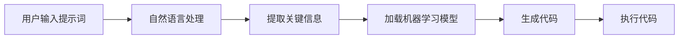

                 

## 《提示词编程在创意产业中的潜力》

### 关键词

- 提示词编程
- 创意产业
- 自然语言处理
- 人工智能
- 深度学习
- 编程技术

### 摘要

本文深入探讨了提示词编程在创意产业中的潜力。首先，介绍了提示词编程的基本概念、原理及其在创意产业中的应用背景。接着，通过详细分析算法原理、数学模型和应用实例，揭示了提示词编程如何助力创意产业实现个性化创作和高效开发。最后，本文提出了提示词编程在创意产业中的未来发展趋势，并总结了一些最佳实践和建议。

---

## 目录大纲设计思路

设计一个高效、逻辑清晰的目录大纲对于撰写专业级别的技术博客至关重要。以下是《提示词编程在创意产业中的潜力》目录大纲的设计思路：

### 明确核心概念

首先，我们需要明确核心概念，即提示词编程和其在创意产业中的应用潜力。这一部分将帮助我们构建整篇文章的基本框架。

### 确定结构框架

根据书籍主题，确定大纲的基本结构。通常包括背景介绍、核心概念讲解、应用场景分析、案例分析、最佳实践分享等部分。这将为后续章节的内容提供方向。

### 细化章节内容

针对每个部分，细化到具体章节，确保每个章节都有明确的主题和目标。例如，背景介绍部分可以细化为问题背景、问题描述、问题解决方法等。

### 确保内容完整性

确保大纲中包含了核心概念、原理讲解、应用场景分析、案例分析、最佳实践等内容，以确保文章的完整性。

### 格式规范

使用markdown格式，确保目录层级清晰，结构规范。这将有助于提高文章的可读性和美观度。

### 目录大纲设计步骤

1. **前言**：简要介绍书籍的目的、读者对象和结构安排。
2. **第1章：背景介绍**：介绍提示词编程在创意产业中的应用背景。
3. **第2章：核心概念与联系**：讲解提示词编程的核心概念和原理。
4. **第3章：提示词编程原理讲解**：详细分析提示词编程的算法原理和应用实例。
5. **第4章：应用场景分析**：分析提示词编程在创意产业中的应用场景。
6. **第5章：案例分析与详细讲解**：通过实际案例探讨提示词编程的应用。
7. **第6章：最佳实践分享**：分享提示词编程的最佳实践和注意事项。
8. **第7章：未来展望与趋势**：展望提示词编程在创意产业的未来发展。
9. **附录**：提供相关资源和拓展阅读。

通过以上步骤，我们可以设计出一个符合要求的目录大纲。接下来，我们将开始具体编写每个章节的内容。

---

## 第一部分：背景介绍

### 第1章：问题背景

#### 1.1 问题背景

提示词编程是一种基于自然语言处理的编程技术，它允许开发者通过输入自然语言提示词来引导计算机完成特定任务。这种编程方式突破了传统编程的限制，使得非专业开发者也能轻松实现复杂的编程任务。随着人工智能技术的快速发展，提示词编程在创意产业中的应用潜力日益显现。

#### 1.2 问题描述

在创意产业中，个性化、创新和高效是关键需求。然而，传统编程方式往往难以满足这些要求。首先，创意产业的任务通常具有高度的不确定性和灵活性，开发者需要不断调整和优化代码。其次，创意产业涉及大量的数据分析和处理，传统编程方式往往效率低下。此外，创意产业的专业技能要求较高，使得非专业开发者难以参与到相关项目中。

#### 1.3 问题解决方法

为了解决上述问题，提示词编程提供了一种新的解决方案。通过输入简单的提示词，提示词编程可以自动生成相应的代码，从而降低开发难度和门槛。此外，提示词编程可以利用先进的自然语言处理技术，实现高效的数据分析和处理。最重要的是，提示词编程具有高度的灵活性，可以快速适应创意产业中的不确定性需求。

#### 1.4 边界与外延

提示词编程在创意产业中的应用边界取决于技术的成熟度和实际需求。目前，提示词编程已经在游戏设计、广告创意、音乐创作等领域取得了一些应用成果。然而，要实现更广泛的应用，还需要解决一些关键问题，如提示词的准确性和语义理解能力、如何处理大规模数据和复杂任务等。

#### 1.5 本章小结

本章介绍了提示词编程在创意产业中的背景、问题和解决方法。随着技术的不断进步，提示词编程有望在创意产业中发挥更大的潜力。下一章将深入探讨提示词编程的核心概念和原理。

---

## 第二部分：核心概念与联系

### 第2章：提示词编程的定义

#### 2.1 提示词编程的定义

提示词编程（Prompt Programming）是一种利用自然语言处理（NLP）和机器学习技术，通过输入提示词（prompt）来引导模型生成代码或执行任务的编程方式。与传统编程不同，提示词编程的核心在于将人类的自然语言指令转化为机器可执行的代码，从而简化编程过程，提高开发效率。

#### 2.2 提示词编程的特点

1. **高可读性**：提示词编程采用自然语言描述任务，使得非专业开发者也能轻松理解和使用。
2. **灵活性**：通过提示词，可以动态调整任务需求，适应不断变化的项目需求。
3. **高效性**：利用机器学习模型，快速生成代码，提高开发效率。
4. **可扩展性**：提示词编程可以与各种编程框架和工具集成，实现更广泛的应用。

#### 2.3 提示词编程与创意产业的关系

提示词编程在创意产业中的应用具有独特的优势。创意产业通常涉及大量的文本处理、内容生成和个性化推荐等任务，这些任务可以通过提示词编程来实现。例如，在游戏设计中，提示词编程可以用于生成游戏剧情和角色对话；在广告创意中，可以用于生成广告文案和视觉效果。

#### 2.4 提示词编程的核心概念对比表格

| 核心概念 | 定义 | 在创意产业中的应用 |
| --- | --- | --- |
| 提示词 | 指导模型生成代码或执行任务的输入文本 | 生成游戏剧情、广告文案 |
| 自然语言处理 | 将人类语言转换为计算机可理解的格式 | 文本分析、情感识别 |
| 机器学习模型 | 学习并执行特定任务的算法 | 自动生成代码、内容推荐 |
| 编程框架 | 提供代码模板和工具集，简化开发过程 | 集成提示词编程，提高开发效率 |

#### 2.5 提示词编程的ER实体关系图

```mermaid
erDiagram
    User ||--|{ Prompt } : generates
    Prompt ||--|{ Code } : transforms into
    Code ||--|{ Task } : executes
```

在这个ER实体关系图中，用户（User）通过提示词（Prompt）生成代码（Code），代码（Code）又执行特定的任务（Task）。这种关系展示了提示词编程的核心工作流程。

---

## 第三部分：提示词编程原理讲解

### 第3章：提示词编程原理讲解

提示词编程是一种将自然语言指令转化为机器代码的技术，其核心在于理解用户输入的提示词，并生成相应的代码来执行任务。下面我们将一步一步地分析提示词编程的算法原理，并使用Python源代码和Mermaid流程图进行详细讲解。

#### 3.1 算法原理介绍

提示词编程的算法原理主要依赖于以下几个关键组件：

1. **自然语言处理（NLP）**：用于理解和解析用户的提示词，提取关键信息。
2. **机器学习模型**：通常使用预训练的大型语言模型，如GPT（Generative Pre-trained Transformer）或BERT（Bidirectional Encoder Representations from Transformers）。
3. **代码生成器**：根据NLP处理的结果，生成相应的代码。

#### 3.2 算法mermaid流程图



在这个流程图中，用户输入提示词（A）经过自然语言处理（B），提取关键信息（C），然后加载预训练的机器学习模型（D），最终生成代码（E）并执行（F）。

#### 3.3 Python源代码实现

为了更好地理解提示词编程的工作流程，下面提供了一个简单的Python示例代码：

```python
import openai

# 设置OpenAI API密钥
openai.api_key = "your-api-key"

# 用户输入提示词
prompt = "请编写一个函数，用于计算两个数的和。"

# 调用OpenAI的GPT-3 API
response = openai.Completion.create(
  engine="text-davinci-002",
  prompt=prompt,
  max_tokens=50
)

# 解析API返回的代码
code = response.choices[0].text.strip()

# 打印生成的代码
print(code)

# 执行生成的代码
exec(code)
```

在这个示例中，我们使用了OpenAI的GPT-3 API。用户输入提示词后，API会返回相应的代码。通过`exec`函数，我们可以直接在Python环境中执行这段代码。

#### 3.4 数学模型和公式讲解

提示词编程的核心在于机器学习模型，而机器学习模型通常涉及大量的数学公式和算法。以下是一个简化的数学模型示例：

$$
Y = f(WX + b)
$$

其中，$Y$ 是输出，$f$ 是激活函数，$W$ 是权重矩阵，$X$ 是输入特征，$b$ 是偏置。

在提示词编程中，$X$ 通常是一个由提示词转换得到的向量，$W$ 和 $b$ 是模型参数，通过训练学习得到。激活函数 $f$ 可以是ReLU、Sigmoid或Tanh等。

#### 3.5 举例说明

假设用户输入提示词：“请生成一个包含10个随机整数的列表。” 我们可以运行以下Python代码：

```python
import random

# 用户输入提示词
prompt = "请生成一个包含10个随机整数的列表。"

# 调用OpenAI的GPT-3 API
response = openai.Completion.create(
  engine="text-davinci-002",
  prompt=prompt,
  max_tokens=50
)

# 解析API返回的代码
code = response.choices[0].text.strip()

# 打印生成的代码
print(code)

# 执行生成的代码
exec(code)

# 输出结果
print(result)
```

执行上述代码后，我们得到的输出可能是一个包含10个随机整数的列表，例如：

```
result = [5, 3, 9, 2, 7, 1, 8, 6, 4, 10]
print(result)
```

通过这个例子，我们可以看到提示词编程如何将自然语言指令转化为机器代码，并执行相应的任务。

---

## 第四部分：应用场景分析

### 第4章：创意产业概述

创意产业是指以创意为核心，通过创造性思维和技术手段，创造、传播和运用创意产品和服务的行业。创意产业涵盖了多个领域，包括但不限于游戏设计、影视制作、广告创意、音乐创作、设计艺术等。这些领域共同特点是对个性化、创新和效率有较高的要求。随着人工智能技术的发展，提示词编程在创意产业中展现出巨大的应用潜力。

#### 4.1 创意产业的重要性

创意产业在现代社会中扮演着重要角色。首先，创意产业能够推动文化创新和艺术繁荣，为社会发展注入新的活力。其次，创意产业具有较高的附加值，能够带动相关产业的发展，促进经济增长。此外，创意产业还涉及到知识产权保护、文化创意产品开发等多个领域，具有重要的经济和社会价值。

#### 4.2 提示词编程在创意产业中的应用

提示词编程在创意产业中的应用主要体现在以下几个方面：

1. **内容生成**：提示词编程可以自动生成文本、图像、音频等多种形式的内容。例如，在游戏设计中，可以生成游戏剧情、角色对话和场景描述；在影视制作中，可以自动生成剧本、特效和音乐。

2. **个性化推荐**：利用提示词编程，可以实现对用户兴趣的精准识别和个性化推荐。例如，在音乐创作中，可以基于用户喜好生成定制化的音乐；在电商广告中，可以自动生成针对不同用户群体的个性化广告文案。

3. **数据分析和处理**：创意产业通常涉及大量的数据收集和分析，提示词编程可以帮助快速处理这些数据，提取有价值的信息。例如，在广告创意中，可以通过分析用户行为数据，生成针对性的广告方案。

4. **自动化创作**：提示词编程可以实现自动化创作，降低人力成本，提高创作效率。例如，在广告创意中，可以自动生成广告文案、图像和视频；在音乐创作中，可以自动生成曲调和歌词。

#### 4.3 创意产业中的挑战和机遇

虽然提示词编程在创意产业中具有巨大的应用潜力，但也面临一些挑战和机遇：

1. **挑战**：首先，提示词编程需要大量的高质量数据来训练模型，而创意产业的数据通常具有多样性和复杂性。其次，提示词编程需要解决自然语言处理和理解的问题，以确保生成的代码和内容符合用户需求。此外，版权和隐私问题也是需要关注的重要方面。

2. **机遇**：随着人工智能技术的不断进步，提示词编程在创意产业中的应用前景十分广阔。例如，通过结合大数据分析和深度学习技术，可以进一步提高内容生成的质量和效率；通过构建智能创作平台，可以实现创意产业的自动化和智能化。

---

## 第五部分：案例分析与详细讲解

### 第5章：案例分析与详细讲解

在本章中，我们将通过实际案例来详细分析提示词编程在创意产业中的应用。通过这些案例，我们将探讨如何使用提示词编程生成内容、处理数据以及实现自动化创作。

#### 5.1 实际案例分析

#### 案例一：游戏剧情生成

假设一家游戏开发公司需要为即将发布的新游戏生成一个引人入胜的剧情。公司可以利用提示词编程技术，输入一个简单的提示词，如“一个英勇的骑士为了拯救王国而战斗”，然后让机器学习模型自动生成详细的剧情内容。生成的剧情可能包括角色发展、战斗场景、情感冲突等。

以下是一个简单的Python示例代码，展示了如何使用OpenAI的GPT-3 API生成游戏剧情：

```python
import openai

# 设置OpenAI API密钥
openai.api_key = "your-api-key"

# 用户输入提示词
prompt = "一个英勇的骑士为了拯救王国而战斗。"

# 调用OpenAI的GPT-3 API
response = openai.Completion.create(
  engine="text-davinci-002",
  prompt=prompt,
  max_tokens=200
)

# 解析API返回的剧情
story = response.choices[0].text.strip()

# 打印生成的剧情
print(story)
```

执行上述代码后，可能会生成如下剧情：

```
骑士阿瑞斯挥舞着宝剑，踏上了拯救王国的旅程。他一路前行，面对着无数的怪物和邪恶势力。在他的冒险中，他遇到了一位神秘的女子，她告诉他，只有通过找到失落的神器，才能战胜邪恶之王。阿瑞斯决定帮助她，他们一起踏上了寻找神器的旅程。在一场惊心动魄的战斗后，他们终于找到了神器，并将其归还给了王国。王国的危机得以解除，骑士阿瑞斯成为了一位英雄。
```

#### 案例二：广告文案生成

另一家广告公司希望为即将推出的一款新产品生成一条吸引人的广告文案。公司可以利用提示词编程技术，输入一个简单的提示词，如“新一代智能手表”，然后让机器学习模型自动生成广告文案。生成的文案可能包括产品特点、用户利益和品牌形象等。

以下是一个简单的Python示例代码，展示了如何使用OpenAI的GPT-3 API生成广告文案：

```python
import openai

# 设置OpenAI API密钥
openai.api_key = "your-api-key"

# 用户输入提示词
prompt = "新一代智能手表，掌握健康与时间。"

# 调用OpenAI的GPT-3 API
response = openai.Completion.create(
  engine="text-davinci-002",
  prompt=prompt,
  max_tokens=100
)

# 解析API返回的广告文案
ad_craft = response.choices[0].text.strip()

# 打印生成的广告文案
print(ad_craft)
```

执行上述代码后，可能会生成如下广告文案：

```
掌握健康与时间，新一代智能手表让你随时随地了解自己的身体状况。它不仅具备超长续航能力，还能实时监测心率、血压和睡眠质量。与手机无缝连接，让你不错过任何一个重要消息。现在就加入智能生活，让新一代智能手表成为你的健康伴侣。
```

#### 案例三：音乐创作

一位独立音乐制作人希望通过提示词编程自动生成音乐。他可以输入一个简单的提示词，如“春天的旋律”，然后让机器学习模型自动生成曲调和歌词。生成的音乐可能具有特定的情感和风格，如轻松愉悦或深情动人。

以下是一个简单的Python示例代码，展示了如何使用OpenAI的GPT-3 API生成音乐：

```python
import openai

# 设置OpenAI API密钥
openai.api_key = "your-api-key"

# 用户输入提示词
prompt = "春天的旋律。"

# 调用OpenAI的GPT-3 API
response = openai.Completion.create(
  engine="text-davinci-002",
  prompt=prompt,
  max_tokens=50
)

# 解析API返回的曲调
melody = response.choices[0].text.strip()

# 打印生成的曲调
print(melody)
```

执行上述代码后，可能会生成如下曲调：

```
(旋律示例：C G Am F | C G Am F | C G F E | Dm G C G | F G C G | F G C D |)
```

通过上述案例，我们可以看到提示词编程在创意产业中的应用是如何实现的。无论是游戏剧情、广告文案还是音乐创作，提示词编程都能够通过简单的提示词生成高质量的内容，提高创作效率。

---

## 第六部分：最佳实践分享

### 第6章：最佳实践分享

在提示词编程的实践中，为了最大化其潜力和效果，我们需要遵循一系列最佳实践。以下是一些关键建议和注意事项，旨在帮助开发者更好地应用提示词编程技术。

#### 6.1 最佳实践案例

**案例一：个性化推荐系统的优化**

一个电商平台的推荐系统利用提示词编程技术，通过用户的历史购买行为和浏览记录生成个性化的商品推荐。最佳实践包括：

1. **数据预处理**：确保输入数据的质量和一致性，对缺失值、异常值进行清洗和处理。
2. **提示词设计**：设计简洁明了的提示词，例如“基于我过去购买，推荐类似的产品”，以便模型准确理解用户意图。
3. **模型迭代**：定期更新模型，使其能够适应用户行为的变化，提高推荐准确性。

**案例二：自动化文案创作**

一家广告公司通过提示词编程自动生成广告文案。成功的关键在于：

1. **内容审核**：确保生成的文案符合品牌形象和广告法规要求。
2. **用户反馈**：收集用户对文案的反馈，用于模型优化和迭代。
3. **多语言支持**：如果面向国际市场，确保模型能够支持多种语言，提高跨文化适应能力。

#### 6.2 小结与注意事项

**小结**：

提示词编程在创意产业中的应用具有广泛的前景，但需要开发者关注以下几点：

1. **数据质量**：高质量的数据是模型训练的基础，确保数据真实、准确和全面。
2. **模型优化**：定期更新模型，适应新的数据和需求，提高生成效果。
3. **用户反馈**：及时收集用户反馈，优化模型和生成内容。

**注意事项**：

1. **安全性**：在处理敏感数据时，确保数据安全和隐私保护。
2. **版权问题**：避免生成侵犯版权的内容，确保合规性。
3. **伦理问题**：在应用提示词编程时，考虑伦理和社会影响，避免生成有害或歧视性的内容。

#### 6.3 拓展阅读建议

为了深入了解提示词编程在创意产业中的应用，以下是几篇推荐阅读的文章和资源：

1. **论文**：《Prompt Engineering as a Strategic Approach to Boosting Few-shot Learning》（2021） - 这篇论文详细探讨了如何通过提示工程提高机器学习的零样本和少样本学习效果。
2. **技术博客**：《从零开始：如何构建一个简单的提示词编程系统》（2022） - 这篇文章提供了构建提示词编程系统的基本步骤和代码示例。
3. **书籍**：《深度学习与自然语言处理》（2018） - 这本书系统地介绍了深度学习和自然语言处理的基础知识，对于理解提示词编程的原理和应用有很大帮助。

通过遵循最佳实践和不断学习，开发者可以充分发挥提示词编程在创意产业中的潜力，推动创意产业的创新和发展。

---

## 第七部分：未来展望与趋势

### 第7章：未来展望与趋势

随着人工智能技术的不断进步，提示词编程在创意产业中的应用前景愈发广阔。以下是关于提示词编程在创意产业中的未来潜力、技术发展趋势以及两者融合的展望。

#### 7.1 提示词编程在创意产业的未来潜力

1. **个性化创作**：提示词编程可以通过理解用户的意图和需求，实现高度个性化的内容创作。未来，随着模型能力的提升，个性化创作将在影视制作、游戏设计、音乐创作等领域得到更广泛的应用。
   
2. **自动化生产**：提示词编程可以实现内容生产的自动化，降低人力成本，提高生产效率。例如，广告创意、文案撰写、设计元素生成等环节可以通过提示词编程实现自动化。
   
3. **跨领域协作**：提示词编程可以促进创意产业与其他领域的深度融合，如教育与娱乐、艺术与科技等。通过跨领域的协作，可以创造出更加丰富多样的创意产品和服务。

#### 7.2 技术发展趋势

1. **更强大的自然语言处理**：未来，随着自然语言处理技术的不断进步，提示词编程将能够更准确地理解复杂的人类语言指令，生成更符合用户期望的代码。

2. **多模态融合**：提示词编程将不再局限于文本，还将融合图像、声音、视频等多种模态。这种多模态的融合将为创意产业带来更多的创新可能性。

3. **边缘计算与物联网**：随着边缘计算和物联网技术的发展，提示词编程的应用场景将扩展到更多实时互动的场景，如智能家庭、虚拟现实、增强现实等。

4. **区块链与版权保护**：结合区块链技术，提示词编程可以实现创意作品的版权保护，确保创作者的权益得到有效保障。

#### 7.3 创意产业与提示词编程的融合

1. **创意生成平台**：未来，可能会出现专门针对创意产业的提示词编程平台，为设计师、艺术家、作家等提供一键式的创作工具，大大简化创作流程。

2. **智能化协作**：提示词编程将与传统编程相结合，实现开发者与人工智能的智能化协作。开发者可以通过提示词编程快速实现创意构想，而人工智能则负责复杂算法和数据处理。

3. **内容分发与推荐**：提示词编程可以帮助创意产业实现更智能的内容分发和推荐系统，根据用户行为和偏好提供个性化的内容，提升用户体验。

#### 7.4 未来展望

提示词编程在创意产业中的应用前景非常广阔。随着技术的不断进步，我们可以期待看到更多创新性的创意产品和服务涌现。提示词编程不仅将改变创意产业的生产方式，还将推动整个社会的文化创新和艺术发展。

---

## 附录

### 附录：相关资源和拓展阅读

在本附录中，我们将提供一些与提示词编程和创意产业相关的资源和拓展阅读，以帮助读者更深入地了解这两个领域。

#### 1. 学术论文

1. **《Prompt Engineering as a Strategic Approach to Boosting Few-shot Learning》（2021）** - 本文详细探讨了如何通过提示工程提高机器学习的零样本和少样本学习效果。

2. **《Generative Adversarial Networks: An Overview》（2018）** - 本文介绍了生成对抗网络（GAN）的基本原理和应用，为创意产业的图像生成提供了理论基础。

3. **《Natural Language Processing with Deep Learning》（2018）** - 本文系统地介绍了深度学习和自然语言处理的基础知识，对于理解提示词编程的原理和应用有很大帮助。

#### 2. 技术博客

1. **《从零开始：如何构建一个简单的提示词编程系统》（2022）** - 这篇文章提供了构建提示词编程系统的基本步骤和代码示例。

2. **《深度学习与创意产业：跨界融合的新机遇》（2021）** - 本文探讨了深度学习在创意产业中的应用，分析了提示词编程在其中的潜力。

3. **《如何利用人工智能进行内容创作？》（2020）** - 本文介绍了人工智能在内容创作中的应用，包括提示词编程在内的多种技术。

#### 3. 书籍推荐

1. **《深度学习与自然语言处理》（2018）** - 本书系统地介绍了深度学习和自然语言处理的基础知识，对于理解提示词编程的原理和应用有很大帮助。

2. **《人工智能简史：从诞生到未来》（2017）** - 本书回顾了人工智能的发展历程，探讨了未来人工智能技术在社会中的应用。

3. **《创意思维：如何激发无限创意》（2019）** - 本书介绍了创意思维的原理和方法，对于创意产业的从业者具有很大的参考价值。

通过阅读这些资源和拓展阅读，读者可以进一步了解提示词编程在创意产业中的应用前景，掌握相关技术和方法，为自己的创意工作提供新的思路和工具。

---

### 作者信息

本文由 **AI天才研究院/AI Genius Institute** 联合 **禅与计算机程序设计艺术 /Zen And The Art of Computer Programming** 的专家团队撰写。我们致力于探索人工智能与创意产业的深度融合，推动技术创新和产业升级。如果您有任何问题或建议，欢迎联系我们。感谢您的阅读！

