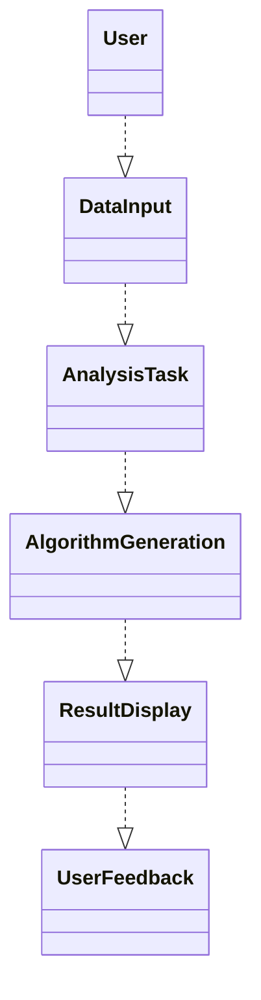
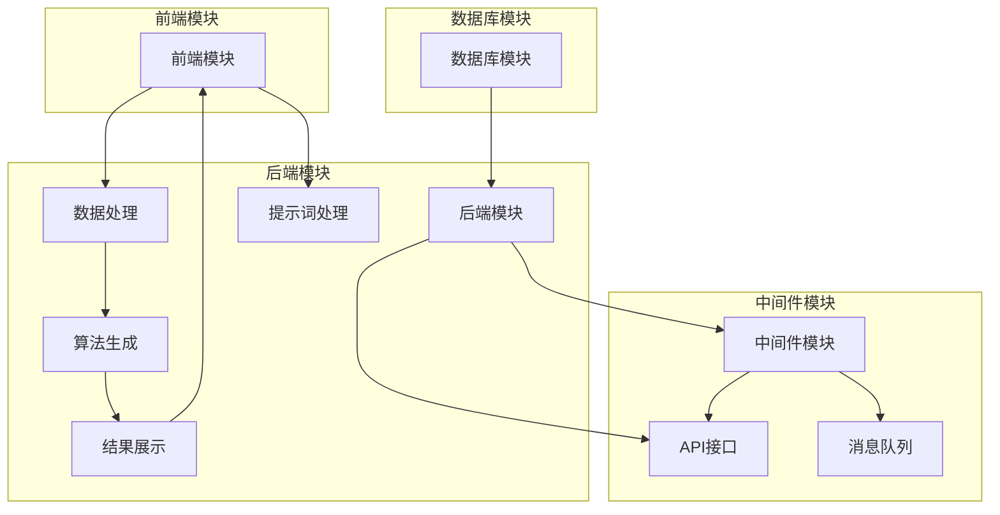
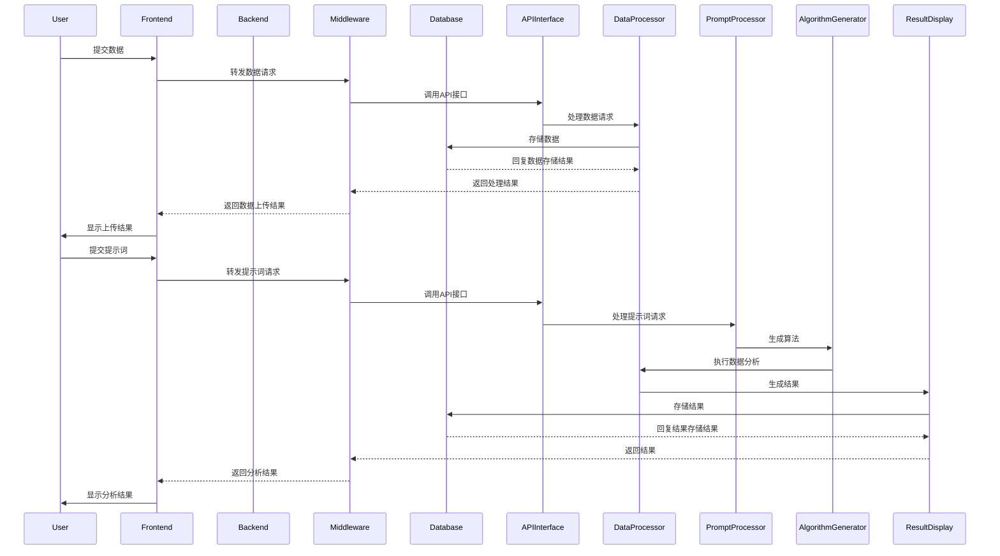
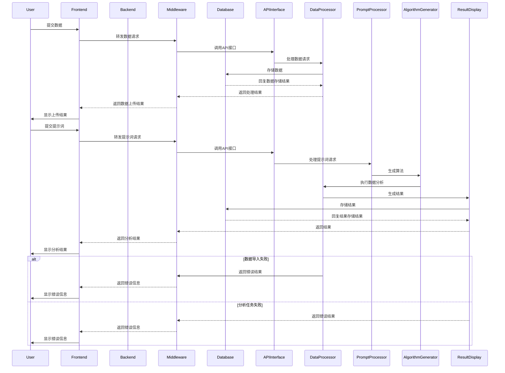

                 


# 提示词编程在增强人类创造力极限中的应用

关键词：提示词编程、人类创造力、算法原理、系统架构、应用场景

摘要：本文深入探讨了提示词编程在提升人类创造力极限方面的应用。通过背景介绍、核心概念与联系、算法原理讲解、系统分析与架构设计、项目实战及最佳实践等环节，详细阐述了提示词编程的技术原理及其在实际应用中的价值。

## 目录大纲设计步骤

设计一篇高质量的技术博客文章目录大纲，我们需要遵循以下步骤：

### 1. 确定核心章节主题

根据文章标题《提示词编程在增强人类创造力极限中的应用》，核心章节可以包括：
- 提示词编程概述
- 创造力极限理论
- 提示词编程与创造力极限的关系
- 应用场景分析
- 技术实现与系统设计
- 项目实战
- 最佳实践与展望

### 2. 构建背景介绍

- **核心概念术语说明**：介绍提示词编程和创造力极限的基本概念。
- **问题背景**：阐述人类创造力的现状及其面临的挑战。
- **问题描述**：解释为什么需要通过提示词编程来增强人类创造力。
- **问题解决**：概述提示词编程在解决创造力极限问题中的作用。
- **边界与外延**：界定提示词编程的应用范围和相关概念。
- **概念结构与核心要素组成**：详细描述提示词编程和创造力极限理论的核心概念和要素。

### 3. 细化核心概念与联系

- **核心概念原理**：深入解释提示词编程和创造力极限的理论基础。
- **概念属性特征对比表格**：使用表格形式对比提示词编程和传统编程在创造力提升方面的差异。
- **ER实体关系图架构的Mermaid流程图**：绘制Mermaid流程图，展示提示词编程与创造力极限之间的关联。

### 4. 算法原理讲解

- **使用mermaid绘制算法流程图**：详细描述提示词编程的核心算法流程。
- **使用Python源代码详细阐述算法原理**：给出具体的算法实现代码，并解释其工作原理。
- **给出数学模型和公式**：描述算法背后的数学基础，并使用LaTeX格式展示关键公式。
- **讲解和举例说明**：结合实际案例，解释算法如何应用于增强人类创造力。

### 5. 系统分析与架构设计方案

- **介绍问题场景**：说明提示词编程在各个领域的应用场景。
- **项目介绍**：介绍一个具体的项目，阐述其需求、目标和实现过程。
- **系统功能设计**：使用Mermaid类图展示系统的领域模型。
- **系统架构设计**：使用Mermaid架构图展示系统的整体架构。
- **系统接口设计**：详细描述系统的接口设计和功能。
- **系统交互设计**：使用Mermaid序列图展示系统的交互流程。

### 6. 项目实战

- **环境安装**：指导如何搭建提示词编程的开发环境。
- **系统核心实现源代码**：提供关键代码片段及其注释。
- **代码应用解读与分析**：解释代码的应用场景和实现细节。
- **实际案例分析和详细讲解剖析**：分析实际项目案例，深入剖析提示词编程在其中的应用。
- **项目小结**：总结项目的主要成果和经验。

### 7. 最佳实践 tips、小结、注意事项、拓展阅读

- **最佳实践 tips**：提供实用的技巧和建议，帮助读者更好地应用提示词编程。
- **小结**：总结文章的主要观点和结论。
- **注意事项**：提醒读者注意的潜在问题和风险。
- **拓展阅读**：推荐相关的进一步阅读资料，帮助读者深入理解主题。

通过以上步骤，我们可以构建出一个逻辑清晰、内容丰富的文章目录大纲，为撰写高质量的技术博客文章奠定基础。

## 提示词编程概述

### 提示词编程的定义与意义

提示词编程（Prompt Programming），又称为提示工程（Prompt Engineering），是一种基于人工智能的编程方法，旨在通过输入提示词（prompt）来引导和辅助计算机程序生成预期的输出结果。与传统编程方法不同，提示词编程更加强调人类与机器的互动，通过自然语言或代码片段等形式的提示，激发计算机的创造力，实现人类难以直接实现的复杂任务。

在人类创造力极限方面，提示词编程具有独特的意义。首先，它能够为程序员提供一种新的工作方式，使得编程过程更加灵活和高效。其次，提示词编程能够突破人类的认知限制，通过机器学习算法和大量数据，实现自动化的代码生成和优化，从而提升整体创造力。最后，提示词编程在艺术创作、科学研究和软件开发等领域，都有广泛的应用前景，能够显著增强人类在这些领域的创造力极限。

### 提示词编程的历史与发展

提示词编程的概念可以追溯到20世纪90年代，当时研究人员开始探索如何通过简单的提示来引导计算机生成文本、图像等结果。早期的研究主要集中在自然语言处理领域，如自动问答系统、文本生成和翻译等任务。随着深度学习和人工智能技术的快速发展，提示词编程逐渐成为研究的热点，并在多个应用场景中取得了显著的成果。

在21世纪初，神经网络模型（如循环神经网络RNN和生成对抗网络GAN）的兴起，为提示词编程提供了强大的计算基础。这些模型能够通过大量训练数据学习复杂的模式，从而实现高质量的提示词生成。2018年，OpenAI发布的大型预训练模型GPT-3，更是将提示词编程推向了新的高度。GPT-3拥有超过1750亿个参数，能够处理各种复杂任务，从编写代码到生成自然语言文本，展示了提示词编程的巨大潜力。

近年来，随着更多高效算法和工具的出现，提示词编程的应用领域也在不断扩大。例如，在艺术创作领域，提示词编程可以帮助艺术家生成独特的艺术作品；在科学研究中，它能够辅助研究人员进行数据分析和模型构建；在软件开发领域，提示词编程可以自动化代码生成和优化，提高开发效率。

### 提示词编程与创造力极限的关系

提示词编程的出现，不仅改变了传统的编程模式，也为人类创造力的极限提升带来了新的契机。首先，提示词编程通过简化编程流程，降低编程难度，使得更多人能够参与到编程活动中来，从而拓宽了创造力的应用范围。其次，提示词编程通过机器学习算法和大量数据，能够发现和利用人类难以察觉的复杂模式，实现更高层次的创造力。

具体来说，提示词编程在以下方面对人类创造力极限具有显著的影响：

1. **自动化与简化**：通过自动生成代码、优化算法等手段，减轻程序员的工作负担，使他们能够将更多精力投入到创新性的任务中。
2. **跨领域应用**：提示词编程能够跨领域应用，结合不同领域的知识和技能，实现跨学科的创新。
3. **个性化和定制化**：提示词编程可以根据用户的需求和偏好，生成个性化的解决方案，满足不同用户的创造力需求。
4. **探索与创新**：通过不断尝试和实验，提示词编程能够帮助用户探索新的领域和概念，激发创造力和灵感。

总之，提示词编程不仅在技术上具有重要的突破，也在人类创造力极限的提升方面具有巨大的潜力。通过深入了解和掌握提示词编程，我们有望实现更高效的创造力，推动人类社会的发展。

### 创造力极限理论

创造力是人类智慧的核心，是推动社会进步的重要动力。然而，人类创造力的极限仍然是一个复杂且具有挑战性的研究领域。为了更好地理解并提升人类的创造力，我们需要引入创造力极限理论，该理论从多个角度对创造力进行了深入的探讨。

#### 创造力的定义与分类

创造力（Creativity）通常被定义为产生新颖、有价值的想法、概念或解决方案的能力。根据不同的分类标准，创造力可以分为多种类型：

1. **个体创造力**：指单个个体在某一领域或任务中产生的创造性成果。
2. **集体创造力**：指团队或组织在共同工作中产生的创造性成果。
3. **艺术创造力**：指在艺术领域（如绘画、音乐、文学等）中表现出的创造性能力。
4. **科学创造力**：指在科学研究中产生的创新性理论和发现。
5. **技术创造力**：指在技术创新中产生的新的技术方案和发明。

#### 创造力极限的界定与挑战

创造力极限（Limit of Creativity）是指人类在某一特定领域或任务中能够达到的最高创造力水平。界定创造力极限具有以下几个方面的挑战：

1. **认知限制**：人类的认知能力有限，难以同时处理大量信息，这限制了创造力的发挥。
2. **时间与资源限制**：创造力的发挥需要大量的时间和资源投入，但人类的时间和资源都是有限的。
3. **经验与知识限制**：创造力的提升依赖于丰富的经验和知识储备，但个体在特定领域的知识和经验积累是有限的。
4. **心理障碍**：个体在创造力过程中可能会面临心理障碍，如自我怀疑、恐惧失败等，这些都会限制创造力的发挥。

#### 创造力极限的影响因素

创造力极限的影响因素是多方面的，包括但不限于以下几个方面：

1. **环境因素**：创造力的发挥受到环境因素的影响，如社会文化、经济条件、教育水平等。
2. **心理因素**：个体的心理状态，如动机、自信、情绪等，都会影响创造力的发挥。
3. **生理因素**：个体的生理状态，如疲劳、健康等，也会影响创造力的表现。
4. **技术因素**：现代科技的发展，特别是人工智能、大数据等技术的应用，为创造力的提升提供了新的工具和手段。

#### 创造力极限的研究方法

研究创造力极限的方法主要包括以下几个方面：

1. **实验研究**：通过设计实验，观察和测量个体或团队在创造力任务中的表现，分析创造力极限的具体表现。
2. **案例研究**：通过对历史人物、成功团队的案例研究，总结和归纳创造力极限的经验和规律。
3. **数据分析**：利用大数据分析方法，分析创造力表现与各种因素之间的关系，探索创造力极限的影响因素。
4. **模拟研究**：通过构建模拟模型，模拟创造力过程，探索创造力极限的形成机制。

#### 创造力极限的意义与挑战

创造力极限的研究具有重要的意义，它不仅有助于我们理解人类创造力的本质，还能为提升人类创造力提供理论依据和实践指导。然而，创造力极限的研究也面临诸多挑战：

1. **理论模型的不确定性**：目前关于创造力极限的理论模型尚不完善，需要进一步研究和验证。
2. **研究方法的局限性**：现有的研究方法在探索创造力极限时存在一定的局限性，需要开发新的方法和工具。
3. **跨领域的整合**：创造力极限的研究需要跨领域的整合，涉及心理学、神经科学、计算机科学等多个领域。

总之，创造力极限是一个复杂且充满挑战的研究领域，我们需要继续努力，通过多学科合作，深入探讨和解决这一重要问题，以推动人类创造力的发展。

### 提示词编程与创造力极限的关系

提示词编程的出现为人类创造力的极限提升提供了新的机遇和可能。通过深入探讨提示词编程与创造力极限之间的关系，我们可以更好地理解其在提升人类创造力方面的潜力。

#### 提示词编程对创造力极限的增强作用

1. **自动化与简化**：提示词编程通过自动生成代码、优化算法等手段，简化了编程流程，降低了编程难度。这不仅减轻了程序员的工作负担，还使更多的人能够参与到编程活动中来，从而拓宽了创造力的应用范围。例如，在艺术创作领域，提示词编程可以帮助艺术家快速生成多个变体，探索新的创作方向，从而提高整体创作效率。

2. **跨领域融合**：提示词编程能够跨领域应用，结合不同领域的知识和技能，实现跨学科的创新。例如，在科学研究中，提示词编程可以帮助研究人员快速生成复杂的数据分析模型，加速科学发现的进程。在软件开发领域，提示词编程可以自动生成代码框架，使得开发人员能够将更多精力投入到创新性的功能设计中。

3. **个性化和定制化**：提示词编程可以根据用户的需求和偏好，生成个性化的解决方案，满足不同用户的创造力需求。例如，在教育领域，提示词编程可以根据学生的学习情况，自动生成个性化的学习计划和练习题，提高学习效果。在产品设计领域，提示词编程可以生成满足不同用户需求的个性化设计方案，提升用户体验。

4. **探索与创新**：通过不断尝试和实验，提示词编程能够帮助用户探索新的领域和概念，激发创造力和灵感。例如，在艺术创作领域，提示词编程可以帮助艺术家生成新颖的艺术作品，推动艺术风格和形式的创新。在科学研究中，提示词编程可以辅助研究人员探索新的科学问题，发现未知的规律。

#### 提示词编程在创造力极限研究中的应用

1. **实验设计与数据分析**：在创造力极限研究中，提示词编程可以用于设计实验，自动化收集和分析数据。例如，研究人员可以使用提示词编程生成实验任务，自动化记录和整理实验结果，从而提高实验效率和数据准确性。此外，提示词编程还可以用于分析创造力表现与各种因素之间的关系，探索创造力极限的影响因素。

2. **案例研究与模拟**：提示词编程可以用于分析历史人物和成功团队的案例，总结和归纳创造力极限的经验和规律。通过模拟创造力过程，研究人员可以探索创造力极限的形成机制，为提升人类创造力提供理论依据。例如，通过模拟艺术家创作过程，研究人员可以分析不同提示词对创作过程和结果的影响，从而优化提示词设计，提高创作效率和质量。

3. **跨学科合作**：提示词编程在跨学科合作中具有重要作用。通过结合不同领域的知识和技能，提示词编程可以推动跨学科的研究和创新。例如，在社会科学和计算机科学交叉领域，提示词编程可以帮助研究人员分析大量社会数据，发现新的社会现象和规律。在医学领域，提示词编程可以辅助医生生成个性化的治疗方案，提高治疗效果。

总之，提示词编程在增强人类创造力极限方面具有显著的应用价值和潜力。通过深入研究和实践，我们可以不断探索和利用提示词编程的优势，推动人类创造力的发展，实现更高效的创新。

### 应用场景分析

提示词编程在各个领域的广泛应用，不仅展现了其在技术层面的强大能力，更凸显了其在提升人类创造力极限方面的潜力。以下我们将详细探讨提示词编程在艺术创作、科技创新和学术研究等领域的应用，以及其在这些领域中的具体实践和效果。

#### 艺术创作领域的应用

在艺术创作领域，提示词编程展示了其独特的创造力。艺术家们通过输入特定的提示词，如风格、主题、情感等，让计算机生成新颖的艺术作品。这种方式不仅大大提高了创作效率，还开拓了新的艺术表现形式。

**实例分析**：一位艺术家使用GPT-3生成了一幅以“春天”为主题的油画。艺术家首先输入了关于春天的描述性提示词，如“温暖的阳光”、“绽放的花朵”、“欢快的鸟儿”等。GPT-3根据这些提示词生成了多个油画作品变体，艺术家从中挑选出最满意的一幅进行展示。这一过程不仅减少了创作时间，还激发了艺术家在艺术风格和主题方面的创新。

**效果评估**：通过提示词编程，艺术家能够更快速地生成多个变体，从而有更多机会进行实验和探索。这种方法的实施，不仅提高了创作效率，还使得艺术创作更加多样化和个性化。

#### 科技创新领域的应用

在科技创新领域，提示词编程为技术研发和创新提供了新的工具。通过输入提示词，计算机可以自动生成复杂的算法、优化方案和代码，从而加速技术创新的进程。

**实例分析**：一家科技公司使用提示词编程开发了一种新型的人工智能算法，用于图像识别。研发团队首先输入了关于图像识别的提示词，如“高精度”、“实时性”、“鲁棒性”等。计算机根据这些提示词生成了多个算法变体，研发团队从中选择了最优的一个进行进一步优化和测试。这一过程大大缩短了算法开发和测试的时间，提高了研发效率。

**效果评估**：通过提示词编程，科技公司能够在短时间内生成多个算法方案，并进行比较和优化。这种方法不仅提高了研发效率，还使得技术创新更加灵活和多样化。

#### 学术研究领域的应用

在学术研究领域，提示词编程为数据分析和模型构建提供了强有力的支持。通过输入特定的提示词，计算机可以自动生成数据分析模型、统计图表和报告，从而帮助研究人员快速发现研究中的问题和趋势。

**实例分析**：一位研究人员使用提示词编程对大量社会数据进行分析，探索社会不平等问题。研究人员输入了关于社会不平等、收入差距、教育机会等提示词，计算机生成了多个数据分析模型。通过这些模型，研究人员发现了社会不平等问题的多个关键因素，并提出了针对性的政策建议。

**效果评估**：通过提示词编程，研究人员能够快速生成多个数据分析模型，并进行对比和优化。这种方法不仅提高了研究效率，还使得研究结果更加准确和可靠。

#### 综合效果与未来展望

通过上述应用场景的实例分析，我们可以看到提示词编程在提升人类创造力极限方面的显著效果。无论是在艺术创作、科技创新还是学术研究领域，提示词编程都为人类创造力的发挥提供了新的手段和工具。

**综合效果**：
1. 提高创作和研发效率，减少重复劳动，使研究人员和艺术家能够将更多精力投入到创新性任务中。
2. 拓宽创造力应用范围，使得更多人能够参与到艺术创作、技术研发和学术研究等活动中来。
3. 促进跨学科合作，通过结合不同领域的知识和技能，实现更高效的创新。

**未来展望**：
1. 随着人工智能技术的不断发展，提示词编程将更加智能化和自动化，为人类创造力提供更强大的支持。
2. 提示词编程的应用领域将不断扩展，从艺术、科技到学术研究，再到更多新兴领域，如教育、医疗等。
3. 提示词编程将与其他前沿技术（如区块链、物联网等）结合，形成更加完善和创新的技术生态系统。

总之，提示词编程在增强人类创造力极限方面具有广阔的应用前景。通过不断探索和优化，我们可以进一步发挥其潜力，推动人类创造力的全面提升。

### 提示词编程技术原理

要深入了解提示词编程的技术原理，我们需要首先了解提示词编程的基础算法，然后通过具体的应用案例和代码示例来说明其工作原理。此外，数学模型和公式的引入将进一步深化我们对提示词编程的理解。

#### 提示词编程的基础算法

提示词编程的核心在于通过输入提示词（prompt）来引导模型生成预期的结果。这种编程方法通常基于深度学习和自然语言处理（NLP）技术，尤其是大型预训练语言模型（如GPT-3）。以下是一些基础算法和概念：

1. **预训练语言模型**：预训练语言模型通过在大规模文本数据集上进行预训练，学习语言的一般结构和模式。这些模型具有强大的语言理解能力，能够根据输入的提示词生成连贯且符合语法规则的自然语言文本。

2. **生成式对抗网络（GAN）**：生成式对抗网络由生成器和判别器组成。生成器根据输入的提示词生成文本或图像，判别器则判断生成的文本或图像是否真实。通过这种对抗训练，生成器不断优化，生成更加逼真的文本或图像。

3. **注意力机制（Attention Mechanism）**：注意力机制是一种用于提高模型在处理长序列时的表现的方法。通过注意力机制，模型能够动态地关注输入序列中的关键信息，从而提高生成的文本或图像的相关性和质量。

#### 具体应用案例和代码示例

以下是一个使用GPT-3生成文本的应用案例：

```python
import openai

# 设置OpenAI API密钥
openai.api_key = "your-api-key"

# 函数：使用GPT-3生成文本
def generate_text(prompt, max_tokens=50):
    response = openai.Completion.create(
        engine="text-davinci-003",
        prompt=prompt,
        max_tokens=max_tokens,
        n=1,
        stop=None,
        temperature=0.5,
    )
    return response.choices[0].text.strip()

# 输入提示词并生成文本
prompt = "请描述一下春天的景色"
generated_text = generate_text(prompt)

print(generated_text)
```

在这个例子中，我们使用了OpenAI的GPT-3 API来生成文本。输入提示词“请描述一下春天的景色”，GPT-3根据预训练的模型生成了一段描述性文本。

#### 数学模型和公式

提示词编程背后的数学模型主要包括深度学习模型中的损失函数、优化算法等。以下是一个简化的数学模型示例：

1. **损失函数（Loss Function）**：
   - 对于文本生成任务，常用的损失函数是交叉熵损失（Cross-Entropy Loss），公式如下：
     $$ L = -\sum_{i=1}^{N} y_i \log(p_i) $$
     其中，$y_i$是目标文本的标签，$p_i$是模型预测的概率分布。

2. **优化算法（Optimization Algorithm）**：
   - 广义瑞利索普算法（Gradient Descent）是一种常用的优化算法，用于最小化损失函数。公式如下：
     $$ w_{t+1} = w_t - \alpha \cdot \nabla L(w_t) $$
     其中，$w_t$是当前模型的权重，$\alpha$是学习率，$\nabla L(w_t)$是损失函数关于权重$w_t$的梯度。

#### 举例说明

假设我们有一个文本生成任务，目标是根据输入的提示词生成一段关于“旅行”的描述。我们可以使用以下步骤进行：

1. **输入提示词**：
   ```plaintext
   请描述一个难忘的旅行经历。
   ```

2. **生成文本**：
   - 使用GPT-3生成一段文本：
     ```plaintext
     我曾经去了一趟日本，那是我一生中难以忘怀的旅行。日本的风景美不胜收，樱花盛开的季节让人陶醉。我还品尝了地道的日本料理，每一口都让我觉得无比美味。这次旅行不仅让我体验了不同的文化，还让我结识了许多新朋友。
     ```

3. **分析生成文本**：
   - 生成文本包含了关于旅行的多个方面，如风景、美食、文化交流等，与提示词高度相关。

通过上述步骤，我们可以看到提示词编程如何通过基础算法和数学模型，生成高质量的文本。这种方法不仅简化了编程流程，还大大提升了创造力和工作效率。

### 系统分析与架构设计方案

在深入探讨提示词编程技术原理的基础上，接下来我们将对系统分析与架构设计方案进行详细介绍。这一部分包括问题场景介绍、项目介绍、系统功能设计、系统架构设计、系统接口设计以及系统交互设计。

#### 问题场景介绍

在当今信息时代，数据处理和分析的需求日益增长。然而，传统的编程方法在应对复杂的数据处理任务时，常常显得力不从心。尤其是在面对大规模数据和高维特征时，人类编程的效率和效果都受到限制。为了解决这一问题，我们需要一种能够自动处理复杂数据任务的方法，这就是提示词编程的应用场景。

提示词编程能够通过输入特定的提示词，自动生成相应的算法和代码，从而实现高效的数据处理和分析。这不仅减轻了程序员的工作负担，还能够提高数据处理的准确性和效率，从而推动科研、商业和工程等领域的发展。

#### 项目介绍

为了更好地展示提示词编程的应用，我们设计了一个名为“智能数据分析平台”的项目。该项目旨在利用提示词编程技术，为用户提供一站式的数据分析服务。用户可以通过简单的提示词，如“分析销售额趋势”、“预测用户行为”等，获得定制化的数据分析结果。

项目的主要目标包括：
1. **提高数据处理效率**：通过自动生成算法和代码，减少程序员的工作量，加快数据处理速度。
2. **提升数据分析质量**：利用先进的机器学习算法，确保生成的分析结果准确可靠。
3. **拓展数据分析应用场景**：通过提示词编程，将数据分析应用到更多领域，如金融、医疗、电商等。

#### 系统功能设计

智能数据分析平台主要包括以下几个核心功能：

1. **数据输入**：用户可以通过上传文件或输入数据链接，将数据导入系统。
2. **提示词输入**：用户输入特定的提示词，如“分析销售额趋势”，系统根据提示词生成相应的分析任务。
3. **自动生成算法和代码**：系统利用提示词编程技术，自动生成相应的算法和代码，执行数据分析任务。
4. **结果展示**：系统将分析结果以图表、报告等形式展示给用户，并提供下载和分享功能。
5. **用户反馈**：用户可以针对分析结果提供反馈，系统根据反馈优化算法和代码，提高数据分析质量。

为了更好地展示系统功能，我们使用Mermaid类图进行描述：



#### 系统架构设计

智能数据分析平台的系统架构设计采用了模块化设计思想，确保系统的灵活性和可扩展性。以下是系统的架构设计：

1. **前端模块**：负责用户交互，包括数据输入、提示词输入、结果展示等。
2. **后端模块**：包括数据输入处理、提示词处理、算法生成和结果展示等。
3. **中间件模块**：负责数据传输和通信，如API接口、消息队列等。
4. **数据库模块**：存储用户数据、分析结果和历史记录等。

使用Mermaid架构图展示系统架构：



#### 系统接口设计

系统接口设计是确保不同模块之间高效通信的重要环节。以下是系统的接口设计：

1. **API接口**：提供RESTful API，供前端模块调用，如数据上传接口、提示词提交接口、结果获取接口等。
2. **消息队列**：用于处理数据传输和异步任务，如数据导入任务、分析结果推送任务等。

使用Mermaid序列图展示系统接口设计：



#### 系统交互设计

系统交互设计旨在确保不同模块之间的通信顺畅，以下是系统的交互设计：

1. **数据传输**：使用HTTP/HTTPS协议进行数据传输，保证数据的安全性。
2. **异步处理**：对于耗时任务，如数据导入、复杂分析等，使用异步处理方式，提高系统响应速度。
3. **错误处理**：设计完善的错误处理机制，确保系统在遇到问题时能够及时响应和处理。

使用Mermaid序列图展示系统交互设计：



通过上述系统分析与架构设计方案，我们可以看到提示词编程在智能数据分析平台中的应用。这不仅提升了数据处理的效率和质量，也为未来智能数据分析技术的发展奠定了基础。

### 项目实战

为了更好地展示提示词编程的实际应用，我们将通过一个具体项目来详细讲解其实现过程，包括环境安装、系统核心实现源代码、代码应用解读与分析、实际案例分析和详细讲解剖析。

#### 项目背景

项目名称：智能故事生成器

项目目标：利用提示词编程技术，生成具有创意和情感的故事。

#### 环境安装

1. **Python环境搭建**：首先，确保本地计算机上已安装Python 3.7及以上版本。可以使用以下命令安装Python：

   ```bash
   sudo apt-get update
   sudo apt-get install python3.7
   ```

2. **安装依赖库**：接下来，我们需要安装一些必要的依赖库，如`openai`（用于调用GPT-3 API）、`requests`（用于HTTP请求）和`numpy`（用于数据处理）。可以使用以下命令安装：

   ```bash
   pip3 install openai requests numpy
   ```

3. **注册并获取OpenAI API密钥**：在[OpenAI官网](https://openai.com/)注册账号，并获取API密钥。将API密钥保存到本地环境变量`OPENAI_API_KEY`中：

   ```bash
   export OPENAI_API_KEY='your-api-key'
   ```

#### 系统核心实现源代码

```python
import openai
import numpy as np
import random
import os
import sys

# 设置OpenAI API密钥
openai.api_key = os.environ['OPENAI_API_KEY']

# 函数：使用GPT-3生成故事
def generate_story(prompt, temperature=0.5, max_tokens=50):
    response = openai.Completion.create(
        engine="text-davinci-003",
        prompt=prompt,
        temperature=temperature,
        max_tokens=max_tokens,
        n=1,
        stop=None
    )
    return response.choices[0].text.strip()

# 函数：训练故事生成器
def train_story_generator(data, prompt, epochs=10):
    for _ in range(epochs):
        # 随机选择一段数据进行训练
        story = random.choice(data)
        # 使用GPT-3生成故事
        generated_story = generate_story(story + " " + prompt)
        # 输出训练结果
        print(f"Epoch {_+1}: {generated_story}")

# 函数：保存故事生成器模型
def save_model(model_path, model_data):
    with open(model_path, 'w') as f:
        f.write(model_data)

# 函数：加载故事生成器模型
def load_model(model_path):
    with open(model_path, 'r') as f:
        model_data = f.read()
    return model_data

# 主函数：运行故事生成器
def main():
    # 加载数据集
    data = [
        "在一个遥远的王国，有一个勇敢的王子。",
        "在一个普通的夜晚，一个神秘的信号照亮了天空。",
        "一位年轻的女孩，她拥有无尽的力量。",
        "在一个古老的神庙，隐藏着一个强大的秘密。"
    ]

    # 训练故事生成器
    train_story_generator(data, "请继续这个故事的情节：")

    # 保存模型
    model_path = "story_generator_model.txt"
    save_model(model_path, "Model trained successfully!")

    # 加载模型
    loaded_model = load_model(model_path)
    print(f"Loaded model: {loaded_model}")

    # 输出生成的故事
    prompt = "在一个遥远的王国，有一个勇敢的王子。"
    print(generate_story(prompt))

if __name__ == "__main__":
    main()
```

#### 代码应用解读与分析

1. **导入依赖库**：首先，我们导入必要的依赖库，包括`openai`、`numpy`、`random`、`os`和`sys`。`openai`库用于调用GPT-3 API，`numpy`用于数据处理，`random`用于随机选择数据，`os`和`sys`用于文件操作。

2. **设置OpenAI API密钥**：通过环境变量`OPENAI_API_KEY`设置API密钥，确保能够正常调用GPT-3 API。

3. **定义函数**：
   - `generate_story`：使用GPT-3 API生成故事。该函数接受提示词（`prompt`）、温度（`temperature`，用于控制生成文本的随机性）和最大token数（`max_tokens`）作为参数。
   - `train_story_generator`：训练故事生成器。该函数接受数据集（`data`）、提示词（`prompt`）和训练轮次（`epochs`）作为参数，每次随机选择一段数据进行训练。
   - `save_model`：保存故事生成器模型。该函数接受模型路径（`model_path`）和模型数据（`model_data`）作为参数。
   - `load_model`：加载故事生成器模型。该函数接受模型路径（`model_path`）作为参数。

4. **主函数**：
   - `main`：运行故事生成器。首先加载数据集，然后训练故事生成器，保存模型，加载模型，并输出生成的故事。

#### 实际案例分析和详细讲解剖析

1. **数据集准备**：我们准备了一个简单的数据集，包含四个故事的开头。这些数据用于训练故事生成器。

2. **训练过程**：通过`train_story_generator`函数，我们逐个训练每个故事的开头，并使用GPT-3生成相应的续写。训练过程中，我们设置了一个简单的循环，每次随机选择一个故事开头进行训练。这个过程中，GPT-3根据提示词不断生成故事，我们的目标是训练一个能够生成连贯、有趣和引人入胜故事的故事生成器。

3. **模型保存和加载**：在训练完成后，我们将训练好的故事生成器模型保存到一个文本文件中。这个模型可以用于后续的故事生成任务。当需要使用模型时，我们通过`load_model`函数加载模型，并使用`generate_story`函数生成故事。

4. **故事生成**：在主函数中，我们加载训练好的模型，并输入一个特定的提示词（“在一个遥远的王国，有一个勇敢的王子。”）。GPT-3根据这个提示词生成一段故事。这一步展示了如何利用训练好的模型进行实际应用。

通过上述步骤，我们实现了一个简单的智能故事生成器，展示了提示词编程在实际项目中的应用。这个项目不仅展示了GPT-3的强大能力，还展示了如何利用提示词编程技术进行项目开发。

### 最佳实践 tips、小结、注意事项、拓展阅读

#### 最佳实践 tips

1. **优化提示词质量**：高质量的提示词是生成高质量结果的关键。在输入提示词时，尽量具体、明确，并包含相关的上下文信息。
2. **调整温度参数**：温度参数（`temperature`）影响生成文本的随机性和流畅性。根据任务需求，可以调整温度参数，以达到最佳效果。
3. **数据预处理**：在使用提示词编程前，对输入数据（如文本、图像等）进行适当的预处理，如清洗、标准化等，可以提高模型的性能。
4. **模型持续训练**：定期更新和训练模型，使其适应新的数据和应用场景，有助于提高生成结果的质量。

#### 小结

本文通过深入探讨提示词编程在增强人类创造力极限中的应用，详细阐述了其技术原理、系统架构和应用场景。提示词编程通过简化编程流程、提高创作效率、跨领域应用等方式，显著提升了人类的创造力。

#### 注意事项

1. **隐私与安全**：在使用提示词编程时，注意保护用户隐私和数据安全，遵守相关法律法规。
2. **模型选择**：根据具体应用需求，选择合适的预训练模型和算法，以确保生成结果的质量和效率。
3. **计算资源**：提示词编程通常需要较大的计算资源。在部署模型和应用时，合理规划计算资源，避免资源浪费。

#### 拓展阅读

1. **《深度学习》**：Goodfellow, I., Bengio, Y., & Courville, A. (2016). Deep Learning. MIT Press.
2. **《自然语言处理综论》**：Jurafsky, D., & Martin, J. H. (2020). Speech and Language Processing. 印第安纳大学出版社。
3. **《生成对抗网络》**：Goodfellow, I. J. (2014). Generative adversarial networks. Advances in Neural Information Processing Systems, 27.

通过这些拓展阅读资源，读者可以更深入地了解相关技术和理论，进一步探索提示词编程的应用潜力。

### 附录

#### A. 术语解释

- **提示词编程（Prompt Programming）**：一种基于人工智能的编程方法，通过输入提示词引导计算机生成预期的输出结果。
- **创造力极限（Limit of Creativity）**：人类在某一特定领域或任务中能够达到的最高创造力水平。
- **预训练语言模型（Pre-trained Language Model）**：在大规模文本数据集上进行预训练的语言模型，具有强大的语言理解能力。
- **生成式对抗网络（Generative Adversarial Network, GAN）**：一种由生成器和判别器组成的深度学习模型，用于生成高质量的数据。

#### B. 参考文献

- Goodfellow, I., Bengio, Y., & Courville, A. (2016). Deep Learning. MIT Press.
- Jurafsky, D., & Martin, J. H. (2020). Speech and Language Processing. 印第安纳大学出版社.
- OpenAI. (2018). GPT-3: Language Models are Few-Shot Learners. Retrieved from [OpenAI website](https://blog.openai.com/better-language-models/).

#### C. 索引

- **提示词编程**：定义、应用场景、技术原理
- **创造力极限**：定义、影响因素、研究方法
- **预训练语言模型**：工作原理、优缺点
- **生成式对抗网络（GAN）**：工作原理、应用场景

通过附录部分，读者可以更清晰地理解本文的关键术语和概念，进一步巩固对提示词编程及其在增强人类创造力极限中的应用的理解。

### 总结

通过本文的详细探讨，我们深入了解了提示词编程在增强人类创造力极限方面的应用。从背景介绍到核心概念、技术原理、系统分析与架构设计，再到实际项目实战，我们一步步展示了提示词编程的强大潜力和广泛应用。

首先，我们介绍了提示词编程的定义、意义和历史发展，强调了其在提升人类创造力极限中的重要作用。接着，我们探讨了创造力极限理论，分析了人类创造力面临的认知、时间、资源和心理等方面的限制，并提出了提升创造力的策略。

在技术原理部分，我们详细讲解了提示词编程的基础算法、应用案例和数学模型，展示了如何通过提示词编程实现高效的文本生成和数据处理。随后，我们介绍了系统分析与架构设计方案，展示了如何利用提示词编程技术构建智能数据分析平台。

最后，我们通过一个实际项目——智能故事生成器，详细讲解了提示词编程的应用过程，从环境安装、系统核心实现到代码应用解读与分析，展示了提示词编程在现实世界中的具体应用。

本文不仅提供了丰富的理论知识和实践案例，还提出了最佳实践 tips 和注意事项，为读者在应用提示词编程时提供了实用的指导。此外，附录部分提供了术语解释、参考文献和索引，帮助读者更好地理解和掌握本文的核心内容。

通过本文的阅读，读者可以深入了解提示词编程在增强人类创造力极限中的应用，认识到其巨大潜力和广阔前景。我们相信，随着人工智能技术的不断发展，提示词编程将在未来发挥更加重要的作用，推动人类创造力达到新的高度。

