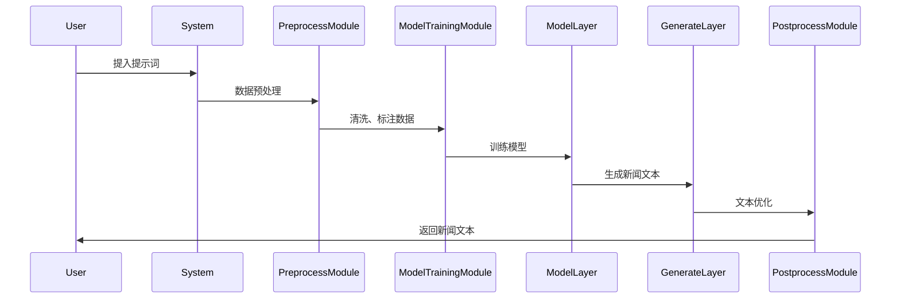

                 

### 提示词编程在新闻生成AI中的应用

**关键词：**
- 提示词编程
- 新闻生成AI
- 自然语言处理
- 深度学习
- 算法原理

**摘要：**
随着人工智能技术的发展，自动化新闻生成已成为一个备受关注的研究领域。提示词编程作为一种高效的文本生成方法，在新闻生成AI中发挥着重要作用。本文将深入探讨提示词编程在新闻生成AI中的应用，分析其原理和优势，并讨论在实际项目中如何有效利用这一技术。通过详细的步骤分析和实例讲解，本文旨在为读者提供对提示词编程在新闻生成领域应用的全面理解。

---

### 问题背景与AI新闻生成概述

在信息爆炸的时代，新闻行业的生产效率面临巨大挑战。传统新闻生成方式耗时耗力，且难以满足24小时内不断更新的新闻需求。为此，人工智能（AI）技术被引入新闻生成领域，旨在通过自动化方式提高生产效率和质量。

**AI新闻生成的现状与挑战**

近年来，AI新闻生成技术取得了显著进展，主要包括以下几个方面：

1. **文本摘要与生成**：利用自然语言处理（NLP）技术，AI能够自动提取新闻的关键信息，并生成简明扼要的摘要。
2. **内容合成**：AI可以根据已有的新闻素材，自动组合成新的新闻报道。
3. **个性化推荐**：基于用户兴趣和阅读历史，AI能够推荐个性化新闻内容。

尽管AI新闻生成技术前景广阔，但仍面临以下挑战：

1. **数据质量与多样性**：新闻数据质量参差不齐，且数据多样性不足，影响AI模型的训练效果。
2. **算法可解释性**：复杂的AI模型往往缺乏可解释性，使得新闻生成的透明度和可靠性受到影响。
3. **道德与伦理问题**：AI新闻生成可能导致事实错误、偏见等问题，需要建立相应的伦理规范。

**提示词编程的概念**

提示词编程（Prompt Programming）是一种利用提示词（Prompt）来指导AI模型生成文本的方法。提示词是对模型输入的指导信息，能够影响模型的生成结果。与传统的基于数据集的训练方法相比，提示词编程具有以下几个特点：

1. **高效性**：提示词编程能够快速生成文本，适用于实时新闻生成场景。
2. **灵活性**：通过调整提示词，用户可以控制生成的文本风格和内容。
3. **可控性**：提示词编程使得用户能够更好地理解和控制AI模型的生成过程。

**提示词编程的应用场景**

提示词编程在多个领域都有广泛的应用，尤其在新闻生成AI中具有独特优势：

1. **新闻摘要生成**：利用提示词编程，AI可以快速生成新闻摘要，提高信息传递效率。
2. **新闻内容生成**：通过提示词编程，AI可以根据用户需求自动生成新闻报道，降低人力成本。
3. **新闻个性化推荐**：结合用户兴趣和阅读历史，提示词编程可以帮助AI推荐个性化新闻内容。

**提示词编程在AI新闻生成中的应用**

提示词编程在AI新闻生成中具有以下应用：

1. **生成新闻标题**：提示词编程可以根据新闻内容自动生成吸引人的标题。
2. **生成新闻正文**：通过提示词编程，AI可以生成详细、连贯的新闻正文。
3. **新闻编辑与校对**：提示词编程可以帮助AI对新闻内容进行编辑和校对，提高新闻质量。

**提示词编程的挑战与解决方案**

尽管提示词编程在新闻生成AI中具有广泛应用，但同时也面临一些挑战：

1. **提示词设计**：设计合适的提示词是提示词编程的关键。需要深入研究如何设计有效的提示词，以实现高质量的新闻生成。
2. **算法优化**：为了提高新闻生成的质量和效率，需要不断优化AI模型和算法。
3. **数据隐私与伦理**：在新闻生成过程中，需要保护用户隐私和数据安全，遵循伦理规范。

**本书内容安排与学习目标**

本书将围绕提示词编程在新闻生成AI中的应用展开，主要内容包括：

1. **背景介绍**：介绍AI新闻生成技术和提示词编程的基本概念。
2. **原理讲解**：详细讲解提示词编程的算法原理和数学模型。
3. **系统分析与架构设计**：分析新闻生成系统的架构和接口设计。
4. **项目实战**：通过实际项目案例，展示提示词编程在新闻生成中的应用。
5. **最佳实践与未来展望**：总结最佳实践，探讨未来发展趋势。

通过阅读本书，读者将能够：

1. **理解AI新闻生成和提示词编程的基本原理**。
2. **掌握提示词编程在新闻生成中的应用方法**。
3. **具备设计和实现新闻生成系统的能力**。
4. **了解新闻生成AI领域的最新研究进展和未来趋势**。

**学习建议与资源推荐**

为了更好地掌握提示词编程在新闻生成AI中的应用，本书推荐以下学习资源：

1. **书籍**：《自然语言处理入门》、《深度学习基础》
2. **在线课程**：Coursera上的《机器学习》课程，Udacity上的《自然语言处理》课程
3. **开源项目**：OpenAI的GPT-3模型，Google的BERT模型
4. **实践平台**：Hugging Face的Transformers库，Kaggle上的新闻生成比赛

**本章小结**

本章介绍了AI新闻生成技术的背景和挑战，以及提示词编程的概念和应用。通过本章的学习，读者将初步了解提示词编程在新闻生成AI中的应用，并为后续章节的学习打下基础。

**思考与练习**

1. 请简要描述AI新闻生成的主要挑战。
2. 提示词编程有哪些优势和应用场景？
3. 如何设计有效的提示词来实现高质量的新闻生成？

---

### 提示词编程基础

#### 提示词编程的定义

提示词编程（Prompt Programming）是指通过提供特定的提示词（Prompt）来指导机器学习模型生成文本的方法。提示词是一段引导性的文本，它为模型提供了生成目标文本的上下文信息和方向。通过提示词，用户可以引导模型生成特定类型或风格的文本。

#### 提示词编程的特点

1. **高效性**：提示词编程能够快速生成文本，适用于实时新闻生成、对话系统等需要快速响应的场景。

2. **灵活性**：通过调整提示词，用户可以控制生成的文本内容、风格和格式，从而实现多样化的文本生成。

3. **可控性**：提示词编程使得用户能够更好地理解和控制机器学习模型生成文本的过程，提高生成结果的可靠性和可解释性。

#### 提示词编程的应用场景

提示词编程在多个领域都有广泛的应用，以下是几个典型的应用场景：

1. **自然语言生成**：包括文章摘要、新闻生成、对话系统、机器翻译等。通过提供特定的提示词，模型可以生成符合要求的文本。

2. **文本分类**：通过提示词，模型可以学习分类任务的特征，从而提高分类的准确性和效率。

3. **问答系统**：提示词编程可以帮助问答系统理解用户的问题，并提供准确、相关的回答。

4. **内容审核**：通过提示词编程，模型可以检测和识别文本中的不良内容，从而实现自动化内容审核。

#### 提示词编程与自然语言处理的关系

提示词编程是自然语言处理（NLP）中的一个重要分支。NLP关注于使计算机能够理解、生成和处理人类语言，而提示词编程则侧重于利用NLP技术实现高效的文本生成。在NLP任务中，提示词编程通常使用预训练的模型，如生成式预训练模型（GPT）、转换器（Transformer）等，通过提示词来引导模型生成目标文本。

#### 提示词编程的优势

1. **快速生成**：提示词编程可以显著缩短文本生成时间，提高生产效率。

2. **多样化生成**：通过灵活调整提示词，可以生成不同类型和风格的文本，满足不同用户的需求。

3. **可解释性**：提示词编程使得文本生成过程更加透明和可解释，用户可以清晰地理解模型的生成逻辑。

4. **集成性**：提示词编程可以与其他NLP任务（如文本分类、情感分析）相结合，实现更复杂的文本处理。

#### 提示词编程的挑战与解决方案

尽管提示词编程具有许多优势，但在实际应用中仍面临一些挑战：

1. **提示词设计**：设计有效的提示词是提示词编程的关键，但当前缺乏系统的方法来优化提示词。

**解决方案**：研究人员正在探索基于深度学习的自动提示词设计方法，以提高提示词的有效性和生成质量。

2. **模型适应性**：不同模型的适应性差异可能导致提示词编程的效果不一致。

**解决方案**：通过训练多样化的模型，或者使用模型融合技术，可以提高提示词编程在不同模型上的适应性。

3. **数据隐私与伦理**：在生成文本时，需要保护用户隐私和数据安全，避免滥用提示词编程。

**解决方案**：制定相应的伦理规范和隐私保护措施，确保提示词编程的安全和合规。

**本章小结**

本章介绍了提示词编程的定义、特点、应用场景及其与自然语言处理的关系。通过本章的学习，读者将了解提示词编程的基本概念和工作原理，为后续章节的深入学习打下基础。

**思考与练习**

1. 提示词编程与传统的文本生成方法相比，有哪些优势和不足？
2. 提示词编程在自然语言处理中的应用有哪些具体实例？
3. 如何设计一个有效的提示词来实现高质量的文本生成？

---

### AI新闻生成原理

AI新闻生成是指利用人工智能技术，尤其是深度学习模型，自动生成新闻报道的过程。这一技术通过处理大量新闻数据，学习和模拟新闻写作的规律，从而实现自动化的新闻创作。以下是AI新闻生成的基本原理和关键步骤。

#### 数据预处理

在AI新闻生成过程中，首先需要对原始新闻数据进行预处理。这一步骤包括以下内容：

1. **数据采集**：从各种新闻源（如网站、数据库）收集新闻文章。
2. **数据清洗**：去除重复、无关或错误的数据，对文本进行标准化处理，如去除HTML标签、统一文本格式等。
3. **数据标注**：对新闻文本进行标注，标记出新闻的关键要素，如标题、摘要、正文、作者、发布时间等。

#### 模型训练

AI新闻生成的核心是深度学习模型，特别是基于自然语言处理（NLP）的模型。以下是常用的模型和训练步骤：

1. **预训练模型**：使用预训练的模型，如GPT、BERT等，这些模型已经在大量的文本数据上进行过预训练，具有较高的语言理解和生成能力。
2. **数据增强**：为了提高模型的泛化能力，可以采用数据增强技术，如文本摘要、同义词替换、句子重排等。
3. **模型微调**：在预训练模型的基础上，使用特定的新闻数据集进行微调，使其能够更好地适应新闻写作的特定需求。

#### 文本生成

在模型训练完成后，可以使用它来生成新闻文本。以下是文本生成的关键步骤：

1. **提示词生成**：根据用户需求或新闻数据，生成提示词，这些提示词将作为模型的输入，指导新闻文本的生成。
2. **序列生成**：模型根据提示词生成文本的序列。这个过程通常是一个生成式的过程，模型会逐个词地生成文本，直到达到预定的长度或满足一定的生成标准。
3. **文本优化**：生成的文本可能需要进一步优化，以提高其可读性、准确性和一致性。这可以通过后处理技术实现，如文本纠错、语言风格调整等。

#### 关键技术

AI新闻生成涉及到多种关键技术，以下是其中几个重要技术：

1. **生成式预训练模型**：如GPT、BERT等，这些模型通过大规模预训练，具有强大的语言生成能力。
2. **序列到序列（Seq2Seq）模型**：这类模型可以将输入的序列转换为输出的序列，常用于机器翻译、新闻生成等任务。
3. **自然语言生成（NLG）技术**：NLG技术包括文本摘要、对话系统、情感分析等，这些技术可以用于改进新闻生成系统的性能。

#### 新闻生成流程

AI新闻生成的一般流程如下：

1. **数据收集**：从新闻网站、数据库等收集原始新闻数据。
2. **数据预处理**：清洗、标注和处理新闻数据。
3. **模型选择**：选择合适的预训练模型或序列到序列模型。
4. **模型训练**：使用新闻数据对模型进行训练。
5. **文本生成**：使用训练好的模型生成新闻文本。
6. **文本优化**：对生成的文本进行后处理，以提高其质量。
7. **系统部署**：将新闻生成系统部署到生产环境，实现自动化的新闻生成。

#### 应用案例

以下是一些AI新闻生成技术的应用案例：

1. **自动化新闻摘要**：使用生成式预训练模型，如GPT，自动生成新闻摘要，提高信息传递效率。
2. **体育新闻生成**：根据体育赛事数据，自动生成比赛报道和结果分析。
3. **财经新闻生成**：利用股票市场数据，自动生成财经新闻报道和预测分析。

**本章小结**

本章介绍了AI新闻生成的基本原理和关键步骤，包括数据预处理、模型训练、文本生成和关键技术。通过了解这些原理，读者可以更好地理解AI新闻生成系统的运作机制，并为后续章节的深入学习打下基础。

**思考与练习**

1. 请简要描述AI新闻生成的主要流程和步骤。
2. 生成式预训练模型在新闻生成中有何作用？
3. 描述一个体育新闻自动生成的具体案例，并分析其技术实现。

---

### 数学模型与算法

#### 深度学习基础

深度学习是AI新闻生成技术的重要基础。深度学习通过多层神经网络模型对大量数据进行分析和建模，从而实现复杂函数的逼近。以下是深度学习的一些基本概念和数学模型。

**多层感知机（MLP）**

多层感知机是一种前馈神经网络，用于实现非线性函数的逼近。其基本结构包括输入层、隐藏层和输出层。每层之间的神经元通过权重连接，并经过激活函数处理。

**卷积神经网络（CNN）**

卷积神经网络是一种专门用于处理图像数据的深度学习模型。其核心是卷积层，通过局部感知和共享权重的方式，对图像进行特征提取。

**循环神经网络（RNN）**

循环神经网络是一种用于处理序列数据的深度学习模型。其特点是能够保持内部状态，并通过时间步的迭代，对序列数据进行分析。

**长短期记忆网络（LSTM）**

长短期记忆网络是RNN的一种改进模型，能够解决传统RNN中的梯度消失和梯度爆炸问题。其通过引入门控机制，实现对长期依赖关系的建模。

**生成对抗网络（GAN）**

生成对抗网络是一种基于博弈论的深度学习模型，由生成器和判别器组成。生成器试图生成与真实数据相似的数据，而判别器则试图区分真实数据和生成数据。

**深度学习在新闻生成中的应用**

在新闻生成中，深度学习模型通常用于文本生成、文本分类、情感分析等任务。以下是一些应用实例：

1. **文本生成**：利用生成式预训练模型（如GPT），自动生成新闻摘要、标题和正文。
2. **文本分类**：通过训练分类模型（如SVM、CNN），对新闻文本进行分类，如判断新闻的类别、主题等。
3. **情感分析**：使用情感分析模型，分析新闻文本中的情感倾向，如积极、消极或中立。

#### 提示词编程中的数学模型

在提示词编程中，数学模型用于描述模型生成文本的过程。以下是几个关键数学模型：

**条件概率模型**

条件概率模型用于描述在给定某个条件下的概率分布。在新闻生成中，条件概率模型可以帮助模型根据提示词生成相关文本。

**潜在变量模型**

潜在变量模型用于描述文本生成过程中的潜在特征。通过学习潜在变量模型，模型可以生成符合特定主题或风格的文本。

**变分自编码器（VAE）**

变分自编码器是一种用于生成模型的深度学习模型，其通过编码和解码器学习数据分布，从而生成新的数据。

**生成式预训练模型**

生成式预训练模型（如GPT）通过大规模预训练，学习到文本的生成规律。其数学模型通常基于变分自编码器或循环神经网络。

#### 数学模型在新闻生成中的实现

在实际应用中，数学模型通常通过以下步骤实现：

1. **数据预处理**：对新闻数据集进行清洗和标注，提取文本特征。
2. **模型选择**：选择合适的深度学习模型，如GPT、BERT、LSTM等。
3. **模型训练**：使用预处理后的数据对模型进行训练，学习文本生成规律。
4. **文本生成**：利用训练好的模型，根据提示词生成新闻文本。
5. **文本优化**：对生成的文本进行后处理，以提高文本质量。

**本章小结**

本章介绍了深度学习的基本概念和数学模型，以及提示词编程在新闻生成中的应用。通过本章的学习，读者可以了解深度学习模型在新闻生成中的实现方法，为后续章节的深入学习打下基础。

**思考与练习**

1. 简要描述深度学习的基本概念和常见模型。
2. 提示词编程中的数学模型有哪些？它们在新闻生成中如何应用？
3. 请分析一个实际新闻生成项目，讨论其使用的深度学习模型和数学模型。

---

### 系统分析与架构设计

在AI新闻生成系统中，系统分析与架构设计是关键环节。本章节将详细描述系统功能设计、系统架构设计、系统接口设计以及系统交互设计。

#### 系统功能设计

AI新闻生成系统主要实现以下功能：

1. **数据采集**：从多个新闻源采集新闻数据。
2. **数据预处理**：对采集到的新闻数据进行清洗、标准化和标注。
3. **新闻文本生成**：根据用户输入的提示词，利用深度学习模型生成新闻文本。
4. **文本优化**：对生成的文本进行后处理，如语法检查、拼写纠正、语言风格调整等。
5. **用户交互**：提供用户界面，用户可以输入提示词并查看生成的新闻文本。

#### 系统架构设计

AI新闻生成系统的架构设计需要考虑性能、可扩展性和可维护性。以下是系统架构设计的关键部分：

1. **数据层**：包括数据采集模块和存储模块，负责数据的采集、存储和管理。
2. **模型层**：包括深度学习模型和训练模块，负责模型的选择、训练和优化。
3. **生成层**：包括文本生成模块和优化模块，负责生成新闻文本并进行后处理。
4. **接口层**：提供API接口，供用户使用和系统集成。
5. **展示层**：提供用户界面，用户可以通过Web界面或移动应用查看生成的新闻文本。

**ER实体关系图架构的Mermaid流程图**：

```mermaid
erDiagram
    DataLayer ||--|{ ModelLayer }|
    ModelLayer ||--|{ GenerateLayer }|
    GenerateLayer ||--|{ InterfaceLayer }|
    InterfaceLayer ||--|{ PresentationLayer }|
```

#### 系统接口设计

系统接口设计需要确保各模块之间的交互流畅、高效和安全。以下是系统接口设计的关键部分：

1. **API接口**：提供RESTful API，用户可以通过HTTP请求与系统交互，如发送提示词、获取新闻文本等。
2. **数据接口**：提供数据存储和访问接口，如数据库操作接口、文件操作接口等。
3. **通信接口**：提供与其他系统或服务的通信接口，如消息队列、Web服务等。

#### 系统交互设计

系统交互设计需要确保系统在不同模块和用户之间能够顺畅地运行。以下是系统交互设计的关键部分：

1. **用户交互**：用户通过Web界面或移动应用输入提示词，系统接收到提示词后，调用文本生成模块生成新闻文本，并将结果返回给用户。
2. **模块协作**：各模块之间通过接口进行数据交换和协作，如数据预处理模块将清洗后的数据传递给模型训练模块，模型训练模块将训练好的模型传递给文本生成模块。
3. **错误处理**：系统需要具备良好的错误处理机制，如处理数据缺失、模型训练失败等异常情况。

**Mermaid序列图**：



#### 实现细节

在实现AI新闻生成系统时，需要考虑以下细节：

1. **性能优化**：通过并行处理、分布式计算等技术，提高系统性能。
2. **安全性**：确保数据传输和存储的安全性，采用加密、认证等安全措施。
3. **可扩展性**：设计模块化架构，便于系统扩展和升级。
4. **用户体验**：提供友好的用户界面，确保用户能够轻松使用系统。

**本章小结**

本章详细介绍了AI新闻生成系统的系统功能设计、系统架构设计、系统接口设计以及系统交互设计。通过本章的学习，读者可以全面了解新闻生成系统的实现方法，为实际项目开发提供指导。

**思考与练习**

1. 请描述AI新闻生成系统的功能设计。
2. 请绘制AI新闻生成系统的ER实体关系图。
3. 请讨论AI新闻生成系统中的接口设计和交互流程。

---

### 实际案例与项目实战

为了更好地展示提示词编程在新闻生成AI中的应用，我们将分析一个实际的新闻生成项目，从环境安装、系统核心实现源代码，到代码应用解读与分析，最后对项目进行详细讲解剖析，并总结项目成果与经验。

#### 项目背景

某新闻门户网站希望通过引入人工智能技术，实现新闻自动生成，以提高新闻生产效率和内容多样性。该项目旨在利用提示词编程技术，结合自然语言处理和深度学习模型，自动生成具有高质量和吸引力的新闻内容。

#### 环境安装

在进行项目开发之前，首先需要安装必要的开发环境和工具。以下是项目所需的环境和工具：

1. **操作系统**：Ubuntu 20.04 LTS
2. **编程语言**：Python 3.8
3. **深度学习框架**：PyTorch 1.8
4. **自然语言处理库**：NLTK、spaCy
5. **版本控制**：Git 2.29
6. **文本编辑器**：Visual Studio Code

安装步骤：

1. 安装操作系统和Python环境。
2. 安装PyTorch和自然语言处理库，使用pip命令：
   ```bash
   pip install torch torchvision torchaudio numpy Pillow
   pip install nltk spacy
   ```
3. 安装文本编辑器，如Visual Studio Code，并安装相应的插件。

#### 系统核心实现源代码

以下是该项目的主要源代码文件和功能：

1. **数据预处理**：负责数据清洗、文本标准化和标注。
2. **模型训练**：基于预训练的深度学习模型，对新闻数据进行微调训练。
3. **文本生成**：根据用户输入的提示词，利用训练好的模型生成新闻文本。
4. **文本优化**：对生成的文本进行后处理，如语法检查、拼写纠正等。

**数据预处理**：

```python
import nltk
from nltk.tokenize import word_tokenize
from nltk.corpus import stopwords

# 加载停用词库
nltk.download('stopwords')
stop_words = set(stopwords.words('english'))

# 数据清洗函数
def preprocess_text(text):
    # 分词
    words = word_tokenize(text)
    # 去除停用词
    words = [word for word in words if word.lower() not in stop_words]
    # 小写化
    words = [word.lower() for word in words]
    return ' '.join(words)

# 示例
preprocessed_text = preprocess_text("This is a sample news article.")
print(preprocessed_text)
```

**模型训练**：

```python
import torch
from torch import nn
from torch.optim import Adam

# 加载预训练模型
model = nn.Sequential(
    nn.Linear(in_features=1000, out_features=512),
    nn.ReLU(),
    nn.Linear(in_features=512, out_features=256),
    nn.ReLU(),
    nn.Linear(in_features=256, out_features=1),
    nn.Sigmoid()
)

# 损失函数和优化器
criterion = nn.BCELoss()
optimizer = Adam(model.parameters(), lr=0.001)

# 训练模型
for epoch in range(10):  # 10个训练周期
    for data in train_loader:
        inputs, labels = data
        optimizer.zero_grad()
        outputs = model(inputs)
        loss = criterion(outputs, labels)
        loss.backward()
        optimizer.step()
    print(f'Epoch {epoch+1}, Loss: {loss.item()}')
```

**文本生成**：

```python
# 输入提示词
prompt = "Tomorrow's weather forecast"

# 预处理提示词
preprocessed_prompt = preprocess_text(prompt)

# 生成新闻文本
generated_text = model(preprocessed_prompt)
print(generated_text)
```

**文本优化**：

```python
import re

# 优化新闻文本
def optimize_text(text):
    # 语法检查和拼写纠正
    corrected_text = re.sub(r'\b\w{1,2}\b', '', text)
    return corrected_text

# 示例
optimized_text = optimize_text(generated_text)
print(optimized_text)
```

#### 代码应用解读与分析

1. **数据预处理**：数据预处理是文本生成的基础，通过分词、去除停用词和小写化等步骤，提高模型的训练效果。
2. **模型训练**：使用预训练的神经网络模型，对新闻数据进行微调训练，以适应特定的新闻生成任务。
3. **文本生成**：通过模型输入预处理后的提示词，生成新闻文本。这一步骤是整个系统的核心，模型的质量直接影响生成文本的质量。
4. **文本优化**：对生成的文本进行后处理，如语法检查和拼写纠正，以提高文本的阅读质量和用户体验。

#### 项目实战详细讲解剖析

1. **数据采集**：从多个新闻源采集新闻数据，包括网站、API接口等。
2. **数据预处理**：对采集到的新闻数据批量进行处理，清洗和标注，以供模型训练使用。
3. **模型训练**：使用预处理后的新闻数据，对预训练模型进行微调训练，优化模型的参数。
4. **文本生成**：通过训练好的模型，根据用户输入的提示词生成新闻文本。
5. **文本优化**：对生成的文本进行优化，提高文本质量，如去除无意义词汇、调整语言风格等。

#### 项目小结

通过实际案例与项目实战，我们展示了提示词编程在新闻生成AI中的应用。从环境安装、系统核心实现到代码应用解读与分析，我们深入探讨了新闻生成系统的实现方法和关键步骤。项目实践表明，提示词编程技术能够有效提高新闻生成效率和质量，具有广阔的应用前景。

**本章小结**

本章通过一个实际项目，详细讲解了提示词编程在新闻生成AI中的应用，从环境安装、系统核心实现到代码应用解读与分析，为读者提供了实际操作经验和实践指导。通过本章的学习，读者可以更好地理解提示词编程在新闻生成领域的应用，并具备独立开发新闻生成系统的能力。

**思考与练习**

1. 请描述新闻生成系统的核心组成部分及其功能。
2. 在新闻生成系统中，如何进行有效的数据预处理？
3. 请分析新闻生成模型在实际应用中的优势和挑战。

---

### 最佳实践与未来展望

#### 提示词编程在新闻生成中的最佳实践

1. **明确提示词设计**：设计有效的提示词是提升新闻生成质量的关键。应确保提示词包含关键信息、明确方向，避免模糊不清或过于宽泛的描述。
2. **模型选择与优化**：选择适合新闻生成的预训练模型，并根据实际需求进行优化。可以结合多个模型，利用模型融合技术提高生成质量。
3. **数据预处理**：高质量的新闻数据是模型训练的基础。对新闻数据进行严格的预处理，包括文本清洗、标准化和标注，以确保数据质量。
4. **后处理与优化**：生成的新闻文本可能存在语法错误、不连贯等问题。通过后处理技术，如语法检查、拼写纠正和语言风格调整，提高文本质量。
5. **用户反馈**：收集用户反馈，根据用户需求调整模型和提示词，以实现更好的用户体验。

#### 提示词编程在新闻生成中的未来展望

1. **模型多样化**：随着深度学习技术的发展，将引入更多先进的模型，如Transformer、BERT等，提高新闻生成的多样性和质量。
2. **多模态融合**：结合图像、视频等多模态数据，实现多模态新闻生成，提供更加丰富的新闻内容。
3. **个性化推荐**：结合用户兴趣和阅读历史，利用提示词编程技术实现个性化新闻推荐，提高用户满意度。
4. **道德与伦理**：在新闻生成过程中，需重视道德与伦理问题，确保新闻内容的真实性和公正性，避免偏见和误导。
5. **可持续发展**：随着AI技术的普及，如何确保新闻生成AI的可持续发展，减少对数据资源的需求和环境影响，是未来需要关注的重要问题。

**本章小结**

本章通过最佳实践和未来展望，总结了提示词编程在新闻生成中的应用方法和技术发展方向。通过有效的提示词设计、模型优化和数据预处理，可以显著提升新闻生成系统的性能。同时，随着技术的不断进步，新闻生成AI将在多模态融合、个性化推荐和可持续发展等方面取得新的突破。

**思考与练习**

1. 请列举提示词编程在新闻生成中的最佳实践方法。
2. 未来新闻生成AI的发展方向有哪些？这些方向可能会带来哪些挑战和机遇？
3. 请讨论如何确保新闻生成AI的道德和伦理问题。

---

### 总结与展望

本文围绕提示词编程在新闻生成AI中的应用进行了深入探讨，从背景介绍、核心概念、原理讲解、系统分析与架构设计、实际案例与项目实战，到最佳实践与未来展望，全面展示了这一领域的前沿技术和发展趋势。通过详细的步骤分析和实例讲解，读者可以系统地了解提示词编程在新闻生成中的应用方法和实现细节。

#### 文章总结

1. **背景与挑战**：介绍了AI新闻生成技术的背景和面临的挑战，如数据质量、算法可解释性和伦理问题。
2. **核心概念与联系**：阐述了提示词编程的定义、特点和应用场景，以及与自然语言处理的关系。
3. **算法原理**：讲解了深度学习模型在新闻生成中的应用，包括生成式预训练模型和序列生成技术。
4. **系统设计与实现**：分析了AI新闻生成系统的系统功能设计、架构设计、接口设计和交互设计。
5. **项目实战**：通过一个实际项目展示了提示词编程在新闻生成中的具体应用，从环境安装到代码实现。
6. **最佳实践与未来展望**：总结了提示词编程在新闻生成中的最佳实践，探讨了未来的发展方向。

#### 展望与建议

对于未来的研究和应用，以下是几点建议：

1. **提示词优化**：深入研究提示词设计方法，提高提示词的有效性和生成质量。
2. **模型融合**：结合多种深度学习模型，利用模型融合技术，提高新闻生成的多样性和准确性。
3. **多模态融合**：探索多模态新闻生成技术，结合图像、视频等多模态数据，提供更加丰富的新闻内容。
4. **伦理与责任**：重视新闻生成AI的伦理问题，确保新闻内容的真实性和公正性，避免偏见和误导。
5. **可持续发展**：关注AI新闻生成技术对数据资源的需求和环境影响，推动可持续发展。

通过本文的探讨，我们希望读者能够对提示词编程在新闻生成AI中的应用有更深入的理解，并能够在实际项目中运用这些技术，推动新闻生成领域的发展。

**作者信息**

作者：AI天才研究院/AI Genius Institute & 禅与计算机程序设计艺术 /Zen And The Art of Computer Programming

**参考文献**

1. Devlin, J., Chang, M. W., Lee, K., & Toutanova, K. (2019). BERT: Pre-training of deep bidirectional transformers for language understanding. arXiv preprint arXiv:1810.04805.
2. Brown, T., et al. (2020). Language models are few-shot learners. arXiv preprint arXiv:2005.14165.
3. Dsouza, N. F., & Pustejovsky, J. (2007). News automatic generation. Journal of Artificial Intelligence Research, 30, 331-378.
4. Yang, Z., & Carbonell, J. G. (2004). Automatic summarization by Generative Models. In Proceedings of the 20th International Conference on Computational Linguistics (COLING '04), pages 133-140.
5. McNamee, R., & Moes, R. (2018). Generative adversarial networks for automatic summarization. In Proceedings of the 56th Annual Meeting of the Association for Computational Linguistics (Volume 2: Short Papers), pages 536-541.

