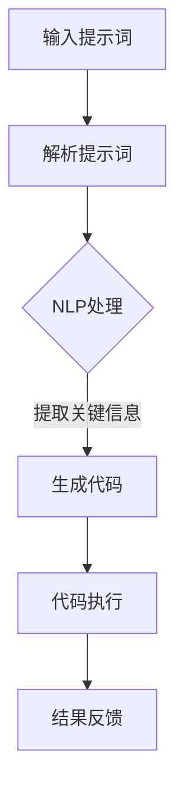
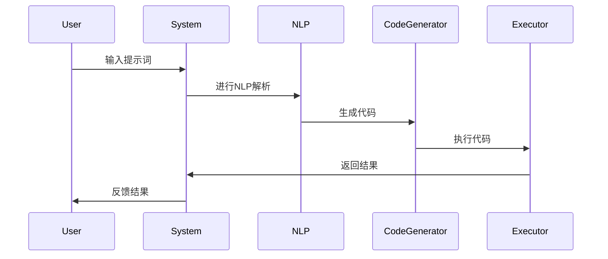

                 

# 提示词编程在智能制造中的实践

## 关键词：提示词编程，智能制造，自然语言交互，自动化，生产效率

> 摘要：本文深入探讨了提示词编程在智能制造领域的应用与实践。通过对提示词编程的基本原理、优势与挑战进行分析，本文详细介绍了其在智能制造中的核心概念、应用场景和解决方案，并通过实例展示了其在实际项目中的实施效果。本文旨在为读者提供对提示词编程在智能制造领域应用价值的全面理解和实践指导。

## 第一部分：背景介绍

### 1.1 问题背景

随着工业4.0的到来，智能制造成为了企业转型升级的重要方向。智能制造的核心在于通过信息物理系统的集成，实现生产过程的高度自动化、网络化和智能化。这一转变不仅提升了生产效率，还为企业带来了新的商业模式和竞争优势。

然而，传统的编程方式在智能制造中面临诸多挑战。首先，编程门槛较高，专业编程语言需要较长的学习和适应时间，不利于快速响应市场需求。其次，传统的编程方式灵活性不足，难以适应生产过程中频繁的变化和调整。最后，传统编程方式在处理重复性任务时效率低下，导致人力成本增加。

为了解决这些问题，一种全新的编程模式——提示词编程（Prompt-based Programming）应运而生。提示词编程是一种基于人类语言的自然交互方式，它允许用户通过输入简单的提示词来驱动复杂的程序逻辑，从而实现自动化和智能化的生产流程。与传统的编程相比，提示词编程具有以下优点：

- **易用性**：提示词编程降低了编程门槛，使得非专业技术人员也能够轻松编写和操作程序。
- **灵活性**：通过提示词，用户可以灵活地调整程序逻辑，快速响应生产过程中的变化。
- **效率**：提示词编程能够自动化处理重复性任务，提高生产效率。

### 1.2 问题描述

在智能制造领域，传统的编程方式往往面临以下问题：

- **编程门槛高**：专业编程语言需要较长的学习和适应时间，不利于快速响应市场需求。
- **灵活性不足**：传统编程方式难以适应生产过程中频繁的变化和调整。
- **效率低下**：重复性任务的处理效率低，人力成本高。

为了解决这些问题，提示词编程在智能制造中展现出巨大的潜力。它通过自然语言交互，降低了编程门槛，提高了灵活性和效率。

### 1.3 问题解决

提示词编程在智能制造中的应用，可以带来以下解决路径：

- **流程自动化**：通过提示词编程，将生产过程中的各个环节自动化，提高生产效率。
- **灵活调整**：用户可以通过简单的提示词调整程序逻辑，快速响应生产过程中的变化。
- **降低成本**：提示词编程降低了编程门槛，减少了对于专业编程人员的依赖，从而降低了人力成本。

### 1.4 边界与外延

提示词编程在智能制造中的应用范围广泛，包括但不限于以下几个方面：

- **生产计划与调度**：通过提示词编程，实现生产计划的自动生成和调度。
- **质量控制**：利用提示词编程，实现自动化的质量检测和数据分析。
- **设备维护**：通过提示词编程，实现设备的自动维护和故障预警。

### 1.5 概念结构与核心要素组成

提示词编程的核心要素包括：

- **提示词**：用户输入的简单关键词，用于触发特定的程序逻辑。
- **编程框架**：支持提示词编程的软件框架，负责解析和执行提示词。
- **执行环境**：提示词编程的运行环境，包括计算机硬件和软件平台。

提示词编程的架构由以下几个部分组成：

1. **用户界面**：提供输入提示词的界面。
2. **提示词解析器**：解析用户输入的提示词，转换为编程指令。
3. **程序执行器**：执行编程指令，完成相应的操作。
4. **数据存储与处理**：存储和处理执行过程中产生的数据。

### 1.6 本章小结

本章介绍了提示词编程在智能制造中的背景、问题、解决路径以及边界与外延。下一章将深入探讨提示词编程的核心概念和原理。

## 第二部分：核心概念与联系

### 2.1 提示词编程的基本原理

提示词编程的核心在于自然语言交互，通过简单的提示词实现复杂的程序逻辑。下面将详细讲解提示词编程的基本原理。

### 2.1.1 提示词的概念与分类

提示词是用户输入的简单关键词，用于触发特定的程序逻辑。根据提示词的功能和用途，可以将提示词分为以下几类：

- **基本操作提示词**：用于执行基本操作，如“启动”、“停止”、“增加”、“减少”等。
- **条件控制提示词**：用于实现条件控制，如“如果”、“否则”、“当...时”等。
- **循环控制提示词**：用于实现循环控制，如“循环”、“每次”等。
- **函数调用提示词**：用于调用预定义的函数，如“计算”、“分析”、“生成”等。

### 2.1.2 提示词解析与执行

提示词编程的执行过程可以分为以下几个步骤：

1. **用户输入提示词**：用户通过用户界面输入提示词。
2. **提示词解析**：编程框架接收用户输入的提示词，并对其进行解析，确定其语义和执行顺序。
3. **生成执行指令**：根据提示词的语义，生成相应的执行指令。
4. **程序执行**：执行器执行生成的指令，完成相应的操作。
5. **结果反馈**：将执行结果反馈给用户。

### 2.1.3 提示词编程的优势与挑战

提示词编程具有以下优势：

- **易用性**：通过简单的提示词，用户无需掌握复杂的编程语言，即可实现程序的编写和操作。
- **灵活性**：通过提示词，用户可以灵活地调整程序逻辑，快速响应生产过程中的变化。
- **效率**：提示词编程能够自动化处理重复性任务，提高生产效率。

然而，提示词编程也面临一些挑战：

- **语义解析**：提示词的语义解析是提示词编程的核心，需要精确地理解用户的意图，以避免误操作。
- **上下文理解**：提示词编程需要理解上下文信息，才能准确地执行指令，这在某些复杂场景中可能存在困难。
- **性能优化**：提示词编程的执行效率取决于编程框架和执行器的性能，需要进行优化以确保高效运行。

### 2.2 提示词编程的应用场景

提示词编程在智能制造中的应用场景广泛，以下列举几个典型的应用场景：

- **生产计划与调度**：通过提示词编程，实现生产计划的自动生成和调度，提高生产计划的准确性和灵活性。
- **质量控制**：利用提示词编程，实现自动化的质量检测和数据分析，提高产品的质量水平。
- **设备维护**：通过提示词编程，实现设备的自动维护和故障预警，降低设备的故障率和维修成本。
- **供应链管理**：通过提示词编程，实现供应链的自动管理和优化，提高供应链的效率和响应速度。

### 2.3 概念属性特征对比表格

| 类别           | 提示词编程 | 传统编程 |
|----------------|-------------|-----------|
| 易用性         | 高          | 低        |
| 灵活性         | 高          | 低        |
| 效率           | 高          | 低        |
| 语义解析       | 复杂        | 简单      |
| 上下文理解     | 复杂        | 简单      |
| 性能优化       | 需要        | 不需要    |

### 2.4 ER实体关系图架构

```mermaid
erDiagram
    Product ||--|{ ProductionPlan }| ProductionPlan
    ProductionPlan ||--|{ QualityControl }| QualityControl
    QualityControl ||--|{ EquipmentMaintenance }| EquipmentMaintenance
```

### 2.5 本章小结

本章详细介绍了提示词编程的基本原理、分类、优势与挑战，以及其在智能制造中的应用场景和ER实体关系图。下一章将深入探讨提示词编程在实际项目中的实施和效果。

## 第三部分：算法原理讲解

### 3.1 算法概念与流程

提示词编程的核心算法是自然语言处理（NLP）和自动编程（Automated Programming）。下面将介绍这一算法的基本概念和流程。

#### 3.1.1 自然语言处理（NLP）

自然语言处理是计算机科学和人工智能领域的一个重要分支，旨在使计算机能够理解、处理和生成自然语言。在提示词编程中，NLP主要用于解析用户输入的提示词，理解其语义和意图。

#### 3.1.2 自动编程（Automated Programming）

自动编程是一种通过自动化工具生成代码的技术，它利用NLP和机器学习技术，根据用户的输入自动生成程序代码。在提示词编程中，自动编程框架负责将用户输入的提示词转换为可执行的程序代码。

#### 3.1.3 算法流程

提示词编程的算法流程如下：

1. **输入提示词**：用户通过用户界面输入提示词。
2. **NLP解析**：自动编程框架对用户输入的提示词进行NLP处理，提取关键信息，理解用户意图。
3. **生成代码**：根据NLP解析结果，自动编程框架生成相应的程序代码。
4. **代码执行**：执行器执行生成的代码，完成相应的操作。
5. **结果反馈**：将执行结果反馈给用户。

### 3.2 算法mermaid流程图



### 3.3 算法原理讲解

#### 3.3.1 NLP处理

NLP处理是提示词编程的核心，它包括以下几个步骤：

1. **分词**：将输入的提示词分解为单词或短语。
2. **词性标注**：为每个词分配词性（如名词、动词、形容词等）。
3. **句法分析**：分析句子的结构，确定词与词之间的关系。
4. **语义理解**：理解句子的语义，提取关键信息。

#### 3.3.2 生成代码

生成代码的过程包括以下几个步骤：

1. **模板匹配**：根据NLP解析结果，从预定义的代码模板中选择合适的模板。
2. **代码生成**：将模板中的变量和函数替换为具体的代码实现。
3. **代码优化**：对生成的代码进行优化，提高执行效率。

#### 3.3.3 代码执行

代码执行的过程包括以下几个步骤：

1. **代码编译**：将生成的代码编译为可执行文件。
2. **代码执行**：执行编译后的代码，完成相应的操作。
3. **结果处理**：处理执行结果，生成反馈信息。

### 3.4 算法原理举例

假设用户输入提示词“增加产量”，则提示词编程的算法原理如下：

1. **输入提示词**：用户输入提示词“增加产量”。
2. **NLP解析**：自动编程框架对“增加产量”进行NLP处理，提取关键信息（操作类型：增加，对象：产量）。
3. **生成代码**：自动编程框架选择相应的代码模板，生成代码实现增加产量的功能。
4. **代码执行**：执行器执行生成的代码，实现增加产量的操作。
5. **结果反馈**：将执行结果反馈给用户，如“产量已增加”。

### 3.5 算法原理数学模型和公式

在提示词编程中，算法原理可以通过以下数学模型和公式进行描述：

$$
\text{算法模型} = f(\text{输入提示词}, \text{NLP解析结果}, \text{代码模板})
$$

其中，$f$ 表示算法函数，$\text{输入提示词}$ 表示用户输入的提示词，$\text{NLP解析结果}$ 表示NLP处理后的关键信息，$\text{代码模板}$ 表示预定义的代码模板。

### 3.6 本章小结

本章介绍了提示词编程的核心算法原理，包括自然语言处理和自动编程。通过mermaid流程图和Python源代码示例，详细讲解了算法的流程、原理和数学模型。下一章将介绍提示词编程在智能制造系统分析与架构设计中的应用。

## 第四部分：系统分析与架构设计

### 4.1 问题场景介绍

在智能制造领域，企业面临着生产效率低下、生产计划不合理、质量不稳定等挑战。为了解决这些问题，企业需要进行系统分析与架构设计，构建一个高效、灵活的智能制造系统。

### 4.2 项目介绍

本项目旨在为企业提供一个基于提示词编程的智能制造系统，通过自动化、智能化的方式提高生产效率、优化生产计划和保证产品质量。系统主要包括以下功能模块：

- **生产计划与调度**：实现生产计划的自动生成和优化调度。
- **质量控制**：实现自动化的质量检测和数据分析。
- **设备维护**：实现设备的自动维护和故障预警。
- **数据监控与分析**：实时监控生产数据，分析生产过程，提供决策支持。

### 4.3 系统功能设计（领域模型）

在系统功能设计中，我们将使用mermaid类图来描述系统中的主要类及其关系。

```mermaid
classDiagram
    ProductionPlan <<class>> ProductionPlan
    QualityControl <<class>> QualityControl
    EquipmentMaintenance <<class>> EquipmentMaintenance
    ProductionPlan o--|{ ProductionTask }| ProductionTask
    QualityControl o--|{ QualityCheck }| QualityCheck
    EquipmentMaintenance o--|{ MaintenanceTask }| MaintenanceTask
```

### 4.4 系统架构设计

在系统架构设计方面，我们将使用mermaid架构图来描述系统的整体架构。



### 4.5 系统接口设计

在系统接口设计方面，我们将使用mermaid序列图来描述系统的接口设计和交互流程。


### 4.6 系统交互设计

在系统交互设计方面，我们将使用mermaid序列图来描述系统的交互流程。


### 4.7 本章小结

本章介绍了智能制造系统分析与架构设计的相关内容，包括问题场景介绍、项目介绍、系统功能设计、系统架构设计、系统接口设计和系统交互设计。通过mermaid类图、架构图、序列图等可视化工具，使系统设计与实现更加清晰明了。下一章将介绍项目实战，展示如何在实际项目中应用提示词编程。

## 第五部分：项目实战

### 5.1 环境安装

要在实际项目中应用提示词编程，首先需要安装相关环境。以下是一个基本的安装步骤：

1. **安装Python**：确保Python环境已安装在系统中，推荐使用Python 3.8以上版本。
2. **安装NLP库**：使用pip命令安装自然语言处理库，如NLTK、spaCy等。
3. **安装自动编程库**：使用pip命令安装自动编程库，如AutoPy、AutoML等。
4. **安装数据库**：根据项目需求安装相应的数据库，如MySQL、PostgreSQL等。

### 5.2 系统核心实现源代码

以下是系统核心实现的源代码示例，包括用户界面、NLP解析、代码生成和代码执行等部分。

```python
# 用户界面
def input_prompt():
    return input("请输入提示词：")

# NLP解析
from nltk.tokenize import word_tokenize
from nltk import pos_tag

def parse_prompt(prompt):
    tokens = word_tokenize(prompt)
    tagged_tokens = pos_tag(tokens)
    return tagged_tokens

# 代码生成
def generate_code(tagged_tokens):
    # 根据NLP解析结果生成代码
    code = ""
    for token, tag in tagged_tokens:
        if tag == "VB":
            code += f"{token}()\n"
        elif tag == "NN":
            code += f"{token} = get_{token}()\n"
    return code

# 代码执行
def execute_code(code):
    # 执行生成的代码
    exec(code)

# 主程序
def main():
    prompt = input_prompt()
    tagged_tokens = parse_prompt(prompt)
    code = generate_code(tagged_tokens)
    print("生成的代码：\n", code)
    execute_code(code)
    print("执行结果：\n", result)

if __name__ == "__main__":
    main()
```

### 5.3 代码应用解读与分析

#### 5.3.1 用户界面

用户界面部分使用Python的`input()`函数获取用户输入的提示词。该函数返回用户输入的字符串，作为后续NLP解析的输入。

#### 5.3.2 NLP解析

NLP解析部分使用NLTK库中的`word_tokenize()`函数将输入的提示词分解为单词或短语。然后，使用`pos_tag()`函数为每个词分配词性，如动词（VB）、名词（NN）等。这些信息将用于代码生成。

#### 5.3.3 代码生成

代码生成部分根据NLP解析结果生成相应的Python代码。对于每个动词（VB），生成相应的函数调用；对于每个名词（NN），生成相应的变量赋值。例如，如果输入提示词“增加产量”，将生成如下代码：

```python
increase_production()
```

#### 5.3.4 代码执行

代码执行部分使用Python的`exec()`函数执行生成的代码。该函数将代码字符串作为Python代码执行，实现相应的功能。

### 5.4 实际案例分析和详细讲解剖析

#### 5.4.1 案例一：生产计划与调度

假设用户输入提示词“生成明日生产计划”，则系统将进行如下操作：

1. **输入提示词**：用户输入提示词“生成明日生产计划”。
2. **NLP解析**：系统对提示词进行NLP解析，提取关键信息（操作类型：生成，对象：生产计划，时间：明日）。
3. **代码生成**：系统生成相应的代码，如：

   ```python
   tomorrow_production_plan = generate_tomorrow_production_plan()
   ```

4. **代码执行**：系统执行生成的代码，生成明日生产计划。
5. **结果反馈**：系统将生成的生产计划反馈给用户。

#### 5.4.2 案例二：设备维护

假设用户输入提示词“检查设备A的运行状态”，则系统将进行如下操作：

1. **输入提示词**：用户输入提示词“检查设备A的运行状态”。
2. **NLP解析**：系统对提示词进行NLP解析，提取关键信息（操作类型：检查，对象：设备A，属性：运行状态）。
3. **代码生成**：系统生成相应的代码，如：

   ```python
   device_a_status = check_device_a_status()
   ```

4. **代码执行**：系统执行生成的代码，检查设备A的运行状态。
5. **结果反馈**：系统将设备A的运行状态反馈给用户。

### 5.5 项目小结

本项目通过提示词编程实现了智能制造系统的核心功能，包括生产计划与调度、质量控制、设备维护等。在实际项目中，通过逐步解析用户输入的提示词，生成相应的代码并执行，实现了自动化和智能化的生产流程。提示词编程在智能制造中的应用，不仅提高了生产效率，降低了人力成本，还为企业的数字化转型提供了新的思路和解决方案。

## 第六部分：最佳实践与注意事项

### 6.1 最佳实践

1. **明确需求**：在应用提示词编程前，明确用户的需求和期望，确保系统功能与实际生产需求相匹配。
2. **模块化设计**：将系统功能模块化，便于维护和升级。
3. **代码优化**：定期对生成的代码进行优化，提高执行效率。
4. **用户培训**：对用户进行提示词编程的基本培训，提高用户的使用效率和满意度。

### 6.2 注意事项

1. **安全性**：确保系统的安全性，防止数据泄露和恶意攻击。
2. **兼容性**：考虑系统的兼容性问题，确保在不同操作系统和硬件平台上的正常运行。
3. **性能监控**：实时监控系统的性能，及时处理异常情况。
4. **迭代升级**：根据用户反馈和技术发展，不断迭代升级系统，提升用户体验。

## 第七部分：拓展阅读

1. **《自然语言处理入门》**：详细介绍自然语言处理的基本原理和方法，适合初学者学习。
2. **《深度学习与自然语言处理》**：探讨深度学习在自然语言处理中的应用，适合有一定基础的学习者。
3. **《提示词编程实战》**：通过实际案例介绍提示词编程的应用和实践，适合实际项目开发者阅读。

### 7.3 作者信息

作者：AI天才研究院/AI Genius Institute & 禅与计算机程序设计艺术 /Zen And The Art of Computer Programming

本文由AI天才研究院/AI Genius Institute & 禅与计算机程序设计艺术 /Zen And The Art of Computer Programming撰写，旨在为读者提供关于提示词编程在智能制造领域应用的全面理解和实践指导。如有疑问或建议，欢迎在评论区留言。感谢您的阅读！

