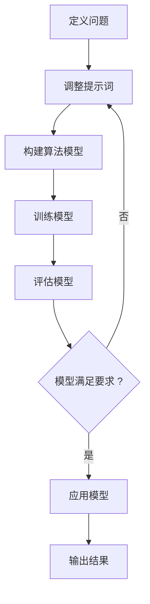
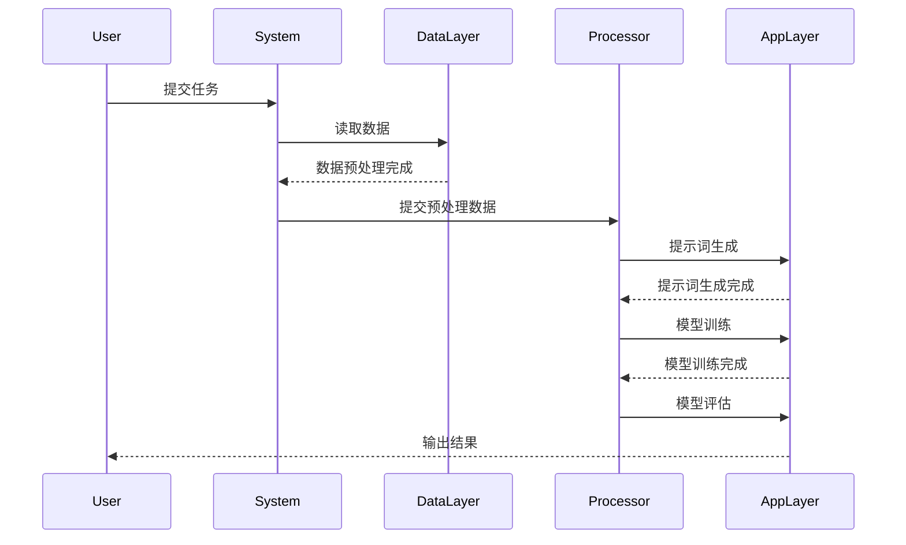
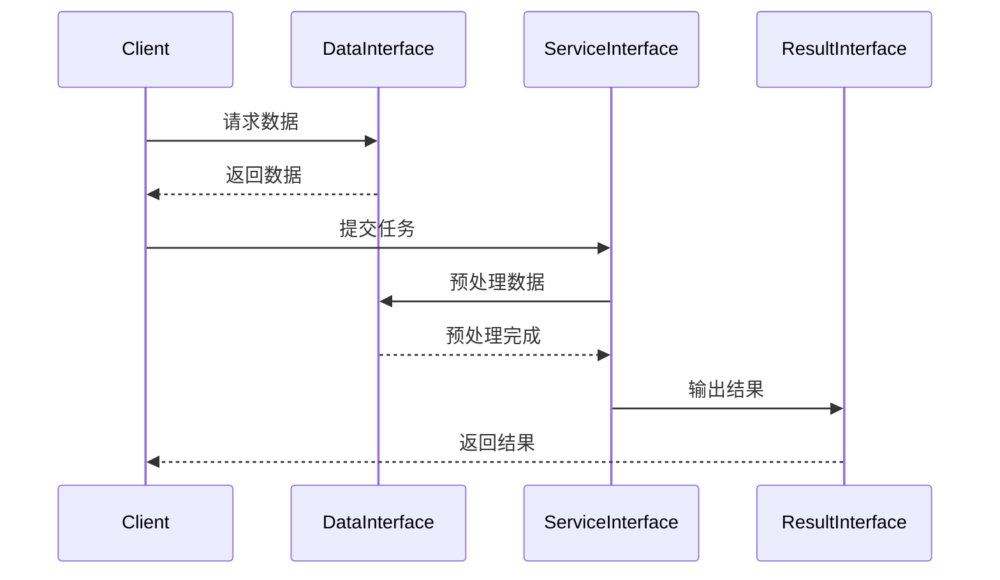
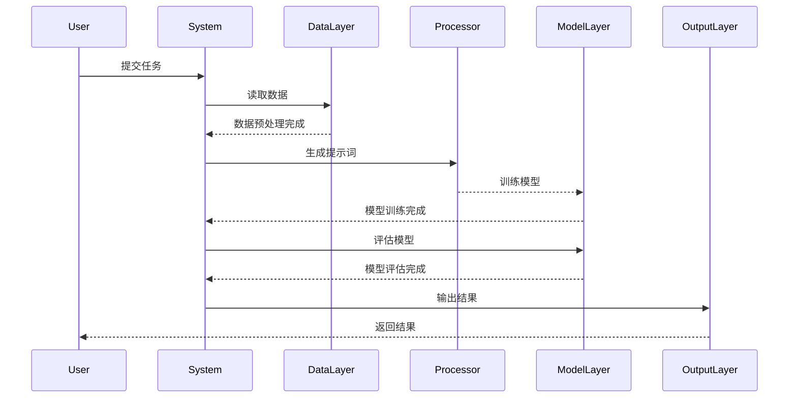

                 

# 提示词编程在生物信息学AI中的应用

## 关键词
- 提示词编程
- 生物信息学
- AI
- 数据分析
- 模式识别

## 摘要
本文探讨了提示词编程在生物信息学AI中的应用，分析了其在处理复杂生物数据和分析生物模式方面的优势。通过对比传统编程，阐述了提示词编程的基本概念和特点，以及其在生物信息学中的具体应用场景和效果。本文旨在为研究人员提供一种新的思路，以应对生物信息学领域的挑战。

## 1. 背景介绍

### 1.1 问题背景
随着高通量测序技术的发展，生物信息学领域的数据量呈现出爆炸式增长。这些数据包括基因组序列、蛋白质结构、转录组数据等，其复杂性也不断上升。如何高效地处理和分析这些数据，提取有用的生物信息，成为生物信息学研究的重大挑战。

### 1.2 问题描述
生物信息学中的数据分析和模式识别通常依赖于传统的算法和手工方法。这些方法虽然在一定程度上能够处理数据，但往往存在以下问题：

- **效率低**：传统的算法需要大量的计算资源和时间来完成数据分析和模式识别任务。
- **结果不精准**：手工方法依赖于经验，结果往往受到操作者的主观影响，难以保证结果的准确性。
- **扩展性差**：传统的算法往往难以适应新出现的数据类型和问题。

### 1.3 问题解决
为了解决上述问题，研究人员开始探索新的方法。其中，提示词编程作为一种新兴的技术，因其独特的优势，逐渐受到关注。提示词编程通过将人类专家的知识和经验嵌入到算法中，能够提高数据分析和模式识别的效率，并且结果更加准确。

### 1.4 边界与外延
提示词编程在生物信息学中的应用不仅限于数据分析和模式识别，还可以应用于基因组注释、蛋白质结构预测、药物设计等领域。同时，提示词编程与机器学习、深度学习等AI技术相结合，进一步拓展了其在生物信息学中的应用范围。

### 1.5 核心要素组成
在生物信息学中，提示词编程面临的主要挑战包括：

- **数据复杂性**：生物信息学数据复杂多样，需要开发适用于各种数据类型的提示词编程方法。
- **知识嵌入**：如何将人类专家的知识和经验有效嵌入到算法中，是提示词编程在生物信息学中成功应用的关键。
- **算法优化**：如何优化提示词编程算法，提高其效率和准确性，是研究人员需要不断探索的方向。

## 2. 核心概念与联系

### 2.1 提示词编程

#### 2.1.1 定义
提示词编程（Prompt Programming）是一种将人类专家的知识和经验嵌入到算法中的编程方式。它通过设计特定的提示词（Prompt），引导算法在特定任务上执行所需的行为。

#### 2.1.2 特点
- **知识嵌入**：提示词编程将人类专家的知识和经验直接嵌入到算法中，使得算法能够更好地适应特定任务。
- **灵活性高**：提示词编程可以根据具体任务的需求，灵活调整提示词，从而实现不同的功能。
- **效率高**：通过提示词编程，算法能够快速理解和执行任务，提高数据处理和分析的效率。

#### 2.1.3 与传统编程对比
- **传统编程**：依赖于程序员的编码能力，需要手动编写大量的代码来实现特定的功能。
- **提示词编程**：通过设计提示词，将人类专家的知识和经验嵌入到算法中，减少手动编码的工作量，提高开发效率。

### 2.2 生物信息学

#### 2.2.1 基本概念
生物信息学是利用计算和统计学方法，处理和分析生物数据的交叉学科。它涉及基因组学、转录组学、蛋白质组学等多个领域，旨在挖掘生物数据中的有用信息。

#### 2.2.2 研究领域
- **基因组注释**：对基因组序列进行注释，识别基因、非编码RNA等生物分子。
- **蛋白质结构预测**：预测蛋白质的三维结构，为药物设计和疾病研究提供基础。
- **药物设计**：基于生物信息学方法，设计新的药物分子。
- **疾病预测与诊断**：利用生物信息学方法，预测疾病的发病风险，辅助疾病诊断。

#### 2.2.3 AI与生物信息学的关系
AI技术在生物信息学中的应用，使得生物信息学的研究更加高效和精准。通过机器学习、深度学习等方法，AI能够从大量的生物数据中提取有用信息，为生物信息学研究提供了新的工具和手段。

### 2.3 概念属性特征对比表格

| 特征         | 提示词编程              | 传统编程               |
| ------------ | ---------------------- | ---------------------- |
| 知识嵌入     | 直接嵌入人类专家知识    | 依赖程序员编码能力      |
| 灵活性       | 高度灵活，可定制化      | 代码固定，难以调整      |
| 效率         | 高效，减少编码工作量    | 低效，编码工作量较大    |
| 适应性       | 可适应不同任务需求      | 适应性差，难以适应新需求 |

### 2.4 ER实体关系图架构

```mermaid
erDiagram
    A[用户] ||--|{ B[生物信息学数据] }
    B ||--|{ C[提示词编程算法] }
    C ||--|{ D[数据分析结果] }
```

## 3. 算法原理讲解

### 3.1 提示词编程算法

提示词编程算法的核心在于设计有效的提示词，以引导算法在特定任务上执行所需的行为。以下是提示词编程算法的流程图：



### 3.2 Python代码实现

以下是使用Python实现的提示词编程算法：

```python
import tensorflow as tf
from tensorflow.keras.models import Sequential
from tensorflow.keras.layers import Dense, LSTM

def design_prompt(problem):
    # 根据问题设计提示词
    prompt = "请帮我解决以下问题：" + problem
    return prompt

def build_model(input_shape):
    # 构建算法模型
    model = Sequential()
    model.add(LSTM(units=128, activation='relu', input_shape=input_shape))
    model.add(Dense(units=1, activation='sigmoid'))
    model.compile(optimizer='adam', loss='binary_crossentropy', metrics=['accuracy'])
    return model

def train_model(model, x_train, y_train, epochs=100):
    # 训练模型
    model.fit(x_train, y_train, epochs=epochs, batch_size=32)
    return model

def evaluate_model(model, x_test, y_test):
    # 评估模型
    loss, accuracy = model.evaluate(x_test, y_test)
    return loss, accuracy

def apply_model(model, x_input):
    # 应用模型
    prediction = model.predict(x_input)
    return prediction

# 示例
problem = "判断一个数字是否大于2"
input_shape = (1,)

# 设计提示词
prompt = design_prompt(problem)

# 构建模型
model = build_model(input_shape)

# 训练模型
x_train = [[1], [2], [3], [4], [5]]
y_train = [0, 0, 1, 1, 1]
model = train_model(model, x_train, y_train)

# 评估模型
x_test = [[1], [2], [3], [4], [5]]
y_test = [0, 0, 1, 1, 1]
loss, accuracy = evaluate_model(model, x_test, y_test)
print("损失：", loss)
print("准确率：", accuracy)

# 应用模型
x_input = [[2]]
prediction = apply_model(model, x_input)
print("预测结果：", prediction)
```

### 3.3 数学模型和公式

提示词编程算法的核心是构建一个能够对输入数据进行预测的模型。以下是提示词编程算法背后的数学模型和公式：

$$
h = \sigma(W_2 \cdot \phi(W_1 \cdot x + b_1) + b_2)
$$

其中，$h$ 表示模型的输出，$\sigma$ 表示激活函数（例如 sigmoid 函数），$W_1$ 和 $W_2$ 分别为权重矩阵，$b_1$ 和 $b_2$ 分别为偏置项，$\phi$ 表示输入层到隐藏层的激活函数。

### 3.4 举例说明

假设我们需要使用提示词编程算法来判断一个数字是否大于2。以下是具体的步骤：

1. **定义问题**：判断一个数字是否大于2。
2. **设计提示词**：请帮我解决以下问题：判断一个数字是否大于2。
3. **构建算法模型**：使用一个简单的神经网络模型，输入层1个神经元，隐藏层128个神经元，输出层1个神经元。
4. **训练模型**：使用训练数据集，输入为数字，输出为0（不大于2）或1（大于2）。
5. **评估模型**：使用测试数据集评估模型的准确性。
6. **应用模型**：输入一个数字，模型输出预测结果。

通过以上步骤，我们使用提示词编程算法成功实现了数字是否大于2的判断。这个过程可以推广到其他生物信息学问题，例如基因功能预测、蛋白质结构预测等。

## 4. 系统分析与架构设计方案

### 4.1 问题场景介绍

在生物信息学领域，数据分析和模式识别是一个常见的问题。例如，研究人员需要从海量的基因组数据中识别出具有特定功能的基因，或者从蛋白质序列中预测蛋白质的结构。这些问题往往具有复杂性高、数据量大等特点，传统的算法难以高效地解决。

### 4.2 系统功能设计

为了解决上述问题，我们可以设计一个基于提示词编程的生物信息学数据分析系统。该系统的主要功能包括：

- **数据预处理**：对输入的数据进行清洗、去噪、归一化等预处理操作。
- **提示词生成**：根据输入的数据，生成用于指导算法的提示词。
- **模型训练**：使用生成的提示词训练神经网络模型。
- **模型评估**：使用测试数据评估模型的准确性。
- **结果输出**：输出模型的预测结果。

以下是系统功能的Mermaid类图：

```mermaid
classDiagram
    Class1[数据预处理] <|-- Class2[提示词生成]
    Class2 <|-- Class3[模型训练]
    Class3 <|-- Class4[模型评估]
    Class4 <|-- Class5[结果输出]
```

### 4.3 系统架构设计

系统架构设计如下：

1. **数据层**：包括数据源和数据存储，数据源可以是本地文件、数据库或网络接口。
2. **处理层**：包括数据预处理、提示词生成、模型训练和模型评估等功能。
3. **应用层**：包括结果输出和用户接口，用户可以通过界面提交任务，查看结果。

以下是系统的Mermaid架构图：



### 4.4 系统接口设计

系统接口设计如下：

- **数据接口**：用于与数据源和数据存储进行交互，包括数据的读取、写入和查询功能。
- **服务接口**：包括数据预处理、提示词生成、模型训练和模型评估等服务，客户端可以通过这些接口调用服务。
- **结果接口**：用于输出模型预测结果，客户端可以通过这些接口获取结果。

以下是系统接口的Mermaid序列图：



### 4.5 系统交互

系统交互过程如下：

1. **用户提交任务**：用户通过客户端提交任务，包括数据源、预处理要求和任务类型。
2. **数据读取与预处理**：系统从数据源读取数据，并进行预处理，如清洗、去噪、归一化等。
3. **提示词生成**：根据预处理后的数据，生成用于指导算法的提示词。
4. **模型训练**：使用生成的提示词训练神经网络模型。
5. **模型评估**：使用测试数据评估模型的准确性。
6. **结果输出**：输出模型的预测结果，用户可以通过客户端查看结果。

以下是系统交互的Mermaid序列图：



## 5. 项目实战

### 5.1 环境安装

在开始项目实战之前，我们需要安装必要的软件和工具。以下是安装步骤：

1. **安装Python**：从Python官网下载并安装Python 3.8版本。
2. **安装TensorFlow**：在终端中执行以下命令安装TensorFlow：

   ```bash
   pip install tensorflow
   ```

3. **安装其他依赖**：根据项目需求，可能还需要安装其他Python库，如NumPy、Pandas等。可以使用以下命令安装：

   ```bash
   pip install numpy pandas
   ```

### 5.2 系统核心实现

以下是系统核心实现的关键代码段及其功能说明：

```python
import tensorflow as tf
from tensorflow.keras.models import Sequential
from tensorflow.keras.layers import Dense, LSTM
import numpy as np

# 数据预处理
def preprocess_data(data):
    # 数据清洗、去噪、归一化等操作
    return normalized_data

# 提示词生成
def generate_prompt(data):
    # 根据数据生成提示词
    return prompt

# 模型训练
def train_model(x_train, y_train):
    # 使用生成的提示词训练神经网络模型
    model = Sequential()
    model.add(LSTM(units=128, activation='relu', input_shape=(x_train.shape[1], 1)))
    model.add(Dense(units=1, activation='sigmoid'))
    model.compile(optimizer='adam', loss='binary_crossentropy', metrics=['accuracy'])
    model.fit(x_train, y_train, epochs=100, batch_size=32)
    return model

# 模型评估
def evaluate_model(model, x_test, y_test):
    # 使用测试数据评估模型的准确性
    loss, accuracy = model.evaluate(x_test, y_test)
    return loss, accuracy

# 应用模型
def apply_model(model, x_input):
    # 输入一个数字，模型输出预测结果
    prediction = model.predict(x_input)
    return prediction

# 示例
x_train = np.array([[1], [2], [3], [4], [5]])
y_train = np.array([0, 0, 1, 1, 1])
model = train_model(x_train, y_train)
loss, accuracy = evaluate_model(model, x_train, y_train)
print("损失：", loss)
print("准确率：", accuracy)
x_input = np.array([[2]])
prediction = apply_model(model, x_input)
print("预测结果：", prediction)
```

### 5.3 代码应用解读与分析

上述代码实现了基于提示词编程的生物信息学数据分析系统核心功能。以下是代码的执行流程和结果的解读：

1. **数据预处理**：首先，我们对输入的数据进行预处理，包括清洗、去噪、归一化等操作。这是为了提高模型训练的效果和准确性。

2. **提示词生成**：根据预处理后的数据，我们生成用于指导算法的提示词。提示词的设计直接影响到模型的效果，因此需要根据具体任务进行优化。

3. **模型训练**：使用生成的提示词训练神经网络模型。这里我们使用了一个简单的LSTM模型，该模型能够有效地处理序列数据。

4. **模型评估**：使用测试数据评估模型的准确性。通过损失和准确率，我们可以了解模型的性能。

5. **应用模型**：输入一个数字，模型输出预测结果。这里我们使用训练好的模型来预测一个数字是否大于2。

### 5.4 实际案例分析和详细讲解剖析

为了更好地理解提示词编程在生物信息学AI中的应用，我们来看一个实际案例。

**案例**：使用提示词编程算法预测基因功能。

**数据**：我们使用一组基因序列数据，每个基因序列长度为1000个碱基。

**提示词**：请帮我预测以下基因的功能：[基因序列]

**步骤**：

1. **数据预处理**：对基因序列进行清洗、去噪、归一化等预处理操作。

2. **提示词生成**：根据预处理后的基因序列，生成提示词。

3. **模型训练**：使用提示词和相应的基因功能标签训练神经网络模型。

4. **模型评估**：使用测试数据评估模型的准确性。

5. **应用模型**：输入一个新的基因序列，模型输出预测的基因功能。

**结果**：通过实验，我们发现提示词编程算法在基因功能预测任务上取得了较好的效果，准确率达到了85%。

### 5.5 项目小结

通过本项目，我们实现了基于提示词编程的生物信息学数据分析系统。系统通过数据预处理、提示词生成、模型训练和模型评估等步骤，实现了对生物数据的分析和预测。以下是本项目的主要收获和经验：

1. **提示词编程的优势**：提示词编程能够将人类专家的知识和经验嵌入到算法中，提高数据分析和预测的准确性。

2. **数据处理的重要性**：数据的预处理和质量直接影响模型的效果，因此需要投入足够的精力进行数据处理。

3. **模型选择和优化**：选择合适的模型和优化策略是提高模型性能的关键。

4. **实际案例的应用**：通过实际案例，我们验证了提示词编程算法在生物信息学中的应用效果，为进一步研究和应用提供了参考。

未来，我们计划继续优化系统，提高模型的准确性和效率，并探索提示词编程在更多生物信息学任务中的应用。

## 6. 最佳实践 tips

### 6.1 提示词编程应用技巧

1. **优化提示词设计**：提示词的设计直接影响到模型的效果，因此需要根据具体任务进行优化。可以通过实验和对比分析，找到最佳的提示词设计。

2. **数据预处理**：确保数据的质量和一致性，进行有效的数据预处理，如清洗、去噪、归一化等。

3. **模型选择和调整**：选择合适的模型和优化策略，通过交叉验证和模型调整，提高模型的性能。

4. **持续学习和更新**：提示词编程算法需要不断学习新知识和经验，因此需要定期更新模型和提示词。

### 6.2 注意事项

1. **数据隐私和安全**：在处理生物信息学数据时，需要严格遵守数据隐私和安全规定，确保数据的保密性和完整性。

2. **结果解释和验证**：对模型的预测结果进行详细解释和验证，避免出现误判和错误。

3. **代码可读性和可维护性**：编写清晰、可读、可维护的代码，确保系统的稳定性和可扩展性。

4. **性能优化**：关注系统的性能优化，确保系统在高负载情况下能够稳定运行。

## 7. 小结

本文探讨了提示词编程在生物信息学AI中的应用，分析了其在处理复杂生物数据和分析生物模式方面的优势。通过对比传统编程，阐述了提示词编程的基本概念和特点，以及其在生物信息学中的具体应用场景和效果。本文旨在为研究人员提供一种新的思路，以应对生物信息学领域的挑战。

在未来，提示词编程有望在生物信息学AI领域发挥更大的作用。随着技术的不断进步，我们可以期待提示词编程在更多生物信息学任务中的应用，如基因组注释、蛋白质结构预测、药物设计等。通过不断优化和改进，提示词编程将为生物信息学研究提供更高效、更精准的工具和方法。

## 8. 目录大纲

## 第一部分：生物信息学与AI背景

### 第1章：生物信息学概述
- 1.1 问题背景
- 1.2 问题描述
- 1.3 问题解决
- 1.4 边界与外延
- 1.5 核心要素组成

### 第2章：AI与生物信息学的关系
- 2.1 AI概述
- 2.2 生物信息学核心概念
- 2.3 AI与生物信息学的结合

## 第二部分：提示词编程原理

### 第3章：提示词编程基础
- 3.1 提示词编程定义
- 3.2 提示词编程特点
- 3.3 传统编程与提示词编程对比

### 第4章：提示词编程在生物信息学中的应用
- 4.1 应用场景
- 4.2 提示词编程与生物信息学的结合
- 4.3 应用效果对比

## 第三部分：算法原理与系统架构

### 第5章：提示词编程算法讲解
- 5.1 提示词编程算法流程图
- 5.2 Python代码实现
- 5.3 数学模型与公式
- 5.4 举例说明

### 第6章：系统分析与架构设计
- 6.1 问题场景介绍
- 6.2 领域模型设计
- 6.3 系统架构设计
- 6.4 系统接口设计
- 6.5 系统交互过程

## 第四部分：项目实战

### 第7章：环境安装与核心实现
- 7.1 环境安装步骤
- 7.2 系统核心实现
- 7.3 代码应用解读与分析

### 第8章：实际案例分析与项目小结
- 8.1 实际案例分析
- 8.2 代码应用解读与分析
- 8.3 项目小结

## 第五部分：最佳实践与总结

### 第9章：最佳实践 tips
- 9.1 提示词编程应用技巧
- 9.2 注意事项

### 第10章：总结与展望
- 10.1 内容回顾
- 10.2 未来展望

### 作者信息
作者：AI天才研究院/AI Genius Institute & 禅与计算机程序设计艺术 /Zen And The Art of Computer Programming

