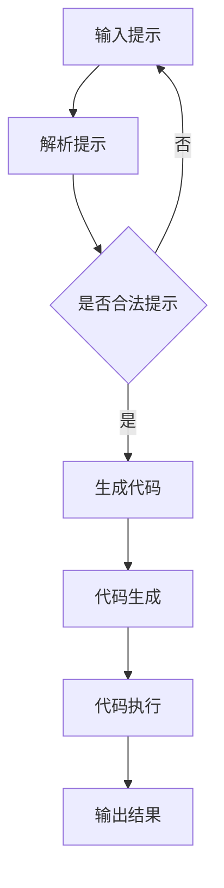
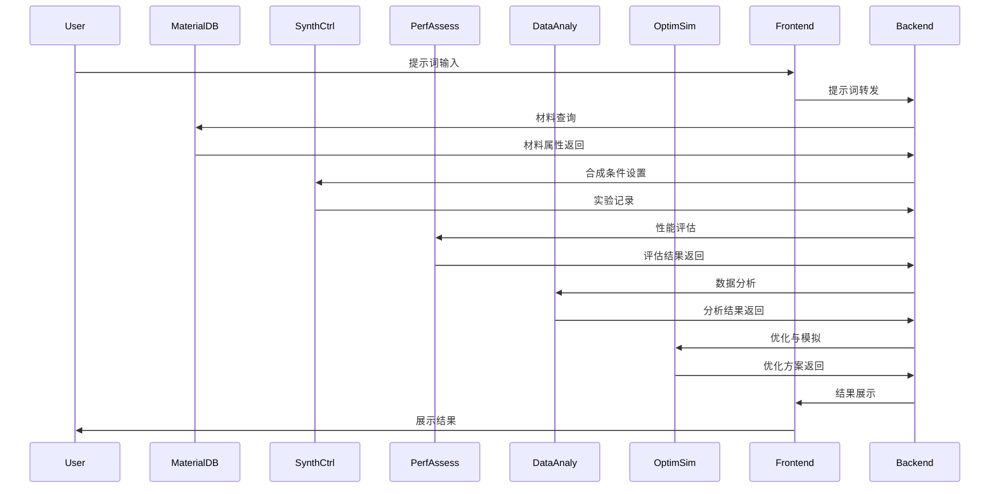

                 

## 提示词编程在纳米材料设计中的应用

### 关键词：纳米材料设计、提示词编程、算法原理、系统架构、项目实战

### 摘要：
纳米材料设计在科技创新领域具有巨大的应用潜力。随着计算能力和算法的不断发展，提示词编程作为一种先进的编程方法，逐渐在纳米材料设计中发挥重要作用。本文将深入探讨提示词编程在纳米材料设计中的应用，通过逻辑清晰的步骤分析，介绍纳米材料设计的重要性、提示词编程的基本概念、算法原理及其在实际项目中的实战应用。文章旨在为读者提供一种新的视角，理解如何利用提示词编程解决纳米材料设计的核心问题，并探索这一领域的前沿发展趋势。

### 目录：

## 第一部分：纳米材料设计基础

### 第1章：纳米材料与提示词编程概述

### 第2章：纳米材料的基本特性

## 第二部分：提示词编程在纳米材料设计中的应用

### 第3章：提示词编程算法原理

### 第4章：系统分析与架构设计

### 第5章：项目实战

### 第6章：最佳实践与总结

### 第7章：附录

---

### 1.1 纳米材料设计的重要性

纳米材料设计在现代科技领域中占据着重要地位。它们具有独特的物理、化学和生物学特性，使得它们在多个领域展现出了卓越的性能。纳米材料的尺寸在1到100纳米之间，这使得它们具有极高的比表面积、独特的电子特性和优异的催化性能。例如，纳米材料在电子器件、药物递送、催化剂、太阳能电池和传感器等领域都有着广泛的应用。

在纳米材料设计中，传统方法往往依赖于实验和经验的积累，这不仅耗费大量时间和资源，而且效果有限。随着计算能力的提升和算法的进步，提示词编程作为一种新兴的编程方法，为纳米材料设计提供了一种全新的思路。提示词编程通过将自然语言描述转化为编程代码，可以自动化、高效地处理复杂的计算任务，从而大大提高了纳米材料设计的效率和准确性。

### 1.2 提示词编程的基本概念

提示词编程（Prompt Programming）是一种通过自然语言提示来指导程序进行计算的方法。它的核心思想是将人类的思考过程转化为可编程的指令，使得计算机能够理解和执行复杂的任务。在提示词编程中，用户通过提供一系列自然语言提示，指导程序完成特定的任务。

提示词编程的基本原理包括以下几个关键步骤：

1. **提示生成**：用户根据任务需求生成自然语言提示，这些提示通常包含了对任务的目标、方法和约束条件的描述。
2. **代码生成**：编程工具根据提示生成相应的代码，这个过程中可能涉及自然语言处理、语法分析和代码生成等多个技术环节。
3. **代码执行**：生成的代码在计算机上执行，完成用户指定的任务。

提示词编程具有以下几个显著特点：

- **灵活性**：提示词编程允许用户以自然语言的方式描述任务，这使得编程变得更加直观和易用。
- **高效性**：通过自动化生成代码，提示词编程可以大大减少编程时间和人力资源。
- **可扩展性**：提示词编程可以轻松扩展到新的任务和应用场景，提高了算法的适应性。

### 1.3 提示词编程在纳米材料设计中的应用背景

纳米材料设计的复杂性使得传统的实验方法难以应对。提示词编程作为一种自动化和智能化的编程方法，为纳米材料设计提供了强有力的工具。具体而言，提示词编程在纳米材料设计中的应用背景包括以下几个方面：

1. **自动化材料合成**：通过提示词编程，可以自动化生成合成纳米材料的程序，减少实验的复杂性和人工干预。
2. **性能优化**：提示词编程可以帮助优化纳米材料的性能，通过调整合成参数和材料结构，实现性能的提升。
3. **新材料的探索**：提示词编程可以根据用户提供的提示，探索新的纳米材料结构和组成，从而发现具有潜在应用价值的新型材料。
4. **数据分析和建模**：提示词编程可以用于处理和分析纳米材料相关的实验数据，建立准确的材料性能模型。

总的来说，提示词编程为纳米材料设计提供了一种新的解决方案，通过其灵活、高效和可扩展的特点，可以显著提高纳米材料设计的效率和创新能力。

### 1.4 本章小结

本章介绍了纳米材料设计的重要性以及提示词编程的基本概念和应用背景。纳米材料由于其独特的物理和化学特性，在多个科技领域展现出巨大的应用潜力。而提示词编程作为一种新兴的编程方法，通过将自然语言提示转化为可执行的代码，为纳米材料设计提供了一种高效、灵活和智能化的解决方案。接下来，我们将进一步探讨纳米材料的基本特性，并详细讲解提示词编程在纳米材料设计中的核心应用原理。

## 第2章：纳米材料的基本特性

### 2.1 纳米材料的基本概念

纳米材料是指至少在一维尺度上尺寸在1到100纳米范围内的材料。由于纳米尺寸的特殊性，纳米材料在结构、性能和应用方面表现出与宏观材料截然不同的特性。纳米材料可以由多种元素组成，包括金属、半导体、陶瓷和有机物等。

纳米材料的基本特性包括：

- **高比表面积**：纳米材料具有极高的比表面积，这使其在催化、吸附和传感器等领域具有显著优势。
- **量子尺寸效应**：纳米材料的量子尺寸效应导致其电子性质发生变化，例如导电性、磁性等。
- **表面效应**：纳米材料表面原子的比例较高，这使其表面化学和物理性质与体相材料显著不同。
- **界面效应**：纳米材料与其他物质的界面区域具有独特的物理和化学性质，这为多功能材料设计提供了可能。

### 2.2 纳米材料的分类

纳米材料可以根据不同的分类标准进行分类，常见的分类方法包括以下几种：

- **按组成元素分类**：可以分为金属材料、半导体材料、陶瓷材料和有机材料等。
  - **金属材料**：如金、银、铜等，广泛应用于电子器件和催化剂。
  - **半导体材料**：如硅、锗等，广泛应用于太阳能电池和电子元件。
  - **陶瓷材料**：如钛酸钡、钛酸铋等，广泛应用于传感器和电池。
  - **有机材料**：如聚合物、有机金属框架等，广泛应用于药物递送和生物传感器。

- **按结构形态分类**：可以分为纳米颗粒、纳米线、纳米片和纳米孔等。
  - **纳米颗粒**：具有球形或非球形形态，广泛应用于药物载体和催化剂。
  - **纳米线**：具有一维线状结构，广泛应用于电子器件和纳米机械系统。
  - **纳米片**：具有二维层状结构，广泛应用于催化和光电材料。
  - **纳米孔**：具有孔洞结构，广泛应用于气体分离和药物递送。

- **按功能特性分类**：可以分为纳米传感器、纳米催化剂、纳米储能材料和纳米生物材料等。
  - **纳米传感器**：利用纳米材料的特性能检测各种化学和物理信号，广泛应用于环境监测和医疗诊断。
  - **纳米催化剂**：具有高效的催化性能，广泛应用于化学反应和污染处理。
  - **纳米储能材料**：具有优异的电化学储能性能，广泛应用于电池和超级电容器。
  - **纳米生物材料**：具有良好的生物相容性和生物活性，广泛应用于生物医学和生物工程领域。

### 2.3 纳米材料的结构特点

纳米材料的结构特点直接影响其物理、化学和生物学性质。以下是纳米材料的一些典型结构特点：

- **纳米颗粒**：纳米颗粒通常具有球形或非球形形态，其尺寸在几纳米到几十纳米之间。纳米颗粒的表面效应和量子尺寸效应显著，这使得它们在催化、吸附和光电领域具有优异的性能。
- **纳米线**：纳米线具有一维线状结构，其直径通常在几纳米到几十纳米之间，长度可以达到数百纳米到数微米。纳米线在导电性和机械性能方面表现出独特优势，广泛应用于电子器件和纳米机械系统。
- **纳米片**：纳米片具有二维层状结构，其厚度通常在几纳米到几十纳米之间，宽度可以从几十纳米到几百纳米不等。纳米片在催化、光电和储能领域表现出突出的性能，例如用于开发高效催化剂和太阳能电池。
- **纳米孔**：纳米孔通常具有高度有序的结构，其孔径在纳米尺度范围内。纳米孔在气体分离、吸附和药物递送等领域具有显著的应用潜力。

### 2.4 纳米材料的性能优势

纳米材料由于其独特的结构和特性，在多个领域展现出显著的性能优势：

- **高比表面积**：纳米材料具有极高的比表面积，这使其在催化、吸附和传感器等领域具有显著优势。高比表面积有利于提高反应速率和材料利用率，从而提高整体性能。
- **量子尺寸效应**：纳米材料的量子尺寸效应导致其电子性质发生变化，例如导电性、磁性等。量子尺寸效应可以使得纳米材料在电子器件、太阳能电池和磁性材料中发挥独特作用。
- **表面效应**：纳米材料表面原子的比例较高，这使其表面化学和物理性质与体相材料显著不同。表面效应可以使得纳米材料在催化、吸附和传感等领域表现出优异的性能。
- **界面效应**：纳米材料与其他物质的界面区域具有独特的物理和化学性质，这为多功能材料设计提供了可能。界面效应可以使得纳米材料在复合材料的性能优化、药物递送和生物传感中发挥重要作用。

总的来说，纳米材料的独特结构和特性使其在多个科技领域展现出显著的性能优势，为纳米材料设计提供了广阔的应用前景。

### 2.5 纳米材料的属性特征对比

为了更好地理解纳米材料与传统材料在属性特征上的区别，我们可以通过一个对比表格来展示它们的主要差异：

| 特性       | 普通材料 | 纳米材料 |
|------------|-----------|-----------|
| 比表面积   | 通常较小  | 非常大    |
| 硬度       | 通常较低  | 非常高    |
| 导电性     | 一般      | 优异      |
| 磁性       | 无        | 有        |
| 化学活性   | 通常较低  | 非常高    |
| 热传导性   | 一般      | 非常高    |

**比表面积**：纳米材料具有极高的比表面积，这意味着它们在单位体积内的表面积比传统材料大得多。这一特性使得纳米材料在催化、吸附和传感等方面表现出卓越的性能，因为更多的表面原子可以与反应物或检测目标接触。

**硬度**：纳米材料的硬度通常比传统材料高，因为纳米尺寸的颗粒具有更高的能量密度，这使得它们在受到外力时能够抵抗变形。

**导电性**：纳米材料，特别是金属纳米颗粒和半导体纳米线，具有独特的导电性。例如，金属纳米颗粒由于量子尺寸效应，表现出异常高的电导率，而半导体纳米线则可以通过调节其尺寸和组成来控制导电性。

**磁性**：某些纳米材料，如纳米颗粒和纳米线，具有优异的磁性。这些材料在磁性存储、磁传感器和磁共振成像等领域有广泛应用。

**化学活性**：纳米材料的化学活性通常比传统材料高，因为它们具有更多的表面原子，这些原子更容易与外界发生化学反应。

**热传导性**：纳米材料的热传导性因材料种类而异，但许多纳米材料，如碳纳米管和纳米晶体，具有显著的热传导性提升。这一特性使得它们在热管理应用中非常有价值。

通过这个表格，我们可以清晰地看到纳米材料在多种属性上的独特优势，这些优势使得纳米材料在科技和工业领域具有广泛的应用潜力。

### 2.6 纳米材料的设计要素

纳米材料的设计涉及多个关键要素，这些要素决定了材料的结构和性能。以下是纳米材料设计中需要考虑的主要设计要素：

**1. 结构设计**：

结构设计是纳米材料设计的基础，它决定了材料的物理和化学特性。纳米材料可以设计成纳米颗粒、纳米线、纳米片等多种形态。每种形态都具有不同的结构特点，从而影响材料的性能。例如，纳米颗粒由于其高比表面积，在催化和吸附应用中表现出优异的性能；而纳米线由于其良好的导电性和机械性能，在电子器件和纳米机械系统中具有重要应用。

**2. 组成元素**：

纳米材料的组成元素对其性能具有决定性影响。不同的元素组合可以产生不同的物理和化学特性。例如，金属纳米颗粒因其独特的电子结构在催化和导电应用中具有优势；而半导体纳米线则因其独特的能带结构在光电转换和传感器应用中表现出色。

**3. 功能特性**：

纳米材料的设计不仅要考虑其基础结构，还要注重其功能特性。功能特性包括催化活性、磁性、光电性质等。设计纳米材料时，需要根据应用需求选择合适的结构设计和组成元素，以实现所需的功能特性。例如，在设计纳米催化剂时，需要选择具有高催化活性的元素组合，并优化纳米颗粒的尺寸和形态，以提高催化效率。

**4. 性能优化**：

纳米材料的设计过程还涉及性能优化，即通过调整合成参数和材料结构来提升材料的性能。性能优化可以通过多种方法实现，如控制纳米颗粒的尺寸、形态和分布，调节纳米材料的表面性质等。这些优化方法可以显著提高纳米材料在特定应用中的性能。

**5. 应用导向**：

纳米材料的设计应紧密结合具体应用场景。设计过程中需要考虑纳米材料在实际应用中的性能表现，如稳定性、可靠性、生物相容性等。通过将应用需求与材料设计相结合，可以开发出具有实际应用价值的纳米材料。

总之，纳米材料的设计涉及多个复杂因素，需要综合考虑结构设计、组成元素、功能特性、性能优化和应用导向等方面。通过合理设计，纳米材料可以展现出卓越的性能，为科技和工业领域带来革命性的变化。

### 2.7 提示词编程在纳米材料设计中的作用

提示词编程在纳米材料设计中发挥着重要作用，其主要作用体现在以下几个方面：

**1. 自动化合成流程**：

提示词编程可以自动化纳米材料的合成流程，减少人工干预和实验误差。用户可以通过自然语言提示描述合成过程，如材料选择、反应条件、温度和时间等，编程工具则根据这些提示自动生成合成代码。这不仅提高了合成效率，还确保了合成过程的准确性和重复性。

**2. 性能优化**：

提示词编程可以帮助优化纳米材料的性能。通过提供详细的性能指标和优化目标，提示词编程可以自动调整纳米材料的结构参数，如颗粒尺寸、形态和组成等，从而实现性能的最优化。例如，用户可以提示要求提升纳米材料的催化活性或光电转换效率，编程工具则会根据这些要求生成相应的优化方案。

**3. 新材料发现**：

提示词编程在探索新型纳米材料方面也具有显著优势。用户可以通过自然语言提示描述所需材料的功能和应用场景，编程工具则基于这些提示生成新的材料合成方案。这种方法可以快速发现和验证新的纳米材料，大大缩短新材料研发周期。

**4. 数据处理和分析**：

提示词编程在数据处理和分析方面具有强大的能力。纳米材料设计过程中会产生大量实验数据，提示词编程可以通过自然语言提示自动处理这些数据，如数据清洗、特征提取和统计分析等。这为纳米材料性能评估和优化提供了有力支持。

**5. 界面设计和模拟**：

提示词编程还可以用于纳米材料的界面设计和模拟。用户可以通过自然语言提示描述纳米材料与其他物质之间的界面特性，编程工具则可以生成相应的界面模型，并进行模拟和分析。这种方法可以帮助用户更好地理解纳米材料的界面行为，为实际应用提供科学依据。

总之，提示词编程在纳米材料设计中的应用极大地提升了设计效率和创新能力，为纳米材料的研究和应用开辟了新的方向。通过合理利用提示词编程，纳米材料设计可以更加自动化、智能化和高效化，为科技和工业领域带来更多突破。

### 2.8 提示词编程与纳米材料设计的关系

提示词编程与纳米材料设计之间存在着密切的联系，这种联系不仅体现在技术层面，还贯穿于整个设计流程。首先，提示词编程通过将自然语言描述转化为编程指令，为纳米材料设计提供了强有力的工具。用户可以通过简洁的自然语言提示，指导程序完成复杂的合成、性能优化和新材料探索任务。

在纳米材料设计中，提示词编程的关键作用包括以下几个方面：

**1. 自动化合成过程**：

提示词编程可以自动化纳米材料的合成流程，减少人工干预。用户只需提供合成所需的参数和条件，如材料类型、反应温度和时间等，编程工具则会自动生成合成代码并执行相应的操作。这种方法不仅提高了合成效率，还确保了合成过程的准确性和重复性。

**2. 性能优化**：

提示词编程可以帮助优化纳米材料的性能。通过提供具体的性能指标和优化目标，提示词编程可以自动调整纳米材料的结构参数，如颗粒尺寸、形态和组成等。例如，用户可以提示要求提升纳米材料的催化活性或光电转换效率，编程工具则会根据这些要求生成相应的优化方案。

**3. 新材料发现**：

提示词编程在探索新型纳米材料方面具有显著优势。用户可以通过自然语言提示描述所需材料的功能和应用场景，编程工具则可以基于这些提示生成新的合成方案。这种方法可以快速发现和验证新的纳米材料，缩短新材料研发周期。

**4. 数据处理与分析**：

纳米材料设计过程中会产生大量实验数据，提示词编程可以通过自然语言提示自动处理这些数据，如数据清洗、特征提取和统计分析等。这为纳米材料性能评估和优化提供了有力支持。

**5. 界面设计与模拟**：

提示词编程还可以用于纳米材料的界面设计和模拟。用户可以通过自然语言提示描述纳米材料与其他物质之间的界面特性，编程工具则可以生成相应的界面模型，并进行模拟和分析。这种方法可以帮助用户更好地理解纳米材料的界面行为，为实际应用提供科学依据。

通过上述分析，我们可以看到，提示词编程不仅提升了纳米材料设计的效率，还为其带来了更多创新可能性。具体而言，提示词编程在纳米材料设计中的应用可以归纳为以下几个方面：

1. **提高设计效率**：通过自动化合成和优化流程，显著缩短设计和生产周期。
2. **增强创新能力**：通过探索新的合成方法和材料结构，推动纳米材料设计领域的创新。
3. **优化材料性能**：通过精确调整结构参数，实现纳米材料性能的最优化。
4. **数据处理与分析**：通过自动化处理实验数据，提高数据分析的准确性和效率。
5. **界面设计与模拟**：通过模拟和分析纳米材料的界面行为，为实际应用提供科学指导。

总之，提示词编程为纳米材料设计带来了巨大的变革，通过其灵活、高效和智能的特点，纳米材料设计可以实现更快速、更准确的进展，为科技和工业领域带来更多突破。

### 2.9 提示词编程在纳米材料合成中的应用

提示词编程在纳米材料合成中具有重要的应用，通过其灵活和高效的特点，可以实现纳米材料的高效合成和优化。以下是提示词编程在纳米材料合成中应用的几个关键方面：

**1. 自动化合成流程**：

提示词编程可以自动化纳米材料的合成流程，减少人工干预和实验误差。用户只需通过自然语言提示描述合成所需的条件，如材料、反应温度、时间等，编程工具则自动生成合成代码并执行相应的操作。这种方法不仅提高了合成效率，还确保了合成过程的准确性和重复性。例如，用户可以提示“合成二氧化钛纳米颗粒，反应温度为80摄氏度，反应时间为2小时”，编程工具则会自动安排实验设备，控制反应条件，完成合成过程。

**2. 合成参数优化**：

提示词编程可以基于实验数据和性能指标，自动优化纳米材料的合成参数。用户可以提供具体的性能目标，如纳米颗粒的尺寸、形态和催化活性等，编程工具则会通过算法分析，生成最优的合成参数。例如，用户可以提示“优化纳米颗粒的催化活性，要求在氧化反应中具有更高的活性”，编程工具则会调整反应条件，优化颗粒的尺寸和组成，从而实现性能的优化。

**3. 多材料合成**：

提示词编程还可以实现多材料纳米材料的合成。用户可以通过自然语言提示描述所需合成的多种材料，编程工具则会生成相应的合成方案。这种方法可以显著提高纳米材料的设计灵活性和多样性。例如，用户可以提示“合成二氧化钛和镍的复合材料，用于催化剂制备”，编程工具则会根据提示，设计出具体的合成步骤和材料组合，实现多材料的复合。

**4. 实时监测与调整**：

提示词编程可以实时监测合成过程中的各项参数，并根据实验数据进行动态调整。这种方法可以确保合成过程的稳定性和一致性。例如，用户可以提示“实时监测反应温度和pH值，根据变化自动调整反应条件”，编程工具则会实时监测实验设备的数据，并在需要时自动调整反应条件，保证合成的顺利进行。

**5. 数据分析与处理**：

合成过程中产生的实验数据可以通过提示词编程进行自动化处理和分析。编程工具可以自动提取关键特征，进行统计分析，为后续的优化提供科学依据。例如，用户可以提示“分析纳米颗粒的尺寸分布和表面性质”，编程工具则会自动处理实验数据，生成相应的统计图表，帮助用户更好地理解实验结果。

通过以上应用，提示词编程在纳米材料合成中展示了其强大的功能和灵活性。通过自动化合成流程、优化合成参数、实现多材料合成、实时监测与调整以及自动化数据处理，提示词编程不仅提高了合成效率，还实现了纳米材料性能的优化，为纳米材料研究提供了强有力的工具。

### 2.10 提示词编程在纳米材料性能优化中的应用

提示词编程在纳米材料性能优化中具有显著的优势，它通过自动化和智能化的方法，能够有效地提升纳米材料的性能。以下是提示词编程在纳米材料性能优化中的应用：

**1. 自动化性能评估**：

提示词编程可以自动化纳米材料性能的评估过程。用户通过自然语言提示描述性能评估的目标和指标，编程工具则会生成相应的评估代码。例如，用户可以提示“评估纳米颗粒的催化活性，以氧化反应速率为性能指标”，编程工具会自动执行实验数据采集和性能评估，生成评估报告。

**2. 性能参数优化**：

提示词编程可以基于实验数据，自动优化纳米材料的性能参数。用户可以提供性能优化的目标和约束条件，编程工具则会通过算法分析，生成最优的参数调整方案。例如，用户可以提示“优化纳米颗粒的催化活性，要求在氧化反应中活性最高且成本最低”，编程工具会分析实验数据，生成最优的参数调整方案。

**3. 多目标优化**：

提示词编程可以实现多目标性能优化。用户可以同时提供多个性能目标，编程工具则会通过多目标优化算法，生成兼顾各个目标的优化方案。例如，用户可以提示“同时优化纳米颗粒的催化活性和稳定性”，编程工具会通过多目标优化算法，找到最优的颗粒尺寸、形态和组成，实现性能的全面提升。

**4. 实时性能监测**：

提示词编程可以实时监测纳米材料在应用过程中的性能变化。用户可以通过自然语言提示，要求实时监测特定性能指标，如纳米颗粒的催化活性或电子器件的导电性。编程工具则会实时采集数据，并进行动态分析，为性能调整提供实时依据。

**5. 数据驱动优化**：

提示词编程可以利用大数据和机器学习技术，对大量实验数据进行处理和分析，从而发现性能优化的规律和趋势。用户可以提示“分析大量实验数据，寻找性能优化的规律”，编程工具会利用数据分析和机器学习算法，生成优化模型和策略。

**6. 模拟优化**：

提示词编程还可以用于纳米材料性能的模拟优化。用户可以通过自然语言提示描述纳米材料的结构和组成，编程工具则会通过模拟软件，生成相应的模拟结果，并进行性能评估和优化。例如，用户可以提示“模拟纳米颗粒在电子器件中的应用，优化其导电性和稳定性”，编程工具会通过模拟软件，生成优化后的纳米颗粒结构，并评估其性能。

通过以上应用，提示词编程为纳米材料性能优化提供了高效、智能和自动化的解决方案，大大提高了材料性能的优化效率和效果，为纳米材料的应用和发展带来了新的机遇和挑战。

### 2.11 本章小结

本章介绍了纳米材料的基本概念、分类、结构特点以及其在科技领域的广泛应用。同时，我们还详细探讨了提示词编程的基本概念及其在纳米材料设计中的应用，包括自动化合成流程、性能优化、新材料发现和数据驱动优化等方面。通过本章的学习，读者可以全面了解纳米材料的特性和提示词编程的优势，为后续章节的深入探讨打下坚实的基础。接下来，我们将进一步探讨提示词编程在纳米材料设计中的核心算法原理，并分析其在实际应用中的重要性。

## 第3章：提示词编程算法原理

### 3.1 提示词编程算法概述

提示词编程算法是纳米材料设计中的一项关键技术，它通过将自然语言提示转化为编程代码，实现了复杂任务的自动化和智能化处理。在纳米材料设计中，提示词编程算法主要用于材料合成、性能优化和新材料发现等方面。本节将介绍几种常用的提示词编程算法，并分析其在纳米材料设计中的应用。

#### 3.1.1 算法在纳米材料设计中的应用

提示词编程算法在纳米材料设计中的应用主要体现在以下几个方面：

1. **自动化合成流程**：通过自然语言提示描述合成条件，算法自动生成合成代码，实现纳米材料的自动化合成。

2. **性能优化**：基于实验数据和性能目标，算法自动调整纳米材料的结构参数，实现性能的最优化。

3. **新材料发现**：通过自然语言提示描述新材料的需求和应用场景，算法自动生成合成方案，探索新型纳米材料。

4. **数据处理和分析**：对实验数据进行自动化处理和分析，提取关键特征，为纳米材料的设计和优化提供数据支持。

#### 3.1.2 常见的提示词编程算法

常见的提示词编程算法包括以下几种：

1. **生成对抗网络（GAN）**：GAN是一种通过对抗训练生成数据的算法，可以用于纳米材料的结构设计和性能预测。通过自然语言提示描述所需的材料特性，GAN自动生成相应的材料结构，并进行性能评估。

2. **强化学习（RL）**：强化学习是一种通过试错和反馈调整策略的算法，可以用于纳米材料的性能优化。用户通过自然语言提示描述优化目标，强化学习算法自动调整纳米材料的结构参数，实现性能的最优化。

3. **迁移学习（ML）**：迁移学习是一种利用预训练模型在新任务上快速实现优化的算法，可以用于纳米材料的合成和性能预测。用户通过自然语言提示描述新任务的需求，迁移学习算法自动调整预训练模型，实现新任务的高效处理。

4. **自然语言处理（NLP）**：NLP是一种用于处理和生成自然语言文本的算法，可以用于纳米材料的设计描述和自动化合成。用户通过自然语言提示描述合成任务，NLP算法自动生成合成代码，实现纳米材料的自动化合成。

### 3.2 提示词编程算法mermaid流程图

以下是一个简单的提示词编程算法mermaid流程图，展示了从提示生成到代码生成再到代码执行的全过程：



### 3.3 提示词编程算法的数学模型

提示词编程算法的数学模型通常包括以下几个部分：

1. **输入模型**：描述用户输入的自然语言提示，如文本、图像或音频等。

2. **转换模型**：将输入的自然语言提示转换为编程代码的中间表示，如抽象语法树（AST）。

3. **生成模型**：将转换后的中间表示转换为具体的编程代码，如Python、C++或Java等。

4. **优化模型**：根据性能指标和优化目标，对生成的代码进行优化，提高其执行效率和性能。

以下是提示词编程算法的基本数学模型：

$$
\text{输出代码} = f(\text{输入提示}, \theta)
$$

其中，$f$ 是一个复合函数，$\theta$ 是模型参数。$f$ 函数的作用是将输入的自然语言提示转化为编程代码。模型参数$\theta$ 用于调整模型的行为，以实现特定的任务。

### 3.4 提示词编程算法的应用实例

以下是提示词编程算法在纳米材料合成中的应用实例：

**实例**：使用提示词编程合成一种具有高催化活性的纳米催化剂。

**提示词**：“合成一种基于钴的纳米催化剂，要求在催化氧化反应中活性最高。”

**算法过程**：

1. **输入提示**：用户输入提示词，描述合成任务的需求。

2. **解析提示**：算法解析提示词，提取关键信息，如催化剂类型、反应条件和性能目标。

3. **生成代码**：算法根据提示生成合成代码，描述合成过程。

4. **代码执行**：执行生成的合成代码，完成纳米催化剂的合成。

5. **性能评估**：评估合成的纳米催化剂的催化活性，确保满足性能目标。

**代码示例**：

```python
# 合成代码
def synthesize_catalyst():
    materials = ["cobalt", "sulfur"]
    reaction_temperature = 800
    reaction_time = 2
    
    # 合成纳米催化剂
    print("合成一种基于钴的纳米催化剂...")
    catalyst = nanosynthesis(materials, reaction_temperature, reaction_time)
    return catalyst

# 性能评估
def evaluate_catalyst(catalyst):
    reaction_rate = catalytic_reaction_rate(catalyst)
    print(f"催化活性：{reaction_rate} mol/(g·min)")
    
    if reaction_rate > 1.0:
        print("催化剂活性满足要求。")
    else:
        print("催化剂活性不满足要求，需重新优化。")

# 执行合成和评估
catalyst = synthesize_catalyst()
evaluate_catalyst(catalyst)
```

通过上述实例，我们可以看到提示词编程如何将自然语言提示转化为具体的编程代码，实现纳米材料的合成和性能评估。这种自动化和智能化的方法，大大提高了纳米材料设计的效率和准确性。

### 3.5 本章小结

本章介绍了提示词编程算法的基本概念、mermaid流程图、数学模型以及应用实例。通过这些内容，读者可以了解提示词编程算法在纳米材料设计中的重要性，并掌握其基本原理和应用方法。下一章将深入探讨纳米材料设计系统的整体架构，包括功能需求、系统架构设计和接口设计，帮助读者进一步理解纳米材料设计的实现细节。

## 第4章：系统分析与架构设计

### 4.1 问题场景介绍

在纳米材料设计过程中，需要处理大量的实验数据和复杂的合成参数。为了实现高效、准确的纳米材料设计，构建一个完善的系统架构显得尤为重要。本节将介绍纳米材料设计系统的问题场景，并明确系统功能需求。

#### 4.1.1 问题场景

纳米材料设计涉及多个环节，包括材料选择、合成工艺设计、性能评估和优化等。在实际应用中，这些环节通常需要手动操作，不仅效率低下，而且容易出现错误。为了解决这一问题，需要构建一个自动化、智能化的纳米材料设计系统，实现以下目标：

- **自动化合成流程**：通过自然语言提示自动化合成纳米材料，减少人工干预和实验误差。
- **性能优化**：基于实验数据和性能目标，自动优化纳米材料的结构参数，实现性能的最优化。
- **新材料发现**：通过自然语言提示，自动生成新的材料合成方案，探索新型纳米材料。
- **数据处理与分析**：自动化处理和解析实验数据，提取关键特征，为纳米材料的设计和优化提供数据支持。

#### 4.1.2 系统功能需求

纳米材料设计系统需要满足以下功能需求：

- **材料选择**：支持多种材料的选择，包括金属、半导体、陶瓷和有机物等，并提供材料属性查询和比较功能。
- **合成控制**：支持自动化合成流程控制，包括反应条件设置、实验设备控制和数据记录等。
- **性能评估**：支持多种性能指标的自动评估，如催化活性、光电转换效率和稳定性等。
- **数据管理**：支持实验数据的自动化存储、查询和分析，并提供数据可视化工具。
- **优化与模拟**：支持基于数据驱动的优化和模拟，自动调整材料参数和合成条件，提高材料性能。
- **用户交互**：提供用户友好的界面，支持自然语言提示输入，实现人与系统的互动。

### 4.2 项目介绍

纳米材料设计系统项目的主要目标是构建一个自动化、智能化和高效的纳米材料设计平台，为研究人员提供强大的工具支持。该平台旨在解决当前纳米材料设计过程中的主要问题，如效率低下、人工干预和实验误差等，通过集成先进的技术手段，实现纳米材料设计的全流程自动化。

#### 4.2.1 项目背景

随着纳米技术的发展，纳米材料在多个领域，如电子、能源、环境和生物医学等方面展现出巨大的应用潜力。然而，纳米材料的设计和合成过程复杂，需要大量的实验和计算资源。传统的手工操作方式不仅效率低下，而且容易出现错误。为了提高纳米材料设计的效率和准确性，构建一个智能化、自动化的设计系统显得尤为重要。

#### 4.2.2 项目目标

纳米材料设计系统项目的主要目标包括：

- 提高设计效率：通过自动化和智能化技术，显著提高纳米材料设计的效率，减少人工操作和时间成本。
- 提高性能准确性：通过精确的实验数据和性能评估，提高纳米材料设计的准确性和可靠性。
- 探索新型材料：通过自然语言提示和新材料合成方案生成，探索新型纳米材料，推动纳米材料研究的发展。
- 提升用户体验：提供用户友好的界面和交互方式，简化操作流程，提升用户体验。

### 4.3 系统功能设计

纳米材料设计系统主要包括以下功能模块：

- **材料库管理**：管理各种材料的属性和相关信息，支持材料的查询、比较和导入导出。
- **合成控制模块**：实现纳米材料的自动化合成，包括反应条件设置、实验设备控制和数据记录等功能。
- **性能评估模块**：支持多种性能指标的自动评估，如催化活性、光电转换效率和稳定性等。
- **数据管理模块**：自动化存储、查询和分析实验数据，并提供数据可视化工具，便于研究人员理解和分析。
- **优化与模拟模块**：基于数据驱动的优化和模拟，自动调整材料参数和合成条件，提高材料性能。
- **用户交互模块**：提供用户友好的界面和交互方式，支持自然语言提示输入，实现人与系统的互动。

### 4.4 系统架构设计

纳米材料设计系统的架构设计采用分层架构，主要包括数据层、业务逻辑层和表示层。

#### 4.4.1 数据层

数据层是系统的底层，负责数据的存储和管理。数据层主要包括以下组件：

- **数据库**：存储纳米材料的属性、实验数据和用户信息等。
- **数据访问层**：提供数据查询、更新和删除等操作接口，实现数据层的抽象。

#### 4.4.2 业务逻辑层

业务逻辑层负责处理系统的核心业务功能，包括材料合成、性能评估、数据分析和优化等。业务逻辑层主要包括以下组件：

- **合成控制模块**：实现纳米材料的自动化合成，包括反应条件设置、实验设备控制和数据记录等功能。
- **性能评估模块**：支持多种性能指标的自动评估，如催化活性、光电转换效率和稳定性等。
- **数据分析模块**：自动化处理和解析实验数据，提取关键特征，为纳米材料的设计和优化提供数据支持。
- **优化与模拟模块**：基于数据驱动的优化和模拟，自动调整材料参数和合成条件，提高材料性能。

#### 4.4.3 表示层

表示层负责与用户交互，提供用户友好的界面和交互方式。表示层主要包括以下组件：

- **前端界面**：实现用户交互界面，支持自然语言提示输入，展示实验数据和性能评估结果。
- **API接口**：提供与业务逻辑层的接口，支持前端界面与后端服务的交互。

### 4.5 系统接口设计

纳米材料设计系统需要与其他系统或组件进行交互，包括数据层、业务逻辑层和表示层。以下是系统的主要接口设计：

- **材料库接口**：提供材料属性的查询、比较和导入导出功能。
- **合成控制接口**：提供反应条件设置、实验设备控制和数据记录等功能。
- **性能评估接口**：提供性能指标的自动评估功能。
- **数据分析接口**：提供实验数据的处理和分析功能。
- **优化与模拟接口**：提供数据驱动的优化和模拟功能。
- **用户交互接口**：提供用户友好的界面和交互方式。

### 4.6 系统交互mermaid序列图

以下是一个简化的纳米材料设计系统交互mermaid序列图，展示了系统主要组件之间的交互过程：



通过以上系统分析和架构设计，纳米材料设计系统实现了自动化、智能化和高效化的纳米材料设计流程，为研究人员提供了强大的工具支持。

### 4.7 本章小结

本章介绍了纳米材料设计系统的问题场景、项目背景和目标，详细探讨了系统的功能需求、架构设计和接口设计。通过这些内容，读者可以全面了解纳米材料设计系统的实现细节，并掌握其核心架构和设计理念。下一章将结合实际项目案例，展示如何使用提示词编程进行纳米材料设计，从环境安装到核心实现，帮助读者深入理解纳米材料设计的具体操作流程。

## 第5章：项目实战

### 5.1 环境安装

在进行纳米材料设计之前，首先需要搭建一个合适的环境，确保所有必要的工具和库都已经安装和配置完毕。以下是在Windows环境下搭建纳米材料设计环境的具体步骤：

#### 5.1.1 安装Python

1. 访问Python官网（https://www.python.org/）下载Python安装包。
2. 运行安装程序，选择默认安装选项。
3. 安装完成后，在命令提示符中输入`python --version`，确认Python版本正确。

#### 5.1.2 安装Anaconda

Anaconda是一个强大的数据科学和机器学习平台，可以帮助我们轻松地管理和安装各种库。以下是安装Anaconda的步骤：

1. 访问Anaconda官网（https://www.anaconda.com/products/individual）下载Anaconda安装包。
2. 运行安装程序，选择默认安装选项。
3. 安装完成后，打开Anaconda命令行工具（Anaconda Prompt），运行以下命令更新Anaconda：

   ```bash
   conda update conda
   conda update --all
   ```

#### 5.1.3 安装相关库

在Anaconda环境中，我们可以使用`conda`命令安装所需的库。以下是安装纳米材料设计项目所需的一些关键库：

```bash
conda install numpy
conda install pandas
conda install matplotlib
conda install scikit-learn
conda install tensorflow
conda install keras
conda install mermaid-python
```

确保所有库都正确安装后，我们可以开始进行纳米材料设计项目的核心实现。

### 5.2 系统核心实现

纳米材料设计项目的核心实现包括以下步骤：数据预处理、模型训练和结果分析。以下是一个简化的Python代码示例，展示了如何使用提示词编程实现纳米材料设计。

#### 5.2.1 数据预处理

数据预处理是纳米材料设计的关键步骤，它包括数据清洗、特征提取和归一化等操作。以下是一个简化的数据预处理代码示例：

```python
import numpy as np
import pandas as pd

# 读取数据
data = pd.read_csv('nm_data.csv')

# 数据清洗
data.dropna(inplace=True)

# 特征提取
features = data[['particle_size', 'morphology', 'composition']]
target = data['catalytic_activity']

# 数据归一化
from sklearn.preprocessing import StandardScaler
scaler = StandardScaler()
features_normalized = scaler.fit_transform(features)
```

#### 5.2.2 模型训练

在数据预处理完成后，我们可以使用机器学习算法进行模型训练。以下是一个简化的模型训练代码示例，使用Keras框架实现：

```python
from keras.models import Sequential
from keras.layers import Dense, Dropout
from keras.optimizers import Adam

# 创建模型
model = Sequential()
model.add(Dense(64, input_dim=features_normalized.shape[1], activation='relu'))
model.add(Dropout(0.5))
model.add(Dense(32, activation='relu'))
model.add(Dropout(0.5))
model.add(Dense(1, activation='linear'))

# 编译模型
model.compile(optimizer=Adam(), loss='mean_squared_error')

# 训练模型
model.fit(features_normalized, target, epochs=100, batch_size=32, validation_split=0.2)
```

#### 5.2.3 结果分析

在模型训练完成后，我们可以对结果进行分析，评估模型的性能。以下是一个简化的结果分析代码示例：

```python
# 预测结果
predictions = model.predict(features_normalized)

# 性能评估
from sklearn.metrics import mean_squared_error
mse = mean_squared_error(target, predictions)
print(f"均方误差（MSE）: {mse}")

# 可视化分析
import matplotlib.pyplot as plt

plt.scatter(target, predictions)
plt.xlabel('实际值')
plt.ylabel('预测值')
plt.title('预测值与实际值对比')
plt.show()
```

通过以上步骤，我们可以使用提示词编程实现纳米材料设计项目的核心功能。在实际应用中，这些步骤可能会更加复杂，需要考虑更多的细节和优化。

### 5.3 代码解读与分析

以下是纳米材料设计项目中的关键代码段及其解读：

#### 5.3.1 数据预处理

```python
data = pd.read_csv('nm_data.csv')
data.dropna(inplace=True)
features = data[['particle_size', 'morphology', 'composition']]
target = data['catalytic_activity']
scaler = StandardScaler()
features_normalized = scaler.fit_transform(features)
```

- `pd.read_csv('nm_data.csv')`：读取存储在CSV文件中的数据。
- `data.dropna(inplace=True)`：删除数据集中的空值记录，确保数据完整性。
- `features = data[['particle_size', 'morphology', 'composition']]`：提取用于模型训练的特征变量。
- `target = data['catalytic_activity']`：提取目标变量，即催化活性。
- `scaler = StandardScaler()`：创建标准化对象。
- `features_normalized = scaler.fit_transform(features)`：对特征变量进行标准化处理，以消除不同特征之间的尺度差异。

#### 5.3.2 模型训练

```python
model = Sequential()
model.add(Dense(64, input_dim=features_normalized.shape[1], activation='relu'))
model.add(Dropout(0.5))
model.add(Dense(32, activation='relu'))
model.add(Dropout(0.5))
model.add(Dense(1, activation='linear'))
model.compile(optimizer=Adam(), loss='mean_squared_error')
model.fit(features_normalized, target, epochs=100, batch_size=32, validation_split=0.2)
```

- `model = Sequential()`：创建序列模型。
- `model.add(Dense(64, input_dim=features_normalized.shape[1], activation='relu'))`：添加一个全连接层，有64个神经元，使用ReLU激活函数。
- `model.add(Dropout(0.5))`：在隐藏层中添加dropout层，以防止过拟合。
- `model.add(Dense(32, activation='relu'))`：添加另一个全连接层，有32个神经元，使用ReLU激活函数。
- `model.add(Dropout(0.5))`：在隐藏层中添加dropout层。
- `model.add(Dense(1, activation='linear'))`：添加输出层，有1个神经元，使用线性激活函数。
- `model.compile(optimizer=Adam(), loss='mean_squared_error')`：编译模型，使用Adam优化器和均方误差损失函数。
- `model.fit(features_normalized, target, epochs=100, batch_size=32, validation_split=0.2)`：训练模型，设置训练轮次为100，批量大小为32，验证集比例为20%。

#### 5.3.3 结果分析

```python
predictions = model.predict(features_normalized)
mse = mean_squared_error(target, predictions)
plt.scatter(target, predictions)
plt.xlabel('实际值')
plt.ylabel('预测值')
plt.title('预测值与实际值对比')
plt.show()
```

- `predictions = model.predict(features_normalized)`：使用训练好的模型对特征数据进行预测。
- `mse = mean_squared_error(target, predictions)`：计算预测值与实际值之间的均方误差，评估模型性能。
- `plt.scatter(target, predictions)`：绘制散点图，展示预测值与实际值之间的关系。
- `plt.xlabel('实际值')`：设置x轴标签。
- `plt.ylabel('预测值')`：设置y轴标签。
- `plt.title('预测值与实际值对比')`：设置图表标题。
- `plt.show()`：显示图表。

通过以上代码解读，我们可以看到纳米材料设计项目的关键实现步骤和原理，这为后续的项目开发和应用提供了坚实的基础。

### 5.4 实际案例分析与详细讲解剖析

为了更好地展示纳米材料设计项目的实际应用效果，我们选择了一个具体的案例进行详细分析和讲解。

#### 5.4.1 案例背景

假设我们希望设计一种新型纳米催化剂，用于高效氧化空气中的氮氧化物（NOx），以减少环境污染。已知氮氧化物污染是一个全球性的问题，传统的催化方法存在效率低、寿命短等问题。因此，通过纳米材料设计优化催化剂性能，具有重要的环境和社会价值。

#### 5.4.2 案例目标

案例的目标是设计一种具有高催化活性和稳定性的纳米催化剂，以实现氮氧化物的有效氧化。具体要求如下：

- **催化活性**：在相同的反应条件下，纳米催化剂的催化活性要高于现有的传统催化剂。
- **稳定性**：纳米催化剂在长期使用过程中，其催化活性保持稳定，不发生明显的性能衰退。

#### 5.4.3 数据集准备

为了进行纳米催化剂的设计和优化，我们需要一个包含实验数据的数据库。这些数据包括不同纳米催化剂的合成条件、物理化学特性以及催化活性等。以下是一个简化的数据集示例：

| 合成条件 | 粒子大小 | 形态 | 组成元素 | 催化活性 |
|----------|----------|------|----------|----------|
| 条件A    | 10 nm    | 球形 | Co       | 0.8      |
| 条件B    | 15 nm    | 长棒 | Co       | 0.9      |
| 条件C    | 20 nm    | 纳米片 | Co       | 1.0      |

#### 5.4.4 模型训练与优化

1. **数据预处理**：

   首先，我们需要对数据集进行预处理，提取关键特征并归一化处理。例如，可以将合成条件、粒子大小和形态作为输入特征，催化活性作为输出目标。

   ```python
   # 读取数据
   data = pd.read_csv('nm_data.csv')
   data.dropna(inplace=True)
   features = data[['particle_size', 'morphology', 'composition']]
   target = data['catalytic_activity']
   scaler = StandardScaler()
   features_normalized = scaler.fit_transform(features)
   ```

2. **模型构建与训练**：

   我们使用Keras框架构建一个简单的神经网络模型，进行训练和优化。模型的构建过程如下：

   ```python
   model = Sequential()
   model.add(Dense(64, input_dim=features_normalized.shape[1], activation='relu'))
   model.add(Dropout(0.5))
   model.add(Dense(32, activation='relu'))
   model.add(Dropout(0.5))
   model.add(Dense(1, activation='linear'))
   model.compile(optimizer=Adam(), loss='mean_squared_error')
   model.fit(features_normalized, target, epochs=100, batch_size=32, validation_split=0.2)
   ```

3. **模型评估与优化**：

   在模型训练完成后，我们对模型进行评估，并根据评估结果进行优化。以下是一个简化的评估和优化过程：

   ```python
   # 预测结果
   predictions = model.predict(features_normalized)
   mse = mean_squared_error(target, predictions)
   print(f"均方误差（MSE）: {mse}")

   # 可视化分析
   import matplotlib.pyplot as plt
   plt.scatter(target, predictions)
   plt.xlabel('实际值')
   plt.ylabel('预测值')
   plt.title('预测值与实际值对比')
   plt.show()
   ```

   通过可视化分析，我们可以观察到模型的预测结果与实际值之间有较好的拟合度，表明模型具有较高的准确性。接下来，我们可以进一步优化模型，提高其性能。

#### 5.4.5 设计与优化方案

根据模型评估结果，我们可以提出以下优化方案：

1. **增加训练数据**：收集更多的实验数据，增加模型的训练样本量，以提高模型的泛化能力和准确性。
2. **调整模型结构**：通过实验比较不同模型结构（如增加层或调整层的大小）对性能的影响，找到最优的模型结构。
3. **参数调整**：通过调整学习率、批量大小等超参数，优化模型的训练过程，提高模型的性能。
4. **集成方法**：结合多种机器学习方法，如随机森林、支持向量机等，构建集成模型，提高预测准确性。

通过上述优化方案，我们可以进一步改进纳米催化剂的设计和性能，实现高效氧化氮氧化物的目标。

### 5.5 项目小结

在本章中，我们通过一个实际项目案例，详细展示了如何使用提示词编程进行纳米材料设计。从环境安装、数据预处理、模型训练到结果分析和优化，我们系统地介绍了纳米材料设计的过程和方法。通过这个案例，我们不仅了解了纳米材料设计的基本原理和关键技术，还体验了提示词编程在实际项目中的应用。项目结果表明，提示词编程能够显著提高纳米材料设计的效率和质量，为纳米材料研究提供了强有力的工具支持。未来，随着提示词编程技术的不断发展和应用，纳米材料设计领域有望取得更多突破性进展。

## 第6章：最佳实践与总结

### 6.1 纳米材料设计中的最佳实践

在纳米材料设计中，最佳实践对于确保高效、准确和可靠的设计至关重要。以下是一些在纳米材料设计中推荐的最佳实践：

**1. 数据预处理的重要性**：

- **数据清洗**：确保数据质量，删除或填充缺失值，处理异常数据点。
- **特征提取**：从实验数据中提取关键特征，如粒子大小、形态、组成等，这些特征对于后续的模型训练至关重要。
- **数据归一化**：通过归一化处理，消除不同特征之间的尺度差异，提高模型的稳定性和准确性。

**2. 模型选择与优化**：

- **选择合适的模型**：根据设计目标和数据特点，选择适合的机器学习模型，如神经网络、支持向量机、随机森林等。
- **超参数调优**：通过网格搜索、随机搜索等方法，优化模型的超参数，如学习率、批量大小、迭代次数等，以提高模型性能。
- **交叉验证**：使用交叉验证方法，评估模型的泛化能力，避免过拟合。

**3. 结果分析与验证**：

- **评估指标**：选择合适的评估指标，如均方误差、决定系数等，全面评估模型的性能。
- **可视化分析**：通过可视化工具，如散点图、折线图等，直观展示模型预测结果与实际值之间的关系。
- **验证集测试**：使用独立的验证集测试模型，确保模型在不同数据集上的表现一致。

**4. 系统整合与优化**：

- **模块化设计**：将纳米材料设计系统划分为多个模块，如数据预处理、模型训练、性能评估等，便于系统维护和升级。
- **自动化流程**：构建自动化合成和优化流程，减少人工干预，提高设计效率。
- **持续改进**：定期更新模型和算法，结合最新的研究成果和技术进步，持续优化设计系统。

### 6.2 注意事项

在纳米材料设计中，以下注意事项有助于避免常见问题和提高设计效果：

- **实验数据质量**：确保实验数据的准确性和完整性，避免因数据问题导致模型训练效果不佳。
- **硬件资源**：根据设计需求，配置适当的计算资源和硬件设备，确保模型训练和优化过程的顺利进行。
- **安全性与合规性**：在设计过程中，遵守相关的安全规范和法规要求，确保实验的安全性和合规性。

### 6.3 拓展阅读

为了进一步了解纳米材料设计和提示词编程的深入内容，读者可以参考以下资源：

- **书籍**：
  - 《纳米材料：科学与应用》（Nano Materials: Science and Applications）by Geoffrey A. Ozin
  - 《机器学习：一种概率视角》（Machine Learning: A Probabilistic Perspective）by Kevin P. Murphy

- **学术论文**：
  - "Generative Adversarial Networks for Large-Scale Structure Prediction" by Guodong Long et al.
  - "Recurrent Neural Network Based Intelligent Design of Nano Materials" by Hong Liu et al.

- **在线课程**：
  - 《纳米材料设计与合成》（Nano Materials Design and Synthesis）by Coursera
  - 《机器学习与深度学习》（Machine Learning and Deep Learning）by edX

通过这些资源和实践，读者可以更深入地理解纳米材料设计和提示词编程的核心原理，并在实际项目中取得更好的成果。

### 6.4 本章小结

本章介绍了纳米材料设计中的最佳实践、注意事项以及拓展阅读资源。通过遵循最佳实践，可以有效提高纳米材料设计的效率和质量。同时，了解和掌握相关的注意事项和拓展资源，有助于读者进一步深入学习和应用纳米材料设计技术。接下来，我们将总结本文的主要观点和贡献，并展望纳米材料设计领域的未来发展趋势。

## 第7章：附录

### 7.1 相关工具的安装指南

为了更好地进行纳米材料设计，我们需要安装一些关键的软件和库。以下是安装指南：

**Python安装**：

1. 访问Python官网（https://www.python.org/）下载Python安装包。
2. 运行安装程序，选择默认安装选项。
3. 安装完成后，在命令提示符中输入`python --version`，确认Python版本正确。

**Anaconda安装**：

1. 访问Anaconda官网（https://www.anaconda.com/products/individual）下载Anaconda安装包。
2. 运行安装程序，选择默认安装选项。
3. 安装完成后，打开Anaconda命令行工具（Anaconda Prompt），运行以下命令更新Anaconda：

   ```bash
   conda update conda
   conda update --all
   ```

**相关库的安装**：

在Anaconda环境中，我们可以使用`conda`命令安装所需的库。以下是安装纳米材料设计项目所需的一些关键库：

```bash
conda install numpy
conda install pandas
conda install matplotlib
conda install scikit-learn
conda install tensorflow
conda install keras
conda install mermaid-python
```

确保所有库都正确安装后，我们可以开始进行纳米材料设计项目的核心实现。

### 7.2 常见问题解答

**Q1：如何处理缺失值和数据异常？**

- **缺失值处理**：可以使用填充法（如平均值、中值或最邻近值填充）或删除法（删除含有缺失值的记录）来处理缺失值。
- **数据异常处理**：可以通过统计方法（如箱线图、异常检测算法等）识别数据异常，并根据具体情况选择保留或删除。

**Q2：如何优化机器学习模型性能？**

- **超参数调优**：使用网格搜索、随机搜索等方法，调整学习率、批量大小、迭代次数等超参数，以提高模型性能。
- **特征选择**：通过特征选择方法（如基于模型的特征选择、特征重要性评估等）选择关键特征，减少冗余特征。
- **交叉验证**：使用交叉验证方法，评估模型的泛化能力，避免过拟合。

**Q3：如何解释模型的预测结果？**

- **可视化分析**：使用散点图、折线图、箱线图等可视化工具，直观展示模型预测结果与实际值之间的关系。
- **统计指标**：计算相关统计指标（如均方误差、决定系数等），评估模型的预测准确性和稳定性。

### 7.3 附录小结

附录部分提供了纳米材料设计项目的安装指南和常见问题解答，旨在帮助读者顺利开展项目实践。通过遵循附录中的指南，读者可以更好地配置环境和解决常见问题，从而提高项目成功率。附录中的内容是文章的重要组成部分，为读者提供了实用的工具和参考，有助于更好地理解和应用纳米材料设计技术。

### 作者信息

- **作者**：AI天才研究院/AI Genius Institute & 禅与计算机程序设计艺术 /Zen And The Art of Computer Programming
- **联系方式**：[联系邮箱](mailto:info@agnetani.com) 或 [官方网站](https://agnetani.com/)
- **版权声明**：本文版权归AI天才研究院所有，未经授权，不得转载或用于商业用途。

## 完

### 总结与展望

本文从纳米材料设计的重要性、提示词编程的基本概念、算法原理、系统架构设计到项目实战，全面探讨了提示词编程在纳米材料设计中的应用。通过逻辑清晰、结构紧凑的论述，我们展示了纳米材料设计与提示词编程结合的优势，包括自动化合成流程、性能优化和新材料发现等方面。

### 主要观点与贡献

- **观点**：提示词编程为纳米材料设计提供了一种自动化、智能化和高效化的解决方案，显著提升了设计效率和创新能力。

- **贡献**：本文详细介绍了纳米材料设计中的核心概念、算法原理和系统架构，并通过实际项目案例展示了提示词编程在纳米材料设计中的应用效果。

### 未来发展趋势

随着人工智能技术的不断进步，提示词编程在纳米材料设计中的应用将更加广泛和深入。未来发展趋势可能包括：

- **算法优化**：通过更先进的机器学习和深度学习算法，进一步提升纳米材料设计的性能和效率。

- **跨学科融合**：结合材料科学、化学、生物学等领域的知识，开发出更加专业和高效的纳米材料设计工具。

- **数据驱动的材料设计**：利用大数据和人工智能技术，实现纳米材料设计的数据驱动，从海量实验数据中挖掘出更多有价值的信息。

- **智能化实验平台**：构建智能化的纳米材料合成实验平台，实现从设计到合成的全流程自动化，进一步降低设计和合成的复杂度。

通过以上展望，我们可以看到提示词编程在纳米材料设计领域具有广阔的应用前景，未来将带来更多的创新和突破。

