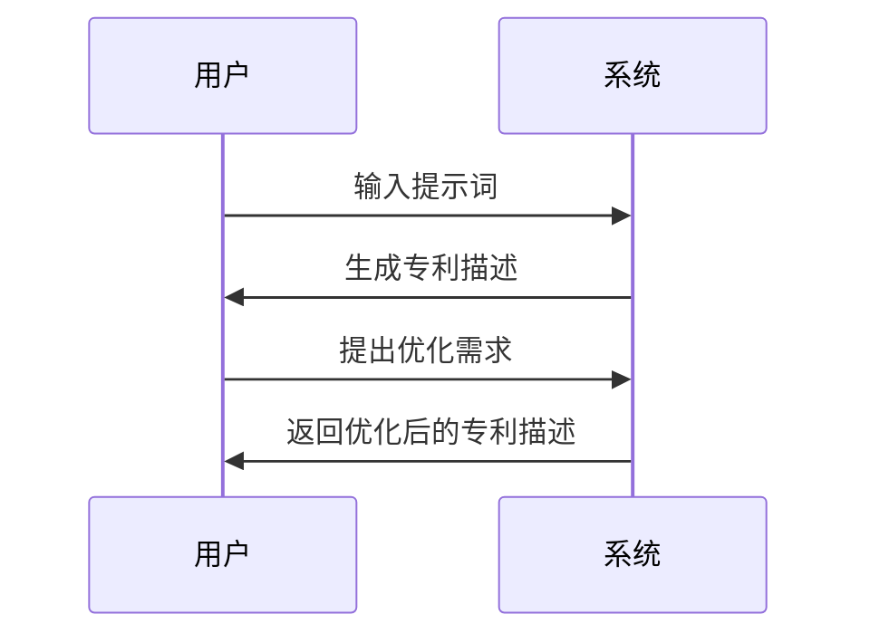

                 


## 提示词编程在自动化专利生成中的应用

### 关键词
- 提示词编程
- 自动化专利生成
- 自然语言处理
- 机器学习
- 算法实现

### 摘要
本文旨在探讨提示词编程在自动化专利生成中的应用。通过介绍提示词编程的基本原理、算法实现以及其在专利生成中的具体应用，文章将展示如何利用先进的人工智能技术来提高专利撰写的效率和质量。我们将分步骤详细分析这一技术的实现过程，并探讨其在未来技术发展和实际应用中的潜力。

### 引言

在当今快速发展的技术时代，专利作为创新成果的重要法律保障，其重要性日益凸显。然而，专利撰写的复杂性、繁琐性以及成本问题往往成为企业和发明人面临的难题。传统的专利撰写流程依赖于人工，不仅耗时且容易出现错误。为了解决这一问题，近年来，人工智能技术，特别是自然语言处理（NLP）和机器学习（ML），被引入到专利撰写的自动化过程中。

提示词编程作为一种结合了编程和自然语言处理的技术，通过为机器提供明确的指示来引导其生成目标内容，为自动化专利生成提供了强有力的支持。本文将详细探讨提示词编程在自动化专利生成中的应用，从基本原理到具体实现，全面剖析这一技术如何优化专利撰写的流程，提高专利申请的效率。

### 第1章 问题背景

#### 1.1 专利生成的现状与挑战

专利是技术创新的重要载体，对于保护发明人的智力成果、激励创新具有重要意义。然而，专利撰写的复杂性使得整个流程耗时且成本高昂。传统的专利撰写依赖于专利律师或专业的专利代理人，他们需要深入理解技术细节，熟悉专利法规，从而撰写出符合法律要求的专利文件。

然而，传统的专利撰写流程存在以下挑战：

1. **时间成本高**：专利撰写过程需要详细的技术调研、法律审查和反复修改，整个过程通常需要数月甚至更长时间。
2. **人力成本高**：专利撰写需要高度专业化的知识和经验，专利代理人或律师的收费往往较高。
3. **易出错**：专利撰写过程中，由于人类的主观判断和经验限制，容易出现错误，可能导致专利申请被驳回。

#### 1.2 提示词编程的概念

提示词编程（Prompt Programming）是一种通过提供提示词（Prompt）来指导模型生成目标内容的技术。在自然语言处理领域，提示词编程可以帮助模型更好地理解用户的意图，从而生成更加准确和相关的文本内容。例如，在一个问答系统中，提示词可以是一个问题，而模型需要根据这个问题生成一个回答。

提示词编程的核心在于：

1. **明确性**：提示词需要清晰明确，以便模型能够准确理解用户意图。
2. **引导性**：提示词不仅要明确，还需要具备引导性，指导模型朝着正确的方向生成内容。
3. **灵活性**：提示词需要具有一定的灵活性，以适应不同场景和需求。

#### 1.3 自动化专利生成的需求

自动化专利生成旨在通过人工智能技术，简化专利撰写的流程，提高专利申请的效率和质量。自动化专利生成的主要需求包括：

1. **提高效率**：自动化专利生成可以大幅缩短专利撰写的时间，从而提高专利申请的效率。
2. **降低成本**：通过减少人力和时间成本，自动化专利生成有助于降低专利撰写的总体成本。
3. **提升质量**：自动化专利生成可以利用人工智能技术对专利文本进行优化，提高专利撰写的质量。

#### 1.4 提示词编程的优势

提示词编程在自动化专利生成中具有显著的优势：

1. **提高创新能力**：通过明确和引导性的提示词，可以激发人工智能模型生成创新性的专利描述，从而提高专利的创新水平。
2. **简化撰写流程**：提示词编程可以简化专利撰写的流程，减少人工干预，从而降低撰写过程中的错误率。
3. **定制化**：提示词编程可以根据不同的专利需求，灵活定制提示词，从而实现专利撰写的个性化。

### 第2章 核心概念与理论基础

#### 2.1 提示词编程的基本原理

提示词编程的基本原理在于通过提供具体的提示词来引导模型生成目标内容。以下是提示词编程的基本组成部分：

1. **提示词**：提示词是用户输入的文本，用于指导模型生成内容。提示词可以是问题、任务描述或者任何需要生成的文本内容。
2. **模型**：模型是机器学习模型，通常是基于深度学习技术的预训练语言模型，如GPT-3、BERT等。
3. **生成器**：生成器是模型的一部分，负责根据提示词生成文本内容。生成器的核心是理解提示词的含义，并根据提示生成相关的文本。

提示词编程的工作流程如下：

1. **输入提示词**：用户输入需要生成的文本内容的提示词。
2. **模型处理**：模型接收提示词，并进行处理，理解提示词的含义。
3. **文本生成**：模型根据提示词生成目标文本内容。
4. **输出结果**：模型将生成的文本内容输出给用户。

#### 2.2 自动化专利生成的流程

自动化专利生成的流程可以分为以下几个阶段：

1. **数据收集与预处理**：首先，需要收集大量的专利文本数据，并进行预处理，如去除停用词、进行词干提取等。
2. **提示词生成与优化**：根据专利撰写的需求，生成适当的提示词，并对其进行优化，以确保模型能够准确理解用户意图。
3. **专利撰写**：使用提示词编程技术，指导模型生成专利描述文本。
4. **文本优化**：生成的专利文本可能需要进一步优化，以确保其准确性和法律符合性。

#### 2.3 相关技术介绍

自动化专利生成涉及多个前沿技术，包括自然语言处理（NLP）、机器学习（ML）等。

1. **自然语言处理（NLP）**：NLP是使计算机能够理解、解释和生成人类语言的技术。在自动化专利生成中，NLP技术被用于处理专利文本，提取关键信息，并生成专利描述。
2. **机器学习（ML）**：ML是一种通过数据学习模式，并做出预测或决策的技术。在自动化专利生成中，ML技术被用于训练模型，使其能够根据提示词生成专利文本。

### 第3章 算法原理与实现

#### 3.1 算法概述

自动化专利生成算法主要包括两个核心部分：提示词生成算法和专利撰写优化算法。

1. **提示词生成算法**：该算法的目标是根据专利撰写的需求，生成合适的提示词，以引导模型生成专利描述。
2. **专利撰写优化算法**：该算法的目标是对生成的专利描述文本进行优化，以确保其准确性和法律符合性。

#### 3.2 算法原理

1. **基于NLP的提示词生成算法**：
   - **文本预处理**：首先，对专利文本进行预处理，包括去除停用词、进行词干提取等。
   - **关键词提取**：然后，从预处理后的文本中提取关键词，这些关键词将用于生成提示词。
   - **提示词生成**：最后，根据提取的关键词，生成具体的提示词，例如“请生成一份关于人工智能在自动驾驶领域的专利描述”。

2. **基于ML的专利撰写优化算法**：
   - **文本生成**：首先，使用提示词编程技术，指导模型生成专利描述。
   - **文本优化**：然后，对生成的专利描述进行优化，包括语法修正、语义优化、法律合规性检查等。

#### 3.3 算法实现

1. **Python代码示例**：
   ```python
   # 示例：使用GPT-3生成专利描述
   from transformers import pipeline
   
   # 初始化GPT-3模型
   desc_generator = pipeline("text-generation", model="gpt3")
   
   # 输入提示词
   prompt = "请生成一份关于人工智能在自动驾驶领域的专利描述"
   
   # 生成专利描述
   desc = desc_generator(prompt, max_length=100, num_return_sequences=1)
   
   # 输出专利描述
   print(desc)
   ```

2. **Mermaid流程图**：
   ```mermaid
   graph TD
   A[文本预处理] --> B[关键词提取]
   B --> C[提示词生成]
   C --> D[专利撰写]
   D --> E[文本优化]
   ```

### 第4章 系统分析与架构设计

#### 4.1 系统概述

自动化专利生成系统旨在通过人工智能技术，简化专利撰写的流程，提高专利申请的效率和质量。系统的主要目标包括：

1. **提高专利撰写的效率**：通过自动化流程，大幅缩短专利撰写的时间。
2. **降低专利撰写的成本**：减少人力和时间成本，提高专利撰写的性价比。
3. **提升专利撰写的质量**：通过人工智能技术，优化专利描述，提高专利的法律符合性和创新性。

#### 4.2 系统架构设计

自动化专利生成系统的架构设计分为以下几个层次：

1. **数据层**：包括专利文本数据、关键词库等。
2. **模型层**：包括NLP模型、ML模型等。
3. **接口层**：提供用户接口，接受用户输入，返回专利描述。
4. **优化层**：对生成的专利描述进行优化，确保其准确性和法律符合性。

#### 4.3 系统接口设计

系统接口设计主要包括以下部分：

1. **用户界面**：用户可以通过图形界面输入提示词，查看生成的专利描述。
2. **API接口**：提供RESTful API接口，方便其他系统调用专利生成服务。

#### 4.4 系统交互分析

系统交互分析主要描述用户如何使用系统以及系统如何响应用户请求。以下是系统交互的Mermaid序列图：



### 第5章 项目实战与案例研究

#### 5.1 项目介绍

本项目旨在利用提示词编程技术，实现自动化专利生成的应用。项目分为以下几个阶段：

1. **数据收集与预处理**：收集大量专利文本，并进行预处理。
2. **模型训练与优化**：使用预处理后的数据训练NLP模型和ML模型。
3. **系统开发与测试**：开发自动化专利生成系统，并进行测试。
4. **用户反馈与优化**：收集用户反馈，对系统进行优化。

#### 5.2 系统核心实现

1. **环境安装与配置**：
   - 安装Python环境
   - 安装transformers库
   - 安装Mermaid库

2. **代码实现与分析**：
   - 代码实现：使用Python编写提示词编程和专利撰写的代码。
   - 代码分析：详细解释代码的功能和实现细节。

#### 5.3 项目案例分析

1. **实际案例分析**：
   - 选择一个实际案例，展示如何使用系统生成专利描述。

2. **效果评估与优化**：
   - 对生成的专利描述进行评估，分析其准确性和创新性。
   - 根据评估结果，提出优化建议，对系统进行改进。

### 第6章 最佳实践与拓展阅读

#### 6.1 最佳实践

1. **实践技巧总结**：
   - 总结在自动化专利生成中的一些最佳实践技巧。

2. **常见问题解答**：
   - 解答在自动化专利生成过程中可能遇到的一些常见问题。

#### 6.2 拓展阅读

1. **相关文献推荐**：
   - 推荐一些与自动化专利生成相关的文献。

2. **新技术展望**：
   - 展望未来自动化专利生成技术的发展趋势。

### 第7章 总结与未来展望

#### 7.1 总结

1. **主要成果回顾**：
   - 回顾自动化专利生成项目的主要成果。

2. **存在的问题与挑战**：
   - 分析自动化专利生成过程中存在的问题和挑战。

#### 7.2 未来展望

1. **技术发展趋势**：
   - 展望自动化专利生成技术的未来发展趋势。

2. **可能的应用场景**：
   - 探讨自动化专利生成技术可能在哪些领域得到应用。

