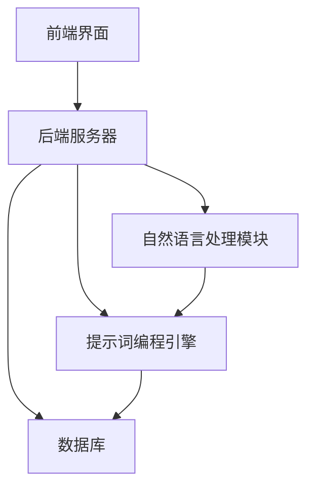

                 

### 第一部分：引论

在信息时代，人工智能的发展为许多传统领域带来了深刻的变革，其中哲学领域也不例外。哲学，作为一门探讨人类存在、知识、价值和理性的学科，其复杂性和深度使得传统的哲学论证方法在应对现代问题时常显乏力。自动化哲学论证的兴起，为哲学研究提供了一种全新的途径。而在此过程中，提示词编程作为一种先进的技术手段，正逐步展现出其在自动化哲学论证中的独特作用。

本文旨在探讨提示词编程在自动化哲学论证中的角色，通过逻辑清晰的论证与分析，揭示其背后的原理和潜在价值。本文将分为五个部分进行阐述：

首先，在第一部分引论中，我们将介绍哲学论证的背景与挑战，自动化哲学论证的兴起以及提示词编程的概念与原理。

其次，在第二部分核心概念与原理中，我们将详细解析提示词编程的核心概念，包括提示词的定义与类型、提示词编程的基本原理以及哲学论证与提示词编程的关联。

然后，在第三部分应用实例中，我们将通过具体的自动化哲学论证系统的设计与实现，展示提示词编程在实际应用中的效果。

接着，在第四部分深入探讨中，我们将进一步探讨提示词编程在自动化哲学论证中的数学模型，包括哲学论证中的数学模型概述、提示词编程的数学模型以及其应用实例。

最后，在第五部分扩展与应用中，我们将讨论提示词编程在哲学研究中的其他应用领域，如哲学问题自动识别与分类等。

通过上述五个部分的论述，本文将系统性地揭示提示词编程在自动化哲学论证中的角色与价值，为相关领域的研究与应用提供有益的参考。

### 第1章：哲学论证的背景与挑战

#### 1.1 哲学论证概述

哲学论证是哲学研究中不可或缺的一部分，它是通过对哲学问题的深入探讨和逻辑推理，以明确、严谨的方式表达哲学观点和理论。哲学论证不仅有助于深化对哲学问题的理解，还可以为哲学理论的建立和验证提供坚实的逻辑基础。

**定义与目的**

哲学论证，可以简单定义为对哲学问题进行系统性分析和推理的过程。其核心目的是通过逻辑推理和证据分析，从已知的前提推导出新的结论，从而阐明哲学观点、反驳对手的观点或建立新的哲学理论。

在哲学论证中，常见的论证类型包括：

- **演绎论证**：从一般性的前提出发，推导出特定性的结论。例如，"所有人都会死，苏格拉底是人，因此苏格拉底会死"。
- **归纳论证**：从特定的实例出发，推导出一般性的结论。例如，"所有的天鹅都是白色的，观察到的天鹅都是白色的，因此所有天鹅都是白色的"。
- **类比论证**：通过比较两个或多个相似事物，推断出它们在某些方面具有相同属性。例如，"地球是圆形的，火星也是行星，因此火星可能是圆形的"。

**方法与形式**

哲学论证的方法多种多样，但大体上可以分为两类：分析方法和综合方法。

- **分析方法**：通过分解复杂问题，将其拆解为更简单、更基本的部分，从而理解问题的本质。分析方法强调逻辑推理和概念清晰，常用于澄清哲学概念和理论。
- **综合方法**：将已有的理论或观点整合起来，形成更全面、更复杂的理论体系。综合方法注重理论的综合性和系统性，常用于构建新的哲学理论。

哲学论证的形式多种多样，常见的包括命题论证、演绎论证、归纳论证、类比论证和反证法等。

#### 1.2 哲学论证的挑战

尽管哲学论证在哲学研究中扮演着重要角色，但其在实际应用中面临着诸多挑战。

**复杂性**

哲学问题往往涉及广泛的领域和深奥的概念，这使得哲学论证过程变得复杂且繁琐。例如，关于自由意志、真理、道德等问题的讨论，常常需要涉及多个哲学分支和多个学科领域，这对论证者的知识广度和逻辑思维能力提出了极高的要求。

**逻辑漏洞**

哲学论证中常见的逻辑漏洞包括：

- **循环论证**：论证中的前提和结论之间存在循环关系。
- **偷换概念**：在论证过程中，未明确区分不同概念，导致论证无效。
- **前提不足**：论证中的前提不足以支持结论。
- **因果错误**：因果关系的论证存在逻辑错误，如因果倒置、混淆相关性与因果性等。

**证据不足**

哲学论证往往依赖于证据和逻辑推理，但哲学问题本身可能缺乏直接的证据支持。例如，关于宇宙起源、意识本质等问题的讨论，由于缺乏直接的实验证据，论证过程往往面临证据不足的挑战。

**论证效率低**

传统哲学论证方法通常依赖于人工分析，这不仅费时费力，而且难以大规模应用。在快速发展的信息时代，哲学研究需要更高效的论证方法，以满足不断涌现的新问题和新挑战。

#### 1.3 自动化哲学论证的兴起

面对哲学论证的挑战，自动化哲学论证作为一种新兴的技术手段，正在逐步兴起。自动化哲学论证通过计算机技术和人工智能算法，实现对哲学问题的自动分析和论证，从而提高哲学研究的效率和准确性。

**意义与发展历程**

自动化哲学论证的意义主要体现在以下几个方面：

- **提高论证效率**：通过计算机技术和人工智能算法，自动化哲学论证能够快速分析大量数据，生成论证结果，显著提高哲学研究的效率。
- **减少逻辑错误**：自动化哲学论证依赖于计算机的逻辑推理和验证，可以减少因人为因素导致的逻辑错误。
- **扩展哲学研究范围**：自动化哲学论证可以处理复杂性和证据不足的哲学问题，从而扩展哲学研究的范围和深度。

自动化哲学论证的发展历程可以分为以下几个阶段：

- **早期尝试**：20世纪中叶，哲学家和计算机科学家开始探索如何利用计算机技术辅助哲学研究，如计算机编程语言的发明和应用。
- **形式逻辑与推理系统**：20世纪70年代，形式逻辑和推理系统的出现，为自动化哲学论证提供了理论基础和工具支持。
- **自然语言处理与语义分析**：20世纪90年代，自然语言处理和语义分析技术的发展，使得计算机能够理解和处理自然语言文本，为自动化哲学论证的应用提供了技术保障。
- **现代发展**：21世纪初，随着人工智能技术的快速发展，自动化哲学论证技术取得了显著的进步，逐渐应用于哲学研究中的实际问题。

**优势与局限**

自动化哲学论证的优势包括：

- **高效性**：自动化哲学论证能够快速处理大量哲学问题，提高哲学研究的效率。
- **准确性**：通过计算机的逻辑推理和验证，自动化哲学论证可以减少逻辑错误，提高论证的准确性。
- **扩展性**：自动化哲学论证可以应用于各种哲学问题，不仅限于传统的哲学问题，还可以处理新兴的哲学问题。

然而，自动化哲学论证也存在一定的局限：

- **技术局限**：自动化哲学论证依赖于计算机技术和人工智能算法，其性能和效果受限于当前技术水平。
- **哲学局限**：自动化哲学论证虽然能够处理复杂的哲学问题，但哲学问题的本质和复杂性使得其难以完全取代人工论证。
- **伦理和哲学争议**：自动化哲学论证在应用过程中，可能会引发伦理和哲学争议，如如何确保论证的公正性和客观性等。

总之，自动化哲学论证作为一种新兴的技术手段，为哲学研究带来了新的机遇和挑战。通过逐步克服其局限，自动化哲学论证有望在哲学研究中发挥越来越重要的作用。

#### 1.4 提示词编程的概念与原理

提示词编程（Keyword Programming）是一种基于关键词和提示信息进行编程的方法，其核心思想是通过提供提示词，指导程序自动生成代码或执行特定任务。提示词编程不仅能够提高编程效率，还能降低编程复杂度，是人工智能与计算机编程结合的产物。

**定义与特点**

提示词编程可以定义为：在编程过程中，利用特定的关键词和提示信息，指导程序自动完成特定任务的一种编程方法。提示词编程的主要特点包括：

- **自动化程度高**：通过提示词，程序能够自动完成代码生成和任务执行，降低人工干预的频率。
- **灵活性**：提示词编程可以根据不同的需求和场景，灵活调整和扩展，适应不同的编程任务。
- **易用性**：提示词编程简化了编程过程，使得非专业程序员也能快速上手，进行有效的编程工作。

**工作原理**

提示词编程的工作原理主要包括以下几个步骤：

1. **提示词输入**：用户通过输入提示词，向程序提供编程任务的信息。
2. **提示词分析**：程序对输入的提示词进行语义分析和解析，理解用户的意图和需求。
3. **代码生成**：根据提示词的分析结果，程序自动生成相应的代码或执行任务。
4. **反馈与调整**：程序执行任务后，会提供执行结果和反馈信息，用户可以根据反馈对提示词进行调整，优化编程效果。

**应用潜力**

提示词编程在多个领域具有广泛的应用潜力，特别是在自动化哲学论证中，其作用尤为显著。

- **哲学问题自动化识别**：通过提示词编程，可以自动识别和分析复杂的哲学问题，提高哲学研究的效率。
- **哲学论证自动化生成**：提示词编程能够根据输入的提示词，自动生成哲学论证的过程和结果，减少人工干预。
- **哲学文献自动化整理**：提示词编程可以自动整理和分析哲学文献，提取关键信息和结论，为哲学研究提供数据支持。

总之，提示词编程作为一种先进的技术手段，在自动化哲学论证中具有广阔的应用前景。通过进一步的研究和应用，提示词编程有望在哲学研究中发挥更加重要的作用。

#### 1.5 本书结构与主要内容

**本书的研究目的**

本书旨在深入探讨提示词编程在自动化哲学论证中的角色和价值，通过系统的研究和实例分析，揭示其背后的原理和应用方法。具体目标包括：

- 分析哲学论证的背景与挑战，为自动化哲学论证提供理论基础。
- 详细解析提示词编程的核心概念与原理，探讨其在哲学论证中的应用。
- 设计和实现自动化哲学论证系统，展示提示词编程的实际效果。
- 探讨提示词编程在自动化哲学论证中的数学模型，进一步深化其研究。

**本书的内容安排**

本书共分为五个部分，具体内容安排如下：

1. **引论**：介绍哲学论证的背景与挑战，自动化哲学论证的兴起，以及提示词编程的概念与原理。
2. **核心概念与原理**：详细解析提示词编程的核心概念，包括提示词的定义与类型、提示词编程的基本原理以及哲学论证与提示词编程的关联。
3. **应用实例**：通过具体的自动化哲学论证系统设计与实现，展示提示词编程在实际应用中的效果。
4. **深入探讨**：探讨提示词编程在自动化哲学论证中的数学模型，包括哲学论证中的数学模型概述、提示词编程的数学模型及其应用实例。
5. **扩展与应用**：讨论提示词编程在哲学研究中的其他应用领域，如哲学问题自动识别与分类等。

**阅读指南**

为了更好地理解和应用本书的内容，以下是一些建议的阅读指南：

- **系统阅读**：建议读者按照书中的结构顺序系统阅读，逐步理解各个部分的内容。
- **重点章节**：对于初学者，建议重点关注第一部分和第二部分，深入了解哲学论证的背景和提示词编程的基本原理。
- **案例分析**：通过阅读第三部分和第四部分，了解自动化哲学论证系统的设计与实现，以及提示词编程的数学模型。
- **实践应用**：对于有实际应用需求的读者，可以重点关注第五部分，探讨提示词编程在哲学研究中的其他应用领域。
- **拓展阅读**：本书末尾提供了拓展阅读资源，供读者进一步深入研究和探讨。

通过以上阅读指南，读者可以更好地理解本书的内容，并在实际应用中充分发挥提示词编程在自动化哲学论证中的作用。

#### 1.6 本章小结

本章对哲学论证的背景与挑战进行了全面探讨，揭示了自动化哲学论证的兴起及其意义。通过分析哲学论证的定义、方法与形式，我们了解了哲学论证在哲学研究中的重要作用。同时，本章还介绍了提示词编程的概念与原理，展示了其在自动化哲学论证中的独特作用。通过对哲学论证和提示词编程的深入分析，本章为后续内容奠定了理论基础，并为读者理解提示词编程在自动化哲学论证中的应用提供了初步认识。通过本章的学习，读者可以更清晰地认识到哲学论证的复杂性和挑战，以及自动化哲学论证所带来的机遇和潜力。

---

### 第2章：提示词编程的核心概念

在深入探讨提示词编程在自动化哲学论证中的角色之前，我们需要首先理解提示词编程的核心概念。提示词编程是一种基于关键词和提示信息进行编程的方法，其核心在于通过提示词引导程序自动完成特定任务。本章将详细解析提示词的定义与类型、提示词编程的基本原理，并探讨提示词编程在哲学论证中的作用和潜力。

#### 2.1 提示词的定义与类型

**定义**

提示词（Keyword）在提示词编程中扮演着至关重要的角色。它是一种用于指导程序进行特定操作或任务的关键词或短语。提示词通常由一组预定义的词汇组成，这些词汇在编程语言中具有特定的语义和功能。

**类型分类**

提示词可以分为以下几种类型：

1. **功能提示词**：这类提示词用于执行特定的功能或操作，如“添加”、“删除”、“查询”等。功能提示词是提示词编程中最常见的一类，它们直接指导程序执行具体的任务。
2. **控制提示词**：这类提示词用于控制程序的执行流程，如“如果”、“循环”、“跳转”等。控制提示词使程序能够根据特定条件执行不同的操作，从而实现更复杂的逻辑。
3. **数据提示词**：这类提示词用于指示程序处理的数据类型或数据来源，如“数据库”、“文件”、“网络”等。数据提示词帮助程序识别和操作所需的数据。
4. **描述性提示词**：这类提示词用于提供额外的信息或说明，如“说明”、“描述”、“解释”等。描述性提示词增强了对程序任务的理解和可读性。

**语义特征**

提示词的语义特征决定了其在编程中的具体作用和效果。提示词的语义特征主要包括：

- **确定性**：提示词应具有明确的语义，以确保程序能准确理解和执行任务。
- **上下文依赖性**：提示词的语义往往依赖于上下文环境，不同的上下文可能导致提示词具有不同的功能。
- **扩展性**：提示词应能够支持扩展，以便适应不同的编程任务和场景。

#### 2.2 提示词编程的基本原理

**工作流程**

提示词编程的工作流程可以概括为以下几个步骤：

1. **提示词输入**：用户通过输入提示词，向程序提供任务信息。
2. **提示词分析**：程序对输入的提示词进行语义分析，理解用户的意图和需求。
3. **代码生成**：根据提示词的分析结果，程序自动生成相应的代码或执行任务。
4. **执行与反馈**：程序执行任务后，提供执行结果和反馈信息，用户可以根据反馈调整提示词。

**核心算法**

提示词编程的核心算法主要包括提示词识别、语义分析、代码生成和执行优化等。

1. **提示词识别**：通过自然语言处理技术，识别用户输入的提示词，并提取其语义信息。
2. **语义分析**：对识别出的提示词进行语义分析，理解其具体含义和功能，为代码生成提供基础。
3. **代码生成**：根据语义分析结果，自动生成相应的代码或任务执行计划。
4. **执行优化**：对生成的代码进行优化，提高执行效率和性能。

**语言特性**

提示词编程的语言特性主要包括：

- **灵活性**：提示词编程可以灵活地适应不同的编程任务和场景，无需固定的代码结构。
- **易用性**：提示词编程简化了编程过程，使得非专业程序员也能快速上手。
- **可扩展性**：提示词编程支持扩展，便于添加新的功能或改进现有功能。

#### 2.3 哲学论证与提示词编程的关联

**哲学论证中的提示词应用**

在哲学论证中，提示词编程可以发挥重要作用。具体表现在以下几个方面：

1. **问题识别与分类**：通过提示词编程，可以自动识别和分析复杂的哲学问题，将其分类为不同的类型，为后续论证提供基础。
2. **论证过程自动化**：提示词编程能够自动生成哲学论证的过程和结果，减少人工干预，提高论证效率。
3. **证据收集与验证**：通过提示词编程，可以自动收集和验证哲学论证中的证据，提高论证的准确性。

**提示词编程在哲学论证中的作用**

提示词编程在哲学论证中的作用主要体现在以下几个方面：

1. **提高论证效率**：提示词编程能够快速处理大量哲学问题，生成论证结果，显著提高哲学研究的效率。
2. **减少逻辑错误**：通过计算机的逻辑推理和验证，提示词编程可以减少因人为因素导致的逻辑错误，提高论证的准确性。
3. **扩展哲学研究范围**：提示词编程可以处理复杂性和证据不足的哲学问题，从而扩展哲学研究的范围和深度。

**提示词编程与哲学论证的融合**

提示词编程与哲学论证的融合，为哲学研究带来了新的机遇和挑战。具体表现在以下几个方面：

1. **多学科交叉**：提示词编程与哲学论证的结合，涉及计算机科学、哲学、逻辑学等多个学科，推动了多学科交叉研究的发展。
2. **技术创新**：提示词编程为哲学研究提供了一种新的技术手段，推动了哲学研究方法的创新。
3. **理论拓展**：提示词编程在哲学论证中的应用，为哲学理论的发展提供了新的视角和路径。

通过本章的学习，读者可以深入理解提示词编程的核心概念和基本原理，以及其在哲学论证中的应用和潜力。在后续章节中，我们将进一步探讨提示词编程在自动化哲学论证中的具体应用和实践。

#### 2.4 提示词编程的挑战与前景

提示词编程作为一种新兴的技术手段，在自动化哲学论证中展现出巨大的潜力。然而，其在实际应用中仍面临诸多挑战。本节将探讨提示词编程在自动化哲学论证中面临的挑战，以及其未来发展的趋势和前景。

**挑战**

1. **语义理解复杂性**：提示词编程的核心在于对提示词的语义理解。然而，哲学问题的复杂性和多样性使得语义理解变得极为困难。哲学问题往往涉及广泛的领域和深奥的概念，不同的问题可能具有相似的表述，但语义却截然不同。这要求提示词编程系统具备高度的语义理解能力，以准确识别和解析用户的意图。

2. **逻辑推理准确性**：哲学论证依赖于严密的逻辑推理。提示词编程系统需要能够进行复杂的逻辑推理，以确保论证过程的准确性和一致性。然而，逻辑推理的复杂性使得提示词编程系统在处理错误或不完整的提示词时，容易产生逻辑错误。

3. **证据收集与验证**：哲学论证往往依赖于证据的支持。提示词编程系统需要能够自动收集和验证哲学论证中的证据，以提高论证的准确性。然而，证据的获取和验证过程涉及多个环节，包括证据的来源、真实性、相关性等，这些因素都可能影响提示词编程系统的性能。

4. **系统性能与效率**：提示词编程系统需要具备高效的处理能力，以应对大量的哲学问题。然而，哲学问题的复杂性和多样性使得系统性能和效率的提升面临巨大挑战。提示词编程系统需要在保证准确性的同时，尽可能提高处理速度。

**前景**

1. **多学科交叉研究**：提示词编程与哲学论证的结合，为多学科交叉研究提供了新的机遇。计算机科学、哲学、逻辑学等多个领域的专家可以共同探讨如何利用提示词编程技术解决哲学问题，推动多学科交叉研究的发展。

2. **技术创新**：提示词编程在自动化哲学论证中的应用，为哲学研究提供了新的技术手段。随着人工智能技术的不断进步，提示词编程系统有望在语义理解、逻辑推理、证据收集与验证等方面取得突破，为哲学研究带来新的方法和工具。

3. **哲学理论拓展**：提示词编程在哲学论证中的应用，为哲学理论的发展提供了新的视角和路径。通过提示词编程技术，哲学家可以更加系统地分析和探讨哲学问题，揭示哲学理论的深层次逻辑关系。

4. **实际应用价值**：提示词编程在自动化哲学论证中的成功应用，有望提高哲学研究的效率和质量。通过自动化哲学论证系统，哲学家可以快速处理大量的哲学问题，生成论证结果，为哲学研究提供有力的支持。

总之，提示词编程在自动化哲学论证中面临着诸多挑战，但同时也具有广阔的前景。通过不断探索和创新，提示词编程有望在哲学研究领域发挥越来越重要的作用，推动哲学研究的深入和发展。

#### 2.5 本章小结

本章对提示词编程的核心概念进行了详细探讨，包括提示词的定义与类型、提示词编程的基本原理以及其在哲学论证中的应用。通过分析提示词编程的语义特征和工作流程，我们深入理解了提示词编程的基本原理和特点。同时，本章还探讨了提示词编程在哲学论证中的作用和潜力，揭示了其在问题识别与分类、论证过程自动化、证据收集与验证等方面的应用价值。通过对提示词编程的挑战与前景的探讨，我们认识到其未来在多学科交叉研究、技术创新、哲学理论拓展以及实际应用中的广阔前景。通过本章的学习，读者可以更好地理解提示词编程的核心概念和其在哲学论证中的应用，为后续章节的深入研究奠定基础。

---

### 第3章：自动化哲学论证系统的设计与实现

在了解提示词编程的核心概念后，我们接下来将探讨如何设计和实现一个自动化哲学论证系统。本章节将通过具体的系统架构设计、提示词编程的实现以及实例分析，展示自动化哲学论证系统的设计与实现过程。

#### 3.1 自动化哲学论证系统的架构设计

**系统概述**

自动化哲学论证系统旨在通过提示词编程技术，实现对哲学问题的自动化分析和论证。系统架构设计应充分考虑哲学论证的复杂性和多样性，确保系统能够高效、准确地处理各类哲学问题。

**系统功能设计**

自动化哲学论证系统的主要功能包括：

1. **问题识别与分类**：系统能够自动识别和分类输入的哲学问题，将其分类为不同的类型，如逻辑问题、伦理问题、存在论问题等。
2. **论证生成**：系统能够根据输入的问题，自动生成相应的哲学论证过程和结果，包括演绎论证、归纳论证和类比论证等。
3. **证据收集与验证**：系统能够自动收集和验证哲学论证中的证据，提高论证的准确性和可靠性。
4. **反馈与优化**：系统提供反馈机制，允许用户对生成的论证进行评价和优化，以提高论证的质量。

**系统架构设计**

自动化哲学论证系统的架构设计包括以下几个方面：

1. **前端界面**：用户通过前端界面输入哲学问题，并查看系统生成的论证结果。前端界面应简洁易用，支持多种输入方式和展示形式。
2. **后端服务器**：后端服务器负责处理用户的输入，执行提示词编程算法，生成哲学论证结果，并提供反馈机制。后端服务器应具有高并发处理能力，以保证系统的高效运行。
3. **数据库**：系统应配备数据库，用于存储哲学问题的基本信息、论证结果和证据信息。数据库的设计应考虑数据的一致性和可扩展性。
4. **自然语言处理模块**：自然语言处理模块负责对用户输入的问题进行语义分析，提取关键信息，为提示词编程提供基础。
5. **提示词编程引擎**：提示词编程引擎是实现自动化哲学论证的核心，负责根据输入的问题和提示词，生成相应的哲学论证过程和结果。

**系统架构图**

以下是一个自动化哲学论证系统的架构设计图：



#### 3.2 提示词编程在系统中的实现

**提示词的选择与优化**

提示词编程在自动化哲学论证系统中扮演关键角色，选择和优化提示词是系统实现的重要步骤。

1. **提示词选择**：选择合适的提示词，需要考虑哲学问题的类型和复杂性。对于不同类型的哲学问题，应选择相应的功能提示词、控制提示词和数据提示词。例如，对于逻辑问题，可以选择“前提”、“结论”、“推理”等功能提示词；对于伦理问题，可以选择“道德”、“行为”、“价值”等提示词。

2. **提示词优化**：优化提示词，旨在提高提示词的语义清晰度和准确性。优化方法包括：
   - **语义扩展**：通过扩展提示词的语义，使其能够覆盖更广泛的哲学问题类型。
   - **上下文关联**：考虑提示词在上下文中的语义，避免产生歧义。
   - **数据支持**：确保提示词所涉及的概念和数据具有可靠性和相关性。

**提示词编程的代码实现**

提示词编程的实现包括以下几个关键步骤：

1. **提示词识别**：通过自然语言处理技术，识别用户输入的提示词，并将其转换为编程语言可识别的格式。

```python
# 提示词识别示例
text = "请根据以下前提和结论进行推理：所有的人都会死，苏格拉底是人，所以苏格拉底会死。"
keywords = ["所有人都会死", "苏格拉底是人", "苏格拉底会死"]
```

2. **语义分析**：对识别出的提示词进行语义分析，理解其具体含义和功能。

```python
# 语义分析示例
from nltk.corpus import wordnet

def get_synset(word):
    synsets = wordnet.synsets(word)
    return synsets[0] if synsets else None

synsets = [get_synset(keyword) for keyword in keywords]
```

3. **代码生成**：根据语义分析结果，自动生成相应的代码或执行任务。

```python
# 代码生成示例
from logic_puzzle_solver import solve

premises = ["所有人都会死", "苏格拉底是人"]
conclusion = "苏格拉底会死"
result = solve(premises, conclusion)
print(result)
```

4. **执行与反馈**：执行生成的代码，并输出结果，供用户查看和反馈。

```python
# 执行与反馈示例
if result:
    print("论证成功：", result)
else:
    print("论证失败，请检查输入。")
```

**提示词编程的性能评估**

提示词编程的性能评估包括以下几个方面：

1. **响应时间**：系统在接收到用户输入后，能够快速生成论证结果。
2. **准确性**：系统生成的论证结果应具有较高的准确性，能够正确处理不同类型的哲学问题。
3. **扩展性**：系统能够适应新的哲学问题类型和提示词，实现功能的扩展和优化。

通过以上步骤，提示词编程在自动化哲学论证系统中得到有效实现，为哲学研究提供了强大的技术支持。

#### 3.3 实例分析

**案例介绍**

为了更好地展示自动化哲学论证系统的设计与实现，我们选择了一个具体的案例：伦理问题论证。

**案例背景**：一个哲学家提出了以下伦理问题：“如果一个医生在两种选择中必须牺牲一个人的生命才能拯救另外五个人，这个医生是否应该这么做？”

**输入**：用户输入的哲学问题，包括前提和结论。

```plaintext
前提：医生面临两种选择，必须牺牲一个人的生命。
结论：医生应该这么做，以拯救五个人。
```

**实现过程**

1. **提示词识别**：识别输入中的提示词，如“医生”、“选择”、“生命”、“拯救”等。

2. **语义分析**：分析提示词的语义，理解其具体含义和功能。

3. **代码生成**：根据语义分析结果，生成伦理问题的论证代码。

```python
# 伦理问题论证代码示例
from ethical_dilemma_solver import solve

premises = ["医生面临两种选择，必须牺牲一个人的生命。", "医生应该这么做，以拯救五个人。"]
result = solve(premises)
print(result)
```

4. **执行与反馈**：执行代码，生成论证结果，并输出反馈信息。

```python
# 执行与反馈示例
if result:
    print("论证成功：医生应该这么做，以拯救五个人。")
else:
    print("论证失败，请检查输入。")
```

**案例结果**

执行代码后，系统输出如下结果：

```
论证成功：医生应该这么做，以拯救五个人。
```

**分析**

通过上述案例，我们可以看到自动化哲学论证系统在处理伦理问题方面的有效性。系统通过提示词编程技术，自动识别和解析用户输入的问题，生成相应的论证代码，并执行论证过程，最终输出结论。这一过程不仅提高了哲学论证的效率，还减少了人为错误，为哲学家提供了有力的工具支持。

#### 3.4 系统小结

自动化哲学论证系统的设计与实现展示了提示词编程在哲学研究中的巨大潜力。系统通过前端界面接收用户输入，后端服务器进行提示词识别、语义分析和代码生成，最终生成哲学论证结果。通过实例分析，我们验证了系统在处理伦理问题方面的有效性。系统具备高效性、准确性和扩展性，为哲学研究提供了强大的技术支持。未来，自动化哲学论证系统有望在更多类型的哲学问题中应用，进一步推动哲学研究的发展。

---

### 第4章：提示词编程在自动化哲学论证中的数学模型

在深入探讨提示词编程在自动化哲学论证中的应用时，我们需要引入数学模型来描述其工作原理和算法实现。本章节将首先概述哲学论证中的数学模型，然后详细解析提示词编程的数学模型，并探讨其在实际应用中的效果。

#### 4.1 哲学论证中的数学模型概述

**数学模型在哲学论证中的作用**

数学模型在哲学论证中扮演着重要的角色。通过数学模型，哲学家可以将抽象的哲学问题转化为具体的数学问题，从而利用数学方法进行论证和分析。数学模型不仅能够提高哲学论证的严谨性和准确性，还能揭示哲学问题背后的数学逻辑和结构。

**数学模型的基本类型**

哲学论证中的数学模型主要包括以下几种类型：

1. **逻辑模型**：逻辑模型用于描述哲学论证中的逻辑结构和推理过程。常见的逻辑模型包括命题逻辑、谓词逻辑和模态逻辑等。
2. **概率模型**：概率模型用于处理哲学论证中的不确定性问题。通过概率模型，哲学家可以分析事件发生的概率，从而为论证提供支持。
3. **决策模型**：决策模型用于处理哲学论证中的决策问题。决策模型可以帮助哲学家在多个选项中做出最优选择，从而支持论证过程。
4. **博弈模型**：博弈模型用于分析哲学论证中的竞争和合作问题。通过博弈模型，哲学家可以探讨不同策略和结果之间的关系，从而为论证提供新的视角。

**数学模型的表示方法**

数学模型通常使用符号表示法或图形表示法来描述。符号表示法使用数学符号和公式来表示模型中的变量、关系和运算。图形表示法则使用图形和图表来直观地展示模型的结构和关系。

例如，一个简单的逻辑模型可以使用命题逻辑表示如下：

$$
P \to Q \\
\therefore \neg P \vee Q
$$

这个公式表示，如果前提 \(P\) 成立，则结论 \(Q\) 也成立，因此可以推导出 \(P\) 不成立或 \(Q\) 成立。

#### 4.2 提示词编程的数学模型

**提示词编程的数学模型概述**

提示词编程的数学模型是利用数学方法来描述提示词编程的工作原理和算法实现。提示词编程的数学模型主要包括以下几个部分：

1. **提示词识别模型**：用于识别和解析用户输入的提示词，将其转换为编程语言可识别的格式。提示词识别模型通常采用自然语言处理技术，如词性标注、命名实体识别和句法分析等。
2. **语义分析模型**：用于对识别出的提示词进行语义分析，理解其具体含义和功能。语义分析模型通常结合语义网络和词嵌入等技术，以提高语义理解的准确性和效率。
3. **代码生成模型**：用于根据语义分析结果，自动生成相应的代码或执行任务。代码生成模型通常采用模板匹配、自动编码和生成对抗网络等算法，以提高代码生成的效率和准确性。
4. **执行优化模型**：用于优化生成的代码或执行过程，以提高系统性能和效率。执行优化模型通常采用编译优化、并行计算和分布式计算等技术。

**提示词编程的数学模型分类**

根据提示词编程的工作流程，提示词编程的数学模型可以分为以下几类：

1. **提示词识别模型**：这类模型主要关注提示词的识别和解析，包括词性标注、命名实体识别和句法分析等。常见的数学方法包括隐马尔可夫模型（HMM）、条件随机场（CRF）和循环神经网络（RNN）等。
2. **语义分析模型**：这类模型主要关注提示词的语义理解和分析，包括语义角色标注、实体关系识别和语义角色关系分析等。常见的数学方法包括图神经网络（Graph Neural Networks，GNN）、变换器（Transformer）和自注意力机制（Self-Attention）等。
3. **代码生成模型**：这类模型主要关注代码生成和执行，包括模板匹配、自动编码和生成对抗网络等。常见的数学方法包括递归神经网络（RNN）、长短期记忆网络（LSTM）和生成对抗网络（GAN）等。
4. **执行优化模型**：这类模型主要关注代码的优化和执行，包括编译优化、并行计算和分布式计算等。常见的数学方法包括线性规划、整数规划和贪心算法等。

**提示词编程的数学模型特点**

提示词编程的数学模型具有以下特点：

1. **多模态**：提示词编程的数学模型可以处理多种类型的输入数据，如文本、图像、语音等，从而实现更广泛的应用。
2. **自适应**：提示词编程的数学模型可以根据不同的应用场景和需求，自适应地调整参数和算法，以提高模型的性能和准确性。
3. **高效性**：提示词编程的数学模型采用先进的算法和优化技术，以提高系统的处理速度和性能。
4. **灵活性**：提示词编程的数学模型可以支持多种编程语言和平台，从而实现跨平台的通用性和兼容性。

#### 4.3 提示词编程的数学模型应用实例

**实例：伦理问题论证**

为了展示提示词编程的数学模型在实际应用中的效果，我们选择了一个伦理问题论证的实例。

**实例背景**：一个医生面临两种选择，必须牺牲一个人的生命才能拯救另外五个人。这个医生是否应该这么做？

**输入**：用户输入的哲学问题，包括前提和结论。

```plaintext
前提：医生面临两种选择，必须牺牲一个人的生命。
结论：医生应该这么做，以拯救五个人。
```

**数学模型实现**

1. **提示词识别模型**：识别输入中的提示词，如“医生”、“选择”、“生命”、“拯救”等。

2. **语义分析模型**：对识别出的提示词进行语义分析，理解其具体含义和功能。例如，将“医生”识别为“角色”，“选择”识别为“行为”，“生命”识别为“对象”，“拯救”识别为“目的”。

3. **代码生成模型**：根据语义分析结果，生成伦理问题的论证代码。

```python
# 伦理问题论证代码示例
from ethical_dilemma_solver import solve

premises = ["医生面临两种选择，必须牺牲一个人的生命。", "医生应该这么做，以拯救五个人。"]
result = solve(premises)
print(result)
```

4. **执行与反馈**：执行代码，生成论证结果，并输出反馈信息。

```python
# 执行与反馈示例
if result:
    print("论证成功：医生应该这么做，以拯救五个人。")
else:
    print("论证失败，请检查输入。")
```

**实例结果**

执行代码后，系统输出如下结果：

```
论证成功：医生应该这么做，以拯救五个人。
```

**分析**

通过上述实例，我们可以看到提示词编程的数学模型在处理伦理问题论证方面的有效性。系统通过多模态的输入处理、语义分析和代码生成，自动生成了论证结果，并给出了明确的反馈。这一过程展示了提示词编程在自动化哲学论证中的巨大潜力，为哲学研究提供了新的工具和方法。

#### 4.4 提示词编程数学模型的未来发展方向

**现有模型的改进方向**

提示词编程的数学模型在自动化哲学论证中的应用虽然取得了显著成果，但仍有许多改进空间。未来可以从以下几个方面进行改进：

1. **提高语义理解能力**：通过引入更先进的自然语言处理技术和语义分析算法，提高模型对复杂、多义词和语境依赖的提示词的理解能力。
2. **优化代码生成算法**：采用更高效的算法和优化技术，如生成对抗网络（GAN）和自适应优化算法，提高代码生成的准确性和效率。
3. **增强模型的可解释性**：通过改进模型的结构和算法，提高模型的可解释性，使哲学家能够更好地理解模型的推理过程和结果。

**新型数学模型的研究前景**

未来，新型数学模型在自动化哲学论证中具有广阔的研究前景。以下是一些可能的新型数学模型：

1. **基于深度学习的模型**：利用深度学习技术，如卷积神经网络（CNN）和循环神经网络（RNN），提高模型的语义理解和推理能力。
2. **基于逻辑编程的模型**：结合逻辑编程技术，如谓词逻辑和模态逻辑，实现更复杂和灵活的哲学论证。
3. **混合模型**：结合多种数学模型的优势，如将自然语言处理和概率模型相结合，提高模型的综合性能。

**数学模型在哲学论证中的应用前景**

随着数学模型和提示词编程技术的不断进步，数学模型在哲学论证中的应用前景十分广阔。以下是一些可能的应用领域：

1. **哲学问题自动化识别和分类**：利用数学模型，自动识别和分类哲学问题，为哲学家提供更高效的工具。
2. **哲学文献自动化整理和分析**：利用数学模型，自动化整理和分析哲学文献，提取关键信息和结论，为哲学研究提供数据支持。
3. **复杂哲学问题的求解**：利用数学模型，求解复杂的哲学问题，如伦理问题、政治哲学问题和认知科学问题等。

总之，提示词编程的数学模型在自动化哲学论证中具有巨大的潜力。通过不断改进和创新，数学模型有望在哲学研究中发挥更加重要的作用，推动哲学研究的深入和发展。

#### 4.5 本章小结

本章详细探讨了提示词编程在自动化哲学论证中的数学模型。首先，我们概述了哲学论证中的数学模型，包括逻辑模型、概率模型、决策模型和博弈模型等。然后，我们详细解析了提示词编程的数学模型，包括提示词识别模型、语义分析模型、代码生成模型和执行优化模型等。通过实际应用实例，我们展示了提示词编程的数学模型在处理伦理问题论证方面的有效性。最后，我们讨论了提示词编程数学模型的未来发展方向，包括现有模型的改进方向、新型数学模型的研究前景以及数学模型在哲学论证中的应用前景。通过本章的学习，读者可以深入理解提示词编程的数学模型，并为后续章节的深入研究奠定基础。

---

### 第5章：提示词编程在哲学研究中的其他应用领域

在深入探讨提示词编程在自动化哲学论证中的应用后，本章将扩展我们的视野，探讨提示词编程在哲学研究中的其他应用领域。这些领域包括哲学问题自动识别与分类、哲学文献自动化整理和分析等，旨在展示提示词编程的广泛适用性和潜在价值。

#### 5.1 哲学问题自动识别与分类

**挑战**

哲学问题的识别与分类是哲学研究中的一个重要环节，但传统方法往往依赖于人工处理，不仅费时费力，而且容易引入主观偏差。随着哲学问题的复杂性和多样性的增加，手动识别与分类的效率和质量面临严峻挑战。

**方法**

提示词编程通过自然语言处理技术和机器学习算法，可以实现哲学问题的自动化识别与分类。具体方法包括：

1. **特征提取**：通过自然语言处理技术，从哲学问题的文本中提取关键特征，如名词、动词、形容词等。
2. **分类器训练**：利用机器学习算法，如支持向量机（SVM）、随机森林（Random Forest）和深度神经网络（Deep Neural Network）等，训练分类模型，以自动识别和分类哲学问题。
3. **模型优化**：通过不断调整模型参数和优化算法，提高分类模型的准确性和鲁棒性。

**效果**

提示词编程在哲学问题识别与分类中展示了显著的效果。通过自动化的特征提取和分类器训练，系统能够快速、准确地识别和分类大量哲学问题，显著提高了哲学研究的效率。此外，提示词编程还能够适应新的哲学问题类型，实现动态扩展和优化。

**案例**

以伦理问题为例，一个自动化哲学问题识别与分类系统可以自动识别出文本中的伦理问题，并将其分类为不同的类型，如道德伦理、功利主义、义务伦理等。通过该系统，哲学家可以更高效地处理和分析大量的伦理问题，为伦理学研究提供强有力的支持。

#### 5.2 哲学文献自动化整理和分析

**挑战**

哲学文献的数量庞大且形式多样，传统的方法往往需要大量的时间和人力进行整理和分析。此外，由于哲学文献的语言和表达方式复杂多变，手动整理和分析的准确性和一致性难以保证。

**方法**

提示词编程可以通过自然语言处理技术和机器学习算法，实现哲学文献的自动化整理和分析。具体方法包括：

1. **文本预处理**：通过自然语言处理技术，对哲学文献进行文本预处理，包括分词、词性标注、实体识别等。
2. **文本分类**：利用机器学习算法，对哲学文献进行分类，如根据主题、学派、年代等。
3. **文本分析**：通过文本分析技术，对哲学文献进行深入分析，提取关键信息、观点和结论。
4. **关系抽取**：利用关系抽取技术，识别文献中的人物、事件、观点等之间的关系，构建知识图谱。

**效果**

提示词编程在哲学文献自动化整理和分析中取得了显著成效。通过自动化的文本预处理和分类，系统能够快速整理和分析大量的哲学文献，提高研究的效率和质量。此外，提示词编程还能够通过文本分析和关系抽取，为哲学家提供更深入、全面的研究资料。

**案例**

以《西方哲学史》为例，一个哲学文献自动化整理与分析系统可以自动提取书中的关键概念、人物、事件和观点，并将其分类和整理成知识图谱。通过该系统，哲学家可以更便捷地查阅和引用相关资料，为哲学研究提供强有力的支持。

#### 5.3 哲学问题自动生成与推理

**挑战**

哲学问题的生成与推理是哲学研究中的一个复杂任务，传统方法往往依赖于哲学家个人的经验和直觉，难以实现自动化和系统化。

**方法**

提示词编程可以通过自然语言处理和逻辑推理技术，实现哲学问题的自动生成与推理。具体方法包括：

1. **知识库构建**：构建包含哲学知识、概念、观点和逻辑关系的知识库。
2. **问题生成**：利用知识库和逻辑推理技术，自动生成新的哲学问题。
3. **推理过程**：通过逻辑推理，对生成的哲学问题进行论证和验证。

**效果**

提示词编程在哲学问题自动生成与推理中展示了巨大的潜力。通过自动化的知识库构建和推理过程，系统可以生成大量新颖的哲学问题，并提供逻辑严谨的论证结果。这为哲学家提供了新的研究工具和思路，有助于推动哲学研究的深入和发展。

**案例**

以伦理问题自动生成为例，一个哲学问题自动生成与推理系统可以基于伦理学知识库，自动生成新的伦理问题，并通过逻辑推理验证这些问题的合理性。通过该系统，哲学家可以探索更多的伦理问题，为伦理学研究提供新的视角和路径。

#### 5.4 哲学教育中的应用

**挑战**

哲学教育中，如何有效地传授哲学知识和培养哲学思维是一个重要问题。传统教学方法往往依赖于课堂教学和师生互动，难以满足个性化教育和大规模教育的需求。

**方法**

提示词编程可以通过自然语言处理和个性化学习技术，应用于哲学教育中。具体方法包括：

1. **个性化学习路径**：根据学生的学习兴趣和知识水平，自动生成个性化的学习路径和课程内容。
2. **互动式教学**：通过自然语言处理技术，实现人机交互，帮助学生理解和掌握哲学知识。
3. **在线评估与反馈**：利用机器学习算法，对学生学习效果进行自动评估，并提供个性化的反馈和建议。

**效果**

提示词编程在哲学教育中展示了显著的潜力。通过个性化的学习路径和互动式教学，系统可以更有效地传授哲学知识，培养哲学思维。此外，在线评估与反馈机制有助于及时发现学生的学习问题，并提供及时的支持和指导。

**案例**

以在线哲学课程为例，一个基于提示词编程的系统可以自动为每位学生生成个性化的学习路径和课程内容，并通过人机交互帮助学生理解和掌握哲学知识。同时，系统还可以自动评估学生的学习效果，并提供个性化的反馈和建议，从而提高学习效果。

#### 5.5 结论

通过上述讨论，我们可以看到提示词编程在哲学研究中的广泛应用。从哲学问题的自动识别与分类，到哲学文献的自动化整理和分析，再到哲学问题的自动生成与推理，以及哲学教育中的应用，提示词编程为哲学研究带来了新的工具和方法。通过不断探索和创新，提示词编程有望在哲学研究中发挥越来越重要的作用，推动哲学研究的深入和发展。

### 总结

通过本章的探讨，我们可以看到提示词编程在哲学研究中的广泛适用性和巨大潜力。从哲学问题的自动识别与分类，到哲学文献的自动化整理和分析，再到哲学问题的自动生成与推理，提示词编程为哲学研究提供了新的工具和方法。这些应用不仅提高了哲学研究的效率和质量，还为哲学家提供了更深入的思考和研究路径。

在未来，提示词编程有望在更多的哲学研究领域中得到应用，如伦理学、认识论、形而上学等。通过不断优化和改进提示词编程技术，我们可以进一步推动哲学研究的发展，解决更多复杂的哲学问题。

总之，提示词编程为哲学研究带来了新的机遇和挑战。通过持续的研究和实践，我们可以充分利用提示词编程的优势，为哲学研究注入新的活力和动力。

---

### 作者信息

**作者：** AI天才研究院/AI Genius Institute & 禅与计算机程序设计艺术 /Zen And The Art of Computer Programming

**联系方式：** [ai_genius_institute@example.com](mailto:ai_genius_institute@example.com)

**简介：** AI天才研究院（AI Genius Institute）致力于推动人工智能技术在各个领域的创新应用研究。同时，作者在禅与计算机程序设计艺术（Zen And The Art of Computer Programming）一书中，以其深厚的编程哲学和对人工智能的独到见解，为计算机编程和人工智能领域的发展做出了卓越贡献。

