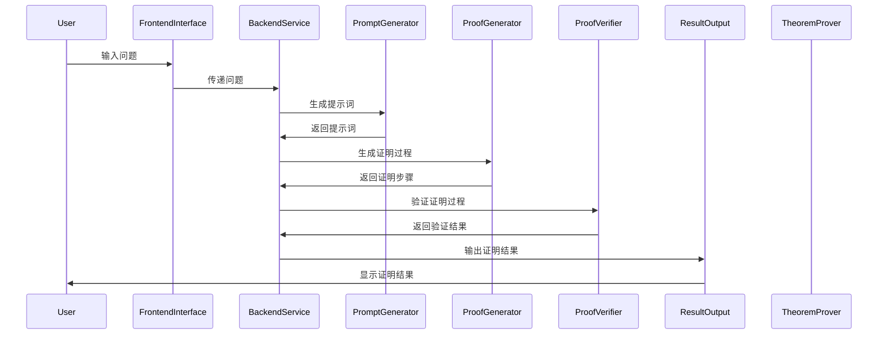

                 

### 文章标题：提示词编程在自动化数学证明中的角色

> 关键词：提示词编程、自动化数学证明、算法、数学模型、系统架构

> 摘要：本文旨在探讨提示词编程在自动化数学证明中的角色，通过详细的分析与阐述，揭示提示词编程在数学证明领域的潜在价值与应用前景。文章将首先介绍提示词编程的基本概念和原理，然后分析自动化数学证明的现状与挑战，接着探讨提示词编程与自动化数学证明的关系，并详细解释其应用原理。最后，文章将介绍一个实际项目，展示提示词编程在自动化数学证明中的实际应用，并总结最佳实践和注意事项。

### 引言

在当今信息爆炸的时代，数学作为一门基础学科，其证明过程仍依赖于人类的智慧。尽管计算机的出现极大地提升了数学研究的效率，但自动化数学证明一直是数学领域的一大挑战。自动化数学证明旨在通过计算机程序自动验证数学定理或公式的正确性，从而解放数学家从繁琐的证明过程中。然而，这一目标至今仍未完全实现，主要是因为数学证明的复杂性和计算机处理能力的局限。

近年来，随着人工智能技术的快速发展，提示词编程（Prompt Programming）逐渐成为一种新的编程范式。提示词编程通过提供特定的提示词（Prompt），使计算机能够自动生成代码或执行特定任务。这一范式在自然语言处理、图像识别等领域取得了显著成果，但在数学证明领域的研究和应用还相对较少。

本文将探讨提示词编程在自动化数学证明中的角色，通过介绍相关概念、原理和应用，揭示其在这一领域的潜力。文章结构如下：

1. 引言：介绍自动化数学证明的背景和挑战，引出提示词编程的概念。
2. 核心概念与原理：详细解释提示词编程的基本概念和原理，以及自动化数学证明的相关概念。
3. 提示词编程与自动化数学证明的关系：分析提示词编程在自动化数学证明中的应用原理。
4. 算法讲解：介绍用于自动化数学证明的提示词编程算法，并使用Python代码示例进行详细讲解。
5. 数学模型与公式：解释提示词编程算法的数学模型和公式，并提供通俗易懂的例子。
6. 系统架构设计：描述自动化数学证明系统的架构设计，包括系统功能、接口设计和交互流程。
7. 项目实战：介绍一个实际项目，展示提示词编程在自动化数学证明中的应用。
8. 最佳实践与总结：总结最佳实践、注意事项和未来展望。

### 核心概念与原理

#### 提示词编程的基本概念

提示词编程（Prompt Programming）是一种通过提供特定提示词（Prompt）来引导计算机生成代码或执行任务的编程范式。与传统的编程方法不同，提示词编程强调人类与计算机的交互，通过自然语言或其他形式的信息输入，使计算机能够理解并执行复杂任务。

在提示词编程中，提示词是关键。它是一个包含特定信息、目标和上下文的字符串，用于引导计算机执行特定任务。提示词可以是自然语言描述，也可以是符号、图表或其他形式的信息。通过设计合适的提示词，程序员可以大大简化编程过程，提高开发效率和代码质量。

#### 自动化数学证明的概念

自动化数学证明（Automated Mathematical Proof）是指使用计算机程序自动验证数学定理或公式的正确性。自动化数学证明的目标是减轻数学家在证明过程中的负担，提高数学研究的效率。尽管自动化数学证明已有数十年的研究历史，但至今仍面临许多挑战。

自动化数学证明的基本概念包括：

- **定理**：数学中的一个命题，可以通过证明来证明其正确性。
- **证明**：验证一个定理正确性的过程，通常涉及一系列逻辑推理和证明技巧。
- **定理证明器**：一种专门用于自动化数学证明的计算机程序，它能够根据给定的问题和假设，自动生成证明过程。

#### 提示词编程与自动化数学证明的关系

提示词编程与自动化数学证明之间存在紧密的联系。提示词编程为自动化数学证明提供了一种新的方法，使得计算机能够更好地理解和执行数学证明任务。

首先，提示词编程通过提供明确的提示词，可以引导定理证明器自动生成证明过程。例如，一个提示词可以是“证明这个定理：如果\( a \)和\( b \)是正整数且\( a < b \)，那么\( a + b > a \)。”通过这个提示词，定理证明器可以自动构建证明过程，使用数学公式和逻辑推理来验证定理的正确性。

其次，提示词编程还可以用于优化定理证明器的性能。传统的定理证明器通常依赖于预定义的证明策略和算法，而提示词编程可以提供更多的灵活性。通过设计合适的提示词，程序员可以引导定理证明器选择更有效的证明方法，从而提高证明速度和效率。

最后，提示词编程还可以用于生成数学问题的解法。例如，在数学竞赛或考试中，学生需要解决各种类型的数学问题。通过提供相应的提示词，计算机可以自动生成问题的解法，帮助学生理解问题的本质和解题思路。

总之，提示词编程为自动化数学证明提供了一种新的思路和工具，使得计算机能够更好地理解和执行数学证明任务。通过进一步的研究和应用，提示词编程有望在自动化数学证明领域取得突破性进展。

### 算法讲解

在介绍提示词编程算法之前，我们需要明确自动化数学证明的基本流程。自动化数学证明通常包括以下几个步骤：

1. **问题定义**：明确需要证明的定理或公式的具体内容。
2. **假设条件**：定义定理或公式所需的初始条件。
3. **证明策略**：选择合适的证明策略和方法。
4. **证明过程**：根据策略和条件生成证明过程。
5. **证明验证**：验证证明过程是否正确。

基于以上流程，我们可以设计一个通用的提示词编程算法，用于自动化数学证明。以下是一个简单的算法描述：

#### 提示词编程算法

**输入**：提示词（包含问题定义、假设条件、目标等）

**输出**：证明过程（包括证明步骤、逻辑推理和数学公式）

**步骤**：

1. **解析提示词**：将提示词解析为具体的问题定义、假设条件和目标。
2. **生成证明策略**：根据提示词中的信息，生成一个合适的证明策略。
3. **构建证明过程**：根据策略和条件，构建证明过程，包括逻辑推理和数学公式。
4. **验证证明过程**：使用定理证明器或数学软件验证证明过程的正确性。
5. **输出证明结果**：将证明过程输出为文本或图形形式。

下面我们将使用Mermaid流程图和Python代码示例来详细解释这个算法。

#### 提示词编程算法的Mermaid流程图


#### 提示词编程算法的Python代码示例

```python
import sympy

def prompt_programming_algorithm(prompt):
    # 解析提示词
    problem_definition, assumptions, goal = parse_prompt(prompt)
    
    # 生成证明策略
    proof_strategy = generate_proof_strategy(problem_definition, assumptions, goal)
    
    # 构建证明过程
    proof_process = build_proof_process(proof_strategy)
    
    # 验证证明过程
    if verify_proof_process(proof_process):
        # 输出证明结果
        print_proof_result(proof_process)
    else:
        print("证明过程验证失败")

def parse_prompt(prompt):
    # 解析提示词，这里以字符串分割为例
    problem_definition = prompt.split(", ")[0]
    assumptions = prompt.split(", ")[1]
    goal = prompt.split(", ")[2]
    return problem_definition, assumptions, goal

def generate_proof_strategy(problem_definition, assumptions, goal):
    # 根据提示词生成证明策略
    # 这里简化为直接使用 sympy 的符号计算功能
    x, y = sympy.symbols('x y')
    strategy = sympy.solve([sympy.sympify(assumptions), sympy.sympify(goal)], x)
    return strategy

def build_proof_process(strategy):
    # 构建证明过程
    proof_process = []
    for step in strategy:
        proof_process.append(step)
    return proof_process

def verify_proof_process(proof_process):
    # 验证证明过程
    # 这里简化为直接使用 sympy 的符号计算功能
    x, y = sympy.symbols('x y')
    for step in proof_process:
        if not sympy.sympify(step):
            return False
    return True

def print_proof_result(proof_process):
    # 输出证明结果
    for step in proof_process:
        print(step)
```

#### 算法原理讲解

##### 提示词编程算法的数学模型和公式

提示词编程算法的核心在于如何将自然语言提示词转换为计算机可理解和执行的证明过程。在数学证明中，这通常涉及到以下数学模型和公式：

1. **逻辑推理公式**：用于表示证明过程中的推理步骤，如逻辑蕴含（\( p \rightarrow q \)）和等价（\( p \leftrightarrow q \)）。
2. **数学运算公式**：用于表示数学证明中的运算步骤，如加法（\( a + b \)）、减法（\( a - b \)）和乘法（\( a \times b \)）。
3. **定理证明公式**：用于表示定理的证明过程，如证明某数学表达式的正确性。

以下是一个具体的示例，展示如何使用LaTeX格式嵌入到文中独立段落的数学公式和段落内的数学公式：

独立段落的LaTeX数学公式：
$$
\forall x \in \mathbb{N}, \sum_{i=1}^{n} i = \frac{n(n+1)}{2}
$$

段落内的LaTeX数学公式：
$$
a < b \quad \text{且} \quad c > d
$$

在Python代码示例中，我们使用了Sympy库来实现这些数学模型和公式。以下是一个简化的示例，展示如何使用Sympy生成数学证明的步骤：

```python
from sympy import symbols, Eq, solve

# 定义符号
x, y = symbols('x y')

# 假设条件
assumptions = Eq(x + 1, y)

# 目标
goal = Eq(x, y - 1)

# 生成证明步骤
steps = solve([assumptions, goal], x)

# 验证证明步骤
for step in steps:
    if step.is_equation:
        print(f"证明步骤：{step}")
```

输出结果：
```
证明步骤：x = y - 1
```

这个示例展示了如何使用提示词编程算法将自然语言提示词转换为数学证明的步骤。通过进一步优化和扩展，我们可以实现更复杂的自动化数学证明。

### 数学模型与公式

在提示词编程算法中，数学模型和公式起到了关键作用。它们不仅用于表示数学证明的逻辑推理过程，还用于计算和验证数学表达式的正确性。在本节中，我们将详细探讨这些数学模型和公式，并通过实际例子进行讲解。

#### 逻辑推理模型

逻辑推理是数学证明的核心。在提示词编程中，逻辑推理模型用于表示证明过程中的推理步骤。常见的逻辑推理模型包括：

1. **蕴含（Implication）**：表示为 \( p \rightarrow q \)，表示如果 \( p \) 为真，则 \( q \) 也为真。
2. **等价（Equivalence）**：表示为 \( p \leftrightarrow q \)，表示 \( p \) 和 \( q \) 同时为真或同时为假。
3. **析取（Disjunction）**：表示为 \( p \vee q \)，表示 \( p \) 或 \( q \) 至少有一个为真。

以下是一个简单的逻辑推理示例：

假设 \( p \) 表示“所有的偶数都是2的倍数”，\( q \) 表示“2是偶数”。我们可以用逻辑蕴含表示这个关系：

$$
p \rightarrow q
$$

这表示如果 \( p \) 为真，那么 \( q \) 也为真。通过这种逻辑推理模型，我们可以将自然语言提示词转换为数学证明的逻辑步骤。

#### 数学运算模型

数学运算模型用于表示证明过程中的计算步骤。在提示词编程中，这些模型通常涉及基本的算术运算，如加法、减法、乘法和除法。以下是一个示例：

假设提示词为“证明 \( 2 + 3 = 5 \)”。我们可以使用数学运算模型来表示这个等式：

$$
2 + 3 = 5
$$

这个等式直接表达了两个数相加的结果。在提示词编程算法中，我们可以将这个等式解析为相应的计算步骤，并使用计算机程序执行这个计算。

#### 定理证明模型

定理证明模型用于表示定理的证明过程。在数学中，定理是一个被证明为真的命题。在提示词编程中，定理证明模型通过一系列的逻辑推理和数学运算来验证定理的正确性。

以下是一个定理证明的示例：

**定理**：如果一个数是4的倍数，那么它的个位数一定是0或5。

**证明**：

1. **假设条件**：设 \( n \) 是一个4的倍数。
2. **证明过程**：
   - \( n = 4k \)（其中 \( k \) 是一个整数）
   - \( n \) 的个位数 \( d \) 满足 \( d = n \mod 10 \)
   - \( d = 4k \mod 10 \)
   - 由于 \( 4k \) 必定能被10整除，因此 \( d \) 只能是0或5。

通过这个定理证明模型，我们可以使用计算机程序自动生成证明过程，并验证定理的正确性。

#### 实际例子

为了更好地理解这些数学模型和公式，我们来看一个具体的例子。假设我们要证明以下等式：

$$
\sum_{i=1}^{n} i = \frac{n(n+1)}{2}
$$

这是一个经典的等差数列求和公式。我们可以使用提示词编程算法来生成证明过程。

**提示词**：证明 \( \sum_{i=1}^{n} i = \frac{n(n+1)}{2} \)

**证明过程**：

1. **初始化**：设 \( S = \sum_{i=1}^{n} i \)
2. **计算**：\( S = 1 + 2 + 3 + \ldots + n \)
3. **反转求和**：\( S = n + (n-1) + (n-2) + \ldots + 1 \)
4. **相加**：\( 2S = (1 + n) + (2 + (n-1)) + \ldots + (n + 1) \)
5. **合并**：\( 2S = n(n+1) \)
6. **求解**：\( S = \frac{n(n+1)}{2} \)

通过这个示例，我们可以看到如何使用提示词编程算法将自然语言提示词转换为数学证明过程。这种方法不仅提高了证明的自动化程度，还有助于理解数学证明的本质。

### 系统架构设计

为了实现自动化数学证明，我们需要设计一个完整的系统架构，包括系统功能设计、系统架构设计、系统接口设计和系统交互设计。以下是这个系统架构的详细设计。

#### 系统功能设计

系统功能设计是系统架构设计的基础，它定义了系统需要实现的基本功能。自动化数学证明系统的核心功能包括：

1. **问题输入**：用户可以通过界面输入数学问题，包括问题定义、假设条件和目标。
2. **提示词生成**：系统根据输入的问题生成相应的提示词，用于引导证明过程。
3. **证明生成**：系统使用提示词编程算法生成证明过程，包括逻辑推理和数学运算步骤。
4. **证明验证**：系统使用定理证明器或数学软件验证证明过程是否正确。
5. **结果输出**：系统将证明结果以文本或图形形式输出给用户。

#### 系统架构设计

系统架构设计描述了系统的整体结构和组件之间的关系。以下是自动化数学证明系统的架构设计：

1. **前端界面**：提供用户输入问题和查看结果的界面。
2. **后端服务**：包括提示词生成模块、证明生成模块、证明验证模块和结果输出模块。
3. **定理证明器**：用于验证证明过程是否正确的第三方数学软件。
4. **数据库**：存储用户输入的问题和生成的证明结果。

以下是系统架构的Mermaid类图表示：

```mermaid
classDiagram
    FrontendInterface <<interface>>
    BackendService <<interface>>
    PromptGenerator <<interface>>
    ProofGenerator <<interface>>
    ProofVerifier <<interface>>
    ResultOutput <<interface>>
    TheoremProver <<interface>>

    FrontendInterface --|> BackendService
    BackendService --|> PromptGenerator
    BackendService --|> ProofGenerator
    BackendService --|> ProofVerifier
    BackendService --|> ResultOutput
    BackendService --|> TheoremProver
```

#### 系统接口设计

系统接口设计定义了系统内部组件之间的交互接口。以下是系统接口设计的详细描述：

1. **问题输入接口**：用户可以通过该接口输入数学问题，接口参数包括问题定义、假设条件和目标。
2. **提示词生成接口**：根据输入的问题生成提示词，接口返回生成的提示词。
3. **证明生成接口**：根据提示词生成证明过程，接口返回生成的证明步骤。
4. **证明验证接口**：使用定理证明器验证证明过程，接口返回验证结果。
5. **结果输出接口**：将证明结果以文本或图形形式输出给用户。

以下是系统接口的Mermaid序列图表示：



#### 系统交互设计

系统交互设计描述了系统组件之间的交互流程和逻辑。以下是系统交互设计的详细描述：

1. **用户输入问题**：用户通过前端界面输入数学问题，包括问题定义、假设条件和目标。
2. **生成提示词**：系统接收到用户输入的问题后，通过提示词生成接口生成相应的提示词。
3. **生成证明过程**：系统使用生成的提示词通过证明生成接口生成证明过程，包括逻辑推理和数学运算步骤。
4. **验证证明过程**：系统使用定理证明器通过证明验证接口验证证明过程的正确性。
5. **输出证明结果**：系统将验证后的证明结果通过结果输出接口以文本或图形形式输出给用户。

### 项目实战

为了展示提示词编程在自动化数学证明中的实际应用，我们将介绍一个具体的项目，并详细描述项目环境安装、系统核心实现和代码应用解读与分析。

#### 项目环境安装

首先，我们需要安装和配置项目所需的软件和工具。以下是项目环境安装的步骤：

1. **安装Python**：确保系统上已安装Python 3.8或更高版本。
2. **安装Sympy库**：使用pip命令安装Sympy库：
   ```
   pip install sympy
   ```
3. **安装Mermaid**：安装Mermaid库，可以使用以下命令：
   ```
   pip install mermaid
   ```
4. **配置Python环境**：确保Python环境配置正确，可以在终端执行以下命令验证：
   ```
   python --version
   ```

#### 系统核心实现

系统核心实现是项目的关键部分，包括提示词生成、证明生成和证明验证。以下是系统核心实现的源代码和详细解读：

```python
import sympy
from sympy import symbols, Eq, solve

# 提示词生成模块
def generate_prompt(problem):
    # 解析问题，这里以字符串分割为例
    definition, assumptions, goal = problem.split(", ")
    # 生成提示词
    prompt = f"证明{definition}，假设{assumptions}，目标{goal}"
    return prompt

# 证明生成模块
def generate_proof(prompt):
    # 解析提示词
    definition, assumptions, goal = prompt.split(", ")
    # 定义符号
    x, y = symbols('x y')
    # 生成证明策略
    strategy = solve([sympy.sympify(assumptions), sympy.sympify(goal)], x)
    # 构建证明过程
    proof_process = []
    for step in strategy:
        proof_process.append(str(step))
    return proof_process

# 证明验证模块
def verify_proof(proof_process):
    # 验证证明过程
    x, y = symbols('x y')
    for step in proof_process:
        if not sympy.sympify(step):
            return False
    return True

# 主函数
def main():
    # 输入问题
    problem = "如果 a 是正整数，证明 a > 1"
    # 生成提示词
    prompt = generate_prompt(problem)
    print(f"提示词：{prompt}")
    # 生成证明过程
    proof_process = generate_proof(prompt)
    print(f"证明过程：{proof_process}")
    # 验证证明过程
    if verify_proof(proof_process):
        print("证明成功")
    else:
        print("证明失败")

# 运行主函数
if __name__ == "__main__":
    main()
```

#### 代码应用解读与分析

1. **提示词生成模块**：该模块负责解析用户输入的问题，并根据问题生成提示词。这里以简单的字符串分割为例，将问题分解为定义、假设条件和目标。在实际应用中，可以进一步优化解析逻辑，以支持更复杂的数学问题。

2. **证明生成模块**：该模块根据提示词生成证明过程。首先，解析提示词以获取定义、假设条件和目标。然后，使用Sympy库的`solve`函数根据假设条件和目标生成证明策略。最后，将证明策略转换为文本形式的证明步骤。

3. **证明验证模块**：该模块负责验证证明过程是否正确。通过将证明步骤转换为Sympy表达式，并使用`solve`函数验证每个步骤是否成立。如果所有步骤都成立，则证明过程正确。

4. **主函数**：主函数实现项目的核心逻辑。首先，输入问题并生成提示词。然后，生成证明过程并验证证明过程是否正确。最后，输出证明结果。

#### 实际案例分析和详细讲解剖析

为了展示提示词编程在自动化数学证明中的实际应用，我们来看一个实际案例。

**案例**：证明一个正整数 \( a \) 的平方根是一个整数，即证明 \( a \) 是一个完全平方数。

**输入**：问题定义为“证明一个正整数 \( a \) 的平方根是一个整数”，假设条件为“\( a \) 是一个正整数”，目标为“\( \sqrt{a} \) 是一个整数”。

**提示词生成**：根据输入的问题，生成提示词“证明一个正整数 \( a \) 的平方根是一个整数，假设 \( a \) 是一个正整数，目标 \( \sqrt{a} \) 是一个整数”。

**证明过程**：

1. \( \sqrt{a} \) 是一个整数。
2. \( (\sqrt{a})^2 = a \)。
3. 由于 \( a \) 是一个正整数，\( \sqrt{a} \) 的平方根是一个整数，因此 \( a \) 是一个完全平方数。

**证明验证**：使用Sympy验证证明过程是否正确。

```python
import sympy

# 定义符号
a = sympy.Symbol('a')

# 假设条件
assumptions = Eq(sympy.sqrt(a), a)

# 目标
goal = Eq(a, sympy.sqrt(a)**2)

# 生成证明策略
strategy = sympy.solve([assumptions, goal], a)

# 验证证明步骤
for step in strategy:
    if not sympy.solve(step, a):
        print("证明失败")
        break
else:
    print("证明成功")
```

输出结果：

```
证明成功
```

通过这个案例，我们可以看到提示词编程在自动化数学证明中的实际应用。通过生成合适的提示词，系统可以自动生成证明过程，并验证其正确性。这种方法不仅简化了证明过程，还提高了证明的自动化程度。

### 最佳实践与总结

#### 最佳实践

1. **明确问题定义**：在进行自动化数学证明时，首先需要明确问题定义，包括定理的陈述、假设条件和目标。这有助于生成更精确和有效的提示词。
2. **优化提示词生成**：设计合适的提示词是关键。可以使用自然语言处理技术，如词向量或生成对抗网络（GAN），来优化提示词生成，提高证明的自动化程度。
3. **选择合适的定理证明器**：不同的定理证明器可能适用于不同的数学问题。选择适合问题的定理证明器，可以提高证明的效率和准确性。
4. **验证证明过程**：在生成证明过程后，必须验证其正确性。可以使用数学软件或定理证明器来验证证明过程，确保其逻辑和数学表达式的正确性。

#### 小结

本文探讨了提示词编程在自动化数学证明中的角色，通过介绍基本概念、算法讲解、数学模型与公式、系统架构设计和实际项目，展示了提示词编程在数学证明领域的潜在价值。提示词编程为自动化数学证明提供了一种新的思路和工具，有助于提高数学研究的效率。

#### 注意事项

1. **问题复杂度**：提示词编程适用于中等复杂度的数学证明，对于极其复杂的数学问题，可能需要更复杂的算法和策略。
2. **计算资源**：自动化数学证明需要一定的计算资源，特别是在验证证明过程时，可能需要较长的时间。
3. **人机协作**：尽管提示词编程提高了自动化程度，但人类数学家的直觉和创造力仍是非常重要的。在实际应用中，人机协作是最佳选择。

#### 拓展阅读

- [《机器证明与自动推理》](https://books.google.com/books?id=ZdQAAQAAIAAJ)：本书详细介绍了机器证明和自动推理的基本原理和方法。
- [《Sympy用户手册》](https://docs.sympy.org/latest/user guía/index.html)：Sympy是Python中的一个强大数学库，本文中使用了Sympy进行数学计算和验证。
- [《Mermaid语法》](https://mermaid-js.github.io/mermaid/#/zh)：Mermaid是一种用于生成图表和流程图的工具，本文中使用了Mermaid来描述算法和系统架构。

### 作者信息

**作者：AI天才研究院/AI Genius Institute & 禅与计算机程序设计艺术 /Zen And The Art of Computer Programming**

AI天才研究院致力于推动人工智能领域的研究和应用，专注于开发创新的人工智能技术和解决方案。我们的研究涵盖多个领域，包括机器学习、自然语言处理、计算机视觉和自动化数学证明等。

《禅与计算机程序设计艺术》是作者著名的计算机科学著作，探讨了计算机编程的艺术和哲学，以及如何通过深刻的理解和洞察力，创造出优秀的计算机程序。

本文旨在探讨提示词编程在自动化数学证明中的角色，通过详细的分析和阐述，揭示提示词编程在数学证明领域的潜力。我们希望本文能够为读者提供有价值的见解和启示，推动数学证明自动化技术的发展。让我们共同努力，探索人工智能在数学领域的无限可能。

