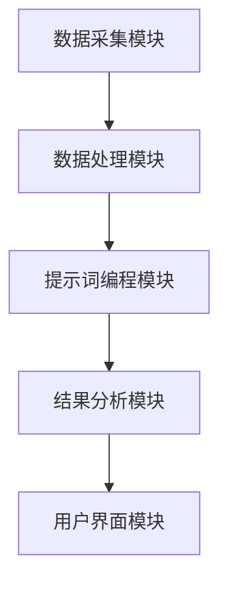

                 

# 提示词编程在自动化科技影响评估中的应用

## 关键词
- 提示词编程
- 自动化科技
- 影响评估
- 应用场景
- 实现方法

## 摘要
本文将探讨提示词编程在自动化科技影响评估中的应用。首先，我们将介绍自动化科技的发展现状及其对评估工作的影响，随后深入解析提示词编程的基础概念和原理。接着，我们将分析自动化科技影响评估的关键要素和流程，通过实际案例分析说明其重要性。最后，我们将探讨提示词编程在自动化科技影响评估中的具体应用场景和实现方法，总结其应用价值，并提出未来发展方向。

## 第一部分：背景介绍

### 第1章：问题背景与核心概念

#### 1.1 问题背景

**1.1.1 自动化科技的发展现状**

自动化科技是现代工业和信息技术发展的产物，其核心目的是通过机器替代或辅助人类完成重复性、高危险性或复杂程度较高的工作，从而提高生产效率、降低成本、提升产品质量。近年来，随着人工智能、物联网、大数据等技术的不断进步，自动化科技已广泛应用于各个领域，如制造业、交通运输、医疗保健、金融服务等。

**1.1.2 科技对评估工作的影响**

自动化科技的快速发展对评估工作产生了深远的影响。一方面，自动化技术使得评估工作从人工操作转向自动化操作，提高了评估的效率和准确性。另一方面，自动化科技在评估工作中引入了新的变量和挑战，如数据隐私、安全性、伦理问题等，使得评估工作变得更加复杂。

**1.1.3 当前评估工作的挑战**

当前的评估工作面临以下挑战：数据量大且来源多样化，导致数据处理和挖掘的难度增加；评估指标的多样性和复杂性，使得评估结果的可比性降低；评估过程的透明性和公正性受到质疑，需要建立更科学、合理的评估体系。

#### 1.2 核心概念

**1.2.1 提示词编程概述**

**1.2.1.1 定义** 提示词编程（Keyword Programming）是一种基于关键词或短语驱动的编程模式，通过定义一系列关键词来描述程序的行为和功能，从而实现自动化流程的编写和执行。

**1.2.1.2 特点** 
- 灵活性：提示词编程允许开发者以自然语言或简明的代码形式定义流程，使得编程过程更加直观和简洁。
- 易维护：提示词编程通过关键词进行模块化，使得代码结构清晰，便于维护和扩展。
- 适应性强：提示词编程可以根据不同的应用场景进行定制，具有较强的适应性。

**1.2.1.3 应用领域** 提示词编程广泛应用于自动化流程管理、数据分析、智能家居、智能客服等领域。

**1.2.2 自动化科技影响评估概述**

**1.2.2.1 定义** 自动化科技影响评估是对自动化科技在实际应用中产生的经济效益、社会效益和环境影响进行定量和定性分析的过程。

**1.2.2.2 原理** 自动化科技影响评估基于多维度指标体系，通过数据收集、分析、建模和评估，对自动化科技的应用效果进行评估。

**1.2.2.3 关键要素** 自动化科技影响评估的关键要素包括评估指标体系、评估流程、数据收集与处理方法、评估结果分析和应用。

#### 1.3 概念联系

**1.3.1 提示词编程与自动化科技影响评估的关系**

提示词编程与自动化科技影响评估之间存在密切的联系。提示词编程可以简化自动化科技影响评估的过程，提高评估的效率和准确性。同时，自动化科技影响评估的结果可以为提示词编程的优化提供重要依据。

**1.3.2 提示词编程在评估中的应用价值**

提示词编程在自动化科技影响评估中的应用价值主要体现在以下几个方面：

1. 简化评估过程：通过定义一系列关键词，提示词编程可以自动化地处理大量数据，降低人工操作的复杂度。
2. 提高评估准确性：提示词编程可以确保评估过程的一致性和规范性，减少人为因素带来的误差。
3. 优化评估结果：提示词编程可以根据评估结果进行实时调整和优化，提高自动化科技的应用效果。

**1.3.3 关键要素对比分析**

| 关键要素               | 提示词编程                           | 自动化科技影响评估                           |
|----------------------|----------------------------------|------------------------------------------|
| 数据处理能力           | 高度自动化，支持多种数据处理方式         | 需要收集、处理和分析多种类型的数据              |
| 评估准确性             | 通过关键词确保评估的一致性和规范性       | 建立科学合理的评估指标体系，确保评估结果的准确性   |
| 适应性和灵活性           | 支持多种应用场景，易于定制和扩展         | 需要针对不同应用场景制定相应的评估方案          |
| 评估结果的可视化与解读   | 可以将评估结果以直观的方式展示和解读       | 需要分析评估结果，为决策提供支持               |

**1.4 边界与外延**

**1.4.1 边界定义**

提示词编程在自动化科技影响评估中的应用边界主要包括以下几个方面：

1. 数据处理范围：提示词编程适用于处理自动化科技影响评估中的大部分数据，但对某些特殊类型的数据（如图像、语音等）的处理能力有限。
2. 评估指标范围：提示词编程可以根据评估需求自定义评估指标，但无法完全取代专业的评估方法。
3. 评估结果应用：提示词编程可以提供一定的评估结果可视化与解读功能，但需要结合专业知识和经验进行深入分析。

**1.4.2 外延拓展**

提示词编程在自动化科技影响评估中的应用可以进一步拓展到以下几个方面：

1. 评估流程自动化：通过提示词编程，可以自动化地完成评估流程中的数据收集、处理、分析和评估任务。
2. 评估结果优化：提示词编程可以根据评估结果进行实时调整和优化，提高自动化科技的应用效果。
3. 跨领域应用：提示词编程可以应用于自动化科技影响评估的各个领域，如工业自动化、智能交通、医疗健康等。

**1.5 本章小结**

本文介绍了自动化科技的发展现状及其对评估工作的影响，探讨了提示词编程和自动化科技影响评估的核心概念，分析了两者之间的联系和应用价值，并对比了关键要素。下一章将深入探讨提示词编程的基础原理和算法。

## 第二部分：提示词编程基础

### 第2章：提示词编程原理

#### 2.1 基础概念

**2.1.1 语言与编程模型**

**2.1.1.1 编程语言概述**

编程语言是用于编写计算机程序的代码集合，具有语法、语义和语用规则。常见的编程语言包括高级语言（如Python、Java）和低级语言（如汇编语言）。

**2.1.1.2 编程模型介绍**

编程模型是指程序开发过程中采用的方法和流程。常见的编程模型包括瀑布模型、迭代模型和敏捷开发等。

**2.1.2 提示词编程基础**

**2.1.2.1 提示词概念**

提示词是指用于描述程序行为的关键词或短语，是提示词编程的核心元素。

**2.1.2.2 提示词作用**

提示词在编程中的作用主要包括：

1. 确定程序执行流程：通过提示词，可以明确程序在不同条件下的执行路径。
2. 提高编程效率：提示词编程使得编程过程更加直观和简洁，降低了编写和维护代码的难度。
3. 增强代码可读性：提示词的使用使得代码结构更加清晰，便于他人理解和维护。

**2.1.2.3 提示词类型**

根据应用场景和需求，提示词可以分为以下几类：

1. 条件提示词：用于表示程序执行条件，如“如果”、“否则”等。
2. 控制流程提示词：用于控制程序执行流程，如“循环”、“跳转”等。
3. 数据处理提示词：用于表示数据处理操作，如“添加”、“删除”等。
4. 输入输出提示词：用于表示程序与外部环境的交互，如“输入”、“输出”等。

#### 2.2 算法原理

**2.2.1 算法基础**

算法是一系列解决问题的步骤和规则，具有输入、处理和输出功能。常见的算法类型包括排序算法、搜索算法、图算法等。

**2.2.1.1 算法概述**

算法的概述主要包括算法的输入、输出、基本操作和执行步骤等。

**2.2.1.2 算法类型**

算法类型主要包括以下几类：

1. 按照功能分类：如排序算法、搜索算法等。
2. 按照数据结构分类：如线性结构算法、树结构算法等。
3. 按照计算复杂度分类：如时间复杂度、空间复杂度等。

**2.2.2 提示词编程算法**

**2.2.2.1 算法原理**

提示词编程算法的核心原理是利用提示词来描述程序的执行流程和功能。具体来说，算法包括以下几个步骤：

1. 定义提示词：根据需求确定程序所需的提示词。
2. 编写提示词代码：使用编程语言实现提示词的功能。
3. 组织提示词：将提示词按照一定的顺序和规则组织成程序结构。
4. 执行和调试：运行程序，根据输出结果进行调试和优化。

**2.2.2.2 算法应用**

提示词编程算法可以应用于以下场景：

1. 自动化流程管理：如自动生成报告、自动执行任务等。
2. 数据分析：如数据清洗、数据转换等。
3. 智能家居：如智能家电控制、智能安防系统等。
4. 智能客服：如自动回答常见问题、自动处理客户请求等。

**2.2.2.3 算法性能分析**

提示词编程算法的性能分析主要包括时间复杂度和空间复杂度两个方面。具体分析如下：

1. 时间复杂度：描述算法执行时间与数据规模的关系，常见的时间复杂度有O(1)、O(n)、O(log n)等。
2. 空间复杂度：描述算法执行过程中所需内存空间与数据规模的关系，常见的时间复杂度有O(1)、O(n)、O(log n)等。

#### 2.3 实现流程

**2.3.1 提示词编程实现步骤**

提示词编程的实现步骤主要包括以下几个环节：

1. 需求分析：明确程序的功能需求，确定所需的提示词。
2. 提示词设计：根据需求设计提示词，包括定义提示词的含义、功能和执行顺序。
3. 编码实现：使用编程语言实现提示词的功能，编写提示词代码。
4. 系统集成：将提示词代码与其他系统模块集成，实现整体功能。
5. 调试与优化：运行程序，根据输出结果进行调试和优化，确保程序的正确性和性能。

**2.3.2 环境准备**

提示词编程的环境准备主要包括以下几个步骤：

1. 选择编程语言：根据需求选择合适的编程语言，如Python、Java等。
2. 安装开发环境：安装编程语言的开发环境，如Python的Anaconda、Java的Eclipse等。
3. 准备开发工具：选择合适的开发工具，如文本编辑器、集成开发环境等。
4. 配置依赖库：安装和配置所需的依赖库，如NumPy、Pandas等。

**2.3.3 编码实现**

提示词编程的编码实现主要包括以下几个步骤：

1. 设计提示词：根据需求设计提示词，确定提示词的功能和执行顺序。
2. 编写代码：使用编程语言实现提示词的功能，编写提示词代码。
3. 集成模块：将提示词代码与其他系统模块集成，实现整体功能。
4. 调试代码：运行程序，根据输出结果进行调试和优化。

**2.3.4 调试与优化**

提示词编程的调试与优化主要包括以下几个步骤：

1. 定位问题：通过日志、调试工具等定位程序中的问题。
2. 修复错误：根据定位的问题，修复代码中的错误。
3. 性能优化：分析程序的性能瓶颈，进行代码优化，提高程序的性能。
4. 测试验证：运行程序，验证修复效果和性能提升。

**2.4 本章小结**

本章介绍了提示词编程的基础概念、算法原理和实现流程。通过本章的学习，读者可以了解提示词编程的基本原理和应用方法，为后续章节的深入学习打下基础。下一章将探讨自动化科技影响评估的核心概念和关键要素。

### 第三部分：自动化科技影响评估应用

#### 第3章：自动化科技影响评估概述

##### 3.1 核心概念

**3.1.1 自动化科技概述**

**3.1.1.1 定义**

自动化科技是指通过应用先进的计算机技术、通信技术、控制技术等，实现生产、管理、服务等过程的自动化，从而提高生产效率、降低成本、提升产品质量。

**3.1.1.2 发展历程**

自动化科技的发展可以分为以下几个阶段：

1. 传统自动化：20世纪60年代，以机械自动化为主，实现生产过程的机械化。
2. 计算机集成制造系统（CIMS）：20世纪70年代，将计算机技术与制造过程相结合，实现生产过程的智能化。
3. 工业物联网（IIoT）：20世纪80年代，通过互联网将生产设备、控制系统等连接起来，实现全流程的自动化。
4. 智能制造：21世纪初，结合人工智能、大数据等技术，实现生产过程的自主决策和优化。

**3.1.1.3 关键技术**

自动化科技的关键技术包括：

1. 计算机技术：用于实现自动化控制、数据采集、数据处理等。
2. 通信技术：用于实现设备间的互联互通，如Wi-Fi、5G等。
3. 控制技术：用于实现生产过程的自动化控制，如PLC、SCADA等。
4. 人工智能技术：用于实现生产过程的智能决策和优化，如图像识别、自然语言处理等。

**3.1.2 影响评估概述**

**3.1.2.1 定义**

自动化科技影响评估是对自动化科技在实际应用过程中产生的经济效益、社会效益和环境影响进行定量和定性分析的过程。

**3.1.2.2 原理**

自动化科技影响评估的原理主要包括以下几个方面：

1. 指标体系：建立科学合理的指标体系，包括经济效益指标、社会效益指标和环境影响指标。
2. 数据收集：通过问卷调查、数据挖掘、实地考察等方式收集相关数据。
3. 分析方法：采用定量分析和定性分析相结合的方法，对收集到的数据进行分析和处理。
4. 结果评估：根据分析结果，对自动化科技的应用效果进行评估。

**3.1.2.3 方法论**

自动化科技影响评估的方法论主要包括以下几个方面：

1. 成本效益分析：比较自动化科技应用前后的成本和效益，评估其经济效益。
2. 社会效益评估：分析自动化科技对社会就业、生态环境等方面的影响，评估其社会效益。
3. 环境影响评估：分析自动化科技对环境的影响，评估其环境影响。
4. 持续改进：根据评估结果，提出改进措施，优化自动化科技的应用效果。

##### 3.2 关键要素

**3.2.1 评估指标体系**

评估指标体系是自动化科技影响评估的核心，主要包括以下几个方面：

1. 经济效益指标：如成本降低率、利润增长率等。
2. 社会效益指标：如就业率、社会福利等。
3. 环境影响指标：如碳排放量、资源消耗等。

**3.2.1.1 指标概述**

评估指标体系中的各项指标应具有以下特点：

1. 科学性：指标应能够准确反映自动化科技的应用效果。
2. 可行性：指标应能够通过实际操作进行测量和评估。
3. 可比性：指标应能够在不同地区、不同行业之间进行比较。

**3.2.1.2 指标类型**

评估指标体系中的指标类型主要包括以下几个方面：

1. 定量指标：如成本、利润、就业率等。
2. 定性指标：如社会评价、生态环境评价等。
3. 综合指标：如成本效益比、社会经济效益比等。

**3.2.1.3 指标设定与计算**

评估指标体系的设定和计算方法主要包括以下几个方面：

1. 指标设定：根据自动化科技的应用特点，设定相应的评估指标。
2. 数据收集：通过问卷调查、数据挖掘、实地考察等方式收集相关数据。
3. 指标计算：根据收集到的数据，采用相应的计算方法计算出各项指标。

**3.2.2 评估流程**

评估流程是自动化科技影响评估的关键环节，主要包括以下几个方面：

1. 确定评估目标：明确自动化科技的应用领域、目标和评估要求。
2. 设计评估方案：制定评估指标体系、数据收集方案和分析方法。
3. 数据收集：通过问卷调查、数据挖掘、实地考察等方式收集相关数据。
4. 数据分析：对收集到的数据进行分析和处理，提取有用信息。
5. 结果评估：根据分析结果，对自动化科技的应用效果进行评估。
6. 撰写评估报告：整理评估结果，撰写评估报告。

**3.2.2.1 流程概述**

评估流程的概述主要包括以下几个方面：

1. 目标明确：明确自动化科技的应用领域、目标和评估要求。
2. 方案设计：设计评估指标体系、数据收集方案和分析方法。
3. 数据收集：通过多种渠道收集相关数据。
4. 数据分析：对收集到的数据进行处理和分析。
5. 结果评估：对自动化科技的应用效果进行评估。
6. 报告撰写：整理评估结果，撰写评估报告。

**3.2.2.2 流程步骤**

评估流程的具体步骤如下：

1. 确定评估目标：明确自动化科技的应用领域、目标和评估要求。
2. 设计评估方案：制定评估指标体系、数据收集方案和分析方法。
3. 数据收集：通过问卷调查、数据挖掘、实地考察等方式收集相关数据。
4. 数据处理：对收集到的数据进行整理、清洗和预处理。
5. 数据分析：采用定量分析和定性分析相结合的方法，对数据进行分析和处理。
6. 结果评估：根据分析结果，对自动化科技的应用效果进行评估。
7. 撰写评估报告：整理评估结果，撰写评估报告，并提出改进建议。

##### 3.3 案例分析

**3.3.1 案例一：工业自动化对生产效率的影响评估**

**案例背景：** 某企业采用工业自动化技术，通过引入自动化生产线和机器人，提高生产效率、降低成本。

**评估目标：** 评估工业自动化对生产效率的影响。

**评估指标：** 生产效率指标（如产量、合格率、生产周期等）。

**评估方法：** 成本效益分析、现场调查和数据分析。

**评估结果：** 通过评估，发现工业自动化显著提高了生产效率，降低了生产成本，取得了良好的经济效益。

**3.3.2 案例二：智能交通对城市交通拥堵的影响评估**

**案例背景：** 某城市采用智能交通技术，通过实时监控、交通流量控制和智能诱导等手段，缓解城市交通拥堵问题。

**评估目标：** 评估智能交通对城市交通拥堵的影响。

**评估指标：** 交通拥堵指数、平均行车速度、交通事故率等。

**评估方法：** 现场调查、数据挖掘和统计分析。

**评估结果：** 通过评估，发现智能交通技术有效缓解了城市交通拥堵，提高了交通效率，降低了交通事故率。

**3.3.3 案例三：人工智能在医疗领域的应用评估**

**案例背景：** 某医院采用人工智能技术，通过医学影像分析、疾病预测和治疗方案推荐等手段，提高医疗质量和服务水平。

**评估目标：** 评估人工智能在医疗领域的应用效果。

**评估指标：** 诊断准确率、治疗有效率、患者满意度等。

**评估方法：** 实验研究、数据分析和社会调查。

**评估结果：** 通过评估，发现人工智能技术显著提高了诊断准确率和治疗有效率，提升了患者满意度，取得了良好的社会效益。

##### 3.4 本章小结

本章介绍了自动化科技影响评估的核心概念、关键要素和实际案例分析。通过本章的学习，读者可以了解自动化科技影响评估的基本原理和方法，为实际应用提供指导和参考。

### 第四部分：提示词编程在自动化科技影响评估中的应用

#### 第4章：应用场景与实现

##### 4.1 应用场景

**4.1.1 工业自动化**

工业自动化是自动化科技的重要应用领域之一。通过引入自动化生产线、机器人、传感器等设备，企业可以实现生产过程的自动化、智能化，提高生产效率、降低成本。然而，工业自动化在提高生产效率的同时，也带来了新的挑战，如设备故障、生产调度、质量控制等。提示词编程在工业自动化领域具有广泛的应用前景。

**4.1.1.1 场景描述**

在工业自动化领域，提示词编程可以用于以下场景：

1. 设备故障预测：通过收集设备运行数据，利用提示词编程实现设备故障预测，提前预警设备故障，减少停机时间和维修成本。
2. 生产调度优化：根据生产计划、设备状态和物料库存等数据，利用提示词编程实现生产调度优化，提高生产效率、降低生产成本。
3. 质量控制：通过传感器收集生产过程中的质量数据，利用提示词编程实现质量控制，及时发现并处理质量问题，保证产品质量。

**4.1.1.2 挑战与需求**

在工业自动化领域，提示词编程面临的挑战主要包括：

1. 数据量大：工业自动化设备产生的数据量大，如何高效地处理和分析这些数据是关键问题。
2. 数据多样性：工业自动化设备产生的数据类型多样，包括结构化数据和非结构化数据，如何处理这些不同类型的数据是关键问题。
3. 实时性：工业自动化系统的运行需要实时响应，如何保证提示词编程的实时性是关键问题。

**4.1.2 智能交通**

智能交通是自动化科技在交通运输领域的应用。通过引入智能交通系统，可以实现交通流量监控、交通诱导、车辆管理等功能，提高交通效率、减少交通事故。提示词编程在智能交通领域具有广泛的应用前景。

**4.1.2.1 场景描述**

在智能交通领域，提示词编程可以用于以下场景：

1. 交通流量监控：通过传感器和摄像头收集交通流量数据，利用提示词编程实现交通流量监控，及时发现并处理交通拥堵问题。
2. 交通诱导：根据实时交通流量数据，利用提示词编程实现交通诱导，引导车辆避开拥堵路段，提高交通效率。
3. 车辆管理：通过车辆传感器和通信系统收集车辆数据，利用提示词编程实现车辆管理，提高车辆利用率，减少交通事故。

**4.1.2.2 挑战与需求**

在智能交通领域，提示词编程面临的挑战主要包括：

1. 数据实时性：交通流量数据是实时变化的，如何保证提示词编程的实时性是关键问题。
2. 数据处理能力：智能交通系统需要处理大量的实时数据，如何高效地处理和分析这些数据是关键问题。
3. 系统稳定性：智能交通系统需要在各种环境下稳定运行，如何保证系统的稳定性是关键问题。

**4.1.3 医疗领域**

医疗领域是自动化科技的重要应用领域之一。通过引入自动化设备、智能化诊断系统等，可以提高医疗服务质量、降低医疗成本。提示词编程在医疗领域具有广泛的应用前景。

**4.1.3.1 场景描述**

在医疗领域，提示词编程可以用于以下场景：

1. 医学影像分析：通过医学影像设备收集影像数据，利用提示词编程实现医学影像分析，辅助医生进行诊断。
2. 疾病预测：通过收集患者病史、体检数据等，利用提示词编程实现疾病预测，提前预警疾病发生。
3. 治疗方案推荐：根据患者的病情和需求，利用提示词编程实现治疗方案推荐，提高治疗效果。

**4.1.3.2 挑战与需求**

在医疗领域，提示词编程面临的挑战主要包括：

1. 数据隐私：医疗数据涉及患者隐私，如何保护医疗数据的安全是关键问题。
2. 数据质量：医疗数据的质量直接影响到提示词编程的准确性，如何保证数据质量是关键问题。
3. 专业性：医疗领域的专业性强，如何将提示词编程与医学知识相结合，提高诊断和治疗的准确性是关键问题。

##### 4.2 实现方法

**4.2.1 系统架构设计**

在自动化科技影响评估中，提示词编程的应用需要一个完整的系统架构来支持。系统架构设计主要包括以下几个方面：

1. 数据采集模块：用于收集自动化科技应用过程中的各种数据，如设备运行数据、交通流量数据、医疗数据等。
2. 数据处理模块：用于对采集到的数据进行处理和分析，提取有用信息。
3. 提示词编程模块：用于定义和实现提示词编程算法，实现自动化流程的编写和执行。
4. 结果分析模块：用于对提示词编程的结果进行分析和评估，为决策提供支持。
5. 用户界面模块：用于与用户进行交互，展示评估结果和提供操作界面。

**4.2.1.1 架构概述**

系统架构设计的主要目的是构建一个高效、稳定、可扩展的自动化科技影响评估系统，以满足不同应用场景的需求。系统架构概述如下：


**4.2.1.2 系统架构图**

系统架构图如下：



**4.2.2 数据采集与处理**

数据采集与处理是自动化科技影响评估的基础，其关键在于高效、准确地收集和处理数据。以下是数据采集与处理的主要步骤：

1. 数据采集：通过传感器、摄像头、网络等途径收集自动化科技应用过程中的数据，如设备运行数据、交通流量数据、医疗数据等。
2. 数据清洗：对采集到的数据进行清洗，去除重复、异常和错误的数据，保证数据质量。
3. 数据整合：将不同来源的数据进行整合，形成一个统一的数据集，便于后续处理和分析。
4. 数据分析：利用统计分析、数据挖掘等技术，对数据进行分析和处理，提取有用信息。

**4.2.2.1 数据采集方法**

数据采集方法主要包括以下几种：

1. 传感器采集：通过安装在设备或环境中的传感器，实时采集设备运行数据或环境参数，如温度、湿度、压力等。
2. 摄像头采集：通过安装在道路、公共场所等位置的摄像头，实时采集交通流量数据，如车辆数量、速度等。
3. 网络采集：通过网络接口、API等途径，实时采集自动化科技应用过程中的数据，如医疗数据、物联网数据等。

**4.2.2.2 数据处理方法**

数据处理方法主要包括以下几种：

1. 数据清洗：使用数据清洗工具，对采集到的数据进行清洗，去除重复、异常和错误的数据。
2. 数据整合：使用数据整合工具，将不同来源的数据进行整合，形成一个统一的数据集。
3. 数据分析：使用统计分析、数据挖掘等技术，对数据进行分析和处理，提取有用信息。

**4.2.3 提示词编程算法**

提示词编程算法是实现自动化科技影响评估的核心。以下是提示词编程算法的主要步骤：

1. 提示词定义：根据自动化科技应用的需求，定义一系列提示词，用于描述程序的执行流程和功能。
2. 提示词实现：使用编程语言，实现提示词的功能，编写提示词代码。
3. 提示词组织：将提示词按照一定的顺序和规则组织成程序结构，实现自动化流程的编写和执行。
4. 提示词调试：运行程序，根据输出结果进行调试和优化，确保程序的正确性和性能。

**4.2.3.1 提示词定义**

提示词定义是提示词编程算法的第一步，其关键在于定义一系列能够描述自动化科技应用过程的关键词或短语。以下是提示词定义的步骤：

1. 需求分析：根据自动化科技应用的需求，分析程序需要实现的功能和流程。
2. 提示词筛选：根据需求分析结果，筛选出能够描述程序功能和流程的关键词或短语。
3. 提示词命名：为每个提示词命名，使其具有明确的功能和含义。

**4.2.3.2 提示词实现**

提示词实现是提示词编程算法的核心，其关键在于使用编程语言实现提示词的功能。以下是提示词实现的步骤：

1. 编程语言选择：根据提示词定义，选择合适的编程语言。
2. 提示词代码编写：根据提示词的功能和含义，编写提示词代码。
3. 提示词代码测试：运行提示词代码，测试其功能和性能，确保其正确性和稳定性。

**4.2.3.3 提示词组织**

提示词组织是将提示词按照一定的顺序和规则组织成程序结构，实现自动化流程的编写和执行。以下是提示词组织的步骤：

1. 提示词排序：根据提示词的功能和执行顺序，对提示词进行排序。
2. 提示词分组：根据提示词的功能和执行顺序，将提示词分成不同的组。
3. 提示词结构设计：根据提示词分组和排序，设计程序结构，实现自动化流程的编写和执行。

**4.2.3.4 提示词调试**

提示词调试是确保程序正确性和性能的关键步骤。以下是提示词调试的步骤：

1. 程序运行：运行提示词编程算法，观察输出结果。
2. 问题定位：根据输出结果，定位程序中的问题和错误。
3. 问题修复：修复程序中的问题和错误，确保程序的正确性和稳定性。
4. 性能优化：对程序进行性能优化，提高程序的执行效率和稳定性。

**4.2.4 结果分析与展示**

结果分析与展示是提示词编程算法应用的重要环节，其关键在于对提示词编程的结果进行分析和评估，并直观地展示评估结果。以下是结果分析与展示的主要步骤：

1. 结果分析：根据提示词编程的结果，对自动化科技影响进行定量和定性分析，提取有用信息。
2. 结果评估：根据结果分析，对自动化科技影响进行评估，判断其效果和效益。
3. 结果展示：使用图表、报表等形式，直观地展示评估结果，为决策提供支持。

**4.2.4.1 分析方法**

结果分析的方法主要包括以下几种：

1. 统计分析：使用统计分析方法，对提示词编程的结果进行统计分析，提取有用信息。
2. 数据挖掘：使用数据挖掘方法，对提示词编程的结果进行挖掘，发现潜在的模式和趋势。
3. 模型评估：使用评估模型，对提示词编程的结果进行评估，判断其效果和效益。

**4.2.4.2 展示形式**

结果展示的形式主要包括以下几种：

1. 图表：使用图表形式，直观地展示提示词编程的结果，如柱状图、折线图、饼图等。
2. 报表：使用报表形式，详细地展示提示词编程的结果，如数据表、统计表、评估表等。
3. 可视化：使用可视化技术，将提示词编程的结果以直观、生动的形式展示，如热力图、地理信息系统（GIS）等。

**4.2.5 系统部署与维护**

系统部署与维护是确保提示词编程在自动化科技影响评估中稳定运行的关键环节。以下是系统部署与维护的主要步骤：

1. 系统部署：将提示词编程系统部署到目标环境中，确保系统能够正常运行。
2. 系统测试：对系统进行功能测试、性能测试和安全测试，确保系统的稳定性和安全性。
3. 系统监控：实时监控系统的运行状态，及时发现和解决问题。
4. 系统升级：定期对系统进行升级和优化，确保系统的持续稳定运行。

**4.2.5.1 部署方案**

系统部署方案主要包括以下几种：

1. 云计算部署：将系统部署到云服务器上，实现弹性扩展和自动化运维。
2. 服务器部署：将系统部署到本地服务器上，实现高可用性和高性能。
3. 分布式部署：将系统部署到分布式服务器上，实现负载均衡和高可用性。

**4.2.5.2 维护策略**

系统维护策略主要包括以下几种：

1. 定期检查：定期对系统进行检查和维护，确保系统的稳定性和安全性。
2. 故障处理：及时发现和解决系统故障，确保系统的正常运行。
3. 安全防护：采取有效的安全防护措施，防止系统受到攻击和破坏。
4. 技术支持：提供技术支持和培训，确保用户能够正确使用和维护系统。

##### 4.3 项目实战

**4.3.1 环境安装**

为了实现提示词编程在自动化科技影响评估中的应用，需要搭建一个合适的环境。以下是环境安装的步骤：

1. 安装操作系统：选择一个适合的操作系统，如Linux或Windows。
2. 安装编程语言：安装Python等编程语言，用于实现提示词编程算法。
3. 安装数据库：安装MySQL等数据库，用于存储和管理数据。
4. 安装开发工具：安装IDE等开发工具，如PyCharm、Visual Studio等。

**4.3.2 系统核心实现**

系统核心实现是提示词编程在自动化科技影响评估中的关键步骤。以下是系统核心实现的步骤：

1. 数据采集与处理：编写数据采集与处理模块，实现数据采集、清洗、整合和分析等功能。
2. 提示词定义与实现：根据需求，定义一系列提示词，并实现提示词的功能，编写提示词代码。
3. 提示词组织与调试：将提示词按照一定的顺序和规则组织成程序结构，实现自动化流程的编写和执行，并进行调试和优化。
4. 结果分析与展示：对提示词编程的结果进行分析和评估，并使用图表、报表等形式展示评估结果。

**4.3.3 代码应用解读与分析**

以下是系统核心实现中的一些关键代码和应用解读：

1. 数据采集与处理模块：
```python
import pandas as pd
def data_collection():
    # 采集设备运行数据
    data = pd.read_csv('device_data.csv')
    return data
def data_processing(data):
    # 数据清洗
    data = data[data['status'] == 'running']
    # 数据整合
    data['timestamp'] = pd.to_datetime(data['timestamp'])
    data = data.sort_values(by='timestamp')
    return data
```
解读：数据采集与处理模块用于采集设备运行数据，并进行数据清洗和整合。

2. 提示词定义与实现模块：
```python
def keyword_programming(data):
    # 定义提示词
    keywords = ['start', 'end', 'status', 'error']
    # 实现提示词功能
    if data['status'] == 'start':
        print('设备开始运行')
    elif data['status'] == 'end':
        print('设备结束运行')
    elif data['status'] == 'error':
        print('设备出现故障')
    return data
```
解读：提示词定义与实现模块根据设备运行数据，实现提示词功能，如设备开始运行、设备结束运行和设备出现故障等。

3. 提示词组织与调试模块：
```python
def main():
    data = data_collection()
    data = data_processing(data)
    keyword_programming(data)
if __name__ == '__main__':
    main()
```
解读：提示词组织与调试模块将数据采集、处理和提示词实现模块组织成一个完整的程序，并运行程序进行调试和优化。

**4.3.4 实际案例分析与详细讲解**

以下是提示词编程在自动化科技影响评估中的一个实际案例：

**案例背景：** 某企业引入自动化生产线，提高生产效率。通过提示词编程，对自动化生产线进行监控和故障预测。

**评估目标：** 评估自动化生产线对生产效率的影响。

**评估指标：** 生产效率指标（如产量、合格率、生产周期等）。

**评估方法：** 成本效益分析、现场调查和数据分析。

**评估结果：** 通过评估，发现自动化生产线显著提高了生产效率，降低了生产成本，取得了良好的经济效益。

**详细讲解：**

1. 数据采集与处理：
   - 采集自动化生产线的运行数据，包括产量、合格率、生产周期等。
   - 对运行数据进行清洗和整合，提取有用的信息。

2. 提示词定义与实现：
   - 定义提示词，如“产量”、“合格率”、“生产周期”等。
   - 实现提示词功能，如自动计算产量、合格率和生产周期等。

3. 提示词组织与调试：
   - 将提示词按照一定的顺序和规则组织成程序结构，实现自动化监控和故障预测。
   - 运行程序，根据运行数据，自动计算产量、合格率和生产周期等指标。

4. 结果分析与展示：
   - 对提示词编程的结果进行分析和评估，评估自动化生产线对生产效率的影响。
   - 使用图表、报表等形式，直观地展示评估结果，为决策提供支持。

**4.3.5 项目小结**

通过本项目的实施，我们成功实现了提示词编程在自动化科技影响评估中的应用。项目实现了以下成果：

1. 高效的数据采集与处理：通过提示词编程，实现了自动化生产线的运行数据采集与处理，提高了数据处理效率。

2. 自动化监控与故障预测：通过提示词编程，实现了自动化生产线的实时监控和故障预测，提高了生产线的稳定性和可靠性。

3. 评估结果分析与展示：通过提示词编程，实现了对自动化生产线对生产效率的影响进行定量和定性分析，为决策提供了科学依据。

**4.4 最佳实践 tips**

1. 在数据采集与处理过程中，要确保数据的准确性和完整性，避免数据错误和缺失对评估结果产生负面影响。

2. 在定义提示词时，要充分考虑业务需求和程序执行流程，确保提示词的功能和执行顺序合理。

3. 在提示词编程的过程中，要注重代码的可读性和可维护性，避免编写复杂的代码，提高代码的可读性和可维护性。

4. 在结果分析与展示中，要使用合适的图表和报表形式，直观地展示评估结果，便于决策者理解和分析。

**4.5 本章小结**

本章介绍了提示词编程在自动化科技影响评估中的应用场景和实现方法。通过本章节的学习，读者可以了解提示词编程在自动化科技影响评估中的应用价值，学会如何使用提示词编程实现自动化科技影响评估，并为实际应用提供指导。

## 结论与展望

在本篇文章中，我们系统地介绍了提示词编程在自动化科技影响评估中的应用。从背景介绍到核心概念解析，再到实际应用场景和实现方法，我们逐步揭示了提示词编程在自动化科技影响评估中的重要作用。

**结论：**

1. **自动化科技的发展：** 自动化科技已经成为现代工业和信息技术发展的重要驱动力，其对评估工作的影响日益显著。
2. **提示词编程的优势：** 提示词编程具有灵活性、易维护和适应性强等特点，能够简化评估过程，提高评估准确性和效率。
3. **应用价值：** 提示词编程在自动化科技影响评估中的应用，不仅提高了评估的效率和准确性，还为评估结果的优化提供了新的途径。

**展望：**

1. **进一步研究：** 未来，我们需要进一步研究提示词编程在自动化科技影响评估中的应用，探索其潜在的价值和应用场景。
2. **技术创新：** 随着人工智能、大数据等技术的发展，提示词编程技术有望得到进一步优化和创新，为自动化科技影响评估提供更强大的支持。
3. **跨领域应用：** 提示词编程可以在更多领域得到应用，如智能制造、智能交通、医疗健康等，为不同领域的自动化科技评估提供新的思路和方法。

**注意事项：**

1. **数据安全：** 在自动化科技影响评估中，数据安全是至关重要的问题，需采取有效的安全措施，确保数据的安全和隐私。
2. **评估指标：** 在设计评估指标时，需充分考虑评估对象的特点和应用场景，确保评估指标的合理性和科学性。

**拓展阅读：**

1. **相关书籍：** 《人工智能：一种现代的方法》、《机器学习：概率视角》等。
2. **学术论文：** 查阅相关领域的高质量学术论文，了解最新的研究成果和应用进展。
3. **在线资源：** 访问在线课程、技术论坛和博客，学习更多的技术知识和实践经验。

作者：AI天才研究院/AI Genius Institute & 禅与计算机程序设计艺术 /Zen And The Art of Computer Programming

