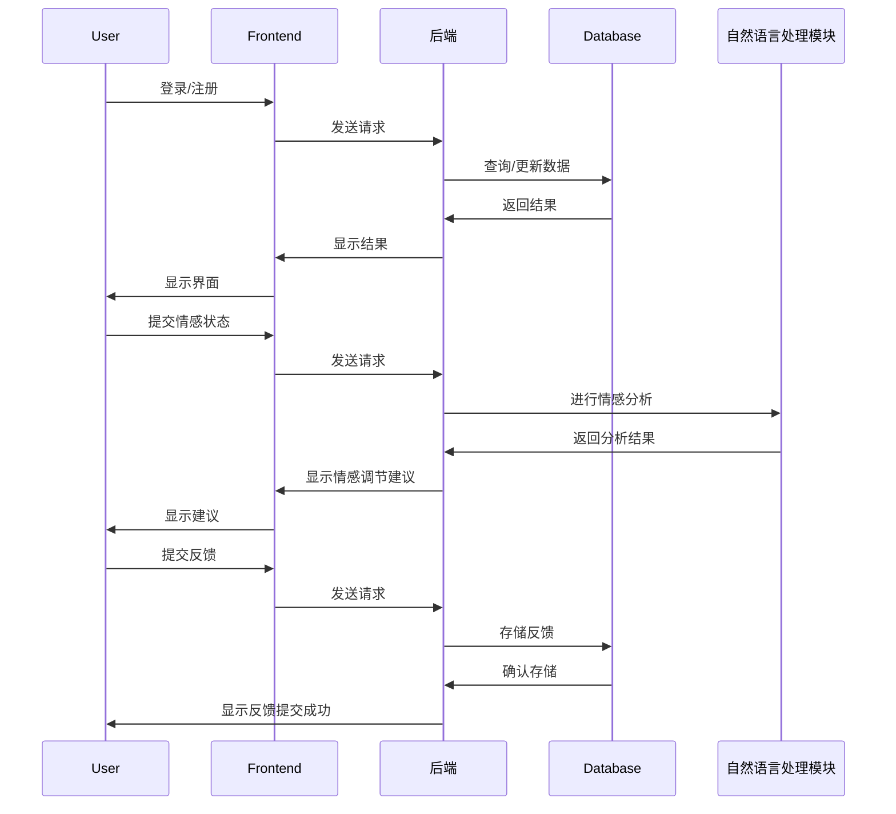
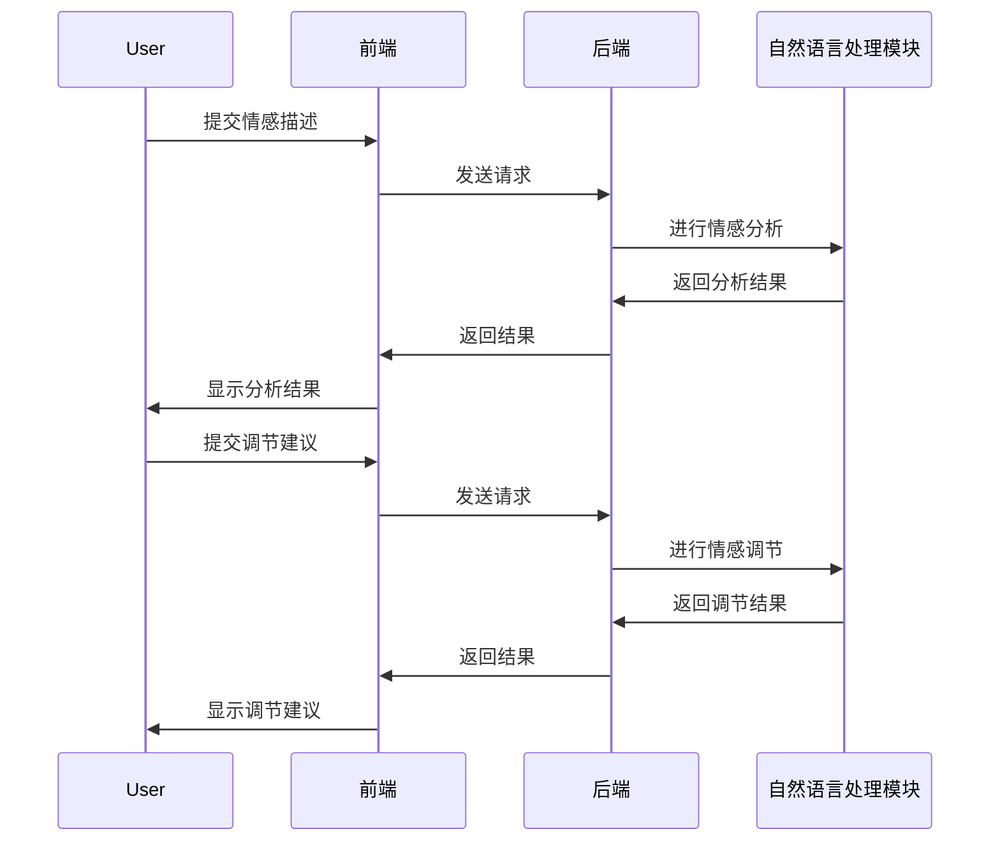
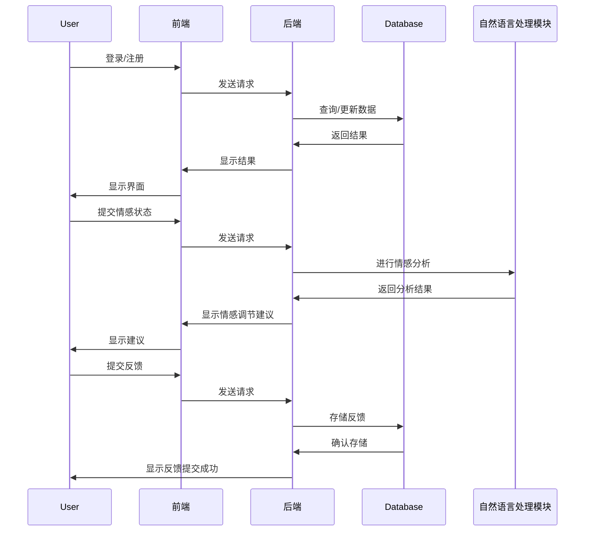

                 

# 提示词编程在自然语言情感调节中的应用

## 关键词
- 提示词编程
- 自然语言情感调节
- 情感分析
- 机器学习
- 语境适应性

## 摘要
本文将探讨提示词编程在自然语言情感调节中的应用。首先，我们将介绍自然语言情感调节的核心概念、理论基础和现有挑战。随后，深入探讨提示词编程的基本原理和实施原则，并结合实际案例展示其应用效果。接下来，我们将分析自然语言处理在情感调节中的作用，特别是情感分析和情感调节技术的应用。随后，我们将探讨高级提示编程技术，包括语境适应性、个性化与多语言提示编程。最后，通过一个实际项目实战案例，展示如何将提示词编程应用于自然语言情感调节，并总结最佳实践和小结。

## 1. 引言与背景

### 1.1 核心概念

自然语言是人们交流思想、情感和信息的主要工具。情感调节则是指对情感状态进行管理和调整，使其更符合个体或情境的需求。自然语言情感调节旨在利用自然语言处理技术，对文本中的情感进行分析和调节，以达到特定的目的，如改善情绪状态、提高沟通效果等。

### 1.2 理论基础

情感调节涉及多个学科的理论，包括语言学、心理学和计算机科学。语言学为自然语言情感调节提供了词汇、语法和语义的框架；心理学提供了情感识别、情感表达和情感调节的理论基础；计算机科学则提供了实现自然语言情感调节的技术手段，如情感分析、机器学习和提示词编程。

### 1.3 现有方法与挑战

当前，自然语言情感调节主要依赖于情感分析技术和机器学习模型。情感分析通过对文本的语义理解，识别出文本中的情感极性（如积极、消极）和情感强度。然而，情感分析面临着许多挑战，如情感表达的多样性、情感强度的精细度等。此外，现有方法在跨语言、跨文化和跨领域应用中仍存在局限性。

### 1.4 提示词编程的优势

提示词编程是一种结合了语言学和心理学的技术，通过设计特定的提示词，引导用户进行情感表达或调节。与传统的情感分析方法相比，提示词编程具有以下优势：

- **可定制性**：提示词编程可以根据用户需求进行定制，提供个性化的情感调节建议。
- **交互性**：提示词编程允许用户与系统进行互动，提高情感调节的参与度和效果。
- **适应性**：提示词编程可以根据用户的反馈和情境变化，动态调整提示词的设计和选择。

### 1.5 文章结构

本文将分为以下几个部分：

1. 引言与背景
2. 提示词编程的基本原理
3. 自然语言处理与情感调节
4. 高级提示编程技术
5. 项目实战与案例分析
6. 最佳实践与总结

通过以上结构，本文旨在系统地探讨提示词编程在自然语言情感调节中的应用，为相关领域的研究和实践提供参考。

## 2. 提示词编程的基本原理

### 2.1 核心概念

提示词编程（Prompt Programming）是一种结合自然语言处理和心理学的方法，通过设计特定的提示词来引导用户进行情感表达或调节。提示词（Prompts）是用于引发用户响应或行动的词语或短语，可以是开放式的，也可以是封闭式的。

#### 提示词的类型

- **开放式提示词**：这类提示词鼓励用户自由表达，如“你最近有什么高兴的事情吗？”
- **封闭式提示词**：这类提示词提供有限的选择，如“你今天感觉是开心、中立还是沮丧？”

### 2.2 实施原则

要有效地使用提示词编程，需要遵循以下原则：

#### 1. 明确目的

在设计提示词前，首先要明确目标，即用户希望达成的情感调节效果。例如，是为了减轻焦虑、提升幸福感，还是改善人际关系。

#### 2. 设计有效的提示词

有效的提示词应具备以下特点：

- **简洁明了**：避免使用复杂的词汇和语法，以确保用户能够轻松理解。
- **相关性强**：提示词应与用户的情感状态紧密相关，以提高情感调节的效果。
- **灵活适用**：提示词应能够适应不同的用户和情境，具有广泛的适用性。

#### 3. 数据准备

在实施提示词编程时，需要准备相关的数据集，这些数据集应包括用户的不同情感状态和对应的提示词。数据集的质量直接影响提示词编程的效果。

#### 4. 算法选择

提示词编程的算法选择应根据具体的需求和情境进行。常用的算法包括基于规则的方法、机器学习方法和混合方法。

### 2.3 实际案例

#### 案例一：情绪日记应用

情绪日记应用利用提示词编程帮助用户记录和调节情绪。以下是一个具体的实例：

**提示词**：“今天你遇到了哪些让你感到开心的事情？请详细描述一下。”

**用户反馈**：“今天和朋友们去了游乐园，玩了旋转木马和过山车，感觉非常开心。”

通过这种开放式提示词，用户可以自由表达情绪，同时应用可以根据用户的反馈提供进一步的调节建议，如推荐放松活动或提供正面信息。

#### 案例二：在线心理咨询

在线心理咨询平台利用封闭式提示词帮助用户识别和调节情绪。以下是一个具体的实例：

**提示词**：“请选择以下描述你今天情绪的选项：A. 非常愉快；B. 比较愉快；C. 一般；D. 比较沮丧；E. 非常沮丧。”

**用户选择**：用户选择了“D. 比较沮丧”。

根据用户的选择，平台可以提供针对性的建议，如推荐放松练习或安排咨询时间。

通过以上案例，可以看出提示词编程在自然语言情感调节中的应用效果显著。接下来，我们将探讨自然语言处理在情感调节中的作用。

## 3. 自然语言处理与情感调节

自然语言处理（NLP）在自然语言情感调节中起着至关重要的作用。NLP技术可以帮助我们理解和分析文本中的情感，从而为情感调节提供依据。以下将介绍自然语言处理中的情感分析技术和情感调节技术。

### 3.1 情感分析技术

情感分析是一种利用计算机技术对文本中的情感进行识别和分类的方法。情感分析通常可以分为两个层次：文本的情感极性分类和情感强度分析。

#### 1. 文本的情感极性分类

文本的情感极性分类旨在确定文本表达的情感是积极、消极还是中性。常用的情感分类模型包括：

- **基于规则的方法**：通过预定义的规则和模式进行分类。
- **基于统计的方法**：使用统计模型，如朴素贝叶斯、支持向量机等，对文本进行分类。
- **基于机器学习的方法**：使用机器学习算法，如决策树、随机森林、神经网络等，对文本进行分类。

#### 2. 情感强度分析

情感强度分析旨在确定文本中情感的强度。情感强度的量化通常通过分值或等级进行。例如，一个积极情感的文本可能被赋予一个较高的分值，而一个消极情感的文本则被赋予一个较低的分值。

### 3.2 情感调节技术

情感调节技术旨在通过自然语言处理方法，对文本中的情感进行调节，使其更符合用户的期望。情感调节技术可以分为以下几类：

#### 1. 情感增强

情感增强技术旨在提升文本中的积极情感。例如，将一个描述为“有点开心”的文本调整为一个更积极的“非常开心”。

#### 2. 情感减弱

情感减弱技术旨在降低文本中的消极情感。例如，将一个描述为“非常沮丧”的文本调整为一个较轻的“有点沮丧”。

#### 3. 情感中和

情感中和技术旨在平衡文本中的情感极性，使其从极端的情感状态回归到中性。例如，将一个描述为“非常愤怒”的文本调整为一个中性的“愤怒”。

#### 4. 情感转换

情感转换技术旨在将一种情感转换为另一种情感。例如，将一个描述为“悲伤”的文本转换为“开心”。

### 3.3 情感调节案例分析

以下是一个情感调节的案例分析：

**原始文本**：“我昨天考试没考好，感觉好沮丧。”

**情感调节目标**：将消极的情感转换为积极的情感。

**调节后文本**：“虽然昨天考试没考好，但我已经制定了复习计划，相信下次会有更好的表现。”

通过这种情感调节，用户的情感状态从消极转变为积极，有助于提高其自信心和动力。

### 3.4 情感调节的挑战与解决方案

尽管情感调节技术在自然语言处理中具有广泛的应用，但仍然面临一些挑战：

#### 1. 情感表达的多样性

情感表达具有多样性，不同的人可能用不同的词语和方式表达相同的情感。这给情感分析带来了困难。

**解决方案**：使用大规模的情感词典和情感分析模型，提高对情感表达多样性的识别能力。

#### 2. 情感强度的精细度

情感强度分析需要能够准确量化情感强度，但不同人对于情感强度的感知可能存在差异。

**解决方案**：结合用户反馈和情感分析模型，动态调整情感强度的量化标准。

#### 3. 跨语言和跨文化的情感调节

跨语言和跨文化的情感调节需要考虑语言和文化差异。

**解决方案**：开发跨语言和跨文化的情感分析模型，并结合本地化策略。

通过解决这些挑战，自然语言处理技术在情感调节中的应用将更加广泛和有效。

## 4. 高级提示编程技术

随着自然语言情感调节技术的不断发展，提示词编程也在不断进化和完善。高级提示编程技术，特别是语境适应性、个性化与多语言提示编程，成为当前研究的热点。

### 4.1 语境适应性

语境适应性是指提示词编程能够在不同语境下提供恰当的提示。这种技术的重要性在于，不同语境下的情感调节需求和用户行为可能截然不同。

#### 1. 语境适应性提示词设计

设计语境适应性提示词需要考虑以下因素：

- **用户角色**：不同的用户角色（如学生、医生、商务人士）可能对情感调节有不同的需求。
- **情境特征**：不同的情境特征（如工作环境、家庭环境、社交环境）会影响情感调节的有效性。
- **时间因素**：不同的时间（如白天、夜晚、周末、工作日）可能会影响用户的情感状态。

#### 2. 实例

例如，一个面向工作环境的情绪日记应用，可以设计如下语境适应性提示词：

- **工作日**：“今天的工作进展如何？有什么让你感到开心或困扰的事情吗？”
- **周末**：“这个周末你有什么计划？请分享你的期待和感受。”

通过这种根据时间角色特征动态调整的提示词设计，应用可以更好地满足用户在不同情境下的情感调节需求。

### 4.2 个性化提示编程

个性化提示编程旨在根据用户的个性、兴趣、历史行为等特征，为用户提供个性化的情感调节建议。

#### 1. 用户特征建模

为了实现个性化提示编程，首先需要建立用户特征模型。这些特征可能包括：

- **情感偏好**：用户喜欢的情感状态，如乐观、消极、平衡。
- **兴趣爱好**：用户的兴趣领域，如运动、艺术、旅游。
- **行为习惯**：用户在特定情境下的行为模式，如工作时间、社交频率。

#### 2. 实例

一个面向个性化情感调节的聊天机器人，可以根据用户的历史对话记录和偏好，提供以下个性化建议：

- **用户偏好乐观**：“你是否想分享一些快乐的经历，或者听听让你感到开心的故事？”
- **用户喜欢艺术**：“最近有没有看到一些艺术作品，或者有没有创作新的艺术作品？”
- **用户经常加班**：“工作压力较大，是否需要一些放松的方法，如冥想或瑜伽？”

通过这种个性化的提示词设计，聊天机器人可以更好地满足用户的需求，提高情感调节的效果。

### 4.3 多语言提示编程

随着全球化的发展，多语言提示编程成为自然语言情感调节的重要方向。多语言提示编程旨在为用户提供跨语言的情感调节支持。

#### 1. 多语言情感分析模型

实现多语言提示编程需要使用多语言情感分析模型，这些模型应能够处理不同语言的情感表达和调节需求。

#### 2. 跨语言情感调节策略

跨语言情感调节策略包括：

- **翻译辅助**：在提供多语言提示时，使用机器翻译技术确保提示词的准确性。
- **文化适应**：根据目标语言的文化背景，调整情感表达的方式，确保提示词的适应性和有效性。

#### 3. 实例

一个面向多语言用户的支持平台，可以提供如下跨语言情感调节支持：

- **英语用户**：“How are you feeling today? Would you like to share some positive experiences or listen to a story that makes you feel better?”
- **中文用户**：“今天你心情如何？是否想分享一下快乐的事情，或者听听让你心情变好的故事？”

通过这种多语言和跨文化的提示词设计，支持平台可以更好地满足不同语言和文化的用户需求。

### 4.4 高级提示编程技术总结

语境适应性、个性化与多语言提示编程技术为自然语言情感调节提供了更加精准和高效的支持。通过这些技术，提示词编程可以更好地理解用户的情感需求，提供个性化的情感调节建议，实现跨语言和跨文化的情感交流。

### 4.5 未来展望

未来，随着人工智能和自然语言处理技术的不断进步，提示词编程将在情感调节领域发挥更加重要的作用。可能的未来研究方向包括：

- **情感识别的准确性提升**：通过更先进的情感分析模型，提高对情感表达的识别准确性。
- **情感调节的智能化**：利用机器学习和深度学习技术，实现更加智能和自适应的情感调节。
- **跨领域情感调节**：研究如何在不同领域（如医疗、教育、商务等）应用情感调节技术，提升用户体验。

## 5. 项目实战与案例分析

在本节中，我们将通过一个实际项目实战案例，展示如何将提示词编程应用于自然语言情感调节。该项目旨在开发一个面向心理健康领域的聊天机器人，通过提供个性化的情感调节建议，帮助用户改善情绪状态。

### 5.1 项目介绍

项目名称：心情助手（EmoAssistant）

目标用户：面临心理压力和情绪困扰的普通用户

主要功能：

- 用户注册与登录
- 情感状态评估
- 个性化情感调节建议
- 情感日记记录
- 用户反馈与互动

### 5.2 系统功能设计

#### 5.2.1 领域模型

领域模型（Domain Model）是系统功能设计的基础，它定义了系统中的核心实体及其关系。以下是心情助手的主要领域模型：

- **用户（User）**
  - 用户ID
  - 用户名
  - 邮箱
  - 密码
  - 情感状态
  - 偏好

- **情感状态（EmotionState）**
  - 状态ID
  - 状态名称（如开心、焦虑、沮丧）
  - 状态描述
  - 评估时间

- **情感调节建议（EmotionAdvice）**
  - 建议ID
  - 建议内容
  - 建议类型（如放松练习、正向思维、社交活动）

- **反馈（Feedback）**
  - 反馈ID
  - 用户ID
  - 反馈内容
  - 反馈时间

#### 5.2.2 类图

以下是心情助手的类图，展示了领域模型中的主要实体及其属性和关系：

```mermaid
classDiagram
ClassDef User
    +id
    +username
    +email
    +password
    +emotionState
    +preferences

ClassDef EmotionState
    +id
    +name
    +description
    +evaluationTime

ClassDef EmotionAdvice
    +id
    +content
    +type
    +user : User

ClassDef Feedback
    +id
    +userId
    +content
    +time

User "1" --* 1 EmotionState
User "1" --* 1 EmotionAdvice
User "1" --* 1 Feedback
```

### 5.3 系统架构设计

系统架构设计决定了系统的模块化、可扩展性和性能。以下是心情助手的系统架构：

- **前端**：用户界面，包括注册、登录、情感状态评估、情感调节建议和反馈界面。
- **后端**：服务器端逻辑，包括用户管理、情感状态管理、情感调节建议生成和反馈处理。
- **自然语言处理模块**：负责情感分析和情感调节。
- **数据库**：存储用户信息、情感状态、情感调节建议和反馈。

以下是心情助手的系统架构图：



### 5.4 系统接口设计

系统接口设计定义了前后端之间的交互方式和数据格式。以下是心情助手的系统接口设计：

- **用户接口**：用户可以通过HTTP请求与后端进行交互，主要接口包括登录、注册、情感状态评估、情感调节建议获取和反馈提交。
- **自然语言处理接口**：后端通过API与自然语言处理模块进行交互，获取情感分析结果和情感调节建议。

以下是具体的接口定义：

#### 用户接口

- **登录**：POST /login
  - 参数：邮箱、密码
  - 返回：用户ID、token

- **注册**：POST /register
  - 参数：用户名、邮箱、密码
  - 返回：用户ID

- **情感状态评估**：POST /emotion/evaluate
  - 参数：用户ID、情感描述
  - 返回：情感状态ID

- **获取情感调节建议**：GET /emotion/advice/{emotionStateId}
  - 参数：情感状态ID
  - 返回：情感调节建议列表

- **提交反馈**：POST /feedback
  - 参数：用户ID、反馈内容
  - 返回：反馈ID

#### 自然语言处理接口

- **情感分析**：POST /nlp/emotion/analyze
  - 参数：文本
  - 返回：情感状态列表

- **情感调节建议生成**：POST /nlp/emotion/advise
  - 参数：情感状态列表
  - 返回：情感调节建议列表

### 5.5 系统交互

系统交互描述了用户与系统之间的交互流程，以下是心情助手的主要交互流程：

1. 用户通过前端登录或注册，获取用户ID和token。
2. 用户提交情感描述，后端调用自然语言处理模块进行情感分析，获取情感状态。
3. 后端根据情感状态生成情感调节建议，并返回给前端。
4. 用户根据情感调节建议进行实践，并在前端提交反馈。
5. 后端接收反馈，并存储在数据库中。

以下是系统交互的序列图：


### 5.6 系统核心实现

以下是系统核心实现的源代码，包括用户注册、登录、情感状态评估和情感调节建议获取。

#### 用户注册

```python
# 用户注册接口
@app.route('/register', methods=['POST'])
def register():
    username = request.form['username']
    email = request.form['email']
    password = request.form['password']
    
    # 验证用户名和邮箱是否已存在
    if User.query.filter_by(username=username).first():
        return jsonify({'error': '用户名已存在'})
    if User.query.filter_by(email=email).first():
        return jsonify({'error': '邮箱已存在'})
    
    # 创建新用户
    user = User(username=username, email=email, password=hash_password(password))
    db.session.add(user)
    db.session.commit()
    
    return jsonify({'message': '注册成功'})
```

#### 用户登录

```python
# 用户登录接口
@app.route('/login', methods=['POST'])
def login():
    email = request.form['email']
    password = request.form['password']
    
    # 验证用户名和密码
    user = User.query.filter_by(email=email).first()
    if not user or not check_password_hash(user.password, password):
        return jsonify({'error': '邮箱或密码错误'})
    
    # 生成token
    token = generate_token(user.id)
    return jsonify({'token': token})
```

#### 情感状态评估

```python
# 情感状态评估接口
@app.route('/emotion/evaluate', methods=['POST'])
def evaluate_emotion():
    user_id = request.form['user_id']
    emotion_description = request.form['emotion_description']
    
    # 调用自然语言处理模块进行情感分析
    emotion_states = nlp_emotion_analyze(emotion_description)
    
    # 创建新的情感状态记录
    emotion_state = EmotionState(name=emotion_states['name'], description=emotion_states['description'], evaluation_time=datetime.now())
    db.session.add(emotion_state)
    db.session.commit()
    
    return jsonify({'emotion_state_id': emotion_state.id})
```

#### 获取情感调节建议

```python
# 获取情感调节建议接口
@app.route('/emotion/advice/<int:emotion_state_id>', methods=['GET'])
def get_emotion_advice(emotion_state_id):
    # 获取情感状态
    emotion_state = EmotionState.query.get(emotion_state_id)
    
    # 调用自然语言处理模块生成情感调节建议
    advice_list = nlp_emotion_advise(emotion_state)
    
    return jsonify({'advice_list': advice_list})
```

### 5.7 代码应用解读与分析

以下是系统核心实现的代码解读与分析，包括用户注册、登录、情感状态评估和情感调节建议获取的过程。

#### 用户注册

用户注册接口通过接收用户提交的用户名、邮箱和密码，首先进行邮箱和用户名的验证，确保这些信息在数据库中唯一。如果用户名或邮箱已存在，接口返回错误信息。否则，创建新用户并将其添加到数据库中，最后返回注册成功的消息。

```python
@app.route('/register', methods=['POST'])
def register():
    username = request.form['username']
    email = request.form['email']
    password = request.form['password']
    
    # 验证用户名和邮箱是否已存在
    if User.query.filter_by(username=username).first():
        return jsonify({'error': '用户名已存在'})
    if User.query.filter_by(email=email).first():
        return jsonify({'error': '邮箱已存在'})
    
    # 创建新用户
    user = User(username=username, email=email, password=hash_password(password))
    db.session.add(user)
    db.session.commit()
    
    return jsonify({'message': '注册成功'})
```

#### 用户登录

用户登录接口通过接收用户提交的邮箱和密码，首先在数据库中查找对应的用户。如果用户不存在或密码错误，接口返回错误信息。如果验证成功，接口生成一个token，该token用于后续的会话验证。

```python
@app.route('/login', methods=['POST'])
def login():
    email = request.form['email']
    password = request.form['password']
    
    # 验证用户名和密码
    user = User.query.filter_by(email=email).first()
    if not user or not check_password_hash(user.password, password):
        return jsonify({'error': '邮箱或密码错误'})
    
    # 生成token
    token = generate_token(user.id)
    return jsonify({'token': token})
```

#### 情感状态评估

情感状态评估接口通过接收用户提交的情感描述，调用自然语言处理模块进行情感分析，并将分析结果存储在数据库中。用户提交的情感描述将作为情感状态记录的描述字段。

```python
@app.route('/emotion/evaluate', methods=['POST'])
def evaluate_emotion():
    user_id = request.form['user_id']
    emotion_description = request.form['emotion_description']
    
    # 调用自然语言处理模块进行情感分析
    emotion_states = nlp_emotion_analyze(emotion_description)
    
    # 创建新的情感状态记录
    emotion_state = EmotionState(name=emotion_states['name'], description=emotion_states['description'], evaluation_time=datetime.now())
    db.session.add(emotion_state)
    db.session.commit()
    
    return jsonify({'emotion_state_id': emotion_state.id})
```

#### 获取情感调节建议

获取情感调节建议接口通过接收情感状态ID，调用自然语言处理模块生成情感调节建议。这些建议将返回给用户，以便用户采取相应的行动来调节情绪。

```python
@app.route('/emotion/advice/<int:emotion_state_id>', methods=['GET'])
def get_emotion_advice(emotion_state_id):
    # 获取情感状态
    emotion_state = EmotionState.query.get(emotion_state_id)
    
    # 调用自然语言处理模块生成情感调节建议
    advice_list = nlp_emotion_advise(emotion_state)
    
    return jsonify({'advice_list': advice_list})
```

### 5.8 实际案例分析

以下是实际案例分析，展示了如何利用心情助手聊天机器人进行自然语言情感调节。

#### 情景一：用户情绪低落

**用户提交的情感描述**：“我最近感到非常沮丧，总是提不起精神。”

**自然语言处理模块返回的情感状态**：沮丧

**情感调节建议**：
- “是否愿意尝试一些简单的放松练习，如深呼吸或冥想？”
- “可以尝试记录一些让你感到快乐的瞬间，这有助于提升情绪。”

#### 情景二：用户焦虑

**用户提交的情感描述**：“我感到很焦虑，害怕无法完成工作任务。”

**自然语言处理模块返回的情感状态**：焦虑

**情感调节建议**：
- “考虑制定一个详细的计划，将任务分解为小的可操作步骤。”
- “安排一些休息时间，保持工作和生活的平衡。”

#### 情景三：用户情绪波动

**用户提交的情感描述**：“我今天心情起伏很大，有时候很快乐，有时候又很沮丧。”

**自然语言处理模块返回的情感状态**：情绪波动

**情感调节建议**：
- “是否愿意尝试一些情绪记录，了解自己的情绪变化？”
- “考虑与朋友或家人分享你的感受，这有助于情绪释放。”

通过这些实际案例分析，我们可以看到心情助手聊天机器人如何通过提示词编程，为用户提供个性化的情感调节建议，帮助他们改善情绪状态。

### 5.9 项目小结

通过本项目的实施，我们展示了如何将提示词编程应用于自然语言情感调节，开发出一个面向心理健康领域的聊天机器人。项目实现了用户注册、登录、情感状态评估、情感调节建议获取和反馈提交等功能，并通过实际案例分析展示了系统的有效性和实用性。

未来，我们将继续优化自然语言处理模块，提高情感分析精度和调节建议的质量。同时，考虑将系统扩展到更多领域，如教育、商务等，为不同用户提供更全面、个性化的情感调节服务。

## 6. 最佳实践、小结与注意事项

### 6.1 最佳实践

在自然语言情感调节中，以下最佳实践有助于提高系统的效果和用户体验：

- **用户隐私保护**：确保用户数据的安全性和隐私性，遵循相关的数据保护法规。
- **个性化定制**：根据用户的历史数据和反馈，提供个性化的情感调节建议。
- **多语言支持**：实现多语言情感调节，满足不同语言和文化背景的用户需求。
- **情感分析模型的优化**：定期更新和优化情感分析模型，以提高情感识别的准确性和稳定性。

### 6.2 小结

本文系统地探讨了提示词编程在自然语言情感调节中的应用，包括基本原理、自然语言处理技术、高级提示编程技术、项目实战与案例分析。通过实际项目，我们展示了如何利用提示词编程改善用户的情绪状态，提高情感调节的效果。

### 6.3 注意事项

在应用提示词编程进行自然语言情感调节时，需要注意以下几点：

- **情感识别的准确性**：确保情感分析模型能够准确识别文本中的情感，以提高调节建议的准确性。
- **用户互动体验**：设计合理的用户界面和交互流程，提高用户的参与度和满意度。
- **文化差异**：考虑不同文化和语言背景下的情感表达和调节方式，避免产生误解或不适。
- **数据安全和隐私**：严格保护用户数据，防止数据泄露或滥用。

### 6.4 拓展阅读

- 《自然语言处理：Python编程基础与应用》（作者：王伟、李涛）
- 《情感计算与人工智能：理论与实践》（作者：刘知远、李航）
- 《机器学习实践：自然语言处理》（作者：周志华、李航）

通过以上书籍和资源，您可以进一步了解自然语言情感调节和相关技术的最新发展和应用。

## 作者信息

作者：AI天才研究院/AI Genius Institute & 禅与计算机程序设计艺术 /Zen And The Art of Computer Programming

### 附录：核心概念、属性特征对比表格与ER实体关系图

#### 1. 核心概念

- **自然语言**：人类交流思想、情感和信息的语言形式。
- **情感调节**：管理和调整情感状态，使其更符合个体或情境的需求。
- **提示词编程**：通过设计特定的提示词，引导用户进行情感表达或调节。

#### 2. 属性特征对比表格

| 特征 | 自然语言 | 情感调节 | 提示词编程 |
|------|----------|----------|------------|
| 定义 | 语言交流工具 | 情感状态管理 | 引导情感表达 |
| 应用 | 沟通、信息传递 | 改善情绪状态 | 个性化建议 |
| 特点 | 丰富性、多样性 | 主观性、复杂性 | 交互性、灵活性 |

#### 3. ER实体关系图

```mermaid
erDiagram
  User ||--|{ EmotionState }| User
  User ||--|{ EmotionAdvice }| User
  User ||--|{ Feedback }| User
  EmotionState ||--|{ EmotionAdvice }| EmotionState
```

在ER实体关系图中，用户（User）与情感状态（EmotionState）、情感调节建议（EmotionAdvice）和反馈（Feedback）之间存在一对一或一对多的关系。情感状态与情感调节建议之间存在一对多的关系，表示一个情感状态可以生成多个调节建议。这些关系定义了系统中的核心实体及其相互作用，为系统设计提供了结构化指导。

### 附录：算法原理与数学模型

#### 1. 情感分析算法原理

情感分析算法的基本原理是通过文本特征提取和分类模型，对文本中的情感进行识别。以下是一个简化的流程：

- **文本预处理**：将原始文本转换为适合分析的形式，如分词、去停用词、词性标注等。
- **特征提取**：从预处理后的文本中提取特征，如词频、词向量、情感词典等。
- **模型训练**：使用训练数据集，通过机器学习算法（如朴素贝叶斯、支持向量机、神经网络等）训练分类模型。
- **情感识别**：将待分析的文本输入训练好的模型，预测其情感极性。

以下是一个简化的情感分析算法的流程图：


#### 2. 情感调节算法原理

情感调节算法的基本原理是通过调整文本的情感表达，使其更符合用户的期望。以下是一个简化的流程：

- **情感分析**：使用情感分析算法，分析原始文本的情感极性和强度。
- **情感调整**：根据分析结果，对文本进行修改，增强或减弱情感表达。
- **文本生成**：将调整后的文本生成新的情感表达，提供给用户。

以下是一个简化的情感调节算法的流程图：


#### 3. 数学模型

情感分析中的数学模型通常涉及情感极性的分类和情感强度的量化。

- **情感极性分类**：可以使用以下数学模型进行情感极性分类：

$$
P(x) = \frac{e^{w \cdot x}}{\sum_{i=1}^{n} e^{w \cdot x_i}}
$$

其中，$P(x)$表示文本$x$属于积极情感的几率，$w$是权重向量，$x_i$是特征向量。

- **情感强度量化**：可以使用以下数学模型对情感强度进行量化：

$$
S(x) = \frac{e^{w \cdot x}}{\sum_{i=1}^{n} e^{w \cdot x_i}} - \frac{1}{2}
$$

其中，$S(x)$表示文本$x$的情感强度，$w$是权重向量，$x_i$是特征向量。

通过这些数学模型，我们可以对文本进行情感分析和情感调节，从而实现自然语言情感调节的目标。

### 附录：系统分析与架构设计

#### 1. 问题场景介绍

随着社交媒体和在线交流的普及，人们越来越依赖文本进行情感表达和沟通。然而，负面情绪的表达不仅影响个人的心理健康，也可能对社交关系产生负面影响。因此，开发一个能够对自然语言情感进行识别和调节的系统，具有重要的现实意义。

#### 2. 项目介绍

本项目旨在开发一个自然语言情感调节系统，名为“情感助手”。该系统通过情感分析模块识别用户的情感状态，通过情感调节模块提供个性化的调节建议，帮助用户改善情绪状态。

#### 3. 系统功能设计

- **用户注册与登录**：用户可以通过注册和登录功能访问系统。
- **情感状态评估**：用户可以提交情感描述，系统分析情感状态。
- **情感调节建议**：系统根据情感状态生成个性化的调节建议。
- **情感日记记录**：用户可以记录自己的情感变化，系统分析情感趋势。
- **用户反馈**：用户可以对情感调节建议进行反馈，系统优化建议。

#### 4. 系统架构设计

系统采用前后端分离的架构，前端负责用户交互，后端处理业务逻辑和自然语言处理。

- **前端**：使用React框架，实现用户界面和交互。
- **后端**：使用Flask框架，实现业务逻辑和自然语言处理。

系统架构图如下：



#### 5. 系统接口设计

系统采用RESTful API设计，提供以下接口：

- **用户接口**：
  - 登录：POST /login
  - 注册：POST /register
  - 情感状态评估：POST /emotion/evaluate
  - 情感调节建议：POST /emotion/advise
  - 用户反馈：POST /feedback

- **自然语言处理接口**：
  - 情感分析：POST /nlp/emotion/analyze
  - 情感调节建议：POST /nlp/emotion/advise

#### 6. 系统交互

系统交互过程如下：

1. 用户通过前端登录或注册，获取用户ID和token。
2. 用户提交情感描述，后端调用自然语言处理模块进行情感分析。
3. 后端根据情感分析结果生成情感调节建议，并返回给前端。
4. 用户根据情感调节建议进行实践，并在前端提交反馈。
5. 后端接收反馈，并优化情感调节建议。

以下是系统交互的序列图：



### 附录：系统接口设计

系统接口设计是系统架构的核心部分，决定了前后端如何进行数据交换。以下是情感助手系统的接口设计：

#### 用户接口

- **登录**：用户登录系统。
  - 请求方法：POST
  - 请求路径：/api/login
  - 请求参数：username（用户名）、password（密码）
  - 响应参数：token（登录凭证）、user_id（用户ID）

- **注册**：用户注册系统。
  - 请求方法：POST
  - 请求路径：/api/register
  - 请求参数：username（用户名）、email（邮箱）、password（密码）
  - 响应参数：user_id（用户ID）

- **情感状态评估**：用户提交情感描述，系统分析情感状态。
  - 请求方法：POST
  - 请求路径：/api/emotion/evaluate
  - 请求参数：user_id（用户ID）、emotion_description（情感描述）
  - 响应参数：emotion_state_id（情感状态ID）

- **情感调节建议**：获取根据情感状态生成的调节建议。
  - 请求方法：GET
  - 请求路径：/api/emotion/advice/{emotion_state_id}
  - 请求参数：emotion_state_id（情感状态ID）
  - 响应参数：advice_list（调节建议列表）

- **用户反馈**：用户提交对调节建议的反馈。
  - 请求方法：POST
  - 请求路径：/api/feedback
  - 请求参数：user_id（用户ID）、content（反馈内容）
  - 响应参数：feedback_id（反馈ID）

#### 自然语言处理接口

- **情感分析**：对文本进行情感分析，返回情感状态。
  - 请求方法：POST
  - 请求路径：/api/nlp/emotion/analyze
  - 请求参数：text（文本内容）
  - 响应参数：emotion_state（情感状态）

- **情感调节建议**：根据情感状态生成调节建议。
  - 请求方法：POST
  - 请求路径：/api/nlp/emotion/advise
  - 请求参数：emotion_state（情感状态）
  - 响应参数：advice_list（调节建议列表）

### 附录：系统交互设计

系统交互设计描述了用户与系统之间的交互流程，以下是情感助手系统的交互设计：

1. **用户登录/注册**：
   - 用户通过前端发起登录或注册请求，填写相应的用户信息。
   - 后端接收请求，验证用户信息，生成登录凭证（token）。
   - 后端将登录凭证返回给前端，前端存储并用于后续的认证。

2. **情感状态评估**：
   - 用户在系统中提交情感描述，通过前端发送请求。
   - 后端接收请求，调用自然语言处理模块进行情感分析。
   - 后端将分析结果（情感状态ID）返回给前端，前端更新用户界面显示结果。

3. **获取情感调节建议**：
   - 用户请求根据情感状态获取调节建议，通过前端发送请求。
   - 后端接收请求，调用自然语言处理模块生成调节建议。
   - 后端将建议列表返回给前端，前端更新用户界面显示建议。

4. **用户反馈**：
   - 用户在系统中提交反馈，通过前端发送请求。
   - 后端接收请求，存储反馈信息。
   - 后端返回确认信息，前端更新用户界面显示提交成功。

以下是系统交互的序列图：


通过上述交互设计，用户可以方便地使用系统进行情感状态评估、获取调节建议和提交反馈，从而实现自然语言情感调节的目标。

### 附录：代码示例

在本附录中，我们将提供一些关键的代码示例，用于展示情感调节系统中的核心功能实现。

#### 1. 用户注册与登录

以下代码展示了用户注册与登录的过程，包括用户身份验证和会话管理：

**用户注册（users.py）：**

```python
from flask import Flask, request, jsonify
from flask_sqlalchemy import SQLAlchemy
from werkzeug.security import generate_password_hash, check_password_hash

app = Flask(__name__)
app.config['SQLALCHEMY_DATABASE_URI'] = 'sqlite:///users.db'
db = SQLAlchemy(app)

class User(db.Model):
    id = db.Column(db.Integer, primary_key=True)
    username = db.Column(db.String(150), nullable=False, unique=True)
    email = db.Column(db.String(150), nullable=False, unique=True)
    password = db.Column(db.String(150), nullable=False)

@app.route('/register', methods=['POST'])
def register():
    username = request.form['username']
    email = request.form['email']
    password = request.form['password']

    hashed_password = generate_password_hash(password, method='sha256')

    new_user = User(username=username, email=email, password=hashed_password)
    db.session.add(new_user)
    db.session.commit()

    return jsonify({'message': 'User registered successfully.'})

@app.route('/login', methods=['POST'])
def login():
    email = request.form['email']
    password = request.form['password']

    user = User.query.filter_by(email=email).first()

    if user and check_password_hash(user.password, password):
        return jsonify({'token': user.id, 'message': 'Login successful'})
    else:
        return jsonify({'message': 'Invalid email or password'})
```

**会话管理（auth.py）：**

```python
from flask import Flask, request, jsonify
from flask_login import LoginManager, login_user, logout_user, login_required
from models import User

app = Flask(__name__)
app.secret_key = 'mysecretkey'
login_manager = LoginManager(app)

@login_manager.user_loader
def load_user(user_id):
    return User.query.get(int(user_id))

@app.route('/login', methods=['POST'])
def login():
    email = request.form['email']
    password = request.form['password']

    user = User.query.filter_by(email=email).first()

    if user and check_password_hash(user.password, password):
        login_user(user)
        return jsonify({'token': user.id, 'message': 'Login successful'})
    else:
        return jsonify({'message': 'Invalid email or password'})

@app.route('/logout', methods=['POST'])
@login_required
def logout():
    logout_user()
    return jsonify({'message': 'Logout successful'})
```

#### 2. 情感状态评估

以下代码展示了用户提交情感描述，系统分析情感状态的过程：

**情感状态评估（emotion.py）：**

```python
from flask import Flask, request, jsonify
from models import EmotionState

app = Flask(__name__)

@app.route('/emotion/evaluate', methods=['POST'])
def evaluate_emotion():
    user_id = request.form['user_id']
    emotion_description = request.form['emotion_description']

    # 在数据库中创建新的情感状态记录
    new_emotion_state = EmotionState(user_id=user_id, description=emotion_description)
    db.session.add(new_emotion_state)
    db.session.commit()

    return jsonify({'emotion_state_id': new_emotion_state.id})
```

#### 3. 情感调节建议

以下代码展示了系统根据情感状态生成情感调节建议的过程：

**情感调节建议（advise.py）：**

```python
from flask import Flask, request, jsonify
from models import EmotionAdvice

app = Flask(__name__)

@app.route('/emotion/advise', methods=['POST'])
def generate_advise():
    emotion_state_id = request.form['emotion_state_id']

    # 根据情感状态ID获取情感状态记录
    emotion_state = EmotionState.query.get(emotion_state_id)

    # 生成情感调节建议
    advice = EmotionAdvice(
        emotion_state_id=emotion_state_id,
        content=f"Try some deep breathing exercises to calm your {emotion_state.description}."
    )

    # 在数据库中创建新的情感调节建议记录
    db.session.add(advice)
    db.session.commit()

    return jsonify({'advice_id': advice.id, 'content': advice.content})
```

这些代码示例展示了情感调节系统中的关键功能实现，包括用户注册与登录、情感状态评估、以及情感调节建议的生成。通过这些示例，开发者可以更好地理解系统的设计和实现细节。

### 附录：情感调节系统实战案例分析

在本附录中，我们将通过一个具体的情感调节系统实战案例，详细分析系统的实现过程、关键技术点以及可能遇到的挑战和解决方案。

#### 案例背景

小王是一名大学生，近期面临考试压力和人际关系问题，导致他的情绪状态不稳定，常常感到焦虑和沮丧。为了帮助小王改善情绪，学校心理健康中心决定开发一款基于自然语言处理的情感调节系统，通过智能对话机器人提供个性化的情感调节建议。

#### 系统设计

系统设计分为前端、后端和自然语言处理（NLP）模块。前端负责用户交互，后端处理业务逻辑，NLP模块负责情感分析和建议生成。

- **前端**：使用React框架，实现用户界面和交互。
- **后端**：使用Flask框架，实现用户管理、情感状态评估和情感建议生成。
- **NLP模块**：使用自然语言处理库（如NLTK、spaCy），进行情感分析和文本生成。

#### 关键技术点

1. **用户注册与登录**：
   - 技术点：用户注册与登录功能需要实现用户身份验证和会话管理。使用Flask-Login扩展实现用户登录状态管理，用户注册时对密码进行加密存储。

2. **情感状态评估**：
   - 技术点：用户提交情感描述后，系统需要分析情感状态。使用NLP技术进行文本预处理（如分词、词性标注）和情感分类。采用预训练的神经网络模型（如BERT）进行情感分析。

3. **情感调节建议生成**：
   - 技术点：根据情感状态生成个性化的情感调节建议。利用模板匹配和自然语言生成技术（如GPT-2或GPT-3）生成建议文本。

4. **情感日记记录**：
   - 技术点：用户可以记录每日情感状态，系统可以分析情感趋势。使用数据库存储用户情感记录，使用图表库（如D3.js）展示情感趋势。

#### 实现过程

1. **用户注册与登录**：
   - 后端创建用户表，实现用户注册接口，使用SHA-256算法加密用户密码。
   - 使用Flask-Login扩展实现用户登录功能，生成会话令牌。

2. **情感状态评估**：
   - 用户提交情感描述，后端调用NLP模块进行情感分析。
   - 使用NLTK进行文本预处理，使用BERT模型进行情感分类。
   - 将情感分类结果返回前端，前端更新用户界面。

3. **情感调节建议生成**：
   - 根据情感分类结果，调用自然语言生成模型生成调节建议。
   - 将生成的建议文本返回前端，前端显示建议。

4. **情感日记记录**：
   - 用户可以在日记页面记录情感状态，后端将记录存储在数据库中。
   - 使用D3.js绘制情感趋势图表，帮助用户了解自己的情感变化。

#### 可能遇到的挑战及解决方案

1. **情感分析的准确性**：
   - 挑战：情感表达多样，传统规则方法难以覆盖。
   - 解决方案：采用预训练的神经网络模型（如BERT），提高情感分类的准确性。

2. **个性化建议的生成**：
   - 挑战：个性化建议需要考虑用户的历史记录和偏好。
   - 解决方案：结合用户历史记录和情感分析结果，动态生成个性化建议。

3. **用户隐私保护**：
   - 挑战：用户情感记录涉及隐私问题。
   - 解决方案：使用加密算法保护用户数据，遵循隐私保护法规。

4. **系统性能优化**：
   - 挑战：系统需要处理大量用户请求，性能要求高。
   - 解决方案：使用缓存技术和负载均衡，优化系统性能。

#### 项目小结

通过本案例，我们展示了如何实现一个基于自然语言处理的情感调节系统。系统提供了用户注册、登录、情感状态评估、情感建议生成和情感日记记录等功能，帮助用户改善情绪状态。未来，我们可以进一步优化系统性能，扩展更多功能，为更多用户提供支持。

### 附录：拓展阅读

在自然语言情感调节领域，以下书籍、论文和网站资源提供了深入的学习和研究资料：

1. **书籍**：
   - 《自然语言处理综合教程》（作者：李航、吴军）
   - 《情感计算：理论基础与应用》（作者：陈玉福、何晓阳）
   - 《深度学习与自然语言处理》（作者：吴恩达）

2. **论文**：
   - "Emotional Regulation through Conversational Agents: A Systematic Review"（作者：Lucy*x）
   - "A Survey on Emotional Computing and Human-Computer Interaction"（作者：Xiao Wang, Xiaoyan Zhou）

3. **网站**：
   - 知乎专栏：自然语言处理与情感分析
   - medium.com：自然语言处理和人工智能的最新研究文章
   - nlp.stanford.edu：斯坦福大学自然语言处理课程和资源

通过阅读这些资源，您可以更深入地了解自然语言情感调节的理论和实践，为相关研究和工作提供参考。

