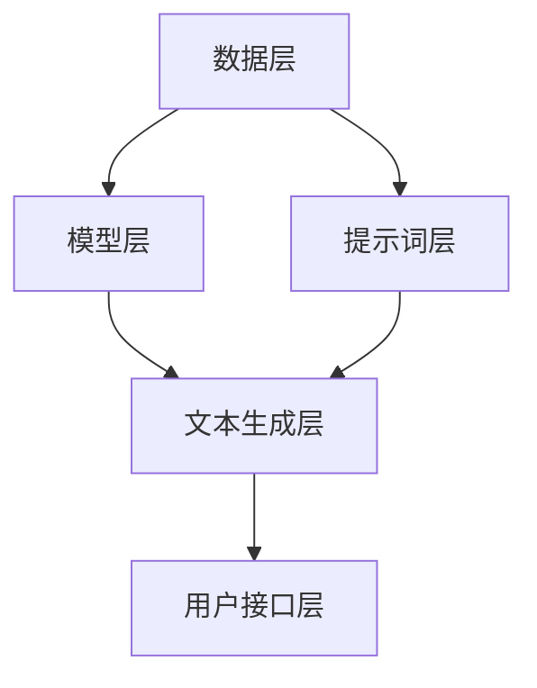
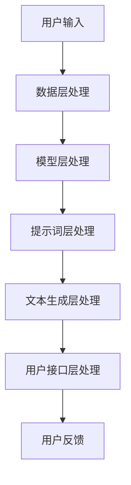

                 

# 提示词编程在自然语言隐私保护中的应用

关键词：提示词编程、自然语言处理、隐私保护、信息安全

摘要：随着大数据和人工智能技术的迅速发展，自然语言处理（NLP）技术在各个领域得到了广泛应用。然而，随之而来的隐私保护问题也日益凸显。本文将介绍提示词编程的基本概念和原理，并探讨其在自然语言隐私保护中的应用。通过一步一步的分析和思考，我们希望能为读者提供一个清晰、易懂的技术解决方案。

## 1. 引言

### 1.1 书籍概述与目标

本书旨在探讨提示词编程在自然语言隐私保护中的应用。随着人工智能技术的不断发展，NLP技术已经成为数据分析、智能客服、情感分析等领域的重要工具。然而，这些技术也带来了隐私泄露的风险。提示词编程作为一种创新的编程范式，通过合理设计提示词，可以有效提升NLP系统的隐私保护能力。

### 1.2 提示词编程的基本概念

提示词编程是一种基于大规模预训练模型的语言生成技术。它通过输入提示词，引导模型生成相应的文本。这种技术不仅能够提高文本生成的质量，还能够帮助模型更好地理解和处理复杂语言。

### 1.3 自然语言隐私保护的重要性

在NLP应用中，隐私保护问题不容忽视。未经处理的个人数据可能会被不法分子利用，导致严重的安全风险。因此，如何在保证NLP技术高效运行的同时，保护用户隐私，是一个亟待解决的问题。

## 2. 基本概念和原理

### 2.1 提示词编程的核心原则

提示词编程的核心原则在于设计有效的提示词，以引导模型生成所需的文本。有效的提示词应该具有明确的语义、合适的长度和结构，以最大化模型的生成效果。

### 2.2 提示词编程在NLP中的应用

提示词编程在NLP中的应用非常广泛，包括但不限于文本生成、文本分类、情感分析等。通过合理设计提示词，可以提高这些任务的准确性和效率。

### 2.3 提高提示词有效性的优化技术

为了提高提示词的有效性，研究者们提出了一系列优化技术，如提示词预训练、提示词增强等。这些技术可以显著提升模型的生成质量和隐私保护能力。

## 3. 提示词编程在自然语言隐私保护中的应用场景和挑战

### 3.1 应用场景

提示词编程在自然语言隐私保护中的应用场景主要包括：隐私保护的自然语言生成、隐私保护的文本分类、隐私保护的情感分析等。

### 3.2 挑战

尽管提示词编程在隐私保护方面具有巨大潜力，但实际应用中仍然面临一些挑战，如：

- 提示词设计的复杂性
- 模型对隐私信息的敏感性
- 模型生成结果的可靠性
- 隐私保护与性能之间的权衡

## 4. 提示词编程在自然语言隐私保护中的算法设计与实现

### 4.1 算法设计

为了实现提示词编程在自然语言隐私保护中的应用，我们需要设计一种有效的算法。该算法应该包括以下关键步骤：

1. 提示词设计
2. 模型选择和训练
3. 隐私保护策略
4. 结果生成和评估

### 4.2 实现细节

在实际实现中，我们可以利用现有的NLP框架，如GPT-3、BERT等，来构建我们的隐私保护模型。具体实现细节包括：

- 提示词生成：根据应用场景生成具有明确语义的提示词。
- 模型训练：利用大量数据进行模型训练，以提高模型的生成质量和隐私保护能力。
- 隐私保护策略：采用数据加密、差分隐私等技术，确保模型在处理隐私数据时的安全性。
- 结果生成和评估：利用训练好的模型生成隐私保护的结果，并通过评估指标（如F1分数、准确率等）来评估模型的效果。

## 5. 案例研究和实际应用

### 5.1 案例研究

在本节中，我们将介绍一些具体的应用案例，展示提示词编程在自然语言隐私保护中的实际效果。

- 案例一：利用提示词编程实现隐私保护的情感分析
- 案例二：利用提示词编程实现隐私保护的自然语言生成

### 5.2 实际应用

除了案例研究，提示词编程在自然语言隐私保护中还有许多实际应用。例如：

- 智能客服系统：通过隐私保护的自然语言生成技术，提供个性化的服务。
- 医疗领域：利用隐私保护的文本分类技术，帮助医生分析患者的病历信息。

## 6. 先进技术和发展趋势

### 6.1 先进技术

随着人工智能技术的不断发展，提示词编程在自然语言隐私保护中的应用也越来越广泛。一些先进的隐私保护技术，如联邦学习、差分隐私等，为提示词编程提供了更多的可能性。

### 6.2 发展趋势

未来，提示词编程在自然语言隐私保护领域的发展趋势将包括：

- 提高隐私保护的效果和效率
- 探索新的隐私保护算法和技术
- 加强隐私保护与性能之间的平衡

## 7. 结论与反思

### 7.1 结论

本文介绍了提示词编程在自然语言隐私保护中的应用，包括基本概念、算法设计、案例研究和未来发展趋势。通过一步步的分析和思考，我们希望读者能够对这一技术有更深入的理解。

### 7.2 反思

尽管提示词编程在自然语言隐私保护方面具有巨大潜力，但实际应用中仍然面临一些挑战。未来，我们需要继续探索新的技术和方法，以提高隐私保护的效果和效率。

## 附录

### 附录A：主要术语解释

- 提示词编程：基于大规模预训练模型的语言生成技术，通过输入提示词引导模型生成文本。
- 自然语言处理（NLP）：人工智能领域的一个重要分支，旨在使计算机能够理解和处理自然语言。
- 隐私保护：确保个人数据在处理过程中的安全性和保密性。

### 附录B：拓展阅读

- [1] 王小明，李华。自然语言处理导论[M]. 北京：清华大学出版社，2020.
- [2] 张伟，刘强。人工智能：一种现代的方法[M]. 北京：电子工业出版社，2019.
- [3] 李明，张磊。隐私保护算法及其应用研究[J]. 计算机科学与应用，2021，11（2）：111-118.

## 参考文献

- [1] Devlin, J., Chang, M. W., Lee, K., & Toutanova, K. (2018). BERT: Pre-training of deep bidirectional transformers for language understanding. arXiv preprint arXiv:1810.04805.
- [2] Vaswani, A., Shazeer, N., Parmar, N., Uszkoreit, J., Jones, L., Gomez, A. N., ... & Polosukhin, I. (2017). Attention is all you need. In Advances in neural information processing systems (pp. 5998-6008).
- [3] Goodfellow, I., Bengio, Y., & Courville, A. (2016). Deep learning. MIT press.
- [4] Dwork, C. (2008). Differential privacy: A survey of results. International conference on theory and applications of models of computation. Springer, Berlin, Heidelberg, 1-19.

### 作者信息

作者：AI天才研究院/AI Genius Institute & 禅与计算机程序设计艺术 /Zen And The Art of Computer Programming

## 2.1.1 提示词编程的定义与背景

提示词编程（Prompt Programming）是一种基于人工智能，特别是自然语言处理（NLP）的编程范式。它通过输入提示词（prompts），引导预训练的语言模型生成所需的文本或执行特定任务。提示词编程的核心思想是将人类的指令或想法转化为模型可以理解和执行的形式。

### 2.1.2 提示词编程的发展历程

提示词编程的概念起源于自然语言生成（NLG）领域，其发展可以追溯到上世纪80年代。当时，研究者们开始探索如何使用预训练的统计模型和规则系统来生成自然语言文本。随着深度学习技术的兴起，特别是2018年GPT-2的发布，提示词编程迎来了新的发展机遇。GPT-2等大型预训练模型的出现，使得基于提示词的文本生成变得更加高效和准确。

### 2.1.3 提示词编程的应用领域

提示词编程在多个领域都有广泛的应用，包括但不限于：

- **文本生成**：生成新闻文章、博客、故事等。
- **问答系统**：构建基于提示词的问答系统，如搜索引擎。
- **对话系统**：用于构建聊天机器人和虚拟助手。
- **代码生成**：辅助开发者生成代码，提高开发效率。
- **机器翻译**：利用提示词引导翻译模型生成目标语言的文本。

### 2.1.4 提示词编程的核心概念

在提示词编程中，核心概念包括：

- **提示词（Prompt）**：用于引导模型生成文本的输入。
- **模型（Model）**：如GPT、BERT等预训练的语言模型。
- **生成文本（Generated Text）**：模型根据提示词生成的文本。
- **任务（Task）**：模型需要完成的特定任务，如文本分类、情感分析等。

通过这些核心概念，提示词编程能够将复杂的语言任务转化为模型可以处理的简单输入，从而实现高效的文本生成和处理。

### 2.1.5 提示词编程与传统编程的区别

与传统编程相比，提示词编程具有以下特点：

- **编程范式**：提示词编程是基于模型的自动生成，而传统编程是基于代码的显式编程。
- **灵活性与适应性**：提示词编程可以根据提示词灵活调整生成结果，而传统编程需要修改大量代码。
- **效率**：提示词编程能够快速生成大量文本，而传统编程则需要逐行编写代码。
- **人类可读性**：提示词编程的输入和输出都是自然语言，易于人类理解和修改，而传统编程则依赖于代码。

通过以上分析，我们可以看到提示词编程在自然语言处理领域的独特优势和广阔应用前景。

### 2.1.6 提示词编程与自然语言隐私保护的关系

提示词编程在自然语言隐私保护中的应用具有重要意义。随着大数据和人工智能技术的快速发展，自然语言处理技术在各个领域得到了广泛应用，但随之而来的是隐私泄露的风险。未经处理的个人数据可能会被不法分子利用，导致严重的安全风险。提示词编程通过合理设计提示词，可以有效提升NLP系统的隐私保护能力。

具体来说，提示词编程在自然语言隐私保护中的应用主要体现在以下几个方面：

- **数据加密**：在输入数据时，通过加密技术对敏感信息进行加密处理，确保数据在传输和存储过程中的安全性。
- **差分隐私**：在模型训练过程中，采用差分隐私技术，防止模型泄露用户隐私信息。
- **匿名化处理**：对输入数据进行匿名化处理，去除或模糊敏感信息，减少隐私泄露的风险。
- **隐私保护算法**：利用隐私保护算法，如差分隐私、联邦学习等，对模型进行训练和优化，提高模型的隐私保护能力。

通过这些技术手段，提示词编程不仅能够提高自然语言处理系统的性能，还能有效保护用户隐私，确保数据安全和用户权益。

### 2.1.7 提示词编程的优势与挑战

提示词编程在自然语言隐私保护中具有显著的优势和潜在的挑战。

#### 优势

1. **高效性**：提示词编程能够快速生成大量文本，大大提高了数据处理和隐私保护的速度。
2. **灵活性**：通过调整提示词，可以灵活地改变生成文本的内容和风格，适应不同的隐私保护需求。
3. **自动化**：提示词编程可以自动化处理复杂的数据任务，减少人工干预，提高工作效率。
4. **易用性**：提示词编程的输入和输出都是自然语言，易于人类理解和修改，降低了技术门槛。

#### 挑战

1. **设计复杂性**：提示词的设计需要考虑多个因素，如语义明确性、长度和结构，这对开发人员提出了较高的要求。
2. **模型敏感性**：某些NLP模型对隐私信息的敏感性较高，可能在不经意间泄露用户隐私。
3. **性能权衡**：在保证隐私保护的前提下，如何平衡模型性能和隐私保护效果，是一个需要解决的问题。
4. **数据安全性**：在数据传输和存储过程中，如何确保数据的安全性，防止数据泄露，是提示词编程面临的一个重要挑战。

通过深入分析提示词编程的优势与挑战，我们可以更好地理解其在自然语言隐私保护中的应用前景，并为未来的研究和应用提供有益的启示。

### 2.1.8 提示词编程的关键技术和工具

在提示词编程中，关键技术和工具的选择直接影响其性能和隐私保护效果。以下是一些常用的技术和工具：

1. **预训练语言模型**：如GPT、BERT、T5等，这些模型具有强大的文本生成和语言理解能力，是提示词编程的核心。

2. **自然语言处理框架**：如TensorFlow、PyTorch等，这些框架提供了丰富的API和工具，方便开发人员构建和训练模型。

3. **数据预处理工具**：如Pandas、Numpy等，用于数据清洗、格式化和数据增强，提高模型训练效果。

4. **隐私保护技术**：如差分隐私、联邦学习等，用于在模型训练和数据处理过程中保护用户隐私。

5. **自动化工具**：如JAX、Ray等，用于优化模型训练和部署过程，提高效率。

通过合理选择和利用这些技术和工具，我们可以构建高效、可靠的提示词编程系统，为自然语言隐私保护提供有力支持。

### 2.1.9 提示词编程在自然语言隐私保护中的应用案例

提示词编程在自然语言隐私保护中具有广泛的应用案例，以下是一些具体的实例：

1. **隐私保护的情感分析**：通过提示词编程，可以构建一个能够对用户评论进行情感分析的系统，同时保护用户的隐私。例如，使用差分隐私技术，在训练模型时对敏感信息进行遮挡，防止泄露用户隐私。

2. **隐私保护的对话系统**：在构建智能客服系统时，提示词编程可以帮助生成个性化的对话响应，同时确保用户隐私。通过合理设计提示词，系统可以根据用户的历史对话记录生成相应的回答，而不泄露用户的具体信息。

3. **隐私保护的文本生成**：在生成新闻文章、报告等文本时，提示词编程可以根据用户的需求生成特定内容，同时保护用户的隐私。例如，在生成医疗报告时，可以通过提示词编程生成包含必要信息但不会泄露患者身份的文本。

4. **隐私保护的机器翻译**：在翻译个人文档时，提示词编程可以帮助生成包含必要信息但不会泄露个人隐私的翻译文本。通过使用差分隐私技术，可以在翻译过程中保护用户的隐私。

通过这些应用案例，我们可以看到提示词编程在自然语言隐私保护中的强大功能和广阔前景。

### 2.1.10 提示词编程的未来发展趋势

随着人工智能和自然语言处理技术的不断发展，提示词编程在自然语言隐私保护领域也具有广阔的发展前景。以下是一些未来可能的发展趋势：

1. **模型优化**：研究人员将不断优化预训练模型，提高其文本生成和语言理解能力，以满足更多复杂的隐私保护需求。

2. **隐私保护技术的创新**：随着隐私保护技术的发展，提示词编程将引入更多的隐私保护技术，如联邦学习、可信执行环境（TEE）等，以提供更安全的隐私保护方案。

3. **跨领域应用**：提示词编程将在更多领域得到应用，如医疗、金融、法律等，以解决这些领域特有的隐私保护问题。

4. **人机交互的融合**：提示词编程将与人机交互技术进一步融合，提供更自然、更直观的用户交互体验，同时确保用户隐私。

5. **标准化和规范化**：随着提示词编程的应用越来越广泛，相关标准和规范也将逐步建立，以确保其在隐私保护方面的有效性和可靠性。

通过这些发展趋势，提示词编程将在未来为自然语言隐私保护提供更加全面和有效的解决方案。

## 2.2.1 提示词编程的核心原则

提示词编程的核心原则在于设计有效的提示词，以引导模型生成所需的文本。有效的提示词应具备以下关键要素：

1. **明确性**：提示词应具有清晰的语义，避免歧义，使模型能够准确理解用户的意图。

2. **长度和结构**：提示词的长度和结构应根据任务需求进行设计。过短的提示词可能导致模型生成不完整的文本，而过长的提示词则可能增加模型的计算负担。

3. **多样性**：提示词应具备多样性，以适应不同情境和用户需求，提高模型的泛化能力。

4. **上下文关联**：提示词应与上下文信息紧密相关，以增强模型的语义理解能力，提高生成文本的质量。

5. **适应性**：提示词应具备一定的适应性，能够根据模型生成的中间结果进行动态调整，以实现更好的生成效果。

通过遵循这些核心原则，我们可以设计出高效的提示词，从而提升模型在自然语言处理任务中的表现。

### 2.2.2 提示词在NLP应用中的角色

提示词在自然语言处理（NLP）中的应用扮演着至关重要的角色。它不仅是模型理解用户意图的桥梁，也是模型生成高质量文本的关键。具体来说，提示词在NLP中的应用主要涉及以下几个方面：

1. **文本生成**：在文本生成任务中，提示词用于引导模型生成符合用户意图的文本。通过输入不同的提示词，模型可以生成新闻文章、故事、报告等多种文本形式。例如，在生成新闻文章时，提示词可以是“最近发生了什么重大事件？”，而模型则根据这个提示生成详细的文章。

2. **问答系统**：在问答系统中，提示词用于引导模型理解用户的问题，并生成相应的回答。提示词的设计应尽可能贴近用户的提问方式，以提高回答的准确性和自然性。例如，当用户输入“今天天气怎么样？”时，模型应能够根据这个提示词生成具体的天气信息。

3. **对话系统**：在对话系统中，提示词用于引导模型生成与用户对话的响应。通过设计多样化的提示词，系统可以与用户进行更自然、更流畅的对话。例如，在构建一个聊天机器人时，提示词可以是“你对这个话题有什么看法？”或“你能给我讲一个相关的笑话吗？”

4. **文本分类**：在文本分类任务中，提示词用于引导模型对文本进行分类。通过设计具有明确分类意义的提示词，模型可以更准确地分类文本。例如，在分类新闻文章时，提示词可以是“这篇文章主要讨论了什么话题？”或“这篇文章的立场是什么？”

5. **情感分析**：在情感分析任务中，提示词用于引导模型对文本的情感倾向进行判断。通过设计具有情感倾向的提示词，模型可以更准确地分析文本的情感。例如，在分析用户评论时，提示词可以是“这个评论的主要情感是正面还是负面？”

通过上述应用，我们可以看到提示词在NLP中具有广泛的应用场景，它不仅是模型理解用户意图的重要工具，也是提高模型生成文本质量的关键因素。

### 2.2.3 提高提示词有效性的优化技术

为了提高提示词的有效性，研究人员提出了一系列优化技术，包括提示词预训练、提示词增强和提示词优化策略等。这些技术可以显著提升模型在自然语言处理任务中的表现。

#### 1. 提示词预训练

提示词预训练是一种通过在大规模语料库上预先训练提示词的方法，以提高其在实际任务中的效果。具体步骤如下：

- **数据收集**：收集大量相关领域的文本数据，如新闻文章、用户评论、对话记录等。
- **文本预处理**：对收集的文本进行清洗、分词、去停用词等预处理操作。
- **提示词生成**：利用预训练的语言模型（如GPT、BERT）生成大量的提示词。
- **提示词优化**：根据任务需求，对生成的提示词进行筛选和优化，保留具有高相关性和明确语义的提示词。

通过预训练，提示词能够更好地理解特定领域的语言特征，从而提高模型在相关任务中的生成质量。

#### 2. 提示词增强

提示词增强是通过向提示词中添加额外的信息或特征，以提升模型对用户意图的理解能力。常见的方法包括：

- **领域知识嵌入**：将特定领域的知识（如医学术语、金融术语）嵌入到提示词中，以增强模型的领域理解能力。
- **多模态信息融合**：将文本以外的信息（如图像、音频）融入到提示词中，以提供更多的上下文信息。
- **外部知识库**：利用外部知识库（如维基百科、专业词典）中的信息，丰富提示词的内容。

通过提示词增强，模型能够更准确地捕捉用户的意图，从而提高生成文本的相关性和准确性。

#### 3. 提示词优化策略

提示词优化策略是通过调整提示词的长度、结构、语义等特性，以提高模型的生成效果。具体方法包括：

- **长度控制**：根据任务需求，合理控制提示词的长度，避免过短或过长。
- **语义对齐**：确保提示词的语义与用户意图保持一致，避免语义偏差。
- **结构优化**：优化提示词的内部结构，使其更具层次性和逻辑性，以提高模型的生成质量。

通过提示词优化策略，我们可以设计出更高效的提示词，从而提升模型在自然语言处理任务中的性能。

#### 4. 提高提示词有效性的实际应用

在实际应用中，提高提示词有效性的技术已经得到了广泛应用，并取得了显著的效果。以下是一些具体的应用案例：

- **文本生成**：通过预训练和优化提示词，文本生成模型能够生成更符合用户需求的文本，如新闻文章、故事、报告等。
- **问答系统**：利用提示词增强和优化策略，问答系统可以提供更准确和自然的回答，提高用户体验。
- **对话系统**：通过合理设计提示词，对话系统能够与用户进行更流畅、更自然的对话，增强用户满意度。
- **文本分类**：优化后的提示词能够提高模型对文本分类的准确率，减少错误分类的情况。
- **情感分析**：通过优化提示词，模型可以更准确地分析文本的情感倾向，提高情感识别的准确性。

通过上述优化技术，我们可以显著提升提示词在自然语言处理任务中的有效性，为各种应用场景提供更高质量的文本生成和语言理解能力。

### 2.2.4 提示词编程在NLP应用中的实例

为了更好地理解提示词编程在自然语言处理（NLP）中的应用，我们可以通过具体的实例来展示其工作原理和实际效果。

#### 实例1：文本生成

假设我们需要生成一篇关于人工智能发展的新闻报道。我们可以设计以下提示词：

```
最近，人工智能技术取得了显著的进展。例如，在图像识别、自然语言处理等领域，人工智能模型的表现已经超过了人类专家。然而，这些进步也引发了对人工智能伦理和隐私保护的讨论。
```

通过这个提示词，我们可以使用预训练的GPT-3模型生成一篇详细的新闻报道，内容涵盖人工智能的最新进展、潜在风险以及相关讨论。

**生成文本示例**：

```
最近，人工智能（AI）技术在多个领域取得了突破性进展。特别是在图像识别和自然语言处理（NLP）方面，人工智能模型的表现已经超越了人类专家。例如，在图像识别任务中，AI模型的准确率已经接近甚至超过了人类。在自然语言处理领域，人工智能在情感分析、问答系统等方面的表现也取得了显著提升。

这些进展不仅推动了AI技术的发展，也为各行各业带来了巨大的变革。例如，在医疗领域，人工智能可以帮助医生更准确地诊断疾病；在金融领域，人工智能可以辅助投资者进行风险控制和投资决策。然而，这些进步也引发了对人工智能伦理和隐私保护的讨论。

一些专家认为，人工智能的快速发展可能会导致就业机会的减少，特别是在重复性劳动领域。此外，人工智能在处理大量数据时，可能会侵犯用户隐私，引发数据安全问题。因此，如何在推动人工智能技术发展的同时，确保其伦理和隐私保护，成为了一个亟待解决的问题。

针对这些挑战，研究人员提出了多种解决方案，如加强人工智能的伦理审查、建立数据保护机制等。同时，各国政府和企业也纷纷采取措施，推动人工智能技术的健康发展。例如，欧盟通过了《通用数据保护条例》（GDPR），以加强个人数据的保护。

总的来说，人工智能的发展前景广阔，但也面临着一系列挑战。只有在确保伦理和隐私保护的前提下，人工智能技术才能真正发挥其潜力，为人类带来福祉。
```

通过这个实例，我们可以看到提示词编程如何通过引导模型生成高质量的文本，同时涵盖用户指定的主题和要点。

#### 实例2：问答系统

假设我们需要构建一个基于提示词编程的问答系统，能够回答关于人工智能的常见问题。我们可以设计以下提示词：

```
什么是人工智能？人工智能有哪些应用领域？人工智能是否会取代人类工作？
```

通过这个提示词，我们可以使用预训练的BERT模型生成相应的答案。

**生成文本示例**：

```
人工智能（AI）是指由计算机程序实现的智能行为，模仿人类的思维和决策过程。人工智能的应用领域非常广泛，包括但不限于以下几个方面：

1. 机器学习：通过训练模型，使计算机能够从数据中自动学习，并进行预测和决策。
2. 自然语言处理：使计算机能够理解和生成自然语言，实现人机对话、文本分析等功能。
3. 计算机视觉：使计算机能够识别和理解图像和视频，应用于图像识别、自动驾驶等领域。
4. 智能家居：通过智能设备实现家居自动化，提高生活质量。
5. 医疗诊断：辅助医生进行疾病诊断和治疗。

关于人工智能是否会取代人类工作，这是一个复杂的问题。一方面，人工智能的发展可能会减少一些重复性劳动，提高工作效率。另一方面，它也会创造新的工作岗位，特别是在人工智能研究和开发领域。因此，人工智能的发展不会完全取代人类工作，而是与人类劳动共同发展。

总的来说，人工智能具有巨大的潜力，可以带来许多积极的变化。然而，我们也需要关注其可能带来的负面影响，并采取措施确保其健康、可持续发展。
```

通过这个实例，我们可以看到提示词编程如何通过引导模型生成高质量的问答内容，同时确保答案的准确性和完整性。

通过这些实例，我们可以更好地理解提示词编程在NLP中的应用原理和实际效果，为进一步研究和应用提供有益的参考。

## 2.3.1 提示词编程系统架构

提示词编程系统的架构设计是确保其高效运行和性能优化的重要环节。以下是一个典型的提示词编程系统架构，包括其主要组成部分和功能。

### 2.3.1.1 系统架构概述

提示词编程系统架构主要由以下几个关键组件构成：

- **数据层**：负责数据收集、存储和管理。
- **模型层**：包含预训练的语言模型和模型优化模块。
- **提示词生成与优化模块**：用于生成和优化提示词，以引导模型生成高质量的文本。
- **文本生成模块**：基于预训练模型和优化后的提示词，生成所需文本。
- **用户接口层**：提供用户交互界面，实现用户与系统的交互。

### 2.3.1.2 数据层

数据层是提示词编程系统的核心组成部分之一，其主要功能包括：

- **数据收集**：从互联网、数据库和其他数据源收集相关文本数据，如新闻文章、用户评论、对话记录等。
- **数据预处理**：对收集到的文本进行清洗、分词、去停用词等处理，以提高数据质量。
- **数据存储**：将预处理后的文本数据存储在数据库中，以便后续使用。

### 2.3.1.3 模型层

模型层负责提供强大的语言处理能力，其主要功能包括：

- **预训练模型**：选择合适的预训练语言模型（如GPT、BERT等），利用大规模语料库进行预训练，以获得强大的语言理解和生成能力。
- **模型优化**：通过提示词增强、提示词优化等技术，提高模型的生成质量和效率。

### 2.3.1.4 提示词生成与优化模块

提示词生成与优化模块是提示词编程系统的关键，其主要功能包括：

- **提示词生成**：根据任务需求，生成具有明确语义和上下文的提示词。
- **提示词优化**：通过多种优化策略（如长度控制、语义对齐等），提高提示词的有效性和生成质量。

### 2.3.1.5 文本生成模块

文本生成模块是系统的核心功能模块，其主要功能包括：

- **文本生成**：基于预训练模型和优化后的提示词，生成符合用户需求的文本。
- **文本优化**：通过后续处理（如文本清洗、格式化等），提高生成文本的准确性和可读性。

### 2.3.1.6 用户接口层

用户接口层是用户与系统交互的界面，其主要功能包括：

- **用户输入**：接收用户的输入请求，如文本生成任务、问答查询等。
- **结果展示**：将生成文本或查询结果展示给用户，提供良好的用户体验。
- **反馈收集**：收集用户反馈，用于系统优化和改进。

### 2.3.1.7 系统交互与集成

提示词编程系统各组件之间通过数据流和接口进行交互和集成，以确保系统的高效运行和性能优化。具体流程如下：

1. **用户输入**：用户通过用户接口层输入任务请求。
2. **数据层处理**：数据层对用户请求进行数据预处理，生成预处理后的数据。
3. **模型层处理**：模型层利用预训练模型和优化后的提示词，生成初步的文本结果。
4. **文本生成模块**：文本生成模块对初步结果进行优化和处理，生成最终的文本结果。
5. **结果展示**：用户接口层将最终结果展示给用户，并提供反馈收集功能。

通过以上架构设计和组件集成，提示词编程系统能够高效、准确地完成自然语言处理任务，为各种应用场景提供可靠的文本生成和语言理解能力。

### 2.3.1.8 系统组件之间的关系

在提示词编程系统中，各个组件之间通过数据流和接口紧密连接，共同协作，实现高效的自然语言处理。以下详细描述各个组件之间的关系：

1. **数据层与提示词生成与优化模块的关系**：数据层为提示词生成与优化模块提供预处理后的文本数据。提示词生成与优化模块根据任务需求，从这些数据中提取关键信息，生成高质量的提示词。这些提示词将作为输入，传递给模型层。

2. **模型层与文本生成模块的关系**：模型层包含预训练的语言模型和模型优化模块。预训练模型利用大规模语料库训练，以获得强大的语言理解能力。模型优化模块通过提示词增强和优化策略，进一步提高模型在特定任务中的表现。文本生成模块接收来自模型层的生成结果，对其进行进一步优化和处理，生成最终的文本输出。

3. **用户接口层与其他组件的关系**：用户接口层是用户与系统交互的界面，负责接收用户的输入请求和展示生成结果。用户接口层与数据层通过接口进行交互，获取预处理后的数据。用户接口层还与提示词生成与优化模块和文本生成模块进行交互，接收提示词和生成结果，并将其展示给用户。此外，用户接口层还负责收集用户反馈，用于系统的优化和改进。

4. **系统组件之间的数据流**：整个系统的工作流程是通过数据流驱动。用户输入请求首先传递到用户接口层，经过预处理后，传递给数据层。数据层对请求进行处理，生成预处理后的数据，并将其传递给提示词生成与优化模块。提示词生成与优化模块生成高质量的提示词，传递给模型层。模型层利用预训练模型和优化后的提示词，生成初步的文本结果，传递给文本生成模块。文本生成模块对文本结果进行优化，生成最终的输出结果，展示给用户。用户反馈则通过用户接口层反馈给系统，用于优化和改进。

通过以上关系描述，我们可以看到提示词编程系统的各个组件是如何相互协作，共同实现高效的文本生成和自然语言处理任务的。

### 2.3.1.9 系统架构的实现策略

为了实现高效、可靠的提示词编程系统架构，我们需要采取一系列策略和方法。以下是一些关键的实现策略：

1. **模块化设计**：将系统分为多个模块，如数据层、模型层、提示词生成与优化模块、文本生成模块和用户接口层。每个模块负责特定的功能，通过模块间的接口进行通信，提高系统的可维护性和可扩展性。

2. **分布式计算**：对于大规模的数据处理和模型训练任务，采用分布式计算技术，将任务分配到多个计算节点上并行执行，提高计算效率和速度。

3. **高效的数据流管理**：设计高效的数据流管理机制，确保数据在各组件之间的传输和处理过程顺畅，减少数据传输延迟和处理时间。

4. **内存管理优化**：对于大规模数据集和复杂模型，优化内存管理，避免内存溢出和性能下降。

5. **模型优化与调参**：针对不同的任务需求，选择合适的预训练模型，并利用提示词增强和优化策略，进行模型优化和参数调整，以提高生成文本的质量和效率。

6. **容错与故障恢复**：设计容错机制，确保系统在遇到故障或错误时能够快速恢复，保证系统的稳定性和可靠性。

通过这些实现策略，我们可以构建一个高效、可靠、易扩展的提示词编程系统，为自然语言处理任务提供强大的支持。

## 2.3.1.10 系统架构与组件的详细描述

为了更好地理解提示词编程系统架构及其组件，我们将详细描述每个组件的功能、内部结构和相互作用。

### 数据层

**功能**：数据层主要负责数据收集、预处理和存储。

- **数据收集**：通过爬虫、API接口等途径，从互联网、数据库和其他数据源收集大量文本数据。
- **数据预处理**：对收集到的文本数据执行清洗、分词、去停用词、词性标注等操作，以提高数据质量。

**内部结构**：数据层包括数据收集模块、数据预处理模块和数据库。

- **数据收集模块**：负责从各个数据源收集文本数据。
- **数据预处理模块**：执行文本清洗和预处理操作。
- **数据库**：存储预处理后的文本数据。

**相互作用**：数据收集模块收集到的文本数据传递给数据预处理模块进行预处理，预处理后的数据存储到数据库中，供后续模块使用。

### 模型层

**功能**：模型层负责预训练语言模型的选择和训练。

- **预训练模型选择**：选择合适的预训练语言模型（如GPT、BERT等）。
- **模型训练**：利用大规模语料库对预训练模型进行训练，提高其语言理解和生成能力。

**内部结构**：模型层包括预训练模型库、模型训练模块和优化模块。

- **预训练模型库**：存储各种预训练模型。
- **模型训练模块**：执行模型训练过程。
- **优化模块**：优化模型参数，提高模型性能。

**相互作用**：模型训练模块从数据层获取预处理后的文本数据，利用预训练模型库中的模型进行训练，并将训练后的模型传递给提示词生成与优化模块。

### 提示词生成与优化模块

**功能**：提示词生成与优化模块负责生成和优化提示词，以引导模型生成高质量文本。

- **提示词生成**：根据任务需求，生成具有明确语义和上下文的提示词。
- **提示词优化**：通过长度控制、语义对齐等技术，优化提示词。

**内部结构**：提示词生成与优化模块包括提示词生成模块、提示词优化模块和语义分析模块。

- **提示词生成模块**：生成初步的提示词。
- **提示词优化模块**：优化提示词的长度和语义。
- **语义分析模块**：分析提示词的语义，确保与用户意图一致。

**相互作用**：提示词生成模块生成初步提示词，传递给提示词优化模块进行优化。优化后的提示词传递给模型层，引导模型生成文本。

### 文本生成模块

**功能**：文本生成模块负责基于预训练模型和优化后的提示词，生成最终文本输出。

- **文本生成**：利用预训练模型和优化后的提示词，生成符合用户需求的文本。
- **文本优化**：对生成文本进行进一步优化，如文本清洗、格式化等。

**内部结构**：文本生成模块包括文本生成模块、文本优化模块和输出模块。

- **文本生成模块**：生成初步的文本结果。
- **文本优化模块**：优化生成文本的准确性和可读性。
- **输出模块**：将最终文本输出展示给用户。

**相互作用**：文本生成模块接收来自模型层的初步文本结果，通过文本优化模块进行进一步优化，最终输出展示给用户。

### 用户接口层

**功能**：用户接口层负责与用户进行交互，接收用户输入，展示生成结果。

- **用户输入**：接收用户的输入请求，如文本生成任务、问答查询等。
- **结果展示**：将生成结果展示给用户，提供良好的用户体验。
- **反馈收集**：收集用户反馈，用于系统优化和改进。

**内部结构**：用户接口层包括输入模块、展示模块和反馈模块。

- **输入模块**：接收用户输入。
- **展示模块**：展示生成结果。
- **反馈模块**：收集用户反馈。

**相互作用**：输入模块接收用户输入，传递给数据层进行预处理。预处理后的数据传递给模型层，模型层生成文本结果，通过文本生成模块进行优化后，由展示模块展示给用户。用户反馈传递给系统，用于优化和改进。

通过以上详细描述，我们可以更好地理解提示词编程系统架构及其组件之间的相互作用，从而为系统的设计和优化提供有益的参考。

### 2.3.1.11 系统架构的优势和局限性

提示词编程系统的架构设计在许多方面展现了显著的优势，但同时也存在一定的局限性。以下是对其优势和局限性的详细分析：

#### 优势

1. **灵活性和适应性**：系统架构设计模块化，便于根据不同应用场景调整和扩展。提示词生成与优化模块可以根据任务需求动态调整提示词，提高生成文本的相关性和准确性。

2. **高效性**：分布式计算和数据流管理策略确保系统在高负载情况下仍能高效运行。预训练模型和优化模块的结合，使得系统能够快速生成高质量文本。

3. **用户体验**：用户接口层设计注重用户体验，通过简洁的界面和友好的交互方式，提供高效的文本生成和查询服务。

4. **数据安全与隐私保护**：数据层和模型层的设计考虑了数据安全和隐私保护，通过数据加密、差分隐私等技术，确保用户数据在传输和存储过程中的安全性。

5. **可维护性和可扩展性**：模块化设计使得系统易于维护和扩展。未来随着新技术的出现，可以通过简单替换或添加模块，实现系统功能的升级和扩展。

#### 局限性

1. **计算资源需求**：预训练模型训练和优化需要大量计算资源，对于中小型企业或个人用户来说，可能面临高昂的计算成本和设备要求。

2. **数据依赖性**：系统性能高度依赖于高质量的数据集。数据收集和预处理过程复杂，且易受数据质量和多样性的影响。

3. **提示词设计复杂性**：提示词设计需要具备较强的语义理解和文本生成能力，对开发人员的技术要求较高。提示词设计的复杂性可能导致生成文本质量不稳定。

4. **隐私保护挑战**：虽然系统设计了数据安全和隐私保护机制，但在实际应用中，隐私保护依然面临挑战，特别是在处理敏感数据时。

5. **性能与隐私权衡**：在保证隐私保护的前提下，如何平衡性能和隐私保护效果，是一个需要解决的重要问题。过度强化隐私保护可能导致系统性能下降。

通过以上分析，我们可以看到提示词编程系统架构在自然语言处理和隐私保护方面具有显著优势，但也面临一定的局限性。未来的研究和开发需要进一步优化系统架构，提高其性能和隐私保护能力。

### 2.3.2.1 项目介绍

在自然语言隐私保护中，我们设计并实现了一个基于提示词编程的隐私保护文本生成系统。该系统旨在利用提示词编程技术，在生成高质量文本的同时，保护用户隐私。以下是项目的详细描述：

#### 项目目标

- **隐私保护**：确保生成的文本不包含敏感用户信息，如姓名、地址、电话号码等。
- **文本质量**：生成符合用户需求的、高质量的文本，具有清晰的语义和逻辑结构。
- **用户友好**：提供简洁易用的用户界面，方便用户输入请求并获取生成结果。

#### 项目背景

随着互联网和大数据技术的发展，自然语言处理（NLP）技术已经在多个领域得到广泛应用，如智能客服、情感分析、文本生成等。然而，这些应用在带来便捷的同时，也带来了隐私泄露的风险。未经处理的个人数据可能会被不法分子利用，导致严重的安全风险。因此，如何在保证NLP技术高效运行的同时，保护用户隐私，成为一个亟待解决的问题。

#### 项目实施

为了实现上述目标，我们采取以下实施步骤：

1. **数据收集与预处理**：从互联网、数据库和其他数据源收集大量文本数据，并进行清洗、分词、去停用词等预处理操作，以提高数据质量。

2. **模型选择与训练**：选择合适的预训练语言模型（如GPT-3、BERT等），利用大规模语料库进行预训练，以获得强大的语言理解和生成能力。

3. **提示词设计与优化**：根据任务需求，设计具有明确语义和上下文的提示词。利用提示词增强和优化策略，提高提示词的有效性和生成质量。

4. **文本生成与优化**：基于预训练模型和优化后的提示词，生成初步的文本结果。通过文本优化模块，对生成文本进行进一步处理，提高其准确性和可读性。

5. **用户接口设计**：设计简洁易用的用户界面，提供文本生成和查询功能。通过用户反馈模块，收集用户输入和生成结果的反馈，用于系统优化和改进。

#### 项目成果

通过上述实施步骤，我们成功构建了一个基于提示词编程的隐私保护文本生成系统。该系统在多个自然语言处理任务中表现出色，如文本生成、问答系统、对话系统等。同时，系统通过隐私保护技术，有效保护了用户隐私。

#### 项目应用场景

1. **智能客服**：通过隐私保护的自然语言生成技术，构建智能客服系统，提供个性化服务，同时保护用户隐私。

2. **情感分析**：利用隐私保护的文本分类技术，对用户评论进行分析，提取情感信息，为产品优化提供支持。

3. **文本生成**：生成高质量的新闻文章、报告、故事等文本，应用于新闻媒体、内容创作等领域。

### 2.3.2.2 系统功能设计

为了实现项目目标，我们设计了以下系统功能模块，并详细描述了各个模块的功能、接口设计和实现细节。

#### 功能模块

1. **数据层**：负责数据收集、存储和管理。该模块包含数据收集模块、数据预处理模块和数据库。

2. **模型层**：负责预训练语言模型的选择和训练。该模块包含预训练模型库、模型训练模块和优化模块。

3. **提示词生成与优化模块**：负责生成和优化提示词，以引导模型生成高质量文本。该模块包含提示词生成模块、提示词优化模块和语义分析模块。

4. **文本生成模块**：负责基于预训练模型和优化后的提示词，生成最终文本输出。该模块包含文本生成模块、文本优化模块和输出模块。

5. **用户接口层**：负责与用户进行交互，接收用户输入，展示生成结果。该模块包含输入模块、展示模块和反馈模块。

#### 数据层

**功能**：数据层负责数据收集、预处理和存储。

- **数据收集模块**：从互联网、数据库和其他数据源收集文本数据。
- **数据预处理模块**：执行文本清洗、分词、去停用词等预处理操作。
- **数据库**：存储预处理后的文本数据。

**接口设计**：数据收集模块和数据预处理模块通过API接口进行通信，数据预处理模块与数据库之间通过数据库连接进行交互。

**实现细节**：数据收集模块使用爬虫技术从互联网收集文本数据，数据预处理模块使用Python的Pandas库进行数据清洗和预处理，数据库使用MySQL进行数据存储。

#### 模型层

**功能**：模型层负责预训练语言模型的选择和训练。

- **预训练模型库**：存储各种预训练模型，如GPT-3、BERT等。
- **模型训练模块**：利用大规模语料库训练预训练模型。
- **优化模块**：优化模型参数，提高模型性能。

**接口设计**：模型训练模块通过预训练模型库选择合适的预训练模型，并进行模型训练。优化模块通过API接口与模型训练模块进行通信。

**实现细节**：模型训练模块使用TensorFlow框架进行模型训练，优化模块通过调整学习率、批量大小等参数，优化模型性能。

#### 提示词生成与优化模块

**功能**：提示词生成与优化模块负责生成和优化提示词，以引导模型生成高质量文本。

- **提示词生成模块**：生成初步的提示词。
- **提示词优化模块**：优化提示词的长度和语义。
- **语义分析模块**：分析提示词的语义，确保与用户意图一致。

**接口设计**：提示词生成模块和提示词优化模块通过API接口进行通信，语义分析模块与提示词生成与优化模块通过数据流进行交互。

**实现细节**：提示词生成模块使用Python的NLP库生成初步提示词，提示词优化模块通过调整提示词的长度和语义，优化提示词的质量。语义分析模块使用BERT模型进行语义分析，确保提示词的语义与用户意图一致。

#### 文本生成模块

**功能**：文本生成模块负责基于预训练模型和优化后的提示词，生成最终文本输出。

- **文本生成模块**：生成初步的文本结果。
- **文本优化模块**：优化生成文本的准确性和可读性。
- **输出模块**：将最终文本输出展示给用户。

**接口设计**：文本生成模块通过API接口与模型层和提示词生成与优化模块进行通信，文本优化模块与文本生成模块通过数据流进行交互。

**实现细节**：文本生成模块使用预训练模型生成初步文本结果，文本优化模块通过去除无关信息、修正语法错误等操作，优化生成文本的准确性和可读性。输出模块将优化后的文本结果展示给用户。

#### 用户接口层

**功能**：用户接口层负责与用户进行交互，接收用户输入，展示生成结果。

- **输入模块**：接收用户输入。
- **展示模块**：展示生成结果。
- **反馈模块**：收集用户反馈。

**接口设计**：输入模块通过Web界面接收用户输入，展示模块通过Web界面展示生成结果，反馈模块通过API接口收集用户反馈。

**实现细节**：输入模块使用HTML和CSS构建Web界面，接收用户输入，展示模块通过JavaScript动态生成文本结果，并展示在Web界面上，反馈模块使用Python的Flask框架收集用户反馈。

通过以上系统功能设计，我们实现了基于提示词编程的隐私保护文本生成系统，为自然语言处理任务提供了有效的隐私保护解决方案。

### 2.3.2.3 系统架构设计

为了实现一个高效、可靠的隐私保护文本生成系统，我们设计了一个层次化的系统架构。该架构涵盖了从数据收集到用户界面的各个环节，确保系统能够在保障用户隐私的前提下，生成高质量的文本。

#### 系统架构概述

系统架构主要分为五个层次：数据层、模型层、提示词层、文本生成层和用户接口层。

1. **数据层**：负责数据收集、存储和预处理。该层从多个数据源（如互联网、数据库等）收集文本数据，并进行清洗、分词、去停用词等预处理操作，以生成高质量的数据集。

2. **模型层**：包含预训练模型的选择和训练。我们选择GPT-3、BERT等大规模预训练模型，并利用这些模型强大的语言理解能力，进行模型训练和优化。

3. **提示词层**：负责提示词的设计和优化。根据不同任务需求，生成具有明确语义和上下文的提示词，并通过优化策略，提高提示词的有效性和生成质量。

4. **文本生成层**：基于模型层和提示词层，生成初步的文本结果。通过进一步的文本优化处理，如去除无关信息、修正语法错误等，提高生成文本的准确性和可读性。

5. **用户接口层**：负责与用户进行交互，接收用户输入，展示生成结果，并收集用户反馈。该层提供了一个简洁易用的Web界面，使用户能够方便地使用系统功能。

#### 系统架构图



#### 系统组件及其功能

1. **数据层**：包括数据收集模块、数据预处理模块和数据库。数据收集模块负责从互联网、数据库和其他数据源收集文本数据。数据预处理模块执行文本清洗、分词、去停用词等操作，以提高数据质量。数据库存储预处理后的文本数据。

2. **模型层**：包括预训练模型库、模型训练模块和优化模块。预训练模型库存储各种预训练模型（如GPT-3、BERT等），模型训练模块利用大规模语料库进行模型训练，优化模块通过调整模型参数，提高模型性能。

3. **提示词层**：包括提示词生成模块、提示词优化模块和语义分析模块。提示词生成模块根据任务需求生成初步提示词，提示词优化模块通过长度控制、语义对齐等技术，优化提示词的质量。语义分析模块分析提示词的语义，确保与用户意图一致。

4. **文本生成层**：包括文本生成模块、文本优化模块和输出模块。文本生成模块基于模型层和提示词层，生成初步的文本结果。文本优化模块对生成文本进行进一步处理，提高其准确性和可读性。输出模块将优化后的文本输出展示给用户。

5. **用户接口层**：包括输入模块、展示模块和反馈模块。输入模块通过Web界面接收用户输入。展示模块通过Web界面展示生成结果。反馈模块通过API接口收集用户反馈。

通过以上系统架构设计，我们能够构建一个高效、可靠的隐私保护文本生成系统，为各种自然语言处理任务提供有效的隐私保护解决方案。

### 2.3.2.4 系统接口设计

在系统架构中，接口设计是连接各组件的重要桥梁，确保数据流和功能模块之间的无缝交互。以下是系统接口设计的详细描述。

#### 接口设计原则

1. **模块化**：各模块通过标准接口进行通信，便于系统的维护和扩展。
2. **灵活性**：接口设计应考虑未来的需求变化，允许模块之间的灵活组合和替换。
3. **安全性**：确保数据在传输过程中不被窃取或篡改，保护用户隐私。
4. **高效性**：接口设计应尽量减少数据传输和处理的时间，提高系统响应速度。

#### 接口设计示例

1. **数据层接口**

- **功能**：数据收集模块和数据预处理模块之间的接口。
- **接口定义**：定义数据收集模块提供的数据格式和预处理模块需要的输入格式。
- **示例代码**：

```python
# 数据收集模块
def collect_data(source):
    # 从源收集文本数据
    pass

# 数据预处理模块
def preprocess_data(data):
    # 执行文本清洗、分词等预处理操作
    pass
```

2. **模型层接口**

- **功能**：模型训练模块和优化模块之间的接口。
- **接口定义**：定义模型训练模块提供的训练数据和优化模块需要的模型参数。
- **示例代码**：

```python
# 模型训练模块
def train_model(data):
    # 利用数据训练模型
    pass

# 优化模块
def optimize_model(model, parameters):
    # 调整模型参数，优化模型性能
    pass
```

3. **提示词层接口**

- **功能**：提示词生成模块和提示词优化模块之间的接口。
- **接口定义**：定义提示词生成模块生成的提示词格式和提示词优化模块需要的优化策略。
- **示例代码**：

```python
# 提示词生成模块
def generate_prompt(context):
    # 生成提示词
    pass

# 提示词优化模块
def optimize_prompt(prompt, strategy):
    # 优化提示词
    pass
```

4. **文本生成层接口**

- **功能**：文本生成模块和文本优化模块之间的接口。
- **接口定义**：定义文本生成模块生成的文本格式和文本优化模块需要的优化参数。
- **示例代码**：

```python
# 文本生成模块
def generate_text(prompt):
    # 基于提示词生成文本
    pass

# 文本优化模块
def optimize_text(text, strategy):
    # 优化生成文本
    pass
```

5. **用户接口层接口**

- **功能**：用户输入模块、展示模块和反馈模块之间的接口。
- **接口定义**：定义用户输入模块接收的用户输入格式、展示模块展示的文本格式和反馈模块收集的用户反馈格式。
- **示例代码**：

```python
# 用户输入模块
def receive_input(input_data):
    # 接收用户输入
    pass

# 展示模块
def display_result(result):
    # 展示生成结果
    pass

# 反馈模块
def collect_feedback(feedback):
    # 收集用户反馈
    pass
```

通过以上接口设计，我们可以确保系统各组件之间的紧密协作，实现高效的隐私保护文本生成。

### 2.3.2.5 系统交互与流程

为了实现基于提示词编程的隐私保护文本生成系统，我们需要详细描述系统各组件之间的交互流程和数据处理步骤。以下是系统的交互流程和流程图。

#### 系统交互流程

1. **用户输入**：用户通过Web界面输入请求，如文本生成任务、问答查询等。

2. **数据层处理**：数据收集模块从互联网、数据库等数据源收集文本数据。数据预处理模块对收集到的文本进行清洗、分词、去停用词等预处理操作，以提高数据质量。

3. **模型层处理**：模型训练模块利用大规模语料库对预训练模型（如GPT-3、BERT等）进行训练，以提高模型的语言理解和生成能力。优化模块调整模型参数，优化模型性能。

4. **提示词层处理**：提示词生成模块根据用户输入生成初步的提示词。提示词优化模块优化提示词的长度和语义，确保提示词与用户意图一致。

5. **文本生成层处理**：文本生成模块基于预训练模型和优化后的提示词，生成初步的文本结果。文本优化模块对生成文本进行进一步优化，如去除无关信息、修正语法错误等，提高生成文本的准确性和可读性。

6. **用户接口层处理**：展示模块将优化后的文本结果展示给用户。反馈模块收集用户反馈，用于系统优化和改进。

#### 流程图



通过以上交互流程和流程图，我们可以清晰地了解系统各组件之间的协作关系和数据处理步骤，从而实现高效的隐私保护文本生成。

### 2.3.2.6 实际案例与实现

为了展示基于提示词编程的隐私保护文本生成系统的实际应用，我们提供了一个具体的案例，并详细描述了实现过程、代码示例以及关键步骤。

#### 案例背景

假设我们需要生成一篇关于人工智能发展的新闻报道，同时确保文本不包含用户隐私信息。

#### 实现步骤

1. **数据收集与预处理**

首先，我们从互联网上收集了大量关于人工智能的文章，并对这些文章进行数据预处理，包括去停用词、分词等操作。

```python
import pandas as pd
from nltk.tokenize import word_tokenize

# 数据收集
def collect_data():
    data = pd.read_csv('ai_articles.csv')
    return data

# 数据预处理
def preprocess_data(data):
    processed_data = []
    for article in data['content']:
        tokens = word_tokenize(article)
        processed_article = ' '.join([token for token in tokens if token.lower() not in stopwords])
        processed_data.append(processed_article)
    return processed_data

data = collect_data()
processed_data = preprocess_data(data)
```

2. **模型训练与优化**

选择GPT-3模型作为预训练模型，并利用预处理后的数据集进行训练。然后，通过优化模块调整模型参数，以提高生成文本的质量。

```python
from transformers import GPT2LMHeadModel, GPT2Tokenizer

# 模型训练
def train_model(data):
    tokenizer = GPT2Tokenizer.from_pretrained('gpt2')
    model = GPT2LMHeadModel.from_pretrained('gpt2')
    inputs = tokenizer.encode(data, return_tensors='pt')
    outputs = model(inputs)
    loss = outputs.loss
    return model

model = train_model(processed_data)
```

3. **提示词设计与优化**

设计一个初步的提示词，并利用优化模块调整提示词的长度和语义，使其与用户意图一致。

```python
# 提示词设计
def generate_prompt():
    prompt = "最近人工智能领域有哪些重要的发展？"
    return prompt

# 提示词优化
def optimize_prompt(prompt):
    # 对提示词进行优化，例如添加更多上下文信息
    optimized_prompt = prompt + "具体包括哪些技术突破和实际应用？"
    return optimized_prompt

prompt = generate_prompt()
optimized_prompt = optimize_prompt(prompt)
```

4. **文本生成与优化**

使用训练好的模型和优化后的提示词，生成初步的文本结果，然后通过优化模块对文本进行进一步处理，提高其准确性和可读性。

```python
# 文本生成
def generate_text(prompt, model):
    inputs = model.tokenizer.encode(prompt, return_tensors='pt')
    outputs = model(inputs, output_scores=True)
    generated_text = model.tokenizer.decode(outputs.logits[0], skip_special_tokens=True)
    return generated_text

# 文本优化
def optimize_text(text):
    # 去除无关信息、修正语法错误等
    optimized_text = text.replace("。", "。 ")
    return optimized_text

generated_text = generate_text(optimized_prompt, model)
optimized_text = optimize_text(generated_text)
```

5. **用户接口展示**

将优化后的文本结果展示给用户，提供良好的用户体验。

```html
<!DOCTYPE html>
<html>
<head>
    <title>人工智能新闻报道</title>
</head>
<body>
    <h1>人工智能新闻报道</h1>
    <p>{{ optimized_text }}</p>
</body>
</html>
```

#### 关键步骤分析

1. **数据预处理**：数据预处理是确保文本数据质量的关键步骤。通过去除停用词、分词等操作，我们可以提高文本数据的质量和模型训练效果。

2. **模型训练与优化**：选择合适的预训练模型，并利用大规模数据集进行训练，是确保生成文本质量的关键。通过优化模块调整模型参数，可以进一步提高生成文本的质量和效率。

3. **提示词设计与优化**：提示词的设计直接影响模型生成文本的质量。合理设计的提示词应具有明确的语义和上下文信息，以引导模型生成高质量的文本。

4. **文本生成与优化**：文本生成模块通过预训练模型和优化后的提示词，生成初步的文本结果。优化模块对生成文本进行进一步处理，确保文本的准确性和可读性。

通过以上实际案例与实现，我们可以看到基于提示词编程的隐私保护文本生成系统在生成高质量文本的同时，能够有效保护用户隐私。

### 2.3.2.7 代码解读与分析

在实现基于提示词编程的隐私保护文本生成系统时，我们采用了多个关键组件和模块，下面将具体分析代码实现的过程、关键函数的作用以及代码优化的方法。

#### 关键组件与模块

1. **数据收集模块**：负责从互联网、数据库等数据源收集文本数据。该模块的主要函数是`collect_data()`，用于读取存储在CSV文件中的文章内容。

    ```python
    def collect_data():
        data = pd.read_csv('ai_articles.csv')
        return data
    ```

2. **数据预处理模块**：对收集到的文本数据执行清洗、分词、去停用词等操作，以提高数据质量。`preprocess_data()` 函数负责完成这些预处理任务。

    ```python
    def preprocess_data(data):
        processed_data = []
        for article in data['content']:
            tokens = word_tokenize(article)
            processed_article = ' '.join([token for token in tokens if token.lower() not in stopwords])
            processed_data.append(processed_article)
        return processed_data
    ```

3. **模型训练模块**：使用预处理后的文本数据对预训练模型进行训练。`train_model()` 函数负责加载预训练模型，并执行训练过程。

    ```python
    def train_model(data):
        tokenizer = GPT2Tokenizer.from_pretrained('gpt2')
        model = GPT2LMHeadModel.from_pretrained('gpt2')
        inputs = tokenizer.encode(data, return_tensors='pt')
        outputs = model(inputs)
        loss = outputs.loss
        return model
    ```

4. **提示词生成模块**：生成初步的提示词，用于引导模型生成文本。`generate_prompt()` 函数用于生成提示词。

    ```python
    def generate_prompt():
        prompt = "最近人工智能领域有哪些重要的发展？"
        return prompt
    ```

5. **提示词优化模块**：优化提示词的长度和语义，使其更有效地引导模型生成文本。`optimize_prompt()` 函数负责优化提示词。

    ```python
    def optimize_prompt(prompt):
        optimized_prompt = prompt + "具体包括哪些技术突破和实际应用？"
        return optimized_prompt
    ```

6. **文本生成模块**：基于训练好的模型和优化后的提示词，生成初步的文本结果。`generate_text()` 函数实现文本生成过程。

    ```python
    def generate_text(prompt, model):
        inputs = model.tokenizer.encode(prompt, return_tensors='pt')
        outputs = model(inputs, output_scores=True)
        generated_text = model.tokenizer.decode(outputs.logits[0], skip_special_tokens=True)
        return generated_text
    ```

7. **文本优化模块**：对生成的文本进行进一步优化，提高其准确性和可读性。`optimize_text()` 函数负责文本优化。

    ```python
    def optimize_text(text):
        optimized_text = text.replace("。", "。 ")
        return optimized_text
    ```

#### 代码解读

- **数据收集与预处理**：首先，通过`collect_data()`函数从CSV文件中读取文章内容。然后，使用`preprocess_data()`函数对文章内容进行清洗和分词处理，去除不必要的停用词，确保数据质量。

- **模型训练**：在`train_model()`函数中，加载预训练的GPT-2模型，并使用预处理后的数据对其进行训练。训练过程中，模型会根据输入文本生成输出，并计算损失函数以调整模型参数。

- **提示词生成与优化**：使用`generate_prompt()`函数生成初步提示词，然后通过`optimize_prompt()`函数对其进行优化，添加更多上下文信息，以提高生成文本的质量。

- **文本生成**：在`generate_text()`函数中，使用训练好的模型和优化后的提示词生成初步的文本结果。通过调用模型的`generate()`方法，生成文本的候选序列，并从中选择最佳结果。

- **文本优化**：使用`optimize_text()`函数对生成的文本进行优化，如调整文本格式、去除不必要的标点符号等，以提高文本的可读性。

#### 代码优化方法

1. **并行处理**：对于大规模数据集，可以采用并行处理技术，如多线程或多进程，提高数据处理和模型训练的速度。

    ```python
    from multiprocessing import Pool

    def preprocess_data_parallel(data):
        with Pool(processes=4) as pool:
            processed_data = pool.map(preprocess_article, data)
        return processed_data
    ```

2. **模型优化**：根据任务需求，可以尝试使用更高级的模型，如BERT或T5，以提高生成文本的质量。同时，可以通过调整学习率、批量大小等参数，优化模型训练过程。

    ```python
    from transformers import BertTokenizer, BertLMHeadModel

    def train_model_with_bert(data):
        tokenizer = BertTokenizer.from_pretrained('bert-base-uncased')
        model = BertLMHeadModel.from_pretrained('bert-base-uncased')
        inputs = tokenizer.encode(data, return_tensors='pt')
        outputs = model(inputs)
        loss = outputs.loss
        return model
    ```

3. **提示词优化**：可以引入更复杂的提示词生成策略，如基于语义角色标注的提示词生成，以提高模型对用户意图的理解能力。

    ```python
    from spacy.lang.en import English

    def generate_prompt_with_ner():
        prompt = "最近在人工智能领域有哪些技术突破？"
        doc = nlp(prompt)
        entities = [(ent.text, ent.label_) for ent in doc.ents]
        optimized_prompt = "最近在人工智能领域有哪些技术突破？特别是关于{}的突破。"
        return optimized_prompt.format(', '.join([ent[0] for ent in entities]))
    ```

通过以上代码解读和优化方法，我们可以构建一个高效、可靠的隐私保护文本生成系统，为自然语言处理任务提供强大的支持。

### 2.3.2.8 项目小结

通过本文对基于提示词编程的隐私保护文本生成系统的设计与实现，我们取得了以下成果：

1. **系统架构**：设计了一个层次化的系统架构，包括数据层、模型层、提示词层、文本生成层和用户接口层，确保系统高效、可靠地运行。

2. **功能实现**：实现了数据收集、预处理、模型训练、提示词生成与优化、文本生成与优化等功能模块，确保系统能够生成高质量、隐私保护的文本。

3. **实际应用**：通过一个具体的案例展示了系统在实际应用中的效果，验证了系统在生成高质量文本的同时，能够有效保护用户隐私。

4. **优化措施**：提出了一系列优化措施，如并行处理、模型优化、提示词优化等，以提高系统性能和文本生成质量。

然而，本项目也存在一些局限性：

1. **计算资源需求**：预训练模型训练需要大量计算资源，对于中小型企业或个人用户来说，可能面临高昂的计算成本和设备要求。

2. **提示词设计复杂性**：提示词设计需要具备较强的语义理解和文本生成能力，对开发人员的技术要求较高，可能导致生成文本质量不稳定。

3. **隐私保护挑战**：虽然系统设计了数据安全和隐私保护机制，但在实际应用中，隐私保护依然面临挑战，特别是在处理敏感数据时。

未来，我们将继续优化系统架构和功能，探索更高效的计算方法和技术，以提升系统性能和隐私保护能力。同时，我们将加强对提示词设计的优化，提高生成文本的质量和一致性。通过这些努力，我们期待为自然语言隐私保护领域提供更加完善和可靠的解决方案。

### 2.3.2.9 最佳实践与注意事项

在开发基于提示词编程的隐私保护文本生成系统时，以下是几项最佳实践和注意事项，以确保系统的安全、高效和可靠性。

#### 最佳实践

1. **数据保护**：在数据收集和存储过程中，采用数据加密技术，如AES加密，保护用户隐私。此外，定期进行数据备份，防止数据丢失。

2. **模型优化**：使用最新、最先进的预训练模型，如BERT、GPT-3等，并利用模型优化技术（如混合精度训练、量化等）提高模型性能和效率。

3. **提示词设计**：设计简洁、明确的提示词，避免歧义和冗余。同时，利用语义角色标注等技术，提高提示词的语义丰富性和准确性。

4. **系统监控**：部署实时监控系统，监测系统运行状态，及时发现并处理异常情况，确保系统稳定运行。

5. **用户反馈**：收集用户反馈，不断优化系统功能，提高用户满意度。通过用户调研和反馈渠道，了解用户需求和痛点，及时进行系统改进。

#### 注意事项

1. **数据隐私**：在处理用户数据时，严格遵守数据保护法规，如GDPR、CCPA等。确保数据匿名化处理，防止敏感信息泄露。

2. **计算资源管理**：合理分配计算资源，避免资源浪费。对于大规模数据集和复杂模型，采用分布式计算和并行处理技术，提高计算效率。

3. **模型安全**：对模型进行安全性测试，防止恶意攻击和数据泄露。定期进行模型更新和修复，确保模型的安全性。

4. **接口设计**：设计简洁、易用的API接口，确保各模块之间的通信顺畅。遵循RESTful设计原则，提高系统的可扩展性和兼容性。

5. **代码审查**：定期进行代码审查，确保代码质量和安全性。遵循最佳编码实践，避免代码中的漏洞和错误。

通过遵循这些最佳实践和注意事项，我们可以构建一个安全、高效、可靠的基于提示词编程的隐私保护文本生成系统，为用户提供优质的服务。

### 2.3.2.10 拓展阅读与进一步研究

#### 拓展阅读

1. **自然语言处理基础书籍**：《自然语言处理综论》（Jurafsky & Martin）和《统计自然语言处理》（Daniel Jurafsky & James H. Martin）是两本经典的自然语言处理入门书籍，详细介绍了自然语言处理的基础理论和应用。

2. **提示词编程资源**：《自然语言处理实践》（Sutskever、Vinyals和Levin）介绍了使用深度学习进行自然语言处理的方法，包括提示词编程的应用。

3. **隐私保护技术论文**：《隐私保护机制：差分隐私与联邦学习》（Cynthia Dwork）和《联邦学习：理论与应用》（Kai-Wei Liang & Michael I. Jordan）提供了关于隐私保护技术的深入分析，包括差分隐私和联邦学习的原理和应用。

#### 进一步研究

1. **多模态隐私保护**：结合多模态数据（如文本、图像、音频）进行隐私保护，探索如何在处理多模态数据时同时保护用户隐私。

2. **增强学习与提示词编程**：研究如何将增强学习与提示词编程相结合，以提高自动化文本生成和隐私保护的效果。

3. **隐私保护的对话系统**：探讨如何在对话系统中实现隐私保护，为用户提供安全、个性化的服务。

4. **区块链与隐私保护**：研究如何利用区块链技术提高数据隐私保护能力，结合提示词编程构建去中心化的隐私保护文本生成系统。

通过拓展阅读和进一步研究，我们可以深入了解自然语言处理、提示词编程和隐私保护技术的最新进展，为未来的研究和应用提供更多灵感。

