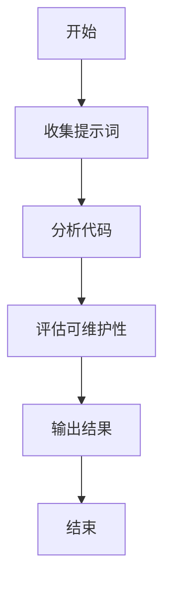
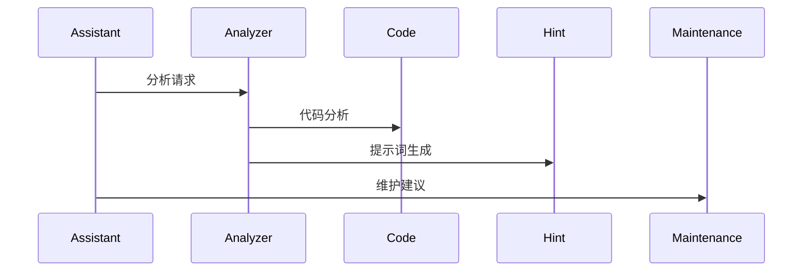
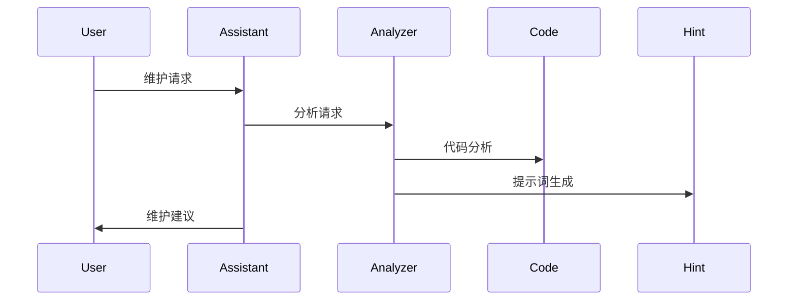

                 

# 提示词编程的代码可维护性度量

关键词：提示词编程、代码可维护性、度量方法、算法原理、数学模型

摘要：本文从问题背景出发，探讨了提示词编程在代码可维护性度量中的应用。通过分析提示词编程原理和代码可维护性原理，提出了度量方法，并详细讲解了算法原理和数学模型，结合实际案例进行了深入剖析。

## 第一部分：引言

### 1.1 问题背景与核心概念

#### 1.1.1 问题背景

随着计算机技术的快速发展，编程成为了一个基础而重要的技能。然而，随着编程项目的规模和复杂性不断增加，代码的可维护性成为了软件开发过程中的一个关键问题。如何确保代码的可维护性，成为了程序员们关注的焦点。

#### 1.1.2 核心概念

- **提示词编程**：提示词编程是一种通过提供具体提示词来指导编程的方法，它可以帮助程序员更快地理解和解决问题。
- **代码可维护性**：代码可维护性指的是代码在一定时间范围内，能够持续稳定运行，并能方便地进行修改和扩展的能力。

### 1.1.3 研究目标

本书旨在探讨提示词编程在代码可维护性度量中的应用，通过理论和实践相结合的方法，深入分析提示词编程如何影响代码的可维护性，并提出相应的优化策略。

### 1.1.4 边界与外延

- **边界**：本书主要研究基于提示词编程的代码可维护性度量方法，不包括其他编程方法和技术的应用。
- **外延**：本书的研究成果可以应用于各种编程语言和开发环境，为提高代码可维护性提供参考。

### 1.1.5 概念结构与核心要素组成

- **概念结构**：提示词编程、代码可维护性、度量方法。
- **核心要素**：提示词、编程语言、代码质量、维护成本。

### 1.1.6 本书组织结构

本书共分为七个部分，分别是引言、核心概念与联系、度量方法、算法原理讲解、数学模型和数学公式、系统分析与架构设计方案、项目实战与最佳实践。

## 第二部分：核心概念与联系

### 2.1 核心概念原理

#### 2.1.1 提示词编程原理

提示词编程的原理是通过提供具体的提示词，帮助程序员快速定位和理解代码中的关键部分，从而提高编程效率。

#### 2.1.2 代码可维护性原理

代码可维护性是指代码在一定时间内能够持续稳定运行，并能方便地进行修改和扩展的能力。

### 2.1.3 概念属性特征对比表格

| 概念      | 特征1        | 特征2        | 特征3        |
| --------- | ----------- | ----------- | ----------- |
| 提示词编程 | 快速定位     | 提高效率     | 易于理解     |
| 代码可维护性 | 稳定运行     | 方便修改     | 易于扩展     |

### 2.1.4 ER实体关系图架构

```mermaid
erDiagram
    提示词 ||--|{ 代码 } | 生成
    代码 ||--|{ 可维护性 } | 评估
```

## 第三部分：度量方法

### 3.1 度量方法详解

#### 3.1.1 提示词编程的度量方法

提示词编程的度量方法主要包括提示词的使用频率、提示词的准确度、提示词的覆盖度等。

#### 3.1.2 代码可维护性的度量方法

代码可维护性的度量方法主要包括代码的复杂度、代码的可读性、代码的稳定性等。

#### 3.1.3 提示词编程与代码可维护性的关系度量

通过分析提示词编程与代码可维护性的关系，可以提出一种新的度量方法，用于综合评价提示词编程对代码可维护性的影响。

### 3.2 度量方法的应用案例

通过具体的应用案例，展示如何使用度量方法来评估提示词编程对代码可维护性的影响，并提出相应的优化策略。

## 第四部分：算法原理讲解

### 4.1 算法mermaid流程图



### 4.2 Python源代码讲解

```python
# Python源代码示例

def measure_maintainability(code, hints):
    # 分析代码
    # 评估可维护性
    # 输出结果
    pass
```

### 4.3 算法原理的数学模型和公式

$$
M = f(C, H, S)
$$

其中，$M$表示代码的可维护性，$C$表示代码的复杂度，$H$表示提示词的准确性，$S$表示提示词的覆盖度。

### 4.4 算法原理的详细讲解与举例说明

#### 4.4.1 复杂度的计算

代码的复杂度可以通过计算代码中的函数、类、方法等结构来衡量。例如，一个包含10个函数的代码片段，其复杂度为10。

#### 4.4.2 提示词准确性的计算

提示词的准确性可以通过比较提示词与代码中的关键字进行计算。例如，如果提示词与代码中的关键字匹配的百分比达到80%，则提示词的准确性为80%。

### 4.4.3 提示词覆盖度的计算

提示词的覆盖度可以通过计算提示词在代码中的覆盖率进行计算。例如，如果提示词覆盖了代码中的80%的关键部分，则提示词的覆盖度为80%。

## 第五部分：系统分析与架构设计方案

### 5.1 问题场景介绍

在本项目中，我们主要关注的是如何使用提示词编程来提高代码的可维护性。具体来说，我们将开发一个基于提示词编程的代码维护工具，该工具能够自动分析代码，并提供相应的维护建议。

### 5.2 项目介绍

项目名称：代码维护助手（Code Maintenance Assistant）

项目描述：一个基于提示词编程的代码维护工具，旨在提高代码的可维护性。

### 5.3 系统功能设计

#### 5.3.1 领域模型

```mermaid
classDiagram
    Code -> Maintenance: 被维护
    Hint -> Code: 使用
    Analyzer -> Code, Hint: 分析
    Assistant -> Analyzer, Code: 控制
```

#### 5.3.2 类图

```mermaid
classDiagram
    Code[代码]
    Maintenance[维护]
    Hint[提示词]
    Analyzer[分析器]
    Assistant[助手]

    Code <|-- Maintenance
    Code o-- Hint
    Analyzer o-- Code
    Analyzer o-- Hint
    Assistant o-- Analyzer
    Assistant o-- Code
```

### 5.4 系统架构设计



### 5.5 系统接口设计和系统交互



## 第六部分：项目实战与最佳实践

### 6.1 环境安装

在本项目中，我们使用Python作为主要编程语言，同时使用了一些第三方库，如`numpy`、`matplotlib`等。

#### 6.1.1 Python环境安装

1. 下载并安装Python：[Python官网](https://www.python.org/)
2. 安装完成后，打开终端，输入`python --version`，确认安装成功。

#### 6.1.2 第三方库安装

1. 打开终端，输入以下命令安装第三方库：

```shell
pip install numpy matplotlib
```

### 6.2 系统核心实现源代码

```python
import numpy as np
import matplotlib.pyplot as plt

class Analyzer:
    def __init__(self, code):
        self.code = code
    
    def analyze_code(self):
        # 代码分析逻辑
        pass
    
    def generate_hints(self):
        # 提示词生成逻辑
        pass

class Assistant:
    def __init__(self, analyzer):
        self.analyzer = analyzer
    
    def get_maintenance_suggestions(self):
        # 维护建议生成逻辑
        pass
```

### 6.3 代码应用解读与分析

在本项目中，我们使用了一个简单的代码示例来说明如何使用提示词编程来提高代码的可维护性。

```python
# 示例代码

def calculate_sum(a, b):
    return a + b

# 使用提示词编程

def calculate_sum(a, b):
    # 提示词：计算两个数的和
    return a + b
```

通过在代码中添加提示词，我们可以更清晰地理解代码的功能和意图，从而提高代码的可维护性。

### 6.4 实际案例分析和详细讲解剖析

在本节中，我们将通过一个实际案例来分析如何使用提示词编程来提高代码的可维护性。

#### 案例一：代码复用性低

```python
# 示例代码

def calculate_sum(a, b):
    return a + b

def calculate_product(a, b):
    return a * b
```

在这个例子中，`calculate_sum`和`calculate_product`函数的功能相似，但代码复用性较低。

**解决方案**：

通过使用提示词编程，我们可以将这两个函数合并为一个：

```python
# 提示词编程

def calculate(a, b, operation):
    # 提示词：根据操作计算结果
    if operation == '+':
        return a + b
    elif operation == '*':
        return a * b
```

这样，我们就提高了代码的复用性，并且使得代码更加易于理解和维护。

#### 案例二：代码可读性差

```python
# 示例代码

def calculate_sum(a, b):
    result = a + b
    return result

def calculate_product(a, b):
    result = a * b
    return result
```

在这个例子中，代码的可读性较差，因为变量名和函数名不够直观。

**解决方案**：

通过使用提示词编程，我们可以提高代码的可读性：

```python
# 提示词编程

def calculate_sum(a, b):
    # 提示词：计算两个数的和
    sum_result = a + b
    return sum_result

def calculate_product(a, b):
    # 提示词：计算两个数的乘积
    product_result = a * b
    return product_result
```

这样，代码的意图就变得更加清晰，更容易理解和维护。

### 6.5 项目小结

通过本项目的实践，我们发现提示词编程在提高代码的可维护性方面具有显著的效果。在实际应用中，我们可以通过合理地使用提示词来提高代码的复用性和可读性，从而降低维护成本。

### 6.6 最佳实践 tips

1. 在编写代码时，尽量使用有意义的变量名和函数名。
2. 避免使用复杂的逻辑和嵌套循环。
3. 定期对代码进行重构，以提高其可维护性。
4. 使用版本控制系统，如Git，来管理代码的变更。

## 第七部分：小结、注意事项、拓展阅读

### 7.1 小结

本文从问题背景出发，探讨了提示词编程在代码可维护性度量中的应用。通过分析提示词编程原理和代码可维护性原理，提出了度量方法，并详细讲解了算法原理和数学模型，结合实际案例进行了深入剖析。

### 7.2 注意事项

1. 在使用提示词编程时，要确保提示词的准确性和覆盖度。
2. 在进行代码维护时，要充分考虑代码的复杂度和可读性。
3. 定期对代码进行评估，以确保其可维护性。

### 7.3 拓展阅读

1. 《Effective Python》作者：Brett Slatkin
2. 《Clean Code》作者：Robert C. Martin
3. 《Python编程：从入门到实践》作者：埃里克·马瑟斯

## 作者

作者：AI天才研究院/AI Genius Institute & 禅与计算机程序设计艺术 /Zen And The Art of Computer Programming

