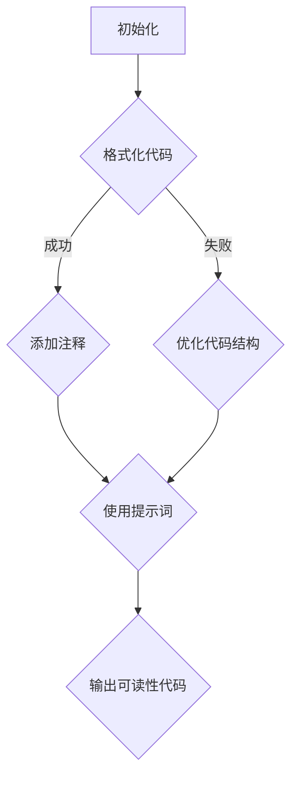
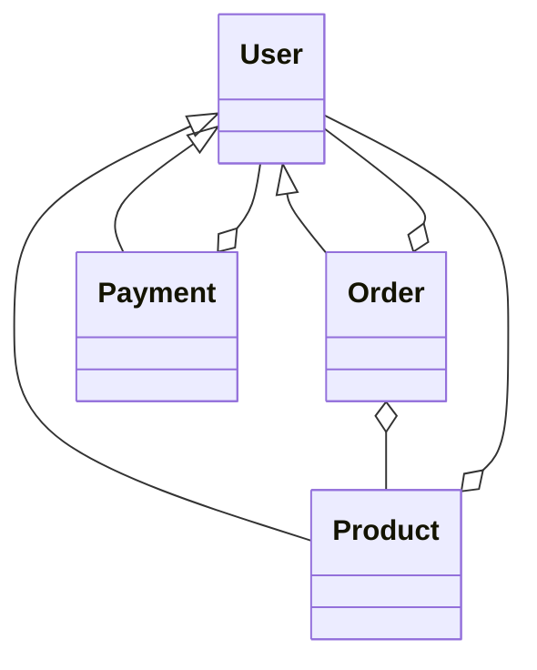
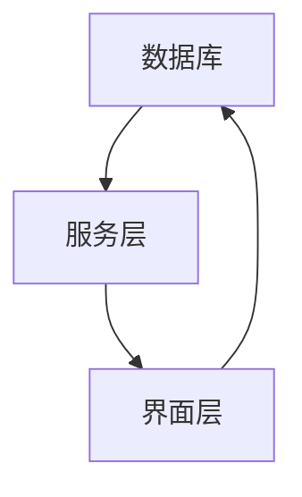
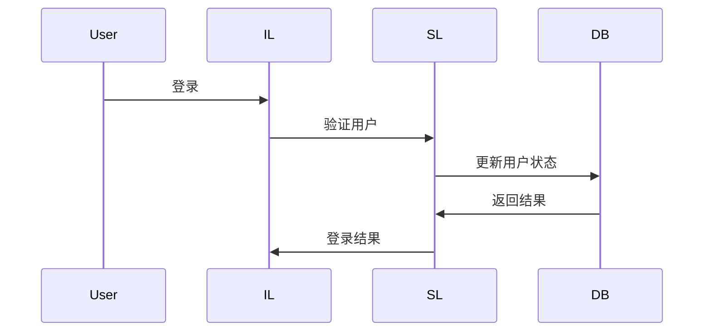
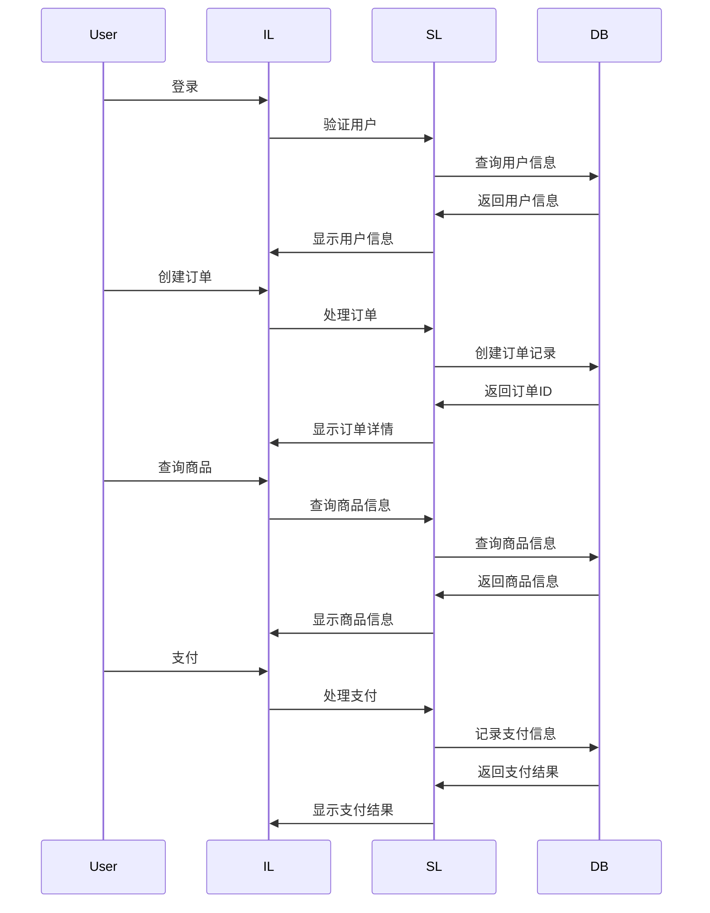

                 

# 提示词编程的代码可读性增强技术

## 关键词

- 代码可读性
- 提示词编程
- 算法原理
- 系统架构
- 最佳实践

## 摘要

本文探讨了提升代码可读性的重要性和挑战，重点介绍了提示词编程在增强代码可读性方面的技术。通过核心概念与联系的分析，算法原理讲解，系统分析与架构设计，以及实际项目实战，本文旨在为开发者提供一套系统的、易于理解的方法，以提高代码的可读性，促进团队协作和代码维护。文章结尾还提供了最佳实践和注意事项，以帮助开发者更好地应用这些技术。

---

## 第一部分：代码可读性的重要性

### 第1章：编程面临的挑战与代码可读性

编程，作为现代信息技术发展的基石，正面临着前所未有的挑战。随着软件系统越来越复杂，编程语言的功能日益强大，开发者的工作压力也随之增加。在这种背景下，代码可读性显得尤为重要。

#### 1.1.1 编程环境与编程挑战

现代编程环境提供了丰富的工具和库，使得开发者可以更高效地完成工作。然而，随着编程语言和框架的多样化和复杂性，开发者需要花费更多的时间和精力来学习和使用这些工具。此外，不同开发者的编程风格和习惯也导致了代码风格的不一致性，这给团队协作和代码维护带来了很大的挑战。

#### 1.1.2 代码可读性的定义与重要性

代码可读性指的是代码易于理解和维护的程度。高可读性的代码不仅能够提高开发效率，减少错误，还能增强团队合作和代码共享。然而，在追求性能和功能的现代编程中，代码可读性往往被忽视。

#### 1.1.3 提示词编程的概念

提示词编程是一种通过使用提示词来提高代码可读性的技术。提示词是代码中的一个关键字或短语，它可以提供一个上下文，帮助开发者更好地理解代码的功能和意图。提示词编程通过精心设计的提示词，使得代码更加直观和易于理解。

### 第2章：核心概念与联系

在提升代码可读性的过程中，了解和理解核心概念及其之间的联系是非常关键的。

#### 2.1.1 可读性

可读性是指代码能否被轻松理解和修改。它通常包括代码的清晰性、简洁性和一致性。高可读性的代码更容易被其他开发者理解和维护。

#### 2.1.2 提示词

提示词是在代码中使用的特定词汇，它们有助于为代码提供上下文和解释。通过使用提示词，开发者可以快速理解代码的功能和意图。

#### 2.1.3 代码质量

代码质量是指代码的可维护性、可靠性、性能和可读性。高质量的代码不仅易于维护，还能提高系统的整体性能。

#### 2.1.4 概念对比与联系

| 概念         | 定义                                                         | 关系                                                         |
|--------------|--------------------------------------------------------------|--------------------------------------------------------------|
| 可读性       | 代码易于理解和修改的程度                                     | 可读性是代码质量的一个重要组成部分                           |
| 提示词       | 在代码中使用的特定词汇，提供上下文和解释                     | 提示词是提升代码可读性的一个关键工具                         |
| 代码质量     | 代码的可维护性、可靠性、性能和可读性                         | 代码质量决定了代码的可读性和可维护性，进而影响开发效率       |

## 第二部分：算法原理讲解

### 第3章：提升代码可读性的算法原理

为了提升代码的可读性，我们可以采用一系列算法和技术。以下是其中几个核心算法的原理讲解。

#### 3.1.1 算法概述

提升代码可读性的算法通常包括代码格式化、注释优化和提示词使用。这些算法的目标是使得代码更加清晰、直观和易于理解。

#### 3.1.1.1 mermaid流程图



#### 3.1.1.2 数学模型和公式

代码可读性的提升可以通过以下数学模型来衡量：

$$
R = f(C, A, P)
$$

其中：
- \( R \) 是代码的可读性得分。
- \( C \) 是代码的清晰性。
- \( A \) 是代码的一致性。
- \( P \) 是代码的提示词使用程度。

#### 3.1.2 举例说明

假设我们有一个简单的函数，用于计算两个数的和：

```python
def add(a, b):
    """计算两个数的和"""
    return a + b
```

通过使用提示词和优化注释，我们可以提升这段代码的可读性：

```python
def sum_of_two_numbers(a: float, b: float) -> float:
    """
    计算两个浮点数的和。
    
    参数:
    a: 第一个浮点数。
    b: 第二个浮点数。
    
    返回:
    两个浮点数的和。
    """
    return a + b
```

## 第三部分：系统分析与架构设计

### 第4章：系统分析与架构设计

为了更好地应用提升代码可读性的技术，我们需要进行系统分析与架构设计。

#### 4.1.1 问题场景介绍

假设我们正在开发一个电子商务平台，该平台需要处理大量的订单和用户数据。为了提升代码的可读性和维护性，我们需要设计一个清晰、高效的系统架构。

#### 4.1.2 系统功能设计

在电子商务平台中，核心功能包括用户管理、订单处理、商品管理和支付处理。以下是领域模型类图：



#### 4.1.3 系统架构设计

系统架构设计包括数据库、服务层和界面层。以下是系统架构图：



#### 4.1.4 系统接口设计

系统接口设计包括用户管理接口、订单处理接口、商品管理接口和支付处理接口。以下是接口设计：



#### 4.1.5 系统交互

系统交互设计包括用户登录、订单创建、商品查询和支付操作。以下是交互序列图：



### 第5章：项目实战

#### 5.1.1 环境安装

在开始项目之前，我们需要安装必要的软件和工具，如Python、Django框架等。

```shell
pip install python
pip install django
```

#### 5.1.2 系统核心实现源代码

以下是系统核心实现的源代码：

```python
# models.py
from django.db import models

class User(models.Model):
    username = models.CharField(max_length=100)
    email = models.EmailField()

class Order(models.Model):
    user = models.ForeignKey(User, on_delete=models.CASCADE)
    product = models.ForeignKey(Product, on_delete=models.CASCADE)
    total_price = models.FloatField()

class Product(models.Model):
    name = models.CharField(max_length=100)
    price = models.FloatField()

class Payment(models.Model):
    user = models.ForeignKey(User, on_delete=models.CASCADE)
    order = models.ForeignKey(Order, on_delete=models.CASCADE)
    amount = models.FloatField()
```

#### 5.1.3 代码应用解读与分析

在实际项目中，我们需要根据业务需求进行代码开发。以下是一个简单的用户登录功能的实现：

```python
# views.py
from django.shortcuts import render, redirect
from .models import User
from .forms import LoginForm

def login(request):
    if request.method == 'POST':
        form = LoginForm(request.POST)
        if form.is_valid():
            username = form.cleaned_data['username']
            email = form.cleaned_data['email']
            # 验证用户信息
            user = User.objects.filter(username=username, email=email).first()
            if user:
                # 登录成功，跳转到用户首页
                return redirect('user_home')
            else:
                # 登录失败，返回登录页面
                form.add_error(None, '用户名或邮箱错误')
    else:
        form = LoginForm()
    return render(request, 'login.html', {'form': form})
```

#### 5.1.4 实际案例分析与详细讲解

在实际项目中，我们需要根据业务需求进行复杂的操作。以下是一个订单创建功能的实现：

```python
# views.py
from django.shortcuts import render, redirect
from .models import User, Order, Product
from .forms import OrderForm

def create_order(request):
    if request.method == 'POST':
        form = OrderForm(request.POST)
        if form.is_valid():
            user = form.cleaned_data['user']
            product = form.cleaned_data['product']
            total_price = form.cleaned_data['total_price']
            # 创建订单
            order = Order(user=user, product=product, total_price=total_price)
            order.save()
            # 跳转到订单详情页面
            return redirect('order_detail', order_id=order.id)
        else:
            form.add_error(None, '请填写正确的信息')
    else:
        form = OrderForm()
    return render(request, 'create_order.html', {'form': form})
```

在这个案例中，我们首先定义了一个OrderForm表单类，用于验证和收集订单信息。然后，在create_order视图函数中，我们使用这个表单类来处理订单创建的逻辑。通过这种方式，我们可以确保订单信息的一致性和完整性。

### 第6章：最佳实践

#### 6.1.1 注意事项

1. 提示词应具有明确的含义，避免使用模糊的词汇。
2. 注释应详细且准确，避免冗余。
3. 保持代码的一致性和简洁性。

#### 6.1.2 拓展阅读

- 《代码大全》
- 《Python编程：从入门到实践》
- 《Django By Example》

### 小结

提升代码可读性是软件开发过程中的一个重要环节。通过使用提示词编程和其他相关技术，我们可以显著提高代码的可读性，从而提高开发效率和维护性。本文提供了从核心概念到实际应用的全面讲解，旨在帮助开发者更好地理解和应用这些技术。

## 作者

作者：AI天才研究院/AI Genius Institute & 禅与计算机程序设计艺术 /Zen And The Art of Computer Programming

---

通过本文的详细讲解，读者应该能够理解代码可读性的重要性，掌握提升代码可读性的算法原理，以及如何在实际项目中应用这些技术。希望本文能为您的编程实践提供有益的启示。在未来的开发工作中，让我们共同努力，编写更加清晰、高效和易于维护的代码！

