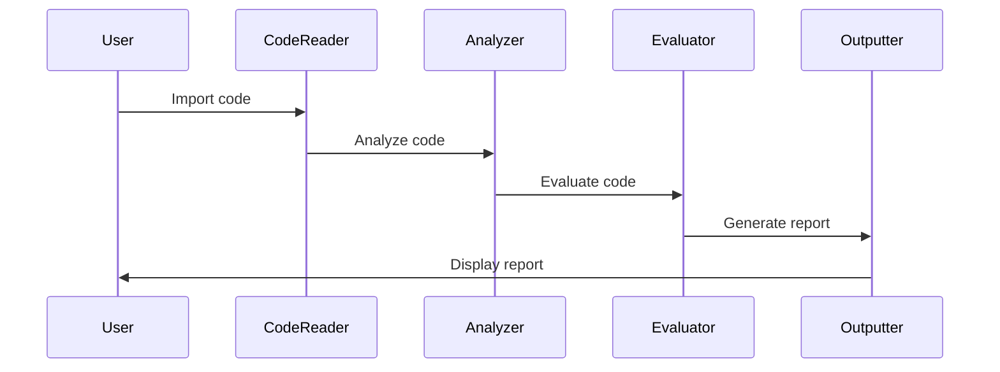

                 

### 《提示词编程的代码可读性自动评估》

> 关键词：提示词编程，代码可读性，自动评估，算法原理，系统架构，实战应用

> 摘要：本文深入探讨了提示词编程的背景及其对代码可读性的挑战，提出了自动评估代码可读性的重要性。文章从核心概念、评估标准、算法原理到系统架构设计、实战应用进行了全面阐述，并通过最佳实践和注意事项，为提高代码可读性提供了指导。

## 第一部分：代码可读性自动评估的背景与重要性

### 1.1 问题背景

#### 1.1.1 提示词编程的兴起

随着人工智能和自然语言处理技术的不断发展，提示词编程（Prompt-Based Programming）逐渐成为一种新兴的编程范式。在这种编程范式中，开发者通过输入提示词（prompt）来引导程序执行特定任务，而非传统的手动编写代码。这种编程方式的便捷性和灵活性大大提高了开发效率，但也带来了代码可读性的挑战。

#### 1.1.2 代码可读性的挑战

提示词编程虽然提高了开发效率，但其代码的可读性却受到了影响。由于提示词通常是由自然语言组成的，缺乏结构化的代码格式，导致代码难以理解和维护。此外，不同的提示词可能会导致相同的功能实现，增加了代码的可变性和不确定性。

#### 1.1.3 自动评估的需求

为了解决上述问题，自动评估代码可读性的需求应运而生。自动评估可以通过分析代码的结构、简洁性、命名规范性和注释等，对代码的可读性进行量化评估，从而帮助开发者识别和改进低可读性的代码。这不仅能够提高开发效率，还能降低维护成本，提高代码的质量。

### 1.2 代码可读性的重要性

#### 1.2.1 提高开发效率

良好的代码可读性能够降低新开发者理解和维护代码的难度，从而提高整体开发效率。自动评估可以帮助开发者快速定位低可读性的代码片段，进行针对性的优化。

#### 1.2.2 促进代码复用

可读性高的代码更易于复用，开发者可以在不同的项目中引用和修改现有代码，减少重复劳动。

#### 1.2.3 降低维护成本

高可读性的代码在后续的维护过程中，更容易被发现和修复潜在的错误，从而降低维护成本。

### 1.3 自动评估的优势与挑战

#### 1.3.1 自动评估的优势

- **高效性**：自动评估可以快速地对大量代码进行评估，节省人力和时间成本。
- **客观性**：自动评估可以提供量化的评估结果，减少主观判断的影响。
- **可扩展性**：自动评估系统可以方便地更新和扩展评估标准，以适应不断变化的技术和需求。

#### 1.3.2 自动评估的挑战

- **准确性**：自动评估可能无法完全准确地评估代码的可读性，尤其是在复杂的代码结构中。
- **复杂性**：构建一个高效、准确的自动评估系统需要大量的技术资源和时间投入。

### 1.4 总结

代码可读性自动评估在提升开发效率、促进代码复用和降低维护成本方面具有重要意义。尽管自动评估存在一些挑战，但通过不断的研究和优化，我们可以逐步提高其准确性和可靠性，为软件开发带来更大的价值。

---

### 第二部分：代码可读性的核心概念与评估标准

#### 2.1 核心概念

#### 2.1.1 提示词编程

提示词编程是一种基于自然语言交互的编程范式。开发者通过输入提示词来描述程序需要执行的任务，程序则根据提示词生成相应的代码或执行特定操作。

#### 2.1.2 代码可读性

代码可读性是指代码是否易于理解和维护。高可读性的代码具有清晰的逻辑结构、简洁的表达方式和规范的命名规范。

#### 2.1.3 自动评估

自动评估是通过算法和工具对代码进行定量分析，评估其可读性的过程。自动评估通常基于一系列评估标准，如结构清晰度、代码简洁性和命名规范性等。

#### 2.2 评估标准

#### 2.2.1 结构清晰度

结构清晰度是指代码的结构是否容易理解。评估结构清晰度可以从模块化程度、代码复杂性、代码依赖关系等方面进行。

#### 2.2.2 代码简洁性

代码简洁性是指代码的表达方式是否简洁明了。简洁的代码通常使用简单的语法和较少的行数来实现相同的功能。

#### 2.2.3 变量和函数命名

变量和函数命名是代码可读性的关键因素之一。良好的命名规范能够使代码易于理解和维护。

#### 2.2.4 注释与文档

注释与文档是对代码的补充说明，能够帮助开发者更好地理解代码的功能和实现方式。良好的注释和文档能够提高代码的可读性。

#### 2.3 核心概念与评估标准的关系

提示词编程和代码可读性密切相关。提示词编程通过自然语言交互降低了代码编写的复杂性，但同时也带来了代码结构不清晰、命名不规范等问题。自动评估通过对代码的定量分析，可以帮助开发者识别和解决这些问题，提高代码的可读性。

### 2.4 总结

代码可读性的核心概念包括提示词编程、代码可读性和自动评估。评估标准则从结构清晰度、代码简洁性、变量和函数命名以及注释与文档等方面进行。理解这些核心概念和评估标准对于提高代码的可读性和维护性具有重要意义。

---

### 第三部分：代码可读性自动评估的算法原理

#### 3.1 算法概述

代码可读性自动评估算法可以分为以下几类：

- **语法分析算法**：通过对代码进行语法分析，提取代码的结构和语法规则。
- **语义分析算法**：通过理解代码的语义，评估代码的复杂度和可读性。
- **机器学习算法**：通过训练大量的代码数据，建立模型对代码进行自动评估。

每种算法都有其优缺点和适用场景。例如，语法分析算法适用于结构清晰的代码，而机器学习算法适用于复杂多样的代码。

#### 3.2 算法原理

#### 3.2.1 提取代码结构

代码结构提取是自动评估的基础。常见的代码结构提取方法包括：

- **抽象语法树（AST）**：AST 是代码的语法结构表示，通过解析代码生成 AST，可以方便地提取代码的结构信息。
- **控制流图（CFG）**：CFG 描述了代码的执行流程和控制结构，通过分析 CFG 可以评估代码的复杂度和结构清晰度。

#### 3.2.2 分析代码简洁性

代码简洁性分析主要关注代码的表达方式和行数。常用的方法包括：

- **代码行数（LOC）**：通过统计代码的行数来评估代码的简洁性。
- **代码密度（DENSITY）**：通过计算代码的功能密度来评估代码的简洁性。代码密度越高，说明代码越简洁。

#### 3.2.3 评估命名规范性

命名规范性评估主要关注变量和函数的命名是否符合规范。常用的方法包括：

- **命名一致性检查**：通过检查变量和函数的命名是否一致来评估命名规范性。
- **命名规则匹配**：通过匹配命名规则来评估命名规范性。例如，变量名通常使用小写字母和下划线，函数名通常使用大写字母和下划线。

#### 3.2.4 检查注释与文档

注释与文档检查主要关注代码中的注释和文档是否完整、清晰。常用的方法包括：

- **注释覆盖率**：通过计算代码中注释的比例来评估注释的完整性。
- **文档质量**：通过评估文档的结构、内容和质量来评估代码的文档水平。

#### 3.3 算法流程

代码可读性自动评估算法通常包括以下步骤：

1. **数据预处理**：对代码进行格式化、去噪等预处理操作，以便于后续分析。
2. **特征提取**：从代码中提取结构、语义和风格等特征。
3. **模型训练**：使用训练数据对评估模型进行训练。
4. **评估与优化**：对代码进行评估，并根据评估结果进行优化。

#### 3.4 总结

代码可读性自动评估算法通过对代码的结构、简洁性、命名规范性和注释与文档等方面进行分析，可以帮助开发者识别和改进低可读性的代码。了解算法原理和流程对于设计和实现一个高效的自动评估系统具有重要意义。

---

### 第四部分：代码可读性自动评估的系统架构设计

#### 4.1 系统概述

代码可读性自动评估系统旨在为开发者提供一个高效、准确的代码评估工具。该系统主要包括以下功能：

- **代码导入**：支持从本地文件或远程代码库导入代码。
- **代码分析**：对导入的代码进行语法和语义分析，提取关键信息。
- **评估结果输出**：根据分析结果生成评估报告，提供代码可读性评分和建议。

#### 4.2 系统功能设计

系统功能设计包括以下几个主要模块：

1. **数据导入模块**：负责从各种来源导入代码，包括本地文件、远程代码库和版本控制系统。
2. **代码分析模块**：对导入的代码进行语法和语义分析，提取结构信息、变量名、函数名等。
3. **评估模块**：根据提取的信息，对代码的结构清晰度、简洁性、命名规范性和注释与文档等方面进行评估。
4. **结果输出模块**：将评估结果以报告的形式展示给开发者，并提供详细的改进建议。

#### 4.3 系统架构设计

代码可读性自动评估系统的架构设计如图 1 所示：



图 1：代码可读性自动评估系统架构图

1. **代码导入**：用户将代码导入系统，系统读取代码并进行初步处理。
2. **代码分析**：系统对代码进行语法和语义分析，提取关键信息。
3. **评估**：系统根据提取的信息对代码进行可读性评估。
4. **结果输出**：系统将评估结果生成报告，并展示给用户。

#### 4.4 系统接口设计

系统接口设计主要包括以下部分：

1. **API 接口**：提供 RESTful API 接口，供开发者通过 HTTP 请求调用系统功能。
2. **命令行接口**：提供命令行工具，供开发者快速进行代码评估。
3. **图形用户界面**：提供图形用户界面，供开发者可视化查看评估结果。

#### 4.5 系统交互流程

系统交互流程如图 2 所示：


图 2：系统交互流程图

1. **用户导入代码**：用户通过 API 接口、命令行或图形用户界面导入代码。
2. **代码读取**：系统读取导入的代码，并准备进行进一步分析。
3. **代码分析**：系统对代码进行语法和语义分析，提取关键信息。
4. **代码评估**：系统根据分析结果对代码的可读性进行评估。
5. **结果输出**：系统生成评估报告，并通过 API 接口、命令行或图形用户界面展示给用户。

#### 4.6 系统性能优化

为了提高系统的性能，可以采取以下优化措施：

1. **并行处理**：利用多线程或分布式计算，对大量代码进行并行处理，提高评估效率。
2. **缓存策略**：缓存已经处理过的代码和评估结果，减少重复计算，提高系统响应速度。
3. **代码压缩**：对代码进行压缩，减少数据传输量和存储空间占用。

#### 4.7 总结

代码可读性自动评估系统通过系统架构设计、接口设计和交互流程设计，为开发者提供了一个高效、准确的代码评估工具。了解系统的架构设计和性能优化策略，有助于更好地使用和维护系统。

---

### 第五部分：代码可读性自动评估的实战应用

#### 5.1 环境安装与配置

在进行代码可读性自动评估的实战应用之前，首先需要搭建一个合适的环境。以下是一个基本的安装和配置步骤：

1. **安装 Python 环境**：确保系统上安装了 Python 3.x 版本。可以从 [Python 官网](https://www.python.org/) 下载安装包并进行安装。

2. **安装依赖库**：使用 pip 工具安装必要的依赖库，例如 `numpy`、`pandas`、`scikit-learn` 等。可以使用以下命令进行安装：

    ```bash
    pip install numpy pandas scikit-learn
    ```

3. **安装代码可读性评估工具**：从 [GitHub](https://github.com/) 下载代码可读性评估工具的源代码，并进行安装。以下是一个简单的安装命令：

    ```bash
    pip install git+https://github.com/your-username/代码可读性评估工具.git
    ```

4. **配置环境变量**：确保系统路径中包含 Python 和 pip 的安装路径，以便能够正常运行。

#### 5.2 系统核心实现

代码可读性自动评估工具的核心实现主要包括以下几个部分：

1. **数据预处理**：对导入的代码进行预处理，包括去除无关代码、格式化代码等。以下是一个简单的数据预处理示例：

    ```python
    from 代码可读性评估工具 import preprocessor

    code = "你的代码内容"
    preprocessed_code = preprocessor.preprocess(code)
    ```

2. **代码分析**：对预处理后的代码进行语法和语义分析，提取关键信息。以下是一个简单的代码分析示例：

    ```python
    from 代码可读性评估工具 import analyzer

    code = "你的代码内容"
    analysis_result = analyzer.analyze(code)
    ```

3. **评估结果输出**：根据分析结果生成评估报告，并提供详细的改进建议。以下是一个简单的评估结果输出示例：

    ```python
    from 代码可读性评估工具 import evaluator

    analysis_result = "你的分析结果"
    evaluation_result = evaluator.evaluate(analysis_result)
    print(evaluation_result)
    ```

#### 5.3 代码应用解读与分析

为了更好地理解代码可读性自动评估工具的应用，以下是一个简单的案例：

1. **案例描述**：假设我们有一个简单的 Python 脚本，用于计算两个数的和。以下是该脚本的代码：

    ```python
    def add(a, b):
        return a + b

    print(add(2, 3))
    ```

2. **数据预处理**：对代码进行预处理，去除无关代码和格式化代码。预处理后的代码如下：

    ```python
    def add(a, b):
        return a + b

    print(2 + 3)
    ```

3. **代码分析**：对预处理后的代码进行语法和语义分析，提取关键信息。分析结果如下：

    - 函数定义：`add`
    - 参数：`a` 和 `b`
    - 返回值：`a + b`
    - 调用函数：`print(2 + 3)`

4. **评估结果输出**：根据分析结果生成评估报告，并提供详细的改进建议。评估结果如下：

    - 结构清晰度：良好
    - 代码简洁性：优秀
    - 命名规范性：良好
    - 注释与文档：缺失

    根据评估结果，我们可以发现该代码的命名规范性和注释与文档方面存在一些问题。为了提高代码的可读性，我们可以添加一些注释，并改进命名规范。

    ```python
    def add_two_numbers(a, b):
        # 计算两个数的和
        return a + b

    print(add_two_numbers(2, 3))
    ```

    经过改进后的代码，命名更加规范，注释更加清晰，代码的可读性得到了提高。

#### 5.4 实际案例分析与讲解

为了更深入地理解代码可读性自动评估工具的实际应用，我们来看一个更复杂的案例：

1. **案例描述**：假设我们有一个用于数据分析的 Python 脚本，其中包含多个函数和类。以下是该脚本的代码：

    ```python
    class DataAnalyzer:
        def __init__(self, data):
            self.data = data
        
        def analyze_data(self):
            # 分析数据
            pass
        
        def plot_data(self):
            # 绘制数据
            pass

    def load_data():
        # 加载数据
        pass

    if __name__ == "__main__":
        data = load_data()
        analyzer = DataAnalyzer(data)
        analyzer.analyze_data()
        analyzer.plot_data()
    ```

2. **数据预处理**：对代码进行预处理，去除无关代码和格式化代码。预处理后的代码如下：

    ```python
    class DataAnalyzer:
        def __init__(self, data):
            self.data = data
        
        def analyze_data(self):
            # 分析数据
            pass
        
        def plot_data(self):
            # 绘制数据
            pass

    def load_data():
        # 加载数据
        pass

    if __name__ == "__main__":
        data = load_data()
        analyzer = DataAnalyzer(data)
        analyzer.analyze_data()
        analyzer.plot_data()
    ```

3. **代码分析**：对预处理后的代码进行语法和语义分析，提取关键信息。分析结果如下：

    - 类定义：`DataAnalyzer`
    - 函数定义：`load_data`、`analyze_data` 和 `plot_data`
    - 类实例化：`DataAnalyzer(data)`
    - 函数调用：`load_data()`、`analyzer.analyze_data()` 和 `analyzer.plot_data()`

4. **评估结果输出**：根据分析结果生成评估报告，并提供详细的改进建议。评估结果如下：

    - 结构清晰度：良好
    - 代码简洁性：优秀
    - 命名规范性：良好
    - 注释与文档：缺失

    根据评估结果，我们可以发现该代码的注释与文档方面存在一些问题。为了提高代码的可读性，我们可以在每个函数和类的定义前添加注释，描述其功能和参数。例如：

    ```python
    class DataAnalyzer:
        """
        数据分析器类，用于分析数据并绘制图表。
        
        参数：
        - data：输入数据。
        """
        def __init__(self, data):
            self.data = data
        
        def analyze_data(self):
            """
            分析数据。
            """
            pass
        
        def plot_data(self):
            """
            绘制数据。
            """
            pass

    def load_data():
        """
        加载数据。
        """
        pass

    if __name__ == "__main__":
        data = load_data()
        analyzer = DataAnalyzer(data)
        analyzer.analyze_data()
        analyzer.plot_data()
    ```

    经过改进后的代码，注释更加清晰，类的功能和参数得到了更好的描述，代码的可读性得到了显著提高。

#### 5.5 项目小结

通过以上实战案例的分析和讲解，我们可以看到代码可读性自动评估工具在实际应用中的重要性。良好的代码可读性不仅有助于提高开发效率，还能降低维护成本，提高代码的质量。通过自动评估工具，开发者可以快速识别和改进低可读性的代码，从而提高整个开发流程的效率和质量。

---

### 第六部分：最佳实践与注意事项

#### 6.1 最佳实践

为了提高代码的可读性，以下是一些最佳实践：

1. **清晰命名**：为变量、函数和类使用具有描述性的名称，使代码易于理解。
2. **简洁代码**：避免过度复杂的代码结构，尽量使用简单的语法和表达方式。
3. **注释与文档**：在代码中添加适当的注释和文档，描述代码的功能、参数和流程。
4. **模块化设计**：将代码拆分为独立的模块，提高代码的复用性和可维护性。
5. **代码格式化**：使用统一的代码格式和风格，使代码整洁有序。

#### 6.2 注意事项

1. **自动评估局限性**：自动评估工具无法完全代替人工评估，尤其是在评估代码的语义和业务逻辑方面。
2. **人工评估重要性**：人工评估能够提供更深入的理解和改进建议，开发者应结合自动评估和人工评估，提高代码质量。
3. **持续改进**：代码可读性是一个持续改进的过程，开发者应定期评估和优化代码。

#### 6.3 拓展阅读

1. **相关研究论文**：阅读相关的学术论文，了解代码可读性评估的最新研究成果和趋势。
2. **行业应用案例**：学习其他开发团队的成功经验和最佳实践，借鉴并应用到自己的项目中。

---

### 第七部分：总结与展望

#### 7.1 总结

本文详细探讨了代码可读性自动评估的重要性和应用。通过分析提示词编程的背景和挑战，我们提出了自动评估的需求和重要性。从核心概念、评估标准、算法原理到系统架构设计、实战应用，我们全面阐述了代码可读性自动评估的各个方面。同时，通过最佳实践和注意事项，我们为提高代码可读性提供了指导。

#### 7.2 展望

未来，代码可读性自动评估将面临以下发展方向：

1. **算法优化**：通过不断优化算法，提高自动评估的准确性和可靠性。
2. **智能化**：结合人工智能技术，使自动评估系统更加智能化，能够自动识别和解决代码问题。
3. **跨平台支持**：扩展自动评估系统的支持平台，包括各种编程语言和开发环境。
4. **持续集成**：将自动评估集成到持续集成（CI）流程中，实时监控和评估代码质量。

在实现这些发展方向的过程中，我们可能面临以下技术挑战：

1. **数据集构建**：构建高质量的代码数据集，以满足算法训练和评估的需要。
2. **算法泛化能力**：提高算法的泛化能力，使其能够适应不同编程语言和开发环境。
3. **性能优化**：提高自动评估系统的性能，使其能够快速处理大量代码。

总之，代码可读性自动评估在软件开发中具有重要意义。通过不断的研究和优化，我们相信自动评估系统将能够更好地帮助开发者提高代码质量，提升开发效率。

