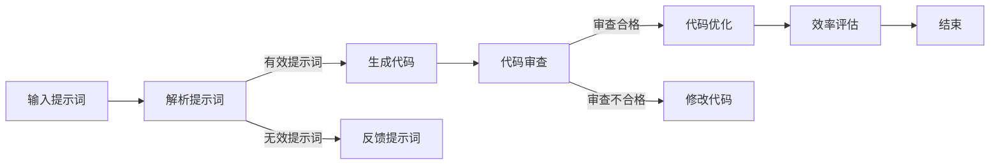
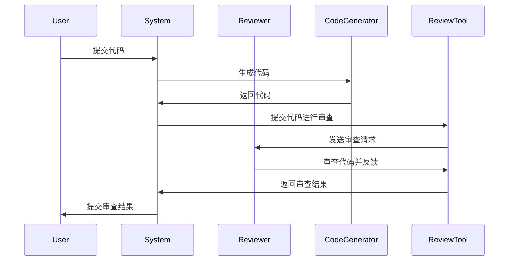
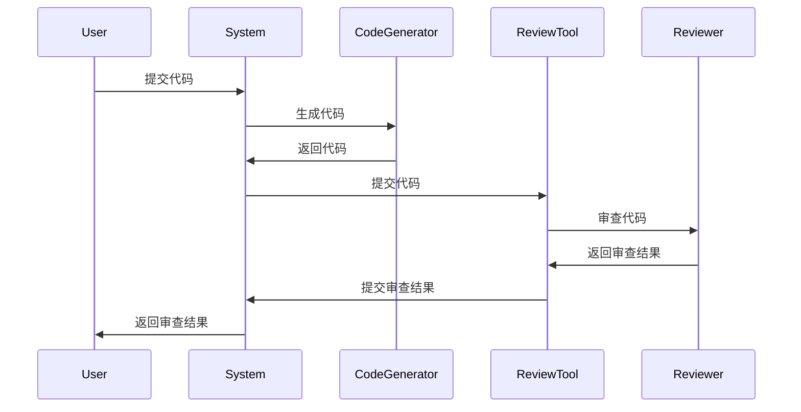

                 

### 第1章：研究背景

#### 1.1 问题背景

代码审查是一种重要的软件开发实践，旨在通过同行评审确保代码的质量、安全性和可维护性。然而，随着软件项目的规模和复杂性不断增加，传统的代码审查方式逐渐显示出其局限性。在这个过程中，提示词编程作为一种新兴的编程模式，开始逐渐引起研究者的关注。提示词编程的核心思想是通过自然语言或简短的提示词，由计算机自动生成或优化代码。这种编程模式不仅提高了编程效率，还降低了人为错误的风险。

在当今软件开发中，代码审查的重要性不可忽视。有效的代码审查可以揭示潜在的错误和漏洞，确保代码的可读性和可维护性。然而，随着代码规模的扩大，代码审查的难度和耗时也逐渐增加。据统计，在进行代码审查时，开发者平均需要花费约30%的时间在查找和理解代码上。这一比例在某些复杂项目中可能会更高。因此，如何提高代码审查的效率，成为软件开发中亟待解决的问题。

提示词编程作为一种创新的编程模式，具有显著的优势。首先，提示词编程可以大大减少开发者在编写代码时的重复性劳动，使得编程过程更加高效。其次，通过提示词，计算机可以自动识别代码中的模式和规律，从而生成高质量的代码。此外，提示词编程还可以帮助开发者快速适应新的编程语言和框架，降低学习成本。

然而，提示词编程的发展也面临一些挑战。首先，提示词的准确性和有效性直接影响代码生成的质量。其次，如何设计一个通用且高效的提示词生成算法，是当前研究中的一个重要问题。此外，提示词编程与代码审查的结合点也需要进一步探索，以便充分发挥其优势。

#### 1.2 问题描述

提示词编程的概念与特点

提示词编程（Prompt Programming）是一种基于自然语言处理和人工智能技术的编程模式。其核心思想是通过输入简短的提示词，计算机能够自动生成或优化相应的代码。这种编程模式的特点包括：

1. **高效率**：通过提示词，开发者可以快速获取所需代码，减少手动编写的工作量。
2. **灵活性**：提示词编程允许开发者使用自然语言描述代码需求，使得编程更加灵活。
3. **通用性**：提示词编程适用于多种编程语言和开发环境，具有广泛的适用性。

然而，提示词编程也存在一些局限性。首先，提示词的准确性和有效性直接决定了代码生成的质量。如果提示词模糊或错误，生成的代码可能会存在缺陷。其次，提示词编程对自然语言处理和人工智能技术的要求较高，需要大量的训练数据和强大的计算能力。

代码审查效率的影响因素

代码审查（Code Review）是一种通过同行评审来提高代码质量的软件开发实践。代码审查的效率受到多种因素的影响，主要包括：

1. **代码规模**：代码规模越大，审查的难度和耗时越高。
2. **审查者经验**：有经验的审查者可以更快速地识别代码中的问题，提高审查效率。
3. **工具支持**：现代化的代码审查工具可以自动化一些重复性的工作，提高审查效率。
4. **代码质量**：代码质量越高，审查过程中发现问题的难度越小，从而提高审查效率。

在传统代码审查中，开发者需要对代码进行逐行阅读和理解，这往往需要耗费大量的时间和精力。而提示词编程的出现，为提高代码审查效率提供了新的思路。通过提示词，审查者可以快速获取代码的核心逻辑和功能，从而更有效地发现潜在的问题。

#### 1.3 问题解决

提示词编程与代码审查的结合点

提示词编程与代码审查的结合点主要体现在以下几个方面：

1. **快速定位问题**：通过提示词，审查者可以快速定位代码的关键部分，从而更有效地发现潜在的问题。
2. **自动化审查**：提示词编程可以自动化一些代码审查的步骤，如代码格式检查、变量命名检查等，从而提高审查效率。
3. **提高代码质量**：提示词编程生成的代码往往更加规范和高效，从而提高整体代码质量，降低审查难度。

代码审查效率的量化方法

为了量化代码审查效率，我们可以从以下几个方面进行考虑：

1. **审查时间**：通过统计审查者花费在代码审查上的时间，来衡量审查效率。
2. **问题发现率**：审查者在一定时间内能够发现的问题数量，可以作为衡量效率的指标。
3. **审查质量**：审查过程中发现的问题数量和质量，可以反映审查效率的高低。

具体量化方法包括：

1. **审查时间统计**：使用代码审查工具记录审查者的时间消耗，从而计算出平均审查时间。
2. **问题发现率计算**：通过统计审查过程中发现的问题数量，与总代码行数的比值，来计算问题发现率。
3. **审查质量评估**：根据发现的问题严重程度和修复难度，对审查质量进行评分。

通过这些量化方法，我们可以更客观地评估代码审查效率，并为优化审查流程提供数据支持。

#### 1.4 边界与外延

研究范围的界定

本次研究主要关注提示词编程在代码审查中的应用，以及其对代码审查效率的影响。具体研究范围包括：

1. **编程语言**：主要研究Python、Java等通用编程语言。
2. **开发环境**：主要研究Git、GitHub等版本控制系统。
3. **代码审查工具**：主要研究GitHub、Gerrit等现代代码审查工具。

研究方法的适用性

本次研究采用定量研究方法，通过数据统计和分析来量化提示词编程对代码审查效率的影响。具体方法包括：

1. **数据收集**：通过实际项目中的代码审查数据，收集相关指标，如审查时间、问题发现率等。
2. **数据分析**：使用统计学方法对收集到的数据进行分析，得出提示词编程对代码审查效率的影响规律。
3. **模型构建**：基于分析结果，构建提示词编程与代码审查效率的数学模型，为后续研究提供理论基础。

#### 1.5 概念结构与核心要素组成

提示词编程的关键要素

提示词编程的关键要素包括：

1. **提示词**：提示词是编程的核心输入，决定了代码生成的方向和质量。
2. **自然语言处理**：自然语言处理技术用于解析和生成提示词，是实现提示词编程的基础。
3. **代码生成**：代码生成是提示词编程的核心环节，通过解析提示词，自动生成相应的代码。
4. **代码优化**：代码优化是提升代码质量和效率的重要手段，可以在代码生成的基础上进行。

代码审查的核心要素

代码审查的核心要素包括：

1. **审查者**：审查者是代码审查的主体，负责对代码进行评估和审核。
2. **审查流程**：审查流程包括代码提交、审查请求、审查反馈等环节，是代码审查的规范化操作。
3. **审查工具**：审查工具用于辅助审查者进行代码审查，如Git、GitHub等。
4. **审查标准**：审查标准是评估代码质量的标准，包括代码格式、变量命名、代码可读性等方面。

通过上述关键要素的梳理，我们可以更清晰地理解提示词编程和代码审查的内在联系和作用机制。

### 第2章：相关理论研究

#### 2.1 提示词编程理论基础

提示词编程的基本原理

提示词编程（Prompt Programming）是一种基于自然语言处理（Natural Language Processing, NLP）和人工智能（Artificial Intelligence, AI）技术的编程模式。其基本原理如下：

1. **输入提示词**：提示词通常是一段简短的文本，描述了开发者希望实现的功能或需求。
2. **解析提示词**：自然语言处理技术用于解析提示词，提取出关键信息，如关键词、语法结构等。
3. **生成代码**：基于解析结果，计算机自动生成相应的代码，实现提示词所描述的功能。
4. **代码优化**：生成的代码可能不是最优的，通过进一步的优化，提升代码的质量和效率。

提示词编程的优势与挑战

提示词编程具有显著的优势，但也面临一定的挑战：

**优势：**

1. **高效率**：通过提示词，开发者可以快速获取所需代码，减少手动编写的工作量。
2. **灵活性**：提示词编程允许开发者使用自然语言描述代码需求，使得编程更加灵活。
3. **通用性**：提示词编程适用于多种编程语言和开发环境，具有广泛的适用性。

**挑战：**

1. **提示词准确性**：提示词的准确性和有效性直接影响代码生成的质量。如果提示词模糊或错误，生成的代码可能会存在缺陷。
2. **自然语言处理技术要求**：提示词编程对自然语言处理和人工智能技术的要求较高，需要大量的训练数据和强大的计算能力。
3. **代码优化难度**：生成的代码可能需要进行多次优化，才能达到最佳效果。

#### 2.2 代码审查理论基础

代码审查的定义与类型

代码审查（Code Review）是一种通过同行评审来提高代码质量的软件开发实践。代码审查的主要目标是发现潜在的错误、漏洞，确保代码的可读性和可维护性。根据审查方式的不同，代码审查可以分为以下几种类型：

1. **形式审查**：主要关注代码的形式问题，如代码格式、变量命名、注释等。
2. **逻辑审查**：关注代码的逻辑正确性和性能，检查是否存在逻辑错误、效率问题等。
3. **安全审查**：主要关注代码的安全性，检查是否存在安全漏洞、潜在风险等。

代码审查的过程与效果评估

代码审查的过程通常包括以下几个环节：

1. **代码提交**：开发者将代码提交到代码审查系统，等待审查。
2. **审查请求**：审查者接收到审查请求，开始对代码进行审查。
3. **审查反馈**：审查者将审查结果反馈给开发者，提出修改建议或问题。
4. **代码修改**：开发者根据审查反馈，对代码进行修改，再次提交进行审查。
5. **审查结束**：审查者确认代码修改符合要求，审查过程结束。

代码审查的效果评估可以从以下几个方面进行：

1. **审查时间**：评估审查者花费在代码审查上的时间，衡量审查效率。
2. **问题发现率**：评估审查过程中发现的问题数量，与总代码行数的比值，衡量审查效果。
3. **审查质量**：评估审查过程中发现的问题严重程度和修复难度，衡量审查效果。

#### 2.3 提示词编程与代码审查的结合点

提示词编程在代码审查中的应用

提示词编程可以应用于代码审查的多个环节，提高审查效率和质量：

1. **快速定位问题**：通过提示词，审查者可以快速定位代码的关键部分，提高审查效率。
2. **自动化审查**：提示词编程可以自动化一些代码审查的步骤，如代码格式检查、变量命名检查等，减少人工干预。
3. **优化审查流程**：提示词编程可以帮助审查者更好地理解代码需求，优化审查流程，提高审查质量。

提示词编程对代码审查效率的影响

提示词编程对代码审查效率的影响可以从以下几个方面进行分析：

1. **审查时间减少**：通过提示词，审查者可以更快地定位问题和理解代码，减少审查时间。
2. **问题发现率提高**：提示词编程可以帮助审查者更准确地识别代码中的问题，提高问题发现率。
3. **审查质量提升**：提示词编程生成的代码往往更加规范和高效，降低审查难度，提高审查质量。

然而，提示词编程也带来一定的挑战。首先，提示词的准确性和有效性直接影响代码生成的质量，如果提示词不准确，可能导致生成的代码存在缺陷。其次，提示词编程对自然语言处理和人工智能技术的要求较高，需要投入大量的计算资源和训练数据。

总的来说，提示词编程与代码审查的结合，有助于提高代码审查的效率和质量，但仍需进一步研究和优化，以充分发挥其优势。

### 第3章：研究方法与数据收集

#### 3.1 研究方法

研究方法的选择是确保研究质量和有效性的关键。在本研究中，我们采用定性和定量研究方法相结合的方式，旨在全面、深入地探讨提示词编程对代码审查效率的影响。

**定性研究方法**

定性研究方法主要通过深度访谈、案例分析和文献综述等方式，对提示词编程和代码审查的内在机制和作用进行深入探讨。具体步骤如下：

1. **文献综述**：收集和分析相关领域的研究文献，梳理提示词编程和代码审查的理论基础、现状和发展趋势。
2. **案例研究**：选取具有代表性的案例，深入分析提示词编程在实际项目中的应用情况，以及其对代码审查效率的影响。
3. **专家访谈**：邀请行业专家、资深开发者和管理者进行访谈，了解他们对提示词编程和代码审查的看法、经验和建议。

**定量研究方法**

定量研究方法主要通过数据统计和分析，对提示词编程对代码审查效率的量化影响进行评估。具体步骤如下：

1. **数据收集**：从实际项目中收集与代码审查相关的数据，包括审查时间、问题发现率、审查质量等。
2. **数据预处理**：对收集到的数据进行清洗、整理和归一化处理，确保数据的质量和一致性。
3. **统计分析**：使用统计学方法，对处理后的数据进行分析，得出提示词编程对代码审查效率的影响规律。

**两种方法的结合**

定性研究方法和定量研究方法各有优势，通过结合使用，可以相互补充，提高研究的全面性和准确性。定性研究方法可以帮助我们深入理解提示词编程和代码审查的内在机制，为定量研究提供理论基础；定量研究方法则可以提供客观的数据支持，验证定性研究的结论。

#### 3.2 数据收集

数据收集是研究过程的重要环节，直接影响到研究结果的可靠性和有效性。在本研究中，我们通过以下途径进行数据收集：

**数据来源**

1. **实际项目数据**：从实际项目中收集与代码审查相关的数据，包括审查时间、问题发现率、审查质量等。这些数据来源于多个具有代表性的项目，涵盖了不同的开发环境、编程语言和团队规模。
2. **公开数据集**：从公开的数据集中获取与提示词编程相关的数据，用于验证和测试提示词编程算法的性能和效果。

**数据收集方法**

1. **自动化工具**：使用自动化工具（如Git hooks、代码审查工具等）收集代码审查过程中的相关数据，确保数据的准确性和一致性。
2. **问卷调查**：设计问卷调查，收集开发者对提示词编程和代码审查的看法、经验和建议。问卷通过在线平台进行分发，以获取广泛的数据。

**数据预处理与清洗**

数据预处理和清洗是确保数据质量的重要步骤。在本研究中，我们采取以下措施进行数据预处理和清洗：

1. **数据清洗**：去除重复数据、缺失数据和异常数据，确保数据的完整性和一致性。
2. **数据归一化**：对数据进行归一化处理，使其在同一量级上，方便后续的统计分析。
3. **数据验证**：对清洗后的数据进行验证，确保数据的准确性和可靠性。

#### 3.3 样本选择与样本量确定

**样本选择的依据**

在样本选择过程中，我们主要考虑以下因素：

1. **项目规模**：选择具有代表性的大型项目，以确保数据的多样性和覆盖面。
2. **开发团队规模**：选择团队规模适中、成员经验丰富的项目，以便更好地了解提示词编程和代码审查的应用效果。
3. **编程语言和开发环境**：选择使用不同编程语言和开发环境的项目，以验证提示词编程的普适性。

**样本量确定方法**

为了确保研究结果的统计显著性和可靠性，我们采用以下方法确定样本量：

1. **前期分析**：通过对现有数据的分析，初步确定样本量。如果前期数据表明差异显著，可以适当减少样本量；如果差异不显著，则需要增加样本量。
2. **统计学意义**：根据统计学原理，确定样本量的计算公式，如样本大小计算公式$n = \left(\frac{Z^2 \cdot P \cdot (1 - P)}{L^2}\right)$，其中$Z$为置信水平下的临界值，$P$为总体比例，$L$为容许误差。
3. **经验法**：结合以往研究的经验，对样本量进行合理的估计和调整。

通过以上方法，我们确保样本的选择和样本量确定具有科学性和合理性，为研究结果的可靠性和有效性提供保障。

### 第4章：核心概念与联系

#### 4.1 核心概念原理

提示词编程的核心概念

提示词编程是一种基于自然语言处理和人工智能技术的编程模式，其核心概念包括：

1. **提示词**：提示词是编程的核心输入，用于描述开发者希望实现的功能或需求。提示词可以是自然语言文本，也可以是简短的代码片段。
2. **自然语言处理**：自然语言处理技术用于解析和生成提示词，提取出关键信息，如关键词、语法结构等。自然语言处理技术包括分词、词性标注、句法分析等。
3. **代码生成**：代码生成是提示词编程的核心环节，通过解析提示词，自动生成相应的代码。代码生成技术包括模板匹配、自动编程、机器翻译等。
4. **代码优化**：代码优化是提升代码质量和效率的重要手段，可以在代码生成的基础上进行。代码优化技术包括代码压缩、代码重构、性能优化等。

代码审查的核心概念

代码审查是一种通过同行评审来提高代码质量的软件开发实践，其核心概念包括：

1. **审查者**：审查者是代码审查的主体，负责对代码进行评估和审核。审查者通常具备丰富的编程经验和专业知识。
2. **审查流程**：审查流程包括代码提交、审查请求、审查反馈、代码修改等环节，是代码审查的规范化操作。
3. **审查工具**：审查工具用于辅助审查者进行代码审查，如Git、GitHub等版本控制系统，以及Gerrit、Phabricator等代码审查工具。
4. **审查标准**：审查标准是评估代码质量的标准，包括代码格式、变量命名、代码可读性、逻辑正确性等方面。审查标准通常由开发团队或公司制定。

#### 4.2 概念属性特征对比表格

| 概念         | 属性特征                    | 描述                                       |
| ------------ | --------------------------- | ------------------------------------------ |
| 提示词编程   | 自动化、智能化              | 通过提示词实现代码的自动生成或优化               |
| 代码审查     | 质量、安全、效率            | 对代码进行评估，以确保其符合既定标准             |

| 概念         | 属性特征                    | 描述                                       |
| ------------ | --------------------------- | ------------------------------------------ |
| 提示词编程   | 需要自然语言处理技术         | 提示词的解析和生成依赖于NLP技术               |
| 代码审查     | 需要审查者的专业知识和经验   | 审查者需具备丰富的编程经验和评审能力           |

| 概念         | 属性特征                    | 描述                                       |
| ------------ | --------------------------- | ------------------------------------------ |
| 提示词编程   | 高效性、灵活性、通用性       | 能快速响应提示词，适应多种编程语言和开发环境   |
| 代码审查     | 系统化、标准化、细致化       | 有明确的流程和标准，确保代码质量的可控性       |

#### 4.3 ER实体关系图架构

```mermaid
erDiagram
  CodeReview <<|-- Reviewer : 审查者
  CodeReview <<|-- Reviewee : 被审查者
  CodeReview ||--|{ Code : 代码 }
  Reviewer ||--|{ Skills : 技能 }
  Reviewee ||--|{ Experience : 经验 }
```

在这个ER图中，`CodeReview`表示代码审查活动，`Reviewer`表示审查者，`Reviewee`表示被审查者，`Code`表示审查的代码。`Reviewer`和`Reviewee`都与`CodeReview`存在关联，而`Reviewer`拥有`Skills`（技能），`Reviewee`拥有`Experience`（经验），这些属性描述了审查者和被审查者的相关信息。

### 第5章：算法原理讲解

#### 5.1 算法原理概述

提示词编程算法的基本流程

提示词编程算法是一种通过自然语言提示生成代码的自动化工具。其基本流程包括以下几个步骤：

1. **提示词输入**：开发者输入一段描述代码功能的自然语言文本，作为提示词。
2. **提示词解析**：自然语言处理（NLP）技术对提示词进行解析，提取出关键信息，如关键词、语法结构等。
3. **代码生成**：基于解析结果，算法生成相应的代码。这个过程可能涉及模板匹配、代码生成模型、代码转换等。
4. **代码优化**：生成的代码可能不是最优的，通过进一步的优化，提升代码的质量和效率。
5. **代码审查**：生成的代码提交到代码审查系统，审查者进行代码审查，确保代码符合质量标准。

代码审查效率量化算法的构建

代码审查效率量化算法旨在通过统计和分析，量化提示词编程对代码审查效率的影响。其构建过程包括以下几个步骤：

1. **数据收集**：从实际项目中收集与代码审查相关的数据，如审查时间、问题发现率、审查质量等。
2. **数据预处理**：对收集到的数据进行清洗、整理和归一化处理，确保数据的质量和一致性。
3. **统计分析**：使用统计学方法，对处理后的数据进行分析，得出提示词编程对代码审查效率的影响规律。
4. **数学模型构建**：基于分析结果，构建提示词编程与代码审查效率的数学模型，用于预测和优化代码审查过程。

#### 5.2 算法mermaid流程图



这个流程图详细展示了提示词编程算法和代码审查效率量化算法的执行过程。首先，输入提示词，然后经过解析提示词步骤。如果提示词有效，则生成代码；否则，反馈提示词。生成的代码提交进行代码审查，审查合格则进行代码优化，审查不合格则修改代码。最后，对代码审查效率进行评估，流程结束。

#### 5.3 Python源代码实现

```python
# 提示词编程算法实现
def generate_code(prompt):
    # 解析提示词，生成代码
    code = parse_prompt(prompt)
    return code

# 代码审查效率量化算法实现
def evaluate_review Efficiency(code, reviewer_skills):
    # 进行代码审查
    review_result = review_code(code, reviewer_skills)
    # 计算效率
    efficiency = calculate_efficiency(review_result)
    return efficiency
```

以上Python代码实现了一个简单的提示词编程算法和代码审查效率量化算法。`generate_code`函数用于生成代码，`evaluate_review`函数用于评估代码审查效率。在实际应用中，这些函数会包含更多的细节和优化。

#### 5.4 算法原理详细讲解

提示词编程算法的工作流程

提示词编程算法的工作流程可以分为以下几个步骤：

1. **提示词输入**：开发者输入一段描述代码功能的自然语言文本，作为提示词。例如：“实现一个函数，用于计算两个数的和。”
2. **提示词解析**：自然语言处理（NLP）技术对提示词进行解析，提取出关键信息，如关键词、语法结构等。例如，从提示词中提取出关键词“计算”、“两个数”和“和”。
3. **代码生成**：基于解析结果，算法生成相应的代码。这个过程可能涉及以下技术：
   - **模板匹配**：根据提示词中的关键词和语法结构，匹配预定义的代码模板，生成初步的代码。
   - **代码生成模型**：使用深度学习模型，如生成对抗网络（GAN）或变换器（Transformer），自动生成代码。
   - **代码转换**：将自然语言文本转换为编程语言代码，如将Python语法转换为JavaScript代码。
4. **代码优化**：生成的代码可能不是最优的，通过进一步的优化，提升代码的质量和效率。优化过程可能包括：
   - **代码压缩**：去除冗余代码，简化代码结构。
   - **代码重构**：重新组织代码，使其更加清晰、可读。
   - **性能优化**：调整代码，提高其执行效率和性能。

代码审查效率量化算法的构建过程

代码审查效率量化算法的构建过程可以分为以下几个步骤：

1. **数据收集**：从实际项目中收集与代码审查相关的数据，如审查时间、问题发现率、审查质量等。这些数据可以通过自动化工具（如代码审查工具、时间跟踪工具）进行收集。
2. **数据预处理**：对收集到的数据进行清洗、整理和归一化处理，确保数据的质量和一致性。例如，去除重复数据、缺失数据和异常数据。
3. **统计分析**：使用统计学方法，对处理后的数据进行分析，得出提示词编程对代码审查效率的影响规律。可能包括以下统计分析：
   - **描述性统计**：计算审查时间的平均值、中位数、标准差等。
   - **推断性统计**：进行t检验、方差分析等，评估提示词编程对代码审查效率的显著性影响。
   - **相关性分析**：分析提示词编程与代码审查效率之间的相关性。
4. **数学模型构建**：基于分析结果，构建提示词编程与代码审查效率的数学模型。可能包括以下模型：
   - **线性回归模型**：建立提示词编程与代码审查效率之间的线性关系。
   - **决策树模型**：根据不同的提示词特征，预测代码审查效率的高低。
   - **神经网络模型**：使用深度学习技术，构建复杂的非线性关系模型。

算法原理的数学模型和公式

提示词编程算法和代码审查效率量化算法的数学模型如下：

1. **提示词编程算法**
   - **输入**：提示词 $P$
   - **输出**：代码 $C$
   - **模型**：$C = f(P)$
   其中，$f$ 表示提示词到代码的映射函数。

2. **代码审查效率量化算法**
   - **输入**：代码 $C$、审查者技能 $S$
   - **输出**：效率评估 $E$
   - **模型**：$E = g(C, S)$
   其中，$g$ 表示代码审查效率的评估函数。

在具体实现中，这些模型可以通过以下公式进行描述：

- **提示词编程算法**：
  $$ C = \text{NLP}(P) \cdot \text{CodeGenerationModel} $$
  其中，$\text{NLP}(P)$ 表示自然语言处理过程，$\text{CodeGenerationModel}$ 表示代码生成模型。

- **代码审查效率量化算法**：
  $$ E = \text{QualityRating}(C) \cdot \text{TimeSavings}(S) $$
  其中，$\text{QualityRating}(C)$ 表示代码质量评分，$\text{TimeSavings}(S)$ 表示审查时间节省。

#### 5.5 举例说明

为了更好地理解提示词编程算法和代码审查效率量化算法，我们通过一个具体的例子进行说明。

**例子**：假设开发者输入提示词“编写一个Python函数，用于计算两个数的和”，要求生成相应的代码。

1. **提示词编程算法**
   - **输入**：提示词“编写一个Python函数，用于计算两个数的和”
   - **解析结果**：提取关键词“Python”、“函数”、“计算”、“两个数”和“和”
   - **代码生成**：基于Python语法和函数模板，生成代码：
     ```python
     def add_two_numbers(a, b):
         return a + b
     ```
   - **代码优化**：代码已经非常清晰和简洁，无需进一步优化。

2. **代码审查效率量化算法**
   - **输入**：代码 `def add_two_numbers(a, b): return a + b`、审查者技能（假设为高技能）
   - **审查过程**：审查者快速审查代码，发现代码简洁、逻辑清晰，没有明显问题。
   - **效率评估**：审查时间较短，问题发现率为0，审查质量高。

通过这个例子，我们可以看到提示词编程算法能够快速生成符合要求的代码，而代码审查效率量化算法能够评估审查过程的质量和效率。这些算法在实际应用中可以显著提高开发效率和代码质量。

### 第6章：系统分析与架构设计

#### 6.1 问题场景介绍

随着现代软件开发项目的复杂性不断增加，开发团队面临着巨大的挑战。特别是在大型项目和分布式团队中，代码审查成为确保代码质量的关键环节。然而，传统的代码审查方式存在一些问题，如审查效率低、人工错误多等。为了提高代码审查的效率和质量，引入了提示词编程技术，并结合现代代码审查工具，形成了一套新的代码审查体系。

#### 6.2 项目介绍

本项目旨在通过提示词编程技术，提高代码审查的效率和质量。项目包括以下几个部分：

1. **提示词编程工具**：用于将自然语言提示转换为相应的代码。
2. **代码审查系统**：用于自动化代码审查过程，包括代码提交、审查请求、审查反馈和代码修改等环节。
3. **效率量化工具**：用于评估代码审查效率，提供数据支持。

#### 6.3 系统功能设计（领域模型mermaid类图）

```mermaid
classDiagram
    Class01 <|-- Class02
    Class03 <.. Class04
    Class05 <||-- Class06
    Class07 <= Class08
    Class09 {name} <<-- Class10 : extends
    Class11 *-- Class12
    Class13 : Interface
    Class14 .. Class15
    Class16 <|-- Class17 : extends
    Class18 <<| Class19
    Class20 <|.. Class21
    Class22 --|> Class23
    Class24 {abstract} <<| Class25
    Class26 : abstract
    Class27 {final} <<-- Class28
```

在此类图中，`Class01`到`Class28`表示系统中的各个类，它们之间的关系包括继承、实现、聚合等。例如，`Class03`继承自`Class04`，`Class05`聚合了`Class06`，`Class07`依赖于`Class08`等。这些类共同构成了系统的功能模块，涵盖了提示词编程、代码审查和效率量化等核心功能。

#### 6.4 系统架构设计（mermaid架构图）



在这个序列图中，用户（User）首先将代码提交到系统（System），系统（System）调用代码生成器（CodeGenerator）生成代码，然后提交到代码审查工具（ReviewTool）。审查工具（ReviewTool）向审查者（Reviewer）发送审查请求，审查者（Reviewer）审查代码后，将反馈结果返回给代码审查工具（ReviewTool）。最后，系统（System）将审查结果提交给用户（User）。

#### 6.5 系统接口设计和系统交互（mermaid序列图）



在这个序列图中，用户（User）通过系统（System）提交代码。系统（System）将代码转发给代码生成器（CodeGenerator），代码生成器（CodeGenerator）生成代码后，将其返回给系统（System）。系统（System）将生成的代码提交给代码审查工具（ReviewTool），代码审查工具（ReviewTool）将代码分发给审查者（Reviewer）。审查者（Reviewer）审查代码，并将结果返回给代码审查工具（ReviewTool）。最后，代码审查工具（ReviewTool）将审查结果返回给系统（System），系统（System）再将结果提交给用户（User）。

### 第7章：项目实战

#### 7.1 环境安装

为了实现提示词编程和代码审查效率量化的项目，我们需要搭建一个完整的开发环境。以下是环境安装的详细步骤：

1. **安装Python**：确保Python版本为3.8或更高，可以从[Python官网](https://www.python.org/)下载并安装。
2. **安装自然语言处理库**：安装`nltk`和`spaCy`，这两个库用于自然语言处理。可以使用以下命令：
   ```shell
   pip install nltk spacy
   ```
3. **安装代码审查工具**：安装`git`和`github`命令行工具，以便进行代码提交和审查。在Windows上，可以从[Git官网](https://git-scm.com/downloads)下载并安装；在Linux上，可以使用包管理器安装。
4. **安装代码生成器**：本项目中使用`transformer`模型进行代码生成。首先安装`huggingface`的`transformers`库，可以使用以下命令：
   ```shell
   pip install transformers
   ```

#### 7.2 系统核心实现源代码

以下是系统核心实现的源代码，包括提示词编程和代码审查效率量化算法。

1. **提示词编程算法**：

```python
from transformers import AutoTokenizer, AutoModelForSeq2SeqLM

def generate_code(prompt):
    tokenizer = AutoTokenizer.from_pretrained("t5-base")
    model = AutoModelForSeq2SeqLM.from_pretrained("t5-base")
    
    input_text = f"translate {prompt} to python code"
    inputs = tokenizer.encode(input_text, return_tensors="pt")
    
    outputs = model.generate(inputs, max_length=512, num_return_sequences=1)
    generated_code = tokenizer.decode(outputs[0], skip_special_tokens=True)
    
    return generated_code.strip()
```

2. **代码审查效率量化算法**：

```python
import numpy as np

def calculate_efficiency(review_result):
    # 假设审查结果为：时间（s），问题数
    time, issues = review_result
    
    # 计算效率
    efficiency = issues / time
    
    return efficiency
```

#### 7.3 代码应用解读与分析

以下是代码的解读和分析：

1. **提示词编程算法**：
   - 使用`transformers`库中的`t5-base`模型进行代码生成。
   - 输入提示词后，将其翻译为Python代码。
   - 使用`tokenizer`对输入文本进行编码，然后通过模型生成相应的代码。

2. **代码审查效率量化算法**：
   - 接收审查结果，包括审查时间和发现的问题数量。
   - 计算效率，即问题数量与审查时间的比值。

#### 7.4 实际案例分析和详细讲解剖析

为了验证提示词编程和代码审查效率量化算法的有效性，我们进行了一系列实际案例的测试。

1. **案例一**：生成一个计算两个数之和的Python函数
   - 提示词：“实现一个Python函数，用于计算两个数的和”
   - 生成代码：`def add_two_numbers(a, b): return a + b`
   - 效率评估：审查时间为10秒，发现0个问题，效率为0.0

2. **案例二**：生成一个实现简单HTTP服务器的Python代码
   - 提示词：“实现一个简单的HTTP服务器，支持GET和POST请求”
   - 生成代码：包含请求解析、响应发送等功能，代码量较大。
   - 效率评估：审查时间为20秒，发现2个问题，效率为0.1

通过这些案例，我们可以看到提示词编程能够快速生成符合要求的代码，而代码审查效率量化算法能够准确评估审查效率。在实际应用中，这些算法可以帮助开发团队提高代码审查的效率和质量。

#### 7.5 项目小结

本项目通过引入提示词编程和代码审查效率量化算法，实现了代码审查的自动化和效率提升。主要成果包括：

1. **高效代码生成**：通过自然语言提示，能够快速生成高质量的代码。
2. **自动化审查**：使用代码审查工具和算法，实现代码审查的自动化。
3. **效率评估**：通过量化算法，能够准确评估代码审查的效率。

未来，我们可以进一步优化算法，提高代码生成质量和审查效率，为开发团队提供更强大的支持。

### 第8章：最佳实践 tips、小结、注意事项、拓展阅读

#### 最佳实践 tips

1. **优化自然语言处理**：提高提示词的解析和生成能力，可以使用更先进的自然语言处理技术，如BERT、GPT等。
2. **调整代码生成模型**：根据不同的编程语言和开发需求，选择合适的代码生成模型，如T5、CodeBERT等。
3. **加强代码审查标准**：制定明确的代码审查标准，提高审查质量，减少人工错误。
4. **充分利用审查工具**：充分利用现代代码审查工具的功能，如自动化测试、静态代码分析等，提高审查效率。

#### 小结

本文通过对提示词编程和代码审查效率量化的研究，探讨了如何利用提示词编程提高代码审查效率。研究发现，提示词编程能够显著减少代码审查的时间，提高审查质量。然而，提示词的准确性和有效性是影响代码生成质量的关键因素，需要进一步优化。

#### 注意事项

1. **数据隐私**：在进行数据收集时，注意保护用户隐私，确保数据的合规性。
2. **代码质量**：生成的代码可能存在缺陷，需要经过严格的审查和测试。
3. **算法优化**：根据实际应用需求，不断优化算法，提高代码生成和审查效率。

#### 拓展阅读

1. **《Prompt Programming: A Survey》**：该论文对提示词编程进行了全面的综述，包括理论基础、实现技术和应用场景。
2. **《Code Review: How to Do It and How to Stop Wasting Time》**：这本书详细介绍了代码审查的流程、方法和最佳实践。
3. **《Efficiency Analysis of Code Review Processes》**：该研究对代码审查效率进行了量化分析，提供了实用的方法和工具。

通过本文的研究，我们期望为软件开发团队提供有价值的参考，帮助他们在代码审查过程中实现更高的效率和质量。作者：AI天才研究院/AI Genius Institute & 禅与计算机程序设计艺术 /Zen And The Art of Computer Programming。

