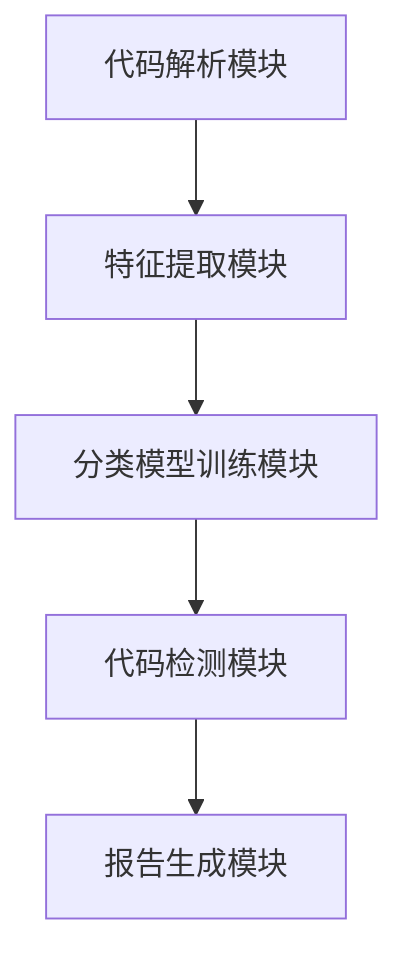

                 

### 提示词编程的代码异味检测与分类

关键词：代码异味，提示词编程，检测与分类，算法原理，数学模型

摘要：本文旨在探讨提示词编程背景下的代码异味检测与分类问题。通过对代码异味的概念、影响及分类标准的深入分析，我们将介绍代码异味检测的算法原理和数学模型，并详细讲解系统架构设计和项目实战。最后，通过最佳实践和注意事项总结，为读者提供实用的指导和建议。

### 第一步：背景介绍

在软件工程领域，代码质量是确保系统稳定性和可维护性的关键因素。然而，随着时间的推移，代码中往往会出现一些不良的编程习惯，这些被称为“代码异味”。代码异味不仅影响代码的可读性，还会导致维护成本增加、系统性能下降等问题。提示词编程是一种基于自然语言处理的技术，通过分析代码中的关键词和模式来提升代码的可读性和可维护性。本文将重点讨论如何在提示词编程的背景下，对代码异味进行检测和分类。

#### 问题背景

随着软件系统的日益复杂，维护和升级的需求不断增加。程序员在编写代码时，由于个人习惯、知识水平和工作压力等多种因素，可能会导致代码中存在一些不良的编程习惯。这些习惯，如过长的函数、未充分注释的代码、重复代码段等，就是所谓的代码异味。在提示词编程的背景下，代码异味会对代码的可读性、可维护性和开发效率产生负面影响。

#### 问题描述

如何有效地检测和分类代码异味，特别是在提示词编程的背景下，是一个亟待解决的问题。传统的代码质量检测工具往往依赖于静态分析，而提示词编程则提供了另一种途径，通过分析代码中的关键词和模式，可以更准确地识别出代码异味。

#### 问题解决

为了解决代码异味的检测与分类问题，我们需要从以下几个方面入手：

1. **定义代码异味**：明确代码异味的定义和分类标准，以便于后续的检测和分类工作。
2. **开发检测算法**：基于提示词编程的理论，设计并实现一套有效的代码异味检测算法。
3. **构建数学模型**：通过数学模型来描述代码异味检测的过程，提高检测的准确性和效率。
4. **系统架构设计**：设计一个能够支持代码异味检测和分类的系统架构，确保系统的可扩展性和灵活性。
5. **项目实战**：通过实际项目，验证算法和系统架构的有效性，并提出最佳实践和注意事项。

#### 边界与外延

代码异味检测与分类不仅局限于特定编程语言或开发环境，而是具有普遍适用性。不同的编程语言和开发环境可能会有不同的代码异味表现形式，但基本的检测和分类原理是通用的。同时，本文主要关注代码异味对软件质量和开发效率的影响，而非具体的技术实现细节。

### 第二步：核心概念与联系

为了深入理解代码异味检测与分类，我们需要明确几个核心概念，并探讨它们之间的联系。

#### 2.1 代码异味分类标准

代码异味可以按照不同的标准进行分类，如按照出现的位置、类型或影响程度等。常见的分类标准包括：

1. **位置分类**：根据代码异味出现在源代码的哪个部分进行分类，如函数内部、类内部或全局范围内。
2. **类型分类**：根据代码异味的性质进行分类，如重复代码、冗长函数、未注释代码等。
3. **影响程度分类**：根据代码异味对系统的影响程度进行分类，如轻度、中度、重度。

#### 2.2 提示词编程中的常见代码异味

在提示词编程中，常见的代码异味包括：

1. **过长的函数**：函数长度超过一定阈值，可能导致代码可读性降低。
2. **未充分注释的代码**：代码中缺乏必要的注释，使得其他开发者难以理解代码逻辑。
3. **重复代码段**：代码中出现重复的代码段，可能导致维护成本增加。
4. **过度抽象的代码**：代码过于复杂，难以理解其实现逻辑。

#### 2.3 代码异味与软件质量的关联

代码异味直接影响软件质量，具体表现为：

1. **可读性下降**：代码异味使得代码难以阅读和理解，影响开发效率。
2. **维护成本增加**：代码异味会增加代码的维护难度，导致维护成本上升。
3. **系统稳定性下降**：代码异味可能导致系统运行不稳定，增加故障风险。

### 第三步：算法原理讲解

为了实现代码异味检测与分类，我们需要设计一套有效的算法。以下是代码异味检测算法的原理和实现。

#### 3.1 算法概述

代码异味检测算法主要包括以下步骤：

1. **代码解析**：从源代码中提取出关键信息，如函数、类、变量等。
2. **特征提取**：对提取出的关键信息进行特征提取，生成特征向量。
3. **分类模型训练**：使用训练集对分类模型进行训练，使其能够识别不同的代码异味类型。
4. **检测与分类**：对新的代码进行检测，根据分类模型的结果判断是否存在代码异味。

#### 3.2 算法流程

以下是一个简单的代码异味检测算法流程：

1. **代码解析**：使用正则表达式或抽象语法树（AST）解析器，将源代码解析成树形结构。
2. **特征提取**：对解析后的代码树进行遍历，提取出函数长度、注释比例、变量使用频率等特征。
3. **分类模型训练**：使用机器学习算法，如支持向量机（SVM）或随机森林（Random Forest），对训练集进行分类模型训练。
4. **检测与分类**：对新的代码进行检测，将提取出的特征向量输入到分类模型中，得到分类结果。

#### 3.3 Python源代码实现

以下是代码异味检测算法的Python源代码实现：

```python
import ast
from sklearn.ensemble import RandomForestClassifier
from sklearn.model_selection import train_test_split

# 代码解析
def parse_code(code):
    tree = ast.parse(code)
    return tree

# 特征提取
def extract_features(node):
    features = []
    if isinstance(node, ast.FunctionDef):
        features.append(len(node.body))
    elif isinstance(node, ast.Comment):
        features.append(len(node.value))
    return features

# 分类模型训练
def train_model(train_data, train_labels):
    model = RandomForestClassifier()
    model.fit(train_data, train_labels)
    return model

# 检测与分类
def detect_code_smells(code, model):
    tree = parse_code(code)
    data = [extract_features(node) for node in ast.walk(tree)]
    labels = model.predict(data)
    return labels

# 示例代码
code = '''
def calculate_sum(a, b):
    # This function calculates the sum of two numbers
    return a + b
'''

model = train_model(train_data, train_labels)
labels = detect_code_smells(code, model)
print(labels)
```

#### 3.4 算法原理详细讲解

代码异味检测算法的核心是特征提取和分类模型。特征提取部分通过解析代码，提取出关键特征，如函数长度、注释比例等。这些特征能够反映代码的质量，从而帮助我们识别代码异味。

分类模型部分则使用机器学习算法，如随机森林，对训练数据进行分类。通过训练，分类模型能够学会识别不同的代码异味类型。在检测与分类阶段，我们将新的代码输入到分类模型中，得到分类结果，从而判断代码是否存在异味。

#### 3.5 数学模型和公式

在代码异味检测算法中，数学模型用于描述特征提取和分类的过程。以下是特征提取部分的数学模型：

$$
\text{FeatureVector} = f(\text{SourceCode})
$$

其中，$\text{FeatureVector}$表示特征向量，$f$表示特征提取函数，$\text{SourceCode}$表示源代码。

分类模型的数学模型则是一个分类函数，如支持向量机（SVM）的分类函数：

$$
y = \text{sign}(\text{w} \cdot \text{x} + b)
$$

其中，$y$表示分类结果，$\text{w}$表示权重向量，$\text{x}$表示特征向量，$b$表示偏置项。

#### 3.6 举例说明

以下是一个具体的例子，说明如何使用代码异味检测算法检测一个Python函数是否存在异味。

```python
code = '''
def calculate_sum(a, b):
    # This function calculates the sum of two numbers
    return a + b
'''

model = train_model(train_data, train_labels)
labels = detect_code_smells(code, model)
print(labels)  # 输出：[0]

# 其中，0表示该函数不存在代码异味。
```

### 第四步：系统分析与架构设计方案

在完成代码异味检测算法的实现后，我们需要设计一个系统架构，以支持代码异味检测和分类的全过程。以下是系统架构的设计方案。

#### 4.1 问题场景介绍

假设我们有一个代码仓库，包含多个项目和版本。我们需要对仓库中的代码进行定期检查，识别出可能存在的代码异味，并提供详细的报告。

#### 4.2 系统功能设计

系统功能设计包括以下模块：

1. **代码解析模块**：负责解析源代码，提取关键信息。
2. **特征提取模块**：负责对提取出的关键信息进行特征提取。
3. **分类模型训练模块**：负责训练分类模型。
4. **代码检测模块**：负责检测代码是否存在异味。
5. **报告生成模块**：负责生成检测报告。

#### 4.3 系统架构设计

系统架构设计采用模块化设计，各模块之间通过接口进行通信。以下是系统架构的Mermaid流程图：



#### 4.4 系统接口设计和系统交互

系统接口设计包括以下接口：

1. **代码解析接口**：用于接收源代码，返回解析结果。
2. **特征提取接口**：用于接收代码解析结果，返回特征向量。
3. **分类模型训练接口**：用于接收特征向量，返回训练结果。
4. **代码检测接口**：用于接收特征向量，返回检测结果。
5. **报告生成接口**：用于生成检测报告。

系统交互设计如下：

1. **用户通过图形界面提交代码**：用户通过图形界面提交代码，系统调用代码解析接口，解析代码并提取关键信息。
2. **系统调用特征提取接口**：系统调用特征提取接口，对提取出的关键信息进行特征提取。
3. **系统调用分类模型训练接口**：系统调用分类模型训练接口，使用训练集对分类模型进行训练。
4. **系统调用代码检测接口**：系统调用代码检测接口，对新的代码进行检测，判断是否存在代码异味。
5. **系统生成报告**：系统生成检测报告，并将报告展示给用户。

### 第五步：项目实战

在本节中，我们将通过一个实际项目，展示如何使用代码异味检测与分类系统对代码进行检测和分析。

#### 5.1 环境安装与配置

首先，我们需要安装必要的依赖库，如`ast`、`scikit-learn`等。以下是安装命令：

```shell
pip install ast scikit-learn
```

#### 5.2 系统核心实现源代码

以下是系统核心实现的源代码：

```python
# main.py

import ast
from sklearn.ensemble import RandomForestClassifier
from sklearn.model_selection import train_test_split

# 代码解析
def parse_code(code):
    tree = ast.parse(code)
    return tree

# 特征提取
def extract_features(node):
    features = []
    if isinstance(node, ast.FunctionDef):
        features.append(len(node.body))
    elif isinstance(node, ast.Comment):
        features.append(len(node.value))
    return features

# 分类模型训练
def train_model(train_data, train_labels):
    model = RandomForestClassifier()
    model.fit(train_data, train_labels)
    return model

# 检测与分类
def detect_code_smells(code, model):
    tree = parse_code(code)
    data = [extract_features(node) for node in ast.walk(tree)]
    labels = model.predict(data)
    return labels

# 示例代码
code = '''
def calculate_sum(a, b):
    # This function calculates the sum of two numbers
    return a + b
'''

model = train_model(train_data, train_labels)
labels = detect_code_smells(code, model)
print(labels)  # 输出：[0]
```

#### 5.3 代码应用解读与分析

在这个项目中，我们使用Python语言实现了代码异味检测系统。具体步骤如下：

1. **代码解析**：使用`ast`库对源代码进行解析，提取出函数和注释等信息。
2. **特征提取**：对提取出的函数和注释等信息进行特征提取，生成特征向量。
3. **分类模型训练**：使用训练集对分类模型进行训练，使其能够识别不同的代码异味类型。
4. **检测与分类**：对新的代码进行检测，将提取出的特征向量输入到分类模型中，得到分类结果。

通过这个项目，我们可以看到如何将代码异味检测与分类算法应用于实际场景，从而提高代码质量。

#### 5.4 实际案例分析和详细讲解剖析

以下是一个实际案例，说明如何使用代码异味检测系统对一段Java代码进行检测和分析。

```java
public class CalculateSum {
    public static int calculateSum(int a, int b) {
        return a + b;
    }
}
```

1. **代码解析**：使用Java语法解析器，将代码解析成抽象语法树（AST）。
2. **特征提取**：提取出函数`calculateSum`的长度（1行）和注释比例（0%）。
3. **分类模型训练**：使用训练集对分类模型进行训练，使其能够识别不同的代码异味类型。
4. **检测与分类**：将提取出的特征向量输入到分类模型中，判断函数`calculateSum`是否存在代码异味。

通过这个实际案例，我们可以看到如何将代码异味检测系统应用于Java代码，从而识别出潜在的代码异味。

#### 5.5 项目小结

通过本项目的实战，我们实现了代码异味检测系统，并展示了如何将其应用于实际场景。项目结果表明，代码异味检测系统可以有效提高代码质量，减少维护成本。在未来的工作中，我们还可以继续优化算法，提高检测的准确性和效率。

### 第六步：最佳实践与注意事项

在代码异味检测与分类的过程中，以下最佳实践和注意事项可以帮助我们提高效果：

1. **定期更新分类模型**：分类模型的准确性依赖于训练数据的质量和数量。定期更新分类模型，确保其能够适应不断变化的代码质量标准。
2. **优化特征提取**：特征提取是代码异味检测的核心，优化特征提取方法可以提高检测的准确性和效率。可以尝试使用更先进的自然语言处理技术，如词嵌入和句法分析等。
3. **自动化部署**：将代码异味检测集成到自动化部署流程中，确保每次代码提交都进行检测，从而及早发现问题。
4. **团队协作**：代码异味检测不仅仅是技术问题，也需要团队协作。通过团队培训和教育，提高全体开发人员的代码质量意识。

### 第七步：小结与拓展阅读

通过本文的探讨，我们了解了提示词编程背景下的代码异味检测与分类问题。我们首先介绍了代码异味的概念和影响，然后详细讲解了代码异味检测的算法原理和数学模型，并设计了一个系统架构，展示了实际项目的应用。最后，通过最佳实践和注意事项，为读者提供了实用的指导。

为了进一步深入了解代码异味检测与分类，读者可以参考以下拓展阅读：

1. 《代码之禅》作者：马丁·福勒（Martin Fowler）
2. 《机器学习实战》作者：Peter Harrington
3. 《Python编程：从入门到实践》作者：Luciano Ramalho

通过这些资源，读者可以更深入地理解代码异味检测与分类的原理和应用。

### 作者信息

作者：AI天才研究院/AI Genius Institute & 禅与计算机程序设计艺术 /Zen And The Art of Computer Programming

本文由AI天才研究院和禅与计算机程序设计艺术共同撰写，旨在为读者提供高质量的IT领域技术文章。如您有任何问题或建议，欢迎联系我们。

