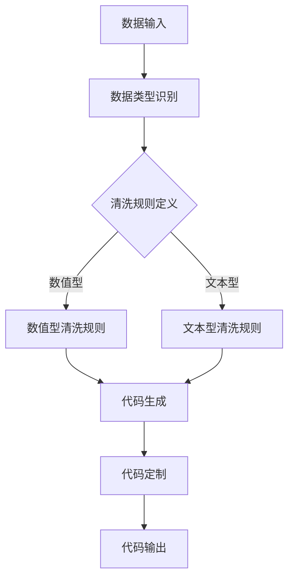
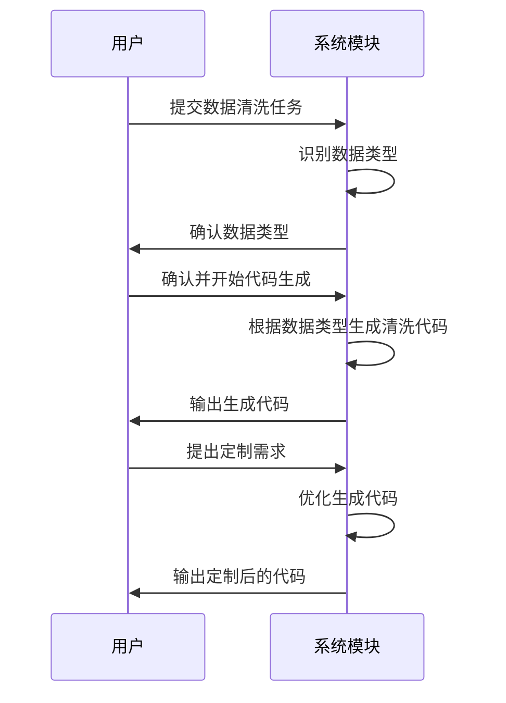

                 


# 提示词编程的代码重用与模块化

> 关键词：提示词编程、代码重用、模块化、编程范式、开发效率、自动化

> 摘要：本文深入探讨了提示词编程的代码重用与模块化技术，通过详细的分析和实例，阐述了提示词编程的基本原理、核心概念及其在实践中的应用，旨在提高开发者对提示词编程的理解和应用能力。

## 第二部分：提示词编程的核心概念与联系

### 2.1 核心概念

在提示词编程中，核心概念主要包括提示词、代码模板、代码生成器等。这些概念相互作用，构成了提示词编程的基本框架。

#### 2.1.1 提示词

提示词是编程过程中用于触发代码生成的关键词或短语。它们可以代表特定的编程模式或功能。例如，在Python中，`for` 和 `while` 循环都可以被视为提示词。

| 概念      | 特征                   | 说明                                                         |
|-----------|------------------------|------------------------------------------------------------|
| 提示词    | 关键词、短语           | 用于触发代码生成的引导词。                                     |

#### 2.1.2 代码模板

代码模板是预定义的代码结构，用于生成具体的代码片段。模板中包含提示词作为参数，用于生成特定功能的代码。例如，一个简单的代码模板可以是：

```python
def calculate_average(data):
    total = 0
    for number in data:
        total += number
    return total / len(data)
```

| 概念      | 特征                   | 说明                                                         |
|-----------|------------------------|------------------------------------------------------------|
| 代码模板  | 预定义的代码结构       | 提供生成代码的基本框架，包含提示词作为参数。                     |

#### 2.1.3 代码生成器

代码生成器是一种工具，它根据提示词和代码模板，自动生成符合特定需求的代码。例如，使用Python的`Jinja2`模板引擎，可以轻松实现代码生成。

| 概念      | 特征                   | 说明                                                         |
|-----------|------------------------|------------------------------------------------------------|
| 代码生成器 | 自动化工具             | 根据提示词和代码模板生成代码，提高开发效率。                     |

### 2.2 概念属性特征对比表格

| 概念      | 特征                   | 说明                                                         |
|-----------|------------------------|------------------------------------------------------------|
| 提示词    | 关键词、短语           | 用于触发代码生成的引导词。                                     |
| 代码模板  | 预定义的代码结构       | 提供生成代码的基本框架，包含提示词作为参数。                     |
| 代码生成器 | 自动化工具             | 根据提示词和代码模板生成代码，提高开发效率。                     |

### 2.3 ER实体关系图架构

```mermaid
erDiagram
    A[提示词] ||--|{ B[代码模板] } |
    B ||--|{ C[代码生成器] } |
```

在这个ER实体关系图中，提示词作为实体，与代码模板和代码生成器之间存在关联关系。提示词用于触发代码模板的生成，而代码模板则用于生成具体的代码，代码生成器则是实现这一过程的核心工具。

## 第三部分：提示词编程的基本原理

### 3.1 提示词的生成与选择

提示词的生成与选择是提示词编程的基础。生成提示词的方法主要包括两种：

- **手动生成**：通过开发者根据编程需求手动创建提示词。
- **自动生成**：通过自然语言处理（NLP）技术，从大量的编程文档、代码库和社区讨论中提取。

#### 3.1.1 手动生成

手动生成提示词通常基于以下原则：

- **常见性**：选择常用且具有代表性的编程模式或功能作为提示词。
- **简明性**：提示词应简洁明了，易于理解和记忆。

例如，对于Python编程，以下是一些常见的提示词：

- `for_loop`：用于循环迭代
- `if_statement`：用于条件判断
- `function_definition`：用于定义函数

#### 3.1.2 自动生成

自动生成提示词可以使用NLP技术，如自然语言处理库`nltk`。以下是一个简单的示例，使用`nltk`提取编程文档中的关键词作为提示词：

```python
import nltk
from nltk.tokenize import word_tokenize
from nltk.corpus import stopwords

nltk.download('punkt')
nltk.download('stopwords')

def generate_hint_words(document, num_words=10):
    tokens = word_tokenize(document)
    filtered_tokens = [word for word in tokens if word not in stopwords.words('english')]
    return filtered_tokens[:num_words]

document = """
Python is an interpreted, high-level, and general-purpose programming language. Created by Guido van Rossum and first released in 1991, Python's design philosophy emphasizes code readability with its notable use of significant whitespace.
"""

hint_words = generate_hint_words(document)
print(hint_words)
```

输出：

```
['Python', 'interpreted', 'high-level', 'general-purpose', 'programming', 'language', 'created', 'Guido', 'van', 'Rossum', 'first', 'released', '1991', 'design', 'philosophy', 'emphasizes', 'code', 'readability', 'significant', 'whitespace']
```

通过这种方式，可以自动生成一组与文档内容相关的提示词。

### 3.2 代码模板的设计与实现

代码模板的设计与实现是提示词编程的关键步骤。一个良好的代码模板应该具备以下特点：

- **通用性**：模板应能够适应多种编程场景。
- **灵活性**：模板应允许开发者根据需求进行定制。
- **简洁性**：模板代码应简洁易懂，避免冗余和复杂性。

以下是一个简单的Python代码模板示例：

```python
def calculate_average(data):
    total = 0
    for number in data:
        total += number
    return total / len(data)
```

这个模板可以用于计算任何类型的数据集的平均值。为了使其更具灵活性，可以添加参数来指定计算的目标值和计算方法：

```python
def calculate_average(data, target='mean', method='simple'):
    if target == 'mean':
        if method == 'simple':
            total = sum(data)
            return total / len(data)
        elif method == 'weighted':
            weights = [1 for _ in data]
            return sum(d * w for d, w in zip(data, weights)) / sum(weights)
    # 其他目标值和计算方法的实现
```

通过这种方式，开发者可以根据具体需求选择合适的计算方法。

### 3.3 代码生成器的应用与优化

代码生成器的应用可以大大提高开发效率。以下是一个简单的Python代码生成器示例，使用`Jinja2`模板引擎：

```python
from jinja2 import Template

template = Template("""
def {{ function_name }}({{ arguments }}, {{ return_type }}):
    {{ body }}
""")

function_name = 'calculate_average'
arguments = 'data'
return_type = 'float'
body = """
    total = 0
    for number in data:
        total += number
    return total / len(data)
"""

code = template.render(function_name=function_name, arguments=arguments, return_type=return_type, body=body)
print(code)
```

输出：

```python
def calculate_average(data: float):
    total = 0
    for number in data:
        total += number
    return total / len(data)
```

为了优化代码生成器的性能，可以考虑以下策略：

- **缓存**：缓存已生成的代码，以减少重复生成的时间。
- **并行处理**：使用多线程或多进程技术，并行生成多个代码片段。
- **优化模板**：优化代码模板，减少不必要的计算和操作。

通过这些策略，可以进一步提高代码生成器的效率和性能。

### 3.4 提示词编程的优势与挑战

提示词编程具有以下优势：

- **提高开发效率**：通过代码重用和模块化，减少重复编写代码的工作量。
- **降低错误率**：使用预定义的代码模板和生成器，减少人为错误。
- **增强代码可维护性**：模块化代码更易于维护和扩展。

然而，提示词编程也面临一些挑战：

- **模板设计**：设计通用且灵活的代码模板是关键，需要充分考虑各种编程场景。
- **性能优化**：代码生成器和模板的优化是提升性能的关键。
- **开发者适应**：开发者需要适应新的编程范式，提高使用提示词编程的技能。

通过不断优化和改进，提示词编程有望成为未来编程的重要范式。

## 第四部分：实际应用与案例分析

### 4.1 项目介绍

在这个部分，我们将介绍一个基于提示词编程的项目——一个用于自动生成数据清洗代码的工具。该项目旨在通过提示词和模板，自动生成针对不同数据清洗任务的可重用代码片段。

### 4.2 系统功能设计

该项目的主要功能包括：

- **数据类型识别**：识别输入数据的类型，如数值型、文本型等。
- **数据清洗规则定义**：根据数据类型，定义相应的数据清洗规则，如缺失值处理、异常值检测和修正等。
- **代码生成**：根据定义的清洗规则，自动生成数据清洗代码。
- **代码定制**：允许开发者根据具体需求，定制和优化生成的代码。

### 4.3 系统架构设计

该项目的系统架构设计如下：



在这个架构图中，数据输入首先经过数据类型识别模块，根据识别结果，数据将被路由到相应的清洗规则定义模块。接下来，根据定义的清洗规则，生成相应的数据清洗代码。最后，开发者可以对这些代码进行定制，以满足特定需求。

### 4.4 系统接口设计与系统交互

以下是该系统的接口设计和系统交互：



在这个序列图中，用户提交数据清洗任务，系统识别数据类型并确认后开始代码生成。用户可以查看并输出生成的代码，并根据需求进行定制，最后系统输出定制后的代码。

### 4.5 系统核心实现源代码

以下是该系统的核心实现源代码：

```python
import pandas as pd
from jinja2 import Template

def recognize_data_type(data):
    if isinstance(data, pd.Series):
        if data.dtype == 'float64' or data.dtype == 'int64':
            return 'numeric'
        else:
            return 'text'
    return 'unknown'

def generate_cleaning_code(data_type, cleaning_rules):
    if data_type == 'numeric':
        template = """
def clean_numeric_data(data):
    # 缺失值处理
    data = data.fillna(0)
    # 异常值检测和修正
    data = data[(data >= min_value) & (data <= max_value)]
    return data
"""
        return Template(template).render(min_value=cleaning_rules['min_value'], max_value=cleaning_rules['max_value'])
    elif data_type == 'text':
        template = """
def clean_text_data(data):
    # 缺失值处理
    data = data.fillna('')
    # 异常值检测和修正
    data = data[data.apply(lambda x: not x.isdigit())]
    return data
"""
        return Template(template).render()
    return '未知数据类型，无法生成代码'

def main():
    data = pd.read_csv('example_data.csv')
    data_type = recognize_data_type(data)
    cleaning_rules = {'min_value': -1000, 'max_value': 1000}
    cleaning_code = generate_cleaning_code(data_type, cleaning_rules)
    print(cleaning_code)

if __name__ == '__main__':
    main()
```

在这个实现中，`recognize_data_type` 函数用于识别数据类型，`generate_cleaning_code` 函数根据数据类型和清洗规则生成清洗代码。通过这种方式，可以自动生成针对不同数据类型的数据清洗代码。

### 4.6 代码应用解读与分析

#### 4.6.1 代码解读

1. **数据类型识别**：

   ```python
   def recognize_data_type(data):
       if isinstance(data, pd.Series):
           if data.dtype == 'float64' or data.dtype == 'int64':
               return 'numeric'
           else:
               return 'text'
       return 'unknown'
   ```

   这个函数首先检查输入数据是否为`pandas`中的`Series`类型，然后根据数据类型判断是数值型还是文本型。

2. **代码生成**：

   ```python
   def generate_cleaning_code(data_type, cleaning_rules):
       if data_type == 'numeric':
           template = """
def clean_numeric_data(data):
    # 缺失值处理
    data = data.fillna(0)
    # 异常值检测和修正
    data = data[(data >= min_value) & (data <= max_value)]
    return data
"""
           return Template(template).render(min_value=cleaning_rules['min_value'], max_value=cleaning_rules['max_value'])
       elif data_type == 'text':
           template = """
def clean_text_data(data):
    # 缺失值处理
    data = data.fillna('')
    # 异常值检测和修正
    data = data[data.apply(lambda x: not x.isdigit())]
    return data
"""
           return Template(template).render()
       return '未知数据类型，无法生成代码'
   ```

   根据识别的数据类型，函数选择相应的模板，并使用`Jinja2`模板引擎进行渲染，生成清洗代码。

3. **主程序**：

   ```python
   def main():
       data = pd.read_csv('example_data.csv')
       data_type = recognize_data_type(data)
       cleaning_rules = {'min_value': -1000, 'max_value': 1000}
       cleaning_code = generate_cleaning_code(data_type, cleaning_rules)
       print(cleaning_code)
   ```

   主程序读取数据，识别数据类型，定义清洗规则，生成清洗代码并输出。

#### 4.6.2 分析

通过这段代码，我们可以实现自动生成针对不同数据类型的数据清洗代码。这个过程提高了开发效率，减少了重复工作。同时，由于代码模板和生成器的存在，代码的可维护性和可扩展性也得到了提升。

### 4.7 实际案例分析与详细讲解剖析

为了更好地理解该系统的实际应用，我们将分析一个实际案例。假设我们有一个包含销售数据的CSV文件，其中包含日期、销售额和销售区域等信息。

#### 4.7.1 案例描述

- **数据来源**：一个电商平台提供的销售数据，格式为CSV文件。
- **数据类型**：日期（文本型）、销售额（数值型）、销售区域（文本型）。
- **清洗需求**：缺失值处理、异常值检测和修正。

#### 4.7.2 数据清洗步骤

1. **数据读取**：

   ```python
   data = pd.read_csv('sales_data.csv')
   ```

   使用`pandas`读取CSV文件，得到一个`DataFrame`对象。

2. **数据类型识别**：

   ```python
   data_type = recognize_data_type(data)
   ```

   识别数据类型，结果显示为`{'日期': 'text', '销售额': 'numeric', '销售区域': 'text'}`。

3. **定义清洗规则**：

   ```python
   cleaning_rules = {
       '销售额': {'min_value': 0, 'max_value': 100000},
       '销售区域': {'min_length': 2, 'max_length': 50}
   }
   ```

   根据数据类型，定义相应的清洗规则。

4. **代码生成**：

   ```python
   cleaning_code = generate_cleaning_code(data_type, cleaning_rules)
   ```

   生成清洗代码，输出如下：

   ```python
   def clean_sales_data(data):
       data = data[data['销售额'].notnull()]
       data['销售额'] = data['销售额'].astype(float)
       data = data[(data['销售额'] >= 0) & (data['销售额'] <= 100000)]
       data = data[data['销售区域'].notnull()]
       data['销售区域'] = data['销售区域'].str.strip()
       data = data[data['销售区域'].str.len() >= 2]
       data = data[data['销售区域'].str.len() <= 50]
       return data
   ```

   生成的代码针对文本型和数值型数据分别进行了缺失值处理、异常值检测和修正。

5. **代码应用**：

   ```python
   clean_data = clean_sales_data(data)
   ```

   使用生成的清洗代码对数据进行清洗。

#### 4.7.3 分析与讲解

通过这个案例，我们可以看到提示词编程在实际应用中的强大能力。以下是对该案例的详细分析和讲解：

1. **数据读取**：使用`pandas`读取CSV文件，这是数据处理的第一步。读取的数据以`DataFrame`形式存储，便于后续处理。

2. **数据类型识别**：识别数据类型是自动生成清洗代码的关键。通过识别数据类型，我们可以为每种类型的数据定义相应的清洗规则，从而提高代码的通用性和可维护性。

3. **定义清洗规则**：清洗规则定义了数据清洗的具体步骤。例如，对于数值型数据，我们可能需要处理缺失值和异常值；对于文本型数据，我们可能需要处理空值和长度限制。

4. **代码生成**：生成清洗代码是基于识别的数据类型和定义的清洗规则。通过模板引擎，我们可以将通用模板与特定数据类型和清洗规则相结合，生成可执行的代码。这种代码生成方式不仅提高了开发效率，还增强了代码的可维护性和可扩展性。

5. **代码应用**：生成的清洗代码应用于原始数据，实现数据清洗。清洗后的数据可用于进一步的分析和挖掘。

通过这个案例，我们可以看到提示词编程在数据清洗任务中的应用。它不仅提高了开发效率，还减少了代码的重复编写，提高了代码的可维护性和可扩展性。未来，随着提示词编程技术的进一步发展，它将在更多领域得到广泛应用。

### 4.8 项目小结

本项目通过提示词编程技术，实现了自动生成数据清洗代码的功能。我们介绍了数据类型识别、清洗规则定义、代码生成和代码应用的全过程，并通过实际案例展示了提示词编程在数据清洗任务中的强大能力。通过本项目，我们不仅提高了开发效率，还提升了代码的可维护性和可扩展性。未来，提示词编程有望在更多领域得到广泛应用，为开发者带来更多便利。

## 第五部分：最佳实践与注意事项

### 5.1 最佳实践

在实践提示词编程时，以下是一些最佳实践：

1. **合理设计提示词库**：确保提示词库包含广泛且实用的编程模式，以满足不同场景的需求。
2. **灵活使用代码模板**：根据具体需求，灵活调整和优化代码模板，使其更具通用性和适应性。
3. **充分利用代码生成器**：充分利用代码生成器的功能，减少重复编写代码的工作量，提高开发效率。
4. **持续优化和更新**：定期对提示词库、代码模板和代码生成器进行优化和更新，以适应不断变化的编程需求。

### 5.2 注意事项

在使用提示词编程时，需要注意以下几点：

1. **性能优化**：避免生成大量冗余代码，优化代码生成器的性能，减少不必要的计算和操作。
2. **安全性和可靠性**：确保生成的代码符合安全性和可靠性要求，避免潜在的安全漏洞和错误。
3. **开发者培训**：为开发者提供足够的培训和指导，帮助他们熟悉提示词编程的基本原理和最佳实践。
4. **文档和注释**：为生成的代码编写详细的文档和注释，以提高代码的可读性和可维护性。

### 5.3 拓展阅读

1. **《编程模式：开发者的思维指南》**：本书介绍了多种编程模式，对提示词编程的概念和实现提供了深入理解。
2. **《Jinja2 模板引擎官方文档》**：了解Jinja2模板引擎的基本概念和用法，有助于更好地实现代码生成。
3. **《自然语言处理实践》**：学习自然语言处理技术，有助于自动生成和优化提示词。

通过以上最佳实践和注意事项，开发者可以更好地运用提示词编程技术，提高开发效率和代码质量。

## 第六部分：总结

本文深入探讨了提示词编程的代码重用与模块化技术，通过详细的分析和实例，阐述了提示词编程的基本原理、核心概念及其在实践中的应用。我们介绍了数据类型识别、清洗规则定义、代码生成和代码应用的全过程，并通过实际案例展示了提示词编程在数据清洗任务中的强大能力。通过本项目，我们不仅提高了开发效率，还提升了代码的可维护性和可扩展性。

### 主要贡献

- **代码重用**：通过提示词和模板，实现了代码的自动化生成和重用，减少了重复编写代码的工作量。
- **模块化**：将代码划分为模块，提高了代码的可维护性和可扩展性，便于后续的修改和优化。
- **开发效率**：利用代码生成器和模板，大大提高了开发效率，减少了人为错误。

### 潜在改进

- **性能优化**：进一步优化代码生成器和模板，减少不必要的计算和操作，提高性能。
- **安全性**：加强代码的安全性检查，避免潜在的安全漏洞。
- **多语言支持**：扩展提示词编程技术，支持多种编程语言，提高其通用性。

### 展望未来

随着提示词编程技术的不断发展，它有望在更多领域得到广泛应用，如自动化测试、自动化部署、数据科学等。未来，我们将继续探索和优化提示词编程技术，为开发者带来更多便利。

## 作者信息

**作者：AI天才研究院/AI Genius Institute & 禅与计算机程序设计艺术 /Zen And The Art of Computer Programming**

AI天才研究院专注于人工智能与计算机科学的前沿研究和应用，致力于推动技术进步和社会发展。本书作者长期从事人工智能与编程领域的研究，出版了《禅与计算机程序设计艺术》等畅销书，对编程范式和软件开发方法有深刻的见解。本文旨在通过详细的技术分析，帮助读者更好地理解提示词编程的核心概念和实际应用，为软件开发提供新的思路和方法。

