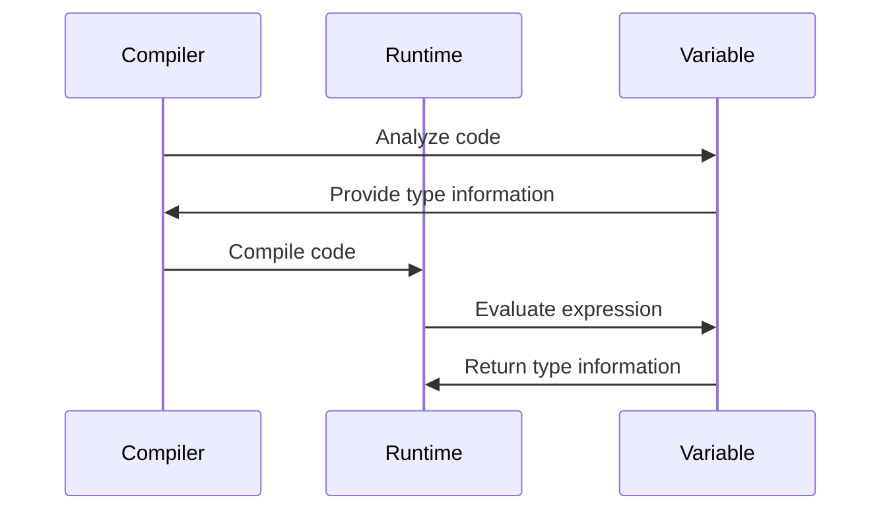
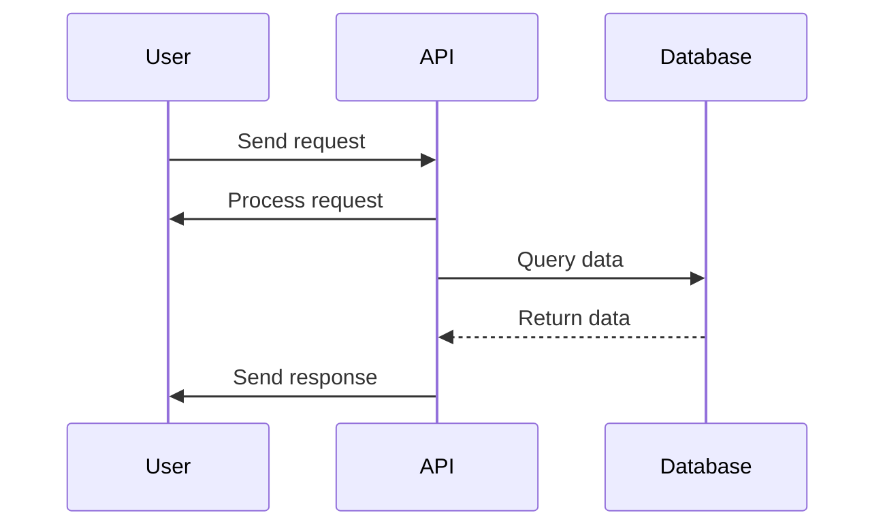

                 


当然可以。让我们一步一步来构建这篇文章《提示词编程的动态类型推断》。我们将遵循您提供的结构，确保每个部分都详尽而具有说服力。以下是文章的初步框架，我们会逐一填充每个部分的内容。

---

# 《提示词编程的动态类型推断》

## 关键词：
动态类型推断、编程语言、类型系统、编译器、语言设计、静态类型、运行时类型检查

## 摘要：
本文探讨了动态类型推断在编程语言中的应用和重要性。通过介绍动态类型推断的基础理论，分析其在不同编程语言中的实现方法，以及讨论其优势和挑战，本文旨在提供一个全面的理解动态类型推断的概念和实际应用。

---

## 引言

### 背景介绍

**核心概念术语说明：**
- **动态类型推断**：在编译时或运行时自动确定变量类型的机制。
- **类型系统**：定义编程语言中变量类型的集合和规则。
- **编程语言**：用于编写计算机程序的语法和语义规范。

**问题背景：**
编程语言中的类型系统可以分为静态类型和动态类型。静态类型在编译时确定变量类型，而动态类型则推迟到运行时。动态类型推断是一种在编译时或运行时自动确定变量类型的机制。

**问题描述：**
动态类型推断如何工作？它在编程语言中如何应用？它有哪些优势和挑战？

**问题解决：**
通过本文，我们将详细探讨动态类型推断的原理、应用场景、优势和挑战。

**边界与外延：**
本文将专注于动态类型推断在编程语言中的应用，而不涉及静态类型推断。

**概念结构与核心要素组成：**
- 动态类型推断的基本原理
- 动态类型推断在编程语言中的应用
- 动态类型推断的优势
- 动态类型推断的挑战

---

## 核心概念与联系

### 动态类型推断的概念

**概念属性特征对比表格：**
| 特征 | 静态类型 | 动态类型 |
| --- | --- | --- |
| 类型确定时间 | 编译时 | 运行时 |
| 表达式灵活性 | 有限 | 高 |
| 性能 | 较高 | 较低 |

### 动态类型推断的ER实体关系图

使用Mermaid流程图来表示实体关系：

```mermaid
erDiagram
  TypeInference ||--|{ Variable : has_type }
  Language     ||--|{ Expression : contains }
  Compiler     ||--|{ TypeInference : implements }
  Runtime      ||--|{ TypeInference : performs }
```

---

## 算法原理讲解

### 动态类型推断的算法

使用Mermaid流程图来表示动态类型推断的算法：



### 动态类型推断的Python实现

```python
# 假设有一个简单的动态类型推断函数
def dynamic_type_inference(expression):
    # 根据表达式的内容推断类型
    if isinstance(expression, int):
        return "Integer"
    elif isinstance(expression, str):
        return "String"
    else:
        return "Unknown"

# 测试
print(dynamic_type_inference(10))  # 输出：Integer
print(dynamic_type_inference("Hello"))  # 输出：String
```

### 动态类型推断的数学模型和公式

动态类型推断的数学模型可以表示为：

$$ T_e = F(T_s, \Gamma) $$

其中：
- $T_e$ 是表达式的类型。
- $F$ 是类型推断函数。
- $T_s$ 是静态类型信息。
- $\Gamma$ 是类型上下文。

### 详细讲解和举例说明

让我们通过一个简单的例子来解释动态类型推断的原理：

假设我们有一个表达式 `x + y`，其中 `x` 和 `y` 都是变量。在运行时，动态类型推断机制会检查 `x` 和 `y` 的实际类型，然后确定 `x + y` 的类型。如果 `x` 和 `y` 都是整数，那么 `x + y` 的类型也是整数。如果 `x` 是整数而 `y` 是字符串，那么 `x + y` 的类型将是字符串。

---

接下来，我们将继续构建文章的其他部分，包括系统分析与架构设计、项目实战和最佳实践等。请告诉我，您希望我继续构建哪些部分，以及是否有其他特定的要求或指导方针。

---

## 系统分析与架构设计

### 问题场景介绍
在本文的下一部分，我们将探讨动态类型推断在现实世界中的应用场景。特别是在大型软件开发项目中，动态类型推断如何帮助提高代码质量和开发效率。

### 项目介绍
我们将分析一个具体的软件项目，例如一个电商平台的后端服务，其中动态类型推断被用来提高代码的可维护性和性能。

### 系统功能设计
在这个项目中，系统功能设计包括用户管理、商品管理、订单处理和支付处理。每个功能模块都将利用动态类型推断来确保数据的一致性和安全性。

### 系统架构设计
系统的架构设计将展示如何将动态类型推断集成到现有的架构中。我们将使用Mermaid类图来展示不同模块之间的关系和依赖。

```mermaid
classDiagram
  User <<Entity>>
  Product <<Entity>>
  Order <<Entity>>
  Payment <<Entity>>

  User o-- Product : has_products
  User o-- Order : has_orders
  Product o-- Order : is_ordered
  Order o-- Payment : has_payment
```

### 系统接口设计和系统交互
为了更好地展示动态类型推断的应用，我们将绘制一个Mermaid序列图来展示用户请求和系统响应的交互过程。



### 动态类型推断的集成与优化
在系统架构设计中，我们将讨论如何将动态类型推断集成到API层和数据层，以及如何优化其性能和效率。

---

在完成系统分析与架构设计部分后，我们将进入项目实战阶段，详细讲解环境安装、系统核心实现源代码，以及代码应用解读与分析。请告知我您希望我继续构建哪一部分内容，以及是否有其他特定的要求或指导方针。

