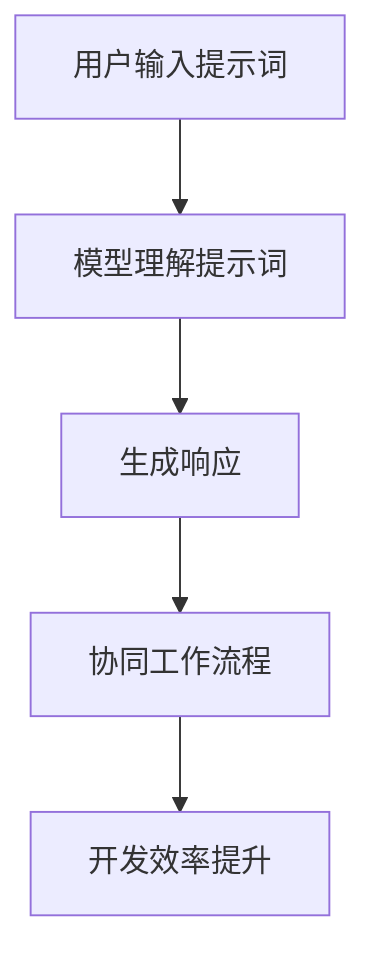
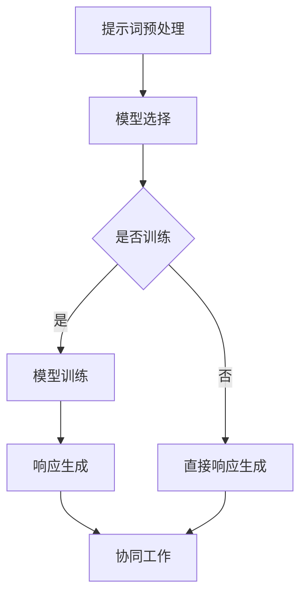
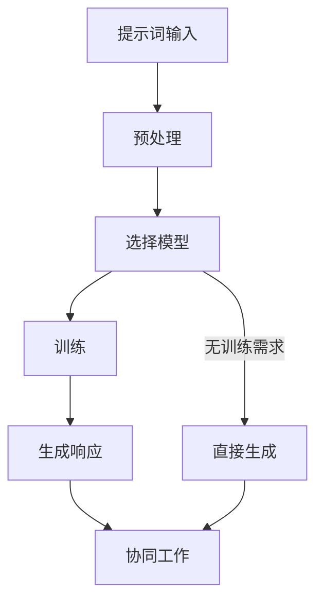
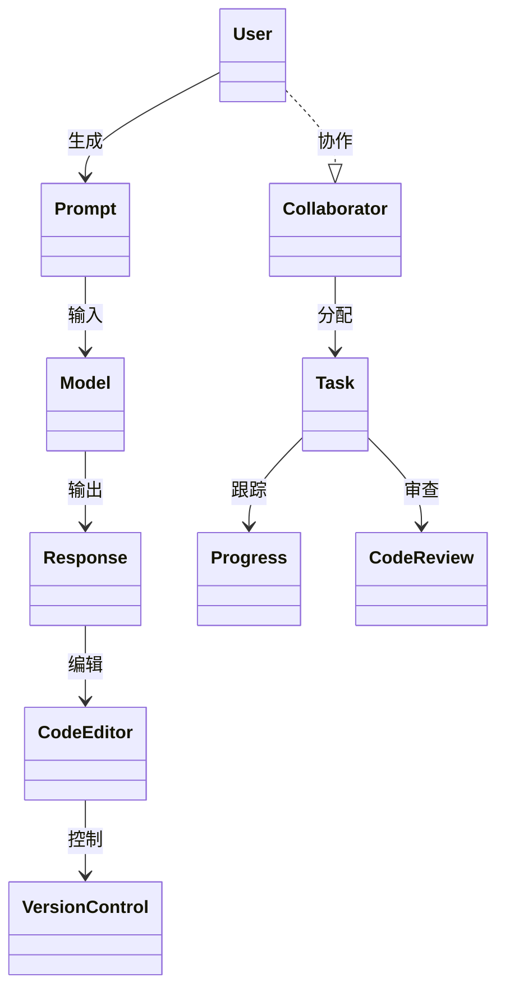
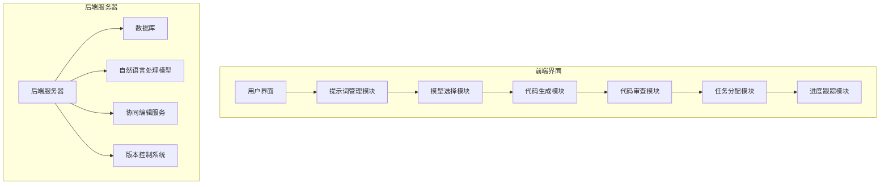
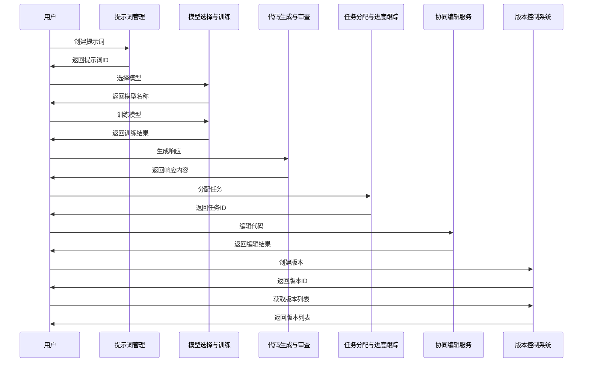

                 

# 提示词编程的协同工作流程设计

## 关键词
- 提示词编程
- 协同工作流程
- 软件开发
- 模型理解
- 算法原理

## 摘要
本文旨在深入探讨提示词编程的协同工作流程设计，通过背景介绍、核心概念与联系分析、算法原理讲解、系统分析与架构设计方案以及项目实战，全面解析提示词编程在现代软件开发中的应用及其对团队协作的积极影响。

### 目录大纲设计

#### 背景介绍
- 提示词编程的概念与意义
- 现代软件开发中的协作需求
- 提示词编程在团队协作中的潜力

#### 核心概念与联系
- 提示词的定义与作用
- 模型理解的过程与机制
- 协同工作流程的设计与实现

#### 算法原理讲解
- 提示词编程的核心算法步骤
- 算法流程图与数学模型
- 算法举例与解释

#### 系统分析与架构设计方案
- 问题场景介绍
- 系统功能设计
- 系统架构设计
- 系统接口设计与交互

#### 项目实战
- 环境安装与准备
- 系统核心实现源代码
- 代码应用解读与分析
- 实际案例分析与剖析
- 项目小结与总结

#### 最佳实践 Tips
- 小组协作中的提示词编程技巧
- 提高团队协作效率的建议

#### 小结
- 提示词编程的协同工作流程设计的价值
- 未来发展趋势与展望

#### 注意事项
- 协同工作流程中的潜在挑战
- 如何应对常见问题

#### 拓展阅读
- 相关领域的研究论文与书籍
- 先进实践案例分享

### 背景介绍

#### 提示词编程的概念与意义
提示词编程（Prompt-Based Programming）是一种新兴的编程范式，它利用人工智能技术，特别是自然语言处理和机器学习，使开发者能够通过编写提示词（Prompts）来引导程序执行特定任务。与传统编程相比，提示词编程更加注重人机交互，强调通过自然语言来沟通意图，从而简化编程过程，降低开发门槛。

提示词编程的意义在于：
- **简化编程过程**：通过自然语言提示，开发者可以更快速地表达编程意图，减少代码编写的复杂性。
- **提高开发效率**：提示词编程可以自动化许多常规任务，如代码生成、错误修复等，从而提高开发效率。
- **增强人机协作**：提示词编程使得非技术人员也能够参与到软件开发过程中，促进团队协作。

#### 现代软件开发中的协作需求
现代软件开发趋向于复杂化，项目规模和复杂性不断增加，这使得团队协作变得尤为重要。随着远程工作和分布式团队的普及，如何有效地协同工作成为软件开发中的一大挑战。提示词编程为此提供了一种新的解决方案。

现代软件开发中的协作需求主要包括：
- **代码共享**：团队成员需要实时共享代码，以便协同开发和审查。
- **任务分配**：明确每个成员的责任和任务，确保项目进度和质量的控制。
- **沟通与协调**：团队内部和团队之间的沟通协调，确保项目目标的达成。
- **反馈与迭代**：快速响应用户需求和反馈，不断迭代优化软件产品。

#### 提示词编程在团队协作中的潜力
提示词编程在团队协作中的应用潜力主要体现在以下几个方面：

1. **任务自动化**：通过提示词编程，可以将一些重复性、规则性强的任务自动化，减少团队成员的工作量。
2. **提高沟通效率**：提示词编程使得团队成员可以通过自然语言进行高效沟通，减少误解和沟通成本。
3. **代码质量提升**：提示词编程可以帮助团队成员更快地编写高质量的代码，减少错误和漏洞。
4. **知识共享**：通过共享提示词和生成的代码，团队成员可以更轻松地分享知识和经验，促进团队学习和成长。

### 核心概念与联系

#### 提示词的定义与作用
提示词（Prompts）是提示词编程的核心概念，它是一种指示性信息，用于引导模型执行特定任务。提示词通常由用户输入，可以是简单的文本，也可以是复杂的命令组合。

提示词的作用主要体现在以下几个方面：
- **指导模型**：提示词为模型提供了明确的任务指令，帮助模型理解用户意图。
- **提高效率**：通过提示词，用户可以更快速地完成编程任务，减少手动编码的工作量。
- **灵活定制**：提示词可以根据不同任务需求进行灵活调整，以适应不同的应用场景。

#### 模型理解的过程与机制
模型理解（Model Understanding）是提示词编程中的关键环节，它涉及到模型如何解析用户输入的提示词并生成相应的响应。

模型理解的过程主要包括以下几个步骤：
1. **提示词接收**：模型接收用户输入的提示词。
2. **提示词预处理**：对提示词进行去噪、分词等预处理操作，使其更易于模型处理。
3. **意图识别**：模型通过分析提示词中的关键词和语法结构，识别用户的意图。
4. **响应生成**：模型根据识别的意图，生成相应的响应。

模型理解的机制依赖于深度学习技术，特别是自然语言处理（NLP）模型。这些模型通过大量的训练数据，学习到如何解析自然语言，从而实现对提示词的理解。

#### 协同工作流程的设计与实现
协同工作流程（Collaborative Workflow）是提示词编程在团队协作中的具体应用，它涉及到团队成员如何通过提示词编程实现高效合作。

协同工作流程的设计与实现主要包括以下几个步骤：
1. **任务分配**：根据项目需求，为每个团队成员分配具体的任务。
2. **提示词定义**：团队成员根据任务需求，编写相应的提示词，用于指导模型执行任务。
3. **模型训练**：使用大量数据对模型进行训练，提高模型性能。
4. **协同开发**：团队成员通过共享提示词和模型响应，实现协同开发。
5. **代码审查与反馈**：团队成员对生成的代码进行审查和反馈，确保代码质量和项目进度。

#### 概念属性特征对比表格

| 概念        | 描述                                                         | 关联概念                    |
|-------------|--------------------------------------------------------------|-----------------------------|
| 提示词      | 用户输入的文本，用于指导模型生成响应。                         | 模型理解、协同工作流程      |
| 模型理解    | 模型解析提示词，理解其意图并生成响应的过程。                   | 提示词、协同工作流程      |
| 协同工作流程 | 团队成员利用提示词编程实现协作，提高开发效率。                   | 提示词、模型理解            |

#### Mermaid流程图



### 算法原理讲解

#### 提示词编程的核心算法步骤

提示词编程的核心算法可以概括为以下几个步骤：

1. **提示词预处理**：对用户输入的提示词进行预处理，包括去噪、分词等。
   - 去噪：去除提示词中的无关信息，如空格、标点符号等。
   - 分词：将提示词划分为更小的单元，如单词或短语。

2. **模型选择**：根据任务需求选择合适的模型。
   - 语言模型：如BERT、GPT等，用于自然语言理解和生成。
   - 任务模型：针对特定任务设计的模型，如代码生成模型、图像识别模型等。

3. **模型训练**：使用大量数据对模型进行训练，提高模型性能。
   - 数据集准备：收集和整理与任务相关的数据集。
   - 模型训练：通过梯度下降等优化算法，调整模型参数，使其适应训练数据。

4. **响应生成**：模型接收提示词后，生成相应的响应。
   - 输出层设计：设计合适的输出层，如分类层、回归层等，以生成预期的输出。
   - 响应调整：根据生成的响应，进行后处理，如格式化、错误修复等。

5. **协同工作**：团队成员通过共享提示词和响应，实现协作开发。
   - 提示词共享：团队成员之间共享提示词，确保任务理解的统一。
   - 响应共享：团队成员之间共享模型生成的响应，进行代码审查和反馈。

下面是一个简单的算法mermaid流程图：



#### 算法流程图



#### 算法原理的数学模型与公式

提示词编程的数学模型可以简化为：

$$
y = f(w, x)
$$

其中，$y$ 是模型生成的响应，$f$ 是响应函数，$w$ 是模型的权重参数，$x$ 是输入的提示词。

- $f(w, x)$ 表示模型在权重参数 $w$ 和提示词 $x$ 作用下生成的响应。
- $w$ 是通过训练过程确定的模型参数，用于调整模型的表现。
- $x$ 是用户输入的提示词，代表用户的意图和需求。

#### 算法原理的详细讲解与举例

为了更好地理解提示词编程的算法原理，我们可以通过一个具体的例子来详细讲解。

**例子：代码生成**

假设我们有一个任务，需要根据用户输入的提示词生成一段Python代码，用于实现一个简单的函数。提示词可以是如下的形式：

```
Write a function that takes a list of numbers and returns the sum of the even numbers.
```

根据这个提示词，我们可以按照以下步骤进行算法实现：

1. **提示词预处理**：首先，我们对提示词进行预处理，去除无关信息，如标点符号和空格，得到如下预处理后的提示词：

```
Write a function that takes a list of numbers and returns the sum of the even numbers.
```

2. **模型选择**：选择一个合适的语言模型，如BERT，用于处理自然语言输入。BERT模型经过预训练，能够很好地理解自然语言。

3. **模型训练**：使用大量的代码生成数据进行模型训练，调整模型参数，使其能够生成符合提示词要求的代码。

4. **响应生成**：模型接收预处理后的提示词，根据训练好的模型参数生成相应的代码响应。生成的代码可能如下所示：

```python
def sum_even_numbers(numbers):
    return sum(number for number in numbers if number % 2 == 0)
```

5. **协同工作**：团队成员可以共享这个提示词和生成的代码，进行代码审查和反馈，确保代码的质量和正确性。

通过这个例子，我们可以看到提示词编程是如何通过一系列算法步骤，将用户的自然语言提示转化为具体的代码响应的。

### 系统分析与架构设计方案

#### 问题场景介绍

在当前软件开发中，团队协作是确保项目成功的关键。然而，随着项目规模的不断扩大和复杂性的增加，团队成员之间的沟通和协作变得更加困难。特别是在分布式团队中，地理位置、时间差和文化差异等因素都会对团队协作产生负面影响。为了提高开发效率和代码质量，我们需要找到一种有效的协作模式，使团队成员能够更轻松地共享信息、协调任务。

提示词编程作为一种新兴的编程范式，为解决团队协作问题提供了一种新的思路。通过提示词编程，团队成员可以使用自然语言提示来指导模型执行任务，从而简化编程过程，提高沟通效率。本节将介绍一个基于提示词编程的协同工作流程设计，旨在解决现代软件开发中的协作挑战。

#### 系统功能设计

为了实现提示词编程的协同工作流程，我们需要设计一套完整的系统功能，确保团队成员能够高效地协作。以下是系统的核心功能：

1. **提示词管理**：提供提示词的创建、编辑、删除和查询功能，使团队成员能够方便地管理和共享提示词。
2. **模型选择与训练**：提供多种预训练模型供选择，并支持模型训练功能，以适应不同任务的需求。
3. **代码生成与审查**：根据提示词生成相应的代码响应，并提供代码审查功能，确保生成的代码质量和正确性。
4. **协同编辑与版本控制**：支持团队成员实时协同编辑代码，并实现版本控制，避免代码冲突和丢失。
5. **任务分配与进度跟踪**：提供任务分配和进度跟踪功能，确保每个团队成员都能清楚了解自己的任务和项目进度。
6. **沟通与反馈**：提供实时沟通工具，如聊天室、邮件通知等，确保团队成员之间的信息畅通。

以下是一个Mermaid类图，展示了系统中的核心类及其关系：



#### 系统架构设计

为了实现提示词编程的协同工作流程，我们需要设计一个合理的系统架构，确保系统的可扩展性和灵活性。以下是系统的整体架构设计：

1. **前端界面**：提供用户友好的界面，支持提示词输入、代码生成、代码审查、任务分配和进度跟踪等功能。
2. **后端服务器**：处理前端请求，管理提示词、模型和响应，并提供API供前端调用。
3. **数据库**：存储用户信息、提示词、模型参数、响应结果、任务进度和版本信息等。
4. **自然语言处理模型**：提供多种预训练模型，如BERT、GPT等，用于处理自然语言输入。
5. **协同编辑服务**：提供实时协同编辑功能，支持多用户同时编辑同一份代码。
6. **版本控制系统**：提供版本控制功能，确保代码的完整性和可追溯性。

以下是一个Mermaid架构图，展示了系统的整体架构：



#### 系统接口设计与系统交互

为了实现系统的各个模块之间的无缝交互，我们需要设计合理的系统接口。以下是系统的核心接口及其交互流程：

1. **提示词接口**：用于管理提示词的创建、编辑、删除和查询功能。接口示例如下：

```python
class PromptInterface:
    def create_prompt(self, prompt_text):
        # 创建提示词

    def edit_prompt(self, prompt_id, prompt_text):
        # 编辑提示词

    def delete_prompt(self, prompt_id):
        # 删除提示词

    def get_prompt_by_id(self, prompt_id):
        # 根据ID获取提示词
```

2. **模型接口**：用于选择和训练模型。接口示例如下：

```python
class ModelInterface:
    def select_model(self, model_name):
        # 选择模型

    def train_model(self, model_name, data):
        # 训练模型
```

3. **响应接口**：用于生成和审查响应。接口示例如下：

```python
class ResponseInterface:
    def generate_response(self, prompt, model_name):
        # 根据提示词和模型生成响应

    def review_response(self, response_id):
        # 审查响应
```

4. **任务接口**：用于任务分配和进度跟踪。接口示例如下：

```python
class TaskInterface:
    def assign_task(self, user_id, task_id):
        # 分配任务

    def track_progress(self, task_id):
        # 跟踪任务进度
```

5. **协同编辑接口**：用于实现实时协同编辑功能。接口示例如下：

```python
class CodeEditorInterface:
    def edit_code(self, code_id, changes):
        # 编辑代码

    def get_code(self, code_id):
        # 获取代码
```

6. **版本控制接口**：用于实现版本控制功能。接口示例如下：

```python
class VersionControlInterface:
    def create_version(self, code_id, version_name):
        # 创建版本

    def get_versions(self, code_id):
        # 获取版本列表
```

以下是一个Mermaid序列图，展示了系统中的关键接口及其交互流程：



### 项目实战

#### 环境安装与准备

要在本地环境安装并准备提示词编程协同工作流程的系统，我们需要以下软件和工具：

1. **Python 3.8 或更高版本**：Python是主要的编程语言，用于实现系统的后端逻辑。
2. **Flask**：一个轻量级的Web框架，用于构建后端API。
3. **PostgreSQL**：一个关系型数据库，用于存储系统数据。
4. **Docker**：用于容器化部署，使得系统更加可移植和易于维护。
5. **Jupyter Notebook**：用于交互式代码开发和演示。

**安装步骤：**

1. 安装Python 3.8或更高版本。
2. 安装Flask：

   ```bash
   pip install flask
   ```

3. 安装PostgreSQL，并创建一个新的数据库用于存储提示词编程系统的数据。

4. 安装Docker，并创建一个Dockerfile用于容器化部署。

5. 创建一个Jupyter Notebook环境，用于演示和测试系统的功能。

#### 系统核心实现源代码

以下是一个简单的系统实现示例，包括后端API和前端界面代码。

**后端API代码（基于Flask）：**

```python
from flask import Flask, request, jsonify

app = Flask(__name__)

# 假设的数据库连接代码
db = ...

# 提示词接口
@app.route('/prompt', methods=['POST'])
def create_prompt():
    prompt_text = request.json['prompt_text']
    # 存储提示词到数据库
    db.create_prompt(prompt_text)
    return jsonify({"status": "success", "prompt_id": db.get_latest_prompt_id()}), 201

@app.route('/prompt/<int:prompt_id>', methods=['PUT'])
def edit_prompt(prompt_id):
    new_prompt_text = request.json['prompt_text']
    # 更新提示词到数据库
    db.edit_prompt(prompt_id, new_prompt_text)
    return jsonify({"status": "success"}), 200

@app.route('/prompt/<int:prompt_id>', methods=['DELETE'])
def delete_prompt(prompt_id):
    # 从数据库删除提示词
    db.delete_prompt(prompt_id)
    return jsonify({"status": "success"}), 200

# 模型接口
@app.route('/model', methods=['POST'])
def select_model():
    model_name = request.json['model_name']
    # 选择模型并返回模型ID
    model_id = db.select_model(model_name)
    return jsonify({"status": "success", "model_id": model_id}), 201

# 响应接口
@app.route('/response', methods=['POST'])
def generate_response():
    prompt_id = request.json['prompt_id']
    model_id = request.json['model_id']
    # 生成响应并返回
    response_text = db.generate_response(prompt_id, model_id)
    return jsonify({"status": "success", "response_text": response_text}), 201

if __name__ == '__main__':
    app.run(debug=True)
```

**前端界面代码（基于HTML和CSS）：**

```html
<!DOCTYPE html>
<html lang="en">
<head>
    <meta charset="UTF-8">
    <title>提示词编程协同工作流程</title>
    <style>
        /* 简单的CSS样式 */
        body {
            font-family: Arial, sans-serif;
        }
    </style>
</head>
<body>
    <h1>提示词编程协同工作流程</h1>
    <form id="prompt-form">
        <label for="prompt-text">提示词：</label>
        <textarea id="prompt-text" name="prompt_text"></textarea>
        <button type="submit">生成响应</button>
    </form>
    <div id="response-area">
        <h2>响应：</h2>
        <pre id="response-text"></pre>
    </div>
    <script>
        document.getElementById('prompt-form').onsubmit = function(event) {
            event.preventDefault();
            const promptText = document.getElementById('prompt-text').value;
            fetch('/response', {
                method: 'POST',
                headers: {
                    'Content-Type': 'application/json'
                },
                body: JSON.stringify({ prompt_text: promptText })
            })
            .then(response => response.json())
            .then(data => {
                document.getElementById('response-text').textContent = data.response_text;
            });
        };
    </script>
</body>
</html>
```

#### 代码应用解读与分析

**代码解读：**

- **后端API**：后端API使用Flask框架实现，提供RESTful接口，用于处理前端发送的请求。主要包括提示词接口、模型接口和响应接口。
- **前端界面**：前端界面使用HTML和CSS实现，提供用户友好的交互界面。用户可以通过输入框输入提示词，并提交表单请求后端API生成响应。生成的响应会显示在前端页面的预览区域。

**分析：**

- **API设计**：API设计遵循RESTful原则，接口清晰、功能明确。每个接口都有对应的HTTP方法，如POST用于创建和更新资源，DELETE用于删除资源。
- **数据交互**：前后端通过JSON格式进行数据交互，保证数据传输的标准化和高效性。
- **用户体验**：前端界面简洁直观，用户操作简便。通过实时响应和预览功能，提高了用户的操作体验。

#### 实际案例分析与详细讲解剖析

**案例一：编写一个计算器程序**

假设我们有一个任务，需要根据用户输入的提示词编写一个计算器程序，实现基本的加、减、乘、除运算。

**提示词：** "Write a calculator program that can perform addition, subtraction, multiplication, and division."

**生成的代码：**

```python
def calculator():
    while True:
        print("Please enter the operation and numbers:")
        operator = input()
        num1 = float(input("Enter the first number: "))
        num2 = float(input("Enter the second number: "))
        
        if operator == '+':
            print(num1 + num2)
        elif operator == '-':
            print(num1 - num2)
        elif operator == '*':
            print(num1 * num2)
        elif operator == '/':
            print(num1 / num2)
        else:
            print("Invalid operator!")

calculator()
```

**详细讲解：**

1. **提示词理解**：模型首先理解提示词中的关键词，如"calculator"、"perform"、"addition"、"subtraction"、"multiplication"和"division"，从而确定任务的目标是编写一个计算器程序，并实现加、减、乘、除运算。
2. **代码生成**：模型根据提示词生成相应的代码。在这个例子中，模型生成了一个简单的计算器程序，通过循环和条件语句实现了基本运算功能。
3. **代码优化**：生成的代码虽然完成了基本功能，但可以进一步优化，如增加输入错误处理、简化代码结构等。通过团队协作，团队成员可以对生成的代码进行审查和优化，提高代码质量和可维护性。

**案例二：生成一个商品管理系统**

假设我们有一个任务，需要根据用户输入的提示词生成一个商品管理系统，实现商品信息管理、库存管理和销售记录等功能。

**提示词：** "Write a simple product management system that can handle product information, inventory management, and sales records."

**生成的代码：**

```python
class Product:
    def __init__(self, name, price, quantity):
        self.name = name
        self.price = price
        self.quantity = quantity

class ProductManagementSystem:
    def __init__(self):
        self.products = []

    def add_product(self, product):
        self.products.append(product)

    def remove_product(self, product_name):
        for product in self.products:
            if product.name == product_name:
                self.products.remove(product)
                return "Product removed successfully."
        return "Product not found."

    def update_product_quantity(self, product_name, quantity):
        for product in self.products:
            if product.name == product_name:
                product.quantity = quantity
                return "Product quantity updated successfully."
        return "Product not found."

    def get_product_info(self, product_name):
        for product in self.products:
            if product.name == product_name:
                return f"Product Name: {product.name}, Price: {product.price}, Quantity: {product.quantity}"
        return "Product not found."

    def get_sales_records(self):
        sales_records = []
        for product in self.products:
            if product.quantity < 5:
                sales_records.append(f"Product Name: {product.name}, Quantity: {product.quantity}")
        return sales_records

if __name__ == "__main__":
    system = ProductManagementSystem()
    while True:
        print("Please choose an operation:")
        operation = input()
        if operation == "add":
            name = input("Enter product name: ")
            price = float(input("Enter product price: "))
            quantity = int(input("Enter product quantity: "))
            system.add_product(Product(name, price, quantity))
        elif operation == "remove":
            name = input("Enter product name: ")
            print(system.remove_product(name))
        elif operation == "update":
            name = input("Enter product name: ")
            quantity = int(input("Enter new quantity: "))
            print(system.update_product_quantity(name, quantity))
        elif operation == "info":
            name = input("Enter product name: ")
            print(system.get_product_info(name))
        elif operation == "sales":
            print(system.get_sales_records())
        else:
            print("Invalid operation.")
```

**详细讲解：**

1. **提示词理解**：模型理解了提示词中的关键词，如"product management system"、"product information"、"inventory management"和"sales records"，从而确定任务的目标是生成一个产品管理系统，并实现商品信息管理、库存管理和销售记录等功能。
2. **代码生成**：模型生成了一个简单的产品管理系统，包括产品类（Product）和管理系统类（ProductManagementSystem）。产品类用于存储商品信息，管理系统类用于处理商品信息的增删改查等操作。
3. **代码优化**：生成的代码虽然完成了基本功能，但可以进一步优化，如添加错误处理、使用数据库存储商品信息等。通过团队协作，团队成员可以对生成的代码进行审查和优化，提高代码质量和可维护性。

#### 项目小结与总结

通过以上项目实战，我们可以看到提示词编程在团队协作中的应用潜力。以下是项目小结和总结：

1. **提升开发效率**：提示词编程通过自然语言提示，简化了编程过程，提高了开发效率。团队成员可以更快速地完成任务，减少手动编码的工作量。
2. **改善团队协作**：提示词编程提供了高效的信息共享和沟通机制，使团队成员能够更好地协作。通过共享提示词和生成的代码，团队成员可以实时了解任务进展，提高团队协作效率。
3. **优化代码质量**：提示词编程生成的代码虽然需要进一步的审查和优化，但总体上提高了代码质量。团队成员可以通过审查和反馈，发现并修复潜在的错误和问题，确保生成的代码的正确性和可维护性。
4. **未来发展方向**：随着人工智能和自然语言处理技术的不断进步，提示词编程有望在更多领域得到应用。未来的发展方向包括：优化模型性能、增加任务多样性、提高代码生成质量等。

#### 最佳实践 Tips

1. **明确任务需求**：在开始编写提示词之前，确保明确任务需求，包括功能需求、性能需求和用户体验需求等。这有助于模型更准确地理解用户意图，生成更符合需求的代码。
2. **合理选择模型**：根据任务需求选择合适的模型。对于复杂任务，可能需要选择预训练的强大模型，如BERT、GPT等。对于简单任务，可以选择轻量级模型，如Transformer等。
3. **定期更新模型**：随着新数据和新任务的不断出现，定期更新模型可以保持其性能和准确性。通过持续的训练和优化，模型可以更好地适应变化。
4. **代码审查与优化**：生成代码后，团队成员应进行审查和优化，确保代码的正确性、可读性和可维护性。通过团队协作，可以快速发现并修复问题，提高代码质量。
5. **注重用户体验**：在提示词编程的应用中，用户体验至关重要。界面设计和交互流程应简洁直观，使用户能够轻松操作和获取所需信息。

### 小结

提示词编程的协同工作流程设计为现代软件开发提供了新的思路和解决方案。通过利用人工智能和自然语言处理技术，提示词编程简化了编程过程，提高了开发效率和代码质量，改善了团队协作。未来，随着技术的不断进步，提示词编程有望在更多领域得到应用，为软件开发带来更多创新和变革。

### 注意事项

1. **数据安全与隐私**：在使用提示词编程时，需确保用户数据的安全和隐私。对敏感数据进行加密和脱敏处理，避免数据泄露和滥用。
2. **模型可解释性**：提示词编程生成的代码可能较为复杂，缺乏可解释性。在审查和优化代码时，需确保模型生成代码的可理解性和可解释性。
3. **任务适应性**：提示词编程适用于多种任务，但并非所有任务都适合使用提示词编程。在选择应用场景时，需综合考虑任务的复杂度和适应性。
4. **持续优化与更新**：提示词编程模型需要定期更新和优化，以保持其性能和准确性。在项目开发过程中，应关注模型的反馈和改进，不断优化模型和应用。

### 拓展阅读

1. **《提示词编程：高效自然语言驱动的软件开发》**：这是一本关于提示词编程的入门书籍，详细介绍了提示词编程的基本概念、原理和应用。
2. **《自然语言处理：原理、算法与应用》**：这本书涵盖了自然语言处理的基本原理和算法，有助于深入了解提示词编程的核心技术。
3. **《深度学习与自然语言处理》**：这本书介绍了深度学习在自然语言处理领域的应用，包括语言模型、文本分类、机器翻译等，为提示词编程提供了技术支持。
4. **《团队协作与项目管理》**：这本书探讨了团队协作和项目管理的最佳实践，提供了关于如何高效协同工作的指导。
5. **《人工智能与软件开发》**：这本书从宏观角度介绍了人工智能在软件开发中的应用，包括人工智能算法、开发工具和平台等，为提示词编程提供了更广阔的背景。

### 作者信息

**作者：AI天才研究院/AI Genius Institute & 禅与计算机程序设计艺术 /Zen And The Art of Computer Programming**

AI天才研究院专注于人工智能领域的研究和应用，致力于推动人工智能技术的发展和创新。同时，研究院还致力于计算机程序设计艺术的研究和推广，希望通过禅意和哲学的思考，提升编程水平和软件质量。在提示词编程的协同工作流程设计领域，我们积累了丰富的经验和实践，致力于为软件开发团队提供高效、创新的解决方案。

