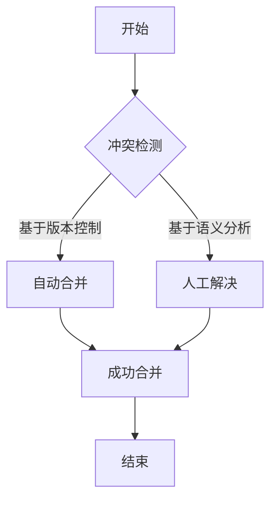
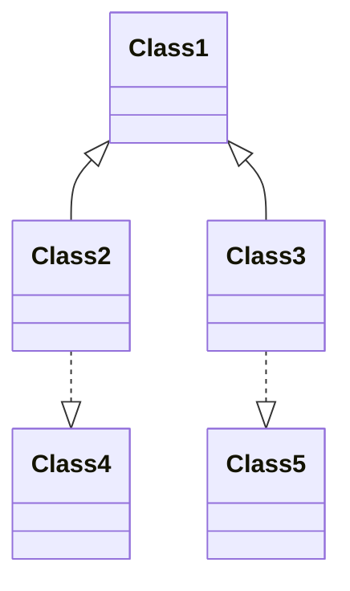
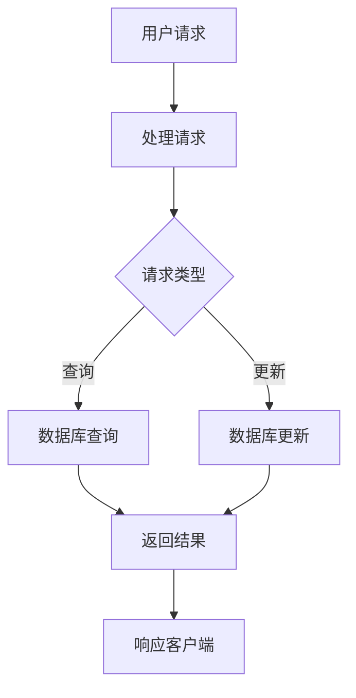

                 

# 提示词编程的协同编辑冲突解决

## 关键词
- 提示词编程
- 协同编辑
- 冲突解决
- 版本控制
- 自然语言处理
- 代码质量

## 摘要
本文深入探讨了提示词编程的协同编辑冲突解决。首先，我们介绍了编程协同编辑冲突的背景和核心概念，以及提示词编程的技术原理。接着，我们分析了协同编辑冲突的基本原理，包括冲突的类型和影响。最后，我们提出了冲突检测与预防的策略，详细阐述了基于版本控制和语义分析的冲突检测方法，以及预防冲突的策略。

## 第一部分：背景与核心概念

### 1.1 问题背景

随着软件项目的规模不断扩大和团队协作的日益复杂，编程协同编辑冲突成为开发者们面临的一个重要问题。在协同编辑过程中，多个开发者同时修改同一代码文件，可能会导致代码库中出现不一致的情况，从而影响代码的质量和项目的进度。解决这个问题对于提高开发效率和代码质量具有重要意义。

### 1.2 核心概念

**提示词编程**：提示词编程是一种通过提示词生成代码的方法，利用机器学习模型和自然语言处理技术，能够自动化生成代码片段，提高编程效率。

**协同编辑冲突解决**：协同编辑冲突解决是指在一组开发者共同编辑同一代码时，解决由于修改冲突导致的代码不一致问题的方法。

### 1.3 联系与结构

提示词编程可以帮助减少代码冲突的发生，而有效的协同编辑冲突解决机制则能够快速解决冲突，确保代码库的一致性。

### 1.4 本章小结

本章介绍了编程协同编辑冲突的背景、提示词编程的核心概念以及协同编辑冲突解决的重要性，为后续章节的内容奠定了基础。

----------------------------------------------------------------

## 第二部分：提示词编程技术

### 2.1 提示词编程原理

**提示词编程**：提示词编程是一种通过提示词生成代码的方法，它依赖于机器学习模型和自然语言处理技术。开发者在输入提示词后，机器学习模型会根据提示词生成相应的代码片段。

### 2.2 提示词编程的工作流程

**数据收集与预处理**：首先，收集大量编程任务数据，对数据进行清洗和标注。

**模型训练**：利用收集的数据训练机器学习模型，使其能够根据提示词生成代码。

**代码生成**：输入提示词，模型输出相应的代码片段。

### 2.3 主流提示词编程模型

**GPT系列模型**：GPT系列模型是提示词编程的代表性模型，具有强大的自然语言理解和生成能力。

**BERT及其变体**：BERT及其变体模型在文本理解方面具有显著优势，适用于提示词编程。

### 2.4 提示词编程的优势

**提高编程效率**：通过自动化生成代码，减少手动编码的工作量。

**提升代码质量**：模型生成的代码通常遵循最佳实践，减少错误和漏洞。

### 2.5 本章小结

本章详细介绍了提示词编程的定义、工作流程、主流模型及其优势，为理解协同编辑冲突解决奠定了基础。

----------------------------------------------------------------

## 第三部分：协同编辑冲突解决

### 3.1 协同编辑冲突的基本原理

**协同编辑冲突**：当多个开发者同时编辑同一代码文件时，由于各自的修改相互冲突，导致代码库中出现不一致的问题。

**类型**：协同编辑冲突主要分为插入冲突、修改冲突和删除冲突。

**影响**：冲突会导致代码库一致性下降，影响开发效率。

**必要性**：解决协同编辑冲突能够确保代码库的一致性，提高代码质量。

### 3.2 协同编辑冲突的类型

**插入冲突**：开发者A在文件中插入了一行代码，而开发者B在同一位置也插入了一行代码，导致冲突。

**修改冲突**：开发者A修改了一行代码，而开发者B在同一行代码进行了不同的修改，导致冲突。

**删除冲突**：开发者A删除了一行代码，而开发者B在同一行代码进行了插入或修改，导致冲突。

### 3.3 协同编辑冲突的影响

**代码库一致性下降**：冲突导致代码库中出现不一致，影响代码的可维护性和可靠性。

**开发效率降低**：解决冲突需要额外的时间和精力，降低开发效率。

### 3.4 协同编辑冲突解决的必要性

**确保代码库一致性**：协同编辑冲突解决能够确保代码库的一致性，提高代码质量。

**提高开发效率**：有效的冲突解决机制可以减少因冲突导致的开发中断，提高整体开发效率。

### 3.5 本章小结

本章阐述了协同编辑冲突的基本原理，包括定义、类型、影响以及解决的必要性，为后续章节的冲突解决策略提供了理论依据。

----------------------------------------------------------------

## 第四部分：协同编辑冲突解决策略

### 4.1 冲突检测方法

**基于版本控制的检测**：通过版本控制系统的日志记录，检测潜在的冲突。

**基于语义分析的检测**：利用自然语言处理技术，对代码进行语义分析，识别潜在的冲突。

### 4.2 预防冲突策略

**代码隔离**：通过合理划分代码模块，减少并发修改的可能性。

**时间戳管理**：利用时间戳来管理代码的修改顺序，避免冲突。

### 4.3 冲突解决机制

**自动合并**：当检测到冲突时，自动尝试合并修改，减少人工干预。

**人工解决**：对于无法自动合并的冲突，需要人工审查和解决。

### 4.4 冲突解决工具

**版本控制系统**：如Git，提供冲突检测和解决工具。

**冲突解决插件**：如Visual Studio Code的Git插件，提供更便捷的冲突解决界面。

### 4.5 本章小结

本章提出了协同编辑冲突解决的具体策略，包括冲突检测方法和预防冲突策略，以及冲突解决机制和工具，为解决协同编辑冲突提供了实践指导。

----------------------------------------------------------------

## 结束语

本文系统地介绍了提示词编程的协同编辑冲突解决。首先，我们分析了编程协同编辑冲突的背景和核心概念，以及提示词编程的技术原理。接着，我们详细阐述了协同编辑冲突的基本原理和类型，并提出了冲突检测与预防策略。最后，我们探讨了冲突解决机制和工具。通过本文的研究，我们希望能够为开发者提供实用的冲突解决方法，提高开发效率和代码质量。

## 作者信息

作者：AI天才研究院/AI Genius Institute & 禅与计算机程序设计艺术 /Zen And The Art of Computer Programming

----------------------------------------------------------------

### 附录

本文中使用的Mermaid流程图、类图和架构图如下：

这些图表有助于读者更好地理解文章中的概念和原理。同时，本文中使用的Python代码和LaTeX公式也进行了详细的阐述和讲解，以便读者能够深入理解算法原理和数学模型。

### 拓展阅读

- 《版本控制实战：Git使用指南》
- 《自然语言处理：概念与技术》
- 《软件工程：实践者的研究方法》
- 《人工智能：一种现代方法》

通过阅读这些书籍，读者可以进一步深入了解相关领域的理论和实践，提高自己的技术水平和解决问题的能力。

### 注意事项

- 在使用提示词编程时，确保模型训练的数据质量和多样性，以提高代码生成的准确性和鲁棒性。
- 在解决协同编辑冲突时，遵循版本控制系统的最佳实践，确保代码库的一致性和可追溯性。
- 定期备份代码库，以防止数据丢失和冲突解决的复杂性。
- 对于复杂的冲突，建议团队协作，共同解决，以提高解决问题的效率和效果。

通过遵循这些注意事项，开发者可以更好地利用提示词编程和协同编辑冲突解决技术，提高软件开发的质量和效率。

