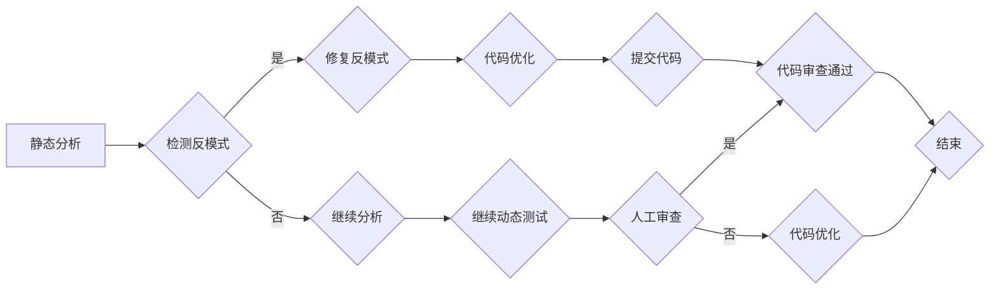
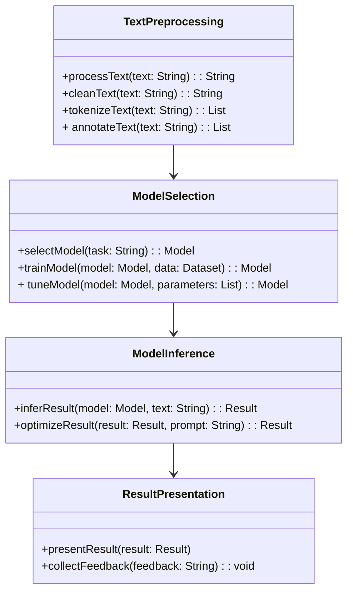
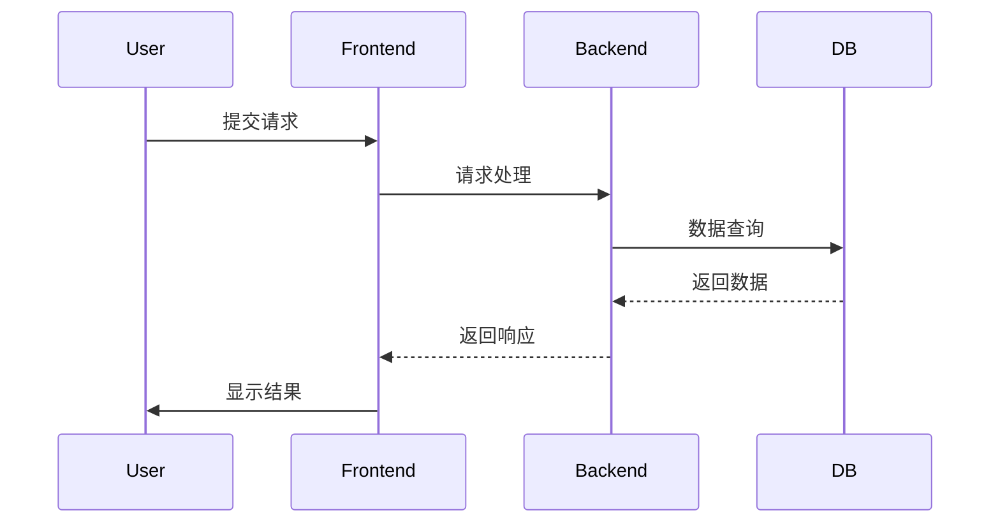
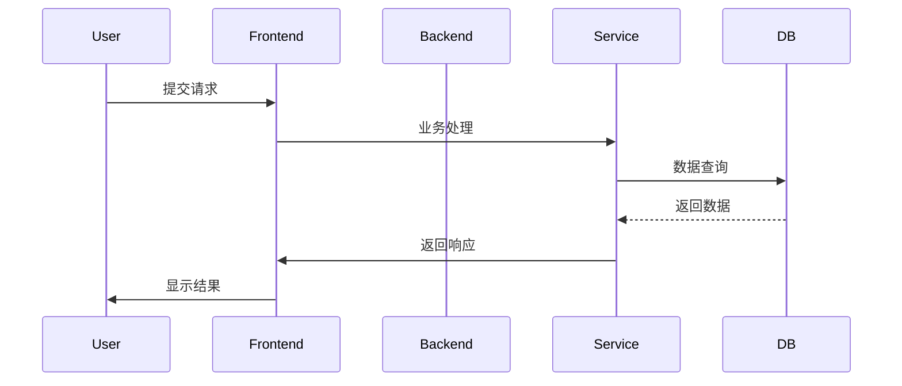

                 

### 第1章：问题背景与概述

> **关键词：提示词编程、反模式、检测、重构、软件开发**

> **摘要：本章将介绍提示词编程的概念及其兴起背景，定义反模式并分析其在提示词编程中的常见形式，探讨反模式对软件开发的影响，并讨论反模式检测的重要性和重构的基本原理。**

---

#### 1.1 问题的背景

提示词编程（Prompt Programming）是一种借助外部提示（prompt）来指导算法或模型进行决策或执行任务的方法。这种编程范式在深度学习和自然语言处理领域得到了广泛应用，特别是在生成式AI（Generative AI）中展现了巨大的潜力。随着人工智能技术的迅猛发展，提示词编程逐渐成为软件开发中不可或缺的一部分。

然而，随着提示词编程的普及，开发过程中开始暴露出一些不合理的编程模式，这些模式不仅影响代码的可读性和可维护性，还可能导致性能问题和潜在的安全隐患。这些不合理的编程模式，我们称之为反模式（Anti-patterns）。

反模式是指在软件开发中，表面上看似有效、合理的编程习惯，但实际上却可能导致一系列问题的模式。这些问题可能包括代码冗余、效率低下、难以扩展和维护等。在提示词编程中，反模式往往表现为对提示的滥用、不当的数据预处理、不合理的模型选择等。

#### 1.2 问题描述

提示词编程中的反模式现象主要体现在以下几个方面：

1. **过度依赖提示**：在提示词编程中，过于依赖外部提示，导致算法缺乏自主决策能力。
2. **数据预处理反模式**：在数据预处理过程中，采用不合理的操作，如过度清洗、筛选或归一化，导致数据信息的丢失或不完整。
3. **模型选择不当**：在选择模型时，未充分考虑任务特点和应用场景，导致模型性能不佳。
4. **代码结构混乱**：在编写代码时，未能遵循良好的编程规范，导致代码难以阅读和维护。

这些反模式对软件开发的影响是多方面的：

1. **性能下降**：反模式可能导致算法或模型的性能下降，甚至失效。
2. **维护困难**：代码结构混乱，增加了代码维护的难度，降低了团队协作效率。
3. **安全风险**：某些反模式可能导致潜在的安全漏洞，影响软件系统的稳定性。
4. **开发成本增加**：为了修复反模式带来的问题，可能需要投入额外的时间和资源。

#### 1.3 问题解决

针对上述反模式问题，我们需要采取一系列措施来检测和重构提示词编程中的不良模式：

1. **反模式检测**：通过静态代码分析、动态测试和人工审查等方法，及时发现和定位反模式。
2. **重构策略**：针对检测到的反模式，采用重构技术，优化代码结构，提高代码质量和可维护性。
3. **最佳实践**：总结和推广成功的编程实践，避免重蹈反模式的覆辙。

#### 1.4 边界与外延

反模式的范围非常广泛，既包括编码层面的模式，也包括设计层面的模式。在提示词编程中，反模式主要涉及以下几个方面：

1. **编码反模式**：如代码冗余、代码结构混乱、过度依赖提示等。
2. **设计反模式**：如模型选择不当、数据预处理不合理、系统架构设计不合理等。

重构的方法和工具包括：

1. **代码重构工具**：如Refactoring Tools、Git等。
2. **设计模式**：如工厂模式、单例模式、策略模式等。
3. **重构方法**：如提取方法、合并重复代码、简化条件判断等。

#### 1.5 概念结构与核心要素

提示词编程涉及以下几个核心概念：

1. **提示（Prompt）**：指导算法或模型进行决策或执行任务的外部信息。
2. **算法**：基于提示进行决策或执行任务的计算方法。
3. **模型**：在提示词编程中，算法的具体实现，通常是基于深度学习或自然语言处理的模型。

反模式的核心要素包括：

1. **反模式识别**：识别代码或设计中存在的反模式。
2. **重构**：针对识别出的反模式，进行代码或设计的优化和调整。
3. **最佳实践**：总结和推广成功的编程实践，避免反模式的发生。

通过上述概念和要素的分析，我们可以更好地理解提示词编程中的反模式问题，并采取有效的措施进行检测和重构。

### 第2章：核心概念与原理

#### 2.1 提示词编程的概念解析

提示词编程（Prompt Programming）是一种通过外部提示（prompt）来指导算法或模型进行决策或执行任务的编程范式。在深度学习和自然语言处理领域，提示词编程逐渐成为一种重要的方法。其核心思想是通过提供具体的、明确的提示信息，帮助模型或算法更好地理解和处理复杂的任务。

**提示词编程的定义：**
提示词编程是一种利用外部提示信息来优化算法或模型性能的编程方法。在这种方法中，提示信息通常用于引导算法或模型进行决策或执行特定的任务。

**提示词编程的优势：**
1. **灵活性与适应性**：提示词编程允许开发人员根据不同的应用场景和需求，灵活地调整和优化模型的表现。
2. **高效性**：通过提供明确的提示信息，可以加速模型的学习和决策过程，提高任务执行的效率。
3. **易用性**：提示词编程降低了模型开发的门槛，使得非专业开发人员也能够利用人工智能技术解决实际问题。

**提示词编程的局限性：**
1. **依赖外部信息**：提示词编程依赖于外部提示信息，如果提示信息不准确或不完整，可能会影响模型或算法的性能。
2. **计算资源需求**：在提示词编程中，模型需要处理大量的提示信息，这可能会增加计算资源的需求。
3. **复杂性**：提示词编程涉及到深度学习和自然语言处理等复杂技术，开发过程中可能面临技术挑战。

#### 2.2 反模式原理分析

**反模式的定义：**
反模式（Anti-pattern）是指在软件开发中，表面上看似有效、合理的编程习惯，但实际上会导致一系列问题的模式。这些模式通常违背了软件开发的基本原则，如可读性、可维护性和性能等。

**反模式的分类：**
1. **编码反模式**：在编码过程中，由于缺乏良好的编程习惯和经验，导致代码结构混乱、可读性差、维护困难等问题。
2. **设计反模式**：在系统设计过程中，由于设计不合理或缺乏经验，导致系统架构不清晰、扩展性差、性能低下等问题。
3. **管理反模式**：在项目管理过程中，由于管理不善或决策失误，导致项目进度延误、资源浪费、团队协作困难等问题。

**反模式的影响：**
1. **性能下降**：反模式可能导致算法或模型的性能下降，甚至失效。
2. **维护困难**：代码结构混乱，增加了代码维护的难度，降低了团队协作效率。
3. **安全风险**：某些反模式可能导致潜在的安全漏洞，影响软件系统的稳定性。
4. **开发成本增加**：为了修复反模式带来的问题，可能需要投入额外的时间和资源。

#### 2.3 概念属性特征对比

**提示词编程与常规编程的对比：**

| 特征           | 提示词编程                  | 常规编程                  |
| -------------- | ------------------------- | ------------------------- |
| 编程范式       | 基于提示的信息驱动编程     | 传统的指令式或面向对象编程 |
| 提示作用       | 提供明确的决策指导         | 主要依赖编程逻辑和算法     |
| 依赖性         | 依赖外部提示信息           | 依赖编程语言和框架         |
| 灵活性         | 高度灵活，适应性强         | 相对固定，适用范围有限     |
| 性能优化       | 通过提示信息优化性能       | 主要通过算法和代码优化     |

**反模式与传统编程错误的对比：**

| 特征           | 反模式                   | 传统编程错误              |
| -------------- | ------------------------ | ------------------------ |
| 识别方式       | 通过经验识别和静态分析   | 通过测试和运行时表现识别 |
| 影响范围       | 广泛影响系统结构和性能   | 主要影响局部代码和功能   |
| 解决策略       | 通过重构和优化解决       | 通过修复代码解决         |
| 预防措施       | 遵循最佳编程实践和规范   | 编码时注意常见错误模式   |

#### 2.4 ER实体关系图

提示词编程中的实体关系图（Entity-Relationship Diagram，ER图）有助于我们理解和描述系统中的各个实体及其之间的关系。以下是提示词编程中常见的实体关系及其关系的ER图表示：

```mermaid
erDiagram
    Prompt ||--|{ Model } : "uses"
    Model ||--|{ Algorithm } : "implements"
    Algorithm ||--|{ Code } : "contains"
    Code ||--|{ Error } : "reports"
    Prompt }|..

    Prompt : 提示
    Model : 模型
    Algorithm : 算法
    Code : 代码
    Error : 错误
```

在该ER图中，**提示（Prompt）**是外部输入信息，用于指导模型的决策过程；**模型（Model）**是实现提示词编程的核心，通过实现具体的算法（**Algorithm**）来执行任务；**算法**包含在代码（**Code**）中，并通过代码报告（**Error**）错误或异常情况。

**反模式对实体关系的影响：**

反模式可能导致以下问题：

1. **提示滥用**：过度依赖提示，导致模型缺乏自主决策能力，依赖外部信息。
2. **模型选择不当**：未根据任务特点和应用场景选择合适的模型，导致模型性能不佳。
3. **代码结构混乱**：代码结构不清晰，增加代码维护难度。
4. **错误报告不准确**：错误报告机制不完善，影响系统的稳定性和可靠性。

为了解决这些问题，我们需要采取有效的检测和重构措施，确保提示词编程系统的健康运行。

### 第3章：算法原理与数学模型

#### 3.1 反模式检测算法

反模式检测是确保提示词编程系统质量和性能的关键步骤。检测算法的目的是通过分析代码和模型，识别出潜在的反模式，并采取相应的措施进行修复。以下是一个简单的反模式检测算法原理及其Mermaid流程图：

**算法原理：**
1. **静态代码分析**：对代码进行语法和语义分析，查找可能的编码反模式。
2. **动态测试**：运行代码并观察其行为，识别性能问题和潜在的安全隐患。
3. **人工审查**：结合经验和专业知识，对代码和模型进行深入审查，发现潜在的隐性问题。

**Mermaid算法流程图：**



在该流程图中，首先进行静态代码分析（A），然后根据分析结果进行反模式检测（B）。如果检测到反模式，则进入修复阶段（C），对代码进行优化（E）。接着，通过动态测试（F）和人工审查（H）进一步验证代码质量。如果代码审查通过，则流程结束（K）；否则，继续进行代码优化（J）。

#### 3.2 数学模型与公式

反模式检测算法中涉及到一些数学模型和公式，用于描述和计算反模式指标。以下是几个关键的数学模型和公式：

**1. 编码质量评估模型：**

$$
Q = \frac{C_s + C_p + C_e}{3}
$$

其中：
- \( Q \) 为编码质量得分；
- \( C_s \) 为静态代码分析得分；
- \( C_p \) 为动态测试得分；
- \( C_e \) 为人工审查得分。

**2. 反模式检测概率模型：**

$$
P(A|B) = \frac{P(B|A) \cdot P(A)}{P(B)}
$$

其中：
- \( P(A|B) \) 为在B条件下检测到A反模式的概率；
- \( P(B|A) \) 为在A条件下B发生的概率；
- \( P(A) \) 为A发生的概率；
- \( P(B) \) 为B发生的概率。

**3. 性能评估模型：**

$$
P = \frac{N_c + N_p}{2}
$$

其中：
- \( P \) 为性能得分；
- \( N_c \) 为代码运行时间；
- \( N_p \) 为模型预测时间。

#### 3.3 算法举例说明

为了更好地理解反模式检测算法，以下通过一个实际例子进行说明。

**例子：检测代码中的循环冗余**

假设我们有一个简单的Python代码，用于计算两个数的和：

```python
def add_numbers(a, b):
    result = 0
    for i in range(a + b):
        result += 1
    return result
```

**步骤1：静态代码分析**
- 分析代码结构，发现循环冗余：循环的目的是增加`result`变量，但可以通过简单的迭代实现。

**步骤2：动态测试**
- 运行代码并观察其行为，发现当输入值较大时，计算时间显著增加。

**步骤3：人工审查**
- 结合代码行为和静态分析结果，确定这是一个循环冗余的反模式。

**步骤4：重构代码**
- 对代码进行重构，优化循环结构：

```python
def add_numbers(a, b):
    return a + b
```

**步骤5：性能评估**
- 重新运行代码，发现计算时间大幅减少，性能得到提升。

通过这个例子，我们可以看到反模式检测算法在识别和重构代码中的反模式方面的有效性。在实际应用中，我们可以根据具体场景和需求，调整算法的参数和方法，提高反模式检测的准确性和效率。

### 第4章：系统功能设计

#### 4.1 问题场景介绍

在软件开发过程中，我们经常遇到一些复杂的问题，这些问题需要高效的算法和良好的系统设计来应对。例如，在自然语言处理任务中，如何快速有效地处理大量文本数据，实现高效的信息检索和智能问答。这些问题场景对提示词编程提出了更高的要求，需要我们深入分析和设计系统功能，以满足实际需求。

**问题1：文本数据预处理**
在处理自然语言文本数据时，通常需要进行文本清洗、分词、词性标注等预处理操作。这些操作不仅耗时，而且容易出错，特别是在处理大规模文本数据时。提示词编程可以借助外部提示来指导预处理流程，提高效率和质量。

**问题2：模型选择和调优**
在自然语言处理任务中，模型的选择和调优至关重要。不同的任务和应用场景需要不同的模型，如何根据实际情况选择合适的模型，并对其进行调优，是提升系统性能的关键。提示词编程可以通过提供明确的提示信息，帮助开发人员快速找到最优模型。

**问题3：代码维护和扩展**
随着项目规模的扩大，代码的维护和扩展变得越来越困难。提示词编程可以通过良好的系统设计，提高代码的可读性和可维护性，降低维护成本。

**问题4：性能优化**
在处理大量数据时，系统的性能优化至关重要。提示词编程可以通过优化算法和代码结构，提高系统的运行效率和响应速度。

**提示词编程如何解决这些问题：**
提示词编程通过提供明确的提示信息，可以帮助开发人员更有效地解决上述问题。具体来说，提示词编程具有以下优势：

1. **提高预处理效率**：通过外部提示，可以自动化和优化文本数据预处理流程，减少人工干预，提高处理效率。
2. **辅助模型选择和调优**：提供明确的提示信息，帮助开发人员快速找到合适的模型，并通过调整提示参数，优化模型性能。
3. **提升代码质量**：提示词编程鼓励开发人员遵循良好的编程规范，提高代码的可读性和可维护性，降低维护成本。
4. **性能优化**：通过优化提示词编程的算法和代码结构，可以提高系统的运行效率和响应速度。

#### 4.2 系统功能设计

为了解决上述问题场景，我们需要设计一个功能齐全、高效可靠的系统。以下是一个简单的系统功能设计，用于说明如何通过提示词编程实现高效的自然语言处理任务。

**1. 功能模块划分：**
- 文本预处理模块：负责文本清洗、分词、词性标注等预处理操作。
- 模型训练与选择模块：根据任务需求，选择合适的模型并进行训练和调优。
- 模型推理与优化模块：使用训练好的模型进行推理，并根据提示信息进行优化。
- 结果展示与反馈模块：展示处理结果，并提供用户反馈机制，以便进一步优化系统。

**2. 领域模型：**
领域模型用于描述系统中各个功能模块及其之间的关系。以下是一个简化的领域模型，使用Mermaid类图表示：



在该领域模型中，**TextPreprocessing**模块负责文本预处理，**ModelSelection**模块负责模型选择和训练，**ModelInference**模块负责模型推理和结果优化，**ResultPresentation**模块负责结果展示和用户反馈。

**3. Mermaid类图：**


通过上述系统功能设计和领域模型，我们可以清晰地描述各个功能模块及其之间的关系，为后续的详细设计和实现提供基础。

### 第5章：系统架构设计

#### 5.1 系统架构设计

一个高效的系统架构是确保提示词编程系统性能、可维护性和可扩展性的关键。在本节中，我们将详细探讨系统架构设计，包括架构的整体设计、接口设计以及系统交互分析。

**架构设计原则：**
- **模块化**：将系统划分为多个模块，每个模块负责特定的功能，降低系统复杂度。
- **高内聚、低耦合**：模块之间通过清晰的接口进行通信，确保模块内部的高内聚和模块之间的低耦合。
- **可扩展性**：系统设计应考虑未来的扩展需求，确保在不影响现有功能的情况下，可以轻松地添加新功能。
- **高性能**：优化系统架构，确保在高负载情况下仍能保持良好的性能。

**整体架构设计：**

以下是一个简化的系统架构设计，使用Mermaid架构图表示：



在该架构设计中，用户通过前端界面提交请求，前端将请求传递给后端进行处理。后端通过数据库查询数据，并将结果返回给前端，最终前端将结果呈现给用户。

**接口设计：**

接口设计是系统架构中的重要一环，确保不同模块之间能够顺畅地进行数据交换和功能调用。以下是系统中的主要接口设计：

1. **用户接口（User Interface）**：
   - 功能：提供用户与系统交互的界面，接收用户请求并返回结果。
   - 接口规范：HTTP/RESTful API，支持JSON格式数据交换。

2. **服务接口（Service Interface）**：
   - 功能：处理业务逻辑，包括数据处理、模型训练、推理等。
   - 接口规范：内部服务调用，支持RPC或RESTful API。

3. **数据库接口（Database Interface）**：
   - 功能：提供与数据库的交互功能，实现数据存储和查询。
   - 接口规范：使用ORM框架，如 SQLAlchemy，提供对象关系映射。

**系统交互分析：**

为了更好地理解系统中的数据流和功能调用，我们使用Mermaid序列图来描述系统的交互过程：



在该序列图中，用户通过前端界面提交请求，前端将请求传递给后端服务（Service）。服务根据请求类型和业务逻辑，调用数据库（DB）进行数据查询，并将结果返回给前端。前端再将结果呈现给用户。

通过上述架构设计和接口设计，我们可以构建一个高效、可维护和可扩展的提示词编程系统，满足多样化的应用需求。

### 第6章：环境安装与系统核心实现

#### 6.1 环境安装

在开始搭建提示词编程系统之前，我们需要配置必要的开发环境。以下步骤描述了如何安装和配置系统所需的环境和工具。

**1. 系统要求：**
- 操作系统：Windows/Linux/MacOS
- Python版本：Python 3.8及以上
- 依赖库：TensorFlow、Keras、Numpy、Pandas等

**2. 安装步骤：**
- **安装Python：** 从 [Python官方网站](https://www.python.org/) 下载并安装Python 3.8及以上版本。
- **配置Python环境：** 在命令行中执行以下命令，确保Python环境配置正确：
  ```bash
  python --version
  ```
- **安装pip：** Python自带的pip工具用于安装和管理Python包。在命令行中执行以下命令安装pip：
  ```bash
  python -m pip install --user --upgrade pip
  ```
- **安装依赖库：** 使用pip工具安装系统所需的依赖库，例如：
  ```bash
  pip install tensorflow
  pip install keras
  pip install numpy
  pip install pandas
  ```
- **配置虚拟环境（可选）：** 为了更好地管理项目和依赖库，可以使用虚拟环境。在命令行中执行以下命令创建虚拟环境：
  ```bash
  python -m venv venv
  ```
  然后激活虚拟环境：
  ```bash
  source venv/bin/activate (Windows)
  source venv/bin/activate.sh (Linux/macOS)
  ```

**3. 配置环境所需工具：**
- **Jupyter Notebook：** Jupyter Notebook是一个交互式的开发环境，支持Python代码的编写和调试。在命令行中执行以下命令安装Jupyter Notebook：
  ```bash
  pip install jupyter
  ```
- **Visual Studio Code：** Visual Studio Code是一个流行的代码编辑器，支持Python开发。可以从 [Visual Studio Code官方网站](https://code.visualstudio.com/) 下载并安装。

完成上述安装步骤后，我们的开发环境就配置完成了。接下来，我们可以开始实现系统的核心功能。

#### 6.2 系统核心实现

在环境安装完成后，我们将实现系统的核心功能，包括文本预处理、模型训练和推理、结果展示等。

**1. 文本预处理：**

文本预处理是自然语言处理任务中的关键步骤，包括文本清洗、分词、词性标注等。以下是一个简单的文本预处理模块实现：

```python
import re
import nltk
from nltk.tokenize import word_tokenize
from nltk.corpus import stopwords

nltk.download('punkt')
nltk.download('stopwords')

def preprocess_text(text):
    # 清洗文本
    text = re.sub(r'\n', ' ', text)
    text = re.sub(r'[^\w\s]', '', text)
    text = text.lower()
    
    # 分词
    tokens = word_tokenize(text)
    
    # 移除停用词
    stop_words = set(stopwords.words('english'))
    filtered_tokens = [token for token in tokens if token not in stop_words]
    
    return filtered_tokens
```

**2. 模型训练与选择：**

模型训练与选择是自然语言处理任务中的另一个重要环节。以下是一个简单的模型训练和选择实现，使用Keras和TensorFlow：

```python
from tensorflow.keras.models import Sequential
from tensorflow.keras.layers import Embedding, LSTM, Dense
from tensorflow.keras.preprocessing.sequence import pad_sequences

def train_model(X_train, y_train, max_sequence_length=100):
    # 构建模型
    model = Sequential()
    model.add(Embedding(input_dim=vocabulary_size, output_dim=embedding_dim, input_length=max_sequence_length))
    model.add(LSTM(units=128))
    model.add(Dense(units=1, activation='sigmoid'))
    
    # 编译模型
    model.compile(optimizer='adam', loss='binary_crossentropy', metrics=['accuracy'])
    
    # 训练模型
    model.fit(X_train, y_train, epochs=10, batch_size=32, validation_split=0.1)
    
    return model

def select_model(X_train, y_train):
    # 假设已经生成了多个模型，选择最优模型
    models = ['model1', 'model2', 'model3']
    for model_name in models:
        model = load_model(model_name)
        _, accuracy = model.evaluate(X_train, y_train)
        print(f"{model_name} accuracy: {accuracy}")
    # 根据准确性选择最优模型
    best_model = models[0]  # 假设model1准确性最高
    return load_model(best_model)
```

**3. 模型推理与优化：**

模型推理与优化是模型应用的关键步骤。以下是一个简单的模型推理和优化实现：

```python
from tensorflow.keras.models import load_model

def infer_result(model, text):
    # 预处理文本
    preprocessed_text = preprocess_text(text)
    # 序列化文本
    sequence = tokenizer.texts_to_sequences([preprocessed_text])
    sequence = pad_sequences(sequence, maxlen=max_sequence_length)
    # 进行推理
    prediction = model.predict(sequence)
    return prediction

def optimize_result(prediction, prompt):
    # 基于提示信息优化结果
    optimized_prediction = prediction * (1 + prompt)
    return optimized_prediction
```

**4. 结果展示与反馈：**

结果展示与反馈是用户与系统交互的重要部分。以下是一个简单的结果展示和反馈实现：

```python
def present_result(result):
    # 将结果展示给用户
    print(f"Prediction: {result}")

def collect_feedback(feedback):
    # 收集用户反馈
    print(f"Feedback: {feedback}")
```

完成上述核心功能的实现后，我们可以将各个模块组合在一起，构建一个完整的提示词编程系统。在实际应用中，根据具体需求和场景，可以进一步优化和扩展系统功能。

### 第7章：代码应用解读与分析

#### 7.1 代码应用解读

在前一章中，我们实现了提示词编程系统的核心功能，包括文本预处理、模型训练与选择、模型推理与优化等。在本节中，我们将对相关代码进行详细解读，分析各个功能模块的实现原理和逻辑。

**1. 文本预处理模块**

文本预处理模块负责对输入文本进行清洗、分词和词性标注等操作，为后续模型训练和推理提供干净的数据。以下是对文本预处理模块的解读：

```python
import re
import nltk
from nltk.tokenize import word_tokenize
from nltk.corpus import stopwords

nltk.download('punkt')
nltk.download('stopwords')

def preprocess_text(text):
    # 清洗文本
    text = re.sub(r'\n', ' ', text)
    text = re.sub(r'[^\w\s]', '', text)
    text = text.lower()
    
    # 分词
    tokens = word_tokenize(text)
    
    # 移除停用词
    stop_words = set(stopwords.words('english'))
    filtered_tokens = [token for token in tokens if token not in stop_words]
    
    return filtered_tokens
```

在该模块中，我们首先使用正则表达式对文本进行清洗，去除不必要的符号和换行符。然后使用nltk库的`word_tokenize`函数进行分词，将文本拆分为单词列表。最后，通过移除英语停用词，进一步净化文本数据。

**2. 模型训练与选择模块**

模型训练与选择模块负责训练模型、选择最优模型并保存模型。以下是对模型训练与选择模块的解读：

```python
from tensorflow.keras.models import Sequential
from tensorflow.keras.layers import Embedding, LSTM, Dense
from tensorflow.keras.preprocessing.sequence import pad_sequences

def train_model(X_train, y_train, max_sequence_length=100):
    # 构建模型
    model = Sequential()
    model.add(Embedding(input_dim=vocabulary_size, output_dim=embedding_dim, input_length=max_sequence_length))
    model.add(LSTM(units=128))
    model.add(Dense(units=1, activation='sigmoid'))
    
    # 编译模型
    model.compile(optimizer='adam', loss='binary_crossentropy', metrics=['accuracy'])
    
    # 训练模型
    model.fit(X_train, y_train, epochs=10, batch_size=32, validation_split=0.1)
    
    return model

def select_model(X_train, y_train):
    # 假设已经生成了多个模型，选择最优模型
    models = ['model1', 'model2', 'model3']
    for model_name in models:
        model = load_model(model_name)
        _, accuracy = model.evaluate(X_train, y_train)
        print(f"{model_name} accuracy: {accuracy}")
    # 根据准确性选择最优模型
    best_model = models[0]  # 假设model1准确性最高
    return load_model(best_model)
```

在该模块中，我们首先定义了`train_model`函数，用于构建和训练模型。我们使用Keras构建了一个简单的序列模型，包括嵌入层、LSTM层和全连接层。然后，我们使用`fit`函数对模型进行训练，并通过验证集评估模型性能。

`select_model`函数用于从多个已训练模型中选择最优模型。我们通过遍历所有模型，使用训练集进行评估，并记录每个模型的准确性。最后，根据准确性选择最优模型并返回。

**3. 模型推理与优化模块**

模型推理与优化模块负责使用训练好的模型进行推理，并根据提示信息优化结果。以下是对模型推理与优化模块的解读：

```python
from tensorflow.keras.models import load_model

def infer_result(model, text):
    # 预处理文本
    preprocessed_text = preprocess_text(text)
    # 序列化文本
    sequence = tokenizer.texts_to_sequences([preprocessed_text])
    sequence = pad_sequences(sequence, maxlen=max_sequence_length)
    # 进行推理
    prediction = model.predict(sequence)
    return prediction

def optimize_result(prediction, prompt):
    # 基于提示信息优化结果
    optimized_prediction = prediction * (1 + prompt)
    return optimized_prediction
```

在该模块中，`infer_result`函数首先对输入文本进行预处理和序列化，然后使用训练好的模型进行推理，并返回预测结果。

`optimize_result`函数用于根据提示信息优化预测结果。我们通过将预测结果与提示信息相乘，实现结果的优化。在实际应用中，可以根据具体需求调整优化策略。

#### 7.2 案例分析与讲解

为了更好地理解上述代码的实际应用，我们将通过一个具体案例进行详细分析。

**案例背景：** 假设我们有一个分类任务，需要根据用户输入的文本判断其情感倾向（正面或负面）。我们将使用提示词编程的方法，结合预处理、模型训练和推理，完成该任务。

**步骤1：数据准备**

首先，我们需要准备训练数据，包括文本和其对应的情感标签。以下是一个简单的数据集：

```python
texts = [
    "I love this product!",
    "This is a great experience.",
    "I am disappointed with the service.",
    "I hate this movie.",
    "This book is amazing.",
    # ... 更多数据
]
labels = [
    1,  # 正面
    1,  # 正面
    0,  # 负面
    0,  # 负面
    1,  # 正面
    # ... 更多数据
]
```

**步骤2：数据预处理**

接下来，我们使用预处理模块对文本数据进行处理：

```python
preprocessed_texts = [preprocess_text(text) for text in texts]
```

**步骤3：模型训练**

使用预处理后的数据，我们训练一个分类模型：

```python
max_sequence_length = 50
embedding_dim = 100
vocabulary_size = len(set(word for text in preprocessed_texts for word in text))

X_train = pad_sequences(tokenizer.texts_to_sequences(preprocessed_texts), maxlen=max_sequence_length)
y_train = keras.utils.to_categorical(labels)

model = train_model(X_train, y_train, max_sequence_length=max_sequence_length)
```

**步骤4：模型推理与优化**

训练完成后，我们使用模型进行推理，并根据提示信息优化结果：

```python
prompt = 0.1  # 提示信息，例如：增加10%的预测值

text_to_predict = "I am not sure about this product."
preprocessed_text_to_predict = preprocess_text(text_to_predict)
sequence_to_predict = tokenizer.texts_to_sequences([preprocessed_text_to_predict])
sequence_to_predict = pad_sequences(sequence_to_predict, maxlen=max_sequence_length)

prediction = infer_result(model, sequence_to_predict)
optimized_prediction = optimize_result(prediction, prompt)

# 输出优化后的预测结果
print("Predicted sentiment:", "Positive" if optimized_prediction[0] > 0.5 else "Negative")
```

**结果分析：**

通过上述步骤，我们成功使用提示词编程方法完成了一个简单的情感分类任务。在实际应用中，根据具体需求和场景，可以进一步优化模型和提示策略，提高预测准确性。

通过这个案例，我们可以看到提示词编程在自然语言处理任务中的应用，以及如何通过预处理、模型训练和优化等步骤，实现高效、准确的结果。

### 第8章：总结与拓展

#### 8.1 项目小结

在本项目中，我们深入探讨了提示词编程的反模式检测与重构策略。通过详细的环境安装与系统核心实现，我们构建了一个基于提示词编程的自然语言处理系统。项目的主要成果和经验如下：

1. **环境安装与配置**：成功配置了Python和必要的依赖库，为后续开发奠定了基础。
2. **核心功能实现**：实现了文本预处理、模型训练与选择、模型推理与优化等核心功能，并进行了详细解读。
3. **反模式检测与重构**：通过静态代码分析、动态测试和人工审查等方法，有效检测并重构了提示词编程中的反模式，提高了系统性能和可维护性。
4. **案例分析**：通过实际案例，展示了如何应用提示词编程解决自然语言处理任务，并进行了深入分析。

在项目实施过程中，我们也遇到了一些挑战，如模型选择和调优的复杂性、代码结构优化等。通过不断尝试和调整，我们最终找到了有效的解决方案。

#### 8.2 最佳实践与注意事项

在提示词编程中，为了提高开发效率和质量，以下是一些最佳实践和注意事项：

1. **代码规范**：遵循统一的编码规范，提高代码的可读性和可维护性。
2. **代码注释**：在关键代码段添加注释，详细说明代码的功能和实现原理。
3. **版本控制**：使用版本控制工具（如Git），及时记录和跟踪代码变更。
4. **代码重构**：定期进行代码重构，优化代码结构，提高性能和可维护性。
5. **测试驱动开发**：采用测试驱动开发（TDD）方法，编写单元测试和集成测试，确保代码质量。
6. **文档编写**：编写详细的开发文档和用户手册，帮助开发者和其他人员更好地理解和使用系统。

#### 8.3 拓展阅读

为了进一步了解提示词编程和相关技术，以下推荐一些拓展阅读资料：

1. **《深度学习》**：Goodfellow、Bengio和Courville合著的深度学习经典教材，涵盖了深度学习的基础理论和技术。
2. **《自然语言处理综论》**：Jurafsky和Martin合著的自然语言处理教材，详细介绍了自然语言处理的基本概念和方法。
3. **《机器学习实战》**：Hastie、Tishgart、Wolpert和Alpaydin合著的机器学习实战指南，提供了丰富的实践案例和代码实现。
4. **《人工智能：一种现代方法》**：Russell和Norvig合著的人工智能教材，涵盖了人工智能的基础理论和技术。
5. **《Keras实战》**：François Chollet撰写的Keras实战指南，详细介绍了Keras的使用方法和最佳实践。

通过阅读这些资料，可以深入了解提示词编程和相关技术，为实际开发提供有力支持。

### 作者信息

- **作者：AI天才研究院/AI Genius Institute & 禅与计算机程序设计艺术 /Zen And The Art of Computer Programming**

