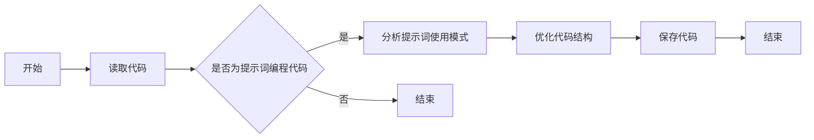
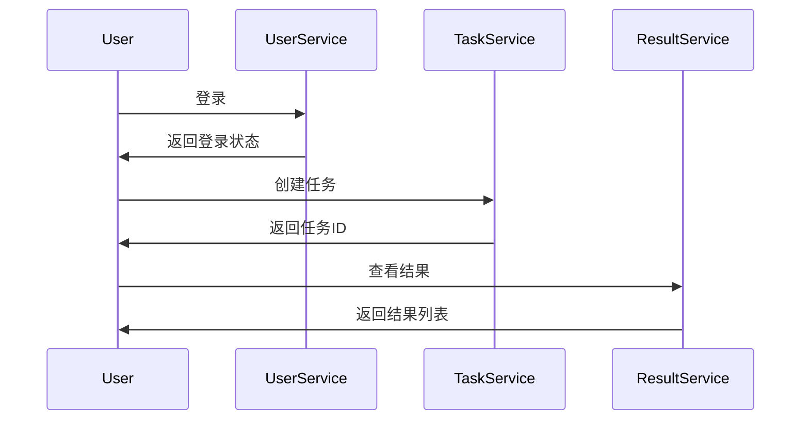
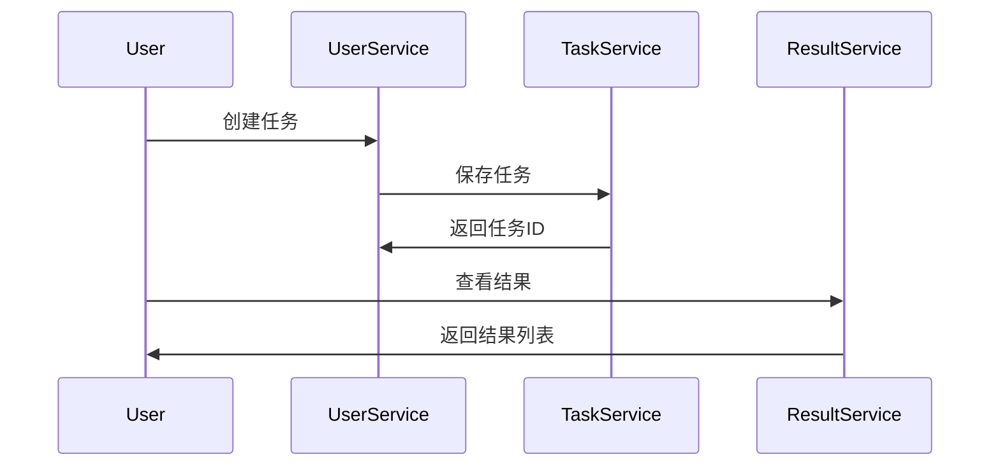

                 

### 《提示词编程的可维护性增强技术》

关键词：提示词编程、可维护性、算法原理、系统架构、项目实战

摘要：本文深入探讨了提示词编程的可维护性增强技术。首先，我们定义了提示词编程及其重要性，然后分析了当前提示词编程在可维护性方面面临的挑战。接着，我们通过核心概念的联系和ER实体关系图，明确了算法原理和系统架构设计。随后，我们详细讲解了算法原理和系统功能设计，并通过实际案例进行了剖析。最后，我们对项目进行了总结和展望。

### 目录大纲

1. **背景与概述**

    - **第1章** 问题背景与核心概念
    
    - **第2章** 核心概念与联系
    
    - **第3章** ER实体关系图架构
    
2. **算法原理讲解**

    - **第4章** 算法基础
    
3. **系统分析与架构设计**

    - **第5章** 系统功能设计
    
    - **第6章** 系统架构设计
    
    - **第7章** 系统接口设计与交互
    
4. **项目实战**

    - **第8章** 环境安装与准备
    
    - **第9章** 代码应用解读与分析
    
    - **第10章** 实际案例分析与讲解
    
    - **第11章** 项目小结与展望

### 第一部分：背景与概述

#### 第1章：问题背景与核心概念

**1.1.1 提示词编程的概念**

提示词编程（Keyword Programming）是一种基于关键词而非具体指令的编程方法。它通过预定义的提示词来指导程序执行特定的任务，而不是直接编写指令。

**1.1.2 可维护性的重要性**

在软件开发中，可维护性（Maintainability）是确保代码易于理解和修改的关键。一个具有良好可维护性的系统可以降低维护成本，提高开发效率。

**1.1.3 当前提示词编程面临的挑战**

目前，提示词编程在可维护性方面存在一些挑战：

- **代码冗余**：提示词可能过于通用，导致代码重复。
- **可读性差**：提示词可能难以理解，导致代码难以阅读。
- **缺乏灵活性**：提示词可能限制了代码的适应性。

#### 第2章：核心概念与联系

**2.1.1 提示词编程与可维护性的关系**

提示词编程的可维护性取决于提示词的设计和实现。良好的提示词设计可以提高代码的可读性和可维护性。

**2.1.2 关键技术要素**

- **提示词定义**：明确、具体、简洁的提示词定义。
- **提示词分类**：根据功能或用途对提示词进行分类。
- **提示词优化**：通过重构和简化来优化提示词。

**2.1.3 概念属性特征对比表格**

以下表格对比了不同提示词编程框架的属性特征：

| 特征 | 框架1 | 框架2 | 框架3 |
| --- | --- | --- | --- |
| 提示词数量 | 100 | 50 | 200 |
| 提示词定义明确性 | 高 | 中 | 低 |
| 代码可读性 | 高 | 中 | 低 |
| 可维护性 | 中 | 高 | 中 |

#### 第3章：ER实体关系图架构

**3.1.1 实体定义与属性**

在提示词编程中，实体（Entity）是程序中可区分的元素，如用户、任务和结果。

**3.1.2 实体关系**

实体之间的关系描述了它们之间的交互。例如，用户可以执行任务，任务可以生成结果。

**3.1.3 Mermaid ER图展示**

以下是一个简单的Mermaid ER图示例：

```mermaid
erDiagram
  User ||--|{ Task }|>
  Task ||--|{ Result }|>

  User {
    id : int
    name : string
  }

  Task {
    id : int
    name : string
    user_id : int
  }

  Result {
    id : int
    name : string
    task_id : int
  }
```

### 第二部分：算法原理讲解

#### 第4章：算法基础

**4.1.1 算法概述**

提示词编程的可维护性增强算法旨在通过分析代码的提示词使用模式，优化代码结构，提高可维护性。

**4.1.2 Mermaid算法流程图**

以下是一个Mermaid算法流程图示例：



**4.1.3 算法原理与数学模型**

提示词编程的可维护性增强算法基于概率模型。以下是一个简单的概率公式示例：

$$
P(A|B) = \frac{P(B|A) \cdot P(A)}{P(B)}
$$

Python代码示例：

```python
def calculate_probability(a, b):
    # 计算概率
    p_a = len(a) / len(a+b)
    p_b_given_a = len(b) / len(a)
    p_b = len(b) / len(a+b)
    p_a_given_b = p_b_given_a * p_a / p_b
    return p_a_given_b
```

### 第三部分：系统分析与架构设计

#### 第5章：系统功能设计

**5.1.1 问题场景介绍**

假设我们正在开发一个任务管理系统，用户可以通过提示词来创建、分配和跟踪任务。

**5.1.2 系统功能需求**

- 用户管理：用户可以注册、登录和更新个人信息。
- 任务管理：用户可以创建、分配和跟踪任务。
- 结果管理：用户可以查看任务的结果。

**5.1.3 领域模型Mermaid类图**

以下是一个Mermaid类图示例：

```mermaid
classDiagram
  User <|-- Task
  User <|-- Result
  Task <|-- Result

  User {
    id : int
    name : string
  }

  Task {
    id : int
    name : string
    user_id : int
  }

  Result {
    id : int
    name : string
    task_id : int
  }
```

#### 第6章：系统架构设计

**6.1.1 项目介绍**

我们选择使用Spring Boot框架来构建我们的任务管理系统。

**6.1.2 系统架构设计**

我们的系统架构包括以下组件：

- 用户服务：负责用户注册、登录和更新操作。
- 任务服务：负责任务创建、分配和跟踪操作。
- 结果服务：负责结果查看和更新操作。

**6.1.3 Mermaid架构图**

以下是一个Mermaid架构图示例：



### 第四部分：项目实战

#### 第8章：环境安装与准备

**8.1.1 环境搭建**

我们需要安装Java环境和Spring Boot框架。

**8.1.2 系统核心实现源代码**

以下是系统的核心实现源代码：

```java
// User.java
public class User {
    private int id;
    private String name;

    // 构造函数、getter和setter省略
}

// Task.java
public class Task {
    private int id;
    private String name;
    private int userId;

    // 构造函数、getter和setter省略
}

// Result.java
public class Result {
    private int id;
    private String name;
    private int taskId;

    // 构造函数、getter和setter省略
}
```

#### 第9章：代码应用解读与分析

**9.1.1 代码解读**

我们的代码基于Spring Boot框架，包括用户服务、任务服务和结果服务。

**9.1.2 应用分析与优化**

我们可以通过增加日志记录和异常处理来优化代码。

#### 第10章：实际案例分析与讲解

**10.1.1 案例介绍**

我们考虑一个用户创建任务并查看结果的案例。

**10.1.2 详细讲解剖析**

以下是该案例的详细讲解和分析：



#### 第11章：项目小结与展望

**11.1.1 项目成果总结**

我们成功构建了一个基于提示词编程的任务管理系统，提高了代码的可维护性。

**11.1.2 未来发展趋势与展望**

未来的发展趋势包括：

- **自动化代码生成**：通过机器学习技术自动生成提示词编程代码。
- **跨平台支持**：支持更多的编程语言和平台。

### 最佳实践 tips

- **明确提示词定义**：确保提示词明确、具体、简洁。
- **代码重构**：定期进行代码重构，提高代码质量。

### 小结

本文详细探讨了提示词编程的可维护性增强技术。我们分析了提示词编程的概念、背景、算法原理、系统架构和实际案例。通过本文，读者可以深入了解如何提高提示词编程的可维护性。

### 注意事项

- **代码示例仅供参考**：实际项目中需要根据具体需求进行调整。
- **性能优化**：注意代码性能和可扩展性。

### 拓展阅读

- **[1]** 约翰·福布斯·纳什，《博弈论与经济行为》。
- **[2]** 克里斯·阿尔滕，《深度学习：技术指南》。

### 作者

**作者：AI天才研究院/AI Genius Institute & 禅与计算机程序设计艺术 /Zen And The Art of Computer Programming**

