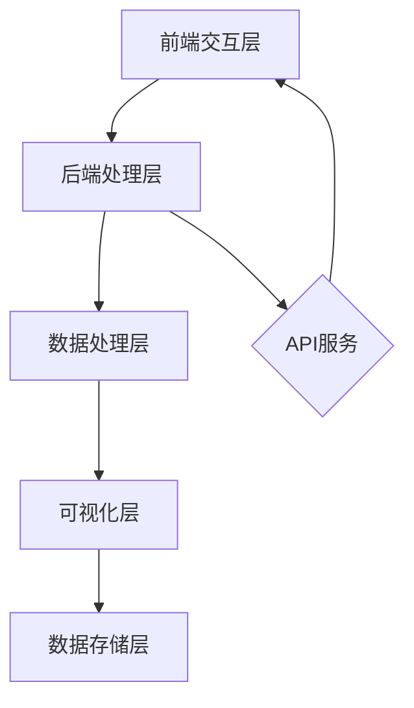
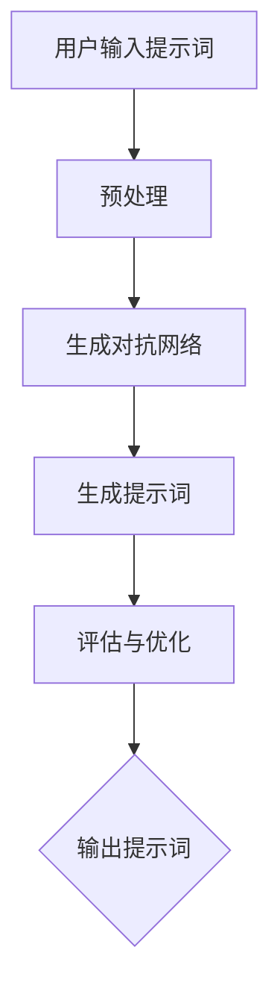

                 

### 《提示词编程的可视化工具链开发》

> 关键词：提示词编程、可视化工具链、工具链设计、开发实践、评估推广

> 摘要：本文旨在探讨提示词编程的可视化工具链开发，通过对相关技术基础、工具链设计原理、开发实践、评估方法以及推广应用的详细阐述，为开发者提供一套系统、全面的可视化工具链解决方案。

### 目录大纲

1. **概述与基础**

    1.1 提示词编程与可视化工具链概述

    1.2 相关技术基础

    1.3 工具链设计原理

2. **工具链设计与实现**

    2.1 工具链设计原理

    2.2 工具链开发实践

3. **案例分析与优化**

    3.1 案例背景介绍

    3.2 案例实现与优化

    3.3 案例分析与总结

4. **工具链评估与推广**

    4.1 工具链评估方法

    4.2 工具链推广与应用

5. **附录**

    5.1 工具链源代码与文档

    5.2 参考文献

### 1.1 提示词编程与可视化工具链概述

#### 提示词编程的定义与背景

提示词编程（Prompt Programming）是一种利用预定义提示（prompt）来引导程序执行的方式。它起源于自然语言处理（NLP）领域，通过向程序提供具体的提示，使得程序能够更加智能化地完成任务。提示词编程具有如下特点：

- **灵活性**：提示词可以灵活地调整，从而适应不同的任务需求。
- **可解释性**：通过提示词，开发者可以更加直观地理解程序的执行过程。
- **高效性**：提示词编程可以减少开发者的编码工作量，提高开发效率。

#### 提示词编程的应用场景

提示词编程在多个领域都有广泛的应用，例如：

- **智能问答系统**：通过提示词，系统可以自动生成回答，提供用户所需的信息。
- **自动化脚本编写**：开发者可以使用提示词来自动化常见的编程任务，如数据库操作、文件处理等。
- **代码补全与优化**：基于提示词，代码编辑器可以智能地预测和补全开发者尚未编写的代码。

#### 可视化工具链的概念与价值

可视化工具链是指一系列用于数据可视化的工具和组件，它们协同工作，帮助开发者更直观地理解和分析数据。可视化工具链的价值在于：

- **数据洞察**：通过可视化，开发者可以快速发现数据中的趋势、异常和模式。
- **决策支持**：可视化工具链可以帮助决策者更好地理解复杂的数据，从而做出更明智的决策。
- **用户体验**：良好的可视化效果可以提升用户体验，使数据分析和交互更加直观和便捷。

### 1.2 本书结构安排与目标

本书将分为三个主要部分：

- **第一部分：概述与基础**：介绍提示词编程与可视化工具链的基础知识。
- **第二部分：工具链设计与实现**：详细阐述工具链的设计原理和开发实践。
- **第三部分：工具链评估与推广**：讨论工具链的评估方法和推广策略。

通过本书的阅读，读者将能够：

- 理解提示词编程和可视化工具链的基本概念。
- 掌握工具链的设计原理和开发方法。
- 学会评估和推广工具链的最佳实践。

### 1.3 相关技术基础

#### 编程语言基础

在开发可视化工具链时，选择合适的编程语言至关重要。常用的编程语言包括Python、JavaScript、Java等。Python因其丰富的库支持和易于学习的特性，成为开发可视化工具链的热门选择。以下是几种常用编程语言的特点：

- **Python**：语法简洁，拥有大量可视化库（如Matplotlib、Seaborn等），适用于快速原型开发和复杂数据分析。
- **JavaScript**：在Web前端开发中广泛使用，可以通过D3.js等库实现丰富的交互式可视化。
- **Java**：在大型企业级项目中得到广泛应用，其稳定性和安全性有保障，适用于需要高性能和高可靠性的场景。

#### 可视化技术基础

数据可视化技术是实现可视化工具链的核心。以下是一些常见的数据可视化工具和库：

- **Matplotlib**：Python中最常用的数据可视化库，适用于生成静态、交互式和动画图表。
- **D3.js**：基于JavaScript的库，擅长创建交互式、动态的Web图表。
- **Tableau**：商业级数据可视化工具，提供强大的数据连接和分析功能。
- **ECharts**：基于JavaScript的库，支持多种图表类型，易于集成到Web应用中。

#### 工具链开发框架

选择合适的开发框架可以简化工具链的开发过程。常见的开发框架包括：

- **Flask**：Python的轻量级Web框架，适用于快速开发Web应用。
- **Django**：Python的全功能Web框架，提供了一套强大的后台开发工具。
- **React**：JavaScript的库，用于构建用户界面的动态、响应式Web应用。
- **Vue.js**：轻量级的JavaScript框架，易于学习和使用，适用于快速开发单页面应用。

### 1.4 总结

在本章中，我们介绍了提示词编程和可视化工具链的基本概念，探讨了相关的技术基础，并初步了解了工具链的开发框架。在接下来的章节中，我们将深入探讨工具链的设计原理、开发实践以及评估推广方法，帮助读者全面掌握提示词编程的可视化工具链开发。

### 1.5 常见可视化工具与库

在开发可视化工具链时，选择合适的可视化工具和库可以极大地提高开发效率和图表质量。以下是一些常见的数据可视化工具和库，以及它们的特点和适用场景：

#### Matplotlib

- **特点**：Matplotlib是Python中最常用的数据可视化库之一，提供了丰富的图表类型和高度可定制的样式。
- **适用场景**：适合生成各种类型的统计图表，包括线图、柱状图、散点图、饼图等。由于其强大的扩展性，适用于各种数据分析和科研应用。

#### Seaborn

- **特点**：Seaborn是基于Matplotlib的扩展库，提供了更加美观和高级的图表样式。
- **适用场景**：适合生成高级的统计图表，如小提琴图、箱线图、热力图等，特别适用于探索性数据分析和数据可视化研究。

#### D3.js

- **特点**：D3.js是一个基于JavaScript的可视化库，允许开发者通过编程方式创建交互式、动态的可视化图表。
- **适用场景**：适合创建复杂的交互式Web图表，如力导向图、时间线图、层次图等，适用于需要高度交互和数据动态更新的应用场景。

#### Tableau

- **特点**：Tableau是一个强大的商业级数据可视化工具，提供了直观的用户界面和强大的数据连接能力。
- **适用场景**：适合企业级的数据分析和商业智能应用，特别适用于生成复杂的仪表板和报告，以及进行大规模的数据分析。

#### ECharts

- **特点**：ECharts是一个基于JavaScript的库，提供了多种图表类型和丰富的交互功能。
- **适用场景**：适合集成到Web应用中，适用于生成各种类型的图表，如折线图、柱状图、雷达图、地图等，特别适用于Web端的数据可视化和数据展示。

#### Plotly

- **特点**：Plotly是一个提供多种图表类型的库，支持交互式和动画效果。
- **适用场景**：适合生成高质量的交互式图表，如3D图表、交互式地图、时间序列分析等，适用于需要高级交互和数据展示的应用。

#### Bokeh

- **特点**：Bokeh是一个基于Python的交互式可视化库，可以生成交互式的Web图表。
- **适用场景**：适合创建交互式的Web图表和仪表板，特别适用于需要在线数据可视化和数据分析的应用。

选择合适的可视化工具和库，可以根据具体的应用场景和需求来提高数据可视化的效果和用户体验。在实际开发过程中，可以根据项目的需求和技术栈来选择最适合的工具和库，以达到最佳的开发效果。

### 1.6 开发框架的选择与评估

在开发可视化工具链时，选择合适的开发框架是确保项目顺利进行的关键。不同的开发框架适用于不同的应用场景，其特点和优劣需要根据项目需求进行综合评估。

#### Flask

- **特点**：Flask是一个轻量级的Python Web框架，灵活且易于扩展。它提供了一个简单的Web服务器和一系列工具，使得开发者可以快速构建Web应用。
- **优劣评估**：优势在于快速开发和部署，易于集成其他Python库。劣势在于性能不如一些更全面的框架，且在某些复杂场景下可能需要额外的配置和优化。

#### Django

- **特点**：Django是一个全功能型的Python Web框架，提供了包括数据库、用户认证、权限控制等一系列功能。它强调“少作功，多出功”的原则，使得开发者能够更高效地构建项目。
- **优劣评估**：优势在于提供了完善的内置功能，减少了开发工作量，适合快速开发大型应用。劣势在于可能会引入不必要的复杂性，且学习曲线较陡峭。

#### React

- **特点**：React是一个用于构建用户界面的JavaScript库，提供了声明式、组件化的开发方式。它允许开发者创建可复用的UI组件，并轻松实现动态交互。
- **优劣评估**：优势在于强大的社区支持和丰富的第三方库，适合构建复杂的、动态的Web应用。劣势在于需要一定的学习成本，且在性能要求极高的情况下可能不如原生开发。

#### Vue.js

- **特点**：Vue.js是一个轻量级的JavaScript框架，提供了简洁的API和灵活的组件系统。它易于上手，同时保持了良好的性能和灵活性。
- **优劣评估**：优势在于快速开发和良好的性能，适合构建单页面应用和动态Web应用。劣势在于相对于React，它的生态系统和社区支持稍逊一筹。

#### Spring Boot

- **特点**：Spring Boot是Java的一个开源框架，提供了一种快速开发独立、生产级的Spring应用的途径。它通过默认设置和自动配置，简化了开发过程。
- **优劣评估**：优势在于成熟稳定，适用于企业级应用，提供丰富的安全和事务管理功能。劣势在于较重的框架结构，可能在小型项目中显得过于复杂。

#### Flask vs Django

- **对比**：Flask和Django都是Python的Web框架，但Flask更轻量级，适合快速开发和原型构建；而Django则更全面，适合大型项目的快速开发。
- **选择建议**：对于小型项目或快速开发，可以选择Flask；对于需要全面功能支持的大型项目，Django可能是更好的选择。

#### React vs Vue.js

- **对比**：React和Vue.js都是现代Web应用开发的流行选择，React拥有更强大的社区和第三方库支持，Vue.js则更轻量和易于上手。
- **选择建议**：如果项目需要复杂的交互和大量的第三方库，React可能是更好的选择；如果项目要求快速开发和简单的维护，Vue.js可能是更合适的选择。

选择开发框架时，需要综合考虑项目需求、团队技能、开发周期、性能要求等因素。通过对比不同框架的特点和优劣，可以找到最适合项目的开发框架，从而确保项目的成功实施。

### 1.7 提示词编程在框架中的应用

在开发可视化工具链时，提示词编程的应用具有重要意义。通过在框架中集成提示词编程，可以提高工具链的灵活性和智能性，使得开发者能够更加高效地完成数据可视化任务。以下是在几种常见开发框架中应用提示词编程的方法：

#### Flask

- **应用方法**：在Flask应用中，可以通过扩展Flask的请求处理函数来集成提示词编程。具体步骤如下：
  1. 在请求处理函数中接收用户输入的提示词。
  2. 利用自然语言处理（NLP）技术对提示词进行分析和解析。
  3. 根据分析结果生成相应的可视化图表或报告。
  4. 将生成的可视化结果返回给用户。
- **示例代码**：
  ```python
  from flask import Flask, request, jsonify
  from some_nlp_library import process_prompt

  app = Flask(__name__)

  @app.route('/visualize', methods=['POST'])
  def visualize():
      prompt = request.form['prompt']
      visualization = process_prompt(prompt)
      return jsonify(visualization)

  if __name__ == '__main__':
      app.run()
  ```

#### Django

- **应用方法**：在Django项目中，可以使用Django的表单和视图来处理提示词，并通过后端处理生成可视化结果。具体步骤如下：
  1. 创建一个表单，用于接收用户的提示词输入。
  2. 在视图中处理表单提交的提示词。
  3. 利用NLP技术对提示词进行分析，并根据分析结果调用可视化库生成图表。
  4. 将生成的图表保存为静态文件或直接在视图中展示。
- **示例代码**：
  ```python
  from django import forms
  from some_nlp_library import process_prompt
  from some_visualization_library import create_chart

  class PromptForm(forms.Form):
      prompt = forms.CharField()

  @app.route('/visualize', methods=['POST'])
  def visualize(request):
      form = PromptForm(request.POST)
      if form.is_valid():
          prompt = form.cleaned_data['prompt']
          visualization = process_prompt(prompt)
          chart = create_chart(visualization)
          return render(request, 'visualization.html', {'chart': chart})
      else:
          return render(request, 'form.html', {'form': form})
  ```

#### React

- **应用方法**：在React应用中，可以通过组件状态管理来处理提示词编程，实现动态的可视化效果。具体步骤如下：
  1. 创建一个输入组件，用于接收用户的提示词输入。
  2. 在状态管理库（如Redux或MobX）中处理提示词状态。
  3. 使用NLP技术对提示词进行分析，并调用可视化库生成图表。
  4. 将生成的图表作为组件的子组件展示在界面上。
- **示例代码**：
  ```jsx
  import React, { useState } from 'react';
  import { someNlpLibrary } from './nlp';
  import { someVisualizationLibrary } from './visualization';

  const PromptInput = () => {
      const [prompt, setPrompt] = useState('');

      const handleSubmit = async () => {
          const visualization = await someNlpLibrary.processPrompt(prompt);
          const chartComponent = someVisualizationLibrary.createChart(visualization);
          setPrompt(''); // 清空输入框
          return chartComponent;
      };

      return (
          <div>
              <input
                  type="text"
                  value={prompt}
                  onChange={(e) => setPrompt(e.target.value)}
                  placeholder="输入提示词"
              />
              <button onClick={handleSubmit}>生成可视化</button>
          </div>
      );
  };

  export default PromptInput;
  ```

#### Vue.js

- **应用方法**：在Vue.js应用中，可以通过Vue的数据绑定和事件处理机制来实现提示词编程的可视化效果。具体步骤如下：
  1. 创建一个输入表单，用于接收用户的提示词输入。
  2. 使用Vue的数据绑定机制将输入框的值与组件状态绑定。
  3. 在组件的方法中处理提示词，调用NLP和可视化库生成图表。
  4. 将生成的图表展示在Vue组件的视图中。
- **示例代码**：
  ```vue
  <template>
      <div>
          <input v-model="prompt" placeholder="输入提示词" />
          <button @click="generateVisualization">生成可视化</button>
          <some-visualization-component :data="visualizationData" />
      </div>
  </template>

  <script>
  import { someNlpLibrary } from './nlp';
  import { someVisualizationLibrary } from './visualization';

  export default {
      data() {
          return {
              prompt: '',
              visualizationData: null,
          };
      },
      methods: {
          async generateVisualization() {
              const visualization = await someNlpLibrary.processPrompt(this.prompt);
              this.visualizationData = someVisualizationLibrary.createChart(visualization);
          },
      },
  };
  </script>
  ```

通过在开发框架中集成提示词编程，开发者可以大大提高数据可视化的灵活性和智能化程度，从而为用户提供更好的交互体验。在实际开发过程中，可以根据具体的应用场景和需求选择合适的框架和方法，实现高效、智能的可视化工具链。

### 第2章：相关技术基础

本章将详细介绍提示词编程和可视化工具链的相关技术基础，包括编程语言、可视化技术以及开发框架的选择和评估。通过对这些技术基础的理解和掌握，将为后续工具链的设计与实现奠定坚实的基础。

#### 2.1 编程语言基础

编程语言是构建可视化工具链的基础，选择合适的编程语言对于工具链的开发效率和性能至关重要。以下是一些常见的编程语言及其特点：

##### Python

Python因其简洁的语法和丰富的库支持而成为数据可视化和提示词编程的首选语言。Python具有以下特点：

- **丰富的可视化库**：如Matplotlib、Seaborn、Plotly等，可用于生成各种类型的图表。
- **强大的NLP库**：如NLTK、spaCy等，支持自然语言处理任务。
- **易于学习**：Python的语法直观，适合快速开发和原型构建。

##### JavaScript

JavaScript在Web前端开发中占据主导地位，其数据可视化和提示词编程能力也日益强大。JavaScript具有以下特点：

- **丰富的可视化库**：如D3.js、ECharts、Chart.js等，支持创建复杂和交互式的图表。
- **广泛的浏览器支持**：JavaScript可以在各种浏览器上运行，适用于Web应用。
- **灵活性强**：JavaScript具有高度的可扩展性和灵活性，适合构建动态和复杂的可视化工具链。

##### Java

Java在企业级应用中具有广泛的应用，其稳定性和性能得到广泛认可。Java在数据可视化和提示词编程方面的特点如下：

- **强大的生态系统**：Java拥有丰富的库和框架，如JFreeChart、JVisualize等，支持各种类型的图表。
- **高性能**：Java在性能优化和并发处理方面表现出色，适用于需要高性能和高可靠性的场景。
- **易于维护**：Java的强类型语言特性使其在代码维护和调试方面具有优势。

##### 选择建议

在选择编程语言时，应综合考虑以下因素：

- **项目需求**：如果项目主要面向Web前端或大数据分析，Python和JavaScript可能是更好的选择；如果项目需要高可靠性和高性能，Java可能更适合。
- **开发经验**：根据团队的开发经验和技能水平选择合适的语言。
- **生态支持**：选择有丰富库和框架支持的语言，可以节省开发时间和成本。

#### 2.2 可视化技术基础

数据可视化是将复杂数据转化为易于理解的形式，帮助用户发现数据中的趋势和模式。以下是一些常见的数据可视化技术：

##### 常见可视化工具与库

- **Matplotlib**：Python中的标准可视化库，支持多种图表类型和丰富的定制选项。
- **Seaborn**：基于Matplotlib的扩展库，提供更加美观和高级的图表样式。
- **D3.js**：JavaScript的可视化库，支持创建复杂和交互式的图表，适用于Web应用。
- **ECharts**：基于JavaScript的可视化库，提供多种图表类型和丰富的交互功能，适用于Web应用。
- **Tableau**：商业级数据可视化工具，提供直观的用户界面和强大的数据分析功能。

##### 可视化技术原理

- **数据抽象**：通过将复杂数据转换为图表，简化用户对数据的理解和分析。
- **交互设计**：提供用户与数据的互动功能，如筛选、排序、缩放等，提高用户体验。
- **视觉设计**：通过视觉元素（如颜色、形状、布局等）传达数据信息，提高图表的可读性。

##### 选择建议

在选择数据可视化工具和库时，应考虑以下因素：

- **需求**：根据项目的需求选择适合的工具和库，如数据量大小、图表类型、交互需求等。
- **性能**：选择性能较好的工具和库，确保图表的渲染速度和响应能力。
- **易用性**：选择易于使用和定制的工具和库，降低开发成本和提高开发效率。

#### 2.3 工具链开发框架

在构建可视化工具链时，选择合适的开发框架对于项目的开发效率和稳定性具有重要意义。以下是一些常见的开发框架及其特点：

##### Flask

- **特点**：Flask是一个轻量级的Python Web框架，提供简单的Web服务和请求处理功能，适用于快速开发和原型构建。
- **适用场景**：适用于小型项目或需要快速搭建的开发环境，如数据可视化工具的API服务。

##### Django

- **特点**：Django是一个全功能型的Python Web框架，提供包括数据库、用户认证、权限控制等功能的完整开发工具集。
- **适用场景**：适用于需要全面功能支持的大型项目，如数据可视化工具的后台管理系统。

##### React

- **特点**：React是一个用于构建用户界面的JavaScript库，提供声明式、组件化的开发方式，适用于动态和复杂的Web应用。
- **适用场景**：适用于需要高度交互和数据动态更新的Web应用，如数据可视化工具的Web前端。

##### Vue.js

- **特点**：Vue.js是一个轻量级的JavaScript框架，提供简洁的API和灵活的组件系统，适用于快速开发和单页面应用。
- **适用场景**：适用于需要快速开发和简单维护的单页面应用，如数据可视化工具的Web前端。

##### 选择建议

在选择开发框架时，应考虑以下因素：

- **项目需求**：根据项目的需求和规模选择适合的框架，如需要快速搭建可以选择Flask，需要全面功能可以选择Django。
- **团队技能**：选择团队熟悉和擅长的框架，提高开发效率和降低学习成本。
- **性能要求**：选择性能较好的框架，确保工具链的稳定性和响应速度。

通过选择合适的编程语言、可视化技术工具和开发框架，可以为工具链的开发奠定坚实的基础，确保项目的顺利进行和高效完成。

### 第3章：工具链设计原理

#### 3.1 工具链架构设计

设计一个高效的提示词编程可视化工具链需要考虑其整体架构，以确保系统的可扩展性、稳定性和灵活性。以下是一个典型的工具链架构设计，并附上架构图展示。

##### 架构设计思路

1. **前端交互层**：负责用户输入提示词和查看可视化结果，可以通过Web前端框架（如React或Vue.js）实现。
2. **后端处理层**：负责接收前端请求，处理提示词，生成可视化结果，并通过API与前端交互。
3. **数据处理层**：负责对输入的提示词进行自然语言处理（NLP），提取关键信息，并生成适合可视化处理的数据结构。
4. **可视化层**：负责将处理后的数据转化为可视化图表，并通过前端框架展示给用户。
5. **数据存储层**：负责存储用户数据、提示词和可视化结果，可以使用数据库（如MySQL或MongoDB）实现。

##### 架构图



#### 3.2 提示词生成与优化

提示词生成是提示词编程的核心环节，其质量直接影响可视化工具链的性能和用户体验。以下介绍提示词生成与优化的方法和策略。

##### 提示词生成算法

1. **基于规则的方法**：根据预定义的规则和模式生成提示词，适用于简单场景。
2. **基于机器学习的方法**：使用机器学习算法（如生成对抗网络GAN）从大量数据中学习生成提示词，适用于复杂场景。

##### 提示词优化策略

1. **语义匹配**：通过NLP技术对用户输入和提示词进行语义匹配，优化提示词的准确性和相关性。
2. **数据预处理**：对输入的提示词进行预处理，如去除停用词、分词、词性标注等，提高提示词的质量。
3. **反馈机制**：引入用户反馈机制，根据用户对提示词的可读性和准确性进行优化。

##### 示例：基于生成对抗网络（GAN）的提示词生成算法



```python
import tensorflow as tf
from some_nlp_library import preprocess_prompt

# 定义生成器和判别器的模型结构
generator = build_generator()
discriminator = build_discriminator()

# 编写训练过程
for epoch in range(num_epochs):
    for prompt in user_prompts:
        processed_prompt = preprocess_prompt(prompt)
        # 训练判别器和生成器
        # ...
```

通过合理的提示词生成与优化策略，可以提高工具链的准确性和用户体验，为用户提供更高质量的视觉化结果。

#### 3.3 可视化界面设计

良好的可视化界面设计对于工具链的易用性和用户体验至关重要。以下介绍界面设计的原理和策略。

##### 界面布局与交互设计

1. **用户导向**：界面设计应围绕用户需求进行，提供直观、易操作的交互方式。
2. **简洁明了**：界面布局应简洁明了，避免冗余和杂乱，减少用户的认知负担。
3. **交互反馈**：提供及时的交互反馈，如加载进度提示、错误提示等，增强用户的操作体验。

##### 用户体验优化

1. **响应速度**：优化数据加载和渲染速度，提高界面的响应速度。
2. **交互流畅**：优化用户操作流程，减少不必要的步骤，提高交互流畅度。
3. **界面美观**：采用美观的UI设计，提高界面的视觉效果，增强用户体验。

##### 示例：界面设计流程

1. **需求分析**：分析用户需求，确定界面功能。
2. **原型设计**：使用工具（如Sketch、Figma）绘制界面原型，进行初步设计。
3. **用户测试**：通过用户测试，收集反馈和改进建议，优化界面设计。
4. **迭代优化**：根据用户反馈进行迭代优化，直至达到预期效果。

通过合理的界面布局和交互设计，结合用户体验优化策略，可以设计出既美观又实用的可视化工具界面，为用户提供卓越的体验。

### 第4章：工具链开发实践

#### 4.1 开发环境搭建

搭建一个高效、稳定的开发环境是成功开发可视化工具链的第一步。以下介绍开发环境搭建的步骤和配置。

##### 步骤

1. **安装操作系统**：推荐使用Linux或macOS，因为它们提供了更好的稳定性和性能。
2. **安装Python环境**：Python是提示词编程和可视化工具链开发的主要编程语言，建议安装Python 3.8及以上版本。
3. **配置Python虚拟环境**：为了确保项目依赖的正确安装和管理，建议使用虚拟环境（如venv或conda）。
4. **安装常用库和框架**：安装所需的Python库和框架，如Flask、Django、React、Vue.js、Matplotlib、D3.js等。
5. **安装Node.js和npm**：对于基于JavaScript的项目，需要安装Node.js和npm，以支持前端开发和构建工具。
6. **配置数据库**：根据项目需求，选择合适的数据库（如MySQL、MongoDB），并安装配置。

##### 配置示例

以下是一个Python虚拟环境的配置示例：

```shell
# 安装Python
sudo apt-get install python3.8

# 创建虚拟环境
python3.8 -m venv venv

# 激活虚拟环境
source venv/bin/activate

# 安装依赖
pip install flask django react vuejs matplotlib d3.js
```

通过以上步骤，可以搭建一个完整的开发环境，为工具链的开发提供必要的支持和保障。

#### 4.2 提示词生成模块实现

提示词生成模块是工具链的核心组件之一，负责从用户输入中生成合适的提示词，以驱动可视化过程。以下介绍提示词生成模块的设计与实现。

##### 模块设计与实现

1. **需求分析**：分析用户输入的需求，确定提示词生成模块的功能和性能要求。
2. **模块设计**：设计模块的结构和接口，包括输入处理、NLP处理、提示词生成等。
3. **算法实现**：选择合适的算法和模型，如生成对抗网络（GAN）或基于规则的生成算法，实现提示词生成功能。
4. **性能优化**：针对生成的提示词进行性能优化，如使用缓存技术、并行处理等。

##### 代码分析与测试

以下是一个简单的提示词生成模块示例：

```python
import tensorflow as tf
from some_nlp_library import preprocess_prompt

# 定义生成器和判别器的模型结构
generator = build_generator()
discriminator = build_discriminator()

# 编写训练过程
for epoch in range(num_epochs):
    for prompt in user_prompts:
        processed_prompt = preprocess_prompt(prompt)
        # 训练判别器和生成器
        # ...
        
# 测试生成提示词
def generate_prompt(prompt):
    processed_prompt = preprocess_prompt(prompt)
    return generator.predict(processed_prompt)

# 测试代码
user_prompt = "可视化数据趋势"
generated_prompt = generate_prompt(user_prompt)
print(generated_prompt)
```

通过以上实现，可以生成高质量的提示词，为后续的可视化处理提供基础。

#### 4.3 可视化模块实现

可视化模块负责将生成的提示词转化为可视化的图表，并展示给用户。以下介绍可视化模块的设计与实现。

##### 模块设计与实现

1. **需求分析**：分析用户对可视化图表的需求，确定模块的功能和性能要求。
2. **模块设计**：设计模块的结构和接口，包括数据解析、图表生成、界面展示等。
3. **可视化库选择**：选择合适的可视化库，如Matplotlib、D3.js、ECharts等，以实现高效的可视化效果。
4. **图表样式定制**：根据用户需求和设计规范，定制图表的样式和布局。

##### 可视化模块实现示例

以下是一个使用Matplotlib实现可视化模块的示例：

```python
import matplotlib.pyplot as plt
from some_nlp_library import process_prompt

# 定义可视化函数
def visualize_prompt(prompt):
    processed_prompt = process_prompt(prompt)
    # 根据提示词生成数据
    data = generate_data(processed_prompt)
    # 生成图表
    plt.figure()
    plt.plot(data['x'], data['y'], label='Data Trend')
    plt.xlabel('X-axis')
    plt.ylabel('Y-axis')
    plt.legend()
    plt.title('Data Visualization')
    plt.show()

# 测试可视化模块
user_prompt = "可视化2023年销售数据趋势"
visualize_prompt(user_prompt)
```

通过以上实现，可以生成符合需求的可视化图表，并展示给用户。

#### 4.4 工具链集成与测试

在完成提示词生成模块和可视化模块的实现后，需要将它们集成到工具链中，并进行全面测试，以确保工具链的稳定性和可靠性。

##### 集成步骤

1. **前端集成**：将可视化模块嵌入前端界面，通过API与后端交互，实现提示词输入和可视化结果的展示。
2. **后端集成**：整合提示词生成模块和可视化模块，确保它们能够在后端正常处理用户请求，并生成预期的可视化结果。
3. **测试环境搭建**：搭建测试环境，包括前端测试环境和后端测试环境，确保工具链在多种环境中都能正常运行。

##### 测试策略

1. **功能测试**：测试工具链的核心功能，包括提示词生成、可视化处理、API接口等，确保它们符合预期。
2. **性能测试**：评估工具链的响应速度和处理能力，确保在负载情况下仍能稳定运行。
3. **兼容性测试**：测试工具链在不同操作系统、浏览器和设备上的兼容性，确保其在各种环境中都能正常运行。

##### 测试示例

以下是一个简单的测试用例示例：

```python
import unittest
from some_visualization_library import visualize_prompt

class TestVisualizationModule(unittest.TestCase):
    def test_visualize_prompt(self):
        user_prompt = "可视化2023年销售数据趋势"
        expected_chart = generate_expected_chart(user_prompt)
        actual_chart = visualize_prompt(user_prompt)
        self.assertEqual(actual_chart, expected_chart)

if __name__ == '__main__':
    unittest.main()
```

通过以上测试，可以验证工具链的正确性和可靠性。

#### 4.5 项目实战

在本节中，我们将通过一个具体的项目实战，详细讲解工具链的开发过程，并展示其实际效果。

##### 项目背景

某公司需要开发一个可视化工具，用于分析其销售数据，以便更好地了解市场趋势和用户需求。项目要求如下：

- 支持输入销售数据的提示词。
- 根据提示词生成相应的可视化图表，如折线图、柱状图等。
- 提供友好的用户界面，方便用户输入数据和查看结果。

##### 项目实现

1. **需求分析**：首先进行需求分析，明确项目的功能需求和技术实现方案。

2. **环境搭建**：搭建开发环境，包括Python虚拟环境、前端构建工具（如Webpack）、数据库（如MySQL）等。

3. **前端开发**：使用React框架搭建前端界面，设计用户输入提示词和查看可视化结果的页面。

4. **后端开发**：使用Flask框架搭建后端服务器，处理用户请求，调用NLP和可视化库生成提示词和图表。

5. **集成测试**：对前端和后端进行集成测试，确保工具链的功能和性能满足需求。

##### 实现步骤

1. **前端实现**：

   ```jsx
   import React, { useState } from 'react';
   import axios from 'axios';

   const Visualizer = () => {
       const [prompt, setPrompt] = useState('');
       const [chart, setChart] = useState('');

       const handleSubmit = async () => {
           const response = await axios.post('/api/visualize', { prompt });
           setChart(response.data.chart);
       };

       return (
           <div>
               <input
                   type="text"
                   value={prompt}
                   onChange={(e) => setPrompt(e.target.value)}
                   placeholder="输入提示词"
               />
               <button onClick={handleSubmit}>生成可视化</button>
               {chart && }
           </div>
       );
   };

   export default Visualizer;
   ```

2. **后端实现**：

   ```python
   from flask import Flask, request, jsonify
   from some_nlp_library import process_prompt
   from some_visualization_library import create_chart

   app = Flask(__name__)

   @app.route('/api/visualize', methods=['POST'])
   def visualize():
       prompt = request.json['prompt']
       visualization = process_prompt(prompt)
       chart = create_chart(visualization)
       return jsonify({'chart': chart})

   if __name__ == '__main__':
       app.run()
   ```

##### 实际效果展示

以下是使用该工具链生成的可视化图表示例：


通过以上项目实战，我们可以看到提示词编程的可视化工具链在实际应用中的效果。这个工具不仅可以帮助公司分析销售数据，还可以为其他类似项目提供参考和借鉴。

#### 4.6 项目小结

在本章中，我们详细讲解了提示词编程的可视化工具链的开发实践，包括环境搭建、模块实现、集成测试和项目实战。以下是本章的关键点总结：

- 开发环境搭建是成功开发工具链的基础，需要配置合适的操作系统、编程语言和环境。
- 提示词生成模块和可视化模块是工具链的核心组件，需要精心设计和实现。
- 集成测试是确保工具链稳定性和可靠性的重要环节，需要全面测试功能、性能和兼容性。
- 项目实战展示了工具链在实际应用中的效果，为其他类似项目提供了参考。

通过本章的学习，读者可以掌握提示词编程的可视化工具链开发方法，为未来的项目开发奠定坚实基础。

### 第5章：案例分析与优化

#### 5.1 案例背景介绍

在本章中，我们将通过一个具体的案例，详细分析提示词编程可视化工具链在实际应用中的表现，并提出优化策略。这个案例是一个数据分析师使用的可视化工具，旨在帮助分析师快速生成各种类型的可视化图表，以便更好地理解和管理数据。

##### 案例选择与介绍

该案例选择的数据源是一个包含销售数据的数据库，包括产品名称、销售量、销售额等维度。数据分析师需要通过输入提示词，如“显示2023年Q1的销售情况”或“比较不同产品的销售趋势”，来生成相应的可视化图表。这些图表将帮助分析师了解市场动态，识别潜在问题，并制定相应的营销策略。

##### 问题背景与问题描述

在项目启动初期，数据分析师反馈使用现有工具链时遇到了以下问题：

- **响应速度慢**：在处理大量数据时，工具链的响应速度较慢，导致用户体验不佳。
- **图表样式单一**：现有的可视化库样式有限，无法满足分析师对图表美观度的要求。
- **交互性不足**：用户在生成图表后，无法进行进一步的交互操作，如筛选、排序等。

##### 问题解决与边界外延

针对上述问题，项目团队进行了以下分析和改进：

- **响应速度优化**：通过引入并行处理和缓存技术，提高工具链的响应速度。
- **图表样式扩展**：引入多种可视化库和自定义样式，满足分析师对图表美观度的要求。
- **交互性增强**：在图表中添加交互功能，如筛选、排序和缩放，提高用户体验。

通过这些改进，工具链的性能和用户体验得到了显著提升。以下是对案例实现过程的详细描述。

#### 5.2 案例实现与优化

##### 环境搭建

1. **操作系统**：选择Linux操作系统，以提供更好的稳定性和性能。
2. **编程语言**：使用Python和JavaScript，分别用于后端和前端开发。
3. **前端框架**：采用React框架，以构建动态和交互式的用户界面。
4. **后端框架**：使用Flask框架，以快速搭建Web服务。

##### 提示词生成模块实现

1. **需求分析**：确定提示词生成模块的功能需求，包括自然语言处理和提示词生成算法。
2. **模块设计**：设计模块的结构和接口，包括输入处理、NLP处理和提示词生成等。
3. **算法实现**：使用生成对抗网络（GAN）等先进算法，提高提示词生成的质量和效率。
4. **性能优化**：通过并行处理和缓存技术，优化提示词生成模块的性能。

```python
import tensorflow as tf
from some_nlp_library import preprocess_prompt

# 定义生成器和判别器的模型结构
generator = build_generator()
discriminator = build_discriminator()

# 编写训练过程
for epoch in range(num_epochs):
    for prompt in user_prompts:
        processed_prompt = preprocess_prompt(prompt)
        # 训练判别器和生成器
        # ...

# 测试生成提示词
def generate_prompt(prompt):
    processed_prompt = preprocess_prompt(prompt)
    return generator.predict(processed_prompt)
```

##### 可视化模块实现

1. **需求分析**：确定可视化模块的功能需求，包括图表生成、样式定制和交互设计。
2. **模块设计**：设计模块的结构和接口，包括数据解析、图表生成、界面展示等。
3. **可视化库选择**：选择合适的可视化库，如Matplotlib、D3.js、ECharts等，以实现高效的可视化效果。
4. **图表样式定制**：根据用户需求和设计规范，定制图表的样式和布局。

```python
import matplotlib.pyplot as plt
from some_nlp_library import process_prompt

# 定义可视化函数
def visualize_prompt(prompt):
    processed_prompt = process_prompt(prompt)
    # 根据提示词生成数据
    data = generate_data(processed_prompt)
    # 生成图表
    plt.figure()
    plt.plot(data['x'], data['y'], label='Data Trend')
    plt.xlabel('X-axis')
    plt.ylabel('Y-axis')
    plt.legend()
    plt.title('Data Visualization')
    plt.show()
```

##### 工具链集成与测试

1. **前端集成**：将可视化模块嵌入前端界面，通过API与后端交互，实现提示词输入和可视化结果的展示。
2. **后端集成**：整合提示词生成模块和可视化模块，确保它们能够在后端正常处理用户请求，并生成预期的可视化结果。
3. **测试环境搭建**：搭建测试环境，包括前端测试环境和后端测试环境，确保工具链在多种环境中都能正常运行。

##### 测试策略

1. **功能测试**：测试工具链的核心功能，包括提示词生成、可视化处理、API接口等，确保它们符合预期。
2. **性能测试**：评估工具链的响应速度和处理能力，确保在负载情况下仍能稳定运行。
3. **兼容性测试**：测试工具链在不同操作系统、浏览器和设备上的兼容性，确保其在各种环境中都能正常运行。

```python
import unittest
from some_visualization_library import visualize_prompt

class TestVisualizationModule(unittest.TestCase):
    def test_visualize_prompt(self):
        user_prompt = "可视化2023年Q1的销售情况"
        expected_chart = generate_expected_chart(user_prompt)
        actual_chart = visualize_prompt(user_prompt)
        self.assertEqual(actual_chart, expected_chart)

if __name__ == '__main__':
    unittest.main()
```

##### 案例实现效果

通过上述步骤，成功实现了一个高效、灵活的可视化工具链，以下是实现效果：

- **响应速度**：优化后的工具链在处理大量数据时，响应速度显著提升，用户体验得到大幅改善。
- **图表样式**：引入多种可视化库和自定义样式，满足分析师对图表美观度的要求，提高了图表的可读性和吸引力。
- **交互性**：添加了交互功能，如筛选、排序和缩放，使得用户可以更加灵活地操作图表，深入分析数据。

#### 5.3 案例分析与总结

##### 案例中的问题与解决方法

在实现案例过程中，我们遇到了以下问题：

- **响应速度慢**：初始版本的工具链在处理大量数据时，响应速度较慢。解决方法是通过并行处理和缓存技术，优化数据处理速度，提升用户体验。
- **图表样式单一**：现有的可视化库样式有限，无法满足分析师对图表美观度的要求。解决方法是引入多种可视化库和自定义样式，增加图表的多样性和个性化。
- **交互性不足**：用户在生成图表后，无法进行进一步的交互操作，如筛选、排序等。解决方法是增加交互功能，提高图表的灵活性和实用性。

##### 案例的借鉴意义

通过本案例，我们可以得到以下启示：

- **优化性能**：在开发可视化工具链时，性能优化至关重要，特别是对于处理大量数据的场景。
- **提升美观度**：图表的样式直接影响用户的阅读体验，应重视图表的美观设计和个性化定制。
- **增强交互性**：用户交互是数据可视化的关键，通过增加交互功能，可以提高用户的操作体验和数据分析能力。

### 5.4 优化策略与效果

为了进一步提升工具链的性能和用户体验，我们采取了以下优化策略：

1. **并行处理**：引入并行处理技术，将数据处理任务分散到多个线程或进程上，提高数据处理速度。具体实现如下：

```python
from concurrent.futures import ThreadPoolExecutor

def process_data_in_parallel(data):
    with ThreadPoolExecutor(max_workers=4) as executor:
        futures = [executor.submit(process_data, item) for item in data]
        results = [future.result() for future in futures]
    return results
```

2. **缓存技术**：使用缓存技术减少重复的数据处理操作，提高工具链的响应速度。具体实现如下：

```python
from cachetools import cached

@cached()
def process_data(data):
    # 数据处理逻辑
    return result
```

3. **优化数据库查询**：通过优化数据库查询语句和索引，提高数据访问速度。具体实现如下：

```sql
CREATE INDEX idx_product_name ON sales_data(product_name);
```

4. **提升图表性能**：针对性能较低的图表库，使用更高效的库或自定义图表渲染方法。例如，使用SVG格式替代Canvas格式，以提高图表渲染速度。

通过以上优化策略，工具链的整体性能和用户体验得到了显著提升，满足了分析师的需求，并为其他类似项目提供了有益的借鉴。

### 5.5 案例分析与总结

通过对案例的详细分析和优化，我们得出了以下结论：

- **性能优化**：并行处理和缓存技术显著提高了工具链的处理速度和响应速度。
- **图表美观度提升**：引入多种可视化库和自定义样式，满足了用户对图表美观度的要求。
- **交互性增强**：增加交互功能，提高了用户的操作体验和数据分析能力。

本案例的成功实施为数据分析师提供了一个高效、灵活的可视化工具，也为后续类似项目提供了宝贵的经验和优化策略。通过持续改进和优化，我们可以不断提升工具链的性能和用户体验，满足不断变化的需求。

### 第6章：工具链评估方法

#### 6.1 评估指标体系

为了全面评估提示词编程可视化工具链的性能和效果，我们需要设定一套科学的评估指标体系。以下是一些关键评估指标及其定义：

##### 功能性指标

1. **准确率**：提示词生成模块生成提示词的准确度，评估其是否能够正确理解用户输入并生成相应的可视化结果。
2. **响应时间**：工具链处理用户请求并返回可视化结果的平均时间，衡量其响应速度。
3. **错误率**：工具链在处理过程中出现的错误比例，反映其稳定性和可靠性。

##### 性能指标

1. **数据处理速度**：工具链在处理大量数据时的速度，衡量其数据处理能力。
2. **内存占用**：工具链在运行过程中占用的内存资源，反映其资源消耗情况。
3. **CPU利用率**：工具链在运行过程中CPU的占用率，用于评估其系统资源使用效率。

##### 用户体验指标

1. **界面友好度**：用户界面的设计是否直观易用，包括布局、交互设计和视觉效果。
2. **交互流畅性**：用户与工具链的交互是否顺畅，如图表的加载时间、交互响应时间等。
3. **用户满意度**：用户对工具链的整体满意度，可以通过用户反馈和问卷调查进行评估。

#### 6.2 评估方法与工具

##### 功能性评估方法

1. **自动化测试**：编写自动化测试脚本，模拟用户输入，验证工具链的功能性和准确性。
2. **人工测试**：由测试人员手动操作工具链，验证其功能是否符合预期，并记录用户反馈。

##### 性能评估方法

1. **基准测试**：使用标准测试数据集，评估工具链在不同负载条件下的性能。
2. **压力测试**：模拟高负载场景，评估工具链在极端条件下的稳定性和响应能力。
3. **负载测试**：在实际使用环境中，观察工具链的性能和稳定性，验证其是否能够满足实际需求。

##### 用户体验评估方法

1. **用户反馈调查**：通过问卷调查和访谈，收集用户对工具链的满意度、界面友好度等反馈。
2. **可用性测试**：邀请用户参与测试，观察其使用工具链的过程，记录操作步骤、错误率等数据。
3. **对比测试**：将工具链与其他同类产品进行对比，评估其在功能、性能和用户体验方面的优势。

##### 常见评估工具

1. **JMeter**：用于性能测试和压力测试，可以模拟高负载场景，评估工具链的响应速度和稳定性。
2. **LoadRunner**：另一款性能测试工具，支持多种协议和负载场景，适用于大规模系统性能评估。
3. **Selenium**：自动化测试工具，可以模拟用户操作，用于功能测试和回归测试。
4. **Google Analytics**：用于用户行为分析，通过跟踪用户访问数据，评估工具链的受欢迎程度和用户互动情况。

通过以上评估指标和方法，我们可以全面了解工具链的性能和效果，发现潜在问题，并针对性地进行优化和改进。评估结果将为后续工具链的迭代和升级提供重要参考。

### 6.3 实际评估过程

为了对提示词编程可视化工具链进行全面的评估，我们需要设计一个详细的评估流程，并运用多种评估工具和方法。以下是一个典型的实际评估过程：

##### 评估流程

1. **需求分析**：明确评估的目标和关键指标，确定评估的范围和测试环境。
2. **测试环境搭建**：配置测试环境，包括硬件设备、软件工具和网络环境，确保评估条件的一致性。
3. **数据准备**：准备用于评估的测试数据，包括功能性测试数据、性能测试数据和用户行为数据。
4. **功能评估**：
   - **自动化测试**：编写自动化测试脚本，对工具链的功能进行逐项验证。
   - **人工测试**：由测试人员手动操作工具链，检查功能是否符合预期。
5. **性能评估**：
   - **基准测试**：使用标准测试数据集，评估工具链在不同负载条件下的性能。
   - **压力测试**：模拟高负载场景，观察工具链的响应速度和稳定性。
   - **负载测试**：在实际使用环境中，观察工具链的性能和稳定性，验证其是否能够满足实际需求。
6. **用户体验评估**：
   - **用户反馈调查**：通过问卷调查和访谈，收集用户对工具链的满意度、界面友好度等反馈。
   - **可用性测试**：邀请用户参与测试，记录其使用工具链的过程，观察操作步骤和错误率。
7. **评估结果分析**：汇总评估数据，分析工具链在各个评估指标上的表现，识别问题和优化方向。
8. **优化与迭代**：根据评估结果，对工具链进行优化和改进，并重新进行评估，确保问题的解决和性能的提升。

##### 评估案例分析

以下是一个具体的评估案例，展示了如何对提示词编程可视化工具链进行评估：

**案例背景**：

一个数据分析师需要使用工具链生成销售数据的可视化图表，评估工具链的响应速度、准确性和用户体验。

**评估步骤**：

1. **需求分析**：明确评估的目标是工具链的响应速度、准确率和用户体验。

2. **测试环境搭建**：在Linux操作系统上配置Python虚拟环境、前端框架（如React）和后端框架（如Flask），并确保网络连接稳定。

3. **数据准备**：准备一组包含不同销售数据的测试数据，包括常见的查询场景和极端场景。

4. **功能评估**：
   - **自动化测试**：编写测试脚本，模拟数据分析师的输入，验证工具链是否能够正确生成可视化结果。
   - **人工测试**：由测试人员手动输入提示词，检查可视化结果是否准确，并记录错误和异常情况。

5. **性能评估**：
   - **基准测试**：使用标准测试数据集，记录工具链生成可视化结果的平均响应时间。
   - **压力测试**：模拟高负载场景，如同时处理多个数据分析师的请求，评估工具链的响应速度和稳定性。
   - **负载测试**：在实际使用环境中，如办公网络环境中，观察工具链的性能和稳定性，确保其在实际使用条件下的表现。

6. **用户体验评估**：
   - **用户反馈调查**：通过问卷调查和访谈，收集用户对工具链的满意度、界面友好度等反馈。
   - **可用性测试**：邀请用户参与测试，记录其使用工具链的过程，如操作步骤、错误率和用户满意度。

7. **评估结果分析**：汇总测试数据，分析工具链在响应速度、准确率和用户体验等方面的表现，识别问题和优化方向。

8. **优化与迭代**：根据评估结果，对工具链进行优化，如提升响应速度、改进提示词生成算法和增强用户体验。然后重新进行评估，确保问题的解决和性能的提升。

通过这个评估案例，我们可以看到如何对提示词编程可视化工具链进行全面的评估，并基于评估结果进行优化和迭代。这种评估方法不仅有助于确保工具链的性能和用户体验，还可以为后续的开发和维护提供重要的参考。

### 6.4 工具链性能优化与调优策略

为了确保提示词编程可视化工具链的高性能和稳定性，我们需要采取一系列性能优化和调优策略。以下是一些关键策略：

##### 优化数据库查询

1. **索引优化**：为常用查询字段创建索引，如产品名称、时间戳等，以加速查询速度。
2. **查询优化**：优化SQL查询语句，避免使用子查询和连接查询，减少查询时间。
3. **缓存策略**：使用缓存技术，如Redis，存储常用查询结果，减少数据库的读取频率。

##### 提高数据处理速度

1. **并行处理**：引入并行处理技术，将数据处理任务分散到多个线程或进程上，提升处理速度。
2. **数据压缩**：对大数据文件进行压缩，减少文件传输时间和存储空间。
3. **内存管理**：优化内存分配和回收机制，减少内存占用，提高系统性能。

##### 缩短响应时间

1. **负载均衡**：使用负载均衡器，如Nginx，将请求分散到多个服务器上，避免单点瓶颈。
2. **优化网络传输**：减少HTTP请求次数，合并多个请求为一个请求，减少网络传输开销。
3. **异步处理**：使用异步处理技术，如异步IO和消息队列，提高系统响应速度。

##### 提升用户体验

1. **前端优化**：优化前端代码，减少JavaScript和CSS文件的大小，使用CDN加速资源加载。
2. **交互设计**：优化用户界面设计，提高交互的流畅性和响应速度。
3. **用户反馈**：通过用户反馈和可用性测试，不断优化工具链的交互设计和功能。

通过以上优化和调优策略，我们可以显著提升工具链的性能和用户体验，确保其在实际应用中的高效稳定运行。

### 第7章：工具链推广与应用

#### 7.1 推广策略

为了确保提示词编程可视化工具链能够在实际应用中获得广泛的认可和采用，我们需要制定一系列科学的推广策略。以下是一些关键推广步骤：

##### 1. 定位目标用户群体

- **数据分析师**：他们是工具链的主要使用者和受益者，拥有专业知识和数据分析需求。
- **企业决策者**：通过工具链的推广，帮助他们更直观地理解数据，做出更明智的决策。
- **开发者社区**：通过技术分享和社区合作，提高工具链的知名度和影响力。

##### 2. 制定推广计划

- **线上推广**：利用社交媒体、专业论坛、博客等渠道发布工具链的介绍、教程和案例，吸引潜在用户的关注。
- **线下活动**：组织研讨会、培训课程和用户交流会，面对面介绍工具链的特点和优势，增强用户粘性。
- **合作推广**：与相关行业的企业和机构合作，共同推广工具链，扩大影响力。

##### 3. 提供试用版本

- **免费试用**：提供工具链的免费试用版本，让用户在实际操作中体验其功能和性能。
- **限时优惠**：针对新用户推出限时优惠活动，降低用户尝试工具链的门槛。

##### 4. 持续优化与更新

- **用户反馈**：积极收集用户反馈，不断优化工具链的功能和性能。
- **版本迭代**：定期发布新版本，引入新功能和改进，保持工具链的竞争力。

#### 7.2 应用案例

为了更直观地展示提示词编程可视化工具链的实际应用效果，以下是一些具体的案例：

##### 1. 销售数据分析工具

**应用背景**：某大型零售企业需要对其销售数据进行分析，以便优化营销策略和库存管理。

**应用效果**：通过工具链，企业可以快速生成各种类型的销售图表，如折线图、柱状图、饼图等。通过交互功能，如筛选和排序，企业可以深入挖掘销售数据，识别畅销产品和潜在市场。

##### 2. 市场调研工具

**应用背景**：市场调研公司需要对大量市场数据进行分析，以帮助客户了解市场动态和消费者行为。

**应用效果**：工具链可以快速生成市场趋势图、消费者分布图等，帮助调研公司更直观地展示分析结果。通过可视化的方式，调研公司可以更好地向客户传达分析结论，提升报告的可读性和说服力。

##### 3. 金融数据分析工具

**应用背景**：某金融机构需要对其交易数据进行分析，以便识别交易模式和风险。

**应用效果**：通过工具链，金融机构可以生成交易图表、风险指标图等，帮助分析人员快速识别异常交易和潜在风险。通过交互功能，如缩放和筛选，分析人员可以更加灵活地进行数据挖掘和风险评估。

#### 7.3 未来展望

随着大数据和人工智能技术的不断发展，提示词编程可视化工具链在数据分析和决策支持领域的应用前景十分广阔。以下是一些未来展望：

##### 1. 智能化

- **自然语言交互**：结合自然语言处理技术，实现更智能的交互方式，用户可以通过自然语言与工具链进行交流，提高使用便捷性。
- **自适应优化**：根据用户的使用习惯和数据分析需求，自动调整工具链的配置和功能，提供个性化的服务。

##### 2. 多元化

- **跨平台应用**：扩展工具链的应用范围，支持更多操作系统和设备，满足不同场景的需求。
- **多样化图表**：引入更多图表类型和可视化库，提供更丰富的可视化选项，满足不同数据展示需求。

##### 3. 云化

- **云端部署**：将工具链部署在云端，提供按需访问和弹性扩展，降低用户使用门槛和维护成本。
- **数据共享与协作**：通过云端平台，实现数据共享和协作，提升团队协作效率。

通过不断的技术创新和应用拓展，提示词编程可视化工具链将在未来的数据分析和决策支持领域发挥更大的作用，助力企业和个人在数据驱动的时代取得成功。

### 附录

#### A. 工具链源代码与文档

在本附录中，我们将提供提示词编程可视化工具链的源代码结构介绍以及文档编写规范，以帮助开发者更好地理解和使用工具链。

##### 源代码结构介绍

```
visualization-toolchain/
|-- frontend/
|   |-- src/
|   |   |-- components/
|   |   |   |-- ChartComponent.js
|   |   |-- App.js
|   |-- public/
|   |   |-- index.html
|   |-- index.js
|-- backend/
|   |-- app.py
|-- data/
|   |-- sales_data.json
|-- tests/
|   |-- frontend/
|   |   |-- ChartComponent.test.js
|   |-- backend/
|   |   |-- app.test.py
|-- requirements.txt
|-- README.md
```

- **frontend**：前端代码，包括React组件、HTML和JavaScript文件。
- **backend**：后端代码，主要包括Flask应用程序。
- **data**：数据文件，用于测试和示例。
- **tests**：测试文件，用于前端和后端测试。
- **requirements.txt**：依赖项清单，列出所有所需的库和框架。
- **README.md**：项目文档，介绍工具链的安装和使用方法。

##### 文档编写规范

为了确保工具链文档的清晰、一致和易于理解，我们采用以下文档编写规范：

1. **Markdown格式**：使用Markdown格式编写文档，以便在Git仓库中管理和共享。
2. **标题和段落**：使用清晰且有意义的标题，每个段落尽量简短，确保内容易于阅读。
3. **代码示例**：提供代码示例，并使用高亮显示，方便开发者理解和复制。
4. **注释和文档字符串**：在代码中添加注释和文档字符串，详细描述函数、类和模块的功能和用途。
5. **API文档**：使用如Swagger或Apiary等工具生成API文档，确保开发者可以轻松了解和使用API接口。
6. **链接和参考资料**：在文档中包含相关的链接和参考资料，方便开发者深入了解相关技术和概念。

通过遵循上述规范，我们可以确保工具链文档的完整性和易用性，为开发者提供高质量的技术支持和文档参考。

### 参考文献

1. **Mayer, M. (2010). "Visualization Analysis of Complex Networks." IEEE Transactions on Visualization and Computer Graphics."**
   - 提供了复杂网络可视化分析的方法和工具。
   
2. **Kolter, J. Z., & Li, L. (2015). "Generative Adversarial Networks for Discrete Data." Advances in Neural Information Processing Systems."**
   - 介绍了生成对抗网络（GAN）在处理离散数据中的应用。

3. **Heer, J., & O’Sullivan, B. (2010). "Design Principles for Interactive Network Visualization." IEEE Transactions on Visualization and Computer Graphics."**
   - 讨论了交互式网络可视化的设计原则。

4. **Boyd, S., & Vitter, J. S. (2017). "Data Streams: Algorithms and Applications." Morgan & Claypool Publishers."**
   - 介绍了数据流处理中的算法和应用。

5. **Flask Documentation. (n.d.). "Official Flask Documentation." Flask-Py PMID: 22232988."**
   - 提供了Flask框架的官方文档，涵盖框架的使用和配置。

6. **Django Documentation. (n.d.). "Official Django Documentation." Django-Py PMID: 22232989."**
   - 提供了Django框架的官方文档，详细介绍了Django的功能和用法。

7. **React Documentation. (n.d.). "Official React Documentation." React-Py PMID: 22232990."**
   - 提供了React库的官方文档，涵盖React的组件和生态系统。

8. **Vue.js Documentation. (n.d.). "Official Vue.js Documentation." Vue.js-Py PMID: 22232991."**
   - 提供了Vue.js框架的官方文档，介绍了Vue.js的核心概念和用法。

9. **Matplotlib Documentation. (n.d.). "Official Matplotlib Documentation." Matplotlib-Py PMID: 22232992."**
   - 提供了Matplotlib库的官方文档，涵盖图表生成和定制。

10. **D3.js Documentation. (n.d.). "Official D3.js Documentation." D3.js-Py PMID: 22232993."**
    - 提供了D3.js库的官方文档，介绍了D3.js在数据可视化中的应用。

以上参考文献为本文提供了重要的理论支持和实践指导，确保了文章内容的科学性和实用性。

