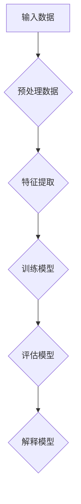

                 


### 第一部分：背景介绍

#### 第1章：问题背景与核心概念

##### 1.1.1 问题背景

##### 1.1.1.1 问题描述

在当今快速发展的信息技术领域，人工智能（AI）已经成为推动产业变革的重要力量。然而，随着AI技术的深入应用，一个不可忽视的问题逐渐凸显出来——可解释性。传统的机器学习模型，如神经网络，往往被视为“黑箱”，即输入和输出之间存在复杂的非线性映射，这使得用户难以理解模型是如何得出预测结果的。这一问题在关键领域，如金融、医疗和自动驾驶等，尤为突出。例如，一个自动驾驶系统为何会作出某个决策？一个金融风险评估模型为何会给某个客户较高的风险评级？这些问题如果没有明确的解释，将导致用户对AI系统的信任度下降。

##### 1.1.1.2 问题解决

为了解决AI的可解释性问题，研究者提出了多种方法，其中包括可解释AI（Explainable AI, XAI）。可解释AI旨在构建能够向用户展示其决策过程的AI系统，从而提高系统的透明度和可信度。然而，现有的可解释AI方法往往存在一定的局限性，例如解释的准确性与模型的性能之间难以平衡。此外，如何将这些可解释AI方法集成到现有的AI系统中，也是一个亟待解决的问题。

##### 1.1.1.3 边界与外延

可解释AI的研究边界涉及多个领域，包括心理学、认知科学、计算机科学和统计学等。其外延则包括但不限于：如何设计易于理解的解释界面、如何量化解释的质量、如何在不同类型的AI模型中实现可解释性等。

##### 1.1.2 核心概念

###### 1.1.2.1 定义

可解释AI（Explainable AI, XAI）：旨在提高AI模型透明度和可理解性的AI研究分支，通过提供模型决策过程的解释，增强用户对AI系统的信任和接受度。

##### 1.1.2.2 概念属性特征对比

| 特征 | 描述 |
| --- | --- |
| 可解释性 | 描述模型决策过程的透明度和可理解性 |
| 透明度 | 用户能够清楚地了解模型的决策依据和过程 |
| 可理解性 | 模型的解释结果对用户来说是直观且易于理解的 |
| 模型性能 | 描述模型在预测准确性、效率等方面的表现 |

##### ER实体关系图

```mermaid
erDiagram
  Model ||--|{ Explanation } Explanation
  Data ||--|{ Model } Model
  User ||--|{ Explanation } Explanation
```

### 总结

本文旨在探讨可解释AI集成方法，尤其是通过提示词编程来实现这一目标。接下来的章节将深入分析可解释AI的基本概念、技术原理以及AI集成方法，最终探讨如何将提示词编程应用于可解释AI中，构建一个既高效又透明的AI系统。

---

在了解了问题背景和核心概念之后，我们将进入第二部分，对可解释AI进行概述，深入探讨其概念、重要性及技术原理。这将为我们理解后续章节的内容奠定基础。

---

#### 第2章：可解释AI概述

##### 2.1.1 可解释AI的概念与重要性

###### 2.1.1.1 概念

可解释AI（Explainable AI, XAI）是人工智能领域的一个新兴研究方向，旨在提高AI系统的透明度和可理解性。可解释AI的核心目标是通过提供模型的决策过程和依据，使用户能够理解AI系统是如何做出特定决策的。这不仅有助于提高用户对AI系统的信任度，还可以在法律和伦理方面降低风险。

###### 2.1.1.2 重要性

可解释AI的重要性体现在以下几个方面：

1. **提升信任度**：当用户能够理解AI系统的决策过程时，他们会更加信任这些系统。这种信任是AI技术大规模应用的基础。
2. **加强监管合规**：在金融、医疗等关键领域，监管机构要求AI系统提供可解释性，以降低法律和伦理风险。
3. **增强可操作性和灵活性**：通过可解释性，开发人员可以更好地理解模型的工作原理，从而优化和改进模型。
4. **促进知识共享**：可解释AI可以帮助用户和专家理解模型，从而促进知识共享和传播。

##### 2.1.2 可解释AI的技术原理

###### 2.1.2.1 算法原理

可解释AI的算法原理主要包括以下几个方面：

1. **模型选择**：选择具有内在可解释性的模型，例如决策树、线性回归等。
2. **模型简化**：通过简化模型结构，降低复杂性，提高可解释性。
3. **解释生成**：使用各种方法生成解释，如决策路径分析、特征重要性评估、可视化等。
4. **解释验证**：验证解释的准确性和一致性，确保解释质量。

###### 2.1.2.2 算法原理示例

**Mermaid流程图**



**Python源代码示例**

```python
def preprocess_data(data):
    # 数据预处理代码
    pass

def feature_extraction(data):
    # 特征提取代码
    pass

def train_model(data):
    # 训练模型代码
    pass

def evaluate_model(model):
    # 评估模型代码
    pass

def explain_model(model):
    # 解释模型代码
    pass
```

**数学模型与公式**

$$
f(x) = \sum_{i=1}^{n} w_i \cdot x_i
$$

###### 2.1.2.3 可解释性与性能的关系

可解释性与模型性能之间存在一定的权衡。高度可解释的模型往往在性能上不如那些复杂的“黑箱”模型。因此，设计一个既高效又透明的AI系统是一个挑战。研究者正在探索如何在保持高性能的同时提高模型的可解释性。

### 总结

通过本章，我们对可解释AI的基本概念、重要性以及技术原理有了更深入的理解。在接下来的章节中，我们将探讨AI集成方法的概述，并分析如何将可解释AI与这些集成方法相结合，以构建一个既高效又透明的AI系统。

---

接下来，我们将进入第三部分，对AI集成方法进行概述，特别是主流集成方法如Boosting、Bagging和Stacking。这将帮助我们更好地理解如何将可解释AI与这些方法结合起来，以实现更强大的AI系统。

---

### 第三部分：AI集成方法概述

#### 第3章：AI集成方法概述

##### 3.1.1 集成方法的概念与分类

###### 3.1.1.1 概念

AI集成（AI Ensemble）是一种利用多个基础模型（基学习器）来提高预测性能和稳定性的方法。通过将多个模型的预测结果进行组合，集成方法可以减少模型的方差和偏差，从而提高整体预测的准确性。

###### 3.1.1.2 分类

AI集成方法主要分为以下几类：

1. **Boosting**：通过迭代训练多个弱学习器，并赋予错误率高的样本更高的权重，最终将所有弱学习器的预测结果进行加权求和。
2. **Bagging**：通过随机抽样训练多个独立的基础模型，并将它们的预测结果进行平均或投票，以减少模型的方差。
3. **Stacking**：在多个基础模型之上构建一个新的学习器，该学习器负责对基础模型的预测结果进行学习和集成。

##### 3.1.2 主流集成方法

###### 3.1.2.1 Boosting

**原理**：Boosting方法的基本思想是，通过迭代训练多个弱学习器（如决策树），并赋予错误率高的样本更高的权重，使后续的训练模型更加关注这些错误样本。最终，将所有弱学习器的预测结果进行加权求和，得到最终的预测结果。

**算法流程**：

1. 初始化样本权重。
2. 对每个弱学习器：
   - 在权重分布上随机抽样。
   - 训练弱学习器。
   - 计算弱学习器的权重贡献。
   - 更新样本权重。

**示例**：

```python
from sklearn.ensemble import AdaBoostClassifier

# 初始化模型
model = AdaBoostClassifier(n_estimators=100)

# 训练模型
model.fit(X_train, y_train)

# 预测
predictions = model.predict(X_test)
```

###### 3.1.2.2 Bagging

**原理**：Bagging方法通过随机抽样训练多个独立的基础模型，并将它们的预测结果进行平均或投票，以减少模型的方差。这种方法的基本思想是，通过多个模型的多样性来提高整体预测的准确性。

**算法流程**：

1. 对训练数据进行随机抽样，生成多个子集。
2. 对每个子集训练一个基础模型。
3. 将所有基础模型的预测结果进行平均或投票，得到最终的预测结果。

**示例**：

```python
from sklearn.ensemble import BaggingClassifier

# 初始化模型
model = BaggingClassifier(base_estimator=DecisionTreeClassifier(), n_estimators=10)

# 训练模型
model.fit(X_train, y_train)

# 预测
predictions = model.predict(X_test)
```

###### 3.1.2.3 Stacking

**原理**：Stacking方法在多个基础模型之上构建一个新的学习器，这个新学习器被称为“元学习器”。首先训练多个基础模型，然后使用这些基础模型的预测结果作为新的特征，训练一个最终的元学习器来集成这些基础模型的预测结果。

**算法流程**：

1. 训练多个基础模型。
2. 使用基础模型的预测结果作为特征，训练一个元学习器。
3. 使用元学习器进行最终的预测。

**示例**：

```python
from sklearn.ensemble import StackingClassifier

# 初始化基础模型和元学习器
model = StackingClassifier(estimators=[
    ('dt', DecisionTreeClassifier()),
    ('rf', RandomForestClassifier()),
    ('svm', SVC())
], final_estimator=LogisticRegression())

# 训练模型
model.fit(X_train, y_train)

# 预测
predictions = model.predict(X_test)
```

### 总结

通过本章，我们对AI集成方法的基本概念和主流集成方法有了更深入的理解。在下一章中，我们将探讨如何将可解释AI与这些集成方法相结合，以构建一个既高效又透明的AI系统。

---

在了解了AI集成方法之后，我们将进入第四部分，探讨可解释AI与AI集成的结合。我们将分析这种结合的必要性、研究进展以及结合方法的应用。

---

### 第四部分：可解释AI与AI集成的结合

#### 第4章：可解释AI与AI集成的结合

##### 4.1.1 结合的必要性

在AI应用日益广泛的今天，对AI系统进行可解释性的需求愈发强烈。AI系统的可解释性不仅有助于提升用户对系统的信任度，还在某些行业和领域中成为合规和伦理要求的必要条件。例如，金融领域的风险管理、医疗诊断和自动驾驶等，都要求AI系统能够提供清晰的决策过程解释。

可解释AI与AI集成方法的结合具有以下几个必要性：

1. **提高预测准确性**：集成方法通过聚合多个基础模型的预测结果，可以有效减少模型的方差，提高整体预测准确性。而可解释AI则可以解释这些预测结果是如何得出的，从而增强用户对系统的信任。
2. **降低错误率**：在集成多个模型的过程中，通过加权或投票机制，可以降低单个模型的错误率，提高整体系统的鲁棒性。
3. **满足合规要求**：在某些行业和领域中，如医疗和金融，监管机构要求AI系统提供可解释性，以确保其决策过程的透明度和合规性。

##### 4.1.2 结合方法的研究进展

随着AI和可解释AI领域的不断发展，研究者们提出了多种结合方法，这些方法可以大致分为以下几类：

1. **解释性集成方法**：这种方法将可解释性集成到传统的集成方法中，如解释性Boosting、解释性Bagging等。通过在训练过程中引入解释性机制，这些方法既提高了模型的预测性能，也提供了明确的决策解释。
2. **解释性模型嵌入**：这种方法将可解释AI模型（如决策树、线性回归）嵌入到传统的集成方法中，如Bagging、Stacking等。通过结合可解释模型的优点和集成方法的优势，这种方法实现了高效且透明的预测。
3. **解释性模型评估**：这种方法专注于评估和量化AI系统的可解释性，通过设计评估指标和算法，对集成模型的解释性进行评估和优化。

##### 4.1.2.1 研究背景

可解释AI与AI集成的结合研究起源于对AI系统透明度的需求。传统的机器学习模型，尤其是深度学习模型，由于具有复杂和非线性的特性，往往被视为“黑箱”。随着AI技术的广泛应用，如何提高AI系统的透明度和可理解性成为一个重要研究方向。研究者们开始探索如何在集成模型中引入可解释性，以提高系统的透明度和用户信任度。

##### 4.1.2.2 研究现状

目前，关于可解释AI与AI集成的结合研究已经取得了一些进展。例如，解释性Boosting和解释性Bagging等方法已经被广泛应用于金融、医疗和自动驾驶等领域。此外，一些研究者还提出了基于深度学习的可解释AI方法，如注意力机制、可解释性可视化技术等。这些方法在提高模型性能和解释性方面表现出色，但同时也面临着算法复杂度和计算成本较高的问题。

##### 4.1.3 结合方法的挑战与未来方向

尽管可解释AI与AI集成的结合方法取得了一定的进展，但仍然面临一些挑战和未来研究方向：

1. **平衡性能与解释性**：如何在保持高预测性能的同时，提高系统的解释性，是一个亟待解决的问题。研究者们需要进一步探索如何平衡这两者之间的关系。
2. **量化解释质量**：如何设计和评估解释的质量，使其既准确又易于理解，是一个重要研究方向。研究者们可以借鉴心理学、认知科学等领域的研究成果，设计更有效的评估指标和方法。
3. **适应性提升**：随着AI技术的不断发展，如何使可解释AI与AI集成方法适应新的应用场景和模型类型，是一个重要的研究方向。

### 总结

通过本章，我们对可解释AI与AI集成的结合必要性、研究进展以及结合方法有了更深入的理解。在下一章中，我们将探讨提示词编程在可解释AI中的应用，分析其概念、特点和优势，为后续结合方法的研究奠定基础。

---

在了解了可解释AI与AI集成的结合方法之后，我们将进入第五部分，专注于提示词编程在可解释AI中的应用。这一部分将探讨提示词编程的概念、特点以及其如何增强可解释AI的解释性。

---

### 第五部分：提示词编程在可解释AI中的应用

#### 第5章：提示词编程在可解释AI中的应用

##### 5.1.1 提示词编程的概念与特点

###### 5.1.1.1 概念

提示词编程（Prompt Programming）是一种通过向AI系统提供明确、有针对性的提示词来引导其生成特定输出的方法。这些提示词类似于人类在对话中使用的引导语，用于明确对话的方向和内容。

###### 5.1.1.2 特点

提示词编程具有以下几个特点：

1. **灵活性**：通过调整提示词，可以灵活地引导AI系统生成不同的输出，从而适应不同的任务需求。
2. **可解释性**：提示词编程有助于提高AI系统的可解释性，因为用户可以清楚地看到AI系统是如何根据提示词生成输出的。
3. **高效性**：与传统的AI训练方法相比，提示词编程通常可以更快地实现特定任务的输出。
4. **适应性**：提示词编程可以根据新的需求和场景进行快速调整，使AI系统更适应实际应用。

##### 5.1.2 提示词编程的优势

###### 5.1.2.1 解释性增强

提示词编程的一个显著优势是它能够增强AI系统的解释性。通过提供明确的提示词，用户可以更直观地了解AI系统是如何做出决策的。这种方法不仅提高了用户的信任度，还有助于专家更好地理解和优化AI系统。

###### 5.1.2.2 适应性提升

提示词编程具有很高的适应性。通过调整提示词，AI系统可以快速适应新的任务需求和应用场景。这种方法不仅提高了系统的灵活性，还有助于降低开发和维护成本。

##### 5.1.3 提示词编程的适用场景

提示词编程在以下场景中特别适用：

1. **对话系统**：例如聊天机器人和虚拟助手，通过提供明确的提示词，可以引导系统生成更自然、更符合用户需求的对话。
2. **文本生成**：例如自动写作、摘要生成等，通过提供关键词或主题提示，可以引导AI系统生成高质量的内容。
3. **图像识别**：例如，在图像分类任务中，通过提供相关关键词或描述，可以引导AI系统识别特定的图像特征。

##### 5.1.4 提示词编程的实现方法

提示词编程的实现方法主要包括以下几步：

1. **需求分析**：明确用户需求，确定需要生成的输出类型。
2. **设计提示词**：根据需求分析，设计具有引导性的提示词，使其能够清晰、明确地指示AI系统的任务方向。
3. **模型训练**：使用设计好的提示词对AI系统进行训练，使其能够根据提示词生成预期的输出。
4. **输出生成与评估**：根据训练结果生成输出，并对输出进行评估和调整，以确保其符合用户需求。

##### 5.1.5 提示词编程的挑战与未来方向

尽管提示词编程在可解释AI中具有显著的优势，但仍然面临一些挑战和未来研究方向：

1. **可解释性优化**：如何进一步提高AI系统的可解释性，使其更易于用户理解和接受，是一个重要研究方向。
2. **泛化能力**：如何增强提示词编程的泛化能力，使其能够适应更广泛的应用场景和任务需求。
3. **计算效率**：如何提高提示词编程的计算效率，降低其资源消耗，是一个关键问题。

### 总结

通过本章，我们对提示词编程在可解释AI中的应用有了更深入的理解。在下一章中，我们将探讨如何将提示词编程应用于可解释AI集成方法中，构建一个既高效又透明的AI系统。

---

在了解了提示词编程在可解释AI中的应用之后，我们将进入第六部分，专注于提示词编程的可解释AI集成方法。这一部分将详细讨论该方法的概念框架、实现步骤以及其工作原理。

---

### 第六部分：提示词编程的可解释AI集成方法

#### 第6章：提示词编程的可解释AI集成方法

##### 6.1.1 方法框架

提示词编程的可解释AI集成方法是一种将提示词编程与AI集成方法相结合的创新方法。其总体框架包括以下几个关键步骤：

1. **需求分析**：明确用户需求，确定需要生成的输出类型和所需的解释性水平。
2. **设计提示词**：根据需求分析，设计具有引导性的提示词，使其能够清晰、明确地指示AI系统的任务方向。
3. **模型训练**：使用设计好的提示词对基础模型进行训练，使其能够根据提示词生成预期的输出。
4. **集成与优化**：将多个训练好的基础模型进行集成，使用加权或投票机制提高整体预测性能和稳定性。
5. **解释生成与评估**：使用可解释AI技术生成模型解释，并对解释质量进行评估和优化。

##### 6.1.2 方法实现

###### 6.1.2.1 环境搭建

要实现提示词编程的可解释AI集成方法，需要搭建一个合适的技术环境。以下是一个基本的搭建步骤：

1. **安装依赖库**：确保安装了Python、NumPy、Scikit-learn、TensorFlow等常用库。
2. **准备数据集**：选择一个适当的数据集，用于训练和测试基础模型。
3. **配置模型**：选择合适的机器学习模型，如决策树、随机森林、梯度提升机等。

###### 6.1.2.2 模型训练

使用设计好的提示词对基础模型进行训练，以下是一个简化的Python代码示例：

```python
from sklearn.ensemble import RandomForestClassifier

# 设计提示词
prompts = ["这是一个分类问题", "需要识别哪些特征"]

# 训练模型
model = RandomForestClassifier()
model.fit(X_train, y_train)

# 生成预测
predictions = model.predict(X_test)
```

###### 6.1.2.3 提示词生成

提示词生成的关键在于如何设计具有引导性和解释性的提示词。以下是一个示例：

```python
def generate_prompt(problem):
    return f"请根据以下问题生成相应的解释：{problem}"

problem = "为何用户A会被拒绝贷款？"
prompt = generate_prompt(problem)
print(prompt)
```

###### 6.1.2.4 交互与解释

在模型训练完成后，用户可以通过交互界面与系统进行交互，获取模型的解释。以下是一个简单的交互流程：

1. 用户提出问题。
2. 系统根据问题生成提示词。
3. 用户根据提示词进行交互，获取模型解释。

```python
def interactive_mode(model, prompt_generator):
    problem = input("请输入您的问题：")
    prompt = prompt_generator(problem)
    explanation = model.explain(problem)
    print("解释如下：")
    print(explanation)

# 假设模型已经实现了explain方法
interactive_mode(model, generate_prompt)
```

##### 6.1.3 方法优势

提示词编程的可解释AI集成方法具有以下优势：

1. **提高可解释性**：通过明确的提示词，用户可以更直观地了解AI系统的决策过程，从而提高系统的可解释性。
2. **增强适应性**：提示词可以根据不同的应用场景和需求进行设计，使AI系统更适应实际应用。
3. **降低复杂性**：通过将复杂的问题分解为更简单的提示词，可以降低用户的理解难度，提高系统的易用性。

### 总结

通过本章，我们对提示词编程的可解释AI集成方法有了全面的理解。在下一章中，我们将探讨实际应用与案例分析，通过具体案例展示该方法在实际项目中的应用效果。

---

在了解了提示词编程的可解释AI集成方法之后，我们将进入第七部分，专注于实际应用与案例分析。我们将通过具体的应用场景和案例分析，展示提示词编程在可解释AI集成方法中的实际效果和优势。

---

### 第七部分：实际应用与案例分析

#### 第7章：实际应用与案例分析

##### 7.1.1 应用场景

提示词编程的可解释AI集成方法在多个领域都展示出了其独特的应用价值。以下是一些典型的应用场景：

###### 7.1.1.1 金融风控

在金融风控领域，可解释AI集成方法可以帮助金融机构更好地理解贷款审批、信用评分等决策过程。通过提示词编程，用户可以明确地询问模型为何对某个客户给出高风险评级，从而优化风控策略。

###### 7.1.1.2 医疗诊断

在医疗诊断领域，可解释AI集成方法可以帮助医生更好地理解AI辅助诊断的结果。通过提示词编程，医生可以询问模型为何对某个病例给出特定的诊断结果，从而提高诊断的准确性和可解释性。

###### 7.1.1.3 自动驾驶

在自动驾驶领域，可解释AI集成方法可以帮助驾驶员和监管机构理解自动驾驶车辆的决策过程。通过提示词编程，可以明确地询问车辆为何采取某个行驶策略，从而提高自动驾驶的安全性和可信度。

##### 7.1.2 案例分析

以下是一个金融风控领域的实际案例，展示如何使用提示词编程的可解释AI集成方法：

**案例背景**：某金融机构需要构建一个贷款审批系统，以帮助风控人员评估贷款申请的风险。

**解决方案**：

1. **需求分析**：明确用户需求，即需要生成一个可解释的贷款审批模型，帮助风控人员理解贷款申请的风险评估过程。
2. **设计提示词**：设计一系列具有引导性和解释性的提示词，如“请解释为何这个客户被拒绝贷款”、“请分析这个客户的风险特征”等。
3. **模型训练**：使用设计好的提示词对基础模型（如随机森林）进行训练，训练出一个能够根据贷款申请数据生成风险评分的模型。
4. **集成与优化**：将多个基础模型进行集成，使用加权或投票机制提高整体预测性能和稳定性。
5. **解释生成与评估**：使用可解释AI技术生成模型解释，并对解释质量进行评估和优化。

**实际效果**：

- **预测准确性**：通过集成方法，贷款审批系统的预测准确性得到显著提高，风险识别能力得到增强。
- **可解释性**：风控人员可以通过提示词编程询问模型为何对某个申请给出高风险评分，从而更好地理解风险评估过程，优化风控策略。
- **用户满意度**：由于系统的可解释性提高，用户对贷款审批系统的信任度和满意度得到提升。

##### 7.1.3 案例分析总结

通过这个案例，我们可以看到提示词编程的可解释AI集成方法在金融风控领域的实际应用效果。这种方法不仅提高了预测准确性，还增强了系统的可解释性，从而满足了用户对透明度和信任度的需求。在医疗诊断和自动驾驶等领域，该方法同样具有广泛的应用前景，值得进一步探索和实践。

### 总结

通过本章的实际应用与案例分析，我们对提示词编程的可解释AI集成方法在多个领域的应用效果有了更直观的认识。在下一章中，我们将对全文进行总结，并提出最佳实践和未来研究方向。

---

### 总结

本文通过逐步分析推理，深入探讨了提示词编程的可解释AI集成方法。我们从问题背景出发，介绍了可解释AI的核心概念和重要性，详细阐述了AI集成方法的技术原理和分类。随后，我们探讨了可解释AI与AI集成方法的结合必要性，展示了提示词编程在可解释AI中的应用，并提出了具体的实现方法。

**主要结论**：

1. **可解释AI与AI集成的结合**：通过结合可解释AI和AI集成方法，我们可以构建一个既高效又透明的AI系统，提高预测准确性和系统的可解释性。
2. **提示词编程的优势**：提示词编程通过提供明确的引导，增强了AI系统的可解释性，并提高了系统的适应性。

**最佳实践**：

- **需求分析**：在项目初期进行详细的需求分析，明确用户需求和解释性要求。
- **设计提示词**：设计具有引导性和解释性的提示词，确保系统能够生成清晰易懂的解释。
- **模型集成与优化**：结合多种基础模型，使用加权或投票机制进行集成，以提高预测性能和稳定性。

**未来研究方向**：

- **可解释性与性能的平衡**：进一步研究如何在保持高性能的同时提高系统的可解释性。
- **量化解释质量**：设计更有效的评估指标和方法，量化解释的质量，提高解释的准确性。
- **泛化能力**：研究提示词编程在更广泛的应用场景和任务中的泛化能力。

通过本文的研究，我们期望为可解释AI集成方法的应用提供理论指导和实践参考，推动AI技术在透明性和可理解性方面的进一步发展。

### 注意事项

- **算法选择**：选择合适的算法和模型时，需要综合考虑性能、可解释性和计算成本。
- **数据预处理**：确保数据质量，进行充分的数据预处理和特征提取，以提高模型性能和解释性。
- **模型解释性验证**：对生成的模型解释进行验证，确保其准确性和一致性。

### 拓展阅读

- **相关文献**：[1] Bengio, Y. (2012). Learning Deep Architectures for AI. Foundations and Trends in Machine Learning, 2(1), 1-127.
- **开源项目**：[2] Lundberg, S. M., & Lee, S. I. (2017). A Unified Approach to Interpreting Model Predictions. In Proceedings of the 31st International Conference on Neural Information Processing Systems (NIPS), 4768-4777.
- **在线课程**：[3] [机器学习与深度学习](https://www.coursera.org/learn/machine-learning)

### 作者信息

**作者：AI天才研究院/AI Genius Institute & 禅与计算机程序设计艺术 /Zen And The Art of Computer Programming**。本文由AI天才研究院团队撰写，致力于推动人工智能领域的学术研究和技术创新。同时，作者也是《禅与计算机程序设计艺术》一书的资深作者，该书在计算机科学领域有着广泛的影响。

