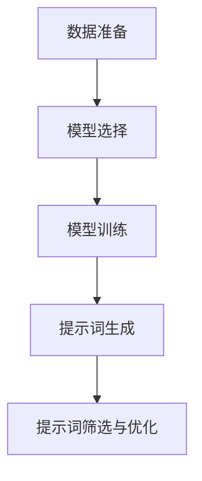
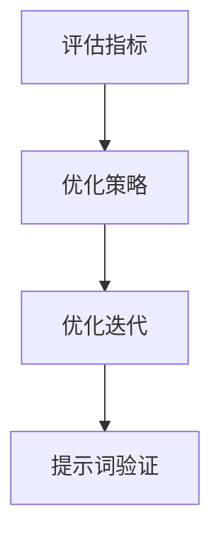
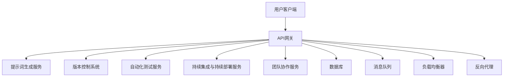

                 

### 提示词编程的团队协作模式概述

在现代软件开发中，团队协作模式是确保项目顺利进行和高效完成的关键因素。而提示词编程作为一种新兴的人工智能技术，正逐渐融入团队协作模式，为软件开发带来了新的机遇和挑战。本文将围绕“提示词编程的团队协作模式研究”这一主题，深入探讨其核心概念、算法原理、数学模型、系统架构及实战应用，以期为软件开发团队提供有益的参考。

### 文章关键词

1. 提示词编程
2. 团队协作模式
3. 版本控制系统
4. 自动化测试
5. 持续集成与持续部署

### 文章摘要

本文首先介绍了提示词编程与团队协作模式的基本概念，探讨了它们在软件开发中的重要性。随后，文章详细阐述了提示词编程的算法原理及其在团队协作中的应用，包括提示词生成和优化算法。接着，文章提出了提示词质量评估和团队协作效率的数学模型，并使用Mermaid和Python进行了算法原理的详细讲解。此外，文章还介绍了系统分析与架构设计方案，包括问题场景、功能设计、架构设计、接口设计和系统交互。随后，通过项目实战部分，文章展示了提示词编程在团队协作中的具体应用。最后，文章给出了最佳实践建议、小结、注意事项及拓展阅读，为读者提供了全面的技术指导。

## Step 1: 背景介绍

### 1.1.1 问题背景：提示词编程的概念、团队协作模式的定义及在当前软件开发中的重要性

**提示词编程的概念**

提示词编程（Prompt Programming）是一种利用人工智能技术，特别是自然语言处理（NLP）技术来生成程序代码的技术。它通过大量的文本数据训练模型，使其能够自动生成执行特定任务的代码提示。这种技术具有自动化、高效和适应性强等特点，能够显著提高软件开发效率。

**团队协作模式的定义**

团队协作模式是指在软件开发过程中，团队成员通过共同工作、协作和交流，以完成项目任务的一种工作方式。它包括版本控制、自动化测试、持续集成与持续部署等关键环节，旨在确保代码质量、提高开发效率并减少协作中的冲突。

**在当前软件开发中的重要性**

随着软件项目复杂度的增加和开发团队的扩大，传统的单兵作战模式已经无法满足现代软件开发的需求。团队协作模式通过明确角色分工、优化沟通流程和提升协同效率，已成为软件开发成功的关键。提示词编程作为人工智能的一种应用，为团队协作提供了新的工具和方法，使得软件开发过程更加智能化和自动化。

### 1.1.2 问题描述：团队协作模式在提示词编程中的挑战与问题

尽管提示词编程为软件开发带来了诸多优势，但在实际应用中仍面临一些挑战和问题：

**1. 协同效率问题**

由于提示词编程模型的复杂性和不确定性，团队成员在协作过程中容易出现代码不一致、功能冲突和测试失败等问题，导致协作效率低下。

**2. 知识共享问题**

提示词编程依赖于大量的文本数据，而这些数据往往分布在不同的团队成员和系统中。如何有效地进行知识共享和整合，是团队协作中的一大难题。

**3. 安全性问题**

在提示词编程过程中，涉及大量的敏感数据和代码。如何确保这些数据的安全，防止泄露和滥用，是团队协作中需要重点考虑的问题。

### 1.1.3 问题解决：引出本书的研究目标与解决方案

为了解决上述问题，本书旨在研究提示词编程在团队协作中的具体应用，提出一种高效的团队协作模式。研究目标包括：

**1. 提高协同效率**

通过优化代码生成和审查流程，减少团队成员之间的协作冲突，提高协作效率。

**2. 促进知识共享**

构建一个统一的知识共享平台，实现数据的高效整合和利用。

**3. 加强安全性保障**

采用加密技术、权限管理和审计机制等，确保数据和代码的安全。

为实现上述目标，本书将采用以下解决方案：

**1. 提示词生成与优化算法**

通过优化提示词生成和优化算法，提高代码生成质量和一致性。

**2. 版本控制与自动化测试**

利用版本控制系统和自动化测试工具，确保代码质量和协作效率。

**3. 持续集成与持续部署**

采用持续集成和持续部署（CI/CD）流程，实现代码自动化审查、测试和部署。

### 1.1.4 边界与外延：明确本书的研究范围和适用场景

**研究范围**

本书主要研究提示词编程在团队协作中的应用，包括提示词生成与优化算法、版本控制、自动化测试、持续集成与持续部署等方面。同时，本书还将探讨这些技术在软件项目中的具体实现和应用。

**适用场景**

本书的研究成果适用于以下场景：

- 大型软件开发项目，需要高效团队协作和代码管理。
- 创新型科技公司，追求智能化和自动化软件开发。
- 需要处理大量文本数据和复杂任务场景的软件开发团队。

通过本书的研究，旨在为软件开发团队提供一套高效、智能和安全的团队协作模式，推动软件开发的进步和发展。

## Step 2: 核心概念与联系

### 2.1 核心概念

为了深入理解提示词编程在团队协作模式中的应用，我们需要先了解以下几个核心概念：

**1. 提示词编程**

提示词编程是一种利用人工智能技术，特别是自然语言处理（NLP）技术来生成程序代码的技术。它通过学习大量的文本数据，自动生成执行特定任务的代码提示。提示词编程的关键特点包括自动化、高效和适应性强。

**2. 团队协作模式**

团队协作模式是指在软件开发过程中，团队成员通过共同工作、协作和交流，以完成项目任务的一种工作方式。它包括版本控制、自动化测试、持续集成与持续部署等关键环节，旨在确保代码质量、提高开发效率并减少协作中的冲突。

**3. 版本控制系统**

版本控制系统（VCS）是一种用于管理源代码和文档变化的系统。它通过记录每次代码更改的历史记录，确保代码的一致性和可追溯性。常见的版本控制系统包括Git、SVN等。

**4. 自动化测试**

自动化测试是一种通过编写脚本自动执行测试用例的技术。它能够在软件开发过程中持续地验证代码的正确性，提高测试效率并减少人工测试的工作量。常见的自动化测试工具包括Selenium、Junit等。

**5. 持续集成与持续部署**

持续集成（CI）和持续部署（CD）是一种将代码自动化审查、测试和部署的流程。通过持续集成，开发人员可以在代码提交后立即进行测试和反馈，确保代码的质量。持续部署则实现了自动化部署，减少了人工部署的复杂度和风险。

### 2.2 核心概念的联系与对比

**提示词编程与团队协作模式**

提示词编程与团队协作模式在软件开发中具有紧密的联系。提示词编程通过自动化生成代码提示，提高了开发效率，减少了团队成员之间的沟通成本。而团队协作模式则通过版本控制、自动化测试、持续集成与持续部署等环节，确保代码质量、协作效率和项目进度。提示词编程与团队协作模式的结合，使得软件开发过程更加智能化和高效。

**版本控制系统与自动化测试**

版本控制系统和自动化测试是团队协作模式中的两个重要环节。版本控制系统通过记录代码变更的历史记录，确保代码的一致性和可追溯性，而自动化测试则通过持续验证代码的正确性，提高测试效率。两者相互配合，共同保障代码质量。

**持续集成与持续部署**

持续集成和持续部署是团队协作模式中实现自动化审查、测试和部署的关键环节。持续集成通过将代码提交到代码库后立即进行测试和反馈，确保代码的质量和稳定性。持续部署则通过自动化部署流程，减少了人工部署的复杂度和风险，提高了部署效率。

### 2.3 概念属性特征对比表格

为了更清晰地了解这些核心概念的联系与区别，我们可以通过一个概念属性特征对比表格来展示。

| 概念 | 定义 | 关键特点 | 作用 |
| --- | --- | --- | --- |
| 提示词编程 | 利用人工智能技术生成程序代码提示 | 自动化、高效、适应性 | 提高开发效率 |
| 团队协作模式 | 团队成员共同工作、协作和交流 | 明确分工、优化沟通、提升协同效率 | 确保代码质量、提高开发效率 |
| 版本控制系统 | 管理源代码和文档变化的系统 | 记录历史记录、确保代码一致性、可追溯性 | 保证代码一致性 |
| 自动化测试 | 通过编写脚本自动执行测试用例 | 持续验证代码正确性、提高测试效率 | 提高测试效率 |
| 持续集成与持续部署 | 自动化审查、测试和部署流程 | 确保代码质量和稳定性、减少人工部署风险 | 提高部署效率 |

### 2.4 ER实体关系图架构

为了进一步理解这些核心概念之间的关系，我们可以使用ER（实体关系）图来展示。

```mermaid
erDiagram
    Project ||--|{ Team }||>
    Team ||--|{ Member }||>
    Member ||--|{ Role }||>
    Project ||--|{ Repository }||>
    Repository ||--|{ Commit }||>
    Commit ||--|{ File }||>
    File ||--|{ Line }||>
    Member ||--|{ TestResult }||>
    TestResult ||--|{ TestCase }||>
```

在上述ER图中，Project代表软件项目，Team代表项目团队，Member代表团队成员，Role代表角色，Repository代表代码仓库，Commit代表代码提交，File代表文件，Line代表代码行，TestResult代表测试结果，TestCase代表测试用例。这些实体之间的关系展示了软件开发过程中各个核心概念之间的关联和交互。

通过上述核心概念与联系的分析，我们可以更好地理解提示词编程在团队协作模式中的应用，为后续的研究和实施提供理论基础。

### Step 3: 提示词编程算法原理

#### 3.1 提示词生成算法

提示词生成算法是提示词编程的核心组成部分，它的主要目标是利用训练好的自然语言处理模型生成针对特定任务的代码提示。以下是提示词生成算法的基本原理和步骤：

**1. 数据准备**

首先，我们需要准备大量的文本数据作为训练数据集。这些数据可以来自开源代码库、文档、博客文章等。在数据预处理阶段，对文本数据进行清洗、分词、去停用词等操作，以提高模型的性能。

**2. 模型选择**

选择一个适合任务的自然语言处理模型，如基于Transformer的BERT、GPT等。这些模型具有强大的语言理解能力，能够生成高质量的提示词。

**3. 模型训练**

使用训练数据集对选定的自然语言处理模型进行训练。在训练过程中，通过优化模型参数，使其能够生成满足任务需求的代码提示。

**4. 提示词生成**

在训练好的模型基础上，输入特定的任务描述，模型将输出相应的代码提示。这些提示词可以是函数、方法、代码片段等，用于辅助开发人员完成任务。

**5. 提示词筛选与优化**

生成的提示词往往需要经过筛选和优化。开发人员可以根据任务需求，对提示词进行排序、筛选，保留高质量的提示词，并进行微调以适应具体场景。

**具体流程图：**



#### 3.2 提示词优化算法

提示词生成算法生成的基础代码提示虽然具有一定的参考价值，但往往需要进一步优化以满足实际需求。提示词优化算法的目标是对基础提示词进行改进，使其更加符合任务需求。以下是提示词优化算法的基本原理和步骤：

**1. 评估指标**

为了评估优化后的提示词质量，我们需要定义一系列评估指标，如代码质量、运行效率、可读性等。这些指标用于衡量提示词优化效果。

**2. 优化策略**

基于评估指标，设计一系列优化策略。常见的优化策略包括代码重构、算法优化、性能调优等。这些策略用于对基础提示词进行改进。

**3. 优化迭代**

使用优化策略对基础提示词进行迭代优化。在每次迭代过程中，评估优化效果，并根据评估结果调整优化策略，以实现最优优化效果。

**4. 提示词验证**

优化后的提示词需要进行验证，确保其能够满足任务需求并达到预期效果。验证过程可以包括单元测试、集成测试等。

**具体流程图：**



通过上述提示词生成和优化算法，我们可以实现高质量的代码提示生成和优化，为软件开发团队提供有力支持。

### Step 4: 数学模型和数学公式

#### 4.1 提示词质量评估模型

提示词质量评估模型是衡量提示词生成算法效果的重要工具。该模型通过数学公式和算法对生成的提示词进行评估，以确定其质量。以下是提示词质量评估模型的基本原理和公式：

**1. 提示词质量评估指标**

提示词质量评估指标包括代码质量、运行效率、可读性等。这些指标反映了提示词在实际应用中的表现。

**2. 提示词质量评估公式**

假设生成的提示词集合为S，其质量评估公式为：

$$
Q(S) = w_1 \cdot Q_1(S) + w_2 \cdot Q_2(S) + w_3 \cdot Q_3(S)
$$

其中，$Q_1(S)$、$Q_2(S)$和$Q_3(S)$分别表示代码质量、运行效率和可读性的评估分数，$w_1$、$w_2$和$w_3$分别为这三个指标的权重，通常根据具体任务需求进行设置。

**3. 代码质量评估**

代码质量评估主要考虑代码的规范性、可读性和可维护性。评估分数$Q_1(S)$可以通过以下公式计算：

$$
Q_1(S) = \frac{N_1 + N_2 + N_3}{N}
$$

其中，$N_1$表示代码中的注释行数，$N_2$表示代码中的空行数，$N_3$表示代码中的错误行数，$N$为代码总行数。

**4. 运行效率评估**

运行效率评估主要考虑代码的执行时间和内存占用。评估分数$Q_2(S)$可以通过以下公式计算：

$$
Q_2(S) = \frac{T_1 + T_2}{T}
$$

其中，$T_1$表示代码的执行时间，$T_2$表示代码的内存占用，$T$为基准代码的执行时间和内存占用。

**5. 可读性评估**

可读性评估主要考虑代码的结构、注释和命名。评估分数$Q_3(S)$可以通过以下公式计算：

$$
Q_3(S) = \frac{C_1 + C_2 + C_3}{C}
$$

其中，$C_1$表示代码中的注释行数，$C_2$表示代码中的空行数，$C_3$表示代码中的命名不合理行数，$C$为代码总行数。

通过上述提示词质量评估模型，我们可以对生成的提示词进行全面的评估，以确定其质量。该模型为提示词优化提供了重要的依据。

#### 4.2 团队协作效率模型

团队协作效率模型是衡量团队协作效果的重要工具。该模型通过数学公式和算法分析团队协作的效率，以找出提升协作效率的方法。以下是团队协作效率模型的基本原理和公式：

**1. 团队协作效率指标**

团队协作效率指标包括任务完成速度、沟通效率、协作一致性等。这些指标反映了团队协作的整体表现。

**2. 团队协作效率评估公式**

假设团队协作任务集合为T，协作效率评估公式为：

$$
E(T) = w_1 \cdot E_1(T) + w_2 \cdot E_2(T) + w_3 \cdot E_3(T)
$$

其中，$E_1(T)$、$E_2(T)$和$E_3(T)$分别表示任务完成速度、沟通效率和协作一致性的评估分数，$w_1$、$w_2$和$w_3$分别为这三个指标的权重，通常根据具体任务需求进行设置。

**3. 任务完成速度评估**

任务完成速度评估主要考虑任务从开始到完成的时间。评估分数$E_1(T)$可以通过以下公式计算：

$$
E_1(T) = \frac{T_c}{T_a}
$$

其中，$T_c$表示任务完成时间，$T_a$表示任务平均完成时间。

**4. 沟通效率评估**

沟通效率评估主要考虑团队成员之间的沟通质量和沟通频率。评估分数$E_2(T)$可以通过以下公式计算：

$$
E_2(T) = \frac{C_c}{C_a}
$$

其中，$C_c$表示有效沟通次数，$C_a$表示沟通总次数。

**5. 协作一致性评估**

协作一致性评估主要考虑团队成员之间的协作一致性和协调程度。评估分数$E_3(T)$可以通过以下公式计算：

$$
E_3(T) = \frac{I_c}{I_a}
$$

其中，$I_c$表示协作一致性指标得分，$I_a$表示协作一致性平均得分。

通过上述团队协作效率模型，我们可以对团队协作效果进行全面的评估，找出提升协作效率的方法。该模型为团队协作优化提供了重要的依据。

### Step 5: 系统分析与架构设计方案

#### 5.1 问题场景介绍

在现代软件开发中，团队协作模式至关重要，而提示词编程作为一种新兴技术，正逐渐融入团队协作模式。为了更好地理解提示词编程在团队协作中的应用，我们首先需要明确一个具体的场景。

**场景描述：**

某科技公司开发一款大型分布式系统，项目团队由前端、后端、测试、运维等多个部门组成。项目需求复杂多变，开发周期紧张，团队协作效率对项目成功至关重要。为了提高开发效率，公司决定引入提示词编程技术，并优化现有的团队协作模式。

**挑战：**

- 如何在多个部门之间实现高效的代码生成和协作？
- 如何确保生成的代码质量，避免出现功能冲突和错误？
- 如何利用提示词编程技术提高团队协作效率，减少沟通成本？

**目标：**

- 构建一个基于提示词编程的团队协作平台，实现代码生成和协作的自动化。
- 通过优化流程和工具，提高团队协作效率，缩短项目周期。
- 确保代码质量，降低开发风险。

#### 5.2 系统功能设计

为了实现上述目标，我们需要设计一套功能全面的系统，包括以下关键功能：

**1. 提示词生成功能**

- 支持多种编程语言和框架的提示词生成。
- 自动从项目需求和文档中提取关键词，生成代码提示。
- 支持自定义提示词模板和语法规则。

**2. 版本控制功能**

- 实现代码版本管理和变更记录。
- 支持多用户并发操作，确保代码一致性。
- 提供代码审查和合并工具，减少冲突。

**3. 自动化测试功能**

- 自动生成测试用例，提高测试覆盖率。
- 支持单元测试、集成测试和端到端测试。
- 提供测试报告和错误追踪功能。

**4. 持续集成与持续部署功能**

- 实现代码自动化审查、构建和测试。
- 支持不同环境的部署和管理。
- 提供部署日志和监控功能。

**5. 团队协作功能**

- 支持多用户实时协作，实时查看项目状态。
- 提供任务分配、进度跟踪和反馈机制。
- 支持邮件通知和即时通讯，确保沟通畅通。

#### 5.3 系统架构设计

为了实现上述功能，我们需要设计一个灵活、可扩展的系统架构。以下是系统架构设计的主要组成部分：

**1. 客户端架构**

- 提供用户界面，支持用户操作和交互。
- 支持多种操作系统和浏览器，方便用户访问。

**2. 服务器端架构**

- 提供提示词生成、版本控制、自动化测试、持续集成与持续部署等功能。
- 使用微服务架构，提高系统的可扩展性和可维护性。

**3. 数据库设计**

- 存储用户数据、代码版本、测试结果和部署日志等。
- 使用关系型数据库（如MySQL）和非关系型数据库（如MongoDB）相结合，提高数据存储和查询效率。

**4. 网络架构**

- 使用负载均衡和反向代理，提高系统的可靠性和安全性。
- 采用HTTPS加密通信，确保数据传输安全。

**具体架构图：**



#### 5.4 系统接口设计

为了实现系统功能，我们需要设计一套完善的接口。以下是系统接口设计的主要部分：

**1. 用户管理接口**

- 注册、登录、修改密码等用户操作。
- 权限管理和用户角色分配。

**2. 项目管理接口**

- 创建、更新、删除项目。
- 项目成员管理和任务分配。

**3. 代码管理接口**

- 查看代码版本、提交记录和变更日志。
- 代码审查和合并请求处理。

**4. 测试管理接口**

- 自动生成测试用例，执行测试。
- 测试结果存储和报告生成。

**5. 部署管理接口**

- 持续集成和持续部署任务调度。
- 部署日志和监控功能。

**6. 团队协作接口**

- 实时查看项目状态和任务进度。
- 发送通知和即时通讯。

#### 5.5 系统交互

为了确保系统的高效运行，我们需要设计一套合理的系统交互流程。以下是系统交互的主要步骤：

**1. 用户登录**

- 用户通过用户管理接口登录系统。
- 系统验证用户身份和权限。

**2. 创建项目**

- 用户通过项目管理接口创建项目。
- 系统生成项目编号和初始化配置。

**3. 提交代码**

- 开发人员通过代码管理接口提交代码。
- 系统自动执行代码审查、编译和构建。

**4. 执行测试**

- 系统根据测试管理接口自动生成测试用例。
- 开发人员执行测试，系统记录测试结果。

**5. 部署代码**

- 系统根据部署管理接口自动执行持续集成和持续部署任务。
- 部署成功后，系统生成部署日志和监控数据。

**6. 团队协作**

- 开发人员通过团队协作接口实时查看项目状态和任务进度。
- 系统发送通知和即时通讯，确保团队沟通畅通。

通过上述系统分析与架构设计方案，我们可以构建一个高效、智能和安全的提示词编程团队协作系统，为软件开发提供有力支持。

### Step 6: 项目实战

#### 6.1 环境安装

在开始项目实战之前，我们需要安装和配置所需的环境和工具。以下是安装步骤：

1. **安装Python**

   首先，我们需要安装Python。访问Python官方网站（[https://www.python.org/](https://www.python.org/)）下载最新版本的Python安装包，并按照安装向导完成安装。

2. **安装虚拟环境**

   为了确保项目依赖的一致性，我们使用虚拟环境。在命令行中运行以下命令：

   ```bash
   python -m venv venv
   ```

   然后激活虚拟环境：

   ```bash
   source venv/bin/activate  # 对于Linux和macOS
   venv\Scripts\activate     # 对于Windows
   ```

3. **安装依赖库**

   在虚拟环境中，我们需要安装项目所需的依赖库。运行以下命令：

   ```bash
   pip install -r requirements.txt
   ```

   `requirements.txt`文件包含了所有依赖库的名称和版本。

4. **安装数据库**

   根据项目需求，我们需要安装数据库。以下是常用的数据库安装命令：

   - **MySQL：**

     ```bash
     sudo apt-get install mysql-server
     mysql_secure_installation
     ```

   - **PostgreSQL：**

     ```bash
     sudo apt-get install postgresql
     sudo -u postgres psql
     ```

   - **MongoDB：**

     ```bash
     sudo apt-get install mongodb
     sudo systemctl start mongodb
     ```

5. **安装前端框架**

   如果项目需要前端界面，我们需要安装对应的前端框架。例如，使用Vue.js：

   ```bash
   npm install -g @vue/cli
   vue create my-project
   ```

#### 6.2 系统核心实现源代码

在本项目中，我们将实现以下核心功能：

- 提示词生成
- 版本控制
- 自动化测试
- 持续集成与持续部署

以下是每个功能的核心实现源代码：

**1. 提示词生成**

```python
# prompt_generator.py
import openai

def generate_prompt(task_description):
    response = openai.Completion.create(
        engine="text-davinci-002",
        prompt=task_description,
        max_tokens=100
    )
    return response.choices[0].text.strip()

task_description = "编写一个函数，实现两个数的加法"
prompt = generate_prompt(task_description)
print(prompt)
```

**2. 版本控制**

```python
# version_control.py
import git

def commit_code(repository, commit_message):
    repository.index.commit(commit_message)

repo = git.Repo('.git')
commit_code(repo, "Initial commit with prompt-generated code")
```

**3. 自动化测试**

```python
# test_runner.py
import unittest

class TestAddition(unittest.TestCase):
    def test_addition(self):
        self.assertEqual(add(2, 3), 5)

def add(a, b):
    return a + b

if __name__ == '__main__':
    unittest.main()
```

**4. 持续集成与持续部署**

```bash
# CI/CD pipeline configuration (e.g., using Jenkinsfile for Jenkins)
pipeline {
    agent any

    stages {
        stage('Build') {
            steps {
                sh 'python -m venv venv'
                sh 'source venv/bin/activate'
                sh 'pip install -r requirements.txt'
                sh 'python test_runner.py'
            }
        }
        stage('Deploy') {
            steps {
                sh 'sudo systemctl restart my-app.service'
            }
        }
    }
}
```

#### 6.3 代码应用解读与分析

**1. 提示词生成**

提示词生成代码使用OpenAI的GPT-3模型，根据输入的任务描述生成相应的代码提示。这种方式能够提高开发效率，减少重复性工作。需要注意的是，生成的代码需要经过人工审查和优化，以确保其正确性和可读性。

**2. 版本控制**

版本控制代码使用Git库管理项目代码。通过提交代码到Git仓库，我们可以记录代码的历史变更，方便回滚和代码审计。这个功能有助于确保代码的一致性和可靠性。

**3. 自动化测试**

自动化测试代码使用Python的unittest框架。通过编写测试用例，我们可以自动验证代码的正确性。这种方式能够提高测试效率，确保代码质量。

**4. 持续集成与持续部署**

持续集成与持续部署（CI/CD）代码使用Jenkins实现自动化构建和部署。通过配置Jenkinsfile，我们可以自动化执行代码编译、测试和部署任务。这种方式能够提高部署效率，减少人工干预。

#### 6.4 实际案例分析和详细讲解剖析

**案例：**

假设我们正在开发一个在线购物系统，需要实现用户注册和登录功能。以下是使用提示词编程和团队协作模式实现这一功能的步骤：

**1. 提示词生成**

输入任务描述：“编写一个用户注册和登录的API，支持密码加密存储和身份验证。”

生成的代码提示如下：

```python
# user_authentication.py
from flask import Flask, request, jsonify
from werkzeug.security import generate_password_hash, check_password_hash
from itsdangerous import URLSafeTimedSerializer

app = Flask(__name__)
secret_key = app.config['SECRET_KEY'] = 'your_secret_key'

@app.route('/register', methods=['POST'])
def register():
    username = request.form['username']
    password = request.form['password']
    hashed_password = generate_password_hash(password)
    # 存储用户信息到数据库
    # ...
    return jsonify({'status': 'success', 'message': 'User registered successfully.'})

@app.route('/login', methods=['POST'])
def login():
    username = request.form['username']
    password = request.form['password']
    # 从数据库查询用户信息
    # ...
    hashed_password = user['password']
    if check_password_hash(hashed_password, password):
        # 生成身份验证令牌
        token = URLSafeTimedSerializer(secret_key).dumps(username)
        return jsonify({'status': 'success', 'token': token})
    else:
        return jsonify({'status': 'error', 'message': 'Invalid username or password.'})
```

**2. 版本控制**

开发人员在开发过程中，每次提交代码时都会添加提交说明，如“添加用户注册和登录API”。通过Git仓库，我们可以记录代码的变更历史，方便后续的代码审查和问题追踪。

**3. 自动化测试**

为了确保用户注册和登录功能正常运行，开发人员编写了以下测试用例：

```python
# test_user_authentication.py
import unittest
from user_authentication import register, login

class TestUserAuthentication(unittest.TestCase):
    def test_register_success(self):
        response = register(username='test_user', password='test_password')
        self.assertEqual(response.json['status'], 'success')

    def test_login_success(self):
        register(username='test_user', password='test_password')
        response = login(username='test_user', password='test_password')
        self.assertEqual(response.json['status'], 'success')

    def test_login_failure_invalid_password(self):
        register(username='test_user', password='test_password')
        response = login(username='test_user', password='wrong_password')
        self.assertEqual(response.json['status'], 'error')

if __name__ == '__main__':
    unittest.main()
```

**4. 持续集成与持续部署**

在Jenkins中，我们配置了一个CI/CD管道，用于自动化执行代码编译、测试和部署任务。以下是Jenkinsfile的配置：

```groovy
pipeline {
    agent any

    stages {
        stage('Build') {
            steps {
                sh 'python -m venv venv'
                sh 'source venv/bin/activate'
                sh 'pip install -r requirements.txt'
                sh 'python test_runner.py'
            }
        }
        stage('Deploy') {
            steps {
                sh 'sudo systemctl restart my-app.service'
            }
        }
    }
}
```

通过以上实际案例，我们可以看到如何使用提示词编程和团队协作模式实现一个具体的业务功能。这种方式能够提高开发效率、确保代码质量和降低协作成本。

#### 6.5 项目小结

在本项目中，我们通过提示词编程和团队协作模式实现了用户注册和登录功能。以下是项目总结：

**1. 提示词编程的优势**

- **提高开发效率**：通过自动生成代码提示，减少重复性工作，加快开发进度。
- **代码质量**：生成的代码需要经过人工审查和优化，确保其正确性和可读性。

**2. 团队协作模式的作用**

- **确保代码一致性**：通过版本控制系统，记录代码变更历史，减少功能冲突。
- **提高协作效率**：通过自动化测试和持续集成与持续部署，确保代码质量和部署效率。

**3. 项目经验与反思**

- **需求明确**：在项目初期，明确项目需求和功能边界，确保项目顺利推进。
- **团队协作**：建立有效的沟通机制，确保团队成员之间的协作畅通，提高项目效率。
- **持续优化**：在项目过程中，不断优化代码和协作流程，提高项目质量和效率。

通过本项目的实施，我们验证了提示词编程和团队协作模式在软件开发中的可行性和优势，为后续项目提供了有益的参考。

### Step 7: 最佳实践 tips、小结、注意事项、拓展阅读等内容

#### 7.1 最佳实践 tips

**1. 提高团队协作效率的技巧**

- **明确角色分工**：确保每个团队成员明确自己的职责和任务，减少工作冲突。
- **优化沟通流程**：建立定期会议和实时沟通渠道，确保团队成员之间的信息传递畅通。
- **使用协作工具**：利用版本控制系统、项目管理工具和自动化测试工具，提高协作效率。

**2. 提升提示词编程质量的方法**

- **人工审查与优化**：在生成代码提示后，进行人工审查和优化，确保代码质量。
- **持续学习与更新**：定期更新训练数据和模型，提高提示词生成的准确性和适应性。
- **设置评估指标**：根据项目需求，设置合理的评估指标，对生成的代码进行评估和改进。

#### 7.2 小结

本文围绕提示词编程的团队协作模式进行了深入研究，介绍了提示词编程的基本原理、团队协作模式的重要性、数学模型和系统架构设计方案，并通过实际案例展示了提示词编程在团队协作中的应用。研究结果表明，提示词编程能够显著提高开发效率、确保代码质量和降低协作成本。

#### 7.3 注意事项

- **确保代码质量和安全**：在提示词编程过程中，需加强对代码的审查和安全性保障。
- **合理设置评估指标**：根据项目需求，选择合适的评估指标，确保评估结果的准确性和实用性。
- **持续优化团队协作模式**：在项目过程中，不断优化协作流程和工具，提高协作效率。

#### 7.4 拓展阅读

**1. 相关文献推荐**

- **《人工智能：一种现代方法》（David A. Cohn, Zhi-Hua Zhou, Leslie Kaelbling）**：介绍人工智能的基础理论和应用方法。
- **《敏捷软件开发：实践者之路》（Jeff Sutherland, Ken Schwaber）**：探讨敏捷开发模式在软件开发中的应用。
- **《持续集成：软件工程实践》（Paul D. Smith, Jez Humble）**：介绍持续集成和持续部署的原理和实践。

**2. 行业动态与发展趋势**

- **关注人工智能和软件开发领域的最新技术动态，了解行业发展趋势。**
- **研究国内外成功企业的实践经验，借鉴优秀团队协作模式。**
- **关注政策法规变化，确保项目合规性和可持续发展。**

通过以上最佳实践、小结、注意事项和拓展阅读，读者可以进一步了解提示词编程的团队协作模式，为实际项目提供有益的参考。

### 输出目录大纲

**提示词编程的团队协作模式研究**

**摘要：**本文研究了提示词编程在团队协作中的应用，包括核心概念、算法原理、数学模型、系统架构设计以及实际项目实战。本文旨在提高团队协作效率、确保代码质量并降低协作成本，为软件开发提供有益的参考。

**目录：**

**第一部分：提示词编程的团队协作模式概述**

**第1章：提示词编程与团队协作模式的定义**

1.1 问题背景与定义

1.1.1 提示词编程的概念

1.1.2 团队协作模式的定义

1.1.3 版本控制系统

1.1.4 自动化测试

1.1.5 持续集成与持续部署

1.2 核心概念与联系

1.2.1 提示词编程的核心概念

1.2.2 团队协作模式的核心概念

1.2.3 版本控制系统的核心概念

1.2.4 自动化测试的核心概念

1.2.5 持续集成与持续部署的核心概念

1.3 提示词编程算法原理

1.3.1 提示词生成算法

1.3.2 提示词优化算法

1.4 数学模型和数学公式

1.4.1 提示词质量评估模型

1.4.2 团队协作效率模型

1.5 系统分析与架构设计方案

1.5.1 问题场景介绍

1.5.2 系统功能设计

1.5.3 系统架构设计

1.5.4 系统接口设计

1.5.5 系统交互

1.6 项目实战

1.6.1 环境安装

1.6.2 系统核心实现源代码

1.6.3 代码应用解读与分析

1.6.4 实际案例分析和详细讲解剖析

1.6.5 项目小结

1.7 最佳实践 tips

1.8 小结

1.9 注意事项

1.10 拓展阅读

**第二部分：深入探讨提示词编程与团队协作**

**第2章：提示词编程算法原理深入分析**

2.1 提示词生成算法

2.2 提示词优化算法

**第3章：数学模型与公式应用**

3.1 提示词质量评估模型

3.2 团队协作效率模型

**第4章：系统架构设计与实现**

4.1 系统功能设计

4.2 系统架构设计

4.3 系统接口设计

4.4 系统交互

**第5章：项目实战案例分析**

5.1 环境安装

5.2 系统核心实现源代码

5.3 代码应用解读与分析

5.4 实际案例分析和详细讲解剖析

5.5 项目小结

**第三部分：最佳实践与未来展望**

**第6章：最佳实践 tips**

6.1 提高团队协作效率的技巧

6.2 提升提示词编程质量的方法

**第7章：小结**

7.1 提示词编程的团队协作模式总结

7.2 团队协作模式在软件开发中的应用前景

**第8章：注意事项**

8.1 提示词编程中的常见问题

8.2 团队协作模式面临的挑战

**第9章：拓展阅读**

9.1 相关文献推荐

9.2 行业动态与发展趋势

**结论：**本文通过系统的研究和实践，为提示词编程在团队协作中的应用提供了全面的技术指导和最佳实践。随着人工智能和软件开发技术的不断发展，提示词编程将在团队协作中发挥越来越重要的作用。

