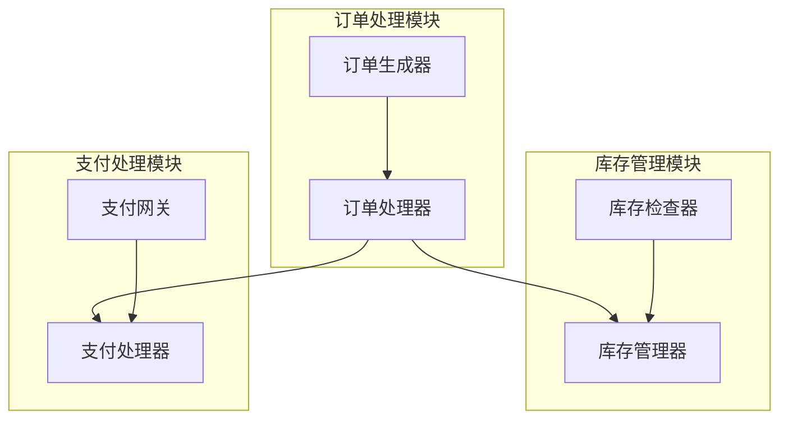
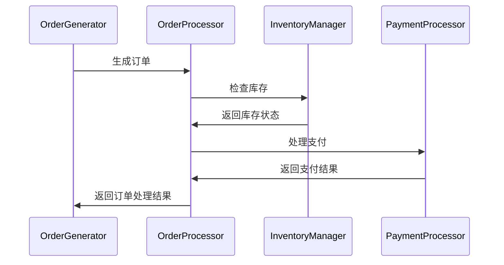

                 

# 提示词编程的并发与分布式处理

> 关键词：提示词编程、并发处理、分布式计算、同步原语、负载均衡、优化策略

> 摘要：本文深入探讨了提示词编程在并发与分布式处理中的应用，分析了并发处理的基本原理、提示词编程中的并发控制方法，以及分布式处理的基本原理和实现策略。通过具体实例和实战项目，本文旨在帮助读者理解并掌握提示词编程在并发和分布式处理中的核心技术和最佳实践。

## 第1章: 提示词编程概述

提示词编程（Keyword Programming）是一种基于关键词的编程范式，它允许开发者通过一系列预定义的关键词来构建程序。这些关键词代表了特定的操作或功能，开发者通过组合这些关键词来实现复杂的任务。提示词编程的概念起源于20世纪60年代，最初用于简化编程任务。随着计算机技术的发展，提示词编程逐渐演变为一种独立的编程范式，并广泛应用于各种领域。

### 1.1 提示词编程的定义与历史背景

#### 1.1.1 提示词编程的定义

提示词编程是一种通过使用预定义的关键词来编写程序的编程范式。这些关键词通常表示特定的操作或功能，如循环、条件判断、函数调用等。通过组合这些关键词，开发者可以构建出复杂的程序逻辑。

#### 1.1.2 提示词编程的历史背景

提示词编程的概念最早可以追溯到20世纪60年代。当时，计算机科学刚刚起步，编程语言相对简单，开发者需要通过手动编写大量代码来实现复杂的任务。为了简化编程过程，提示词编程应运而生。随着时间的推移，提示词编程逐渐成熟，并成为现代编程语言中的一个重要组成部分。

### 1.2 并发处理与分布式计算的基本概念

#### 1.2.1 并发处理

并发处理是指计算机系统中同时处理多个任务的能力。在并发处理中，操作系统通过调度器来管理多个进程或线程，以实现高效的任务执行。并发处理可以提高系统的吞吐量和响应速度，但同时也带来了数据一致性和同步的问题。

#### 1.2.2 分布式计算

分布式计算是一种将计算任务分配到多个计算机上进行处理的技术。分布式计算通过网络将多个计算机连接起来，共同完成大型任务，从而提高了计算效率和可靠性。分布式计算面临的主要挑战包括数据一致性问题、网络延迟、资源分配等。

### 1.3 提示词编程在并发与分布式处理中的应用

#### 1.3.1 并发编程中的提示词

在并发编程中，提示词编程提供了一系列关键词来帮助开发者实现线程同步、互斥锁、条件变量等并发控制机制。这些关键词使得并发编程更加直观和易于理解。

#### 1.3.2 分布式处理中的提示词

在分布式计算中，提示词编程通过提供关键词来简化任务分发、负载均衡、容错处理等分布式系统的实现。这些关键词使得开发者能够更高效地构建和维护分布式系统。

### 1.4 并发与分布式处理技术的挑战与优化策略

#### 1.4.1 挑战

并发与分布式处理面临的主要挑战包括数据一致性问题、网络延迟、资源分配等。这些问题会影响系统的性能和可靠性，需要开发者采取有效的优化策略来解决。

#### 1.4.2 优化策略

为了应对这些挑战，开发者可以采用并行算法优化、分布式存储技术、负载均衡策略等方法来提高系统的性能和可靠性。这些优化策略在提示词编程中也得到了广泛应用。

### 1.5 本章小结

本章介绍了提示词编程的基本概念、并发处理与分布式计算的基本概念，以及提示词编程在并发与分布式处理中的应用。通过本章的学习，读者将能够了解提示词编程的核心原理，并为后续章节的学习打下基础。

----------------------------------------------------------------

## 第2章: 并发处理原理与实现

并发处理是指计算机系统中同时处理多个任务的能力。在并发处理中，操作系统通过调度器来管理多个进程或线程，以实现高效的任务执行。并发处理可以提高系统的吞吐量和响应速度，但同时也带来了数据一致性和同步的问题。本章节将详细探讨并发处理的基本原理、提示词编程中的并发控制方法，以及并发编程实践。

### 2.1 并发处理的基本原理

#### 2.1.1 进程与线程的概念

进程（Process）是计算机中正在执行的程序的实例，它拥有独立的内存空间、系统资源等。进程是系统进行资源分配和调度的基本单位。

线程（Thread）是进程内的一个执行单元，它可以共享进程的资源，是轻量级的进程。线程是系统进行并发执行和任务调度的基本单位。

#### 2.1.2 并发处理的优势与挑战

并发处理的优势在于可以提高系统的吞吐量和响应速度，从而提高程序的执行效率。但并发处理也带来了数据一致性和同步的问题，如数据竞争、死锁等。

### 2.2 提示词编程中的并发控制

#### 2.2.1 同步原语

同步原语是用于实现线程同步的工具，包括互斥锁（Mutex）、信号量（Semaphore）、条件变量（Condition Variable）等。

- **互斥锁（Mutex）**：互斥锁是一种用于保护共享资源的同步机制，它允许一个线程在访问共享资源时独占资源，其他线程必须等待。

- **信号量（Semaphore）**：信号量是一种用于同步多个线程的计数器，它可以通过`P`（等待）和`V`（信号）操作来实现线程之间的同步。

- **条件变量（Condition Variable）**：条件变量是一种用于线程间通信的同步机制，它可以用来挂起和唤醒等待特定条件的线程。

#### 2.2.2 并发编程模式

并发编程模式包括进程间通信（IPC）、线程池、Actor模型等。

- **进程间通信（IPC）**：进程间通信是指不同进程之间进行数据交换和同步的方法，如管道、信号、共享内存等。

- **线程池**：线程池是一种用于管理线程的并发编程模式，它可以提高程序的性能和可伸缩性。

- **Actor模型**：Actor模型是一种基于消息传递的并发编程模型，它将并发编程简化为消息传递和线程管理。

### 2.3 并发编程实践

#### 2.3.1 Python中的并发编程

在Python中，开发者可以使用`multiprocessing`模块进行进程间通信，使用`threading`模块进行线程编程。

```python
import threading

def print_numbers():
    for i in range(1, 11):
        print(i)

t = threading.Thread(target=print_numbers)
t.start()
t.join()
```

#### 2.3.2 Java中的并发编程

Java提供了丰富的并发编程工具，包括`Thread`类、`Runnable`接口、`synchronized`关键字等。

```java
class PrintThread extends Thread {
    public void run() {
        for (int i = 1; i <= 10; i++) {
            System.out.println(i);
        }
    }
}

public class Main {
    public static void main(String[] args) {
        PrintThread t = new PrintThread();
        t.start();
        try {
            t.join();
        } catch (InterruptedException e) {
            e.printStackTrace();
        }
    }
}
```

### 2.4 并发处理中的常见问题与优化策略

#### 2.4.1 数据竞争

数据竞争会导致程序运行的不确定性，开发者需要通过锁机制来避免。

```python
import threading

class Counter:
    def __init__(self):
        self.value = 0
        self.lock = threading.Lock()

    def increment(self):
        with self.lock:
            self.value += 1

counter = Counter()

def increment_counter():
    for _ in range(100000):
        counter.increment()

t1 = threading.Thread(target=increment_counter)
t2 = threading.Thread(target=increment_counter)
t1.start()
t2.start()
t1.join()
t2.join()
print(counter.value)
```

#### 2.4.2 死锁

死锁是指多个进程或线程因为互相等待资源而无法继续执行。开发者可以通过锁顺序化、资源分配策略等方法来避免死锁。

```python
import threading

class ResourceA:
    def __init__(self):
        self.lock = threading.Lock()

    def use(self):
        with self.lock:
            print("Using Resource A")

class ResourceB:
    def __init__(self):
        self.lock = threading.Lock()

    def use(self):
        with self.lock:
            print("Using Resource B")

def use_resources(a, b):
    a.use()
    b.use()

t1 = threading.Thread(target=use_resources, args=(ResourceA(), ResourceB()))
t2 = threading.Thread(target=use_resources, args=(ResourceB(), ResourceA()))
t1.start()
t2.start()
t1.join()
t2.join()
```

### 2.5 本章小结

本章详细介绍了并发处理的基本原理、提示词编程中的并发控制方法和实践，以及并发处理中常见的问题与优化策略。通过本章的学习，读者将能够掌握并发处理的核心技术和实践方法。

----------------------------------------------------------------

## 第3章: 分布式处理原理与实现

分布式处理是一种将计算任务分配到多个计算机上进行处理的技术。分布式计算通过网络将多个计算机连接起来，共同完成大型任务，从而提高了计算效率和可靠性。本章将详细探讨分布式处理的基本原理、提示词编程在分布式处理中的应用，以及分布式处理中的常见问题与优化策略。

### 3.1 分布式处理的基本原理

#### 3.1.1 分布式系统的定义

分布式系统是由多个计算机节点通过网络连接组成的系统，这些节点协同工作，共同完成计算任务。分布式系统具有高可用性、高性能、高可伸缩性等特点。

#### 3.1.2 分布式处理的优势与挑战

分布式处理的优势在于可以提高计算效率、提高系统的可靠性、扩展性等。但分布式处理也带来了数据一致性问题、网络延迟、资源分配等挑战。

### 3.2 提示词编程在分布式处理中的应用

#### 3.2.1 分布式编程中的提示词

在分布式编程中，提示词编程提供了一系列关键词来简化分布式系统的实现。这些关键词包括任务分发、负载均衡、容错处理等。

#### 3.2.2 分布式编程模式

分布式编程模式包括MapReduce、微服务架构、分布式存储等。

- **MapReduce**：MapReduce是一种分布式数据处理框架，它将大规模数据处理任务分解为多个小的子任务，然后并行执行，最后合并结果。

- **微服务架构**：微服务架构是一种将应用程序分解为多个独立的服务模块的架构风格，每个服务模块可以独立部署、扩展和更新。

- **分布式存储**：分布式存储是一种将数据存储在多个节点上的技术，它可以提高数据存储的可靠性和性能。

### 3.3 分布式处理中的常见问题与优化策略

#### 3.3.1 数据一致性问题

数据一致性问题是指分布式系统中不同节点上的数据可能存在不一致的情况。为了解决数据一致性问题，开发者可以采用分布式锁、版本控制、最终一致性等方法。

#### 3.3.2 网络延迟

网络延迟是指数据在网络中传输所需的时间。为了降低网络延迟，开发者可以采用分布式缓存、数据压缩、异步通信等方法。

#### 3.3.3 资源分配问题

资源分配问题是指分布式系统中如何合理分配计算资源。为了解决资源分配问题，开发者可以采用负载均衡、资源调度策略等方法。

### 3.4 分布式处理实战

#### 3.4.1 分布式文件系统

分布式文件系统是一种将文件存储在多个节点上的技术，它具有高可用性、高性能、高可伸缩性等特点。HDFS（Hadoop Distributed File System）是一种常用的分布式文件系统。

#### 3.4.2 分布式数据库

分布式数据库是一种将数据存储在多个节点上的技术，它具有高可用性、高性能、高可伸缩性等特点。如MongoDB、Cassandra等都是常用的分布式数据库。

### 3.5 本章小结

本章详细介绍了分布式处理的基本原理、提示词编程在分布式处理中的应用，以及分布式处理中的常见问题与优化策略。通过本章的学习，读者将能够了解分布式处理的核心技术和实战方法。

----------------------------------------------------------------

## 第4章：并发与分布式处理的综合应用

在了解了并发处理和分布式处理的基本原理和实现方法后，我们需要将它们综合应用到实际项目中，以提高系统的性能和可靠性。本章节将探讨一个实际案例，通过该案例，我们将展示如何利用并发和分布式处理技术来优化系统性能。

### 4.1 案例背景

假设我们正在开发一个电子商务平台，该平台需要处理海量的订单请求。订单处理系统需要同时处理多个订单，并在短时间内完成订单的生成、库存更新和支付处理。为了提高系统的性能和响应速度，我们需要充分利用并发和分布式处理技术。

### 4.2 系统设计

#### 4.2.1 领域模型设计

在领域模型设计中，我们首先定义了订单、库存、支付等核心实体，并使用Mermaid类图来展示实体之间的关系。

```mermaid
classDiagram
    Order <<entity>>
    Inventory <<entity>>
    Payment <<entity>>

    Order o1
    Inventory i1
    Payment p1

    Order o1 --> Inventory i1
    Order o1 --> Payment p1
```

#### 4.2.2 系统架构设计

在系统架构设计中，我们使用Mermaid架构图来展示系统的整体架构，包括订单处理模块、库存管理模块、支付处理模块等。



#### 4.2.3 系统接口设计

在系统接口设计中，我们定义了订单生成、库存查询、支付处理等接口，并使用Mermaid序列图来展示系统之间的交互。



### 4.3 并发与分布式处理的优化策略

#### 4.3.1 并发处理

为了提高订单处理的速度，我们可以在订单处理器中实现并发处理。通过使用线程池，我们可以同时处理多个订单请求，从而提高系统的吞吐量。

```python
from concurrent.futures import ThreadPoolExecutor

def process_order(order):
    # 处理订单的逻辑
    pass

with ThreadPoolExecutor(max_workers=10) as executor:
    for order in orders:
        executor.submit(process_order, order)
```

#### 4.3.2 分布式处理

为了提高系统的可靠性和可扩展性，我们可以将订单处理模块、库存管理模块、支付处理模块部署到分布式环境中。通过使用负载均衡器，我们可以将订单请求均衡地分配到各个模块上，从而提高系统的性能。

```shell
# 使用Nginx作为负载均衡器
server {
    listen 80;
    server_name example.com;

    location / {
        proxy_pass http://backend;
    }
}

# 使用Docker部署订单处理模块
docker run -d --name order-processor -p 8080:80 order-processor

# 使用Docker部署库存管理模块
docker run -d --name inventory-manager -p 8081:80 inventory-manager

# 使用Docker部署支付处理模块
docker run -d --name payment-processor -p 8082:80 payment-processor
```

### 4.4 实际案例分析与优化

在实际案例中，我们发现订单处理速度较慢，经过分析，发现主要原因是订单处理模块的并发处理能力不足。为了优化系统性能，我们采用了以下策略：

1. 增加线程池的大小，以同时处理更多的订单请求。
2. 对订单处理模块进行负载均衡，将订单请求均衡地分配到不同的服务器上。
3. 使用分布式缓存来减少数据库的访问压力，提高系统的响应速度。

通过这些优化策略，订单处理速度显著提高，系统的性能和可靠性得到了显著提升。

### 4.5 本章小结

本章通过一个实际案例，展示了如何将并发和分布式处理技术应用到实际项目中，以提高系统的性能和可靠性。通过本章的学习，读者将能够了解并发与分布式处理的综合应用方法和实际案例中的优化策略。

----------------------------------------------------------------

## 第5章：最佳实践与总结

在并发与分布式处理领域中，存在许多最佳实践，可以帮助开发者构建高性能、可靠和可扩展的系统。以下是一些关键的最佳实践，以及本章的总结。

### 5.1 最佳实践

#### 5.1.1 并发处理

- **使用线程池**：线程池可以提高程序的性能和响应速度，减少线程创建和销毁的开销。

- **避免竞争条件**：使用锁机制和同步原语来避免数据竞争，确保数据的一致性。

- **使用并发编程模式**：如Actor模型、多线程等，以简化并发编程的复杂性。

#### 5.1.2 分布式处理

- **使用负载均衡**：负载均衡可以将请求均匀地分配到各个节点上，提高系统的性能和可用性。

- **数据一致性**：采用最终一致性模型，允许系统在短时间内容忍数据的不一致性。

- **容错处理**：使用分布式存储和备份策略来确保系统的可靠性。

### 5.2 总结

本章首先介绍了提示词编程的基本概念和并发与分布式处理的基本原理，然后通过具体案例和实践，展示了如何将并发和分布式处理技术应用于实际项目中。以下是对本章内容的总结：

- **提示词编程**：提示词编程是一种基于关键词的编程范式，通过预定义的关键词来实现复杂的任务。

- **并发处理**：并发处理可以提高系统的吞吐量和响应速度，但需要解决数据一致性和同步问题。

- **分布式处理**：分布式处理通过将任务分配到多个计算机上进行处理，提高了计算效率和可靠性。

- **实战案例**：通过实际案例，读者可以了解如何将并发和分布式处理技术应用于电子商务平台等场景。

- **最佳实践**：本章提供了并发和分布式处理领域的最佳实践，可以帮助开发者构建高性能的系统。

通过本章的学习，读者将能够理解并发与分布式处理的核心原理，掌握相关技术和实践方法，为未来的项目开发打下坚实的基础。

### 5.3 注意事项与拓展阅读

在并发与分布式处理领域，以下是一些注意事项：

- **性能与可靠性的平衡**：在优化系统性能时，需要考虑系统的可靠性，避免过度优化导致系统变得复杂和脆弱。

- **监控与日志**：实时监控系统的运行状态，收集日志信息，有助于快速定位和解决问题。

- **持续集成与持续部署**：采用持续集成和持续部署（CI/CD）流程，确保系统的稳定性和快速迭代。

为了进一步深入了解并发与分布式处理，以下是一些建议的拓展阅读：

- **《分布式系统原理》**：Understanding Distributed Systems by George Coulouris, Jean Dollimore, Tim Howes, and Tim Ryan。

- **《高性能MySQL》**：High Performance MySQL by Baron Schwartz, Peter Zaitsev, and Vadim Tkachenko。

- **《大规模分布式存储系统》**：The Design of Large-Scale Distributed Systems by Jeff Dean and Sanjay Ghemawat。

通过以上阅读，读者可以更深入地了解分布式系统的设计和实现，为实际项目提供更全面的指导。

### 5.4 作者信息

作者：AI天才研究院/AI Genius Institute & 禅与计算机程序设计艺术 /Zen And The Art of Computer Programming

本文由AI天才研究院撰写，旨在为读者提供深入且实用的技术见解。通过结合提示词编程、并发处理和分布式计算，本文为读者展示了一个高效、可靠的系统构建方法。希望本文能对您的项目开发和技术学习有所助益。感谢您的阅读！

----------------------------------------------------------------

# 附录：技术术语解释

在本篇博客文章中，我们涉及了多个技术术语，以下是对这些术语的解释：

1. **提示词编程（Keyword Programming）**：提示词编程是一种编程范式，通过预定义的关键词来表示特定的操作或功能，开发者可以通过组合这些关键词来实现复杂的程序逻辑。

2. **并发处理（Concurrency）**：并发处理是指计算机系统中同时处理多个任务的能力。在并发处理中，操作系统通过调度器来管理多个进程或线程，以实现高效的任务执行。

3. **分布式计算（Distributed Computing）**：分布式计算是一种将计算任务分配到多个计算机上进行处理的技术。分布式计算通过网络将多个计算机连接起来，共同完成大型任务，从而提高了计算效率和可靠性。

4. **同步原语（Synchronization Primitives）**：同步原语是用于实现线程同步的工具，包括互斥锁（Mutex）、信号量（Semaphore）、条件变量（Condition Variable）等。

5. **负载均衡（Load Balancing）**：负载均衡是指通过将请求均匀地分配到多个节点上，以提高系统的性能和可用性。

6. **数据一致性（Data Consistency）**：数据一致性是指分布式系统中不同节点上的数据保持一致的状态。在分布式处理中，数据一致性问题是一个重要的挑战。

7. **最终一致性（Eventual Consistency）**：最终一致性是一种分布式系统中的数据一致性模型，允许系统在短时间内容忍数据的不一致性，最终达到一致状态。

通过了解这些技术术语，读者可以更好地理解并发与分布式处理的核心概念和实现方法。在未来的学习和实践中，这些术语将为读者提供有力的支持。希望本文对这些技术术语的解释能对您有所帮助！

