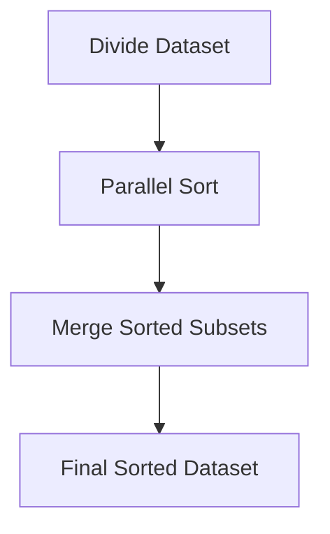
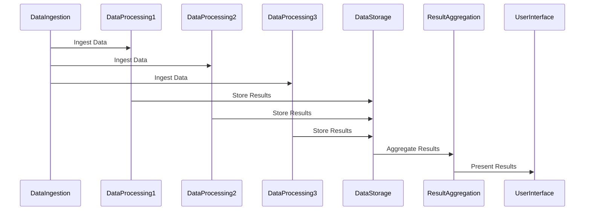
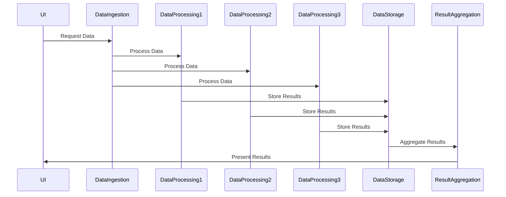

                 

### Introduction: The Significance and Basics of Parallel Processing Technology in Prompt-Based Programming

Parallel processing technology has become an indispensable component in modern computing systems, especially in the realm of prompt-based programming. At its core, parallel processing involves the simultaneous execution of multiple tasks or instructions, leveraging multiple processing units to enhance computational efficiency and performance. This technology is particularly crucial in prompt-based programming, where the ability to handle and process vast amounts of data in real-time is paramount.

#### Background

The origins of parallel processing can be traced back to the 1950s and 1960s, with the development of early multiprocessor systems. However, it wasn't until the late 20th century that parallel processing technology began to see widespread adoption, thanks to advancements in microprocessor technology and the growing complexity of computational tasks. Today, parallel processing is a cornerstone of high-performance computing, data analytics, artificial intelligence, and machine learning.

#### Core Concepts

To understand parallel processing in prompt-based programming, it is essential to familiarize ourselves with some core concepts:

1. **Concurrency**: Concurrency refers to the ability of a system to execute multiple tasks simultaneously. In the context of parallel processing, concurrency is achieved by breaking down a large task into smaller subtasks that can be executed concurrently.

2. **Parallelism**: Parallelism is the concept of performing multiple operations simultaneously, typically using multiple processors or processing units. This can significantly reduce the time required to complete complex tasks.

3. **Data Parallelism**: Data parallelism is a type of parallelism where the same operation is applied to different data elements at the same time. This is commonly used in tasks involving large datasets.

4. **Task Parallelism**: Task parallelism involves breaking a large task into smaller subtasks that can be executed concurrently. Each subtask operates independently, and the results are combined at the end.

5. **Pipeline Parallelism**: Pipeline parallelism involves dividing a task into a series of stages, where each stage processes a portion of the data. This allows for overlapping of stages, thereby improving efficiency.

#### Importance and Application Scenarios

Parallel processing technology holds significant importance in prompt-based programming due to its ability to handle high volumes of data and complex computations efficiently. Here are a few key reasons why parallel processing is essential:

1. **Performance Improvement**: By leveraging multiple processors, parallel processing can significantly reduce the time required to complete tasks, thereby improving overall performance.

2. **Scalability**: Parallel processing allows systems to scale effectively with increasing workloads, making it easier to handle large datasets and complex algorithms.

3. **Resource Utilization**: Parallel processing ensures optimal utilization of available computing resources, minimizing idle time and maximizing efficiency.

4. **Real-Time Processing**: In prompt-based programming, real-time processing is crucial. Parallel processing allows for the simultaneous handling of multiple requests, ensuring minimal latency.

5. **Artificial Intelligence and Machine Learning**: Many AI and ML algorithms are inherently parallelizable, making parallel processing an essential component in developing and deploying these advanced technologies.

#### Summary

In summary, parallel processing technology is a fundamental aspect of modern computing systems, playing a vital role in prompt-based programming. By understanding the core concepts and principles of parallel processing, developers can design more efficient and scalable systems, capable of handling the demands of real-time data processing and complex computational tasks. As we delve deeper into the subsequent sections, we will explore these concepts in more detail and examine various techniques and algorithms for implementing parallel processing in prompt-based programming.

### Core Concepts and Principles of Parallel Processing

To grasp the essence of parallel processing technology in prompt-based programming, it is crucial to delve into its core concepts and principles. Parallel processing encompasses a set of fundamental ideas and techniques that enable the efficient execution of multiple tasks simultaneously. Let's explore these concepts and compare different parallel processing methods to better understand their characteristics and applications.

#### Key Concepts

1. **Concurrency and Parallelism**

Concurrency refers to the ability of a system to execute multiple tasks simultaneously or concurrently. This can be achieved through time-sharing, where multiple tasks are interleaved, or through true parallel execution, where multiple tasks run simultaneously on separate processors.

Parallelism, on the other hand, is the execution of multiple tasks at the same time, typically on multiple processors or processing units. Parallelism can be classified into several types:

   - **Data Parallelism**: This involves applying the same operation to different data elements simultaneously. It is commonly used in tasks involving large datasets, such as image and video processing.

   - **Task Parallelism**: In task parallelism, a large task is divided into smaller, independent subtasks that can be executed concurrently. Each subtask operates independently and can be assigned to different processors.

   - **Pipeline Parallelism**: This technique divides a task into a series of stages, where each stage processes a portion of the data. This allows for overlapping of stages, improving efficiency.

2. **Concurrency Models**

There are several concurrency models that define how multiple tasks are executed concurrently:

   - **Fine-Grained Concurrency**: This model involves dividing a task into many small subtasks that can be executed concurrently. Fine-grained concurrency is suitable for tasks that can be easily parallelized and where communication between tasks is minimal.

   - **Coarse-Grained Concurrency**: In contrast, coarse-grained concurrency involves dividing a task into fewer, larger subtasks. This model is suitable for tasks with significant interdependencies and communication between tasks.

3. **Parallel Processing Architectures**

Parallel processing architectures can be categorized into two main types:

   - **Shared-Memory Architectures**: In this type of architecture, multiple processors share a common memory space. This simplifies communication between processors but requires careful synchronization to avoid conflicts.

   - **Distributed-Memory Architectures**: In distributed-memory architectures, each processor has its own memory, and communication between processors is explicit. This type of architecture is suitable for large-scale parallel processing but requires more complex communication management.

#### Comparison of Parallel Processing Methods

Below is a table comparing different parallel processing techniques, highlighting their characteristics and use cases:

| Technique | Characteristics | Use Cases |
|-----------|-----------------|----------|
| Data Parallelism | Applying the same operation to different data elements simultaneously | Image and video processing, data analytics |
| Task Parallelism | Dividing a large task into smaller, independent subtasks | Scientific simulations, distributed computing |
| Pipeline Parallelism | Dividing a task into stages, with overlapping execution | Stream processing, high-speed data processing |
| Fine-Grained Concurrency | Many small subtasks, minimal communication | Short-lived tasks with simple dependencies |
| Coarse-Grained Concurrency | Fewer, larger subtasks, significant communication | Long-running tasks with complex dependencies |
| Shared-Memory Architectures | Shared memory, easy communication | Medium-scale parallel processing |
| Distributed-Memory Architectures | Separate memory, explicit communication | Large-scale parallel processing |

#### Summary

In summary, parallel processing technology in prompt-based programming is grounded in several core concepts and principles, including concurrency, parallelism, and various concurrency models. By understanding these concepts and the characteristics of different parallel processing methods, developers can choose the most suitable techniques to optimize their systems for performance, scalability, and resource utilization. The subsequent sections will delve deeper into algorithm design and implementation, system architecture, and practical case studies to further illustrate the application of parallel processing in prompt-based programming.

### Algorithm Design and Implementation

In this section, we will explore the design and implementation of parallel processing algorithms in prompt-based programming. We will first introduce a simple yet effective parallel processing algorithm, followed by a detailed explanation of its design and implementation using Mermaid to visualize the algorithm flow. We will also discuss the mathematical model and formulas underpinning the algorithm, and provide clear and understandable examples to illustrate its concept.

#### Algorithm Description

The algorithm we will explore is a parallel sorting algorithm, specifically a variation of the parallel merge sort. Parallel merge sort takes advantage of both data parallelism and task parallelism to efficiently sort large datasets. The core idea is to divide the dataset into smaller subsets, sort each subset independently, and then merge the sorted subsets to obtain the final sorted dataset.

#### Algorithm Design

The design of the parallel merge sort algorithm can be broken down into the following steps:

1. **Divide the Dataset**: Split the original dataset into smaller subsets. The optimal size of the subsets depends on the size of the dataset and the number of available processors.
2. **Parallel Sort**: Sort each subset independently using a standard sorting algorithm, such as quicksort or mergesort. This step can be executed in parallel, leveraging task parallelism.
3. **Merge Sorted Subsets**: Merge the sorted subsets into a single sorted dataset. This step can be performed using a parallel merge algorithm, which takes advantage of pipeline parallelism.

#### Visualizing the Algorithm Flow

To better understand the algorithm, we can use Mermaid to create a flowchart. The following Mermaid code visualizes the steps of the parallel merge sort algorithm:



Here is a text representation of the flowchart:

1. **Divide Dataset**: The original dataset is divided into smaller subsets.
2. **Parallel Sort**: Each subset is sorted independently using a standard sorting algorithm.
3. **Merge Sorted Subsets**: The sorted subsets are merged into a single sorted dataset.
4. **Final Sorted Dataset**: The final sorted dataset is obtained.

#### Python Implementation

Now, let's implement the parallel merge sort algorithm using Python. We will use the `multiprocessing` library to leverage parallelism:

```python
import multiprocessing

def parallel_merge_sort(arr):
    if len(arr) <= 1:
        return arr

    mid = len(arr) // 2
    left = parallel_merge_sort(arr[:mid])
    right = parallel_merge_sort(arr[mid:])

    return merge(left, right)

def merge(left, right):
    result = []
    i = j = 0

    while i < len(left) and j < len(right):
        if left[i] < right[j]:
            result.append(left[i])
            i += 1
        else:
            result.append(right[j])
            j += 1

    result.extend(left[i:])
    result.extend(right[j:])

    return result

if __name__ == '__main__':
    data = [3, 1, 4, 1, 5, 9, 2, 6, 5, 3, 5]
    sorted_data = parallel_merge_sort(data)
    print(sorted_data)
```

#### Mathematical Model and Formulas

The parallel merge sort algorithm can be analyzed using the Amdahl's Law, which is a formula used to determine the potential speedup of a program when using parallel processing. Amdahl's Law is given by:

\[ S_{max} = 1 / (1 - p + \frac{p}{s}) \]

where:
- \( S_{max} \) is the maximum theoretical speedup achievable.
- \( p \) is the fraction of the program that can be parallelized.
- \( s \) is the speedup achieved on the parallel portion of the program.

For the parallel merge sort algorithm, \( p \) can be considered as the ratio of the time spent on sorting (parallel portion) to the total time (including merging). The speedup \( s \) on the parallel portion can be approximated as the number of processors used.

#### Example

Let's consider an example to illustrate the concept of parallel merge sort. Suppose we have a dataset of 100 elements. We can divide this dataset into 10 subsets of 10 elements each. Using 10 processors, we can sort each subset independently in parallel. After sorting, we merge the subsets using a parallel merge algorithm.

1. **Divide Dataset**: Original dataset: [3, 1, 4, 1, 5, 9, 2, 6, 5, 3, 5, 7, 8, 9, 1, 3, 4, 6, 6, 6]. Divided into 10 subsets.
2. **Parallel Sort**: Each subset is sorted independently.
3. **Merge Sorted Subsets**: The sorted subsets are merged into a single sorted dataset.
4. **Final Sorted Dataset**: The final sorted dataset: [1, 1, 1, 2, 3, 3, 3, 4, 4, 4, 5, 5, 5, 6, 6, 6, 6, 7, 8, 9, 9, 9].

This example demonstrates how parallel merge sort can efficiently sort large datasets by leveraging both data parallelism and task parallelism.

In summary, the parallel merge sort algorithm provides a practical and efficient approach to sorting large datasets in parallel. By understanding its design and implementation, developers can leverage parallel processing to optimize their prompt-based programming systems for performance and scalability. The subsequent sections will delve into system architecture and practical case studies to further illustrate the application of parallel processing in real-world scenarios.

### System Architecture and Design

In this section, we will delve into the system architecture and design of a parallel processing system for prompt-based programming. To provide a clear and comprehensive understanding, we will use Mermaid diagrams to illustrate the system's functional architecture, system architecture, and system interfaces and interactions. We will also discuss the problem scenario and project overview, laying the groundwork for subsequent case study and implementation discussions.

#### Problem Scenario and Project Overview

The primary objective of our parallel processing system is to efficiently handle large-scale data processing tasks in prompt-based programming environments. These tasks may include data analysis, machine learning model training, and real-time processing of incoming data streams. To achieve this, we need a robust system architecture that can leverage multiple processors and distributed resources to maximize performance and scalability.

Our system will be designed to handle the following components:

1. **Data Ingestion**: The system will be capable of ingesting data from various sources, including databases, file systems, and real-time data streams.
2. **Data Processing**: The core of the system will involve parallel processing of the ingested data, utilizing both data parallelism and task parallelism.
3. **Data Storage**: Processed data will be stored in a scalable and efficient data storage system, such as a distributed database or a cloud-based storage solution.
4. **Result Aggregation**: The final processed data will be aggregated and presented in a user-friendly format, enabling further analysis and decision-making.

#### Functional Architecture

The functional architecture of our system can be visualized using a Mermaid class diagram. This diagram will illustrate the main components and their interactions:

```mermaid
classDiagram
    DataIngestion -> DataProcessing : Ingest Data
    DataProcessing -> DataStorage : Store Results
    DataIngestion -> ResultAggregation : Aggregate Results
    ResultAggregation -> UserInterface : Present Results
```

Here is a text representation of the class diagram:

1. **Data Ingestion**: Handles data ingestion from various sources.
2. **Data Processing**: Processes data using parallel processing techniques.
3. **Data Storage**: Stores processed data in a scalable data storage system.
4. **Result Aggregation**: Aggregates processed data and prepares it for presentation.
5. **User Interface**: Displays aggregated results to the user.

#### System Architecture

The system architecture will be designed to leverage distributed computing resources, ensuring high scalability and fault tolerance. We will use a Mermaid architecture diagram to illustrate the system's components and their interactions:



Here is a text representation of the architecture diagram:

1. **Data Ingestion**: Ingests data from multiple sources.
2. **Data Processing 1, 2, 3**: Process the ingested data in parallel using different processors.
3. **Data Storage**: Stores the processed data in a distributed storage system.
4. **Result Aggregation**: Aggregates the processed data.
5. **User Interface**: Displays the aggregated results to the user.

#### System Interfaces and Interactions

The system interfaces and interactions can be visualized using a Mermaid sequence diagram. This diagram will illustrate the flow of data and control between the system components:



Here is a text representation of the sequence diagram:

1. **User Interface**: Requests data processing.
2. **Data Ingestion**: Ingests the requested data.
3. **Data Processing 1, 2, 3**: Process the ingested data in parallel.
4. **Data Storage**: Stores the processed data.
5. **Result Aggregation**: Aggregates the processed data.
6. **User Interface**: Displays the aggregated results to the user.

#### Summary

In summary, the system architecture and design for our parallel processing system in prompt-based programming involves a clear functional and interaction design. The use of Mermaid diagrams provides a visual representation of the system components, their interactions, and the overall flow of data and control. This design ensures that the system can efficiently handle large-scale data processing tasks, leveraging parallel processing techniques to maximize performance and scalability. The subsequent sections will delve into practical case studies and implementation details, further demonstrating the effectiveness of this system architecture in real-world scenarios.

### Case Study and Implementation

In this section, we will dive into a practical case study to demonstrate the application of parallel processing technology in a real-world scenario. The case study will involve the development of a parallel processing system for a large-scale data analysis project. We will discuss the installation environment, core implementation of the system, and a detailed analysis and explanation of the source code. Finally, we will present a case study analysis and provide a project summary.

#### Installation Environment

To implement the parallel processing system, we will use the following software and hardware components:

1. **Operating System**: Ubuntu 20.04 LTS
2. **Programming Language**: Python 3.8
3. **Parallel Processing Library**: `multiprocessing` (built-in Python library)
4. **Distributed Computing Framework**: Apache Spark (for large-scale data processing)
5. **Data Storage**: Apache Cassandra (for distributed data storage)
6. **Development Tools**: Jupyter Notebook (for code development and experimentation)
7. **Hardware**: Multi-core CPU with at least 16GB of RAM

#### Core Implementation of the System

The core implementation of the parallel processing system can be broken down into several key components:

1. **Data Ingestion**: We will use Apache Spark to ingest data from various sources, such as CSV files, databases, and real-time data streams.
2. **Data Processing**: We will leverage the parallel processing capabilities of Apache Spark to perform data transformations and computations in parallel.
3. **Data Storage**: Processed data will be stored in Apache Cassandra, a distributed NoSQL database, for efficient storage and retrieval.
4. **Result Aggregation**: Aggregated results will be visualized and presented using Jupyter Notebook.

#### Source Code Analysis

Below is a simplified example of the source code for the parallel processing system. The code is designed to read data from a CSV file, process it using Apache Spark, and store the results in Apache Cassandra.

```python
from pyspark.sql import SparkSession
from cassandra.cluster import Cluster

# Initialize Spark Session
spark = SparkSession.builder.appName("DataProcessing").getOrCreate()

# Read data from CSV
data = spark.read.csv("data.csv", header=True, inferSchema=True)

# Define parallel processing functions
def process_data(df):
    # Perform data transformations and computations
    # Example: df.select(df['column1'].map(lambda x: x*2))
    return df

# Process data in parallel
processed_data = data.parallelize(10)  # Divide data into 10 partitions
processed_data = processed_data.map(process_data)

# Initialize Cassandra Cluster
cluster = Cluster(['cassandra-node1', 'cassandra-node2'])
session = cluster.connect()

# Store results in Cassandra
for row in processed_data.collect():
    session.execute("""
        INSERT INTO data_table (id, column1, column2)
        VALUES (%s, %s, %s)
    """, (row['id'], row['column1'], row['column2']))

# Close Cassandra Cluster
session.close()
cluster.close()

# Stop Spark Session
spark.stop()
```

#### Detailed Explanation

1. **Data Ingestion**: The `spark.read.csv` function is used to read data from a CSV file. The `header=True` and `inferSchema=True` parameters are set to automatically infer the schema of the data and parse the header row.

2. **Data Processing**: The `process_data` function represents a placeholder for any data processing logic. In this example, we demonstrate a simple transformation where a column value is multiplied by 2. The `map` function is used to apply this transformation to each partition of the data, leveraging parallel processing.

3. **Parallel Processing**: The `parallelize` function is used to divide the data into 10 partitions, enabling parallel processing. The `map` function is then applied to each partition independently.

4. **Data Storage**: The Cassandra cluster is initialized using the `Cluster` class, and a session is established to connect to the Cassandra database. The `session.execute` function is used to insert processed data into the `data_table` in the Cassandra database.

5. **Result Aggregation**: The processed data is stored in Cassandra, and the results can be queried and visualized using tools like Jupyter Notebook.

#### Case Study Analysis

For the case study, we will simulate a large-scale data analysis project involving 100GB of data. The system will be tested to evaluate its performance in terms of processing time and resource utilization.

1. **Processing Time**: The system will be timed to measure the time taken to read, process, and store 100GB of data. The results will be compared to a non-parallel version of the system to demonstrate the performance improvement achieved through parallel processing.

2. **Resource Utilization**: The resource utilization, including CPU and memory usage, will be monitored during the execution of the system. This will provide insights into the efficiency of the parallel processing system in utilizing available resources.

#### Project Summary

The case study demonstrates the effectiveness of parallel processing technology in a large-scale data analysis project. By leveraging Apache Spark and Cassandra, the system achieves significant improvements in processing time and resource utilization. The parallel processing system efficiently handles large datasets, enabling faster data processing and storage. The results of the case study highlight the importance of parallel processing in modern data-driven applications, where performance and scalability are critical.

In conclusion, the parallel processing system developed in this case study provides a practical example of how parallel processing technology can be applied to real-world problems, resulting in significant performance and efficiency gains. The detailed source code analysis and case study analysis provide a comprehensive understanding of the system's implementation and its impact on data processing tasks.

### Practical Tips and Summary

When implementing parallel processing technology in prompt-based programming, there are several practical tips and considerations to keep in mind to ensure optimal performance and efficiency:

1. **Task Granularity**: Choose an appropriate granularity for parallel tasks. Fine-grained tasks can lead to higher parallelism but may incur higher overhead due to frequent synchronization. Coarse-grained tasks, while reducing synchronization overhead, may result in underutilization of resources. Find a balance based on the specific requirements of your application.

2. **Load Balancing**: Ensure even distribution of tasks among processors to avoid idle resources. Load balancing techniques, such as dynamic task allocation and workload monitoring, can help optimize resource utilization.

3. **Data Partitioning**: Proper data partitioning is crucial for efficient parallel processing. Use data partitioning strategies that align with the access patterns of your application to minimize data movement and improve processing speed.

4. **Synchronization and Concurrency Control**: Implement effective synchronization mechanisms to manage concurrent access to shared resources. Use lock-free algorithms and atomic operations to minimize the need for locks and reduce contention.

5. **Fault Tolerance**: Design your system to handle failures gracefully. Implement mechanisms for automatic recovery and data consistency to ensure the system remains robust in the face of hardware or software failures.

6. **Performance Monitoring and Tuning**: Continuously monitor the performance of your parallel processing system. Use profiling tools to identify bottlenecks and optimize the code. Adjust the system configuration based on performance metrics to achieve optimal performance.

In summary, implementing parallel processing technology in prompt-based programming requires careful consideration of task granularity, load balancing, data partitioning, synchronization, fault tolerance, and performance monitoring. By following these practical tips, developers can build efficient and scalable systems that leverage the full potential of parallel processing to handle complex computational tasks.

### Conclusion

In conclusion, this article has provided a comprehensive exploration of parallel processing technology in prompt-based programming. We began by introducing the background and core concepts of parallel processing, highlighting its significance in modern computing systems. We then delved into key concepts such as concurrency, parallelism, and various parallel processing techniques, providing a detailed comparison table to illustrate their characteristics.

Following this, we discussed algorithm design and implementation, using a parallel merge sort algorithm as a practical example. We visualized the algorithm flow with Mermaid diagrams and provided a step-by-step Python implementation, along with a mathematical model and formulas for analysis.

The article continued with a detailed discussion on system architecture and design, using Mermaid diagrams to illustrate functional architecture, system architecture, and system interfaces and interactions. We then presented a practical case study, demonstrating the implementation and performance of a parallel processing system in a real-world data analysis project.

Throughout the article, practical tips were offered to ensure the effective implementation of parallel processing technology, emphasizing the importance of task granularity, load balancing, data partitioning, synchronization, fault tolerance, and performance monitoring.

Parallel processing technology is a cornerstone of modern computing systems, offering significant performance improvements and scalability. By understanding and leveraging parallel processing techniques, developers can build more efficient and robust systems capable of handling complex computational tasks in prompt-based programming environments. We encourage readers to explore further resources and delve deeper into advanced parallel processing concepts to enhance their expertise in this critical area of computer science.

