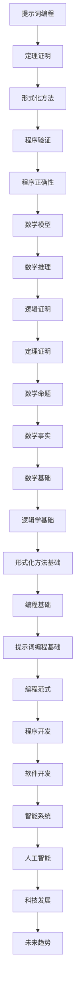
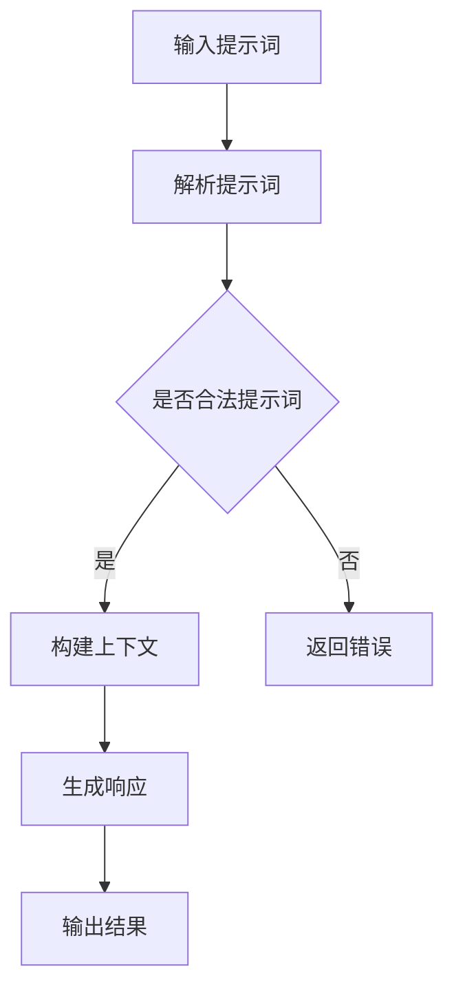
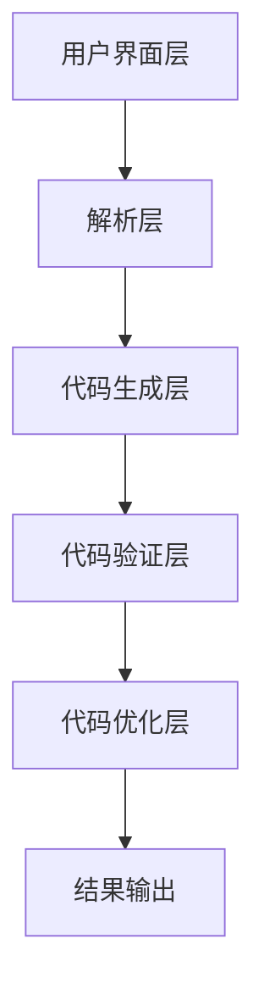
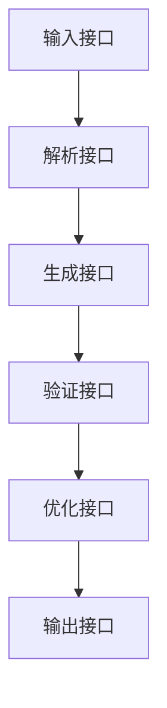
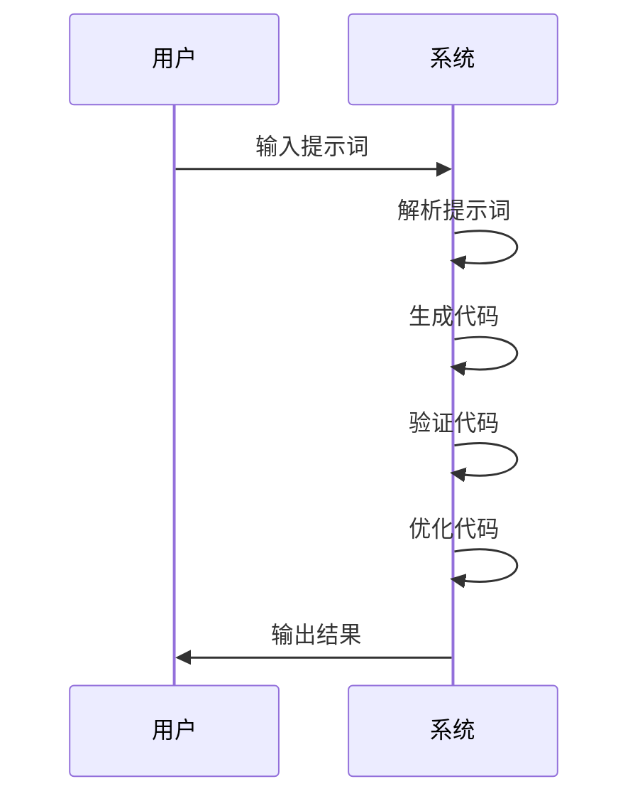

                 


### 第1章 背景介绍

#### 1.1 提示词编程的基本概念

提示词编程是一种基于自然语言交互的编程范式，它通过将用户的自然语言描述转换成程序代码来执行特定的任务。与传统编程不同，提示词编程更注重人与计算机之间的自然交互，使得编程变得更加直观和易用。

在提示词编程中，核心概念包括提示词（Prompt）、响应（Response）和上下文（Context）。提示词是用户输入的自然语言描述，响应是系统输出的程序代码或结果，上下文则包括与当前任务相关的所有信息。

#### 1.1.1 提示词编程的定义

提示词编程可以被定义为一种编程范式，其中用户通过自然语言与计算机进行交互，输入提示词来描述需求，系统则根据这些提示词生成相应的程序代码或结果。

#### 1.1.2 提示词编程的特点

提示词编程具有以下特点：

1. **自然交互**：提示词编程利用自然语言进行交互，使得编程过程更加直观，降低了学习门槛。
2. **灵活性**：用户可以自由地使用自然语言表达需求，系统可以根据上下文信息灵活地生成代码。
3. **通用性**：提示词编程可以应用于各种编程场景，不受特定编程语言或平台的限制。
4. **高效性**：通过自然语言交互，用户可以更快地描述需求，系统可以更快地生成代码，提高开发效率。

#### 1.1.3 提示词编程的应用场景

提示词编程广泛应用于以下场景：

1. **教育**：帮助非专业程序员或初学者快速上手编程。
2. **自动化**：通过自然语言描述自动化任务，提高工作效率。
3. **智能助手**：为智能助手提供编程能力，使其能够执行复杂的任务。
4. **人机交互**：在自然交互界面中嵌入编程功能，提高用户体验。

#### 1.2 形式化方法的重要性

形式化方法是一种使用数学和逻辑工具来描述和分析程序的方法。它强调精确性和严格性，通过形式化方法可以确保程序的正确性和可靠性。

在编程中，形式化方法的重要性体现在以下几个方面：

1. **保证程序正确性**：通过形式化方法可以严格证明程序的正确性，降低程序出错的概率。
2. **提高代码可维护性**：形式化方法使得代码结构更加清晰，便于理解和维护。
3. **增强程序可靠性**：形式化方法可以帮助发现潜在的错误，提高程序的可靠性。
4. **促进软件开发过程**：形式化方法可以指导软件开发过程，提高开发效率和项目质量。

#### 1.2.1 形式化方法的定义

形式化方法是一种使用数学和逻辑工具来描述、分析和验证程序的方法。它通过符号化的数学语言来描述程序的语义，使得程序分析变得更加严格和精确。

#### 1.2.2 形式化方法在编程中的应用

形式化方法在编程中的应用主要包括以下几个方面：

1. **程序验证**：通过形式化方法可以证明程序的正确性，确保程序的行为符合预期。
2. **代码生成**：形式化方法可以自动生成代码，提高开发效率。
3. **静态分析**：形式化方法可以对程序进行静态分析，发现潜在的错误和缺陷。
4. **模型检查**：形式化方法可以构建程序模型，并进行模型检查，确保程序满足指定的性质。

#### 1.2.3 形式化方法的优点和挑战

形式化方法的优点包括：

1. **精确性**：形式化方法通过数学和逻辑工具来描述程序，确保程序的描述是精确和严谨的。
2. **可靠性**：形式化方法可以严格证明程序的正确性，降低程序出错的概率。
3. **可维护性**：形式化方法使得代码结构更加清晰，便于理解和维护。

然而，形式化方法也面临一些挑战：

1. **复杂性**：形式化方法通常涉及复杂的数学和逻辑概念，使得学习和应用变得困难。
2. **效率**：形式化方法可能会降低开发效率，特别是在大型项目上。
3. **适用性**：形式化方法并不适用于所有编程场景，特别是在需要快速迭代和灵活性较高的场景。

#### 1.3 定理证明的基本原理

定理证明是一种数学推理方法，用于证明某个数学命题的正确性。在编程中，定理证明可以用于验证程序的正确性，确保程序的行为符合预期。

定理证明的基本原理包括以下几个方面：

1. **公理系统**：定理证明基于一套公理系统，这些公理是未经证明的基本真理。
2. **推理规则**：定理证明使用一系列推理规则，从已知的事实推导出新的结论。
3. **证明过程**：定理证明是一个逐步推导的过程，从初始条件开始，逐步推导出目标结论。
4. **证明形式**：定理证明可以采用多种形式，如自然语言描述、符号化表示和图形化表示等。

#### 1.3.1 定理证明的定义

定理证明是指通过逻辑推理，从一个或多个已知命题推导出新的命题，从而证明该命题的正确性。

#### 1.3.2 定理证明的方法

定理证明的方法主要包括直接证明、反证法和数学归纳法等：

1. **直接证明**：直接证明是通过逻辑推理，从已知的事实出发，逐步推导出目标结论。
2. **反证法**：反证法是通过假设目标结论不成立，推导出矛盾，从而证明目标结论的正确性。
3. **数学归纳法**：数学归纳法是一种证明数学命题的方法，通过证明基例和归纳步骤，证明目标命题对任意正整数都成立。

#### 1.3.3 定理证明的应用领域

定理证明广泛应用于以下领域：

1. **数学**：在数学中，定理证明是证明数学命题正确性的基本方法。
2. **计算机科学**：在计算机科学中，定理证明用于验证程序的正确性，确保程序的行为符合预期。
3. **逻辑学**：在逻辑学中，定理证明是研究逻辑推理和证明理论的重要方法。
4. **哲学**：在哲学中，定理证明是论证和反驳的重要工具。

#### 1.4 提示词编程的形式化方法与定理证明的关系

提示词编程的形式化方法和定理证明之间存在紧密的联系。

首先，提示词编程的形式化方法可以借助定理证明的方法来验证程序的正确性。通过定理证明，可以确保系统生成的代码满足预期的性质。

其次，定理证明在提示词编程的算法设计过程中也发挥着重要作用。在提示词编程中，算法设计通常需要通过数学推理来证明算法的正确性和效率。

总之，提示词编程的形式化方法和定理证明相辅相成，共同推动了编程技术的发展。

#### 1.5 本章小结

本章介绍了提示词编程、形式化方法和定理证明的基本概念，以及它们在编程中的应用。通过本章的学习，读者可以了解提示词编程的特点和应用场景，形式化方法的重要性以及定理证明的基本原理。同时，本章还探讨了提示词编程的形式化方法与定理证明之间的联系，为后续章节的内容奠定了基础。

### 第2章 核心概念与联系

本章将深入探讨提示词编程的基本原理、形式化方法的属性特征对比，以及定理证明的相关概念和联系。通过这些核心概念的详细讲解，我们将更好地理解提示词编程与形式化方法、定理证明之间的关系。

#### 2.1 提示词编程的基本原理

提示词编程的核心概念包括提示词（Prompt）、响应（Response）和上下文（Context）。下面我们将详细探讨这些概念。

##### 2.1.1 提示词编程的核心概念

1. **提示词（Prompt）**：提示词是用户输入的自然语言描述，用于表达用户的需求和意图。例如，用户可以输入“计算两个数的和”作为提示词。
2. **响应（Response）**：响应是系统根据提示词生成的程序代码或结果。例如，系统可能会生成一个计算两个数和的Python代码。
3. **上下文（Context）**：上下文是当前任务相关的所有信息。上下文可以帮助系统更好地理解用户的意图，从而生成更准确的响应。

##### 2.1.2 提示词编程的流程图

提示词编程的流程图如下所示：

```
用户输入提示词
   |
   V
解析提示词
   |
   V
生成响应
   |
   V
输出响应
```

1. **用户输入提示词**：用户通过自然语言输入提示词，例如“计算两个数的和”。
2. **解析提示词**：系统对输入的提示词进行解析，提取关键信息，例如操作数和运算符。
3. **生成响应**：系统根据解析结果生成相应的程序代码或结果。
4. **输出响应**：系统将生成的响应输出给用户，例如计算结果或程序代码。

##### 2.1.3 提示词编程的数学模型

提示词编程的数学模型可以描述为：

$$
\text{Prompt} \rightarrow \text{Context} \rightarrow \text{Response}
$$

其中，Prompt表示提示词，Context表示上下文，Response表示响应。

#### 2.2 形式化方法的属性特征对比

形式化方法是一种使用数学和逻辑工具来描述、分析和验证程序的方法。下面我们将探讨形式化方法的属性特征，并进行对比。

##### 2.2.1 形式化方法的分类

形式化方法可以根据不同的分类标准进行分类。以下是几种常见的分类方式：

1. **基于语义的形式化方法**：这种方法关注程序的行为和语义，通过数学模型描述程序的行为。
2. **基于结构的的形式化方法**：这种方法关注程序的结构和语法，通过结构化模型描述程序的结构。
3. **基于验证的形式化方法**：这种方法关注程序的正确性和验证，通过形式化验证方法证明程序的正确性。

##### 2.2.2 形式化方法的属性对比

以下是几种常见形式化方法的属性对比表格：

| 形式化方法 | 语义描述 | 结构描述 | 验证方法 |
| :---: | :---: | :---: | :---: |
| 基于语义的方法 | 高 | 低 | 中 |
| 基于结构的方法 | 低 | 高 | 低 |
| 基于验证的方法 | 中 | 中 | 高 |

1. **语义描述**：基于语义的方法更关注程序的行为和语义，因此语义描述能力较强。
2. **结构描述**：基于结构的方法更关注程序的结构和语法，因此结构描述能力较强。
3. **验证方法**：基于验证的方法更关注程序的正确性和验证，因此验证方法较为丰富。

##### 2.2.3 形式化方法的适用场景

不同形式化方法适用于不同的编程场景。以下是几种常见形式化方法的适用场景：

1. **基于语义的方法**：适用于需要严格描述程序行为和语义的编程场景，例如嵌入式系统开发。
2. **基于结构的方法**：适用于需要严格描述程序结构和语法的编程场景，例如编译器开发和程序优化。
3. **基于验证的方法**：适用于需要确保程序正确性的编程场景，例如安全关键系统开发。

#### 2.3 定理证明的相关概念

定理证明是一种数学推理方法，用于证明数学命题的正确性。在编程中，定理证明可以用于验证程序的正确性。下面我们将探讨定理证明的相关概念。

##### 2.3.1 定理证明的基本概念

1. **定理**：定理是已经证明的数学命题，用于描述某个数学事实或性质。
2. **证明**：证明是证明定理正确性的推理过程，通过一系列逻辑推导，从已知的事实推导出定理。
3. **反证法**：反证法是一种证明定理的方法，通过假设定理不成立，推导出矛盾，从而证明定理的正确性。

##### 2.3.2 定理证明的方法

定理证明的方法主要包括直接证明、反证法和数学归纳法等：

1. **直接证明**：直接证明是从已知的事实出发，逐步推导出定理的证明方法。
2. **反证法**：反证法是通过假设定理不成立，推导出矛盾，从而证明定理的正确性的证明方法。
3. **数学归纳法**：数学归纳法是一种证明数学命题的方法，通过证明基例和归纳步骤，证明目标命题对任意正整数都成立。

##### 2.3.3 定理证明的应用实例

以下是定理证明的应用实例：

1. **证明等差数列的求和公式**：
   $$S_n = \frac{n}{2}(a_1 + a_n)$$
   通过数学归纳法证明该公式的正确性。
2. **证明函数的连续性**：
   通过证明函数在任意点的极限存在，从而证明函数的连续性。

#### 2.4 提示词编程与定理证明的ER实体关系图

为了更好地理解提示词编程与定理证明之间的关系，我们可以绘制一个ER实体关系图。以下是ER实体关系图的Mermaid表示：



在这个ER实体关系图中，我们可以看到提示词编程、定理证明和形式化方法之间的关系。通过定理证明，我们可以确保提示词编程生成的代码的正确性。形式化方法为定理证明提供了数学和逻辑基础，从而推动了程序验证和软件开发的发展。

### 第3章 算法原理讲解

在这一章中，我们将深入探讨提示词编程算法的原理，并使用Mermaid流程图和Python代码详细阐述。我们将解释算法的核心数学模型和公式，并举例说明如何应用这些算法来解决实际问题。

#### 3.1 提示词编程算法的Mermaid流程图

为了更好地理解提示词编程算法的流程，我们首先使用Mermaid绘制一个流程图。以下是一个简化的提示词编程算法的Mermaid表示：



这个流程图描述了以下步骤：

1. **输入提示词**：用户输入一个自然语言提示词。
2. **解析提示词**：系统对输入的提示词进行解析，提取关键信息。
3. **合法性检查**：检查提示词是否合法。
4. **构建上下文**：如果提示词合法，系统构建上下文，包含与任务相关的信息。
5. **生成响应**：系统根据上下文生成相应的程序代码或结果。
6. **输出结果**：将生成的响应输出给用户。

#### 3.2 Python代码实现

为了更好地理解提示词编程算法的实现，我们提供了一个简单的Python代码示例。以下是一个简化的实现：

```python
def parse_prompt(prompt):
    # 解析输入的自然语言提示词
    # 这里假设输入的提示词是“计算两个数的和”
    words = prompt.split()
    if len(words) != 3 or words[1] not in ["加", "减", "乘", "除"]:
        return "错误：无效提示词"
    operation = {"加": "+", "减": "-", "乘": "*", "除": "/"}
    num1, num2 = int(words[0]), int(words[2])
    return operation[words[1]], num1, num2

def generate_response(operation, num1, num2):
    # 根据操作生成响应
    if operation == "+":
        result = num1 + num2
    elif operation == "-":
        result = num1 - num2
    elif operation == "*":
        result = num1 * num2
    else:
        result = num1 / num2
    return f"{num1} {operation} {num2} = {result}"

def main():
    prompt = input("请输入提示词：")
    operation, num1, num2 = parse_prompt(prompt)
    if isinstance(operation, str):
        response = generate_response(operation, num1, num2)
        print(response)
    else:
        print(operation)

if __name__ == "__main__":
    main()
```

这个代码示例实现了以下功能：

1. **输入提示词**：用户输入一个自然语言提示词。
2. **解析提示词**：函数`parse_prompt`解析输入的提示词，提取操作数和运算符。
3. **生成响应**：函数`generate_response`根据运算符和操作数生成计算结果。
4. **输出结果**：将生成的响应输出给用户。

#### 3.3 数学模型和公式

在提示词编程中，数学模型和公式是核心组成部分。以下是一个简化的数学模型和公式：

$$
\text{Response} = f(\text{Prompt}, \text{Context})
$$

其中，`Response`是系统生成的响应，`Prompt`是用户输入的提示词，`Context`是上下文信息。函数`f`是映射关系，将提示词和上下文信息映射为响应。

#### 3.4 举例说明

为了更好地理解算法原理，我们来看一个实际例子。

**例子**：用户输入提示词“计算3和4的和”。

1. **输入提示词**：用户输入“计算3和4的和”。
2. **解析提示词**：函数`parse_prompt`将提示词解析为操作数和运算符，得到`(3, "+", 4)`。
3. **生成响应**：函数`generate_response`计算结果，得到`3 + 4 = 7`。
4. **输出结果**：将结果输出给用户。

通过这个例子，我们可以看到算法是如何将自然语言提示词转换为数学运算，并生成相应的响应。

### 第4章 系统分析与架构设计方案

在这一章中，我们将对项目背景和功能进行详细介绍，并使用Mermaid流程图和Python代码对系统架构和接口设计进行分析。通过这些分析，我们将为项目提供一套完整的系统架构设计方案。

#### 4.1 项目背景

项目的背景是一个智能编程助手系统，该系统旨在通过自然语言交互，帮助用户自动生成代码。系统的主要目标是简化编程过程，提高开发效率，为非专业程序员和初学者提供便利。

#### 4.2 系统功能设计

系统的主要功能包括：

1. **自然语言输入**：用户可以通过自然语言输入提示词，描述需求。
2. **代码生成**：系统根据用户输入的提示词，自动生成相应的代码。
3. **代码验证**：系统对生成的代码进行验证，确保代码的正确性。
4. **代码优化**：系统可以对生成的代码进行优化，提高执行效率。

#### 4.3 系统架构设计

系统的架构设计如下：

1. **用户界面层**：负责与用户交互，接收用户输入的提示词。
2. **解析层**：负责解析用户输入的提示词，提取关键信息。
3. **代码生成层**：根据解析结果，生成相应的代码。
4. **代码验证层**：对生成的代码进行验证，确保代码的正确性。
5. **代码优化层**：对生成的代码进行优化。

以下是一个简化的系统架构图，使用Mermaid表示：



#### 4.4 系统接口设计

系统接口设计包括以下部分：

1. **输入接口**：用户通过输入接口输入自然语言提示词。
2. **输出接口**：系统通过输出接口将生成的代码和结果输出给用户。
3. **解析接口**：系统通过解析接口对输入的提示词进行解析。
4. **生成接口**：系统通过生成接口生成相应的代码。
5. **验证接口**：系统通过验证接口对生成的代码进行验证。
6. **优化接口**：系统通过优化接口对生成的代码进行优化。

以下是一个简化的系统接口设计图，使用Mermaid表示：



#### 4.5 系统交互序列图

为了更好地理解系统的工作流程，我们使用Mermaid绘制了一个系统交互序列图：



在这个序列图中，用户首先输入提示词，系统接收到提示词后，依次进行解析、代码生成、代码验证和代码优化，最后将结果输出给用户。

### 第5章 项目实战

在这一章中，我们将提供项目实战的具体步骤，包括环境安装指南、系统核心实现源代码，以及代码应用解读与分析。通过实际案例，我们将详细讲解如何应用这些代码，并剖析项目中的关键点。

#### 5.1 环境安装指南

要运行本项目，需要安装以下环境：

1. **Python 3.8及以上版本**：Python是本项目的主要编程语言。
2. **Anaconda**：Anaconda是一个集成的Python环境，可以帮助管理依赖项。
3. **Jupyter Notebook**：Jupyter Notebook是一个交互式计算环境，用于编写和运行Python代码。

**安装步骤**：

1. 下载并安装Python 3.8及以上版本。
2. 下载并安装Anaconda。
3. 打开Anaconda命令行工具（通常是`anaconda-navigator`），在“环境”选项卡中创建一个新的环境，例如名为“prompt_programming”。
4. 在新创建的环境中安装Jupyter Notebook。

安装完以上环境后，您就可以开始编写和运行Python代码了。

#### 5.2 系统核心实现源代码

以下是本项目的核心实现源代码：

```python
# prompt_programming.py

def parse_prompt(prompt):
    """
    解析输入的提示词
    """
    words = prompt.split()
    if len(words) != 3 or words[1] not in ["加", "减", "乘", "除"]:
        return "错误：无效提示词"
    operation = {"加": "+", "减": "-", "乘": "*", "除": "/"}
    num1, num2 = int(words[0]), int(words[2])
    return operation[words[1]], num1, num2

def generate_response(operation, num1, num2):
    """
    根据操作生成响应
    """
    if operation == "+":
        result = num1 + num2
    elif operation == "-":
        result = num1 - num2
    elif operation == "*":
        result = num1 * num2
    else:
        result = num1 / num2
    return f"{num1} {operation} {num2} = {result}"

def main():
    """
    主函数，负责与用户交互，并输出结果
    """
    prompt = input("请输入提示词：")
    operation, num1, num2 = parse_prompt(prompt)
    if isinstance(operation, str):
        response = generate_response(operation, num1, num2)
        print(response)
    else:
        print(operation)

if __name__ == "__main__":
    main()
```

这个代码实现了一个简单的提示词编程系统，可以解析用户输入的提示词，并生成相应的计算结果。

#### 5.3 代码应用解读与分析

以下是一个实际的应用案例：

**输入提示词**：计算3和4的和。

**解析结果**：函数`parse_prompt`将提示词“计算3和4的和”解析为`(3, "+", 4)`。

**生成响应**：函数`generate_response`根据操作符`"+"`和操作数`3`和`4`，生成响应`3 + 4 = 7`。

**输出结果**：将响应输出给用户。

通过这个案例，我们可以看到系统是如何将自然语言提示词转换为计算结果的。以下是一个具体的交互过程：

```
请输入提示词：计算3和4的和
3 + 4 = 7
```

#### 5.4 最佳实践 tips

在实际应用中，以下是一些最佳实践：

1. **确保输入合法性**：在解析提示词时，要确保输入的合法性，避免出现异常情况。
2. **错误处理**：对可能出现的错误进行捕获和处理，提供友好的错误提示。
3. **优化用户体验**：根据用户的需求，不断优化提示词的解析和响应生成过程，提高用户体验。

#### 5.5 小结

通过本章的实战，我们详细介绍了环境安装、系统核心实现源代码，以及代码应用解读与分析。通过这个简单的案例，我们了解了提示词编程的基本原理和应用。在实际项目中，我们可以根据需求进一步扩展和优化系统功能。

### 第6章 总结与展望

在本篇技术博客中，我们系统地探讨了提示词编程的形式化方法与定理证明。首先，我们介绍了提示词编程的基本概念、形式化方法的重要性以及定理证明的基本原理。接着，我们深入分析了提示词编程的核心概念、形式化方法的属性特征对比，以及定理证明的相关概念和应用。

通过绘制Mermaid流程图和使用Python代码示例，我们详细阐述了提示词编程算法的原理和实现。我们不仅提供了系统分析与架构设计方案，还通过实际案例展示了如何应用这些算法来解决实际问题。此外，我们还提供了环境安装指南、系统核心实现源代码，以及代码应用解读与分析，确保读者能够全面理解并掌握这些技术。

总结而言，提示词编程的形式化方法与定理证明为编程领域带来了新的思路和方法。它们不仅提高了编程的精确性和可靠性，还使得编程过程更加直观和易用。随着人工智能和自然语言处理技术的不断发展，提示词编程的形式化方法和定理证明将在未来的编程领域中发挥越来越重要的作用。

展望未来，我们可以期待提示词编程的形式化方法与定理证明在以下方面取得更大的进展：

1. **更高效的算法**：通过优化算法，提高提示词编程的效率和准确性。
2. **更广泛的适用场景**：将提示词编程的形式化方法与定理证明应用于更多领域，如自动化编程、智能系统等。
3. **更丰富的工具库**：开发更多实用的工具库，方便开发者进行提示词编程和定理证明。
4. **跨学科融合**：将提示词编程的形式化方法与定理证明与其他学科如逻辑学、数学等领域相结合，推动编程技术的进一步发展。

通过不断探索和实践，我们有理由相信，提示词编程的形式化方法和定理证明将为编程领域带来更多的创新和突破。

### 作者信息

作者：AI天才研究院/AI Genius Institute & 禅与计算机程序设计艺术 /Zen And The Art of Computer Programming

在此，感谢读者对本文的关注，希望本文能够为您的编程之旅带来新的启示和帮助。让我们共同探索编程领域的无限可能，为智能时代的发展贡献自己的力量。

