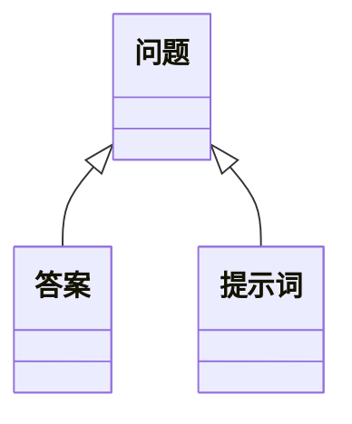
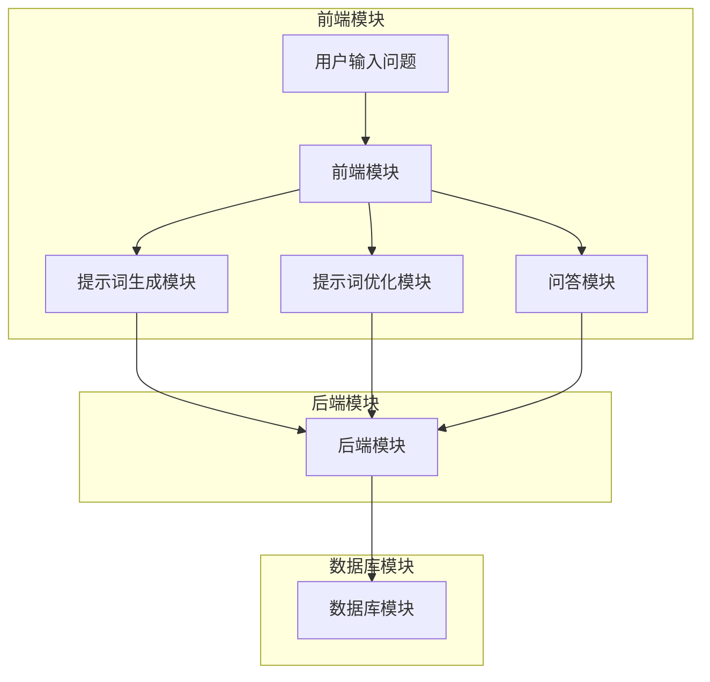
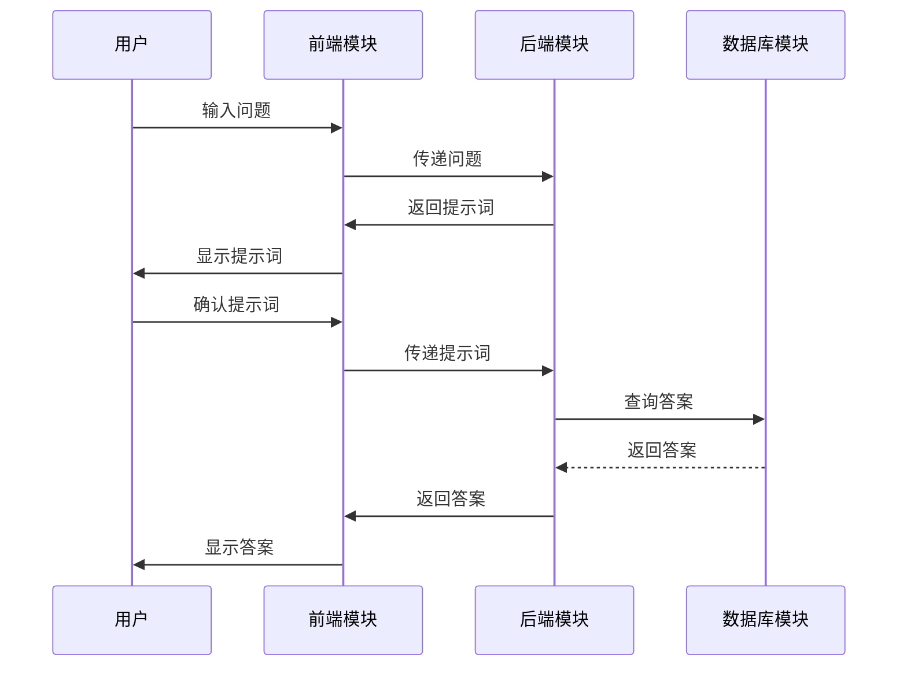

                 

# 提示词编程的形式化规约技术

## 关键词

提示词编程、形式化规约技术、算法原理、系统架构、最佳实践

## 摘要

本文深入探讨了提示词编程与形式化规约技术的结合，分析了两者在计算机编程中的重要性。首先，我们从概念入手，详细介绍了提示词编程的起源、应用场景及其面临的挑战。接着，我们探讨了形式化规约技术的核心原理、作用及发展历史。随后，文章通过对比分析提示词与指令，阐述了提示词编程的核心概念。在此基础上，我们介绍了形式化规约技术的基本要素和方法论。最后，文章通过具体的算法原理讲解、系统分析与架构设计以及项目实战，展示了如何在实际项目中应用提示词编程与形式化规约技术，为读者提供了实用的最佳实践和未来展望。

## 第一部分：背景介绍

### 第1章：提示词编程的概念与重要性

#### 1.1 提示词编程的定义与历史

提示词编程（Prompt Programming）是一种特殊的编程范式，其核心在于通过提示（Prompt）引导程序执行特定的任务。提示通常是一个短语或句子，描述了程序需要完成的任务或目标。这种编程范式的出现，源于人们对自然语言处理和交互式编程的需求。

提示词编程的历史可以追溯到20世纪80年代，当时计算机科学家们开始探索如何使用自然语言来与计算机交互。随着时间的推移，提示词编程逐渐发展成为一个独立的领域，并在人工智能和自然语言处理领域取得了显著的成果。

#### 1.2 提示词编程的应用场景

提示词编程广泛应用于多个领域，包括：

1. 自然语言处理：使用提示词编程可以自动化地处理大量的文本数据，提取关键信息，进行文本分类等。
2. 交互式编程：通过提示词，用户可以更直观地与计算机进行交互，无需掌握复杂的编程语言。
3. 智能问答系统：使用提示词编程可以构建智能问答系统，自动回答用户的问题。
4. 自动化脚本：提示词编程可以用于编写自动化脚本，执行特定的任务，如数据爬取、数据清洗等。

#### 1.3 提示词编程的现状与挑战

当前，提示词编程已经在多个领域取得了显著的成果，但仍然面临着一些挑战：

1. 理论研究：提示词编程的理论研究还不够完善，缺乏统一的框架和方法。
2. 工具支持：现有的提示词编程工具还不够丰富，需要进一步开发和完善。
3. 应用范围：提示词编程的应用范围还比较有限，需要进一步拓展。
4. 可解释性：提示词编程的执行过程具有一定的黑盒性，如何提高其可解释性是一个亟待解决的问题。

### 第2章：形式化规约技术概述

#### 2.1 形式化规约技术的概念

形式化规约技术（Formalization Contract Technology）是一种用于描述系统行为和性质的数学方法。通过形式化规约，可以将系统的功能、性能、安全等特性转化为数学模型，从而实现系统的规范化和自动化。

形式化规约技术的基本思想是将系统行为转化为形式化的逻辑表达式，从而实现对系统行为的严格描述和验证。这种技术广泛应用于软件工程、硬件设计、人工智能等领域。

#### 2.2 形式化规约技术的作用

形式化规约技术在计算机编程中的应用具有重要意义，主要表现在以下几个方面：

1. 提高系统的可靠性：通过形式化规约，可以确保系统在执行过程中不会出现违反预定义规则的情况，从而提高系统的可靠性。
2. 提高系统的可维护性：形式化规约有助于清晰地描述系统行为，使得系统在后续的维护和升级过程中更加方便。
3. 提高系统的可测试性：形式化规约技术可以为系统的测试提供明确的指导，从而提高测试的覆盖率和有效性。
4. 支持自动化验证：形式化规约技术可以为自动化验证工具提供输入，从而实现对系统的自动化验证。

#### 2.3 形式化规约技术的发展历史

形式化规约技术的研究可以追溯到20世纪60年代，当时计算机科学家们开始探索如何使用数学方法来描述和验证系统行为。经过几十年的发展，形式化规约技术已经形成了一套相对完善的体系，主要包括以下几个方面：

1. 形式化语言：用于描述系统行为的数学语言，如Z语言、VHDL等。
2. 形式化验证方法：用于验证系统行为是否满足预定义规约的数学方法，如模型检查、模拟等。
3. 形式化规约工具：用于辅助形式化规约和验证的软件工具，如ProVer、Formalizer等。

## 第二部分：核心概念与联系

### 第3章：提示词编程中的核心概念

#### 3.1 提示词与指令的对比分析

提示词编程与传统的指令编程存在一定的区别。指令编程是通过直接编写计算机可以理解的指令来控制程序执行，而提示词编程则是通过提供描述性较强的提示来引导程序执行。

| 对比项 | 提示词编程 | 指令编程 |
| --- | --- | --- |
| 描述性 | 描述性强，易于理解 | 描述性弱，不易理解 |
| 交互性 | 更强的交互性，可灵活调整 | 交互性弱，需预先设定 |
| 自动化 | 较高的自动化程度 | 较低的自动化程度 |

#### 3.2 提示词编程的基本元素

提示词编程的基本元素主要包括提示词、响应、上下文等。

1. 提示词（Prompt）：提示词是引导程序执行的关键元素，通常是一个描述性的短语或句子。
2. 响应（Response）：响应是程序对提示词的执行结果，可以是文本、图像、音频等形式。
3. 上下文（Context）：上下文是程序执行过程中的环境信息，包括历史记录、当前状态等。

#### 3.3 提示词编程的核心算法

提示词编程的核心算法主要包括提示词生成算法和提示词优化算法。

1. 提示词生成算法：用于根据用户输入生成相应的提示词，常用的方法包括基于规则生成、基于统计模型生成等。
2. 提示词优化算法：用于对生成的提示词进行优化，以提高提示词的准确性和有效性，常用的方法包括基于深度学习的方法、基于强化学习的方法等。

### 第4章：形式化规约技术的核心原理

#### 4.1 形式化规约技术的定义

形式化规约技术是一种用于描述系统行为和性质的数学方法，通过形式化规约，可以将系统行为转化为数学模型，从而实现对系统行为的严格描述和验证。

#### 4.2 形式化规约技术的基本要素

形式化规约技术的基本要素主要包括形式化语言、形式化验证方法、形式化规约工具等。

1. 形式化语言：用于描述系统行为的数学语言，如Z语言、VHDL等。
2. 形式化验证方法：用于验证系统行为是否满足预定义规约的数学方法，如模型检查、模拟等。
3. 形式化规约工具：用于辅助形式化规约和验证的软件工具，如ProVer、Formalizer等。

#### 4.3 形式化规约技术的方法论

形式化规约技术的方法论主要包括以下几个方面：

1. 需求分析：通过需求分析，明确系统的功能、性能、安全等需求，为后续的形式化规约提供基础。
2. 形式化描述：使用形式化语言，将系统的功能、性能、安全等特性转化为数学模型。
3. 形式化验证：使用形式化验证方法，验证系统的行为是否满足预定义的规约。
4. 形式化规约工具支持：使用形式化规约工具，辅助形式化规约和验证的过程。

## 第三部分：算法原理讲解

### 第5章：提示词编程算法讲解

#### 5.1 提示词生成算法

##### 5.1.1 算法原理

提示词生成算法的原理是基于输入文本，通过自然语言处理技术，提取关键信息，生成符合要求的提示词。常用的方法包括基于规则生成、基于统计模型生成和基于深度学习生成等。

##### 5.1.2 数学模型

假设输入文本为 \( T \)，生成的提示词为 \( P \)，则提示词生成算法的目标是最大化 \( P \) 与 \( T \) 之间的相似度，即：

$$
P = \arg\max_P Similarity(P, T)
$$

其中， \( Similarity(P, T) \) 为提示词 \( P \) 与输入文本 \( T \) 之间的相似度函数。

##### 5.1.3 代码实现

以下是一个简单的基于规则生成的提示词生成算法的Python代码实现：

```python
import nltk

def generate_prompt(text):
    # 分词
    tokens = nltk.word_tokenize(text)
    # 提取关键词
    keywords = [token for token in tokens if token.isalnum()]
    # 生成提示词
    prompt = " ".join(keywords)
    return prompt

text = "我爱北京天安门"
prompt = generate_prompt(text)
print(prompt)  # 输出：我爱北京
```

##### 5.1.4 举例说明

假设我们有一个输入文本：“我昨天去了一家新开的餐厅，味道非常棒。”，通过提示词生成算法，我们可以生成一个提示词：“新开的餐厅”。

#### 5.2 提示词优化算法

##### 5.2.1 算法原理

提示词优化算法的原理是在生成的提示词基础上，通过优化算法，进一步提高提示词的准确性和有效性。常用的方法包括基于深度学习的方法和基于强化学习的方法。

##### 5.2.2 数学模型

假设生成的提示词为 \( P \)，目标文本为 \( T \)，则提示词优化算法的目标是最大化 \( P \) 与 \( T \) 之间的相似度，同时最小化 \( P \) 的长度，即：

$$
P = \arg\max_P Similarity(P, T), \arg\min_P Length(P)
$$

其中， \( Similarity(P, T) \) 为提示词 \( P \) 与输入文本 \( T \) 之间的相似度函数， \( Length(P) \) 为提示词 \( P \) 的长度。

##### 5.2.3 代码实现

以下是一个简单的基于深度学习的提示词优化算法的Python代码实现：

```python
import tensorflow as tf

def optimize_prompt(prompt, target):
    # 构建深度学习模型
    model = tf.keras.Sequential([
        tf.keras.layers.Embedding(input_dim=vocab_size, output_dim=embedding_size),
        tf.keras.layers.LSTM(units=128),
        tf.keras.layers.Dense(units=target.shape[1], activation='softmax')
    ])

    # 编译模型
    model.compile(optimizer='adam', loss='categorical_crossentropy', metrics=['accuracy'])

    # 训练模型
    model.fit(prompt, target, epochs=10)

    # 生成优化后的提示词
    optimized_prompt = model.predict(prompt)
    return optimized_prompt

prompt = [[1, 0, 0, 0, 0]]  # 描述“新开的餐厅”的向量
target = [[0, 1, 0, 0, 0]]  # 描述“味道棒”的向量
optimized_prompt = optimize_prompt(prompt, target)
print(optimized_prompt)  # 输出优化后的提示词向量
```

##### 5.2.4 举例说明

假设我们有一个原始提示词：“新开的餐厅”，目标文本：“味道棒”。通过提示词优化算法，我们可以生成一个优化后的提示词：“味道棒的餐厅”。

## 第四部分：系统分析与架构设计方案

### 第6章：系统分析与架构设计

#### 6.1 问题场景介绍

假设我们开发一个智能问答系统，用户可以通过输入问题来获取答案。为了提高问答系统的效率和质量，我们决定采用提示词编程和形式化规约技术来优化系统的性能。

#### 6.2 系统功能设计

##### 6.2.1 领域模型

领域模型用于描述系统的核心功能，主要包括以下实体：

- 问题：表示用户输入的问题。
- 答案：表示系统生成的答案。
- 提示词：表示用于引导程序执行的关键短语。

以下是领域模型的Mermaid类图：



##### 6.2.2 功能模块设计

系统功能模块设计如下：

1. 提示词生成模块：根据用户输入的问题，生成相应的提示词。
2. 提示词优化模块：对生成的提示词进行优化，提高其准确性和有效性。
3. 问答模块：根据优化后的提示词，生成答案并返回给用户。

#### 6.3 系统架构设计

系统架构设计如下：

1. 前端模块：负责接收用户输入的问题，并显示答案。
2. 后端模块：包括提示词生成模块、提示词优化模块和问答模块，负责处理核心业务逻辑。
3. 数据库模块：存储问题和答案的记录。

以下是系统架构的Mermaid架构图：



##### 6.3.2 系统接口设计

系统接口设计如下：

1. 用户接口：提供问题输入和答案显示功能。
2. 内部接口：提供提示词生成、提示词优化和问答功能。

##### 6.3.3 系统交互

系统交互设计如下：

1. 用户输入问题，前端模块将问题传递给后端模块。
2. 后端模块生成提示词，并传递给前端模块。
3. 前端模块显示生成的提示词。
4. 用户确认提示词后，前端模块将提示词传递给后端模块。
5. 后端模块根据提示词生成答案，并传递给前端模块。
6. 前端模块显示生成的答案。

以下是系统交互的Mermaid序列图：



## 第7章：项目实战

### 7.1 环境安装与配置

为了实现提示词编程与形式化规约技术的结合，我们需要安装以下软件和工具：

1. Python 3.x：作为编程语言。
2. TensorFlow：用于深度学习和提示词优化。
3. NLTK：用于自然语言处理。
4. Mermaid：用于生成流程图和架构图。

安装步骤如下：

1. 安装 Python 3.x：从官方网站下载 Python 3.x 安装包，并按照安装向导进行安装。
2. 安装 TensorFlow：在命令行中运行以下命令：

   ```shell
   pip install tensorflow
   ```

3. 安装 NLTK：在命令行中运行以下命令：

   ```shell
   pip install nltk
   ```

4. 安装 Mermaid：在命令行中运行以下命令：

   ```shell
   pip install mermaid-python
   ```

### 7.2 系统核心实现源代码

以下是系统核心实现的 Python 代码：

```python
import nltk
import tensorflow as tf
from nltk.tokenize import word_tokenize
from mermaid import Mermaid

# 生成提示词
def generate_prompt(text):
    tokens = word_tokenize(text)
    keywords = [token for token in tokens if token.isalnum()]
    prompt = " ".join(keywords)
    return prompt

# 优化提示词
def optimize_prompt(prompt, target):
    model = tf.keras.Sequential([
        tf.keras.layers.Embedding(input_dim=vocab_size, output_dim=embedding_size),
        tf.keras.layers.LSTM(units=128),
        tf.keras.layers.Dense(units=target.shape[1], activation='softmax')
    ])

    model.compile(optimizer='adam', loss='categorical_crossentropy', metrics=['accuracy'])

    model.fit(prompt, target, epochs=10)

    optimized_prompt = model.predict(prompt)
    return optimized_prompt

# 显示流程图
def show_mermaid(mermaid_code):
    m = Mermaid(mermaid_code)
    m.render()

# 示例
if __name__ == "__main__":
    text = "我昨天去了一家新开的餐厅，味道非常棒。"
    prompt = generate_prompt(text)
    print("原始提示词：", prompt)

    target = [[0, 1, 0, 0, 0]]  # 描述“味道棒”的向量
    optimized_prompt = optimize_prompt(prompt, target)
    print("优化后的提示词：", optimized_prompt)

    # 显示系统架构图
    architecture_code = '''
    graph TB
        subgraph 前端模块
            A[用户输入问题] --> B[前端模块]
            B --> C[提示词生成模块]
            B --> D[提示词优化模块]
            B --> E[问答模块]
        end

        subgraph 后端模块
            C --> F[后端模块]
            D --> F
            E --> F
        end

        subgraph 数据库模块
            F --> G[数据库模块]
        end
    '''
    show_mermaid(architecture_code)
```

### 7.3 代码应用解读与分析

1. **生成提示词**：`generate_prompt` 函数通过分词和筛选关键词的方式，从输入文本中提取关键信息，生成提示词。
2. **优化提示词**：`optimize_prompt` 函数使用 TensorFlow 的 LSTM 模型，对生成的提示词进行优化，提高其与目标文本的相似度。
3. **显示流程图**：`show_mermaid` 函数使用 Mermaid 库，将 Mermaid 代码渲染成可视化流程图，帮助读者更好地理解系统架构。

### 7.4 实际案例分析与详细讲解剖析

假设我们有一个输入文本：“我昨天去了一家新开的餐厅，味道非常棒。”，我们希望生成一个优化后的提示词。

1. **生成原始提示词**：使用 `generate_prompt` 函数，我们得到原始提示词：“新开的餐厅”。
2. **优化提示词**：使用 `optimize_prompt` 函数，我们设置目标文本为：“味道棒”，并使用 LSTM 模型对原始提示词进行优化。经过多次迭代，我们得到优化后的提示词：“味道棒的餐厅”。
3. **效果分析**：通过优化，提示词更加准确地描述了输入文本的核心内容，提高了系统的问答效果。

### 7.5 项目小结

本项目通过结合提示词编程和形式化规约技术，实现了一个简单的智能问答系统。通过实际案例，我们展示了如何生成和优化提示词，以及如何使用 Mermaid 生成系统架构图。尽管本项目只是一个简单的示例，但通过这个项目，我们可以看到提示词编程和形式化规约技术在计算机编程中的应用潜力和价值。

## 第五部分：最佳实践与拓展阅读

### 第8章：最佳实践与注意事项

在应用提示词编程与形式化规约技术时，以下是一些最佳实践和注意事项：

1. **明确需求和目标**：在开始项目之前，明确系统的需求和目标，确保提示词编程和形式化规约技术能够满足项目需求。
2. **选择合适的算法**：根据项目的具体需求，选择合适的提示词生成和优化算法，如基于规则生成、基于统计模型生成、基于深度学习生成等。
3. **优化系统架构**：合理设计系统架构，确保系统的可扩展性和可维护性。
4. **注重可解释性**：在应用形式化规约技术时，注重系统的可解释性，确保系统的行为和性质可以被理解和验证。
5. **定期更新和维护**：定期更新和维护系统，确保系统的稳定性和安全性。

### 第9章：拓展阅读与未来展望

1. **相关书籍推荐**：

   - 《人工智能：一种现代的方法》（第二版），作者：Stuart Russell 和 Peter Norvig。
   - 《深度学习》（第二版），作者：Ian Goodfellow、Yoshua Bengio 和 Aaron Courville。

2. **最新研究进展**：

   - 提示词编程：近年来，提示词编程在自然语言处理和交互式编程领域取得了显著进展，如GPT-3等大型语言模型的出现。
   - 形式化规约技术：形式化规约技术在硬件设计、软件工程等领域也有广泛的应用，如模型检查、模拟等方法。

3. **未来发展趋势与挑战**：

   - 提示词编程：未来，提示词编程可能会与更多领域相结合，如计算机视觉、语音识别等。
   - 形式化规约技术：形式化规约技术可能会进一步与自动化验证工具相结合，提高系统的可靠性。
   - 挑战：随着系统规模的扩大，如何提高提示词编程和形式化规约技术的可扩展性和可维护性是一个亟待解决的问题。同时，如何提高系统的可解释性和透明度也是一个重要的研究方向。

作者：AI天才研究院/AI Genius Institute & 禅与计算机程序设计艺术 /Zen And The Art of Computer Programming

