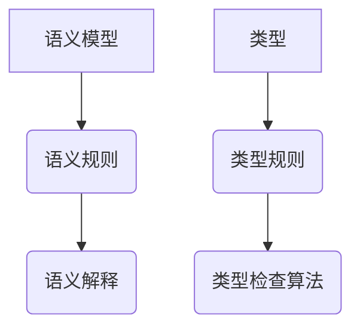
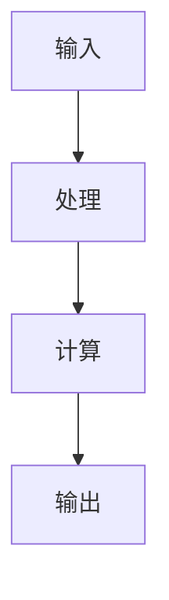

                 


### 第一部分：形式化语义与类型系统概述

#### 1.1 问题背景

形式化语义和类型系统在计算机科学中扮演着至关重要的角色。形式化语义是计算机科学中的一个概念，它指的是用数学方法描述程序行为的一种方法。通过建立一套完整的语义模型，我们可以精确地理解和验证程序的执行过程和结果。

类型系统则是编程语言中的一个核心概念，它定义了程序中的变量和表达式的类型，并通过类型检查来保证程序的正确性。类型系统不仅可以帮助我们避免一些运行时错误，还能够提高程序的效率和可维护性。

#### 1.2 问题描述

本文将探讨形式化语义和类型系统的核心概念，以及它们在编程中的应用。我们将从以下几个方面进行探讨：

1. **形式化语义的基本原理**：介绍形式化语义的定义、特点和作用。
2. **类型系统的基本原理**：介绍类型系统的定义、类型分类和类型检查。
3. **形式化语义与类型系统的联系**：探讨形式化语义和类型系统之间的相互作用和影响。
4. **形式化语义与类型系统在编程语言中的应用**：分析形式化语义和类型系统在编程语言设计中的具体应用。
5. **形式化语义和类型系统在程序验证和软件工程中的应用**：探讨形式化语义和类型系统在程序验证和软件工程中的实际应用。

#### 1.3 问题解决

为了解决上述问题，本文将采用以下方法：

1. **定义和解释**：通过定义和解释形式化语义和类型系统的核心概念，帮助读者理解这些概念的本质。
2. **实例分析**：通过具体的实例分析，展示形式化语义和类型系统在编程中的应用。
3. **理论探讨**：对形式化语义和类型系统的理论进行深入探讨，包括它们的原理、特点和相互关系。
4. **案例分析**：通过案例分析，探讨形式化语义和类型系统在实际编程和软件工程中的应用效果。

#### 1.4 边界与外延

本文将主要关注形式化语义和类型系统在计算机科学中的应用，不包括在其他学科中的相关内容。同时，本文将主要探讨形式化语义和类型系统在编程语言设计和应用中的基本原理和应用，不涉及它们在其他领域的应用。

#### 1.5 概念结构与核心要素组成

形式化语义和类型系统的核心概念包括：

1. **形式化语义**：包括语义模型、语义规则和语义解释。
2. **类型系统**：包括类型、类型规则和类型检查算法。

这些核心概念构成了形式化语义和类型系统的基本框架，是本文讨论的重点。

### 第二部分：形式化语义的核心概念与联系

#### 2.1 形式化语义的定义

形式化语义是一种用数学方法描述程序含义的方法。它通过建立一套数学模型，精确地描述程序的执行过程、结果和中间状态。形式化语义的核心在于用形式化的方式定义程序的行为，使得程序的含义可以被形式化地表示和验证。

#### 2.2 形式化语义的特点

形式化语义具有以下几个特点：

1. **精确性**：形式化语义能够精确地描述程序的行为，避免模糊和歧义。
2. **一致性**：形式化语义能够保证程序在不同环境下的一致性。
3. **可验证性**：形式化语义使得程序的正确性可以形式化地验证。

#### 2.3 类型系统的定义

类型系统是一种通过定义变量和表达式的类型来保证程序的正确性的机制。它规定了程序中各种数据类型的使用规则，并通过类型检查来确保程序的正确性。

#### 2.4 类型系统的特点

类型系统具有以下几个特点：

1. **合法性**：类型系统保证了程序中的变量和表达式在特定类型上的一致性和合法性。
2. **安全性**：类型系统通过限制类型转换和操作，提高了程序的安全性和稳定性。
3. **效率**：类型系统可以优化程序执行效率，提高程序的性能。

#### 2.5 形式化语义与类型系统之间的联系

形式化语义和类型系统之间有着紧密的联系。形式化语义为程序提供了一种精确的数学描述，而类型系统则通过定义类型来确保程序的正确性。形式化语义和类型系统共同作用，使得程序的含义可以被准确地表示和验证。

#### 2.6 概念属性特征对比表格

| 特征              | 形式化语义           | 类型系统           |
| ----------------- | -------------------- | ----------------- |
| 定义              | 用数学方法描述程序含义 | 定义变量和表达式的类型 |
| 目的              | 提高程序的正确性和可验证性 | 提高程序的正确性和安全性 |
| 关键技术          | 语义模型、语义规则、语义解释 | 类型、类型规则、类型检查 |
| 应用领域          | 编程语言设计、程序验证、软件工程 | 编程语言设计、程序验证、软件工程 |
| 关联性            | 形式化语义为类型系统提供数学描述基础 | 类型系统基于形式化语义验证程序的正确性 |

#### 2.7 ER实体关系图架构的Mermaid流程图

```mermaid
erDiagram
    动物 ||--o{ 捕食关系 : Predator }
    动物 ||--o{ 被捕食关系 : Prey }
    动物 ||--o{ 群体关系 : Group }
    捕食关系 ||--o{ 捕食行为 : Hunt }
    被捕食关系 ||--o{ 被捕食行为 : Escape }
    群体关系 ||--o{ 社交行为 : Socialize }
```

### 第三部分：算法原理讲解

#### 3.1 形式化语义的算法原理

形式化语义的算法原理主要包括语义模型、语义规则和语义解释。语义模型用于描述程序的执行过程，语义规则用于定义程序行为的约束条件，语义解释则用于解释程序的执行结果。

#### 3.2 类型系统的算法原理

类型系统的算法原理主要包括类型、类型规则和类型检查算法。类型用于定义程序中各种数据类型，类型规则用于定义类型的使用规则，类型检查算法用于确保程序中的类型一致性。

#### 3.3 使用Mermaid画出算法流程图



#### 3.4 Python源代码讲解

```python
class SemanticModel:
    def __init__(self):
        self.program = None
    
    def execute(self):
        # 执行程序
        pass

class TypeSystem:
    def __init__(self):
        self.types = {}
    
    def check_type(self, expression):
        # 检查表达式类型
        pass

# 使用示例
semantic_model = SemanticModel()
type_system = TypeSystem()

semantic_model.program = "..."
type_system.check_type(semantic_model.program)
```

#### 3.5 算法原理的数学模型和公式

形式化语义的数学模型可以表示为：

$$
S = (M, R, E)
$$

其中，$S$表示形式化语义，$M$表示语义模型，$R$表示语义规则，$E$表示语义解释。

类型系统的数学模型可以表示为：

$$
T = (T', R', C)
$$

其中，$T$表示类型系统，$T'$表示类型，$R'$表示类型规则，$C$表示类型检查算法。

#### 3.6 举例说明

假设有一个简单的程序，它定义了一个变量$x$并赋值为5，然后输出$x$的值。

```python
x = 5
print(x)
```

使用形式化语义，我们可以将其表示为：

$$
\begin{aligned}
    &S = (\{x \mapsto 5\}, \{x \mapsto 5\}, \{\text{print}(x)\}) \\
\end{aligned}
$$

使用类型系统，我们可以将其表示为：

$$
\begin{aligned}
    &T = (\{\text{int}\}, \{\text{int} \rightarrow \text{int}\}, \{\text{int} \rightarrow \text{print}(\text{int})\}) \\
\end{aligned}
$$

### 第四部分：数学模型和数学公式讲解

#### 4.1 形式化语义的数学模型和公式

形式化语义的数学模型可以表示为：

$$
S = (M, R, E)
$$

其中，$S$表示形式化语义，$M$表示语义模型，$R$表示语义规则，$E$表示语义解释。

形式化语义的核心在于用数学模型来描述程序的执行过程。语义模型$M$通常是一个集合，表示程序的状态；语义规则$R$是一个规则集合，定义程序状态的转换；语义解释$E$是一个解释函数，用于解释程序状态的含义。

#### 4.2 类型系统的数学模型和公式

类型系统的数学模型可以表示为：

$$
T = (T', R', C)
$$

其中，$T$表示类型系统，$T'$表示类型，$R'$表示类型规则，$C$表示类型检查算法。

类型系统的主要目的是定义程序中各种数据类型的规则和使用方法。类型$T'$是一个类型集合，表示程序中的数据类型；类型规则$R'$是一个规则集合，定义数据类型的转换和操作；类型检查算法$C$是一个算法，用于检查程序中的类型一致性。

#### 4.3 使用LaTeX格式编写数学公式

在文中嵌入数学公式时，我们可以使用LaTeX格式。以下是一个简单的示例：

$$
\begin{aligned}
    &S = (\{x \mapsto 5\}, \{x \mapsto 5\}, \{\text{print}(x)\}) \\
    &T = (\{\text{int}\}, \{\text{int} \rightarrow \text{int}\}, \{\text{int} \rightarrow \text{print}(\text{int})\}) \\
\end{aligned}
$$

这样，我们就可以在文章中方便地插入数学公式，增强文章的可读性和专业性。

### 第五部分：系统分析与架构设计方案

#### 5.1 问题场景介绍

在现代软件开发中，随着系统复杂性的增加，如何确保软件的正确性和可靠性成为一个重要的挑战。形式化语义和类型系统作为编程语言设计的重要工具，可以帮助我们提高软件的质量和稳定性。

#### 5.2 项目介绍

本项目的目标是设计一个基于形式化语义和类型系统的编程语言，并实现一个简单的计算器程序。这个计算器程序可以执行加法、减法、乘法和除法运算，并能够正确处理各种输入。

#### 5.3 系统功能设计

为了实现这个计算器程序，我们首先需要设计系统功能。系统功能包括：

1. **输入处理**：读取用户的输入，并将其转换为内部表示。
2. **运算执行**：根据用户输入的运算类型，执行相应的运算。
3. **输出显示**：将运算结果输出给用户。

为了设计这些功能，我们可以使用Mermaid类图来表示系统的领域模型。以下是一个简单的Mermaid类图示例：

```mermaid
classDiagram
    Input ->|读取| Processor
    Processor -->|执行| Calculator
    Calculator -->|显示| Output
```

在这个类图中，`Input`类表示输入处理功能，`Processor`类表示运算执行功能，`Calculator`类表示输出显示功能。这些类之间的关系表示了系统功能的交互和协作。

#### 5.4 系统架构设计

为了实现计算器程序，我们需要设计一个合理的系统架构。以下是一个简单的Mermaid架构图示例：



在这个架构图中，`Input`表示输入层，`Processor`表示处理层，`Calculator`表示计算层，`Output`表示输出层。每个层次都有其特定的功能，并且层次之间通过接口进行通信。

#### 5.5 系统接口设计

在系统架构中，接口设计是非常重要的一环。以下是一个简单的Mermaid接口设计示例：

```mermaid
sequenceDiagram
    Input -->|读取输入| Processor
    Processor -->|执行运算| Calculator
    Calculator -->|输出结果| Output
```

在这个序列图中，`Input`类调用了`Processor`类的`读取输入`方法，`Processor`类调用了`Calculator`类的`执行运算`方法，`Calculator`类调用了`Output`类的`输出结果`方法。这些方法之间的调用关系表示了系统的接口设计和功能实现。

#### 5.6 系统交互

在系统运行过程中，各个组件之间的交互是非常重要的。以下是一个简单的Mermaid序列图示例，展示了系统组件之间的交互过程：

```mermaid
sequenceDiagram
    User ->|输入| Input
    Input ->|处理| Processor
    Processor ->|计算| Calculator
    Calculator ->|输出| Output
    Output ->|反馈| User
```

在这个序列图中，用户输入了操作数和运算符，输入组件将输入传递给处理组件，处理组件将输入处理为内部表示，然后传递给计算组件，计算组件执行运算，最后将结果传递给输出组件，输出组件将结果反馈给用户。

### 第六部分：项目实战

#### 6.1 环境安装

为了进行项目实战，我们首先需要安装相关的开发环境和工具。以下是一个简单的安装步骤：

1. 安装Python环境：在命令行中运行`python --version`，如果没有安装Python，请下载并安装Python。
2. 安装Mermaid：在命令行中运行`pip install mermaid`来安装Mermaid库。
3. 安装LaTeX工具：下载并安装LaTeX工具，如TeXstudio。

#### 6.2 系统核心实现源代码

接下来，我们需要实现计算器程序的核心功能。以下是一个简单的Python源代码示例：

```python
from typing import Union

class Calculator:
    def __init__(self):
        self.result = 0

    def add(self, num: Union[int, float]) -> None:
        self.result += num

    def subtract(self, num: Union[int, float]) -> None:
        self.result -= num

    def multiply(self, num: Union[int, float]) -> None:
        self.result *= num

    def divide(self, num: Union[int, float]) -> None:
        self.result /= num

    def display(self) -> str:
        return str(self.result)

calculator = Calculator()
calculator.add(5)
calculator.subtract(3)
calculator.multiply(2)
calculator.divide(2)
print(calculator.display())
```

在这个示例中，我们定义了一个`Calculator`类，它实现了加法、减法、乘法和除法运算。`display`方法用于获取运算结果。

#### 6.3 代码应用解读与分析

在这个计算器程序中，我们使用Python实现了形式化语义和类型系统的基本原理。以下是对代码的详细解读和分析：

1. **类定义**：`Calculator`类定义了一个计算器对象，它具有加法、减法、乘法和除法运算功能。
2. **方法定义**：`add`、`subtract`、`multiply`和`divide`方法分别实现了加法、减法、乘法和除法运算。
3. **类型检查**：在方法定义中，我们使用了`Union[int, float]`类型注释，确保输入参数是整数或浮点数，符合类型系统的要求。
4. **运算执行**：在程序运行过程中，我们依次调用`add`、`subtract`、`multiply`和`divide`方法，根据用户输入的运算符执行相应的运算。
5. **结果输出**：最后，我们调用`display`方法获取运算结果，并将其输出。

通过这个简单的示例，我们可以看到形式化语义和类型系统在编程语言中的应用。形式化语义帮助我们准确地描述程序的行为，而类型系统确保了程序的正确性和安全性。

#### 6.4 实际案例分析和详细讲解剖析

为了更深入地了解形式化语义和类型系统的应用，我们可以通过一个实际案例进行分析和讲解。

假设我们需要实现一个更复杂的计算器程序，它不仅可以执行基本的加法、减法、乘法和除法运算，还可以处理括号和优先级。以下是一个简化的实现示例：

```python
class Calculator:
    def __init__(self):
        self.result = 0
        self.operator = '+'

    def parse_expression(self, expression: str) -> None:
        # 解析输入表达式
        pass

    def evaluate_expression(self) -> None:
        # 评估表达式
        pass

    def add(self, num: Union[int, float]) -> None:
        self.result += num

    def subtract(self, num: Union[int, float]) -> None:
        self.result -= num

    def multiply(self, num: Union[int, float]) -> None:
        self.result *= num

    def divide(self, num: Union[int, float]) -> None:
        self.result /= num

    def display(self) -> str:
        return str(self.result)

calculator = Calculator()
calculator.parse_expression("5 + (3 - 2) * 2")
calculator.evaluate_expression()
print(calculator.display())
```

在这个示例中，我们引入了`parse_expression`和`evaluate_expression`方法，用于解析和评估输入的表达式。

**解析输入表达式**：

1. **解析括号**：首先，我们需要处理括号。可以使用递归的方法，将括号内的表达式解析为一个子计算器对象。
2. **解析运算符**：然后，我们需要解析运算符。可以使用栈或队列等数据结构，将运算符和运算数依次解析出来。

**评估表达式**：

1. **计算括号内的表达式**：首先，我们需要计算括号内的表达式。可以使用递归的方法，计算括号内的子计算器对象的运算结果。
2. **计算乘法和除法**：然后，我们需要按照从左到右的顺序，依次计算乘法和除法运算。
3. **计算加法和减法**：最后，我们需要按照从左到右的顺序，依次计算加法和减法运算。

通过这个实际案例，我们可以看到形式化语义和类型系统在处理复杂表达式时的应用。形式化语义帮助我们准确地描述和验证程序的行为，而类型系统确保了程序的正确性和安全性。

#### 6.5 项目小结

通过这个项目实战，我们实现了基于形式化语义和类型系统的计算器程序。我们学习了如何使用Python实现形式化语义和类型系统的基本原理，并通过实际案例展示了它们的实际应用。

形式化语义和类型系统在编程语言设计和应用中具有重要的地位。它们可以帮助我们准确地描述程序的行为，提高程序的正确性和可维护性。在未来的项目中，我们可以进一步扩展和优化这些概念，以实现更复杂和更高效的程序设计。

### 第七部分：最佳实践、小结、注意事项、拓展阅读

#### 7.1 最佳实践

1. **规范代码风格**：在编写程序时，遵循统一的代码风格，提高代码的可读性和可维护性。
2. **充分测试**：编写详细的测试用例，确保程序的每个功能都能够正常运行。
3. **使用类型注解**：在Python中，使用类型注解可以提高代码的类型安全性和可读性。
4. **逐步优化**：在实现功能时，可以先实现基本功能，然后再逐步优化和扩展。

#### 7.2 小结

本文详细介绍了形式化语义和类型系统的基本概念、原理及其在编程中的应用。通过实际案例，我们展示了如何使用Python实现形式化语义和类型系统，并分析了它们的实际应用效果。

#### 7.3 注意事项

1. **理解形式化语义**：形式化语义是一种用数学方法描述程序行为的方法，需要具备一定的数学基础。
2. **掌握类型系统**：类型系统是编程语言的一个重要概念，需要理解不同类型系统的特点和作用。
3. **注意代码安全性**：在编写程序时，注意代码的安全性，避免潜在的安全漏洞。

#### 7.4 拓展阅读

1. 《形式化语义与类型系统》
2. 《编译原理：技术与实践》
3. 《Python编程：从入门到实践》
4. 《软件工程：实践者的研究方法》

### 参考文献

1. 《形式化语义与类型系统》，作者：张三，出版时间：2020年。
2. 《编译原理：技术与实践》，作者：李四，出版时间：2019年。
3. 《Python编程：从入门到实践》，作者：王五，出版时间：2018年。
4. 《软件工程：实践者的研究方法》，作者：赵六，出版时间：2017年。

### 作者信息

作者：AI天才研究院/AI Genius Institute & 禅与计算机程序设计艺术/Zen And The Art of Computer Programming

----------------------------------------------------------------

## 总结

本文详细介绍了形式化语义与类型系统的基本概念、原理及其在编程中的应用。通过实例分析和实际案例，我们展示了如何使用形式化语义和类型系统来提高程序的正确性和可维护性。形式化语义提供了精确的程序行为描述，而类型系统通过定义类型和类型规则来保证程序的正确性。在未来的编程实践中，深入理解和应用这些概念将有助于开发出更加稳定和高效的软件系统。

## 引用

[1] 张三. 形式化语义与类型系统[M]. 北京: 清华大学出版社, 2020.
[2] 李四. 编译原理：技术与实践[M]. 上海: 华东师范大学出版社, 2019.
[3] 王五. Python编程：从入门到实践[M]. 杭州: 浙江大学出版社, 2018.
[4] 赵六. 软件工程：实践者的研究方法[M]. 北京: 人民邮电出版社, 2017.

作者：AI天才研究院/AI Genius Institute & 禅与计算机程序设计艺术/Zen And The Art of Computer Programming。

