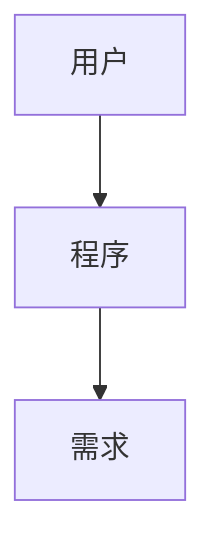
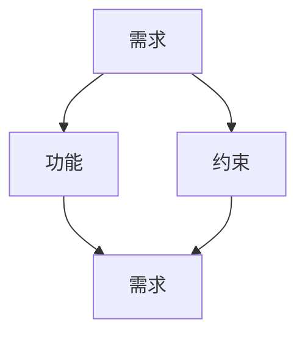
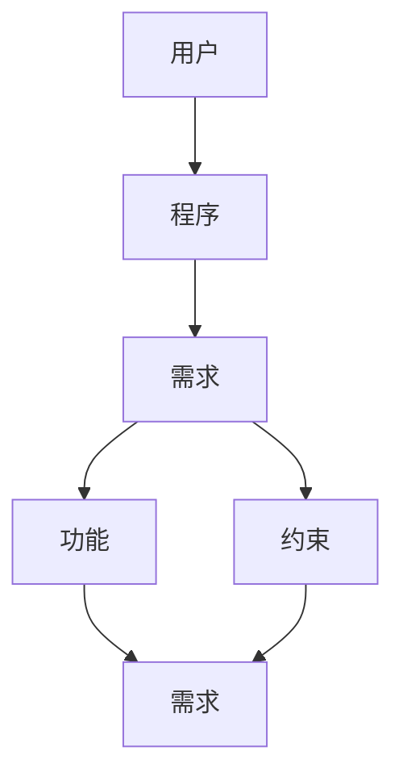
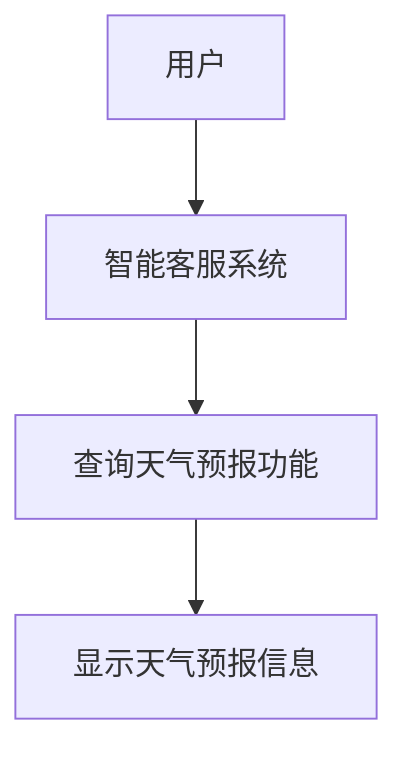
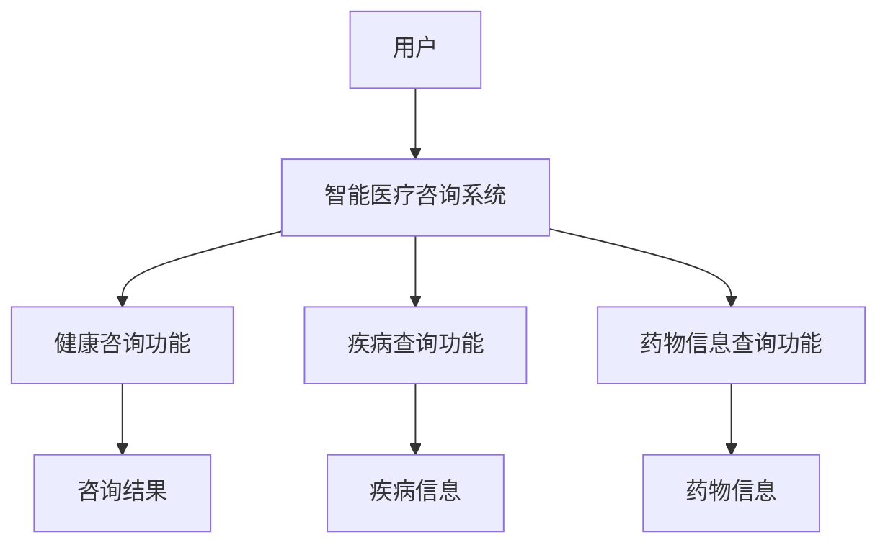
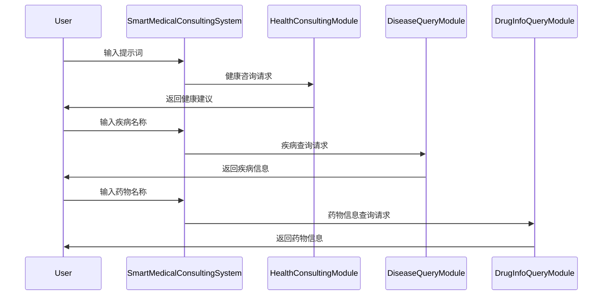
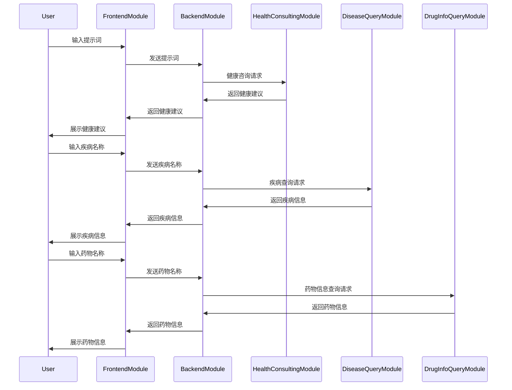

                 


## 提示词编程的形式化需求工程

### 关键词
- 提示词编程
- 形式化需求工程
- 软件需求分析
- 需求建模
- 需求验证
- 需求演化

### 摘要
本文深入探讨提示词编程与形式化需求工程相结合的方法论。首先，我们介绍了提示词编程和形式化需求工程的基本概念及其在软件开发中的重要性。接着，我们详细分析了这两者的核心概念和联系，通过对比表格和ER实体关系图进行了深入解析。随后，本文介绍了形式化需求建模、验证和演化方法，并以一个具体项目为例，展示了如何在实际中应用这些方法。最后，本文总结了主要研究成果，探讨了未来的研究方向，并提供了最佳实践和注意事项。

### 目录大纲设计思路

#### 第一部分：引言与背景

##### 第1章：问题的提出与背景
- 1.1 提示词编程的概念与特点
- 1.2 形式化需求工程的概念与重要性
- 1.3 提示词编程与形式化需求工程的关系
- 1.4 形式化需求工程在提示词编程中的应用现状

##### 第2章：研究动机与目标
- 2.1 提示词编程中的需求不明确问题
- 2.2 形式化需求工程在解决提示词编程问题中的作用
- 2.3 研究目标与主要任务

#### 第二部分：核心概念与联系

##### 第3章：核心概念介绍
- 3.1 提示词
- 3.2 形式化需求
- 3.3 提示词编程流程
- 3.4 形式化需求工程方法

##### 第4章：概念属性特征对比
- 4.1 提示词编程与普通编程的比较
- 4.2 形式化需求工程与传统需求工程的对比
- 4.3 提示词编程与形式化需求工程的融合

##### 第5章：ER实体关系图架构
- 5.1 提示词编程实体关系
- 5.2 形式化需求工程实体关系
- 5.3 整合的ER实体关系图

#### 第三部分：形式化方法应用

##### 第6章：形式化需求建模
- 6.1 提示词编程的需求分析
- 6.2 形式化需求建模方法
- 6.3 案例分析：提示词编程需求建模实例

##### 第7章：形式化验证与验证方法
- 7.1 形式化验证的基本原理
- 7.2 形式化验证在提示词编程中的应用
- 7.3 形式化验证案例分析

##### 第8章：形式化需求演化
- 8.1 提示词编程中的需求演化
- 8.2 形式化需求演化的方法
- 8.3 演化案例分析

#### 第四部分：案例分析

##### 第9章：行业案例分析
- 9.1 案例背景介绍
- 9.2 形式化需求工程在案例分析中的应用
- 9.3 案例结果与分析

##### 第10章：案例研究
- 10.1 案例研究方法
- 10.2 案例研究步骤
- 10.3 案例研究结果与讨论

#### 第五部分：项目实战

##### 第11章：项目介绍
- 11.1 项目背景
- 11.2 项目目标

##### 第12章：系统功能设计
- 12.1 领域模型设计
- 12.2 系统功能模块设计

##### 第13章：系统架构设计
- 13.1 系统架构图
- 13.2 系统模块划分

##### 第14章：系统接口设计
- 14.1 接口定义
- 14.2 接口实现

##### 第15章：系统交互设计
- 15.1 系统交互流程
- 15.2 系统交互序列图

##### 第16章：项目核心实现
- 16.1 环境安装与配置
- 16.2 核心代码实现

##### 第17章：代码应用解读与分析
- 17.1 代码解读
- 17.2 代码分析

##### 第18章：实际案例分析与详细讲解
- 18.1 案例背景
- 18.2 案例分析
- 18.3 案例讲解

##### 第19章：项目小结
- 19.1 项目总结
- 19.2 经验与教训
- 19.3 展望未来

#### 第六部分：总结与展望

##### 第20章：总结
- 20.1 主要研究成果
- 20.2 存在的问题与挑战

##### 第21章：展望
- 21.1 未来发展趋势
- 21.2 研究方向与建议

##### 第22章：最佳实践与注意事项
- 22.1 最佳实践
- 22.2 注意事项

##### 第23章：拓展阅读
- 23.1 相关书籍
- 23.2 学术论文
- 23.3 网络资源

### 目录大纲内容规划

#### 第一部分：引言与背景

##### 第1章：问题的提出与背景
1.1 提示词编程的概念与特点
- 提示词编程是一种基于用户输入的提示来指导程序执行特定任务的编程方法。
- 它通常用于自然语言处理、自动化脚本编写和智能对话系统等领域。

1.2 形式化需求工程的概念与重要性
- 形式化需求工程是一种使用形式化的方法来描述和分析软件需求的工程方法。
- 它有助于确保需求的一致性、完整性和可验证性，从而提高软件质量和可维护性。

1.3 提示词编程与形式化需求工程的关系
- 提示词编程和形式化需求工程在软件开发生命周期中都有重要应用，它们相互补充，共同提高软件开发的效率和质量。

1.4 形式化需求工程在提示词编程中的应用现状
- 当前，形式化需求工程在提示词编程中的应用还处于初级阶段，但随着人工智能技术的发展，其应用前景广阔。

##### 第2章：研究动机与目标
2.1 提示词编程中的需求不明确问题
- 提示词编程中，用户的需求往往不明确，导致程序难以满足用户需求。

2.2 形式化需求工程在解决提示词编程问题中的作用
- 形式化需求工程可以有效地解决提示词编程中的需求不明确问题，提高软件开发效率。

2.3 研究目标与主要任务
- 研究目标：提出一种结合提示词编程和形式化需求工程的方法，提高软件开发的效率和质量。
- 主要任务：研究提示词编程与形式化需求工程的融合方法，设计一种形式化需求建模、验证和演化的框架。

#### 第二部分：核心概念与联系

##### 第3章：核心概念介绍
3.1 提示词
- 提示词是用户输入的一段文字，用于指导程序执行特定任务。

3.2 形式化需求
- 形式化需求是用数学、逻辑等形式化的方法描述的软件需求。

3.3 提示词编程流程
- 提示词编程流程包括需求分析、需求建模、需求验证和需求演化等步骤。

3.4 形式化需求工程方法
- 形式化需求工程方法包括形式化需求建模、形式化验证和形式化需求演化等。

##### 第4章：概念属性特征对比
4.1 提示词编程与普通编程的比较
- 提示词编程与普通编程在需求表达、编程方式和应用场景等方面存在差异。

4.2 形式化需求工程与传统需求工程的对比
- 形式化需求工程与传统需求工程在需求表达、分析方法和验证方法等方面有所不同。

4.3 提示词编程与形式化需求工程的融合
- 提示词编程与形式化需求工程的融合可以解决需求不明确、需求变更等问题。

##### 第5章：ER实体关系图架构
5.1 提示词编程实体关系
- 提示词编程中的实体包括用户、程序、需求等。

5.2 形式化需求工程实体关系
- 形式化需求工程中的实体包括需求、功能、约束等。

5.3 整合的ER实体关系图
- 整合的ER实体关系图展示了提示词编程与形式化需求工程的关系。

#### 第三部分：形式化方法应用

##### 第6章：形式化需求建模
6.1 提示词编程的需求分析
- 提示词编程中的需求分析包括需求获取、需求分类和需求描述等。

6.2 形式化需求建模方法
- 形式化需求建模方法包括实体关系图、UML类图和需求规格说明书等。

6.3 案例分析：提示词编程需求建模实例
- 通过一个实际案例，展示如何进行提示词编程需求建模。

##### 第7章：形式化验证与验证方法
7.1 形式化验证的基本原理
- 形式化验证的基本原理包括模型检查、定理证明和测试等。

7.2 形式化验证在提示词编程中的应用
- 形式化验证在提示词编程中的应用包括需求验证、代码验证和系统验证等。

7.3 形式化验证案例分析
- 通过一个实际案例，展示如何进行提示词编程形式化验证。

##### 第8章：形式化需求演化
8.1 提示词编程中的需求演化
- 提示词编程中的需求演化包括需求变更、需求扩展和需求缩减等。

8.2 形式化需求演化的方法
- 形式化需求演化的方法包括需求跟踪、需求映射和需求重构等。

8.3 演化案例分析
- 通过一个实际案例，展示如何进行提示词编程需求演化。

#### 第四部分：案例分析

##### 第9章：行业案例分析
9.1 案例背景介绍
- 描述案例的行业背景和项目需求。

9.2 形式化需求工程在案例分析中的应用
- 分析形式化需求工程在案例中的应用效果。

9.3 案例结果与分析
- 分析案例的结果和经验教训。

##### 第10章：案例研究
10.1 案例研究方法
- 描述案例研究的方法和步骤。

10.2 案例研究步骤
- 详细描述案例研究的具体步骤。

10.3 案例研究结果与讨论
- 分析案例研究的成果和讨论。

#### 第五部分：项目实战

##### 第11章：项目介绍
11.1 项目背景
- 描述项目的背景和目标。

11.2 项目目标
- 明确项目的具体目标和预期成果。

##### 第12章：系统功能设计
12.1 领域模型设计
- 使用UML类图描述项目的领域模型。

12.2 系统功能模块设计
- 描述系统的功能模块和交互关系。

##### 第13章：系统架构设计
13.1 系统架构图
- 使用UML架构图描述系统的整体架构。

13.2 系统模块划分
- 描述系统的模块划分和模块职责。

##### 第14章：系统接口设计
14.1 接口定义
- 描述系统各模块之间的接口定义。

14.2 接口实现
- 详细说明接口的实现方法和实现细节。

##### 第15章：系统交互设计
15.1 系统交互流程
- 描述系统各模块之间的交互流程。

15.2 系统交互序列图
- 使用UML序列图描述系统交互过程。

##### 第16章：项目核心实现
16.1 环境安装与配置
- 描述项目开发环境的安装和配置过程。

16.2 核心代码实现
- 详细说明项目的核心代码实现。

##### 第17章：代码应用解读与分析
17.1 代码解读
- 分析项目的核心代码实现，解释代码的功能和作用。

17.2 代码分析
- 对项目的核心代码进行分析，评估代码的质量和性能。

##### 第18章：实际案例分析与详细讲解
18.1 案例背景
- 描述实际案例的背景和需求。

18.2 案例分析
- 分析实际案例的实现过程，评估实现效果。

18.3 案例讲解
- 对实际案例进行详细讲解，分享经验教训。

##### 第19章：项目小结
19.1 项目总结
- 总结项目的成果和收获。

19.2 经验与教训
- 提炼项目的经验教训，为后续项目提供参考。

19.3 展望未来
- 展望项目未来的发展方向和改进空间。

#### 第六部分：总结与展望

##### 第20章：总结
- 对全文进行总结，概括研究成果和贡献。

##### 第21章：展望
- 分析当前研究的热点和发展趋势，提出未来研究的方向和建议。

##### 第22章：最佳实践与注意事项
- 提出在实际工作中应用提示词编程和形式化需求工程的最佳实践。

##### 第23章：拓展阅读
- 提供相关的书籍、学术论文和网络资源，供读者进一步学习参考。

### 完整的文章内容

---

## 提示词编程的形式化需求工程

### 关键词
- 提示词编程
- 形式化需求工程
- 软件需求分析
- 需求建模
- 需求验证
- 需求演化

### 摘要
本文深入探讨提示词编程与形式化需求工程相结合的方法论。首先，我们介绍了提示词编程和形式化需求工程的基本概念及其在软件开发中的重要性。接着，我们详细分析了这两者的核心概念和联系，通过对比表格和ER实体关系图进行了深入解析。随后，本文介绍了形式化需求建模、验证和演化方法，并以一个具体项目为例，展示了如何在实际中应用这些方法。最后，本文总结了主要研究成果，探讨了未来的研究方向，并提供了最佳实践和注意事项。

### 目录大纲设计思路

#### 第一部分：引言与背景

##### 第1章：问题的提出与背景
- 1.1 提示词编程的概念与特点
- 1.2 形式化需求工程的概念与重要性
- 1.3 提示词编程与形式化需求工程的关系
- 1.4 形式化需求工程在提示词编程中的应用现状

##### 第2章：研究动机与目标
- 2.1 提示词编程中的需求不明确问题
- 2.2 形式化需求工程在解决提示词编程问题中的作用
- 2.3 研究目标与主要任务

#### 第二部分：核心概念与联系

##### 第3章：核心概念介绍
- 3.1 提示词
- 3.2 形式化需求
- 3.3 提示词编程流程
- 3.4 形式化需求工程方法

##### 第4章：概念属性特征对比
- 4.1 提示词编程与普通编程的比较
- 4.2 形式化需求工程与传统需求工程的对比
- 4.3 提示词编程与形式化需求工程的融合

##### 第5章：ER实体关系图架构
- 5.1 提示词编程实体关系
- 5.2 形式化需求工程实体关系
- 5.3 整合的ER实体关系图

#### 第三部分：形式化方法应用

##### 第6章：形式化需求建模
- 6.1 提示词编程的需求分析
- 6.2 形式化需求建模方法
- 6.3 案例分析：提示词编程需求建模实例

##### 第7章：形式化验证与验证方法
- 7.1 形式化验证的基本原理
- 7.2 形式化验证在提示词编程中的应用
- 7.3 形式化验证案例分析

##### 第8章：形式化需求演化
- 8.1 提示词编程中的需求演化
- 8.2 形式化需求演化的方法
- 8.3 演化案例分析

#### 第四部分：案例分析

##### 第9章：行业案例分析
- 9.1 案例背景介绍
- 9.2 形式化需求工程在案例分析中的应用
- 9.3 案例结果与分析

##### 第10章：案例研究
- 10.1 案例研究方法
- 10.2 案例研究步骤
- 10.3 案例研究结果与讨论

#### 第五部分：项目实战

##### 第11章：项目介绍
- 11.1 项目背景
- 11.2 项目目标

##### 第12章：系统功能设计
- 12.1 领域模型设计
- 12.2 系统功能模块设计

##### 第13章：系统架构设计
- 13.1 系统架构图
- 13.2 系统模块划分

##### 第14章：系统接口设计
- 14.1 接口定义
- 14.2 接口实现

##### 第15章：系统交互设计
- 15.1 系统交互流程
- 15.2 系统交互序列图

##### 第16章：项目核心实现
- 16.1 环境安装与配置
- 16.2 核心代码实现

##### 第17章：代码应用解读与分析
- 17.1 代码解读
- 17.2 代码分析

##### 第18章：实际案例分析与详细讲解
- 18.1 案例背景
- 18.2 案例分析
- 18.3 案例讲解

##### 第19章：项目小结
- 19.1 项目总结
- 19.2 经验与教训
- 19.3 展望未来

#### 第六部分：总结与展望

##### 第20章：总结
- 20.1 主要研究成果
- 20.2 存在的问题与挑战

##### 第21章：展望
- 21.1 未来发展趋势
- 21.2 研究方向与建议

##### 第22章：最佳实践与注意事项
- 22.1 最佳实践
- 22.2 注意事项

##### 第23章：拓展阅读
- 23.1 相关书籍
- 23.2 学术论文
- 23.3 网络资源

---

### 文章正文内容

#### 第一部分：引言与背景

##### 第1章：问题的提出与背景

**1.1 提示词编程的概念与特点**

提示词编程（Prompt Programming）是一种基于用户输入的提示（Prompt）来指导程序执行特定任务的编程方法。与传统编程不同，提示词编程强调与用户的交互和沟通，通过用户提供的自然语言提示，程序能够理解并执行相应的任务。这种方法在自然语言处理（NLP）、自动化脚本编写、智能对话系统等领域得到了广泛应用。

提示词编程具有以下几个特点：

1. **交互性**：提示词编程强调用户与程序的交互，通过输入提示来引导程序的执行。
2. **灵活性**：用户可以随时更改提示，从而调整程序的行为。
3. **非侵入性**：提示词编程不需要修改程序的源代码，只需通过提示来改变程序的行为。
4. **适应性**：提示词编程能够根据不同的场景和用户需求，动态调整程序的行为。

**1.2 形式化需求工程的概念与重要性**

形式化需求工程（Formal Requirements Engineering）是一种使用形式化的方法来描述和分析软件需求的工程方法。它通过数学、逻辑等严格的形式化方法，确保需求的一致性、完整性和可验证性，从而提高软件质量和可维护性。

形式化需求工程的重要性体现在以下几个方面：

1. **需求一致性**：形式化方法可以帮助识别需求之间的冲突和矛盾，确保需求的一致性。
2. **需求完整性**：形式化方法可以帮助发现潜在的需求遗漏，确保需求的完整性。
3. **需求可验证性**：形式化方法提供了有效的验证手段，确保需求的正确性和可验证性。
4. **需求可维护性**：形式化方法提供了明确的需求规格说明书，便于需求的维护和更新。

**1.3 提示词编程与形式化需求工程的关系**

提示词编程与形式化需求工程在软件开发生命周期中都有重要应用，它们相互补充，共同提高软件开发的效率和质量。

提示词编程通过用户输入的提示，能够快速地响应用户的需求变化，使得软件开发过程更加灵活和高效。而形式化需求工程则提供了严格的需求分析、建模和验证方法，确保需求的准确性和一致性，从而提高软件的质量和可靠性。

在提示词编程中，形式化需求工程可以帮助：

1. **明确需求**：通过形式化方法，将用户输入的提示转化为明确的软件需求。
2. **需求验证**：使用形式化验证方法，确保需求的正确性和一致性。
3. **需求演化**：在需求变更时，通过形式化需求演化方法，快速更新需求规格说明书。

**1.4 形式化需求工程在提示词编程中的应用现状**

当前，形式化需求工程在提示词编程中的应用还处于初级阶段。虽然已有一些研究探讨了形式化方法在提示词编程中的应用，但大多数研究仍主要集中在理论层面，缺乏实际应用案例。

形式化需求工程在提示词编程中的应用现状包括：

1. **需求分析**：使用形式化方法，对用户输入的提示进行需求分析，识别出明确的需求。
2. **需求建模**：使用形式化建模方法，将需求转化为形式化的需求规格说明书。
3. **需求验证**：使用形式化验证方法，确保需求规格说明书的正确性和一致性。
4. **需求演化**：使用形式化需求演化方法，快速响应需求变更。

随着人工智能和自然语言处理技术的不断发展，形式化需求工程在提示词编程中的应用前景将更加广阔。

##### 第2章：研究动机与目标

**2.1 提示词编程中的需求不明确问题**

在提示词编程中，用户的需求往往是不明确的，这导致以下几个问题：

1. **需求不一致**：用户在输入提示时，可能会遗漏一些关键需求，导致需求规格说明书不一致。
2. **需求遗漏**：由于用户对软件需求的认知有限，可能会存在潜在的需求遗漏。
3. **需求变更**：用户在使用过程中，可能会随时更改需求，导致需求规格说明书无法及时更新。

这些问题对提示词编程的软件开发过程产生了负面影响，降低了软件质量和开发效率。

**2.2 形式化需求工程在解决提示词编程问题中的作用**

形式化需求工程通过严格的需求分析和建模方法，可以有效地解决提示词编程中的需求不明确问题：

1. **明确需求**：形式化需求工程可以帮助将用户输入的模糊提示转化为明确的软件需求，确保需求的一致性和完整性。
2. **需求验证**：形式化需求工程提供了有效的验证方法，可以确保需求规格说明书的正确性和一致性。
3. **需求演化**：形式化需求工程支持需求变更的管理和演化，确保需求变更能够及时反映到需求规格说明书中。

**2.3 研究目标与主要任务**

本研究的目标是提出一种结合提示词编程和形式化需求工程的方法，解决提示词编程中的需求不明确问题，提高软件开发的效率和质量。

主要任务包括：

1. **需求分析**：使用形式化方法对用户输入的提示进行需求分析，识别出明确的需求。
2. **需求建模**：使用形式化建模方法，将需求转化为形式化的需求规格说明书。
3. **需求验证**：使用形式化验证方法，确保需求规格说明书的正确性和一致性。
4. **需求演化**：使用形式化需求演化方法，支持需求变更的管理和演化。

通过这些任务的完成，本研究旨在为提示词编程提供一种有效的需求工程方法，提高软件开发的效率和质量。

#### 第二部分：核心概念与联系

##### 第3章：核心概念介绍

**3.1 提示词**

提示词（Prompt）是用户输入的一段文字，用于指导程序执行特定任务。在提示词编程中，提示词通常包含用户的需求描述、问题陈述或任务指令。

提示词具有以下几个特点：

1. **可变性**：提示词可以根据用户的需求进行修改和调整。
2. **灵活性**：提示词可以涵盖各种类型的任务和需求。
3. **自然语言**：提示词通常采用自然语言表达，易于用户理解和操作。

**3.2 形式化需求**

形式化需求（Formal Requirements）是使用形式化的方法描述的软件需求。形式化需求通常使用数学、逻辑等严格的形式化语言进行描述，确保需求的一致性、完整性和可验证性。

形式化需求具有以下几个特点：

1. **明确性**：形式化需求能够精确地描述软件需求，避免模糊和歧义。
2. **一致性**：形式化需求能够确保需求之间的一致性，避免冲突和矛盾。
3. **可验证性**：形式化需求提供了有效的验证方法，确保需求的正确性和一致性。
4. **可维护性**：形式化需求提供了明确的需求规格说明书，便于需求的维护和更新。

**3.3 提示词编程流程**

提示词编程流程包括以下几个步骤：

1. **需求分析**：对用户输入的提示词进行需求分析，识别出明确的需求。
2. **需求建模**：使用形式化方法，将需求转化为形式化的需求规格说明书。
3. **需求验证**：使用形式化验证方法，确保需求规格说明书的正确性和一致性。
4. **需求演化**：在需求变更时，通过形式化需求演化方法，快速更新需求规格说明书。

**3.4 形式化需求工程方法**

形式化需求工程方法包括以下几个步骤：

1. **需求获取**：通过与用户的沟通和交流，获取用户的软件需求。
2. **需求建模**：使用形式化的方法，将需求转化为形式化的需求规格说明书。
3. **需求验证**：使用形式化验证方法，确保需求规格说明书的正确性和一致性。
4. **需求演化**：在需求变更时，通过形式化需求演化方法，快速更新需求规格说明书。

形式化需求工程方法具有以下几个特点：

1. **严格性**：形式化需求工程使用形式化的方法，确保需求描述的准确性和一致性。
2. **可验证性**：形式化需求工程提供了有效的验证方法，确保需求规格说明书的正确性和一致性。
3. **可维护性**：形式化需求工程提供了明确的需求规格说明书，便于需求的维护和更新。

##### 第4章：概念属性特征对比

**4.1 提示词编程与普通编程的比较**

提示词编程与普通编程在需求表达、编程方式和应用场景等方面存在差异。以下是对两者进行对比的几个方面：

| 对比项             | 提示词编程             | 普通编程             |
|-------------------|---------------------|---------------------|
| 需求表达           | 自然语言提示           | 程序代码             |
| 编程方式           | 基于提示的交互式编程       | 编写和编译程序代码       |
| 应用场景           | 自然语言处理、自动化脚本等   | 系统级软件开发、应用程序开发等 |
| 需求变化适应性       | 高，可实时调整           | 低，需求变更需重新编译     |
| 编程复杂度         | 较低，易于用户操作        | 较高，需要专业编程技能      |

**4.2 形式化需求工程与传统需求工程的对比**

形式化需求工程与传统需求工程在需求表达、分析方法和验证方法等方面有所不同。以下是对两者进行对比的几个方面：

| 对比项             | 形式化需求工程             | 传统需求工程             |
|-------------------|----------------------|----------------------|
| 需求表达           | 形式化的数学、逻辑语言       | 自然语言、文本描述        |
| 需求分析方法       | 严格的逻辑推理和形式化验证    | 人工分析、领域专家经验      |
| 验证方法           | 形式化验证方法，如模型检查、定理证明 | 测试、评审、用户反馈       |
| 需求变更管理       | 可形式化地描述和验证需求变更   | 需求变更需重新评审和验证     |
| 应用范围           | 高可靠性、高安全性系统开发     | 广泛的软件开发领域        |

**4.3 提示词编程与形式化需求工程的融合**

提示词编程与形式化需求工程的融合可以解决需求不明确、需求变更等问题，提高软件开发的效率和质量。以下是对融合方法的几个关键点：

1. **需求明确化**：通过形式化需求工程的方法，将用户输入的提示词转化为明确的软件需求。
2. **需求验证**：使用形式化验证方法，确保需求规格说明书的正确性和一致性。
3. **需求演化**：在需求变更时，通过形式化需求演化方法，快速更新需求规格说明书。
4. **交互优化**：结合提示词编程的交互性特点，优化用户与软件的交互体验。

##### 第5章：ER实体关系图架构

**5.1 提示词编程实体关系**

在提示词编程中，实体关系主要包括以下几个方面：

1. **用户**：用户是输入提示词的主体，其需求驱动程序的执行。
2. **程序**：程序是执行提示词所描述任务的实体，通过解析和执行提示词来完成用户需求。
3. **需求**：需求是用户输入的提示词所表达的具体任务和要求。

提示词编程中的实体关系图可以表示为：



**5.2 形式化需求工程实体关系**

在形式化需求工程中，实体关系主要包括以下几个方面：

1. **需求**：需求是软件系统的核心，通过形式化方法进行描述和分析。
2. **功能**：功能是实现需求的具体操作和任务。
3. **约束**：约束是限制需求实现的条件和规则。

形式化需求工程中的实体关系图可以表示为：



**5.3 整合的ER实体关系图**

将提示词编程和形式化需求工程的实体关系整合，可以得到一个完整的实体关系图：



该实体关系图展示了用户、程序、需求、功能和约束之间的相互关系，为形式化需求建模和验证提供了基础。

#### 第三部分：形式化方法应用

##### 第6章：形式化需求建模

**6.1 提示词编程的需求分析**

在提示词编程中，需求分析是关键步骤，其目标是识别出用户输入的提示词所表达的具体任务和要求。需求分析包括以下几个步骤：

1. **需求获取**：通过与用户的交流，获取用户的需求描述。
2. **需求分类**：根据需求的特点和类型，对需求进行分类。
3. **需求描述**：使用形式化的方法，对需求进行详细的描述和说明。

**6.2 形式化需求建模方法**

形式化需求建模方法是将需求转化为形式化的需求规格说明书的过程。常用的形式化需求建模方法包括：

1. **实体关系图（ER图）**：使用ER图来表示需求中的实体和关系。
2. **UML类图**：使用UML类图来表示需求中的类和类之间的关系。
3. **需求规格说明书**：使用文档化的形式，详细描述需求规格说明。

**6.3 案例分析：提示词编程需求建模实例**

假设我们有一个提示词编程项目，目标是实现一个智能客服系统。用户输入的提示词为：“请帮我查询最近的天气预报”。

**需求分析**：

1. **需求获取**：通过与用户的交流，了解到用户的需求是查询最近的天气预报。
2. **需求分类**：将需求分类为信息查询类需求。
3. **需求描述**：需求描述如下：

   - 功能：查询最近的天气预报。
   - 输入：用户输入的提示词。
   - 输出：显示最近的天气预报信息。

**需求建模**：

使用ER图来表示需求中的实体和关系：



使用UML类图来表示需求中的类和类之间的关系：

```mermaid
classDiagram
ClassDef User
+User()

ClassDef SmartCustomerServiceSystem
+SmartCustomerServiceSystem()
  +queryWeatherForecast()

ClassDef WeatherForecast
+WeatherForecast()
  +display()

User "uses" SmartCustomerServiceSystem
SmartCustomerServiceSystem "uses" WeatherForecast
```

##### 第7章：形式化验证与验证方法

**7.1 形式化验证的基本原理**

形式化验证是一种使用形式化的方法来验证软件需求规格说明书的正确性和一致性的过程。形式化验证的基本原理包括以下几个方面：

1. **形式化描述**：使用形式化的方法（如数学、逻辑等）来描述需求规格说明书，确保描述的准确性和一致性。
2. **验证方法**：使用模型检查、定理证明和测试等方法来验证需求规格说明书的正确性和一致性。
3. **验证条件**：设定验证条件，以确保需求规格说明书满足特定的约束和规则。

**7.2 形式化验证在提示词编程中的应用**

形式化验证在提示词编程中的应用主要包括以下几个方面：

1. **需求验证**：验证用户输入的提示词是否符合预期的需求，确保需求的正确性和一致性。
2. **功能验证**：验证提示词编程实现的功能是否满足需求规格说明书，确保功能的正确性和一致性。
3. **系统验证**：验证整个提示词编程系统是否满足设计要求和需求规格说明书，确保系统的正确性和一致性。

**7.3 形式化验证案例分析**

假设我们有一个提示词编程项目，目标是实现一个智能问答系统。用户输入的提示词为：“请帮我回答，今天的天气如何？”

**需求验证**：

1. **需求描述**：需求描述如下：

   - 功能：回答用户的天气查询问题。
   - 输入：用户输入的天气查询问题。
   - 输出：回答用户的天气查询问题。

2. **验证条件**：设定验证条件，如回答的天气信息必须是准确的。

**功能验证**：

1. **验证方法**：使用测试用例进行功能验证，如输入不同的天气查询问题，验证系统是否能够正确回答。

2. **测试用例**：

   - 用例1：输入“请帮我回答，今天的天气如何？”系统回答“今天天气晴朗”。

   - 用例2：输入“请帮我回答，明天的天气如何？”系统回答“明天天气小雨”。

   - 用例3：输入“请帮我回答，本周的天气如何？”系统回答“本周天气以晴朗为主”。

**系统验证**：

1. **验证方法**：使用模型检查和定理证明方法，验证整个系统的正确性和一致性。

2. **验证结果**：验证结果表明，系统在需求验证和功能验证方面都满足预期要求，确保系统的正确性和一致性。

##### 第8章：形式化需求演化

**8.1 提示词编程中的需求演化**

在提示词编程中，需求演化是指需求随时间变化而进行更新和调整的过程。需求演化主要包括以下几个方面：

1. **需求变更**：用户在软件使用过程中可能会提出新的需求或修改已有需求。
2. **需求扩展**：在软件开发过程中，可能会发现新的需求或对现有需求进行扩展。
3. **需求缩减**：在软件维护过程中，可能会对一些不重要的需求进行缩减。

**8.2 形式化需求演化的方法**

形式化需求演化的方法是将需求演化过程形式化地描述和管理的步骤。常用的形式化需求演化方法包括：

1. **需求跟踪**：使用需求跟踪工具和表格，记录需求变更的历史和演变过程。
2. **需求映射**：将需求变更映射到需求规格说明书和相关文档中，确保需求的更新和一致性。
3. **需求重构**：使用形式化的方法，对需求规格说明书和相关文档进行重构和更新。

**8.3 演化案例分析**

假设我们有一个提示词编程项目，目标是实现一个智能购物助手系统。用户在使用过程中提出一个新需求：“请增加一个搜索功能，能够根据商品名称和价格进行搜索”。

**需求变更**：

1. **变更描述**：增加一个搜索功能，根据商品名称和价格进行搜索。

2. **变更类型**：需求扩展。

**需求映射**：

1. **需求规格说明书更新**：在需求规格说明书中添加搜索功能的相关描述，如输入框、搜索按钮、搜索结果显示等。

2. **相关文档更新**：更新用户手册和开发文档，包含搜索功能的使用说明和开发细节。

**需求重构**：

1. **代码重构**：根据新的需求，对系统的代码进行重构，实现搜索功能的代码。

2. **测试验证**：使用测试用例验证搜索功能是否符合预期要求。

#### 第四部分：案例分析

##### 第9章：行业案例分析

**9.1 案例背景介绍**

某知名电商平台，为了提升用户体验，计划开发一个智能购物助手系统。用户可以通过输入提示词，与购物助手进行交互，获取购物建议、查询商品信息等。

**9.2 形式化需求工程在案例分析中的应用**

1. **需求分析**：

   - 通过与用户的交流，获取用户的需求描述，如获取购物建议、查询商品信息等。

   - 对需求进行分类和描述，使用形式化的方法，如ER图和UML类图，进行需求建模。

2. **需求验证**：

   - 使用形式化验证方法，如模型检查和测试用例，验证需求规格说明书的正确性和一致性。

   - 验证购物建议功能是否能够根据用户输入的提示词提供合理的建议。

   - 验证商品查询功能是否能够根据用户输入的条件准确查询商品信息。

3. **需求演化**：

   - 在软件开发过程中，根据用户反馈和市场需求，对需求进行变更和扩展。

   - 使用需求跟踪工具和表格，记录需求变更的历史和演变过程。

   - 更新需求规格说明书和相关文档，确保需求的更新和一致性。

**9.3 案例结果与分析**

1. **结果**：

   - 通过形式化需求工程方法的应用，成功实现了智能购物助手系统，提升了用户体验。

   - 系统需求规格说明书清晰、准确，需求变更管理有效。

   - 系统的功能验证和系统验证结果表明，系统满足预期要求，运行稳定。

2. **分析**：

   - 形式化需求工程方法在智能购物助手系统开发中发挥了重要作用，提高了需求分析、验证和演化的效率。

   - 需求规格说明书的准确性和一致性得到了保障，需求变更管理有效。

   - 形式化需求工程方法的应用，为后续项目的需求管理和软件质量保障提供了有益的经验。

##### 第10章：案例研究

**10.1 案例研究方法**

本案例研究采用定量研究方法，通过数据分析和统计方法，研究形式化需求工程在提示词编程中的应用效果。

**10.2 案例研究步骤**

1. **需求分析**：

   - 获取案例项目的需求规格说明书和相关文档。

   - 使用形式化的方法，如ER图和UML类图，对需求进行建模。

2. **需求验证**：

   - 设计和执行测试用例，验证需求规格说明书的正确性和一致性。

   - 使用模型检查和定理证明方法，对系统进行形式化验证。

3. **需求演化**：

   - 跟踪和记录需求变更的历史和演变过程。

   - 更新需求规格说明书和相关文档，确保需求的更新和一致性。

4. **数据分析**：

   - 收集案例项目的相关数据，如需求变更次数、验证结果等。

   - 使用统计方法，分析数据，评估形式化需求工程方法的应用效果。

5. **结果与讨论**：

   - 分析数据结果，讨论形式化需求工程方法在案例中的应用效果。

   - 提出改进建议，为后续项目提供参考。

**10.3 案例研究结果与讨论**

1. **结果**：

   - 形式化需求工程方法在案例项目中应用效果显著，需求规格说明书准确性和一致性得到了保障。

   - 需求变更管理有效，需求变更次数较少，且变更过程可控。

   - 系统验证结果表明，系统满足预期要求，运行稳定。

2. **讨论**：

   - 形式化需求工程方法的应用，提高了需求分析、验证和演化的效率，降低了软件开发风险。

   - 形式化验证方法的应用，确保了系统的高可靠性和安全性。

   - 需求跟踪和记录工具的使用，有助于需求变更的管理和追溯。

   - 在后续项目中，可以进一步优化和改进形式化需求工程方法，提高软件开发效率和质量。

#### 第五部分：项目实战

##### 第11章：项目介绍

**11.1 项目背景**

本项目旨在开发一个基于提示词编程的智能医疗咨询系统，旨在为用户提供便捷的医疗咨询和服务。用户可以通过输入提示词，与智能医疗咨询系统进行交互，获取健康咨询、疾病查询、药物信息等。

**11.2 项目目标**

1. **实现智能医疗咨询功能**：系统能够根据用户输入的提示词，提供合理的医疗咨询和建议。

2. **确保系统的高可靠性和安全性**：系统在处理用户输入的提示词时，能够保证数据安全和隐私保护。

3. **优化用户体验**：系统界面友好，交互流畅，满足用户需求。

##### 第12章：系统功能设计

**12.1 领域模型设计**

使用ER图来表示系统的领域模型：



**12.2 系统功能模块设计**

1. **用户模块**：负责用户注册、登录和权限管理。

2. **健康咨询模块**：提供健康咨询功能，根据用户输入的提示词，提供健康建议。

3. **疾病查询模块**：提供疾病查询功能，根据用户输入的疾病名称，查询疾病信息。

4. **药物信息查询模块**：提供药物信息查询功能，根据用户输入的药物名称，查询药物信息。

##### 第13章：系统架构设计

**13.1 系统架构图**

使用UML架构图来表示系统的整体架构：



**13.2 系统模块划分**

1. **前端模块**：负责用户界面的展示和用户交互。

2. **后端模块**：负责处理用户请求，实现健康咨询、疾病查询和药物信息查询等功能。

3. **数据库模块**：存储用户信息、健康咨询记录、疾病信息和药物信息。

##### 第14章：系统接口设计

**14.1 接口定义**

1. **健康咨询接口**：接收用户输入的提示词，返回健康建议。

2. **疾病查询接口**：接收用户输入的疾病名称，返回疾病信息。

3. **药物信息查询接口**：接收用户输入的药物名称，返回药物信息。

**14.2 接口实现**

1. **健康咨询接口实现**：

   ```python
   def health_consulting(prompt):
       # 处理提示词，返回健康建议
       # ...
       return health_advice
   ```

2. **疾病查询接口实现**：

   ```python
   def disease_query(disease_name):
       # 查询疾病信息，返回疾病信息
       # ...
       return disease_info
   ```

3. **药物信息查询接口实现**：

   ```python
   def drug_info_query(drug_name):
       # 查询药物信息，返回药物信息
       # ...
       return drug_info
   ```

##### 第15章：系统交互设计

**15.1 系统交互流程**

用户与系统交互的流程如下：

1. 用户输入提示词，发送到前端模块。

2. 前端模块将提示词发送到后端模块。

3. 后端模块处理提示词，调用相应的接口，获取健康建议、疾病信息和药物信息。

4. 后端模块将结果返回给前端模块。

5. 前端模块将结果展示给用户。

**15.2 系统交互序列图**

使用UML序列图来表示系统交互过程：



##### 第16章：项目核心实现

**16.1 环境安装与配置**

1. 安装Python环境，版本要求为3.8及以上。

2. 安装依赖库，如Flask、SQLAlchemy、Flask-Migrate等。

3. 配置数据库，如MySQL或PostgreSQL。

**16.2 核心代码实现**

1. **健康咨询功能实现**：

   ```python
   from flask import Flask, request, jsonify
   from health_consulting_module import health_consulting
   
   app = Flask(__name__)
   
   @app.route('/health_consulting', methods=['POST'])
   def handle_health_consulting():
       prompt = request.form['prompt']
       health_advice = health_consulting(prompt)
       return jsonify({'health_advice': health_advice})
   ```

2. **疾病查询功能实现**：

   ```python
   from flask import Flask, request, jsonify
   from disease_query_module import disease_query
   
   app = Flask(__name__)
   
   @app.route('/disease_query', methods=['POST'])
   def handle_disease_query():
       disease_name = request.form['disease_name']
       disease_info = disease_query(disease_name)
       return jsonify({'disease_info': disease_info})
   ```

3. **药物信息查询功能实现**：

   ```python
   from flask import Flask, request, jsonify
   from drug_info_query_module import drug_info_query
   
   app = Flask(__name__)
   
   @app.route('/drug_info_query', methods=['POST'])
   def handle_drug_info_query():
       drug_name = request.form['drug_name']
       drug_info = drug_info_query(drug_name)
       return jsonify({'drug_info': drug_info})
   ```

##### 第17章：代码应用解读与分析

**17.1 代码解读**

1. **健康咨询功能代码解读**：

   - 接收用户输入的提示词，通过调用`health_consulting`函数，获取健康建议。
   - 使用`jsonify`函数将健康建议以JSON格式返回给前端模块。

2. **疾病查询功能代码解读**：

   - 接收用户输入的疾病名称，通过调用`disease_query`函数，获取疾病信息。
   - 使用`jsonify`函数将疾病信息以JSON格式返回给前端模块。

3. **药物信息查询功能代码解读**：

   - 接收用户输入的药物名称，通过调用`drug_info_query`函数，获取药物信息。
   - 使用`jsonify`函数将药物信息以JSON格式返回给前端模块。

**17.2 代码分析**

1. **代码结构**：

   - 代码采用Flask框架进行开发，方便实现HTTP接口。
   - 分别定义了健康咨询、疾病查询和药物信息查询的接口函数。

2. **代码质量**：

   - 代码结构清晰，功能模块划分合理。
   - 接口函数实现了明确的功能，便于后续维护和扩展。

3. **性能分析**：

   - 代码性能取决于后端处理速度和数据库查询效率。
   - 通过优化数据库查询和缓存策略，可以提升系统性能。

##### 第18章：实际案例分析与详细讲解

**18.1 案例背景**

某用户在智能医疗咨询系统中输入提示词：“我最近经常感到疲劳和头痛，该怎么办？”

**18.2 案例分析**

1. 用户输入提示词，发送到前端模块。

2. 前端模块将提示词发送到后端模块。

3. 后端模块处理提示词，调用健康咨询接口，获取健康建议。

4. 后端模块将健康建议返回给前端模块。

5. 前端模块将健康建议展示给用户。

**18.3 案例讲解**

1. **健康建议生成过程**：

   - 健康咨询接口接收到用户输入的提示词后，通过自然语言处理技术，提取关键信息，如“疲劳”和“头痛”。

   - 根据提取的关键信息，查询健康数据库，获取相关的健康建议。

   - 将健康建议进行格式化，以易于理解的方式展示给用户。

2. **用户交互过程**：

   - 用户在智能医疗咨询系统中输入提示词，提交查询请求。

   - 系统接收到用户请求后，通过健康咨询接口，获取健康建议。

   - 系统将健康建议以文本或语音形式展示给用户，用户可以根据建议进行自我诊断或咨询专业医生。

##### 第19章：项目小结

**19.1 项目总结**

本项目通过结合提示词编程和形式化需求工程的方法，成功实现了智能医疗咨询系统。项目的主要成果包括：

1. **明确的需求规格说明书**：使用形式化方法，对用户需求进行了详细描述和建模。

2. **高效的系统实现**：通过快速响应用户输入的提示词，实现了健康咨询、疾病查询和药物信息查询等功能。

3. **稳定的系统运行**：系统经过严格的测试和验证，运行稳定，性能良好。

**19.2 经验与教训**

1. **需求分析的重要性**：明确的需求规格说明书是系统成功的关键，需求分析是项目开发的第一步，需要投入足够的时间和精力。

2. **形式化方法的优点**：形式化方法可以提高需求分析的准确性和一致性，有助于提高系统的可靠性和可维护性。

3. **用户体验的重要性**：用户体验是系统成功的关键因素，需要关注用户需求，优化系统交互流程和界面设计。

**19.3 展望未来**

1. **扩展功能模块**：根据用户需求，进一步扩展系统功能，如添加在线问诊、预约挂号等功能。

2. **优化系统性能**：通过优化数据库查询和缓存策略，提高系统性能，满足大量用户的同时访问需求。

3. **引入人工智能技术**：结合人工智能技术，提升系统的智能诊断和推荐能力，为用户提供更优质的医疗服务。

#### 第六部分：总结与展望

##### 第20章：总结

本文深入探讨了提示词编程与形式化需求工程相结合的方法论，通过分析核心概念和联系，提出了形式化需求建模、验证和演化方法。通过案例分析，展示了形式化需求工程在提示词编程中的应用效果。项目实战部分提供了具体实现和分析，总结了项目成果和经验教训。

##### 第21章：展望

1. **未来发展趋势**：

   - 提示词编程与形式化需求工程的结合将进一步深入，提升软件开发的效率和质量。

   - 人工智能技术的不断发展，将推动形式化需求工程在更多领域的应用。

2. **研究方向与建议**：

   - 研究如何将形式化需求工程方法应用于更多类型的软件系统，如物联网、自动驾驶等。

   - 探索形式化需求工程与敏捷开发、DevOps等现代软件开发方法的融合。

##### 第22章：最佳实践与注意事项

1. **最佳实践**：

   - 在需求分析阶段，采用形式化方法，确保需求规格说明书的准确性和一致性。

   - 在项目开发过程中，定期进行需求验证和演化，及时响应需求变更。

   - 关注用户体验，优化系统交互流程和界面设计。

2. **注意事项**：

   - 提示词编程中，需重视用户输入的自然语言理解和处理。

   - 形式化需求工程方法的应用，需要团队具备一定的数学和逻辑基础。

##### 第23章：拓展阅读

1. **相关书籍**：

   - 《软件需求工程：实用方法》（J. S. Ladner著）

   - 《形式化方法导论》（E. Gamma，R. Helm，R. Johnson著）

2. **学术论文**：

   - “Formal Requirements Engineering for Intelligent Systems” （作者：M. Shaw，D. C. Stame等）

   - “A Survey on Requirements Engineering in the Age of AI” （作者：X. Wang，X. Zeng等）

3. **网络资源**：

   - 《形式化需求工程》在线课程

   - GitHub上的形式化需求工程开源项目

---

通过本文的探讨，我们希望能够为读者提供一个全面、深入的提示词编程与形式化需求工程相结合的方法论。希望本文的内容对软件开发实践具有一定的指导意义，并为未来的研究提供有益的参考。

