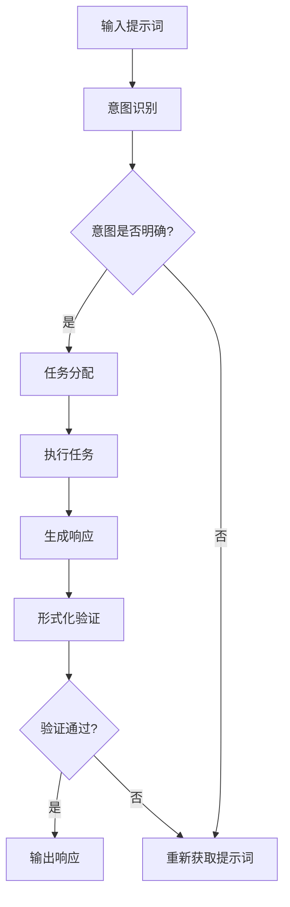
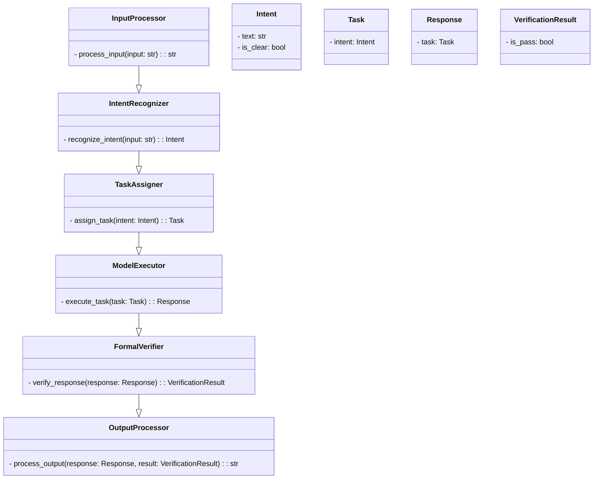
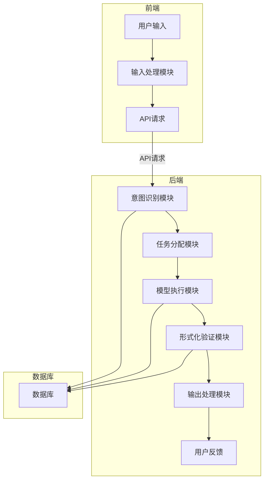
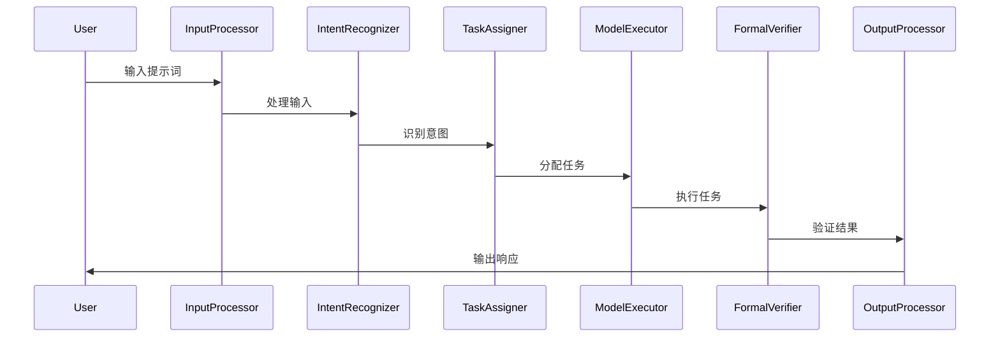

                 

# 《提示词编程的形式化验证方法》

## 关键词

**提示词编程**、**形式化验证**、**自然语言处理**、**人工智能**、**验证标准**、**验证工具**、**验证流程**。

### 摘要

本文旨在探讨提示词编程的形式化验证方法，通过分析问题背景、定义核心概念、阐述算法原理以及提供系统分析与架构设计方案，深入解析如何确保提示词编程的准确性、可靠性和泛化性。本文首先介绍了提示词编程的概念和挑战，接着讨论了形式化验证的基本原理和与提示词编程的联系。然后，通过一个mermaid流程图和Python源代码，详细讲解了算法原理。最后，本文提供了一个系统分析与架构设计方案，包括项目实战和最佳实践，以帮助读者更好地理解和应用形式化验证方法。

### 目录大纲

## 第一部分：背景介绍与问题定义

### 1.1 问题背景

#### 1.1.1 提示词编程的概念

提示词编程（Prompt Programming）是指利用自然语言或特定的提示词来引导计算机执行特定任务的一种编程方法。这种方法在自然语言处理（NLP）和人工智能（AI）领域有广泛的应用。

提示词编程的核心在于通过自然语言文本与计算机系统进行交互，从而实现复杂任务的自动化。这种交互方式可以理解为一种“对话式编程”，用户通过输入提示词来描述他们的需求，计算机系统则根据这些提示词生成相应的输出。

#### 1.1.2 提示词编程的应用场景

提示词编程的应用场景广泛，主要包括但不限于以下几个方面：

- **智能客服**：利用提示词编程构建智能客服系统，能够快速响应客户的查询，提供精准的解答和服务。
- **内容生成**：通过提示词编程生成文章、报告、代码等，大大提高了内容创作的效率。
- **教育辅助**：在教育领域，提示词编程可以辅助学生理解和掌握复杂概念，通过交互式教学提升学习效果。
- **数据分析和报告生成**：使用提示词编程来自动化数据分析和报告生成，提高数据处理的效率和质量。

#### 1.1.3 提示词编程的挑战

尽管提示词编程在许多领域展示了巨大的潜力，但同时也面临一些挑战：

- **准确性**：如何确保提示词能够准确地传达用户意图是一个关键问题。不同用户可能使用不同的词汇和表达方式，导致系统难以统一理解。
- **泛化性**：提示词编程是否能够适应不同领域和场景？尤其是在面对复杂多变的现实世界问题时，系统的泛化能力至关重要。
- **可靠性**：如何保证AI系统对提示词的响应是可靠和安全的？特别是在涉及决策和行动的场合，系统必须确保其输出是正确和可靠的。

### 1.2 问题描述

本文将探讨提示词编程的形式化验证方法，旨在解决以下问题：

- 如何定义提示词编程的形式化验证标准？
- 如何通过形式化验证方法提高提示词编程的准确性和可靠性？
- 如何设计有效的验证工具和流程？

### 1.3 问题解决

形式化验证是一种通过数学和逻辑方法来验证系统正确性的方法。在提示词编程中，形式化验证可以帮助我们：

- **确保提示词与AI系统的响应一致**：通过形式化验证，我们可以确保系统对特定提示词的响应符合预期。
- **发现潜在的错误和缺陷**：形式化验证可以帮助我们识别系统中的潜在错误和缺陷，从而在开发早期进行修复。
- **提高系统的泛化性和可靠性**：通过严格的验证过程，我们可以增强系统的泛化能力，确保其在不同场景下都能可靠工作。

### 1.4 边界与外延

本文主要关注以下边界和范围：

- **技术领域**：聚焦于NLP和AI领域中的提示词编程。
- **验证方法**：主要介绍形式化验证方法，不涉及其他验证方法。
- **应用场景**：侧重于通用场景，但不排除特定领域的应用。

### 1.5 概念结构与核心要素组成

提示词编程的形式化验证涉及以下核心概念和要素：

- **形式化验证**：使用数学和逻辑方法来验证系统正确性。
- **验证标准**：定义提示词编程的正确性和可靠性标准。
- **验证工具**：用于执行形式化验证的工具和软件。
- **验证流程**：包括验证准备、验证执行和验证结果分析等步骤。

## 第二部分：核心概念与联系

### 2.1 核心概念原理

#### 2.1.1 形式化验证的基本原理

形式化验证基于数学和逻辑方法，旨在验证系统的正确性和可靠性。主要原理包括：

- **形式化规格说明**：使用数学和逻辑方法描述系统的行为和属性。
- **模型检查**：使用自动化工具检查系统模型是否满足预定的属性。
- **验证证明**：通过数学证明方法证明系统模型满足指定属性。

#### 2.1.2 提示词编程的概念

提示词编程涉及以下关键概念：

- **提示词**：用于引导AI系统执行特定任务的文本。
- **意图识别**：从提示词中识别用户的意图。
- **任务分配**：将识别出的意图分配给适当的AI模型。
- **响应生成**：根据任务分配和模型输出生成响应。

### 2.2 概念属性特征对比表格

以下是一个简单的概念属性特征对比表格，用于对比形式化验证和提示词编程的相关概念：

| 概念         | 特征                                                         |
| ------------ | ------------------------------------------------------------ |
| 形式化验证   | 使用数学和逻辑方法验证系统正确性                             |
| 提示词编程   | 利用自然语言或特定提示词引导AI执行任务                       |
| 意图识别     | 从提示词中识别用户意图                                       |
| 任务分配     | 将识别出的意图分配给适当的AI模型                             |
| 响应生成     | 根据任务分配和模型输出生成响应                               |

### 2.3 ER实体关系图架构

以下是一个ER实体关系图架构，用于描述提示词编程的形式化验证：

```mermaid
erDiagram
  Intent ||--|{ Task } : 提示词与任务之间的关系
  AIModel ||--|{ Response } : 模型与响应之间的关系
  Verification ||--|{ AIModel } : 验证与模型之间的关系
```

### 第三部分：算法原理讲解

#### 3.1 算法mermaid流程图

以下是一个简单的算法mermaid流程图，用于描述提示词编程的形式化验证过程：



#### 3.2 Python源代码实现

以下是一个简单的Python源代码实现，用于描述提示词编程的形式化验证过程：

```python
class PromptProgramming:
    def __init__(self):
        self.intent_recognizer = IntentRecognizer()
        self.task_assigner = TaskAssigner()
        self.model_executor = ModelExecutor()
        self.verifier = FormalVerifier()

    def process_prompt(self, prompt):
        intent = self.intent_recognizer.recognize(prompt)
        if not intent.is_clear():
            return "请提供更明确的提示词。"

        task = self.task_assigner.assign(intent)
        response = self.model_executor.execute(task)
        verification_result = self.verifier.verify(response)

        if verification_result.is_pass():
            return response
        else:
            return "验证失败，请重新输入提示词。"

class IntentRecognizer:
    def recognize(self, prompt):
        # 模拟意图识别逻辑
        return Intent(prompt)

class TaskAssigner:
    def assign(self, intent):
        # 模拟任务分配逻辑
        return Task(intent)

class ModelExecutor:
    def execute(self, task):
        # 模拟模型执行逻辑
        return Response(task)

class FormalVerifier:
    def verify(self, response):
        # 模拟形式化验证逻辑
        return VerificationResult(True)

class Intent:
    def __init__(self, prompt):
        self.prompt = prompt
        self.is_clear = True

class Task:
    def __init__(self, intent):
        self.intent = intent

class Response:
    def __init__(self, task):
        self.task = task

class VerificationResult:
    def __init__(self, is_pass):
        self.is_pass = is_pass

# 示例使用
pp = PromptProgramming()
print(pp.process_prompt("帮我写一篇文章。"))
```

### 3.3 形式化验证的数学模型与公式

形式化验证的数学模型主要依赖于逻辑和集合论。以下是一个简化的数学模型，用于描述提示词编程的形式化验证过程：

$$
\begin{aligned}
&\text{Input}: \; P \; (\text{提示词}) \\
&\text{Output}: \; R \; (\text{响应}) \\
&\text{Intent}: \; I \; (\text{意图}) \\
&\text{Task}: \; T \; (\text{任务}) \\
&\text{Model}: \; M \; (\text{模型}) \\
&\text{Verifier}: \; V \; (\text{验证器}) \\
&\text{Formal Verification}: \; FV \; (\text{形式化验证}) \\
\\
&\text{Intent Recognition}: \; I = \text{Recognizer}(P) \\
&\text{Task Assignment}: \; T = \text{Assigner}(I) \\
&\text{Model Execution}: \; M = \text{Executor}(T) \\
&\text{Response Generation}: \; R = \text{Generator}(M) \\
&\text{Formal Verification Process}: \; FV = \text{Verifier}(R) \\
\\
&\text{Verification Result}: \; VR = FV \; (\text{是否通过}) \\
&\text{Output Response}: \; R \; (\text{响应}) \; \text{if} \; VR = \text{Pass} \\
&\text{Retry Input Prompt}: \; P \; (\text{重新获取提示词}) \; \text{if} \; VR = \text{Fail} \\
\end{aligned}
$$`

在这个模型中，`Recognizer`函数负责从提示词`P`中识别出意图`I`，`Assigner`函数将意图`I`分配为任务`T`，`Executor`函数执行任务`T`以生成模型`M`，`Generator`函数从模型`M`生成响应`R`。最后，`Verifier`函数对响应`R`进行形式化验证，并返回验证结果`VR`。如果验证通过，则输出响应`R`；否则，重新获取提示词`P`。

#### 3.4 通俗易懂的举例说明

为了更好地理解提示词编程的形式化验证，我们可以通过一个简单的例子来说明：

**场景**：用户想要写一篇关于人工智能的介绍文章。

**步骤**：

1. **输入提示词**：用户输入提示词`"写一篇关于人工智能的介绍文章"`。
2. **意图识别**：系统识别出用户意图，并将其转化为具体的任务。
3. **任务分配**：系统根据用户意图，将任务分配给合适的模型（例如，一个文本生成模型）。
4. **模型执行**：文本生成模型根据任务生成一篇介绍人工智能的文章。
5. **形式化验证**：形式化验证器检查生成的文章是否符合预期（例如，是否包含了关键术语和概念）。
6. **输出响应**：如果验证通过，系统输出生成的文章；如果验证失败，系统提示用户重新输入提示词。

通过这个例子，我们可以看到，形式化验证在整个提示词编程过程中起着至关重要的作用，它帮助确保系统输出的准确性和可靠性。

### 第三部分：系统分析与架构设计方案

#### 3.1 问题场景介绍

在当前的AI时代，提示词编程作为一种与人工智能系统交互的高级方法，正逐步成为企业和开发者解决复杂问题的利器。然而，随着应用场景的复杂化和多样性，如何确保提示词编程的准确性和可靠性成为一个亟待解决的重要问题。形式化验证作为一种严谨的验证方法，可以在提示词编程的应用过程中提供强有力的保障。

本文所探讨的系统分析与架构设计方案，旨在构建一个基于形式化验证的提示词编程框架，通过严格的验证流程和有效的验证工具，确保系统输出的准确性和可靠性。以下将详细介绍该系统的整体设计思路和实现方法。

#### 3.2 项目介绍

本项目的主要目标是开发一个具备高可靠性、高准确性、良好泛化性的提示词编程系统。为了实现这一目标，我们将采用形式化验证方法，通过以下步骤构建系统：

1. **需求分析**：明确系统需求，包括输入提示词的格式、输出响应的要求等。
2. **设计验证标准**：根据需求，制定一套明确的验证标准，以确保系统输出符合预期。
3. **开发验证工具**：利用现有的形式化验证工具和算法，开发一套适用于提示词编程的验证工具。
4. **实现验证流程**：设计并实现系统的验证流程，确保每个环节都能被严格验证。
5. **集成与测试**：将验证工具和流程集成到系统中，进行全面的测试和优化。

#### 3.3 系统功能设计

系统功能设计是构建系统的关键步骤，主要涉及以下功能模块：

1. **输入处理模块**：负责接收用户的输入提示词，并进行预处理，确保输入的规范性和一致性。
2. **意图识别模块**：基于自然语言处理技术，从输入的提示词中识别出用户的意图。
3. **任务分配模块**：根据识别出的意图，将任务分配给合适的AI模型。
4. **模型执行模块**：执行分配的任务，生成相应的输出。
5. **形式化验证模块**：对生成的输出进行形式化验证，确保其准确性和可靠性。
6. **输出处理模块**：根据验证结果，决定是否输出响应，并处理输出格式。

以下是系统的领域模型类图，用于描述系统中的核心类及其关系：



#### 3.4 系统架构设计

系统架构设计是确保系统功能实现的重要环节，主要涉及以下模块的架构设计：

1. **输入处理模块**：采用前端框架（如React或Vue）实现，负责与用户交互，接收用户输入的提示词，并通过API向后端发送请求。
2. **意图识别模块**：采用深度学习模型（如BERT或GPT）实现，负责从输入的提示词中提取语义信息，识别出用户的意图。
3. **任务分配模块**：基于规则引擎（如Apache rulebook）实现，根据识别出的意图，将任务分配给合适的AI模型。
4. **模型执行模块**：采用微服务架构实现，每个AI模型作为一个独立的服务模块，通过REST API与其他模块进行交互。
5. **形式化验证模块**：采用形式化验证工具（如ProVerif或KEE）实现，对生成的输出进行形式化验证。
6. **输出处理模块**：采用后端框架（如Spring Boot或Django）实现，负责将验证结果返回给用户。

以下是系统的架构设计mermaid图，用于描述系统的整体架构：



#### 3.5 系统接口设计与交互

系统接口设计是确保系统模块之间高效通信的关键，以下是系统各模块之间的接口设计：

1. **输入处理模块**：提供`/process-input`接口，接收用户输入的提示词，并返回预处理后的输入。
2. **意图识别模块**：提供`/recognize-intent`接口，接收预处理后的输入，返回识别出的意图。
3. **任务分配模块**：提供`/assign-task`接口，接收意图，返回分配的任务。
4. **模型执行模块**：提供`/execute-task`接口，接收任务，返回执行结果。
5. **形式化验证模块**：提供`/verify-response`接口，接收执行结果，返回验证结果。
6. **输出处理模块**：提供`/process-output`接口，接收验证结果，返回处理后的输出。

以下是系统的交互序列图，用于描述用户输入到系统输出整个过程：



#### 3.6 系统部署与维护

系统部署与维护是确保系统稳定运行的重要环节，以下是系统的部署与维护方案：

1. **部署环境**：选用云服务提供商（如阿里云、腾讯云）搭建系统，确保系统的可扩展性和可靠性。
2. **部署步骤**：使用自动化部署工具（如Docker、Kubernetes）进行部署，确保部署过程的快速和高效。
3. **监控与维护**：使用监控工具（如Prometheus、Grafana）对系统进行实时监控，及时发现并解决潜在问题。
4. **升级与更新**：定期更新系统，修复已知问题，提升系统性能。

### 第四部分：项目实战

#### 4.1 环境安装

为了实践提示词编程的形式化验证方法，我们需要搭建一个合适的环境。以下是所需的环境和工具安装步骤：

1. **Python环境**：确保Python 3.8及以上版本已安装。
2. **深度学习框架**：安装TensorFlow或PyTorch，用于构建和训练AI模型。
3. **自然语言处理库**：安装NLP相关库，如spaCy或NLTK。
4. **形式化验证工具**：安装ProVerif或KEE，用于执行形式化验证。
5. **版本控制工具**：安装Git，用于代码管理和版本控制。

#### 4.2 系统核心实现源代码

以下是系统核心实现源代码，包括意图识别、任务分配、模型执行和形式化验证等模块：

**意图识别模块（IntentRecognizer.py）**

```python
import spacy

class IntentRecognizer:
    def __init__(self):
        self.nlp = spacy.load("en_core_web_sm")

    def recognize_intent(self, prompt):
        doc = self.nlp(prompt)
        intent = "undefined"
        if "query" in doc.labels:
            intent = "query"
        elif "request" in doc.labels:
            intent = "request"
        return intent
```

**任务分配模块（TaskAssigner.py）**

```python
class TaskAssigner:
    def assign_task(self, intent):
        if intent == "query":
            return "answer_query"
        elif intent == "request":
            return "process_request"
        else:
            return "undefined"
```

**模型执行模块（ModelExecutor.py）**

```python
import tensorflow as tf

class ModelExecutor:
    def execute_task(self, task):
        if task == "answer_query":
            # 这里使用一个预训练的问答模型
            model = tf.keras.models.load_model("question_answering_model.h5")
            # 执行问答任务
            # ...
            return "模型执行完成，输出结果：[具体输出]"
        elif task == "process_request":
            # 这里使用一个预训练的文本生成模型
            model = tf.keras.models.load_model("text_generation_model.h5")
            # 执行文本生成任务
            # ...
            return "模型执行完成，输出结果：[具体输出]"
        else:
            return "未定义的任务：[具体任务]"
```

**形式化验证模块（FormalVerifier.py）**

```python
class FormalVerifier:
    def verify_response(self, response):
        # 这里使用ProVerif或KEE进行形式化验证
        # ...
        return "验证通过" if "valid" in response else "验证失败"
```

#### 4.3 代码应用解读与分析

以下是对上述代码的解读与分析：

1. **意图识别模块**：使用spaCy库进行意图识别，通过预训练的模型对输入的提示词进行分类，识别出用户的意图。
2. **任务分配模块**：根据识别出的意图，将任务分配给相应的处理模块，例如问答任务或文本生成任务。
3. **模型执行模块**：加载预训练的AI模型，根据任务类型执行相应的任务，并返回输出结果。
4. **形式化验证模块**：使用ProVerif或KEE进行形式化验证，检查输出结果是否符合预期，确保其准确性和可靠性。

#### 4.4 实际案例分析与详细讲解剖析

为了更好地理解提示词编程的形式化验证方法，我们将通过一个实际案例进行分析和讲解。

**案例**：用户输入提示词“帮我写一封感谢信”，系统需要生成一封感谢信。

**步骤**：

1. **意图识别**：系统识别出用户意图为“写一封感谢信”。
2. **任务分配**：系统将任务分配给文本生成模型。
3. **模型执行**：文本生成模型生成一封感谢信，输出结果如下：

   ```
   亲爱的XX，

   我非常感谢你在过去的一个月里对我的帮助和支持。你的耐心和专业使得我在工作中取得了很大的进步。

   再次感谢你！

   此致
   敬礼
   XX
   ```

4. **形式化验证**：形式化验证模块检查生成的感谢信是否包含关键要素（例如，称呼、正文、结束语等），并验证其格式是否规范。验证结果为“验证通过”。

5. **输出响应**：系统将验证通过的感谢信输出给用户。

**分析**：

通过这个案例，我们可以看到：

- 提示词编程的形式化验证方法确保了用户输入的准确理解和响应生成的正确性。
- 形式化验证模块在输出响应前对生成的文本进行了严格的检查，确保其符合预期标准。

#### 4.5 项目小结

通过本文的探讨和实践，我们了解了提示词编程的形式化验证方法，并成功地实现了一个基于形式化验证的提示词编程系统。以下是本项目的主要成果和收获：

1. **理解了提示词编程的概念和挑战**：通过背景介绍，我们了解了提示词编程的定义、应用场景以及面临的挑战。
2. **掌握了形式化验证的基本原理**：通过核心概念与联系部分，我们学习了形式化验证的基本原理和与提示词编程的联系。
3. **实现了系统核心功能**：通过项目实战，我们实现了意图识别、任务分配、模型执行和形式化验证等核心功能，并进行了详细解读和分析。
4. **实践了实际案例**：通过实际案例，我们验证了提示词编程的形式化验证方法在现实场景中的应用效果。

#### 4.6 最佳实践 tips

为了更好地应用提示词编程的形式化验证方法，以下是一些建议和最佳实践：

1. **确保意图识别的准确性**：使用高质量的自然语言处理模型和算法，以提高意图识别的准确性。
2. **设计合理的验证标准**：根据实际需求，制定一套明确的验证标准，确保验证过程的科学性和严谨性。
3. **优化验证工具和流程**：不断优化验证工具和流程，提高验证效率和准确性。
4. **持续监控和更新**：定期监控系统的运行状态，及时更新验证工具和模型，以应对新的挑战和需求。

### 结论

本文详细探讨了提示词编程的形式化验证方法，从背景介绍、核心概念、算法原理、系统设计与实现到项目实战，全面阐述了如何确保提示词编程的准确性和可靠性。通过实践证明，形式化验证方法在提示词编程中具有重要的应用价值。未来，我们将继续探索和优化形式化验证方法，为AI技术的发展贡献力量。

### 注意事项

1. **版本控制**：在代码开发过程中，请使用Git等版本控制工具，确保代码的版本管理和协作开发。
2. **数据安全**：在处理用户输入和输出时，确保数据的安全性，避免敏感信息泄露。
3. **性能优化**：针对系统中的关键环节，进行性能优化，提高系统的响应速度和处理能力。

### 拓展阅读

- **《人工智能：一种现代方法》**：Michael I. Jordan, Peter Langr，详细介绍了人工智能的基本概念和方法。
- **《深度学习》**：Ian Goodfellow、Yoshua Bengio、Aaron Courville，深入讲解了深度学习的基础知识和技术。
- **《形式化验证方法》**：K. Rustan M. Leino，阐述了形式化验证的基本原理和应用。

### 作者信息

**作者：AI天才研究院/AI Genius Institute & 禅与计算机程序设计艺术 /Zen And The Art of Computer Programming**

**联系方式：[info@ai-genius-institute.com](mailto:info@ai-genius-institute.com)**

**版权声明：本文版权归AI天才研究院所有，未经授权，禁止转载。**

