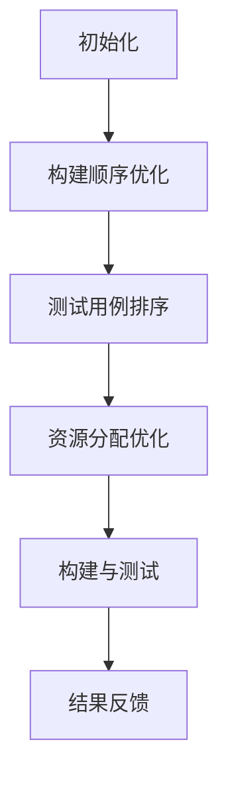
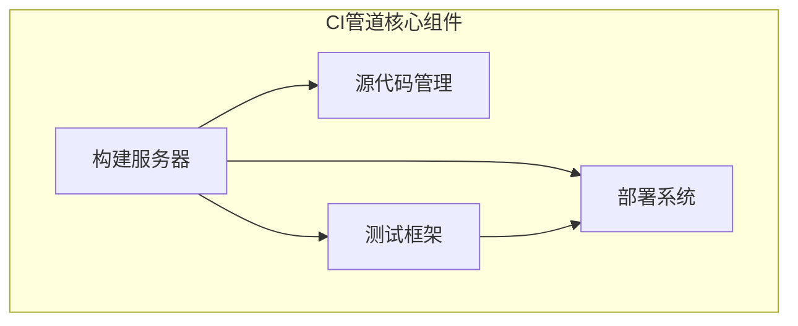
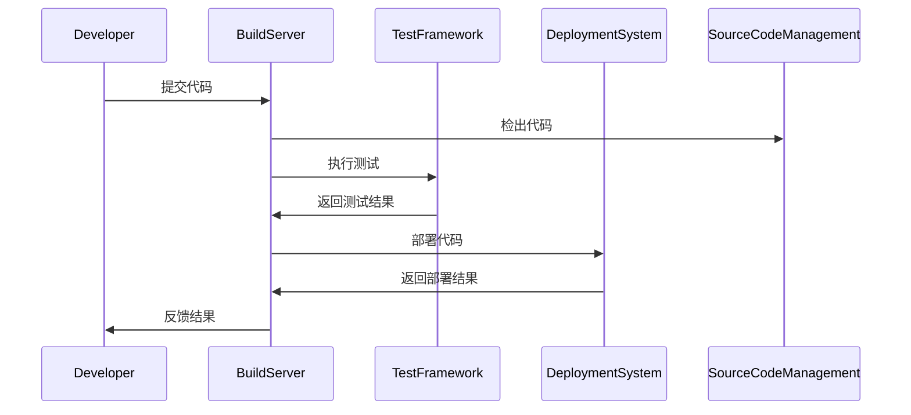

                 

### 提示词编程的持续集成管道优化

---

## 关键词

持续集成、提示词编程、管道优化、自动化、敏捷开发、算法原理、系统架构设计

## 摘要

随着现代软件开发项目的复杂性和规模不断扩大，持续集成（CI）成为软件开发生命周期中不可或缺的一部分。本文将深入探讨提示词编程在持续集成管道优化中的应用，通过一系列的分析和实例，展示如何利用先进的算法和工具来提升CI管道的效率和稳定性。文章结构分为以下几部分：背景介绍、核心概念与联系、算法原理讲解、数学模型和公式、系统分析与架构设计方案、项目实战、最佳实践和拓展阅读。读者将掌握CI管道优化的基本概念和实战技巧，从而为高效敏捷的开发过程提供强有力的支持。

---

### 第一部分：持续集成管道基础

#### 第1章：持续集成简介

**1.1 持续集成的概念**

持续集成（Continuous Integration，CI）是一种软件开发实践，旨在通过频繁地将开发人员的工作成果合并到一个共享的主干分支中，并对每次合并进行自动化的构建和测试，以确保代码质量。CI的核心思想是及早发现并解决集成过程中出现的问题，从而降低集成风险。

**1.2 持续集成的重要性**

持续集成不仅能够提高代码质量，还能加快开发速度，减少项目的延迟。以下是CI的一些关键优势：

- **提高代码质量**：通过自动化测试，及早发现并修复缺陷。
- **加快开发速度**：频繁的集成和反馈使团队能够更快地做出决策。
- **降低集成风险**：及早发现并解决集成问题，减少后续集成的复杂性。
- **促进团队协作**：明确的反馈机制有助于团队成员更好地协作。

**1.3 持续集成的工作流程**

持续集成的工作流程通常包括以下几个步骤：

1. **代码提交**：开发人员将代码提交到源代码管理系统。
2. **构建触发**：当代码提交后，CI服务器会自动启动构建过程。
3. **构建过程**：构建系统编译代码并运行测试。
4. **结果反馈**：构建成功或失败的结果会即时反馈给开发人员和团队。
5. **部署**：如果构建成功，代码可以被部署到测试或生产环境。

#### 第2章：提示词编程基础

**2.1 提示词编程的概念**

提示词编程（Prompt Programming）是一种基于提示（Prompt）的方式，让计算机通过输入特定的提示信息来执行相应的任务。这种方式在自然语言处理（NLP）领域尤其有用，能够使计算机更好地理解和执行人类指令。

**2.2 提示词编程的优势**

提示词编程的主要优势包括：

- **简化代码**：通过提示词，开发者可以简化复杂的代码逻辑。
- **提高可读性**：提示词使得代码更加直观，易于理解和维护。
- **增强灵活性**：开发者可以根据需求灵活地调整提示词，实现不同的功能。

**2.3 提示词编程的应用场景**

提示词编程在多个领域都有广泛应用，例如：

- **自动问答系统**：通过提示词，系统能够自动回答用户的问题。
- **文本生成**：利用提示词，可以生成高质量的文本内容。
- **自然语言处理**：通过提示词，系统能够更好地理解自然语言文本。

#### 第3章：CI管道组成部分

**3.1 构建服务器**

构建服务器是CI管道的核心组件，负责执行构建任务。常见的构建服务器包括Jenkins、Travis CI等。

**3.2 源代码管理系统**

源代码管理系统（如Git）用于存储和管理代码，确保代码版本的可控性。开发人员将代码提交到源代码管理系统，CI服务器会根据配置自动触发构建。

**3.3 测试框架**

测试框架用于自动化执行测试用例，验证代码的功能和性能。常见的测试框架包括JUnit、pytest等。

**3.4 部署系统**

部署系统负责将构建成功的代码部署到测试或生产环境。部署过程可以是手动触发，也可以是自动化流程。

### 第二部分：核心概念与联系

#### 第4章：CI管道优化策略

**4.1 优化目标**

CI管道优化的主要目标是提高构建速度、降低失败率、减少人工干预，从而提升开发效率。

**4.2 优化工具选择**

为了实现CI管道优化，需要选择合适的工具和平台。常见的CI工具包括Jenkins、Travis CI、Circle CI等。

**4.3 提示词编程在CI管道优化中的应用**

提示词编程可以通过简化构建脚本、优化测试流程、提高自动化程度等方面，对CI管道进行优化。例如，通过提示词，可以自动选择最优的构建参数，调整测试用例的执行顺序，提高构建和测试的效率。

### 第三部分：算法原理讲解

#### 第5章：算法原理讲解

**5.1 优化算法概述**

CI管道优化算法通常包括构建顺序优化、测试用例排序、资源分配优化等。

**5.2 算法流程图**

使用Mermaid绘制算法流程图，展示优化算法的执行过程。



**5.3 Python代码实现**

使用Python代码实现优化算法，详细讲解算法的执行过程。

```python
# Python代码示例
def optimize_build_order(projects):
    # 算法实现
    pass

def optimize_test_order(test_cases):
    # 算法实现
    pass

def allocate_resources(builds):
    # 算法实现
    pass

def execute_build_and_test(builds):
    # 算法实现
    pass

def feedback_results(results):
    # 算法实现
    pass
```

**5.4 数学模型与公式**

阐述CI管道优化过程中的关键数学原理和公式，使用LaTeX格式进行表示。

$$
\text{构建时间} = f(\text{构建顺序}, \text{测试用例顺序}, \text{资源分配})
$$

$$
\text{失败率} = \frac{\text{失败构建次数}}{\text{总构建次数}}
$$

### 第四部分：数学模型和公式详解

#### 第6章：数学模型和公式详解

**6.1 数学模型介绍**

介绍CI管道优化中的数学模型，包括构建时间模型、失败率模型等。

**6.2 公式推导**

推导构建时间和失败率模型的公式，解释其物理意义。

**6.3 举例说明**

通过具体实例，展示如何应用数学模型和公式进行CI管道优化。

### 第五部分：系统分析与架构设计方案

#### 第7章：系统分析与架构设计

**7.1 问题场景介绍**

介绍CI管道优化所面临的问题场景，例如构建时间过长、测试失败率高等。

**7.2 系统功能设计**

使用Mermaid绘制领域模型类图，展示系统的功能结构。

```mermaid
classDiagram
    Build -> Test : 执行
    Deploy -> Test : 部署
    Test -> Build : 反馈
    Test <<Interface>> TestFramework
    Test <<Interface>> BuildServer
    Build <<Interface>> SourceCodeManagement
    Deploy <<Interface>> DeploymentSystem
```

**7.3 系统架构设计**

使用Mermaid绘制系统架构图，展示CI管道的整体架构。



**7.4 系统接口设计**

描述CI管道中的主要接口，包括构建接口、测试接口、部署接口等。

**7.5 系统交互序列图**

使用Mermaid绘制系统交互序列图，展示CI管道中各个组件的交互过程。



### 第六部分：项目实战

#### 第8章：项目实战

**8.1 环境安装**

介绍CI管道优化项目所需的软件和硬件环境安装步骤。

**8.2 系统核心实现**

详细讲解CI管道优化的核心实现，包括构建顺序优化、测试用例排序、资源分配优化等。

**8.3 代码应用解读与分析**

分析CI管道优化项目的代码实现，解释关键代码的功能和作用。

**8.4 实际案例分析与讲解**

通过具体案例，展示CI管道优化的实际应用效果和注意事项。

**8.5 项目小结**

总结项目实践经验，提出项目改进建议。

### 第七部分：最佳实践与小结

#### 第9章：最佳实践与小结

**9.1 最佳实践**

提供CI管道优化的最佳实践，包括工具选择、配置优化、代码管理等方面的建议。

**9.2 注意事项**

列出CI管道优化过程中需要特别注意的事项，如构建失败处理、测试覆盖率等。

**9.3 小结**

总结文章中的核心观点和关键结论，强调CI管道优化的重要性。

**9.4 拓展阅读**

推荐进一步阅读的资源，包括相关书籍、论文和博客等。

### 作者信息

作者：AI天才研究院/AI Genius Institute & 禅与计算机程序设计艺术 /Zen And The Art of Computer Programming

---

在撰写本文时，我们将逐步探讨持续集成管道优化中的核心概念、算法原理、数学模型、系统架构设计以及实际项目中的应用。通过详细的分析和实例，读者将掌握CI管道优化的关键技巧和方法，从而为现代软件开发带来更高效的持续集成过程。

