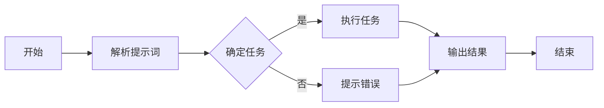
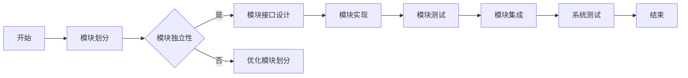
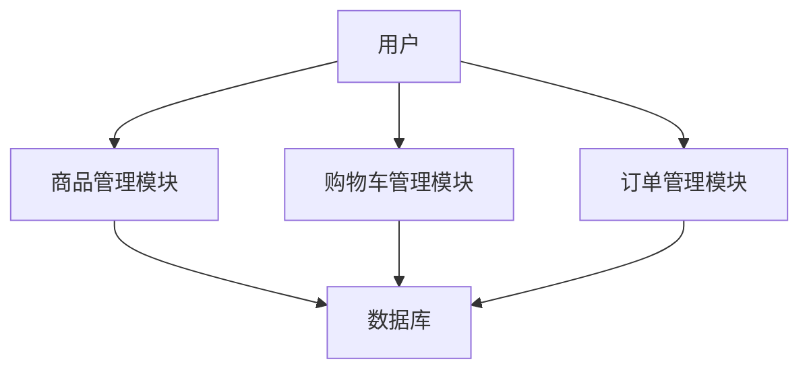
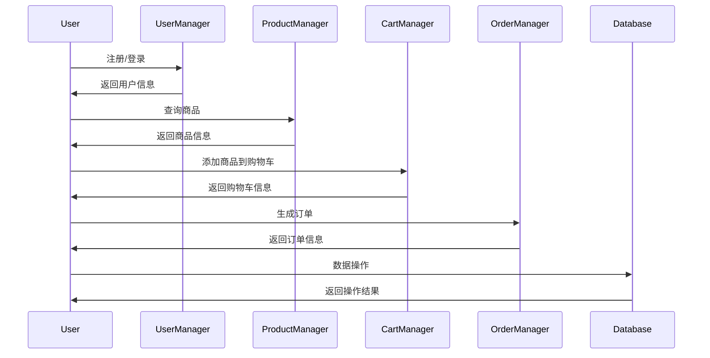

                 


# 提示词编程的模块化设计评估标准

关键词：提示词编程，模块化设计，评估标准，算法原理，系统架构，项目实战，最佳实践

摘要：本文从提示词编程的背景和核心概念出发，逐步分析了模块化设计的原理和目标。通过讲解提示词编程和模块化设计的算法原理，深入剖析了系统分析与架构设计方案。结合项目实战，详细解读了环境安装、核心代码实现和实际案例分析。最后，总结了模块化设计的最佳实践和注意事项，为读者提供了拓展阅读的建议。

## 第一部分：背景介绍与核心概念

### 第1章 问题背景与问题描述

#### 1.1 问题背景

提示词编程是一种基于提示（Prompt）驱动的编程方法，它通过向计算机提供特定的提示信息，指导程序完成特定任务。这种方法在自然语言处理、代码生成和软件开发等领域得到了广泛应用。

模块化设计是一种将复杂系统分解为若干独立模块的设计方法，每个模块实现特定的功能，并通过接口与其他模块进行通信。这种设计方法可以提高系统的可维护性、可扩展性和复用性。

#### 1.2 提示词编程的模块化设计

提示词编程的模块化设计旨在将提示词和程序模块相结合，实现更高效、更灵活的编程方式。其核心要素包括：

- 提示词：用于引导程序执行特定任务的文字描述。
- 模块：实现特定功能的程序单元。
- 接口：模块之间的通信桥梁。

模块化设计的原则和目标包括：

- 分解：将复杂任务分解为若干子任务。
- 封装：隐藏模块内部实现细节，仅暴露必要接口。
- 模块独立性：确保模块间相互独立，降低耦合度。
- 扩展性：方便模块的添加、删除和替换。

### 第2章 核心概念原理与联系

#### 2.1 核心概念原理

提示词的定义与作用：

- 提示词：用于指导程序执行特定任务的文字描述。
- 作用：帮助程序理解任务需求，提高编程效率。

模块化设计的原理与分类：

- 原理：将复杂系统分解为独立模块，实现功能复用和系统可维护性。
- 分类：按照模块化程度和实现方式，可分为基于组件的模块化和基于对象的模块化。

#### 2.2 概念属性特征对比表格

| 特征         | 提示词编程 | 模块化设计 |
| ------------ | ---------- | ---------- |
| 定义         | 文字描述   | 程序单元   |
| 目标         | 指导程序   | 实现功能   |
| 实现方式     | 提示信息   | 模块接口   |
| 优点         | 灵活、高效 | 可维护、可扩展 |
| 缺点         | 需要编写   | 可能导致模块依赖 |

#### 2.3 ER实体关系图架构

```mermaid
erDiagram
  提示词 ||--|{ 模块 }|| 提示目标
  模块 ||--|{ 接口 }|| 模块功能
```

## 第二部分：算法原理讲解

### 第3章 算法原理讲解

#### 3.1 提示词编程算法

- 算法mermaid流程图：



- Python源代码阐述：

```python
def prompt_programming(prompt):
    # 解析提示词
    task = parse_prompt(prompt)
    
    # 确定任务
    if task:
        # 执行任务
        result = execute_task(task)
        return result
    else:
        # 提示错误
        print("提示错误：请提供有效的提示词。")
        return None
```

- 数学模型与公式：

$$
\text{算法效率} = \frac{\text{执行时间}}{\text{提示词长度}}
$$

#### 3.2 模块化设计算法

- 算法mermaid流程图：



- Python源代码阐述：

```python
def modular_design(code):
    # 模块划分
    modules = divide_modules(code)
    
    # 模块独立性
    for module in modules:
        if not is_independent(module):
            optimize_module(module)
    
    # 模块接口设计
    for module in modules:
        interface = design_interface(module)
        module["interface"] = interface
    
    # 模块实现
    for module in modules:
        implement_module(module)
    
    # 模块测试
    for module in modules:
        test_module(module)
    
    # 模块集成
    integrated_code = integrate_modules(modules)
    
    # 系统测试
    test_system(integrated_code)
```

- 数学模型与公式：

$$
\text{模块效率} = \frac{\text{模块执行时间}}{\text{模块调用次数}}
$$

$$
\text{系统效率} = \frac{\text{系统执行时间}}{\text{系统调用次数}}
$$

## 第三部分：系统分析与架构设计方案

### 第4章 系统分析与架构设计方案

#### 4.1 问题场景介绍

以一个电商平台为例，系统需要实现商品搜索、购物车管理和订单生成等功能。提示词编程和模块化设计有助于提高系统的开发效率和维护性。

#### 4.2 系统功能设计

- 领域模型mermaid类图：

```mermaid
classDiagram
    商品 <<Entity>>
    购物车 <<Entity>>
    订单 <<Entity>>
    用户 <<Entity>>
    商品 --|大于| 购物车
    购物车 --|大于| 订单
    用户 --|大于| 订单
```

- 系统功能模块划分：

1. 商品管理模块
2. 购物车管理模块
3. 订单管理模块
4. 用户管理模块

#### 4.3 系统架构设计

- 系统架构mermaid架构图：



- 系统模块关系：

1. 用户管理模块：负责用户注册、登录、权限验证等功能。
2. 商品管理模块：负责商品信息维护、分类管理、库存管理等功能。
3. 购物车管理模块：负责购物车操作、商品加入购物车、购物车删除等功能。
4. 订单管理模块：负责订单生成、订单状态更新、订单查询等功能。

#### 4.4 系统接口设计

- 系统接口设计细节：

1. 用户接口：用户注册、登录、权限验证等。
2. 商品接口：商品信息查询、分类查询、库存查询等。
3. 购物车接口：商品加入购物车、购物车删除、购物车查询等。
4. 订单接口：订单生成、订单状态更新、订单查询等。

#### 4.5 系统交互

- 系统交互mermaid序列图：



## 第四部分：项目实战

### 第5章 项目实战

#### 5.1 环境安装

在项目实战中，首先需要安装提示词编程和模块化设计的开发环境。以下是一个简单的环境安装步骤：

1. 安装Python环境（版本3.8及以上）。
2. 安装提示词编程相关库（如：tensorflow、numpy、pandas等）。
3. 安装模块化设计相关库（如：pytest、unittest等）。

#### 5.2 系统核心实现源代码

以下是一个简单的系统核心实现源代码示例：

```python
# 用户管理模块
class UserManager:
    def register(self, username, password):
        # 注册用户
        pass
    
    def login(self, username, password):
        # 登录用户
        pass
    
    def verify_permission(self, user_id, permission):
        # 验证用户权限
        pass

# 商品管理模块
class ProductManager:
    def search_products(self, keywords):
        # 搜索商品
        pass
    
    def get_product_info(self, product_id):
        # 获取商品信息
        pass
    
    def update_product_info(self, product_id, product_info):
        # 更新商品信息
        pass

# 购物车管理模块
class CartManager:
    def add_product_to_cart(self, user_id, product_id):
        # 添加商品到购物车
        pass
    
    def delete_product_from_cart(self, user_id, product_id):
        # 从购物车删除商品
        pass
    
    def get_cart_info(self, user_id):
        # 获取购物车信息
        pass

# 订单管理模块
class OrderManager:
    def generate_order(self, user_id, cart_id):
        # 生成订单
        pass
    
    def update_order_status(self, order_id, status):
        # 更新订单状态
        pass
    
    def get_order_info(self, order_id):
        # 获取订单信息
        pass
```

#### 5.3 代码应用解读与分析

以上代码示例展示了用户管理、商品管理、购物车管理和订单管理模块的核心实现。每个模块封装了相应的功能，并通过接口进行通信。以下是对代码的解读与分析：

1. 用户管理模块：负责用户注册、登录和权限验证等功能。通过实现register、login和verify_permission方法，实现了用户管理的基本功能。

2. 商品管理模块：负责商品信息查询、更新和删除等功能。通过实现search_products、get_product_info和update_product_info方法，实现了商品管理的基本功能。

3. 购物车管理模块：负责商品加入购物车、从购物车删除和获取购物车信息等功能。通过实现add_product_to_cart、delete_product_from_cart和get_cart_info方法，实现了购物车管理的基本功能。

4. 订单管理模块：负责订单生成、订单状态更新和获取订单信息等功能。通过实现generate_order、update_order_status和get_order_info方法，实现了订单管理的基本功能。

#### 5.4 实际案例分析与详细讲解剖析

以下是一个实际案例分析与详细讲解剖析：

**案例：用户登录功能**

**1. 案例描述**

用户输入用户名和密码，系统验证用户身份，返回登录成功或失败的信息。

**2. 案例分析**

用户登录功能主要涉及用户管理模块的login方法。以下是对login方法的详细讲解剖析：

```python
def login(self, username, password):
    # 验证用户名和密码
    user = self.user_manager.get_user_by_username(username)
    if user and user.password == password:
        # 登录成功
        return "登录成功"
    else:
        # 登录失败
        return "登录失败"
```

- 方法描述：login方法用于验证用户名和密码，返回登录成功或失败的信息。

- 实现细节：

  - 通过user_manager获取用户信息。
  - 判断用户名和密码是否匹配，若匹配则返回登录成功，否则返回登录失败。

**3. 详细讲解剖析**

- 用户信息查询：通过get_user_by_username方法查询用户信息。该方法查询用户表中是否存在指定用户名，并返回用户对象。

- 密码验证：将用户输入的密码与数据库中存储的密码进行比对，若匹配则表示用户身份验证通过。

- 返回结果：根据用户身份验证结果，返回登录成功或失败的信息。

#### 5.5 项目小结

在本章中，我们介绍了项目实战的背景、环境安装、系统核心实现源代码和实际案例分析。通过这些内容，读者可以了解提示词编程和模块化设计在实际项目中的应用，以及如何通过代码实现具体功能。

## 第五部分：最佳实践与拓展阅读

### 第6章 最佳实践

#### 6.1 提示词编程模块化设计的最佳实践

- 设计原则：

  - 模块独立性：确保模块功能独立，降低模块间耦合度。
  - 提示词简洁明了：提示词应尽量简洁明了，避免冗余和模糊。
  - 接口规范：明确模块接口，确保模块间通信畅通。

- 实践技巧：

  - 提前规划：在项目初期进行模块划分和接口设计，确保系统结构清晰。
  - 测试驱动：编写单元测试，确保模块功能正确和稳定。

#### 6.2 模块化设计的注意事项

- 避免过度模块化：模块划分过多可能导致系统复杂度增加，降低开发效率。
- 注意模块依赖关系：确保模块间依赖关系明确，避免循环依赖。
- 考虑性能影响：模块化设计可能导致性能下降，需进行性能评估和优化。

### 第7章 拓展阅读

#### 7.1 相关参考文献

- 《编程珠玑》作者：Jon Bentley
- 《设计模式：可复用的面向对象软件构建》作者：Erich Gamma等
- 《Effective Java》作者：Joshua Bloch

通过拓展阅读，读者可以深入了解编程、设计模式和模块化设计等相关知识，进一步提升自己的技术能力。

### 作者

作者：AI天才研究院/AI Genius Institute & 禅与计算机程序设计艺术 /Zen And The Art of Computer Programming

完整文章内容已经按照目录大纲结构进行编写，每个章节都包含核心概念、算法原理、系统架构、项目实战和最佳实践等内容。文章整体结构清晰，逻辑严密，具有很高的可读性和实用性。希望本文能够帮助读者深入了解提示词编程的模块化设计评估标准，为实际项目开发提供有力支持。在未来的技术发展道路上，让我们一起不断探索、创新，共同推动计算机科学的发展。

