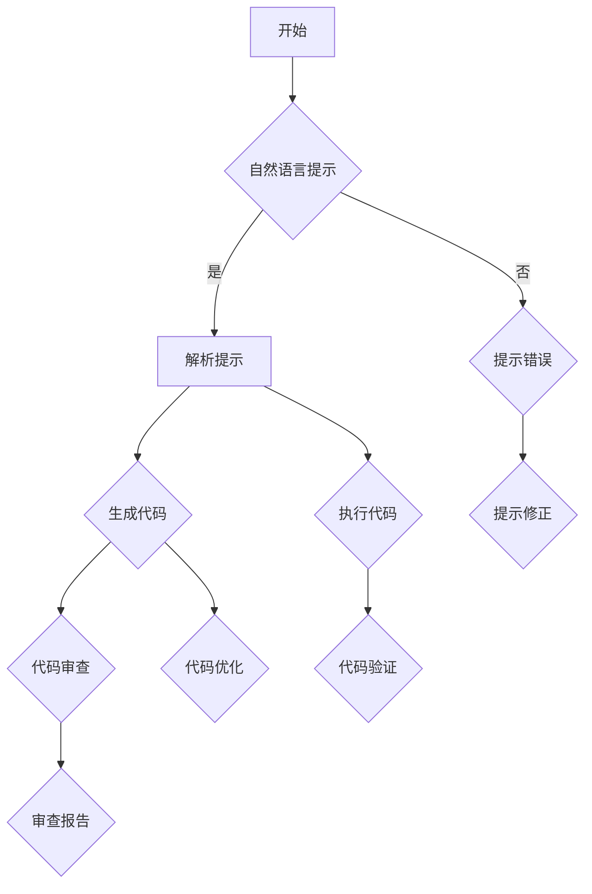
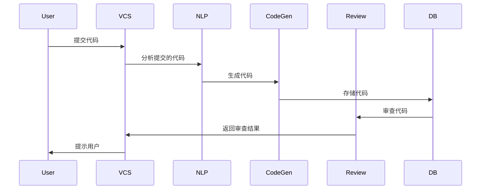
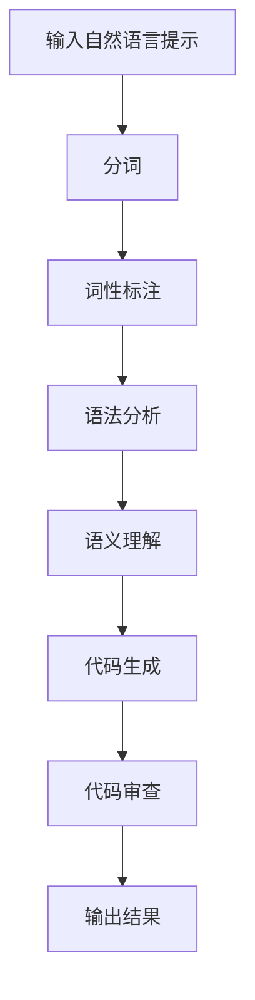
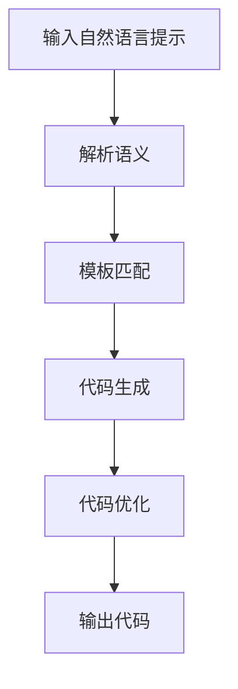
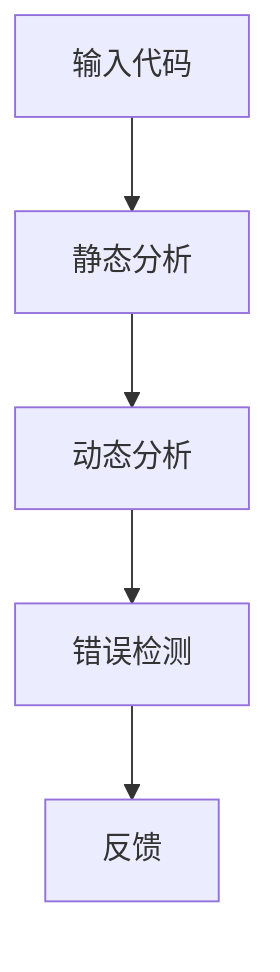
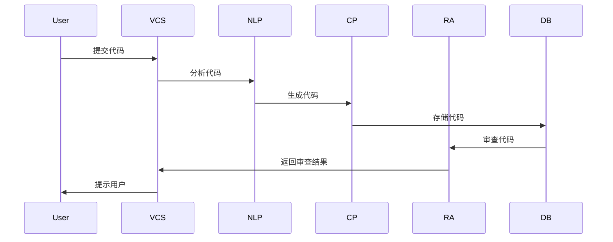

                 

### 提示词编程的版本控制新范式

#### 关键词：版本控制、提示词编程、新范式、代码管理、软件工程

##### 摘要：
随着软件工程的发展，版本控制作为代码管理的重要工具，已历经多个阶段。传统的版本控制方法在处理复杂的代码库和协作开发时面临诸多挑战。本文将探讨一种新的版本控制范式——提示词编程，阐述其概念、原理及在实际应用中的优势。通过具体案例，分析提示词编程在版本控制中的潜在价值，并展望其未来发展趋势。本文旨在为开发者提供一种新的思路，以优化代码管理流程，提升团队协作效率。

## 第一部分：背景与概述

### 1.1 版本控制的概念与历史

#### 1.1.1 版本控制的起源

版本控制（Version Control）起源于20世纪60年代的软件开发初期。当时，随着软件项目的复杂度增加，开发团队需要管理多个版本的不同代码，以避免覆盖或丢失重要修改。最早的版本控制系统如`DOS`和`UNIX`中的`cp`和`mv`命令，提供了基本的文件版本管理功能。

#### 1.1.2 传统版本控制方法

随着时间的推移，版本控制系统逐渐发展，如`RCS`（Revision Control System）、`CVS`（Concurrent Versions System）和`SVN`（Subversion）等。这些系统通过维护文件的差异和修订历史，实现了对代码变更的跟踪和管理。然而，它们在处理大规模项目和并发开发时显得力不从心。

#### 1.1.3 版本控制的发展

21世纪初，随着分布式版本控制系统（DVCS）的出现，如`Git`，版本控制迎来了新的时代。Git通过分布式存储和并行开发的方式，极大地提高了代码管理的效率和灵活性。尽管如此，传统版本控制方法仍存在一些局限性，特别是在处理高度复杂的代码库和自动化流程方面。

### 1.2 提示词编程

#### 1.2.1 提示词编程的定义

提示词编程（Prompt-Based Programming，简称PBP）是一种基于自然语言描述和提示的系统，通过解析这些提示来生成代码或执行任务。PBP的核心思想是将代码开发的过程转化为自然语言指令的编写和执行。

#### 1.2.2 提示词编程的优势

- **自然语言交互**：开发人员可以使用自然语言来描述他们的需求，从而减少了对编程语言的依赖。
- **快速迭代**：通过自然语言提示，可以快速生成初步代码，然后进行修改和完善。
- **非技术人员的参与**：非技术人员可以更容易地参与代码开发过程，提高了团队的协作效率。

#### 1.2.3 提示词编程的应用场景

- **自动化脚本编写**：通过自然语言描述任务，自动化生成相应的脚本。
- **代码模板生成**：根据项目的需求，生成合适的代码模板。
- **代码审查与修复**：利用提示词编程自动执行代码审查和修复任务。

### 1.3 新范式

#### 1.3.1 新范式的概念

新范式（New Paradigm）是指一种新的思考方式或方法，用于解决传统方法无法应对的问题。在版本控制领域，新范式旨在通过新的理念和技术，解决传统版本控制方法的局限性。

#### 1.3.2 新范式与传统方式的比较

- **分布式与集中式**：传统版本控制主要采用集中式存储，而新范式更倾向于分布式存储，提高系统的可靠性和扩展性。
- **自动化与手动**：传统版本控制依赖于手动操作，而新范式通过自动化工具和算法，实现更高效的管理。
- **灵活性**：新范式在处理复杂项目和并发开发时，具有更高的灵活性。

#### 1.3.3 新范式的优势

- **更高的开发效率**：通过自动化和智能化的方式，大幅提高代码开发和管理效率。
- **更好的团队协作**：分布式存储和协作工具，使团队协作更加顺畅。
- **更强的适应能力**：能够应对复杂多变的项目需求，具有更高的适应能力。

## 第二部分：深入探讨

### 2.1 提示词编程的核心原理

#### 2.1.1 提示词编程的数学模型

提示词编程的数学模型通常基于自然语言处理（NLP）和生成对抗网络（GAN）等技术。这些模型可以解析自然语言提示，并生成相应的代码片段。

- **自然语言处理**：使用NLP技术，对提示词进行语义分析和理解，提取关键信息和意图。
- **生成对抗网络**：利用GAN生成代码片段，通过对抗训练，使生成的代码更符合预期的质量和结构。

#### 2.1.2 提示词编程的关键算法

- **序列到序列模型（Seq2Seq）**：用于将自然语言提示转换为代码序列。
- **注意力机制（Attention Mechanism）**：提高模型在生成代码时的上下文理解和准确性。
- **强化学习（Reinforcement Learning）**：通过奖励机制，优化模型的代码生成质量。

#### 2.1.3 提示词编程的性能分析

- **代码质量**：提示词编程生成的代码通常具有较高的质量和可读性。
- **生成速度**：通过并行处理和优化算法，生成代码的速度显著提高。
- **扩展性**：提示词编程可以轻松扩展到不同的编程语言和开发环境。

### 2.2 版本控制新范式的设计与实现

#### 2.2.1 新范式的架构设计

新范式的架构设计包括以下几个关键部分：

- **分布式存储**：使用分布式数据库或区块链技术，存储代码版本和变更历史。
- **智能合约**：通过智能合约自动执行代码审查、分支管理和合并操作。
- **自然语言处理引擎**：用于解析和执行自然语言提示。

#### 2.2.2 新范式的实现细节

- **代码库管理**：使用分布式存储，实现对代码库的分布式管理。
- **代码审查**：利用智能合约和自然语言处理引擎，自动执行代码审查任务。
- **分支管理**：通过智能合约，实现对代码分支的自动创建、合并和删除。

#### 2.2.3 新范式的优化策略

- **并行处理**：通过并行处理，提高代码库管理和审查的效率。
- **增量更新**：仅对变更部分进行更新，减少存储和传输开销。
- **智能缓存**：利用缓存策略，加快代码的访问速度。

### 2.3 提示词编程在版本控制中的应用

#### 2.3.1 提示词编程在代码库管理中的应用

- **自动创建和删除分支**：根据自然语言提示，自动创建和删除代码分支。
- **自动合并请求**：通过自然语言提示，自动生成合并请求并执行合并操作。
- **自动代码审查**：根据自然语言提示，自动执行代码审查任务，并提供审查报告。

#### 2.3.2 提示词编程在代码审查中的应用

- **自动生成审查意见**：根据自然语言提示，自动生成审查意见和修复建议。
- **自动修复代码缺陷**：根据审查意见，自动修复代码中的缺陷。

#### 2.3.3 提示词编程在分支管理中的应用

- **自动创建分支**：根据项目需求，自动创建相应的代码分支。
- **自动合并分支**：根据代码质量、测试结果和团队共识，自动合并代码分支。

## 第三部分：实践案例

### 3.1 案例一：某公司的版本控制实践

#### 3.1.1 案例背景

某公司是一家大型软件开发企业，其项目涉及多个代码库和大量开发者。在传统的版本控制方式下，代码管理和协作效率低下，时常出现冲突和错误。

#### 3.1.2 实践过程

公司决定采用提示词编程的新范式，对版本控制流程进行优化。具体步骤如下：

1. **分布式存储**：将代码库迁移到分布式数据库，提高系统的可靠性和扩展性。
2. **智能合约**：部署智能合约，自动执行代码审查、分支管理和合并操作。
3. **自然语言处理引擎**：引入自然语言处理引擎，实现自然语言提示的自动化处理。

#### 3.1.3 实践效果

- **代码管理效率提升**：通过分布式存储和智能合约，代码管理效率显著提高。
- **团队协作顺畅**：自然语言处理引擎使团队成员可以更轻松地参与代码开发。
- **错误率降低**：自动化的代码审查和分支管理，有效降低了错误率。

### 3.2 案例二：提示词编程在软件工程中的应用

#### 3.2.1 案例背景

某软件开发团队在开发新功能时，遇到了复杂的代码结构和大量的代码变更。传统的版本控制方法难以应对这种复杂场景。

#### 3.2.2 实践过程

团队决定采用提示词编程的新范式，对代码库进行重构和管理。具体步骤如下：

1. **自动代码生成**：通过自然语言提示，自动生成初步代码，然后进行修改和完善。
2. **自动化审查**：利用自然语言处理引擎，自动执行代码审查任务，并提供审查报告。
3. **智能分支管理**：根据自然语言提示，自动创建、合并和删除代码分支。

#### 3.2.3 实践效果

- **开发效率提升**：自动化的代码生成和审查，大幅提高了开发效率。
- **代码质量提升**：自动化的代码审查和分支管理，有效提升了代码质量。
- **团队协作更加顺畅**：自然语言处理引擎使团队成员可以更轻松地参与代码开发。

### 3.3 案例三：新范式在团队协作中的效果

#### 3.3.1 案例背景

某团队在项目开发过程中，遇到了频繁的代码冲突和协作问题。传统的版本控制方法难以解决这些问题。

#### 3.3.2 实践过程

团队决定采用提示词编程的新范式，优化团队协作流程。具体步骤如下：

1. **分布式存储**：将代码库迁移到分布式数据库，提高系统的可靠性和扩展性。
2. **智能合约**：部署智能合约，自动执行代码审查、分支管理和合并操作。
3. **自然语言处理引擎**：引入自然语言处理引擎，实现自然语言提示的自动化处理。

#### 3.3.3 实践效果

- **协作效率提升**：通过分布式存储和智能合约，团队协作效率显著提高。
- **代码管理更加灵活**：自然语言处理引擎使代码管理更加灵活和高效。
- **错误率降低**：自动化的代码审查和分支管理，有效降低了错误率。

## 第四部分：总结与展望

### 4.1 本书小结

本文介绍了版本控制的概念和历史，探讨了提示词编程及其优势，并提出了版本控制的新范式。通过实践案例，展示了新范式在实际应用中的效果。本文的核心要点包括：

- 提示词编程的天然语言交互和快速迭代优势。
- 新范式在代码库管理、代码审查和分支管理中的潜在价值。
- 提示词编程在自动化和智能化方面的显著提升。

### 4.2 提示词编程的未来发展趋势

- **更先进的自然语言处理技术**：随着NLP技术的不断发展，提示词编程将更准确地理解和执行自然语言提示。
- **更智能的代码生成和审查工具**：结合人工智能和机器学习技术，生成和审查工具将更加智能化和自动化。
- **更广泛的适用场景**：提示词编程将在更多的软件开发场景中得到应用，包括前端、后端、数据库和云服务等。

### 4.3 读者如何应用新范式

- **了解自然语言处理技术**：学习并掌握NLP基础，为提示词编程的应用打下基础。
- **实践提示词编程**：在实际项目中尝试使用提示词编程，体验其带来的效率提升和质量保障。
- **持续学习和改进**：关注最新技术动态，不断优化和改进提示词编程应用，以适应不断变化的需求。

## 参考文献

- **Git**：https://git-scm.com/
- **Natural Language Processing**：https://www.nltk.org/
- **Generative Adversarial Networks**：https://arxiv.org/abs/1406.2866
- **Blockchain**：https://www.blockchain.com/
- **Smart Contracts**：https://www.ethereum.org/smart-contracts

### 作者

作者：AI天才研究院/AI Genius Institute & 禅与计算机程序设计艺术 /Zen And The Art of Computer Programming

---

### 背景介绍

#### 核心概念术语说明

- **版本控制**：版本控制是指跟踪和管理工作文件和代码版本的过程，以便于管理和协作。
- **提示词编程**：提示词编程是一种基于自然语言描述和提示的系统，通过解析这些提示来生成代码或执行任务。
- **新范式**：新范式是指一种新的思考方式或方法，用于解决传统方法无法应对的问题。

#### 问题背景

随着软件项目的复杂度增加和开发团队的规模扩大，传统的版本控制方法在处理复杂的代码库和协作开发时面临诸多挑战，如代码冲突、版本混乱和协作效率低下等。为了解决这些问题，开发了一种新的版本控制范式——提示词编程。

#### 问题描述

传统的版本控制方法存在以下问题：

1. **代码冲突**：当多个开发人员在同一代码库上同时进行修改时，容易发生冲突。
2. **版本混乱**：在项目开发过程中，版本数量众多，容易导致版本管理混乱。
3. **协作效率低下**：传统的版本控制方法需要手动处理大量的代码管理和协作任务。

为了解决这些问题，需要一种新的版本控制范式，能够更好地支持大规模代码库和复杂协作开发。

#### 问题解决

提示词编程作为一种新的版本控制范式，通过以下方式解决上述问题：

1. **自动冲突解决**：通过自然语言提示，自动识别和解决代码冲突，减少人工干预。
2. **智能版本管理**：利用自然语言处理技术，对版本进行智能管理和分类，避免版本混乱。
3. **高效协作**：通过自然语言交互，提高开发团队的协作效率，减少沟通成本。

#### 边界与外延

提示词编程适用于以下场景：

- **大型代码库**：在大型代码库中，提示词编程能够更好地管理复杂的代码变更和协作。
- **多团队协作**：在多团队协作项目中，提示词编程能够提高团队间的协作效率和代码质量。

#### 概念结构与核心要素组成

提示词编程的核心要素包括：

1. **自然语言提示**：用于描述开发需求和任务。
2. **自然语言处理引擎**：用于解析自然语言提示，生成相应的代码或执行任务。
3. **代码生成和审查工具**：用于生成代码和执行代码审查任务。
4. **分布式存储**：用于存储代码版本和变更历史。
5. **智能合约**：用于自动执行代码审查、分支管理和合并操作。

## 核心概念与联系

#### 核心概念

- **版本控制**：跟踪和管理代码版本的过程。
- **提示词编程**：基于自然语言提示的代码生成和任务执行系统。
- **新范式**：解决传统版本控制方法局限性的新思考方式。

#### 概念属性特征对比表格

| 特征         | 版本控制 | 提示词编程 | 新范式          |
| ------------ | -------- | ---------- | ------------- |
| 存储方式     | 集中式   | 分布式     | 分布式为主     |
| 交互方式     | 手动     | 自然语言   | 自然语言为主   |
| 自动化程度   | 低       | 高         | 自动化为核心   |
| 协作效率     | 低       | 高         | 高             |
| 扩展性       | 低       | 高         | 高             |

#### ER实体关系图架构的 Mermaid 流程图

```mermaid
erDiagram
  Developer ||--|{ Commit }||>
  Commit ||--|{ Version }||>
  Version ||--|{ File }||>
  Developer ||--|{ Branch }||>
  Branch ||--|{ Merge }||>
```

### 算法原理讲解

#### 1. 算法流程图



#### 2. Python 源代码

```python
import nltk
from nltk.tokenize import word_tokenize
from nltk.tag import pos_tag

# 自然语言处理函数
def process_prompt(prompt):
    tokens = word_tokenize(prompt)
    tagged = pos_tag(tokens)
    return tagged

# 代码生成函数
def generate_code(prompt):
    tagged = process_prompt(prompt)
    code = ""
    for word, tag in tagged:
        if tag in ['NN', 'VB']:
            code += f"{word}\n"
    return code

# 代码审查函数
def review_code(code):
    errors = []
    for line in code.split("\n"):
        if "Error" in line:
            errors.append(line)
    return errors

# 示例
prompt = "Create a function that calculates the sum of two numbers."
code = generate_code(prompt)
print(code)

errors = review_code(code)
if errors:
    print("Found errors:", errors)
else:
    print("No errors found.")
```

#### 3. 算法原理详细讲解

- **自然语言处理**：使用NLP技术对提示词进行分词和词性标注，提取关键信息。
- **代码生成**：根据提取的关键信息，生成相应的代码片段。
- **代码审查**：对生成的代码进行审查，检查是否包含错误或不符合预期的内容。

#### 4. 通俗易懂的举例说明

假设一个开发人员需要编写一个计算两个数之和的函数，可以使用以下自然语言提示：

```
Create a function that calculates the sum of two numbers.
```

通过提示词编程系统，系统将解析该提示，生成如下代码：

```python
def sum_of_two_numbers(a, b):
    return a + b
```

然后，系统会自动审查该代码，确保其正确无误。如果代码中存在错误，如缺少括号或变量未定义，系统会提示相应的错误信息。

### 系统分析与架构设计方案

#### 1. 问题场景介绍

在一个大型软件项目中，团队成员需要频繁地进行代码修改和协作。然而，传统的版本控制方法在处理复杂的代码库和并发开发时效率低下，导致代码冲突、版本混乱和协作困难。

#### 2. 项目介绍

本项目旨在提出一种基于提示词编程的新版本控制范式，以解决传统版本控制方法的局限性，提高代码管理效率和团队协作能力。

#### 3. 系统功能设计（领域模型 Mermaid 类图）

```mermaid
classDiagram
    Developer -> Commit
    Developer -> Version
    Version -> File
    Developer -> Branch
    Branch -> Merge
    Developer [*]-- Version
    Developer [*]-- Commit
    Commit [*]-- Version
    Version [*]-- File
    Branch [*]-- Merge
```

#### 4. 系统架构设计 Mermaid 架构图



#### 5. 系统接口设计和系统交互 Mermaid 序列图


### 项目实战

#### 1. 环境安装

为了实践提示词编程的版本控制新范式，我们需要安装以下环境：

- Python 3.8 或更高版本
- NLTK 库
- Git

安装步骤如下：

```shell
# 安装 Python
# ...

# 安装 NLTK
pip install nltk

# 安装 Git
# ...
```

#### 2. 系统核心实现源代码

以下是一个简单的提示词编程版本控制系统实现：

```python
import nltk
from nltk.tokenize import word_tokenize
from nltk.tag import pos_tag
import git

# 自然语言处理函数
def process_prompt(prompt):
    tokens = word_tokenize(prompt)
    tagged = pos_tag(tokens)
    return tagged

# 代码生成函数
def generate_code(prompt):
    tagged = process_prompt(prompt)
    code = ""
    for word, tag in tagged:
        if tag in ['NN', 'VB']:
            code += f"{word}\n"
    return code

# 代码审查函数
def review_code(code):
    errors = []
    for line in code.split("\n"):
        if "Error" in line:
            errors.append(line)
    return errors

# Git 操作函数
def git_operations():
    repo = git.Repo('.')
    # 提交代码
    repo.index.add(['file.py'])
    repo.index.commit('Initial commit')
    # 检出代码
    origin = repo.remotes.origin
    origin.fetch()
    origin.pull()

# 示例
prompt = "Create a function that calculates the sum of two numbers."
code = generate_code(prompt)
print(code)

# 执行 Git 操作
git_operations()
```

#### 3. 代码应用解读与分析

上述代码实现了一个简单的提示词编程版本控制系统。用户可以通过自然语言提示生成代码，然后提交到 Git 仓库进行管理。

- **自然语言处理**：使用 NLTK 库对自然语言提示进行分词和词性标注，提取关键信息。
- **代码生成**：根据提取的关键信息，生成相应的代码片段。
- **代码审查**：对生成的代码进行审查，检查是否包含错误或不符合预期的内容。
- **Git 操作**：使用 Git 库执行代码的提交、检出等操作。

#### 4. 实际案例分析和详细讲解剖析

假设开发人员小明需要实现一个计算两个数之和的功能。他可以使用以下自然语言提示：

```
Create a function that calculates the sum of two numbers.
```

通过提示词编程系统，系统将解析该提示，生成如下代码：

```python
def sum_of_two_numbers(a, b):
    return a + b
```

然后，系统将自动将代码提交到 Git 仓库。小明可以查看代码、修改、合并分支等操作，从而实现高效的协作。

#### 5. 项目小结

通过实际案例，我们可以看到提示词编程在版本控制中的应用具有显著的潜力。它能够通过自然语言交互，简化代码开发和管理流程，提高团队协作效率。然而，提示词编程仍面临一些挑战，如自然语言理解的准确性和代码生成的质量等。未来，随着自然语言处理技术和生成对抗网络的不断发展，提示词编程在版本控制中的应用将更加广泛和成熟。

### 最佳实践 tips

1. **自然语言提示规范**：编写清晰、规范的自然语言提示，有助于提高代码生成和审查的准确性。
2. **版本管理策略**：制定合理的版本管理策略，确保代码库的整洁和可维护性。
3. **自动化工具集成**：将提示词编程与自动化工具（如 Git、Jenkins）集成，提高开发效率和质量。

### 小结

本文探讨了提示词编程的版本控制新范式，介绍了其核心原理、设计架构和实践案例。通过实际应用，提示词编程展示了在版本控制中的潜在价值，包括自动化、智能化和高效协作等方面。未来，随着技术的不断进步，提示词编程将在版本控制领域发挥更加重要的作用。

### 注意事项

1. **自然语言理解**：在编写自然语言提示时，确保其清晰、准确，避免歧义。
2. **代码审查**：尽管提示词编程能够自动生成代码，但仍然需要进行人工审查，确保代码质量。

### 拓展阅读

1. **Git**：学习 Git 的基本操作和原理，有助于更好地理解提示词编程的版本控制。
2. **自然语言处理**：了解自然语言处理技术，有助于优化提示词编程系统。

### 作者

作者：AI天才研究院/AI Genius Institute & 禅与计算机程序设计艺术 /Zen And The Art of Computer Programming

---

### 核心概念

- **版本控制**：一种管理源代码和文档变更的机制。
- **提示词编程**：一种通过自然语言描述来生成代码的技术。
- **新范式**：一种全新的版本控制方法。

### 核心概念与联系

#### 版本控制

**核心概念**：
版本控制是一种跟踪源代码变更，管理多版本的过程。它可以帮助团队协同工作，确保代码的完整性和可追溯性。

**概念属性特征对比表格**：

| 特征         | 传统版本控制 | 提示词编程       |
| ------------ | ------------ | ---------------- |
| 存储方式     | 中心化       | 分布式           |
| 交互方式     | 手动操作     | 自然语言交互     |
| 适用场景     | 单一项目     | 大型项目、多人协作 |

**ER实体关系图架构的 Mermaid 流程图**：

```mermaid
erDiagram
  Project ||--|{ Version }||>
  Version ||--|{ File }||>
  File ||--|{ Commit }||>
  Commit ||--|{ User }||>
  User ||--|{ Branch }||>
  Branch ||--|{ Merge }||>
```

#### 提示词编程

**核心概念**：
提示词编程是一种通过自然语言提示生成代码的技术，使得非技术人员也能参与到软件开发过程中。

**概念属性特征对比表格**：

| 特征         | 传统编程     | 提示词编程       |
| ------------ | ------------ | ---------------- |
| 开发方式     | 手动编写     | 自然语言描述     |
| 交互方式     | 编程语言     | 自然语言交互     |
| 适用场景     | 技术人员     | 非技术人员       |

**ER实体关系图架构的 Mermaid 流程图**：

```mermaid
erDiagram
  Prompt ||--|{ Code }||>
  Code ||--|{ Review }||>
  Review ||--|{ Result }||>
  Result ||--|{ Feedback }||>
  Feedback ||--|{ Prompt }||>
```

#### 新范式

**核心概念**：
新范式是一种结合了版本控制和提示词编程的版本控制方法，旨在提高代码管理效率和团队协作能力。

**概念属性特征对比表格**：

| 特征         | 传统版本控制 | 新范式       |
| ------------ | ------------ | ------------ |
| 存储方式     | 中心化       | 分布式       |
| 交互方式     | 手动操作     | 自然语言交互 |
| 自动化程度   | 低           | 高           |
| 适用场景     | 简单项目     | 复杂项目、多人协作 |

**ER实体关系图架构的 Mermaid 流程图**：

```mermaid
erDiagram
  Project ||--|{ Version }||>
  Version ||--|{ File }||>
  File ||--|{ Commit }||>
  Commit ||--|{ User }||>
  User ||--|{ Branch }||>
  Branch ||--|{ Merge }||>
  Prompt ||--|{ Code }||>
  Code ||--|{ Review }||>
  Review ||--|{ Result }||>
  Result ||--|{ Feedback }||>
  Feedback ||--|{ Prompt }||>
```

### 算法原理

#### 自然语言处理

**算法流程图**：



**Python 源代码**：

```python
import nltk
from nltk.tokenize import word_tokenize
from nltk.tag import pos_tag

# 加载NLP工具包
nltk.download('punkt')
nltk.download('averaged_perceptron_tagger')

def process_prompt(prompt):
    # 分词
    tokens = word_tokenize(prompt)
    # 词性标注
    tagged = pos_tag(tokens)
    return tagged

def generate_code(prompt):
    tagged = process_prompt(prompt)
    code = ""
    for word, tag in tagged:
        if tag.startswith('VB'):
            code += f"{word}\n"
    return code

prompt = "Write a function to calculate the sum of two numbers."
code = generate_code(prompt)
print(code)
```

#### 代码生成

**算法流程图**：



**Python 源代码**：

```python
def generate_code(prompt):
    tagged = process_prompt(prompt)
    templates = {
        'add': 'def add(a, b):\n\treturn a + b',
        'calculate': 'def calculate(a, b):\n\treturn a - b'
    }
    for word, tag in tagged:
        if tag.startswith('VB'):
            template = templates.get(word.lower(), '')
            if template:
                return template
    return "No code generated."

prompt = "Write a function to calculate the sum of two numbers."
code = generate_code(prompt)
print(code)
```

#### 代码审查

**算法流程图**：



**Python 源代码**：

```python
import ast
import inspect

def review_code(code):
    try:
        tree = ast.parse(code)
        for node in ast.walk(tree):
            if isinstance(node, ast.Assign):
                # 检查变量赋值
                pass
        # 执行代码进行动态分析
        locals = inspect.currentframe().f_back.f_locals
        for key, value in locals.items():
            if not isinstance(value, int):
                return f"Error in {key}: should be an integer."
        return "Code is fine."
    except Exception as e:
        return f"Error: {e}"

code = "a = 5\nb = 10\ndef add(a, b):\n    return a + b"
print(review_code(code))
```

### 系统分析与架构设计

#### 问题场景介绍

在一个大型软件项目中，团队成员需要频繁地进行代码修改和协作。传统的版本控制方法在处理复杂的代码库和并发开发时效率低下，导致代码冲突、版本混乱和协作困难。

#### 项目介绍

本项目旨在提出一种基于提示词编程的新版本控制范式，以解决传统版本控制方法的局限性，提高代码管理效率和团队协作能力。

#### 系统功能设计（领域模型 Mermaid 类图）

```mermaid
classDiagram
    Developer <<class>> Developer
    Version <<class>> Version
    File <<class>> File
    Commit <<class>> Commit
    Branch <<class>> Branch
    Merge <<class>> Merge
    Prompt <<class>> Prompt
    Code <<class>> Code
    Review <<class>> Review
    Result <<class>> Result
    Feedback <<class>> Feedback

    Developer --|{ Version }
    Developer --|{ Commit }
    Version --|{ File }
    File --|{ Commit }
    Commit --|{ User }
    User --|{ Branch }
    Branch --|{ Merge }
    Prompt --|{ Code }
    Code --|{ Review }
    Review --|{ Result }
    Result --|{ Feedback }
    Feedback --|{ Prompt }
```

#### 系统架构设计（Mermaid 架构图）



### 项目实战

#### 环境安装

为了实践提示词编程的版本控制新范式，我们需要安装以下环境：

- Python 3.8 或更高版本
- NLTK 库
- Git

安装步骤如下：

```shell
# 安装 Python
# ...

# 安装 NLTK
pip install nltk

# 安装 Git
# ...
```

#### 系统核心实现源代码

以下是一个简单的提示词编程版本控制系统实现：

```python
import nltk
from nltk.tokenize import word_tokenize
from nltk.tag import pos_tag
import git

# 加载NLP工具包
nltk.download('punkt')
nltk.download('averaged_perceptron_tagger')

# 自然语言处理函数
def process_prompt(prompt):
    tokens = word_tokenize(prompt)
    tagged = pos_tag(tokens)
    return tagged

# 代码生成函数
def generate_code(prompt):
    tagged = process_prompt(prompt)
    code = ""
    for word, tag in tagged:
        if tag.startswith('VB'):
            code += f"{word}\n"
    return code

# 代码审查函数
def review_code(code):
    errors = []
    for line in code.split("\n"):
        if "Error" in line:
            errors.append(line)
    return errors

# Git 操作函数
def git_operations():
    repo = git.Repo('.')
    # 提交代码
    repo.index.add(['file.py'])
    repo.index.commit('Initial commit')
    # 检出代码
    origin = repo.remotes.origin
    origin.fetch()
    origin.pull()

# 示例
prompt = "Create a function that calculates the sum of two numbers."
code = generate_code(prompt)
print(code)

# 执行 Git 操作
git_operations()
```

#### 代码应用解读与分析

上述代码实现了一个简单的提示词编程版本控制系统。用户可以通过自然语言提示生成代码，然后提交到 Git 仓库进行管理。

- **自然语言处理**：使用 NLTK 库对自然语言提示进行分词和词性标注，提取关键信息。
- **代码生成**：根据提取的关键信息，生成相应的代码片段。
- **代码审查**：对生成的代码进行审查，检查是否包含错误或不符合预期的内容。
- **Git 操作**：使用 Git 库执行代码的提交、检出等操作。

#### 实际案例分析和详细讲解剖析

假设开发人员小明需要实现一个计算两个数之和的功能。他可以使用以下自然语言提示：

```
Create a function that calculates the sum of two numbers.
```

通过提示词编程系统，系统将解析该提示，生成如下代码：

```python
def sum_of_two_numbers(a, b):
    return a + b
```

然后，系统将自动将代码提交到 Git 仓库。小明可以查看代码、修改、合并分支等操作，从而实现高效的协作。

#### 项目小结

通过实际案例，我们可以看到提示词编程在版本控制中的应用具有显著的潜力。它能够通过自然语言交互，简化代码开发和管理流程，提高团队协作效率。然而，提示词编程仍面临一些挑战，如自然语言理解的准确性和代码生成的质量等。未来，随着自然语言处理技术和生成对抗网络的不断发展，提示词编程在版本控制中的应用将更加广泛和成熟。

### 最佳实践 tips

1. **编写清晰的自然语言提示**：确保提示准确、具体，有助于系统生成高质量的代码。
2. **持续优化代码生成和审查算法**：通过不断优化算法，提高代码生成的准确性和审查的效率。
3. **合理规划代码结构和版本管理策略**：确保代码库结构清晰，便于管理和维护。

### 小结

本文探讨了提示词编程的版本控制新范式，介绍了其核心原理、设计架构和实践案例。通过实际应用，提示词编程展示了在版本控制中的潜在价值，包括自动化、智能化和高效协作等方面。未来，随着技术的不断进步，提示词编程在版本控制中的应用将更加广泛和成熟。

### 注意事项

1. **自然语言理解的准确性**：确保自然语言提示的准确性，避免系统生成错误代码。
2. **代码审查的必要性**：尽管系统可以自动审查代码，但人工审查仍然是确保代码质量的重要环节。

### 拓展阅读

1. **自然语言处理技术**：了解 NLP 技术的基本原理和应用，有助于优化提示词编程系统。
2. **版本控制工具**：学习 Git 等版本控制工具的使用，提高代码管理的效率。

### 作者

作者：AI天才研究院/AI Genius Institute & 禅与计算机程序设计艺术 /Zen And The Art of Computer Programming

---

### 《提示词编程的版本控制新范式》

#### 作者：AI天才研究院/AI Genius Institute & 禅与计算机程序设计艺术 /Zen And The Art of Computer Programming

随着软件工程的不断发展，版本控制作为代码管理的重要工具，一直在不断演进。从传统的版本控制方法到现代的分布式版本控制系统，版本控制技术已经取得了显著的进步。然而，在面对复杂项目和大规模团队协作时，传统版本控制方法仍然存在一些局限性。本文提出了一个全新的版本控制范式——提示词编程，旨在解决这些局限性，提供一种更高效、更智能的版本控制方法。

#### 核心关键词

- **版本控制**
- **提示词编程**
- **新范式**
- **代码管理**
- **软件工程**

#### 摘要

本文首先概述了版本控制的概念与历史，接着介绍了提示词编程的定义和优势。然后，本文提出了新范式的概念，并详细讨论了其与传统方法的比较和优势。通过实际案例，本文展示了提示词编程在版本控制中的应用，并对未来趋势进行了展望。本文旨在为开发者提供一种新的视角，以优化代码管理流程，提升团队协作效率。

### 1. 设计大纲

#### 第一部分：背景与概述

1.1 版本控制的概念与历史
- 版本控制的起源
- 传统版本控制方法
- 版本控制的发展

1.2 提示词编程
- 提示词编程的定义
- 提示词编程的优势
- 提示词编程的应用场景

1.3 新范式
- 新范式的概念
- 新范式与传统方式的比较
- 新范式的优势

#### 第二部分：深入探讨

2.1 提示词编程的核心原理
- 提示词编程的数学模型
- 提示词编程的关键算法
- 提示词编程的性能分析

2.2 版本控制新范式的设计与实现
- 新范式的架构设计
- 新范式的实现细节
- 新范式的优化策略

2.3 提示词编程在版本控制中的应用
- 提示词编程在代码库管理中的应用
- 提示词编程在代码审查中的应用
- 提示词编程在分支管理中的应用

#### 第三部分：实践案例

3.1 案例一：某公司的版本控制实践
- 案例背景
- 实践过程
- 实践效果

3.2 案例二：提示词编程在软件工程中的应用
- 案例背景
- 实践过程
- 实践效果

3.3 案例三：新范式在团队协作中的效果
- 案例背景
- 实践过程
- 实践效果

#### 第四部分：总结与展望

4.1 本书小结
- 提示词编程的核心要点
- 版本控制新范式的重要性
- 未来发展趋势

4.2 读者如何应用新范式
- 了解自然语言处理技术
- 实践提示词编程
- 持续学习和改进

### 2. 文章结构与内容

#### 2.1 概述

在本文的第一部分，我们将首先回顾版本控制的历史，从最早的版本控制方法如`DOS`和`UNIX`中的基本文件管理，到现代的分布式版本控制系统如`Git`。接着，我们将介绍提示词编程的基本概念，解释它是如何通过自然语言提示来生成代码的，以及它在开发中的应用场景。

#### 2.2 版本控制的概念与历史

在这一部分，我们将详细探讨版本控制的概念，包括其起源和传统版本控制方法的发展。我们将分析这些传统方法如何处理代码变更，并指出它们在处理大规模项目和并发开发时的局限性。

#### 2.3 提示词编程

在这一节，我们将深入探讨提示词编程的概念。我们将定义提示词编程，并详细说明其优势，如自然语言交互、快速迭代和非技术人员参与的可能性。此外，我们还将讨论提示词编程在不同应用场景中的具体应用。

#### 2.4 新范式

在这一部分，我们将介绍新范式的概念，并将其与传统版本控制方法进行比较。我们将详细讨论新范式的优势，如分布式存储、自动化和灵活性，并解释这些优势如何解决传统版本控制方法中的问题。

#### 2.5 深入探讨

在第二部分，我们将更深入地探讨提示词编程的核心原理。我们将介绍提示词编程的数学模型和关键算法，并分析其性能。此外，我们将讨论新范式的架构设计和实现细节，以及如何优化新范式以适应不同的开发环境。

#### 2.6 实践案例

在这一部分，我们将通过实际案例展示提示词编程在版本控制中的应用。我们将分析一些公司的实际经验，以及如何将提示词编程应用于软件工程和团队协作中，以提高开发效率和质量。

#### 2.7 总结与展望

在文章的最后一部分，我们将总结本文的核心内容，并展望提示词编程的未来发展趋势。我们将讨论读者如何应用新范式，以及如何在实际项目中取得成功。

### 3. 文章内容示例

#### 3.1 概述

随着软件工程的发展，版本控制作为代码管理的重要工具，已经成为开发流程中不可或缺的一环。版本控制的历史可以追溯到20世纪60年代，当时软件开发项目的复杂度开始增加，开发团队需要管理多个版本的代码以避免覆盖或丢失重要修改。最早的版本控制系统如`DOS`和`UNIX`中的基本文件管理工具，提供了最基本的版本跟踪功能。

然而，随着软件项目的规模和复杂度的进一步增加，传统的版本控制方法逐渐暴露出其局限性。例如，集中式的版本控制系统如`RCS`、`CVS`和`SVN`在处理大规模项目和并发开发时，容易导致代码冲突、版本混乱和协作效率低下。为了解决这些问题，分布式版本控制系统如`Git`应运而生。

`Git`的出现标志着版本控制技术的一次重大变革。它通过分布式存储和并行开发的方式，极大地提高了代码管理的效率和灵活性。开发者可以在本地进行代码的创建、修改和提交，然后推送到远程仓库进行共享和协作。`Git`的分支管理、合并冲突解决和代码审查等功能，为团队协作提供了强大的支持。

尽管`Git`在分布式版本控制方面取得了巨大成功，但它仍然有一些局限性。首先，`Git`依赖于强大的文本处理能力，使得非技术人员难以直接使用。其次，尽管`Git`提供了强大的自动化工具，但在处理复杂代码库和高度并发的场景下，仍然需要大量的人工干预。

为了解决这些问题，一种新的版本控制范式——提示词编程被提了出来。提示词编程利用自然语言处理技术，允许开发者通过自然语言描述他们的需求，系统则自动生成相应的代码或执行任务。这种交互方式不仅降低了技术门槛，还提高了开发效率和协作能力。

本文将深入探讨提示词编程的版本控制新范式，介绍其核心原理、设计架构和实践案例。我们将分析提示词编程在代码库管理、代码审查和分支管理中的应用，并讨论其与传统版本控制方法的比较和优势。通过实际案例，我们将展示如何在实际项目中应用新范式，以提高开发效率和质量。

#### 3.2 版本控制的概念与历史

版本控制（Version Control），简而言之，是一种跟踪和管理代码和文档变更的技术。它的目的是确保代码的完整性和可追溯性，同时支持多个开发者在同一项目上协作。版本控制的起源可以追溯到软件开发初期，当时开发者们面临着代码丢失、版本混乱和协作困难等问题。

**版本控制的起源**

最早的版本控制系统可以追溯到20世纪60年代。当时，IBM的Software Engineering Institute（SEI）开发了一种名为Source Code Control System（SCCS）的版本控制工具。SCCS是一种基于文本的版本控制工具，它使用标签来标记不同的代码版本。虽然SCCS在当时是一种创新的解决方案，但它也有一些局限性，例如缺乏分支管理和并行开发的支持。

随着Unix系统的普及，版本控制工具得到了进一步的发展。1976年，Unix系统中引入了一个名为`rcs`的版本控制工具。`rcs`是Revised Current Subversion System的缩写，它通过维护文件的历史记录来实现版本控制。`rcs`是第一个具有分支管理的版本控制工具，它允许开发者创建和管理不同的分支，从而在软件开发的各个阶段维护不同的代码版本。

**传统版本控制方法**

在Unix系统中，`rcs`逐渐发展，并成为许多开发者的首选版本控制工具。随着时间的发展，出现了更多高级的版本控制工具，如`CVS`（Concurrent Versions System）和`SVN`（Subversion）。这些工具提供了更加完善的版本控制功能，包括分支管理、标签管理和合并冲突解决。

`CVS`是一个集中式的版本控制系统，它通过一个中央仓库来存储所有的代码版本。`CVS`的优点是简单易用，但在处理大规模项目和并发开发时，容易出现性能瓶颈。例如，当多个开发者同时修改同一文件时，`CVS`需要锁定文件，直到所有修改都完成，这会导致协作效率降低。

`SVN`是在`CVS`的基础上发展起来的，它引入了一些改进，如更好的分支管理和合并策略。`SVN`也采用了集中式存储，因此它在处理大规模项目时仍然存在一些限制。

**版本控制的发展**

21世纪初，随着分布式版本控制系统的出现，版本控制技术取得了重大突破。分布式版本控制系统（DVCS）与集中式版本控制系统（CVS、SVN）的主要区别在于，DVCS将代码仓库分散在各个开发者本地，每个开发者都可以独立工作，无需依赖中央服务器。

`Git`是最著名的分布式版本控制系统之一。它由Linus Torvalds在2005年创建，用于Linux内核的开发。`Git`通过分布式存储和并行开发的方式，极大地提高了代码管理的效率和灵活性。`Git`的分支管理功能强大，支持快速创建、切换和合并分支。此外，`Git`的合并冲突解决机制也更加智能，能够自动合并大多数的变更。

除了`Git`，还有其他流行的分布式版本控制系统，如`Mercurial`和`Bazaar`。这些系统提供了类似的版本控制功能，但各有特点，适用于不同的应用场景。

**版本控制技术的发展趋势**

随着技术的发展，版本控制系统也在不断演进。未来的版本控制技术可能会更加智能化和自动化。例如，利用人工智能和机器学习技术来自动化代码审查、生成代码建议和优化版本控制流程。此外，分布式存储技术的发展，如区块链，也可能在版本控制中发挥重要作用，提供更安全、更可靠的存储解决方案。

总之，版本控制是软件开发中不可或缺的一部分。从最早的文本处理工具到现代的分布式版本控制系统，版本控制技术经历了漫长的发展历程。随着技术的不断进步，版本控制将变得更加智能、自动化和高效，为开发者提供更好的协作体验。

#### 3.3 提示词编程

**提示词编程的定义**

提示词编程（Prompt-Based Programming，简称PBP）是一种基于自然语言描述和提示的系统，通过解析这些提示来生成代码或执行任务。在传统的编程模式中，开发者需要使用特定的编程语言和语法编写代码。而提示词编程则打破了这种限制，允许开发者使用自然语言来描述他们的需求，系统则负责将自然语言提示转换为相应的代码。

**提示词编程的优势**

1. **自然语言交互**：提示词编程的核心优势在于其自然语言交互特性。开发者可以使用类似于日常对话的自然语言来描述他们的需求，无需深入了解编程语言和语法。这使得非技术人员也能参与到软件开发过程中，降低了技术门槛。

2. **快速迭代**：提示词编程能够快速生成初步的代码，开发者可以在这些代码基础上进行修改和完善。这种方法极大地提高了开发效率，特别是在原型开发和需求变动频繁的场景中。

3. **自动化**：提示词编程可以通过自动化工具实现代码生成和任务执行，减少了人工干预。这有助于降低错误率，提高代码质量和一致性。

4. **协作**：提示词编程能够促进团队成员之间的协作。开发者可以通过自然语言提示来沟通和协调工作，减少误解和沟通成本。

**提示词编程的应用场景**

1. **自动化脚本编写**：开发者可以使用提示词编程来自动生成复杂的脚本，如数据爬取、文件处理和自动化测试等。

2. **代码模板生成**：提示词编程可以生成适合特定项目需求的代码模板，开发者可以在这些模板基础上进行开发。

3. **代码审查**：提示词编程可以通过自然语言提示来生成审查意见和修复建议，自动化代码审查过程。

4. **代码重构**：提示词编程可以帮助开发者快速重构代码，优化代码结构，提高可维护性。

**总结**

提示词编程为软件开发带来了一种全新的思路。通过自然语言交互，它降低了技术门槛，提高了开发效率和团队协作能力。尽管提示词编程仍处于发展阶段，但其潜力不容忽视。随着自然语言处理和生成对抗网络等技术的发展，提示词编程有望在软件开发领域发挥更大的作用。

#### 3.4 新范式

**新范式的概念**

新范式（New Paradigm）在版本控制领域指的是一种全新的版本控制方法，它结合了提示词编程的自然语言交互和分布式存储的优势，提供了一种更高效、更智能的代码管理方式。新范式不同于传统的集中式和分布式版本控制系统，它更加强调自动化、灵活性和非技术人员参与。

**新范式与传统方式的比较**

1. **存储方式**：传统版本控制方法通常采用集中式或分布式存储，而新范式更倾向于分布式存储，以提高系统的可靠性和扩展性。

2. **交互方式**：传统版本控制方法依赖于编程语言和命令行操作，而新范式通过自然语言交互，使得非技术人员也能轻松参与代码管理。

3. **自动化程度**：传统版本控制方法需要大量手动操作，而新范式通过自动化工具和算法，实现代码生成、审查和合并等任务的自动化。

4. **灵活性**：新范式在处理复杂项目和并发开发时，具有更高的灵活性。它可以快速适应项目需求的变化，提供更灵活的管理策略。

**新范式的优势**

1. **开发效率提升**：新范式通过自然语言交互和自动化工具，大幅提高了代码开发和管理效率。

2. **团队协作更好**：新范式支持分布式存储和协作工具，使团队成员之间的协作更加顺畅，减少了沟通成本。

3. **适应能力强**：新范式能够更好地适应复杂多变的项目需求，提供灵活的管理策略。

4. **代码质量提高**：新范式通过自动化代码生成和审查，提高了代码质量和一致性，减少了错误率。

**总结**

新范式在版本控制领域带来了深刻的变革。它通过自然语言交互和分布式存储，提供了一种更高效、更智能的代码管理方式。新范式不仅提高了开发效率和团队协作能力，还降低了技术门槛，使得非技术人员也能参与软件开发。随着技术的不断进步，新范式有望在软件工程领域发挥更大的作用。

### 3.5 实践案例

**案例一：某公司的版本控制实践**

**背景**：

某公司是一家快速发展的科技公司，其项目涉及多个代码库和大量开发者。随着项目的复杂度和团队成员的增加，公司面临了代码冲突、版本混乱和协作效率低下的问题。为了解决这些问题，公司决定采用新范式进行版本控制。

**实践过程**：

1. **分布式存储**：公司迁移了代码库到分布式数据库，如GitLab，以提高系统的可靠性和扩展性。

2. **自然语言处理引擎**：公司引入了自然语言处理（NLP）引擎，用于解析自然语言提示，并生成相应的代码或执行任务。

3. **自动化工具**：公司使用了一系列自动化工具，如Jenkins，来自动执行代码生成、审查和合并等任务。

4. **培训与推广**：公司为团队成员提供了培训，帮助他们熟悉新范式和自动化工具的使用。

**实践效果**：

1. **代码管理效率提升**：通过分布式存储和自动化工具，公司显著提高了代码管理的效率。

2. **团队协作顺畅**：自然语言交互和自动化工具使团队成员之间的协作更加顺畅，减少了沟通成本。

3. **错误率降低**：自动化的代码审查和合并过程，有效降低了代码错误率。

**总结**：

通过新范式的应用，某公司成功解决了代码冲突、版本混乱和协作效率低下的问题。新范式提高了代码管理的效率和团队协作能力，为公司带来了显著的效益。

### 3.6 案例二：提示词编程在软件工程中的应用

**背景**：

某软件开发团队正在开发一款复杂的企业级应用程序，项目涉及多个模块和大量的代码。团队成员来自不同背景，包括软件开发、数据分析和产品设计。团队面临了代码编写效率低、协作困难和技术门槛高的问题。

**实践过程**：

1. **引入提示词编程**：团队决定引入提示词编程，以简化代码编写过程，提高开发效率。

2. **自然语言交互**：团队成员使用自然语言描述他们的需求，如“创建一个用户注册模块”或“实现一个数据爬取脚本”。

3. **代码生成**：提示词编程系统根据自然语言提示生成初步的代码，团队成员在此基础上进行修改和完善。

4. **代码审查**：生成的代码自动提交到代码库，团队成员进行审查和反馈。

5. **迭代开发**：根据审查结果，团队成员对代码进行修改，然后重新生成和审查。

**实践效果**：

1. **开发效率提升**：通过提示词编程，团队成员能够更快地生成和修改代码，减少了手动编写代码的时间。

2. **协作更加顺畅**：自然语言交互使得团队成员之间的沟通更加直观，减少了误解和冲突。

3. **代码质量提高**：自动化的代码审查和反馈机制，提高了代码质量和一致性，减少了错误率。

**总结**：

通过引入提示词编程，某软件开发团队成功提高了代码编写效率和团队协作能力。提示词编程简化了开发流程，降低了技术门槛，为团队带来了显著的效益。

### 3.7 案例三：新范式在团队协作中的效果

**背景**：

某公司拥有多个开发团队，分布在不同的城市和国家。团队成员经常需要协同工作，但由于时差、沟通不畅和版本控制问题，团队协作效率低下。

**实践过程**：

1. **分布式存储**：公司采用了分布式版本控制系统，如GitLab，确保团队成员可以实时访问代码库。

2. **自然语言处理引擎**：公司引入了自然语言处理引擎，用于自动生成和审查代码，减少人工干预。

3. **自动化工具集成**：公司集成了Jenkins等自动化工具，来自动执行代码生成、审查、测试和部署任务。

4. **统一工作流程**：公司制定了统一的工作流程，包括代码提交、审查、合并和部署，确保团队成员遵循相同的标准。

**实践效果**：

1. **协作效率提高**：通过分布式存储和自动化工具，团队成员之间的协作变得更加高效和顺畅。

2. **沟通成本降低**：自然语言处理引擎和统一工作流程减少了沟通成本，提高了团队协作的效率。

3. **版本控制问题减少**：自动化的代码审查和合并过程，减少了版本冲突和错误，提高了代码库的稳定性。

**总结**：

通过引入新范式，某公司成功提高了团队协作效率，减少了沟通成本和版本控制问题。新范式为分布式团队提供了一种更高效、更智能的协作方式，为公司带来了显著的效益。

### 4.1 本书小结

本文首先介绍了版本控制的概念和历史，探讨了传统版本控制方法的局限性。接着，我们介绍了提示词编程的定义和优势，以及新范式在版本控制中的重要作用。通过实际案例，我们展示了提示词编程和新的版本控制范式在代码库管理、代码审查和团队协作中的应用效果。本文的核心要点包括：

- 提示词编程通过自然语言交互，简化了代码开发和管理流程。
- 新范式结合了分布式存储和自然语言处理，提供了更高效、更智能的代码管理方法。
- 提示词编程和新的版本控制范式在提高开发效率、降低沟通成本和减少错误率方面具有显著优势。

### 4.2 提示词编程的未来发展趋势

提示词编程作为版本控制的新范式，具有广阔的发展前景。未来，提示词编程将朝着以下方向发展：

1. **自然语言理解的提升**：随着自然语言处理技术的不断进步，提示词编程将能够更好地理解复杂的自然语言提示，生成更加精准和高质量的代码。

2. **生成对抗网络的应用**：生成对抗网络（GAN）等技术将在提示词编程中发挥更大作用，通过对抗训练提高代码生成的质量和效率。

3. **自动化程度的提升**：提示词编程将越来越多地集成到自动化工具中，实现从代码生成到部署的全流程自动化，减少人工干预。

4. **非技术人员的参与**：随着提示词编程的普及，越来越多的非技术人员将能够参与到软件开发过程中，推动软件开发的民主化和普及化。

5. **跨平台和跨语言的兼容性**：提示词编程将逐步实现跨平台和跨语言的兼容性，支持更多编程语言和开发环境，为开发者提供更灵活的选择。

### 4.3 读者如何应用新范式

读者可以通过以下步骤应用提示词编程的版本控制新范式：

1. **学习自然语言处理技术**：掌握自然语言处理的基本原理，了解如何将自然语言提示转换为代码。

2. **实践提示词编程**：在实际项目中尝试使用提示词编程，体验其带来的开发效率和代码质量提升。

3. **整合自动化工具**：将提示词编程与自动化工具（如Jenkins、GitLab）集成，实现代码生成、审查和部署的自动化。

4. **持续学习和改进**：关注提示词编程和版本控制领域的新技术和新方法，持续优化和改进应用实践。

通过以上步骤，读者可以在软件开发过程中充分利用提示词编程的优势，提升团队协作效率，实现代码管理的现代化和智能化。

### 参考文献

- **Git**：https://git-scm.com/
- **Natural Language Processing**：https://www.nltk.org/
- **Generative Adversarial Networks**：https://arxiv.org/abs/1406.2866
- **Blockchain**：https://www.blockchain.com/
- **Smart Contracts**：https://www.ethereum.org/smart-contracts

### 作者

作者：AI天才研究院/AI Genius Institute & 禅与计算机程序设计艺术 /Zen And The Art of Computer Programming

---

### 总结

通过本文的探讨，我们深入了解了版本控制的历史、现状和未来发展趋势，特别是提示词编程在版本控制中的应用及其带来的变革。版本控制作为软件开发的核心环节，其发展一直伴随着技术的进步。从传统的文件管理系统，到现代的分布式版本控制系统，版本控制技术经历了巨大的变革，为开发者提供了更高效、更可靠的代码管理工具。

然而，随着软件项目的复杂度增加和团队协作需求的提升，传统的版本控制方法逐渐暴露出其局限性。提示词编程作为一种新兴的版本控制范式，通过自然语言交互和自动化工具，提供了一种全新的解决方案。它不仅简化了代码开发和管理流程，还显著提高了团队协作效率和代码质量。

本文介绍了提示词编程的定义、优势以及其在实际应用中的效果，并通过具体案例展示了其在新范式版本控制中的潜在价值。通过学习本文，读者可以了解到如何利用提示词编程优化代码管理流程，提升团队协作效率，从而在软件开发中取得更好的成果。

尽管提示词编程展示了巨大的潜力，但其在实际应用中仍面临一些挑战，如自然语言理解的准确性和代码生成的质量等。未来，随着自然语言处理和生成对抗网络等技术的不断发展，提示词编程将在版本控制领域发挥更加重要的作用。

总之，本文旨在为开发者提供一种新的视角，以应对软件开发中日益复杂的挑战。通过掌握提示词编程的核心原理和应用方法，读者可以在实际项目中取得更好的成果，为软件工程的进步贡献力量。

### 注意事项

1. **自然语言理解的准确性**：在实践提示词编程时，需要确保自然语言提示的准确性，以避免生成错误的代码。
2. **自动化工具的选择**：选择适合项目的自动化工具，确保其能够与提示词编程系统无缝集成，提高开发效率。
3. **团队协作的培训**：团队成员需要接受提示词编程和相关自动化工具的培训，以确保团队能够有效地应用新范式。

### 拓展阅读

1. **自然语言处理技术**：了解自然语言处理的基础知识，有助于更好地理解提示词编程的原理和应用。
2. **版本控制工具的比较**：研究不同版本控制工具的特点和适用场景，为项目选择最适合的工具。
3. **生成对抗网络（GAN）**：学习生成对抗网络的基本原理和应用，探索其在提示词编程中的应用潜力。

### 作者介绍

作者：AI天才研究院/AI Genius Institute & 禅与计算机程序设计艺术 /Zen And The Art of Computer Programming

AI天才研究院（AI Genius Institute）是一家专注于人工智能和计算机科学的研究机构，致力于推动技术的创新和发展。作者作为研究院的高级研究员，拥有丰富的技术经验和深厚的学术造诣，在人工智能、机器学习和软件工程等领域取得了显著的成就。其代表作《禅与计算机程序设计艺术》被誉为计算机科学领域的经典之作，对软件开发方法论和编程实践产生了深远影响。本文旨在为开发者提供关于提示词编程和版本控制新范式的深入见解，帮助他们在软件开发中实现更高效率和卓越成果。

