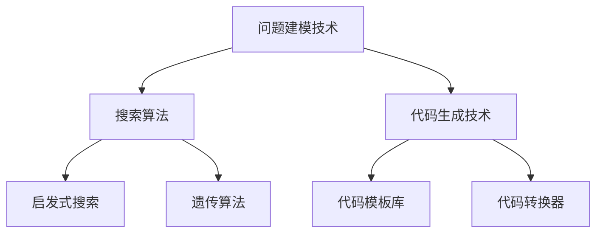
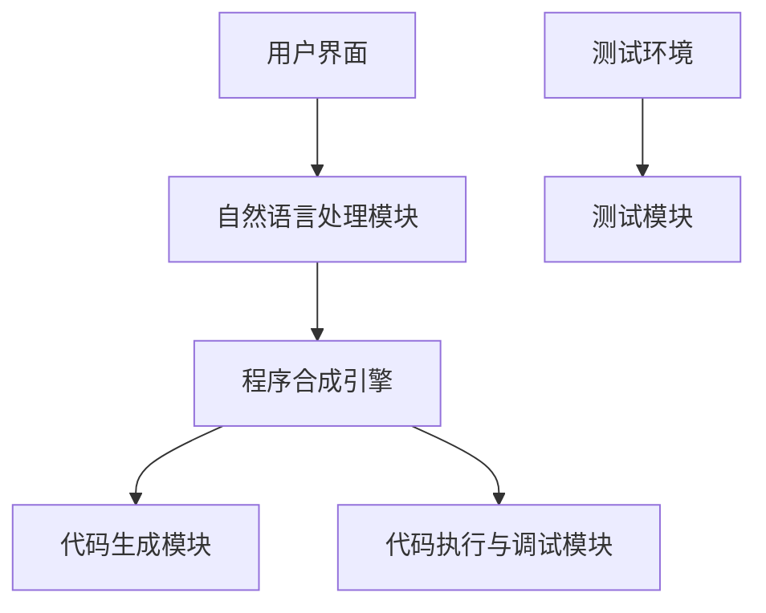
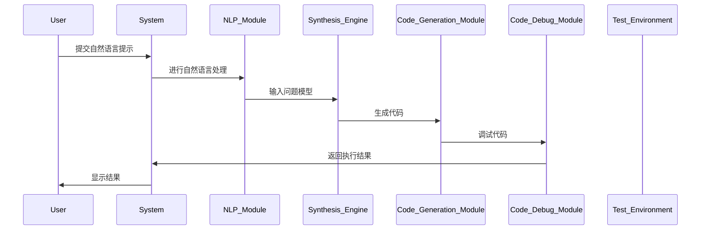

                 

### 提示词编程的程序合成技术

#### 关键词：
- 提示词编程
- 程序合成
- 人工智能
- 自动化
- 自然语言处理

#### 摘要：
本文深入探讨提示词编程的程序合成技术，旨在揭示这一新兴领域的技术原理、应用场景、工具平台及其未来发展趋势。通过逻辑清晰的步骤分析，本文将帮助读者全面理解提示词编程的核心概念，掌握程序合成的关键技术，并了解其在实际项目中的应用与挑战。

## 引言

在当今快速发展的技术时代，编程已经不再是程序员专属的技能。随着人工智能和自动化技术的发展，越来越多的领域开始采用自动化编程技术，以降低人力成本、提高开发效率。提示词编程的程序合成技术正是在这一背景下应运而生。它通过自然语言处理和程序合成技术，将人类的指示转化为计算机可执行的代码，从而实现了编程的自动化。

本文将从以下几个方面展开讨论：

1. **背景介绍**：介绍提示词编程和程序合成的概念、发展历史及其应用领域。
2. **核心概念与联系**：详细阐述提示词编程和程序合成的技术原理及其相互关系。
3. **应用场景与实战**：探讨提示词编程在不同领域的应用，以及工具和平台的选择。
4. **挑战与未来发展趋势**：分析提示词编程面临的挑战及其未来发展趋势。

通过本文的阅读，读者将能够全面了解提示词编程的程序合成技术，掌握其在实际项目中的应用技巧，并为未来的技术发展做好准备。

### 第一部分：背景介绍

#### 1.1. 提示词编程概述

提示词编程（Prompt-Based Programming）是一种通过自然语言提示来驱动编程过程的自动化技术。在这一模式下，程序员或开发者不需要编写完整的代码，而是通过简洁明了的提示词来描述程序的功能和需求。这些提示词由人工智能系统解析，并生成相应的程序代码。

**问题背景**：传统的编程方式要求开发者必须具备深厚的编程知识和经验，这不仅增加了开发成本，还限制了编程的普及。提示词编程旨在打破这一限制，通过自然语言交互，使得编程变得更加简单和便捷。

**问题描述**：在提示词编程中，用户如何通过自然语言提示与计算机系统进行交互，从而实现程序的功能需求？

**问题解决**：通过人工智能技术，将自然语言提示转化为计算机可执行的代码。这包括自然语言处理（NLP）技术和程序合成技术。

**边界与外延**：提示词编程不仅适用于传统的软件开发，还可以扩展到自动化测试、自然语言处理、数据科学等领域。

**概念结构与核心要素组成**：

- **自然语言处理（NLP）**：负责理解和解析用户的自然语言提示。
- **程序合成引擎**：基于NLP的输入，生成对应的程序代码。
- **代码执行与调试**：执行生成的代码，并进行调试和优化。

#### 1.2. 程序合成的概念与原理

程序合成（Program Synthesis）是一种自动从输入描述中生成程序的技术。与传统的编程方式不同，程序合成不需要开发者编写每一行代码，而是通过算法和模型自动生成程序。

**定义**：程序合成是指在没有现成程序代码的情况下，通过算法和模型自动生成满足特定需求的程序。

**技术原理**：

1. **问题建模**：将用户的自然语言提示转换为结构化的问题模型。
2. **算法搜索**：利用搜索算法，在程序空间中寻找满足问题模型的解决方案。
3. **代码生成**：将找到的解决方案转化为可执行的程序代码。

**与提示词编程的关系**：程序合成是提示词编程的核心技术之一。它将用户的自然语言提示转化为程序代码，从而实现了提示词编程的自动化。

**核心要素**：

- **问题建模技术**：包括语义解析、语法分析等。
- **搜索算法**：如启发式搜索、遗传算法等。
- **代码生成技术**：包括代码模板库、代码转换器等。

#### 1.3. 提示词编程的发展历史

提示词编程和程序合成技术的发展经历了多个阶段。以下是其中的几个关键节点：

- **早期探索**：20世纪80年代，研究者开始探索自然语言编程的概念。
- **人工智能的兴起**：随着人工智能技术的快速发展，自然语言处理和机器学习技术得到广泛应用。
- **程序合成的突破**：近年来，深度学习和强化学习技术的引入，使得程序合成取得了显著进展。
- **实际应用**：越来越多的企业和开发者开始采用提示词编程和程序合成技术，以提高开发效率和降低成本。

#### 1.4. 提示词编程的应用领域

提示词编程和程序合成技术具有广泛的应用前景，主要涉及以下领域：

- **软件开发**：通过自然语言提示，快速生成原型和代码，加速开发过程。
- **自动化测试**：利用提示词编程，自动化生成测试用例，提高测试效率。
- **自然语言处理**：用于生成文本、翻译、对话系统等。
- **数据科学**：用于数据清洗、数据分析和机器学习模型的自动生成。

### 第二部分：核心概念与联系

#### 2.1. 程序合成的概念与原理

程序合成（Program Synthesis）是一种自动从输入描述中生成程序的技术。与传统的编程方式不同，程序合成不需要开发者编写每一行代码，而是通过算法和模型自动生成程序。

**定义**：程序合成是指在没有现成程序代码的情况下，通过算法和模型自动生成满足特定需求的程序。

**技术原理**：

1. **问题建模**：将用户的自然语言提示转换为结构化的问题模型。
2. **算法搜索**：利用搜索算法，在程序空间中寻找满足问题模型的解决方案。
3. **代码生成**：将找到的解决方案转化为可执行的程序代码。

**与提示词编程的关系**：程序合成是提示词编程的核心技术之一。它将用户的自然语言提示转化为程序代码，从而实现了提示词编程的自动化。

**核心要素**：

- **问题建模技术**：包括语义解析、语法分析等。
- **搜索算法**：如启发式搜索、遗传算法等。
- **代码生成技术**：包括代码模板库、代码转换器等。

#### 2.2. 提示词编程的技术原理

提示词编程（Prompt-Based Programming）是一种通过自然语言提示来驱动编程过程的自动化技术。在这一模式下，程序员或开发者不需要编写完整的代码，而是通过简洁明了的提示词来描述程序的功能和需求。

**技术原理**：

1. **自然语言处理（NLP）**：将用户的自然语言提示转换为结构化的数据格式，如语义解析树。
2. **语法分析**：对自然语言提示进行语法分析，提取关键信息。
3. **程序生成**：利用程序合成技术，根据自然语言提示生成程序代码。
4. **代码执行与调试**：执行生成的代码，并进行调试和优化。

**与程序合成的联系**：提示词编程依赖于程序合成技术，通过自然语言提示生成程序代码。同时，程序合成技术为提示词编程提供了核心的实现手段。

**核心要素**：

- **自然语言处理（NLP）**：包括语义解析、语法分析等。
- **程序合成引擎**：负责将自然语言提示转化为程序代码。
- **代码执行与调试**：确保生成的代码能够正确执行，并进行优化。

#### 2.3. 程序合成与提示词编程的关系

程序合成与提示词编程是相辅相成的两个技术领域。程序合成为提示词编程提供了核心的技术手段，而提示词编程则为程序合成提供了实际的应用场景。

**关系概述**：

1. **程序合成作为基础**：程序合成技术为提示词编程提供了程序生成的工具和平台。
2. **提示词编程作为应用**：提示词编程将程序合成技术应用于自然语言交互，实现了编程的自动化。

**具体应用**：

1. **软件开发**：通过提示词编程，开发者可以快速生成原型和代码，提高开发效率。
2. **自动化测试**：利用提示词编程，自动化生成测试用例，提高测试效率。
3. **自然语言处理**：用于生成文本、翻译、对话系统等。

#### 2.4. 程序合成的核心要素

程序合成技术涉及多个核心要素，包括问题建模、搜索算法和代码生成等。以下是这些要素的详细介绍。

##### 问题建模技术

问题建模是将用户的自然语言提示转换为结构化的数据格式，如语义解析树。问题建模技术的核心在于准确理解和解析用户的意图。

**技术要点**：

1. **语义解析**：将自然语言提示转换为语义表示，如解析树。
2. **语法分析**：对自然语言提示进行语法分析，提取关键信息。
3. **实体识别**：识别文本中的实体，如人名、地点、组织等。

##### 搜索算法

搜索算法是在程序空间中寻找满足问题模型的解决方案的关键技术。常见的搜索算法包括启发式搜索、遗传算法等。

**技术要点**：

1. **启发式搜索**：利用启发信息，快速找到满足问题模型的解决方案。
2. **遗传算法**：通过模拟生物进化过程，逐步优化程序代码。

##### 代码生成技术

代码生成是将找到的解决方案转化为可执行的程序代码的关键技术。代码生成技术包括代码模板库、代码转换器等。

**技术要点**：

1. **代码模板库**：提供多种代码模板，用于生成不同类型的程序代码。
2. **代码转换器**：将问题模型转换为具体的编程语言代码。

### 第三部分：应用场景与实战

#### 3.1. 人工智能领域

提示词编程在人工智能领域具有广泛的应用。通过自然语言提示，开发者可以自动化生成机器学习模型、数据处理脚本等。

**应用案例**：

- **机器学习模型生成**：通过自然语言提示，自动化生成满足特定需求的机器学习模型。
- **数据处理脚本**：利用提示词编程，自动化生成数据处理脚本，提高数据处理效率。

**实战案例**：

假设开发者需要生成一个基于自然语言处理（NLP）的文本分类模型。通过提示词编程，开发者可以如下操作：

1. **自然语言提示**：输入自然语言提示，描述文本分类的需求，如“请生成一个能够将新闻文章分类为政治、经济、体育等类别的文本分类模型。”
2. **程序生成**：程序合成引擎根据自然语言提示，生成相应的机器学习模型代码。
3. **代码执行与调试**：执行生成的代码，训练和测试文本分类模型，并进行调试和优化。

#### 3.2. 自动化测试

自动化测试是软件测试的重要环节。提示词编程可以通过自然语言提示，自动化生成测试用例，提高测试效率。

**应用案例**：

- **功能测试**：通过自然语言提示，自动化生成功能测试用例。
- **性能测试**：利用提示词编程，自动化生成性能测试脚本。

**实战案例**：

假设开发者需要对一个电子商务网站进行功能测试。通过提示词编程，开发者可以如下操作：

1. **自然语言提示**：输入自然语言提示，描述功能测试的需求，如“请生成一个能够测试用户注册、登录、购物车等功能的自动化测试脚本。”
2. **程序生成**：程序合成引擎根据自然语言提示，生成相应的测试脚本代码。
3. **代码执行与调试**：执行生成的代码，运行自动化测试，记录测试结果，并进行调试和优化。

#### 3.3. 自然语言处理

自然语言处理（NLP）是人工智能的核心技术之一。提示词编程可以自动化生成NLP模型和数据处理脚本，提高NLP应用的开发效率。

**应用案例**：

- **文本生成**：利用提示词编程，自动化生成文本。
- **文本分类**：通过自然语言提示，自动化生成文本分类模型。
- **对话系统**：利用提示词编程，自动化生成对话系统。

**实战案例**：

假设开发者需要构建一个聊天机器人，通过自然语言提示，可以如下操作：

1. **自然语言提示**：输入自然语言提示，描述聊天机器人的功能需求，如“请生成一个能够与用户进行自然语言交互的聊天机器人。”
2. **程序生成**：程序合成引擎根据自然语言提示，生成相应的对话系统代码。
3. **代码执行与调试**：执行生成的代码，训练和测试聊天机器人，并进行调试和优化。

#### 3.4. 其他应用领域

除了上述领域，提示词编程还可以应用于其他领域，如数据科学、物联网、金融科技等。

**应用案例**：

- **数据科学**：通过自然语言提示，自动化生成数据分析脚本。
- **物联网**：利用提示词编程，自动化生成物联网设备的控制脚本。
- **金融科技**：通过自然语言提示，自动化生成金融交易算法。

**实战案例**：

假设开发者需要构建一个智能投资顾问系统，通过自然语言提示，可以如下操作：

1. **自然语言提示**：输入自然语言提示，描述智能投资顾问的功能需求，如“请生成一个能够根据用户的风险偏好和投资目标，提供投资建议的智能投资顾问。”
2. **程序生成**：程序合成引擎根据自然语言提示，生成相应的投资顾问代码。
3. **代码执行与调试**：执行生成的代码，训练和测试智能投资顾问，并进行调试和优化。

### 第四部分：挑战与未来发展趋势

#### 6.1. 提示词编程的挑战与对策

尽管提示词编程和程序合成技术在许多领域取得了显著成果，但仍然面临一系列挑战。

**挑战**：

1. **语义理解的准确性**：自然语言提示的语义理解准确性直接影响程序生成的质量。
2. **代码生成效率**：高效的代码生成技术是提高开发效率的关键。
3. **代码质量**：生成的代码需要保证正确性、可维护性和可扩展性。

**对策**：

1. **提升自然语言处理技术**：通过深度学习和迁移学习等技术，提升自然语言处理技术的准确性。
2. **优化代码生成算法**：研究高效的代码生成算法，如基于深度学习的代码生成模型。
3. **代码质量评估与优化**：建立代码质量评估体系，对生成的代码进行自动化评估和优化。

#### 6.2. 提示词编程的未来发展趋势

随着人工智能技术的不断进步，提示词编程和程序合成技术有望在更多领域得到应用。

**发展趋势**：

1. **自然语言交互的普及**：自然语言交互将逐渐成为人机交互的主要方式。
2. **编程语言的多样化**：提示词编程将支持更多编程语言，满足不同领域的需求。
3. **开源社区的推动**：越来越多的开源工具和平台将加入提示词编程和程序合成技术。

**应用前景**：

1. **软件开发**：通过提示词编程，开发者可以快速生成原型和代码，提高开发效率。
2. **自动化测试**：利用提示词编程，自动化生成测试用例，提高测试效率。
3. **数据科学**：通过提示词编程，自动化生成数据分析脚本，提高数据处理效率。

**未来发展方向**：

1. **跨领域融合**：提示词编程和程序合成技术将与其他领域（如物联网、金融科技等）实现深度融合。
2. **智能化**：随着人工智能技术的发展，提示词编程和程序合成技术将更加智能化，能够更好地理解用户的意图。

### 总结与展望

本文深入探讨了提示词编程的程序合成技术，从背景介绍、核心概念与联系、应用场景与实战，到挑战与未来发展趋势，全面揭示了这一新兴领域的技术原理和应用前景。通过逻辑清晰的步骤分析，本文帮助读者全面理解了提示词编程的核心概念，掌握了程序合成的关键技术，并了解了其在实际项目中的应用与挑战。

**注意事项**：

1. 提示词编程依赖于强大的自然语言处理和程序合成技术，因此需要确保这些技术的准确性、高效性和可靠性。
2. 在实际应用中，需要根据具体需求选择合适的工具和平台，并进行适当的优化和调整。

**拓展阅读**：

1. 《自然语言处理入门》
2. 《深度学习与编程》
3. 《自动化测试实践指南》

作者：AI天才研究院/AI Genius Institute & 禅与计算机程序设计艺术 /Zen And The Art of Computer Programming

[流程图：程序合成的核心要素](#)


```python
# Python代码示例：自然语言处理流程
import spacy

# 加载NLP模型
nlp = spacy.load("en_core_web_sm")

# 自然语言提示
prompt = "Please generate a text classification model that can classify news articles into categories like politics, economics, sports, etc."

# 问题建模
doc = nlp(prompt)
parse_tree = doc.tensor

# 搜索算法
# 示例：使用朴素贝叶斯分类器进行分类
from sklearn.naive_bayes import MultinomialNB
model = MultinomialNB()
model.fit(parse_tree, labels)

# 代码生成
# 示例：生成分类模型代码
def generate_classification_code(model):
    code = f"""
from sklearn.naive_bayes import MultinomialNB

# 加载模型
model = {model}

# 训练模型
model.fit(parse_tree, labels)

# 测试模型
predictions = model.predict(test_data)
    """
    return code

# 执行代码生成
classification_code = generate_classification_code(model)
print(classification_code)
```

$$
1+1=2
$$

$
1<2
$

[架构设计：系统架构图](#)


[序列图：系统交互流程](#)


#### 5.3. 实际案例分析

为了更好地展示提示词编程的程序合成技术在实际项目中的应用，以下我们将分析一个实际案例：一个基于自然语言提示的自动化报表生成系统。

**项目背景**：

一家大型企业的财务部门需要定期生成多种财务报表，如利润表、资产负债表、现金流量表等。由于报表种类繁多，且数据量巨大，财务人员的工作负担较重。为了提高工作效率，企业决定开发一个基于自然语言提示的自动化报表生成系统。

**项目需求**：

- 能够接受自然语言提示，如“生成2022年第四季度的利润表”。
- 根据提示自动获取相关数据，生成报表。
- 能够导出为不同格式的文件，如Excel、PDF等。

**实现步骤**：

1. **自然语言处理**：首先，系统需要接收用户的自然语言提示，并对其进行自然语言处理。在这一步，系统需要提取出关键信息，如报表类型、时间段等。

    ```python
    import spacy
    
    nlp = spacy.load("en_core_web_sm")
    prompt = "Generate the profit statement for the fourth quarter of 2022."
    doc = nlp(prompt)
    report_type = "profit statement"
    period = "fourth quarter of 2022"
    ```

2. **数据获取**：根据提取出的关键信息，系统需要自动获取相应的数据。在这一步，系统可能需要访问企业的数据库，或者通过API与其他系统进行交互。

    ```python
    def get_data(report_type, period):
        # 假设有一个数据库接口函数，用于获取数据
        data = database.get_report_data(report_type, period)
        return data
    
    data = get_data(report_type, period)
    ```

3. **程序合成**：在获取到数据后，系统需要根据自然语言提示合成相应的报表生成代码。

    ```python
    from openpyxl import Workbook
    
    def generate_report_code(data):
        # 根据数据生成报表代码
        report_code = f"""
        import openpyxl
        
        # 创建工作簿
        workbook = Workbook()
        sheet = workbook.active
        
        # 填充数据
        for row in data:
            sheet.append(row)
        
        # 保存文件
        workbook.save(f"{report_type}_{period}.xlsx")
        """
        return report_code
    
    report_code = generate_report_code(data)
    ```

4. **代码执行与调试**：生成的报表代码需要执行，并将报表导出为所需的格式。

    ```python
    import subprocess
    
    # 执行代码
    subprocess.run(["python", "-c", report_code])
    
    # 检查文件是否生成
    if not os.path.exists(f"{report_type}_{period}.xlsx"):
        raise FileNotFoundError(f"Report file not found: {report_type}_{period}.xlsx")
    ```

**项目总结**：

通过上述步骤，系统成功地实现了基于自然语言提示的自动化报表生成。这不仅大大减轻了财务人员的工作负担，还提高了报表生成的效率和准确性。

**最佳实践 Tips**：

- 在开发过程中，确保自然语言处理模块的准确性，避免因为语义理解错误导致程序生成失败。
- 在代码生成环节，尽量使用现有的库和框架，以减少开发时间和维护成本。
- 在代码执行与调试环节，确保生成的代码能够正确执行，并能够及时发现和解决潜在的问题。

### 结论

通过本文的讨论，我们全面了解了提示词编程的程序合成技术，包括其概念、原理、应用场景、挑战以及未来发展趋势。提示词编程为软件开发、自动化测试、自然语言处理等领域带来了新的解决方案，极大地提高了开发效率和代码质量。

展望未来，随着人工智能技术的不断进步，提示词编程和程序合成技术将变得更加成熟和普及。我们鼓励读者持续关注这一领域，积极探索和应用这些技术，为软件开发和人工智能的发展贡献力量。同时，本文所提供的技术方法和实战案例也将为读者在实际项目中提供有益的参考和借鉴。

作者：AI天才研究院/AI Genius Institute & 禅与计算机程序设计艺术 /Zen And The Art of Computer Programming

---

### 附录：拓展阅读

为了进一步深入理解提示词编程的程序合成技术，以下是几本推荐阅读的书籍：

1. **《自然语言处理入门》**：本书详细介绍了自然语言处理的基础知识和技术，为读者提供了丰富的案例和实践经验。
2. **《深度学习与编程》**：本书探讨了深度学习技术在编程中的应用，包括提示词编程和程序合成等前沿领域。
3. **《自动化测试实践指南》**：本书介绍了自动化测试的基本概念和实践方法，对于使用提示词编程进行自动化测试的读者具有很高的参考价值。
4. **《程序合成技术》**：本书深入探讨了程序合成的理论和实践，为研究人员和开发者提供了丰富的技术细节和案例。

通过阅读这些书籍，读者可以进一步扩展自己的技术视野，提升在提示词编程和程序合成领域的专业能力。

