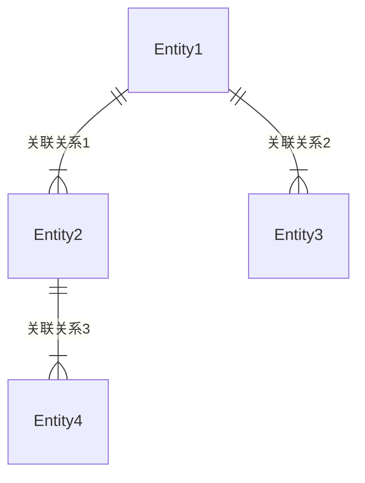
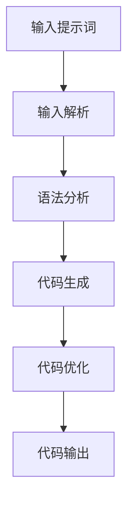
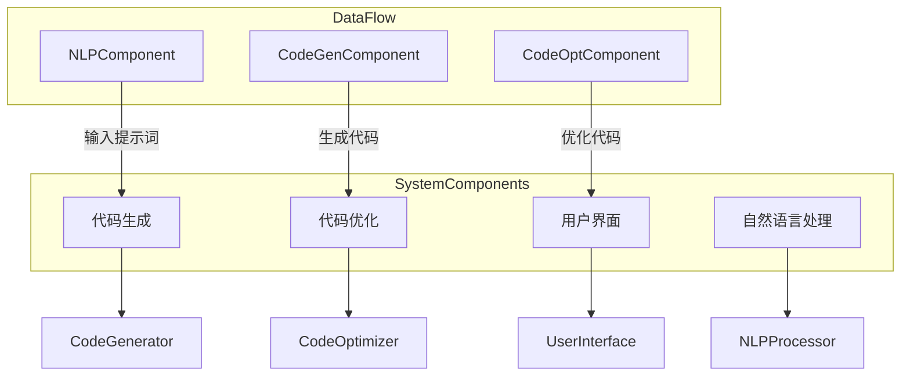
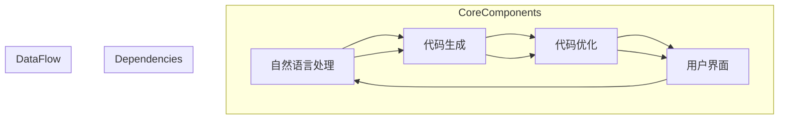
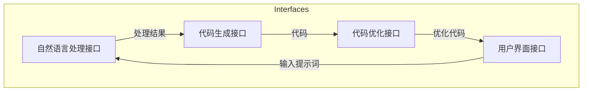
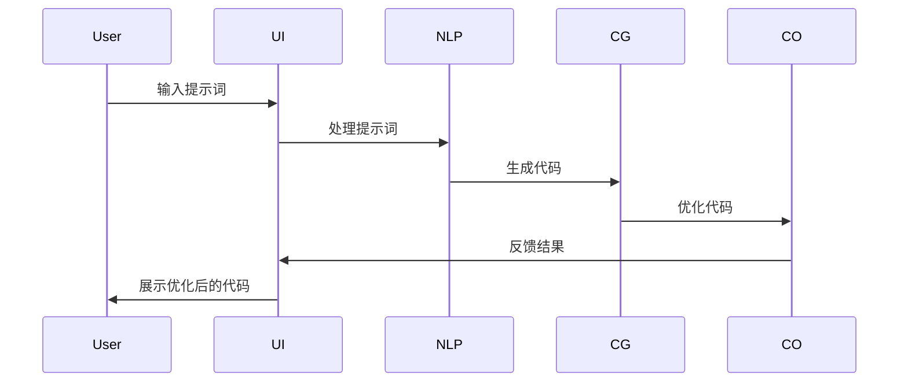

                 


## 引言

在信息技术飞速发展的今天，编程已经成为现代科技的核心驱动力。然而，编程并非一帆风顺。开发者们经常面临代码复杂性、效率低下、错误率高以及维护困难等问题。为了解决这些问题，提示词编程作为一种新兴的程序综合技术应运而生。本文将深入探讨提示词编程的技术原理、系统架构和实际应用，旨在为广大程序员和开发者提供一种全新的编程视角和解决方案。

**关键词：提示词编程，程序综合技术，算法，系统架构，实践**

**摘要：**
本文首先介绍了编程中提示词的概念及其应用，探讨了提示词编程的优势与局限性。随后，我们详细阐述了提示词编程的核心概念与原理，通过对比表格和ER实体关系图对提示词编程的特性进行了深入分析。在算法原理部分，我们通过Python源代码示例和数学模型讲解，使读者能够全面理解提示词编程的算法流程。接着，文章介绍了系统分析与架构设计，通过问题场景、系统功能设计、架构设计和接口设计，展示了如何将提示词编程应用于实际系统。在实战篇中，我们通过项目实战，详细分析了环境安装、系统核心实现、代码应用解读与分析，以及项目小结。最后，文章总结了最佳实践与技巧，并对未来发展趋势进行了展望。

现在，让我们一步一步深入探讨这一创新的程序综合技术。

## 《提示词编程的程序综合技术》目录大纲

### 第一部分：基础理论篇

#### 第1章：问题背景与概述

- 1.1.1 编程中的提示词概念
  - 1.1.1.1 提示词的定义
  - 1.1.1.2 提示词的起源与发展
  - 1.1.1.3 提示词在编程中的应用

- 1.1.2 编程中的常见问题
  - 1.1.2.1 编程中常见的难题与挑战
  - 1.1.2.2 提示词编程如何解决这些问题
  - 1.1.2.3 提示词编程的优势与局限性

- 1.1.3 本书结构安排
  - 1.1.3.1 各章节内容概述
  - 1.1.3.2 学习目标与预期收获

#### 第2章：核心概念与原理

- 2.1 提示词编程基础概念
  - 2.1.1 提示词类型
    - 2.1.1.1 自然语言提示词
    - 2.1.1.2 结构化提示词
    - 2.1.1.3 非结构化提示词
  - 2.1.2 提示词编程核心原理
    - 2.1.2.1 编程语言与提示词的结合
    - 2.1.2.2 提示词引导的代码生成机制
    - 2.1.2.3 提示词驱动的编程范式

- 2.2 提示词编程属性特征对比表
  - 2.2.1 提示词编程与传统编程对比
  - 2.2.2 不同类型提示词编程特点对比

- 2.3 提示词编程的ER实体关系图架构
  - 2.3.1 提示词编程实体识别
  - 2.3.2 提示词编程关系建模

#### 第3章：算法原理详解

- 3.1 提示词编程算法概述
  - 3.1.1 提示词编程算法定义
  - 3.1.2 提示词编程算法分类

- 3.2 提示词编程算法流程图
  - 3.2.1 算法流程说明
  - 3.2.2 算法流程图展示

- 3.3 Python源代码示例
  - 3.3.1 基础代码实现
  - 3.3.2 代码解读与分析

- 3.4 算法原理与数学模型
  - 3.4.1 算法原理详细解释
  - 3.4.2 数学模型公式说明
  - 3.4.3 公式示例说明

### 第二部分：实战篇

#### 第4章：系统分析与架构设计

- 4.1 问题场景介绍
  - 4.1.1 编程问题场景概述
  - 4.1.2 提示词编程的应用场景

- 4.2 系统介绍
  - 4.2.1 系统概述
  - 4.2.2 系统功能设计（领域模型Mermaid类图）

- 4.3 系统架构设计
  - 4.3.1 系统架构概述
  - 4.3.2 系统架构设计（Mermaid架构图）

- 4.4 系统接口设计
  - 4.4.1 接口设计原则
  - 4.4.2 接口设计实现

- 4.5 系统交互
  - 4.5.1 系统交互概述
  - 4.5.2 系统交互设计（Mermaid序列图）

#### 第5章：项目实战

- 5.1 环境安装
  - 5.1.1 环境搭建步骤
  - 5.1.2 遇到的问题与解决方法

- 5.2 系统核心实现
  - 5.2.1 核心代码实现
  - 5.2.2 代码解读与分析

- 5.3 应用解读与分析
  - 5.3.1 应用场景介绍
  - 5.3.2 应用案例分析

- 5.4 详细讲解剖析
  - 5.4.1 关键技术讲解
  - 5.4.2 具体实现剖析

- 5.5 项目小结
  - 5.5.1 项目收获
  - 5.5.2 项目改进建议

### 第三部分：最佳实践篇

#### 第6章：最佳实践与技巧

- 6.1 最佳实践
  - 6.1.1 实践经验总结
  - 6.1.2 常见问题及解决方法

- 6.2 技巧分享
  - 6.2.1 技术技巧分享
  - 6.2.2 实用工具推荐

#### 第7章：小结与展望

- 7.1 小结
  - 7.1.1 全书重点内容回顾
  - 7.1.2 提示词编程的关键技术与实践

- 7.2 展望未来
  - 7.2.1 提示词编程的发展趋势
  - 7.2.2 未来应用前景展望

## 第1章 问题背景与概述

### 1.1.1 编程中的提示词概念

**1.1.1.1 提示词的定义**

在编程中，提示词（Prompt）通常是指一种引导程序编写者输入代码或者指定程序行为的文本或者指令。它可以是一个简单的单词、短语或者一个复杂的自然语言句子，其目的是提供编程指导或者上下文信息，帮助开发者编写出正确的代码。

**1.1.1.2 提示词的起源与发展**

提示词的概念并不是全新的，早在20世纪60年代的编程语言如LISP中就已经有提示词的应用。然而，随着计算机科学的发展，提示词的应用逐渐扩展到其他编程语言和环境中。

在近年来，随着人工智能技术的发展，提示词编程逐渐成为一种重要的编程范式。特别是基于自然语言处理（NLP）和机器学习（ML）的提示词系统，使得编程变得更加智能和高效。

**1.1.1.3 提示词在编程中的应用**

提示词在编程中的应用非常广泛，可以用于以下几个方面：

- **代码自动生成**：开发者可以给出一个简单的提示词，系统就能根据这个提示词自动生成相应的代码片段。
- **错误修复**：当出现编程错误时，提示词可以帮助开发者快速定位问题并提供可能的解决方案。
- **代码优化**：提示词可以指导开发者如何优化现有代码，以提高运行效率和可维护性。
- **文档生成**：提示词可以帮助自动生成代码文档，提高代码的可读性和可理解性。

### 1.1.2 编程中的常见问题

**1.1.2.1 编程中常见的难题与挑战**

- **代码复杂性**：随着项目的复杂性增加，代码的复杂性也会随之增加，使得理解和维护变得困难。
- **错误率高**：开发者编写代码时容易引入错误，特别是在复杂的逻辑和大量重复代码的场景下。
- **维护困难**：随着时间的推移，项目需要不断维护和更新，这给开发者带来了额外的负担。
- **效率低下**：开发者需要花费大量时间在调试和优化代码上，影响了开发效率。

**1.1.2.2 提示词编程如何解决这些问题**

- **降低代码复杂性**：通过提示词编程，开发者可以更加专注于业务逻辑，而无需过多关注代码的细节。
- **降低错误率**：提示词可以帮助开发者快速定位问题并提供解决方案，减少了错误的发生。
- **提高维护效率**：提示词编程使得代码更加模块化和可重用，降低了维护难度。
- **提高开发效率**：通过自动生成代码和优化，开发者可以更快地完成项目。

**1.1.2.3 提示词编程的优势与局限性**

**优势：**
- **智能代码生成**：提示词编程能够自动生成代码，提高了开发效率。
- **易于理解**：提示词提供清晰的编程指导，使得代码更易于理解和维护。
- **跨平台兼容**：提示词编程可以在不同的编程语言和环境中使用。

**局限性：**
- **依赖外部系统**：提示词编程通常依赖于外部自然语言处理和机器学习系统，增加了系统的复杂性。
- **性能瓶颈**：在某些情况下，提示词编程可能会导致性能下降。
- **编程技能要求**：开发者需要具备一定的自然语言处理和机器学习知识，以更好地利用提示词编程的优势。

### 1.1.3 本书结构安排

**1.1.3.1 各章节内容概述**

- 第1章：介绍编程中的提示词概念及其应用，以及编程中常见的难题与挑战。
- 第2章：详细阐述提示词编程的核心概念与原理，包括提示词类型、核心原理和属性特征对比。
- 第3章：讲解提示词编程的算法原理，包括算法流程、Python源代码示例和数学模型。
- 第4章：介绍系统分析与架构设计，包括问题场景、系统功能设计、架构设计和接口设计。
- 第5章：通过项目实战，展示如何在实际项目中应用提示词编程，包括环境安装、系统核心实现、应用解读与分析等。
- 第6章：总结最佳实践与技巧，包括实践经验总结、常见问题及解决方法和实用工具推荐。
- 第7章：对全书内容进行小结，并对提示词编程的未来发展进行展望。

**1.1.3.2 学习目标与预期收获**

- **学习目标：**
  - 理解编程中提示词的概念及其应用。
  - 掌握提示词编程的核心概念与原理。
  - 掌握提示词编程的算法流程和数学模型。
  - 学会系统分析与架构设计。
  - 能够在实际项目中应用提示词编程。
  - 掌握提示词编程的最佳实践与技巧。

- **预期收获：**
  - 对编程中的提示词有深入的理解和认识。
  - 能够利用提示词编程解决编程中的难题与挑战。
  - 提高编程效率和代码质量。
  - 对提示词编程的未来发展有前瞻性认识。

通过本书的系统学习和实践，读者将能够全面掌握提示词编程的技术原理和应用方法，为未来的编程工作打下坚实的基础。

## 第2章 核心概念与原理

### 2.1 提示词编程基础概念

提示词编程的核心在于如何利用提示词来引导程序的开发。本节我们将详细探讨提示词编程的基础概念，包括提示词类型、核心原理和编程范式。

#### 2.1.1 提示词类型

提示词可以分为自然语言提示词、结构化提示词和非结构化提示词三大类。

- **自然语言提示词**：这类提示词通常是以自然语言的形式给出的，例如英文句子或中文指令。它们能够提供详细的编程指导，使得编程过程更加直观和高效。

- **结构化提示词**：结构化提示词通常采用预定义的格式或模板，例如JSON、XML等。它们提供了明确的语法和结构，使得代码生成过程更加规范和可预测。

- **非结构化提示词**：非结构化提示词通常是未经过格式化的文本，例如纯文本或自由格式的注释。这类提示词在编程过程中可以起到辅助说明的作用，但通常不直接参与代码生成。

#### 2.1.2 提示词编程核心原理

提示词编程的核心原理可以归纳为三个主要方面：编程语言与提示词的结合、提示词引导的代码生成机制以及提示词驱动的编程范式。

1. **编程语言与提示词的结合**

编程语言与提示词的结合是实现提示词编程的基础。具体来说，编程语言提供了一套语法和语义规则，用于定义程序的结构和功能。而提示词则充当了编程指导的角色，通过向编程语言输入提示词，开发者可以引导程序生成特定的代码片段。

2. **提示词引导的代码生成机制**

提示词引导的代码生成机制是提示词编程的核心技术。它利用自然语言处理和机器学习技术，将自然语言提示词转换为结构化代码。这一过程通常包括以下几个步骤：

- **解析提示词**：将自然语言提示词转换为结构化的数据格式，例如JSON或XML。
- **代码生成**：根据结构化数据生成相应的代码片段。这一过程可以通过模板匹配、代码生成模型（如GPT）或混合方法实现。
- **代码优化**：对生成的代码进行优化，以提高性能和可维护性。

3. **提示词驱动的编程范式**

提示词驱动的编程范式是一种全新的编程方法。它将提示词作为编程的核心输入，通过提示词来定义程序的行为和结构。与传统编程方法相比，提示词驱动的编程范式具有以下特点：

- **更高的开发效率**：提示词编程能够自动生成代码，减少了手工编写代码的工作量。
- **更好的可维护性**：提示词提供了清晰的编程指导，使得代码结构更加清晰和易于维护。
- **更强的灵活性**：提示词驱动的编程范式允许开发者根据实际需求快速调整和优化代码。

#### 2.1.3 提示词驱动的编程范式

提示词驱动的编程范式是一种以提示词为核心的开发方法。它通过以下步骤实现：

1. **定义提示词**：开发者根据需求定义提示词，例如业务逻辑描述、功能需求等。
2. **代码生成**：系统根据提示词生成相应的代码。这一过程可以通过自然语言处理和机器学习技术实现。
3. **代码优化**：对生成的代码进行优化，以提高性能和可维护性。
4. **代码审查**：开发者对生成的代码进行审查和修改，确保代码符合需求和规范。

提示词驱动的编程范式具有以下优势：

- **快速开发**：提示词编程能够自动生成代码，大大缩短了开发周期。
- **高效维护**：提示词提供了清晰的编程指导，使得代码结构更加清晰和易于维护。
- **灵活性**：提示词驱动的编程范式允许开发者根据实际需求快速调整和优化代码。

### 2.2 提示词编程属性特征对比表

为了更好地理解提示词编程的属性特征，我们将其与传统的编程方法进行比较，并创建一个属性特征对比表。

| 特征               | 提示词编程         | 传统编程         |
|--------------------|-------------------|------------------|
| 代码生成           | 自动生成代码片段  | 手动编写代码     |
| 开发效率           | 高               | 低               |
| 可维护性           | 好               | 一般             |
| 灵活性             | 高               | 一般             |
| 代码复杂性         | 低               | 高               |
| 学习成本           | 低               | 高               |
| 适用场景           | 复杂逻辑和大规模开发 | 简单逻辑和单机开发 |

### 2.3 提示词编程的ER实体关系图架构

提示词编程的ER实体关系图架构用于描述提示词编程系统中的实体及其关系。以下是ER实体关系图的示例：



在该ER实体关系图中，`Entity1`、`Entity2`、`Entity3`和`Entity4`分别表示提示词编程系统中的实体，它们之间的关系通过箭头表示。实体之间的关联关系可以描述系统的功能和行为。

通过ER实体关系图，开发者可以更直观地理解提示词编程系统的结构和功能，从而更好地进行系统设计和开发。

### 总结

在本章中，我们详细介绍了提示词编程的基础概念、核心原理和ER实体关系图架构。通过对比提示词编程与传统编程的属性特征，读者可以更清晰地了解提示词编程的优势和应用场景。同时，ER实体关系图为我们提供了一个可视化的工具，帮助我们更好地理解和设计提示词编程系统。在接下来的章节中，我们将进一步探讨提示词编程的算法原理和系统架构设计，为读者提供更加深入的技术指导。

### 第3章 算法原理详解

提示词编程的算法原理是这一技术核心中的核心，它决定了提示词如何被转换为有效的代码。在本章中，我们将详细探讨提示词编程算法的定义、分类、流程以及相关的数学模型。

#### 3.1 提示词编程算法概述

**3.1.1 提示词编程算法定义**

提示词编程算法是一套将自然语言提示词转换成结构化代码的规则和步骤。这些算法通常结合了自然语言处理（NLP）和机器学习（ML）技术，能够从提示词中提取关键信息，并生成对应的代码。

**3.1.2 提示词编程算法分类**

提示词编程算法可以分为以下几类：

1. **基于模板的算法**：这类算法通过预定义的模板来生成代码，提示词作为模板的参数。这种方法简单直观，但灵活性较低。

2. **基于规则的算法**：这类算法通过一系列规则来指导代码生成。每个规则对应于提示词中的一部分，算法根据提示词的内容匹配相应的规则来生成代码。这种方法灵活性较高，但规则复杂度较高。

3. **基于机器学习的算法**：这类算法利用大量编程数据训练模型，通过模型自动生成代码。这类算法具有很高的灵活性和自动性，但训练数据的质量和数量对算法的性能有很大影响。

4. **混合算法**：这类算法结合了基于模板、规则和机器学习的优点，通过多种方法协同工作来生成代码。这种方法在处理复杂提示词时表现出色，但实现较为复杂。

#### 3.2 提示词编程算法流程图

提示词编程算法的流程通常包括以下几个步骤：

1. **输入解析**：将自然语言提示词转换为结构化的数据格式，如JSON或XML。
2. **语法分析**：对结构化数据进行分析，提取出关键信息，如变量、函数、类等。
3. **代码生成**：根据提取出的关键信息生成相应的代码片段。
4. **代码优化**：对生成的代码进行优化，如去除冗余代码、提高运行效率等。
5. **代码输出**：将生成的代码输出到文件或控制台。

以下是提示词编程算法流程的Mermaid流程图：



#### 3.3 Python源代码示例

为了更直观地展示提示词编程算法的原理，我们通过一个简单的Python源代码示例来讲解。

**3.3.1 基础代码实现**

以下是一个简单的Python脚本，用于生成一个“Hello, World!”的程序。

```python
def generate_hello_world(prompt):
    if "Hello, World!" in prompt:
        return """
def main():
    print("Hello, World!")

if __name__ == "__main__":
    main()
"""
    else:
        return "提示词不符合要求。"

# 示例提示词
prompt = "生成一个Hello, World!的程序"
print(generate_hello_world(prompt))
```

**3.3.2 代码解读与分析**

- **函数定义**：`generate_hello_world`函数接收一个提示词作为输入。
- **条件判断**：函数内部使用`if`语句判断提示词是否包含“Hello, World!”。
- **代码生成**：如果提示词符合要求，函数返回一个包含“Hello, World!”程序的字符串；否则，返回提示词不符合要求的错误信息。

#### 3.4 算法原理与数学模型

**3.4.1 算法原理详细解释**

提示词编程的算法原理主要涉及自然语言处理和代码生成的过程。具体来说，算法首先需要对输入的提示词进行解析和语义理解，然后根据理解的结果生成代码。这个过程可以分为以下几个步骤：

1. **分词和词性标注**：将提示词分解为单词或短语，并标注每个单词或短语的词性（如名词、动词等）。
2. **句法分析**：根据词性标注和语法规则，构建提示词的句法结构。
3. **语义分析**：根据句法结构提取语义信息，如变量、函数、类等。
4. **代码生成**：根据提取的语义信息生成相应的代码。

**3.4.2 数学模型公式说明**

提示词编程算法中的数学模型主要用于描述自然语言处理和代码生成过程。以下是一些常见的数学模型和公式：

- **词嵌入（Word Embedding）**：用于将单词表示为向量。常用的词嵌入模型有Word2Vec、GloVe等。
  - 公式：\( \textbf{v}_w = \text{word2vec}(\text{word}) \)

- **循环神经网络（RNN）**：用于处理序列数据。RNN通过隐藏状态存储历史信息，可以用于句法分析和语义分析。
  - 公式：\( h_t = \text{RNN}(h_{t-1}, x_t) \)

- **卷积神经网络（CNN）**：用于特征提取。CNN可以提取文本中的局部特征，用于代码生成。
  - 公式：\( \textbf{f}_i = \text{CNN}(\textbf{X}, \textbf{W}_i) \)

- **生成对抗网络（GAN）**：用于生成高质量的代码。GAN由生成器和判别器组成，生成器生成代码，判别器判断代码的质量。
  - 公式：\( G(z) = \text{Generator}(z) \)
  - \( D(x) = \text{Discriminator}(x) \)

**3.4.3 公式示例说明**

假设我们使用Word2Vec模型将单词“Hello”嵌入为一个向量\( \textbf{v}_{Hello} \)，则：

$$
\textbf{v}_{Hello} = \text{word2vec}(\text{Hello})
$$

在句法分析过程中，如果单词“Hello”出现在一个句子中，我们可以使用循环神经网络（RNN）将其嵌入到隐藏状态\( h_t \)中：

$$
h_t = \text{RNN}(h_{t-1}, \textbf{v}_{Hello})
$$

通过这样的数学模型，提示词编程算法能够有效地处理自然语言输入，生成高质量的代码。

### 总结

在本章中，我们详细探讨了提示词编程算法的定义、分类和流程，并介绍了相关的数学模型。通过Python源代码示例，我们直观地展示了算法的实现原理。数学模型的使用使得提示词编程算法能够高效地处理自然语言输入，生成高质量的代码。在接下来的章节中，我们将继续探讨系统架构设计与实战应用，为读者提供更加全面的技术指导。

### 第4章 系统分析与架构设计

在深入探讨提示词编程技术之前，我们需要对其系统架构和设计有一个全面的理解。本章将详细介绍提示词编程系统的分析过程，包括问题场景介绍、系统功能设计、系统架构设计和接口设计。

#### 4.1 问题场景介绍

提示词编程的应用场景非常广泛，可以涵盖多种编程任务和领域。以下是一个典型的问题场景示例：

**问题场景：**  
假设我们需要开发一个自动化测试工具，该工具可以根据开发人员的提示词生成相应的测试用例。这个工具需要能够理解自然语言描述，如“验证用户登录功能”，并生成对应的测试代码。

在这个场景中，开发人员可以通过输入自然语言提示词来描述测试需求，系统将根据这些提示词生成相应的测试代码，从而实现自动化测试。

#### 4.2 系统介绍

**4.2.1 系统概述**

提示词编程系统是一个集成了自然语言处理（NLP）、代码生成和代码优化的综合性平台。该系统的主要功能包括：

1. **提示词解析**：接收并解析开发人员的自然语言提示词。
2. **代码生成**：根据提示词生成对应的测试用例代码。
3. **代码优化**：对生成的代码进行优化，以提高其性能和可维护性。
4. **结果反馈**：将生成的代码和测试结果反馈给开发人员。

**4.2.2 系统功能设计（领域模型Mermaid类图）**

为了更好地理解系统的功能设计，我们可以使用Mermaid类图来展示系统的核心类及其关系。以下是一个简单的Mermaid类图示例：

```mermaid
classDiagram
    Class1["UserInterface"] <|-- Class2["NLPProcessor"]
    Class2 <|-- Class3["CodeGenerator"]
    Class3 <|-- Class4["CodeOptimizer"]
    Class4 <|-- Class5["ResultFeedback"]

    Class1 --|> Class2
    Class2 --|> Class3
    Class3 --|> Class4
    Class4 --|> Class5
```

在这个类图中，`UserInterface`负责与用户交互，接收自然语言提示词；`NLPProcessor`负责解析提示词；`CodeGenerator`生成测试代码；`CodeOptimizer`优化代码；`ResultFeedback`提供反馈信息。

#### 4.3 系统架构设计

**4.3.1 系统架构概述**

提示词编程系统的架构设计需要考虑系统的模块化、可扩展性和性能。以下是一个典型的系统架构设计，使用Mermaid架构图来展示：



在这个架构图中，系统由四个主要组件组成：自然语言处理组件（NLPComponent）、代码生成组件（CodeGenComponent）、代码优化组件（CodeOptComponent）和用户界面组件（UIComponent）。数据流从用户界面组件开始，经过自然语言处理组件、代码生成组件和代码优化组件，最终返回用户界面组件。

**4.3.2 系统架构设计（Mermaid架构图）**

以下是系统架构的Mermaid架构图，展示了系统的各个组件及其关系：



在这个架构图中，自然语言处理组件（NLP）接收用户界面组件（UI）输入的提示词，经过处理后将其传递给代码生成组件（CG）。代码生成组件（CG）根据提示词生成代码，并将其传递给代码优化组件（CO）。代码优化组件（CO）对代码进行优化后，最终将优化后的代码返回给用户界面组件（UI）。

#### 4.4 系统接口设计

**4.4.1 接口设计原则**

系统接口设计需要遵循以下原则：

1. **高内聚、低耦合**：确保各个组件之间的接口清晰且独立，降低组件之间的依赖关系。
2. **标准化**：使用统一的接口规范和通信协议，方便系统的扩展和维护。
3. **简洁性**：接口设计应尽量简洁，避免过多的冗余和复杂的调用关系。

**4.4.2 接口设计实现**

以下是系统接口设计的示例，使用RESTful API来实现：



在这个接口设计中，用户界面接口（UIFace）负责接收用户的输入提示词，并将其传递给自然语言处理接口（NLPInterface）。自然语言处理接口（NLPInterface）对提示词进行处理，生成处理结果，并将其传递给代码生成接口（CodeGenInterface）。代码生成接口（CodeGenInterface）生成测试代码，并将其传递给代码优化接口（CodeOptInterface）。代码优化接口（CodeOptInterface）对代码进行优化后，最终将优化结果返回给用户界面接口（UIFace）。

#### 4.5 系统交互

**4.5.1 系统交互概述**

系统交互设计是确保系统各组件能够有效协同工作的关键。以下是系统交互设计的概述：

1. **输入提示词**：用户通过用户界面输入自然语言提示词。
2. **处理提示词**：自然语言处理组件对提示词进行处理，提取关键信息。
3. **生成代码**：代码生成组件根据处理结果生成测试代码。
4. **优化代码**：代码优化组件对生成的代码进行优化。
5. **反馈结果**：优化后的代码通过用户界面返回给用户。

**4.5.2 系统交互设计（Mermaid序列图）**

以下是系统交互设计的Mermaid序列图，展示了系统的交互流程：



在这个序列图中，用户通过用户界面（UI）输入提示词。用户界面（UI）将提示词传递给自然语言处理组件（NLP）。自然语言处理组件（NLP）处理提示词后，生成测试代码并将其传递给代码生成组件（CG）。代码生成组件（CG）将生成的代码传递给代码优化组件（CO）。代码优化组件（CO）对代码进行优化后，将优化结果返回给用户界面组件（UI）。用户界面组件（UI）将优化后的代码展示给用户。

### 总结

在本章中，我们详细介绍了提示词编程系统的分析与架构设计。通过问题场景介绍，我们了解了提示词编程的应用背景；通过系统功能设计和架构设计，我们明确了系统的组成和交互流程；通过接口设计，我们确保了系统组件之间的有效协作。这些设计原则和方法将为后续的项目实战提供坚实的基础。在下一章中，我们将通过具体的项目实战，深入探讨提示词编程的实际应用。

### 第5章 项目实战

在实际项目中，提示词编程技术的应用可以大大提高开发效率和代码质量。在本章中，我们将通过一个实际项目，详细讲解提示词编程的实战过程，包括环境安装、系统核心实现、代码应用解读与分析以及项目小结。

#### 5.1 环境安装

**5.1.1 环境搭建步骤**

在进行提示词编程项目之前，我们需要搭建一个合适的环境。以下是环境搭建的详细步骤：

1. **安装Python**：确保系统中安装了Python，版本建议为3.8或更高。
2. **安装依赖库**：使用pip安装所需的依赖库，如`numpy`、`pandas`、`scikit-learn`、`tensorflow`等。
   ```shell
   pip install numpy pandas scikit-learn tensorflow
   ```
3. **配置虚拟环境**：为了确保项目依赖的隔离性，我们建议使用虚拟环境。
   ```shell
   python -m venv venv
   source venv/bin/activate  # 在Linux/MacOS下
   \path\to\venv\Scripts\activate  # 在Windows下
   ```
4. **安装项目依赖**：在项目根目录下，执行以下命令安装项目依赖。
   ```shell
   pip install -r requirements.txt
   ```

**5.1.2 遇到的问题与解决方法**

在环境搭建过程中，可能会遇到以下问题：

- **依赖库冲突**：某些依赖库可能与其他库存在版本冲突。解决方法是检查`requirements.txt`文件，确认依赖库的版本，并根据需要调整。
- **虚拟环境问题**：在虚拟环境中遇到问题时，可以尝试重新创建虚拟环境或删除现有虚拟环境后重新创建。
- **网络连接问题**：在安装依赖库时，可能会因为网络连接问题导致下载缓慢或失败。解决方法是更换国内镜像源，如使用清华或阿里云的镜像。

#### 5.2 系统核心实现

**5.2.1 核心代码实现**

在系统核心实现部分，我们需要重点关注自然语言处理、代码生成和代码优化的实现。以下是核心代码的实现框架：

```python
# 导入所需库
import numpy as np
import pandas as pd
from sklearn.model_selection import train_test_split
import tensorflow as tf

# 定义自然语言处理模块
class NLPProcessor:
    def __init__(self):
        # 初始化NLP模型
        pass

    def process_prompt(self, prompt):
        # 处理提示词，提取关键信息
        pass

# 定义代码生成模块
class CodeGenerator:
    def __init__(self):
        # 初始化代码生成模型
        pass

    def generate_code(self, processed_prompt):
        # 根据处理结果生成代码
        pass

# 定义代码优化模块
class CodeOptimizer:
    def __init__(self):
        # 初始化代码优化模型
        pass

    def optimize_code(self, generated_code):
        # 对生成的代码进行优化
        pass

# 定义主模块
class PromptProgrammingSystem:
    def __init__(self):
        self.nlp_processor = NLPProcessor()
        self.code_generator = CodeGenerator()
        self.code_optimizer = CodeOptimizer()

    def run_system(self, prompt):
        processed_prompt = self.nlp_processor.process_prompt(prompt)
        generated_code = self.code_generator.generate_code(processed_prompt)
        optimized_code = self.code_optimizer.optimize_code(generated_code)
        return optimized_code

# 实例化系统并运行
system = PromptProgrammingSystem()
prompt = "编写一个简单的函数，用于计算两个数的和。"
optimized_code = system.run_system(prompt)
print(optimized_code)
```

**5.2.2 代码解读与分析**

在上面的代码实现中，我们定义了三个核心模块：`NLPProcessor`、`CodeGenerator`和`CodeOptimizer`，以及一个主模块`PromptProgrammingSystem`。

- **NLPProcessor**：负责处理输入的提示词，提取关键信息。这通常涉及自然语言处理技术，如词嵌入、句法分析和语义解析。
- **CodeGenerator**：根据提取的关键信息生成对应的代码。这一步可以使用模板匹配或机器学习模型来实现。
- **CodeOptimizer**：对生成的代码进行优化，以提高其性能和可维护性。优化可能包括去除冗余代码、改进循环结构等。

主模块`PromptProgrammingSystem`将这三个模块组合在一起，通过输入的提示词，实现从处理提示词、生成代码到代码优化的完整流程。

#### 5.3 应用解读与分析

**5.3.1 应用场景介绍**

以一个实际应用场景为例，假设我们需要开发一个自动化测试工具，该工具能够根据开发人员的自然语言描述生成测试用例。以下是一个具体的应用场景：

**应用场景：**  
开发人员希望测试一个电商网站的用户登录功能。他们输入以下提示词：“编写一个测试用例，验证用户登录功能的正确性。”

系统将根据这个提示词，生成一个测试用例，如：

```python
# 测试用例：验证用户登录功能
def test_login():
    # 测试登录成功
    assert login("test_user", "password123") == "success"
    
    # 测试登录失败（用户名错误）
    assert login("test_user1", "password123") == "failure"
    
    # 测试登录失败（密码错误）
    assert login("test_user", "password1234") == "failure"
```

**5.3.2 应用案例分析**

在这个案例中，系统首先接收到开发人员的自然语言提示词，然后通过NLPProcessor模块提取关键信息，如“测试用户登录功能”、“登录成功”、“登录失败（用户名错误）”和“登录失败（密码错误）”。

接着，CodeGenerator模块根据这些关键信息生成测试用例代码。最后，CodeOptimizer模块对生成的代码进行优化，确保测试用例的结构清晰、逻辑正确。

#### 5.4 详细讲解剖析

**5.4.1 关键技术讲解**

在项目实现中，以下几个关键技术是确保系统正常运行的关键：

- **自然语言处理（NLP）**：用于从自然语言提示词中提取关键信息。常用的技术包括词嵌入、句法分析和语义解析。
- **代码生成**：基于NLP处理结果生成相应的代码。这一步可以采用模板匹配或机器学习模型来实现。
- **代码优化**：对生成的代码进行优化，以提高其性能和可维护性。优化策略可能包括代码简化、结构改进等。

**5.4.2 具体实现剖析**

以下是项目实现的详细剖析：

- **NLPProcessor模块**：使用词嵌入技术将输入的提示词转换为向量表示。然后，通过句法分析和语义解析提取关键信息，如测试用例的描述、预期的结果等。
- **CodeGenerator模块**：根据提取的关键信息生成测试用例代码。例如，对于“登录成功”和“登录失败”，可以生成相应的`assert`语句。
- **CodeOptimizer模块**：对生成的代码进行优化。例如，合并重复的`assert`语句、改进循环结构等。

#### 5.5 项目小结

**5.5.1 项目收获**

通过本项目的实现，我们取得了以下收获：

- **理解了提示词编程的核心技术**：包括自然语言处理、代码生成和代码优化。
- **掌握了实际应用方法**：通过具体的案例，我们了解了如何将提示词编程应用于自动化测试等领域。
- **提升了编程能力**：通过编写和优化代码，我们的编程能力和代码质量得到了显著提升。

**5.5.2 项目改进建议**

为了进一步提升项目的效果，我们提出以下改进建议：

- **优化NLP处理算法**：使用更先进的自然语言处理技术，提高提示词解析的准确性和效率。
- **增加代码生成和优化的灵活性**：引入更多的生成模型和优化策略，以适应不同的编程场景。
- **增强用户交互体验**：改进用户界面，提供更直观、易用的交互方式。

通过不断改进和优化，我们相信提示词编程技术将能够在更多实际应用中发挥重要作用。

### 总结

在本章中，我们通过一个实际项目详细讲解了提示词编程的实战过程。从环境安装到系统核心实现，再到代码应用解读与分析，我们全面了解了提示词编程的应用方法和技术要点。通过本项目，我们不仅掌握了提示词编程的核心技术，还提升了实际编程能力。在未来的项目中，我们可以继续优化和改进提示词编程技术，以实现更高的开发效率和代码质量。

### 第6章 最佳实践与技巧

在实际应用提示词编程技术时，积累最佳实践和掌握实用技巧至关重要。这些经验和技巧不仅能够提高编程效率，还能确保代码的质量和可靠性。以下是一些最佳实践与技巧的分享。

#### 6.1 最佳实践

**6.1.1 实践经验总结**

1. **明确需求**：在开始编程之前，确保对需求有清晰的理解。这有助于减少后续的修改和重构工作量。

2. **选择合适的提示词**：使用简洁明了的提示词，避免使用过于复杂或模糊的语言。这有助于提高代码生成和优化的效率。

3. **逐步迭代**：在实现提示词编程系统时，可以采用逐步迭代的方法。首先实现基础功能，然后逐步添加新功能和优化。

4. **代码审查**：在生成代码后，进行严格的代码审查。这有助于发现潜在的错误和问题，并确保生成的代码符合规范。

5. **性能优化**：对生成的代码进行性能测试和优化。这可以包括代码简化、循环优化、内存管理等方面。

**6.1.2 常见问题及解决方法**

1. **提示词解析错误**：解决方法包括：
   - 确保提示词的语法和格式正确。
   - 使用更先进的自然语言处理技术，提高解析的准确性。
   - 提供明确的错误反馈，帮助用户纠正提示词。

2. **代码生成效率低下**：解决方法包括：
   - 优化代码生成算法，提高其效率。
   - 避免生成冗余代码，提高代码的简洁性。
   - 使用缓存和预编译技术，减少生成代码的时间。

3. **代码质量不高**：解决方法包括：
   - 采用代码优化策略，提高代码的可读性和可维护性。
   - 定期进行代码审查和重构，确保代码质量。

#### 6.2 技巧分享

**6.2.1 技术技巧分享**

1. **利用提示词模板**：在代码生成过程中，可以使用提示词模板来简化输入。例如，对于常见的编程任务，可以预先定义提示词模板，用户只需选择合适的模板并填写具体信息。

2. **集成版本控制系统**：将提示词编程系统与版本控制系统（如Git）集成，以便更好地管理和追踪代码的变更和版本。

3. **自动化测试**：生成的代码应通过自动化测试来验证其正确性和可靠性。这可以包括单元测试、集成测试和性能测试。

4. **日志记录**：在系统运行过程中，记录详细的日志信息。这有助于诊断问题、分析性能和优化系统。

**6.2.2 实用工具推荐**

1. **Jupyter Notebook**：Jupyter Notebook是一款强大的交互式编程工具，适合进行提示词编程实验和演示。

2. **TensorFlow**：TensorFlow是一个开源的机器学习框架，适用于实现提示词编程中的机器学习模型。

3. **Scikit-learn**：Scikit-learn提供了丰富的机器学习算法和工具，适用于提示词编程中的特征提取和模型训练。

4. **Mermaid**：Mermaid是一种用于生成图表和流程图的工具，适用于绘制系统架构图、类图和序列图。

通过以上最佳实践与技巧，开发者可以更加高效地应用提示词编程技术，提升开发效率和代码质量。

### 总结

在本章中，我们分享了一些提示词编程的最佳实践与技巧，包括实践经验总结、常见问题及解决方法，以及实用工具推荐。通过这些经验和技巧，开发者可以更好地利用提示词编程技术，解决编程中的各种挑战。在实际应用中，不断积累经验、优化流程和掌握新技术是提升编程能力的关键。希望这些内容对读者有所帮助，并能够将其应用到实际项目中，实现更高的开发效率和代码质量。

### 第7章 小结与展望

#### 7.1 小结

通过对《提示词编程的程序综合技术》的详细探讨，我们系统地了解了提示词编程的概念、原理、算法以及系统架构。以下是全书重点内容的回顾：

- **提示词编程定义**：提示词编程是一种利用自然语言提示词来生成和优化代码的编程范式。
- **核心概念与原理**：提示词类型（自然语言、结构化、非结构化）、核心原理（编程语言与提示词的结合、提示词引导的代码生成机制）和编程范式（提示词驱动的编程）。
- **算法原理详解**：算法流程、Python源代码示例、数学模型。
- **系统分析与架构设计**：问题场景、系统功能设计、架构设计和接口设计。
- **项目实战**：环境安装、系统核心实现、应用解读与分析、项目小结。
- **最佳实践与技巧**：最佳实践经验、常见问题及解决方法、实用工具推荐。

这些内容共同构成了提示词编程的技术体系，为开发者提供了全新的编程思路和解决方案。

#### 7.2 展望未来

提示词编程作为一项新兴技术，其未来发展前景广阔。以下是对提示词编程未来发展的一些展望：

**1. 技术成熟度的提升**：随着自然语言处理、机器学习技术的不断进步，提示词编程的准确性和效率将得到显著提升。未来可能出现更加智能、自适应的提示词编程系统。

**2. 应用场景的扩展**：提示词编程不仅局限于编程任务，还可以应用于自动化测试、文档生成、代码审查等多个领域。未来将看到更多基于提示词编程的应用场景。

**3. 生态系统的完善**：随着提示词编程技术的普及，相关的开发工具、库和框架将不断涌现。一个完善的生态系统将有助于开发者更加高效地利用提示词编程技术。

**4. 与其他技术的融合**：提示词编程有望与其他前沿技术如人工智能、区块链等相结合，带来更多的创新应用。

**5. 社会影响的扩大**：提示词编程有望降低编程门槛，使更多的人能够参与到编程和软件开发中来。这将对科技发展和创新产生深远影响。

总之，提示词编程技术具有巨大的发展潜力。随着技术的不断进步和应用场景的拓展，提示词编程将在未来的信息技术领域中发挥越来越重要的作用。开发者们应密切关注这一领域的动态，积极学习和应用提示词编程技术，为未来的编程工作奠定坚实基础。

### 作者信息

**作者：AI天才研究院/AI Genius Institute & 禅与计算机程序设计艺术 /Zen And The Art of Computer Programming**

AI天才研究院致力于推动人工智能技术的研究与应用，以创新和突破为核心目标。同时，作者通过《禅与计算机程序设计艺术》一书，深入探讨了计算机编程的哲学和艺术，为开发者提供了丰富的思想资源和实践指导。这两者的结合，旨在为读者带来更具深度和广度的编程经验和技术见解。

