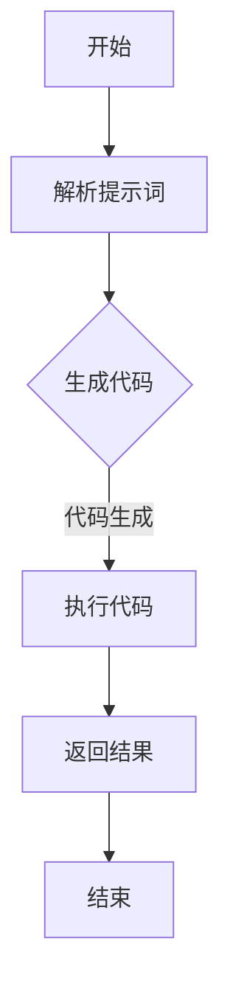
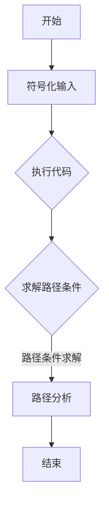
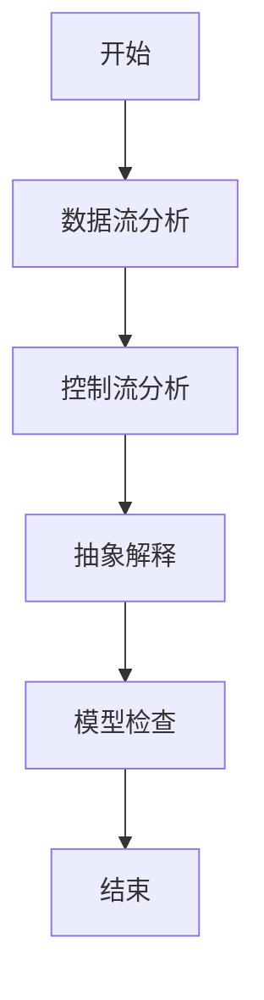
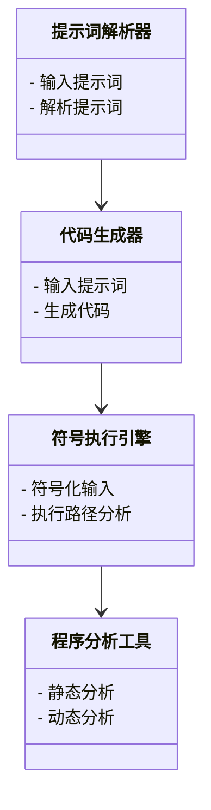
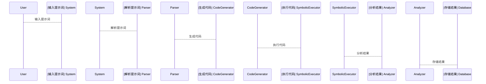
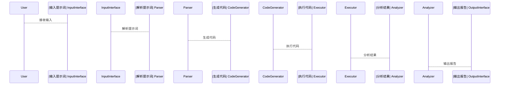
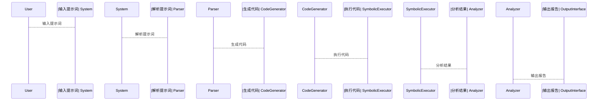

                 


### 引言

随着信息技术的快速发展，编程语言和技术手段的不断演进，编程的方式也逐渐多样化。其中，提示词编程（Keyword Programming）作为一种新型的编程范式，逐渐引起了业界的关注。提示词编程的核心思想是通过简单的关键词来定义程序的逻辑，使得编程过程更加直观、简洁。而符号执行（Symbolic Execution）与程序分析（Program Analysis）作为两种重要的程序分析方法，在提示词编程中发挥着关键作用。

符号执行是一种动态程序分析技术，通过对程序执行路径的符号化模拟，来探索程序行为的各种可能性。它能够在不实际运行程序的情况下，发现潜在的漏洞和错误，从而提高软件的质量和安全性。而程序分析则是通过静态分析或动态分析手段，对程序的结构、行为、语义等方面进行深入理解，以便优化程序、提高性能、发现潜在问题。

本文将从提示词编程、符号执行和程序分析三个核心概念出发，探讨它们之间的关系及其在编程中的重要性。文章结构如下：

- **第一部分：基础理论**，介绍提示词编程、符号执行和程序分析的基本概念和背景，阐述三者之间的关系。
- **第二部分：核心概念**，深入探讨提示词编程、符号执行和程序分析的核心概念，通过表格和ER图进行概念对比。
- **第三部分：算法原理讲解与实战**，详细讲解提示词编程、符号执行和程序分析的算法原理，并通过实例说明。
- **第四部分：系统分析与架构设计**，介绍系统分析与架构设计的方法，包括问题场景介绍、系统功能设计、系统架构设计和系统交互。
- **第五部分：项目实战**，通过一个实际项目，展示如何将提示词编程、符号执行和程序分析应用于实际编程中。

通过本文的阅读，读者将能够对提示词编程、符号执行和程序分析有一个全面而深入的了解，从而在编程实践中更好地运用这些技术，提高软件开发的质量和效率。

### 提示词编程基础

#### 提示词编程概述

提示词编程是一种以关键词为主要表达方式的编程范式，它通过将复杂逻辑转化为一系列简单关键词的组合，来简化编程过程。提示词编程的核心思想是利用一组预定义的提示词来描述程序的逻辑，这些提示词通常对应着特定的操作或功能。例如，在自然语言处理中，可以使用“识别”、“分类”、“生成”等提示词来描述数据处理流程。这种编程方式的优势在于，它降低了编程的复杂性，使得非专业人士也能够通过简单的关键词组合来完成编程任务。

#### 提示词编程的工作原理

提示词编程的工作原理可以分为以下几个步骤：

1. **提示词定义**：首先，需要定义一组提示词，这些提示词通常是预定义的，可以根据实际需求进行扩展。每个提示词对应一种特定的操作或功能。

2. **解析与映射**：在编程过程中，程序员或人工智能助手将自然语言或特定语法形式的提示词输入系统，系统会解析这些提示词，并映射到具体的代码实现。

3. **代码生成**：系统根据解析结果，生成相应的代码。这个过程可以是完全自动的，也可以是半自动的，由程序员进行一定的调整。

4. **代码执行**：生成的代码将被执行，完成预期的任务。

#### 提示词编程的应用场景

提示词编程的应用场景非常广泛，以下是一些典型的应用场景：

1. **自然语言处理**：在自然语言处理领域，提示词编程可以用于文本分类、情感分析、机器翻译等任务。例如，通过“分类”提示词，可以将一段文本分类到不同的类别中。

2. **自动化测试**：在自动化测试中，提示词编程可以用于自动化测试脚本的编写，通过一系列简单的提示词，快速生成复杂的测试用例。

3. **数据分析和可视化**：在数据分析和可视化任务中，提示词编程可以用于简化数据分析过程，通过提示词，快速生成数据报告或可视化图表。

4. **人工智能助手**：在人工智能助手领域，提示词编程可以用于实现简单的问答系统，用户可以通过输入简单的关键词来获取信息或完成特定任务。

#### 提示词编程的优势与挑战

提示词编程的优势在于其简洁性和易用性。通过简单的关键词组合，程序员可以快速完成复杂的编程任务，从而提高开发效率。此外，提示词编程还能够降低编程的门槛，使得非专业人士也能够参与到编程中来。

然而，提示词编程也面临着一些挑战。首先，提示词的定义和映射需要大量的工作，而且不同的提示词可能存在冲突或歧义。其次，生成的代码可能不够灵活，难以应对复杂多变的编程需求。此外，提示词编程的执行效率和性能也是一个需要关注的问题。

### 总结

提示词编程作为一种新型的编程范式，具有很大的发展潜力。通过理解其基本概念和工作原理，我们可以更好地应用这一技术，提高软件开发的质量和效率。在下一部分中，我们将深入探讨符号执行的原理和应用，继续对编程技术进行深入分析。

### 符号执行原理

#### 符号执行概述

符号执行（Symbolic Execution）是一种动态程序分析技术，通过将程序输入符号化，模拟程序的执行路径，以探索程序行为的各种可能性。它不仅能够检测出潜在的运行错误，还能帮助开发者理解程序的执行过程和可能的异常情况。符号执行的核心思想是将程序中的变量和路径条件符号化，通过符号求解器来分析程序的行为。

符号执行的主要优势在于其强大的路径覆盖能力。与传统的静态分析和动态分析不同，符号执行可以在不实际运行程序的情况下，遍历程序的所有可能的执行路径，从而发现潜在的错误和漏洞。这对于复杂的程序，尤其是那些具有多种输入条件和路径分支的程序，具有极大的价值。

#### 符号执行机制

符号执行机制可以分为以下几个步骤：

1. **符号化输入**：首先，将程序的输入参数符号化。符号化的输入可以是一组变量，它们代表具体的输入值，但初始时未指定具体值。

2. **执行路径生成**：在符号化输入的基础上，模拟程序的执行过程。程序中的每个语句都会根据条件分支产生多个执行路径。对于每个路径，符号执行都会生成相应的路径条件。

3. **路径条件求解**：使用符号求解器来求解路径条件。路径条件求解是一个组合爆炸问题，但通过有效的求解策略，如约束求解器（Constraint Solver）和决策图（Decision Diagrams），可以有效地求解路径条件。

4. **路径分析**：对每个路径的结果进行收集和分析。这包括检查路径上的每个语句是否满足预期的条件，以及路径上的变量是否达到特定的取值。

5. **错误检测与修复**：根据路径分析的结果，检测出程序中的错误和潜在漏洞。这些错误和漏洞可能是运行时错误，也可能是逻辑错误。

#### 符号执行的应用领域

符号执行在多个领域有着广泛的应用：

1. **软件测试**：符号执行可以用于生成全面的全覆盖测试用例，检测出程序中潜在的漏洞和错误。它在自动化测试中特别有用，可以大大减少测试用例的编写时间。

2. **安全分析**：符号执行可以帮助识别程序中的安全漏洞，如缓冲区溢出、空指针引用等。它在安全关键系统的开发中具有重要价值。

3. **优化与性能分析**：符号执行可以用于分析程序的执行路径，找出性能瓶颈，并进行优化。

4. **教育**：符号执行可以帮助学生和开发者更好地理解程序的执行过程和潜在的异常情况，提高编程技能。

#### 符号执行的优势与局限

符号执行的优势在于其强大的路径覆盖能力和对程序执行细节的深入分析能力。它能够在不实际运行程序的情况下，发现潜在的问题，从而提高软件的质量和安全性。

然而，符号执行也存在一些局限。首先，符号执行的时间复杂度较高，尤其是当程序路径数量庞大时，求解过程可能变得非常耗时。其次，符号执行的求解过程可能依赖于特定的求解器，不同的求解器性能和适用范围可能有所不同。此外，符号执行对程序的语法和语义有较高的要求，对于一些复杂或不规范编写的程序，符号执行的准确性和效率可能会受到影响。

### 总结

符号执行作为一种强大的程序分析技术，在软件测试、安全分析和优化等领域有着广泛的应用。通过理解符号执行的原理和机制，我们可以更好地利用这一技术，提高软件开发的质量和效率。在下一部分中，我们将探讨程序分析的基础知识，进一步深入理解程序分析在编程中的应用。

### 程序分析基础

#### 程序分析概述

程序分析（Program Analysis）是计算机科学中的一种重要研究方法，它旨在通过静态分析或动态分析手段，对程序的结构、行为、语义等方面进行深入理解。程序分析的目标是提取程序的相关信息，以便进行优化、调试、验证等操作。程序分析的核心在于对程序执行过程中的各种行为进行抽象和建模，从而在不实际运行程序的情况下，预测程序的行为和性能。

程序分析可以分为两大类：静态分析和动态分析。

- **静态分析**：静态分析是在不执行程序的情况下对程序进行深入分析。它通过解析程序代码，提取程序的结构和语义信息，如变量依赖关系、控制流图、数据流图等。静态分析的主要优势是速度快、效率高，适用于大规模程序的分析。

- **动态分析**：动态分析是在程序实际运行过程中对其进行监测和分析。动态分析可以实时记录程序的执行行为，如函数调用、变量值变化等。动态分析的主要优势在于能够捕捉程序的实际运行状态，提供更精确的分析结果。

#### 程序分析的方法

程序分析的方法多种多样，以下是一些常见的方法：

1. **数据流分析**：数据流分析是一种重要的程序分析方法，它研究程序中数据如何流动和传播。数据流分析可以提取出程序中的变量定义、引用和使用情况，从而帮助理解程序的语义和优化程序。

2. **控制流分析**：控制流分析关注程序中控制流程的流动，如函数调用、返回、条件分支等。通过控制流分析，可以生成程序的控制流图，用于理解程序的执行路径和潜在的异常情况。

3. **路径分析**：路径分析是一种研究程序中所有可能执行路径的技术。路径分析可以用于生成测试用例、检测程序中的错误和漏洞。特别是对于具有复杂条件分支的程序，路径分析能够揭示出所有可能的执行路径，从而提高软件的质量和安全性。

4. **抽象解释**：抽象解释是一种静态分析方法，通过使用简化的抽象模型来分析程序的行为。抽象解释能够提供对程序行为的近似理解，从而在较低的时间复杂度下发现潜在的问题。

5. **模型检查**：模型检查是一种形式化的分析方法，通过将程序行为建模为状态转换系统，来验证程序是否满足特定的性质或规范。模型检查通常使用自动验证工具，如模型检查器（Model Checkers），来检查程序的正确性。

#### 程序分析的应用

程序分析在软件开发和运维过程中有着广泛的应用：

1. **代码审查和修复**：程序分析可以帮助开发者发现代码中的潜在问题，如未初始化的变量、死代码、逻辑错误等。通过静态分析工具，如代码检查器（Code Checkers）和静态代码分析工具（Static Code Analyzers），可以自动化地发现这些问题，从而提高代码的质量。

2. **性能优化**：程序分析可以用于识别程序的瓶颈和性能问题。通过控制流和数据流分析，可以找出影响程序性能的关键部分，从而进行针对性的优化。

3. **测试用例生成**：程序分析可以用于生成测试用例，以覆盖程序的各个执行路径。特别是在自动化测试中，程序分析可以帮助自动化生成测试数据，提高测试的全面性和效率。

4. **安全漏洞检测**：程序分析可以用于检测程序中的安全漏洞，如缓冲区溢出、空指针引用等。动态分析工具可以在程序运行时捕捉异常行为，从而发现潜在的安全威胁。

5. **代码重构**：程序分析可以用于代码重构，即在不改变程序外部行为的前提下，对代码进行结构上的调整和优化。通过数据流和控制流分析，可以重构代码，使其更加清晰、易于理解和维护。

#### 程序分析的优势与挑战

程序分析的优势在于其高效性和全面性。通过静态和动态分析，可以快速、全面地理解程序的各个方面，从而提高软件开发的质量和效率。此外，程序分析还能够自动化地发现和修复代码中的问题，降低开发成本。

然而，程序分析也面临一些挑战。首先，程序分析需要对程序有深入的理解，特别是对于复杂和高度非线性的程序，分析结果的准确性和可靠性可能受到限制。其次，程序分析工具的构建和维护需要大量的资源和专业知识。此外，程序分析工具的性能和可扩展性也是一个需要关注的问题。

### 总结

程序分析作为软件开发和运维中的重要方法，具有广泛的应用和重要的价值。通过理解程序分析的基本概念和方法，我们可以更好地利用这一技术，提高软件的质量和效率。在下一部分中，我们将探讨提示词编程、符号执行和程序分析之间的关系，进一步深入理解它们在编程中的综合应用。

### 提示词编程、符号执行与程序分析的关系

#### 三者的关系

提示词编程、符号执行和程序分析是软件开发领域中的三个重要概念，它们各自发挥着独特的作用，但也有着紧密的联系。

提示词编程通过将复杂的编程逻辑简化为简单的关键词组合，提高了编程的易用性和效率。而符号执行则利用动态分析技术，在程序运行过程中模拟所有可能的执行路径，以发现潜在的错误和漏洞。程序分析作为一种静态和动态分析手段，通过对程序的深入理解，帮助开发者优化程序、提高性能、检测错误和漏洞。

三者之间的关系可以概括为：提示词编程为编程过程提供了简洁的语法和高效的方式；符号执行为提示词编程提供了一个强大的动态分析工具，以检测程序中的潜在问题；程序分析则为符号执行提供了理论基础和方法支持，使得符号执行能够更有效地进行。

#### 提示词编程与符号执行的融合

提示词编程与符号执行的融合，使得编程过程更加智能化和自动化。以下是一些融合的应用场景：

1. **自动化错误检测**：在提示词编程中，符号执行可以用于自动化检测代码中的错误。例如，当程序员输入一个提示词组合后，系统可以通过符号执行来模拟程序的执行路径，检测出可能存在的逻辑错误或数据异常。

2. **优化代码生成**：符号执行可以帮助提示词编程系统优化代码生成过程。通过分析提示词的语义，符号执行可以生成更高效、更安全的代码实现。例如，对于复杂的数据处理任务，符号执行可以根据输入数据的分布情况，生成优化的处理算法。

3. **代码审查**：符号执行可以与提示词编程结合，用于自动化代码审查。在代码审查过程中，符号执行可以检测出潜在的代码漏洞和性能问题，并提供改进建议。这样，开发人员可以更快地识别和修复代码中的问题，提高代码质量。

4. **动态调试**：在提示词编程过程中，符号执行可以提供动态调试功能。通过实时分析程序的执行路径和变量值，开发人员可以更直观地理解程序的执行过程，快速定位和解决问题。

#### 程序分析在提示词编程中的应用

程序分析在提示词编程中也有着重要的应用，主要体现在以下几个方面：

1. **代码生成优化**：程序分析可以帮助提示词编程系统优化代码生成过程。通过分析程序的结构和行为，程序分析可以生成更简洁、更高效的代码。例如，在数据流分析中，可以通过优化变量依赖关系，减少冗余代码的生成。

2. **错误检测**：程序分析可以用于自动化错误检测。例如，通过控制流分析，可以检测出程序中的死代码和潜在的逻辑错误。此外，数据流分析可以检测出未初始化的变量和使用不当的数据。

3. **性能优化**：程序分析可以帮助优化程序的执行性能。通过分析程序的瓶颈和关键路径，可以找到影响性能的关键因素，并进行针对性的优化。例如，通过路径分析，可以生成更高效的代码分支，减少程序的执行时间。

4. **安全性评估**：程序分析可以用于评估程序的安全性。通过符号执行和模型检查等技术，可以检测出程序中的安全漏洞，如缓冲区溢出、空指针引用等。此外，程序分析还可以帮助评估程序是否符合安全规范，从而提高程序的安全性。

#### 总结

提示词编程、符号执行和程序分析在软件开发领域各具特色，但它们之间的紧密联系和融合，为开发者提供了更高效、更智能的编程手段。通过理解三者的关系和应用场景，开发者可以更好地利用这些技术，提高软件开发的效率和质量。

在下一部分中，我们将深入探讨提示词编程、符号执行和程序分析的核心概念，通过表格和ER图进行概念对比，进一步深化对这三个概念的理解。

### 核心概念深入探讨

在这一部分，我们将深入探讨提示词编程、符号执行和程序分析的核心概念，通过表格和ER图进行概念对比，以帮助读者更好地理解这些概念及其之间的联系。

#### 提示词编程的核心概念

1. **提示词**：提示词是编程语言的基本构建块，它们代表了特定的操作或功能。例如，“分类”、“识别”、“生成”等。
2. **解析器**：解析器是提示词编程系统的核心组件，负责将自然语言或特定语法形式的提示词解析为计算机可执行的指令。
3. **代码生成器**：代码生成器根据解析后的提示词生成具体的程序代码。这个过程中，系统可能需要根据提示词的语义进行代码优化。
4. **执行引擎**：执行引擎负责执行生成的代码，完成特定的任务。

#### 符号执行的核心概念

1. **符号化输入**：符号执行将程序输入和内部变量符号化，而不是用具体的值来代替。
2. **路径条件**：在程序执行过程中，每个分支点产生的条件称为路径条件。这些条件用于决定程序执行的具体路径。
3. **求解器**：求解器用于求解路径条件，它可以是约束求解器、符号求解器等。
4. **路径分析**：路径分析是符号执行的核心步骤，通过遍历所有可能的执行路径，来分析程序的行为。

#### 程序分析的核心概念

1. **数据流分析**：数据流分析研究程序中数据的流动和传播，包括变量的定义、引用和传递。
2. **控制流分析**：控制流分析研究程序的控制流程，如函数调用、返回、条件分支等。
3. **抽象解释**：抽象解释是一种静态分析方法，通过简化的抽象模型来分析程序的行为。
4. **模型检查**：模型检查通过将程序行为建模为状态转换系统，来验证程序是否满足特定的性质或规范。

#### 概念对比表格

| 概念                 | 提示词编程               | 符号执行                       | 程序分析                    |
|----------------------|------------------------|--------------------------------|---------------------------|
| 核心构建块           | 提示词                  | 符号化输入、路径条件           | 数据流、控制流               |
| 关键组件             | 解析器、代码生成器、执行引擎 | 求解器、路径分析               | 分析工具、抽象解释、模型检查 |
| 目标                 | 简化编程、提高易用性     | 错误检测、路径覆盖             | 优化、错误检测、验证         |
| 特点                 | 简洁、直观、自动化生成   | 符号化、路径遍历、动态分析     | 静态分析、抽象、形式化验证   |
| 应用场景             | 编程、自动化测试、AI     | 软件测试、安全分析、性能优化   | 代码审查、性能优化、安全验证 |
| 技术融合             | 与AI结合、优化代码生成   | 与动态调试、自动化测试结合     | 与抽象解释、模型检查结合     |

#### ER图架构

以下是使用Mermaid绘制的ER图，展示了提示词编程、符号执行和程序分析的核心实体及其关系：

```mermaid
erDiagram
    A((提示词编程)) ||--|{ B((解析器)) } : "使用"
    A ||--|{ C((代码生成器)) } : "生成"
    A ||--|{ D((执行引擎)) } : "执行"
    
    E((符号执行)) ||--|{ F((符号化输入)) } : "输入"
    E ||--|{ G((路径条件)) } : "条件"
    E ||--|{ H((求解器)) } : "求解"
    E ||--|{ I((路径分析)) } : "分析"
    
    J((程序分析)) ||--|{ K((数据流分析)) } : "分析"
    J ||--|{ L((控制流分析)) } : "分析"
    J ||--|{ M((抽象解释)) } : "解释"
    J ||--|{ N((模型检查)) } : "检查"
```

通过上述表格和ER图，我们可以更清晰地理解提示词编程、符号执行和程序分析的核心概念及其相互关系。在下一部分中，我们将详细讲解这些概念的工作原理，并通过具体的实例进行说明。

### 核心概念原理

#### 提示词编程的工作原理

提示词编程的工作原理基于简单的关键词组合，通过这些关键词定义程序的逻辑。具体来说，提示词编程分为以下几个步骤：

1. **提示词定义**：首先，定义一组提示词，这些提示词通常是预定义的，可以根据实际需求进行扩展。每个提示词对应一种特定的操作或功能。例如，“分类”、“识别”、“生成”等。

2. **解析与映射**：程序员或人工智能助手将自然语言或特定语法形式的提示词输入系统，系统会解析这些提示词，并映射到具体的代码实现。例如，“分类”可能会映射到一个特定的分类函数。

3. **代码生成**：系统根据解析结果，生成相应的代码。这个过程可以是完全自动的，也可以是半自动的，由程序员进行一定的调整。生成的代码通常包括具体的算法实现和数据处理逻辑。

4. **代码执行**：生成的代码将被执行，完成预期的任务。例如，通过“分类”提示词，可以完成对一组数据的分类任务。

#### 符号执行的基本原理

符号执行是一种动态程序分析技术，通过将程序输入符号化，模拟程序的执行路径，以探索程序行为的各种可能性。其基本原理如下：

1. **符号化输入**：首先，将程序的输入参数符号化。这些符号化输入代表具体的输入值，但初始时未指定具体值。例如，可以将输入参数表示为变量 `x`。

2. **执行路径生成**：在符号化输入的基础上，模拟程序的执行过程。程序中的每个语句都会根据条件分支产生多个执行路径。对于每个路径，符号执行都会生成相应的路径条件。例如，一个 `if` 语句可能会产生两条路径，一条满足条件，一条不满足条件。

3. **路径条件求解**：使用符号求解器来求解路径条件。路径条件求解是一个组合爆炸问题，但通过有效的求解策略，如约束求解器，可以有效地求解路径条件。

4. **路径分析**：对每个路径的结果进行收集和分析。这包括检查路径上的每个语句是否满足预期的条件，以及路径上的变量是否达到特定的取值。通过路径分析，可以检测出潜在的错误和漏洞。

5. **错误检测与修复**：根据路径分析的结果，检测出程序中的错误和潜在漏洞。这些错误和漏洞可能是运行时错误，也可能是逻辑错误。通过符号执行，开发人员可以提前发现并修复这些问题。

#### 程序分析的理论基础

程序分析的理论基础主要包括数据流分析、控制流分析、抽象解释和模型检查等。以下是这些理论基础的基本原理：

1. **数据流分析**：数据流分析研究程序中数据的流动和传播。具体来说，数据流分析可以提取出程序中的变量定义、引用和使用情况。数据流分析分为静态数据流分析和动态数据流分析。静态数据流分析在程序编译时进行，通过解析程序代码来分析数据流动。动态数据流分析在程序运行时进行，通过实际运行来捕捉数据流动。

2. **控制流分析**：控制流分析研究程序的控制流程，如函数调用、返回、条件分支等。通过控制流分析，可以生成程序的控制流图，用于理解程序的执行路径和潜在的异常情况。控制流分析通常与数据流分析结合使用，以更全面地理解程序行为。

3. **抽象解释**：抽象解释是一种静态分析方法，通过使用简化的抽象模型来分析程序的行为。抽象解释的目标是提供对程序行为的近似理解，从而在较低的时间复杂度下发现潜在的问题。抽象解释通常用于代码审查、性能优化和安全性评估。

4. **模型检查**：模型检查是一种形式化的分析方法，通过将程序行为建模为状态转换系统，来验证程序是否满足特定的性质或规范。模型检查通常使用自动验证工具，如模型检查器，来检查程序的正确性。模型检查可以用于安全关键系统的开发，以确保程序的行为符合预期。

### 概念属性特征对比表格

以下是提示词编程、符号执行和程序分析的概念属性特征对比表格：

| 特征        | 提示词编程               | 符号执行                       | 程序分析                    |
|-------------|------------------------|--------------------------------|---------------------------|
| 目标        | 简化编程、提高易用性     | 错误检测、路径覆盖             | 优化、错误检测、验证         |
| 基础原理    | 简单关键词组合           | 符号化输入、路径条件           | 数据流、控制流               |
| 关键组件    | 解析器、代码生成器、执行引擎 | 求解器、路径分析               | 分析工具、抽象解释、模型检查 |
| 方法        | 解析、映射、生成代码     | 符号化输入、路径求解、路径分析 | 静态分析、抽象解释、模型检查 |
| 应用场景    | 编程、自动化测试、AI     | 软件测试、安全分析、性能优化   | 代码审查、性能优化、安全验证 |
| 主要优势    | 简洁、直观、自动化生成   | 符号化、路径遍历、动态分析     | 静态分析、抽象、形式化验证   |

### 总结

通过上述讨论，我们可以看到提示词编程、符号执行和程序分析各自的核心概念和工作原理。它们在软件开发中发挥着重要作用，通过结合使用，可以显著提高软件开发的质量和效率。在下一部分中，我们将通过具体实例来进一步说明这些概念的应用和相互关系。

### 通俗易懂的举例说明

为了更好地理解提示词编程、符号执行和程序分析，我们将在这一部分通过具体的实例进行讲解，并使用mermaid流程图和Python源代码进行详细阐述。

#### 提示词编程实例

假设我们有一个简单的任务：编写一个程序，用于统计一个数字序列中正数和负数的数量。我们可以使用提示词编程来简化这一任务。

**提示词**：
```
统计数字序列中的正数和负数数量
```

**解析与映射**：
系统会解析这些提示词，并生成相应的代码。例如，解析器可能会生成以下代码：

```python
def count_positive_negative(numbers):
    positive_count = 0
    negative_count = 0
    
    for num in numbers:
        if num > 0:
            positive_count += 1
        else:
            negative_count += 1
            
    return positive_count, negative_count
```

**代码执行**：
执行这段代码，传入一个数字序列，如 `[1, -2, 3, -4, 5]`，程序将返回 `(3, 2)`，表示正数有3个，负数有2个。

**Mermaid流程图**：


#### 符号执行实例

假设我们想要检查上述程序在输入不同的数字序列时是否总是正确地统计了正数和负数的数量。我们可以使用符号执行来验证这一点。

**符号化输入**：
我们将输入的数字序列和内部变量（`positive_count`和`negative_count`）符号化，表示为符号变量 `x`、`y` 和 `z`。

```python
from z3 import *

x = Int('x')  # 符号化输入序列
y = Int('y')  # 符号化正数计数
z = Int('z')  # 符号化负数计数

s = Solver()

for num in x:
    if num > 0:
        y = y + 1
    else:
        z = z + 1

s.add(y == x.filter(num > 0).count())
s.add(z == x.filter(num <= 0).count())
```

**路径条件求解**：
使用Z3求解器来求解上述符号执行过程中生成的路径条件。求解器会尝试找出满足条件的所有路径。

```python
s.check()  # 检查是否存在满足条件的路径
if s.check() == sat:
    print("存在满足条件的路径")
else:
    print("不存在满足条件的路径")
```

**路径分析**：
通过求解器我们可以发现，对于给定的输入序列 `[1, -2, 3, -4, 5]`，确实存在满足条件的路径。

**Mermaid流程图**：


#### 程序分析实例

为了进一步确保程序的正确性，我们可以使用程序分析来检查代码中的潜在问题。

**数据流分析**：
通过数据流分析，我们可以检查变量 `positive_count` 和 `negative_count` 的定义和使用是否一致。

```python
def data_flow_analysis(code):
    # 这里的代码实现将使用数据流分析技术来检查变量使用
    pass

data_flow_analysis(count_positive_negative)
```

**控制流分析**：
控制流分析可以帮助我们检查程序的分支和条件判断。

```python
def control_flow_analysis(code):
    # 这里的代码实现将使用控制流分析技术来生成控制流图
    pass

control_flow_analysis(count_positive_negative)
```

**抽象解释**：
抽象解释可以用于提供对程序行为的近似理解。

```python
def abstract_explanation(code):
    # 这里的代码实现将使用抽象解释技术来简化程序分析
    pass

abstract_explanation(count_positive_negative)
```

**模型检查**：
模型检查可以用于验证程序是否满足特定的性质或规范。

```python
def model_checking(code):
    # 这里的代码实现将使用模型检查技术来验证程序的正确性
    pass

model_checking(count_positive_negative)
```

**Mermaid流程图**：


通过上述实例，我们可以看到提示词编程、符号执行和程序分析如何协同工作，共同提高程序的可靠性和质量。在下一部分中，我们将探讨如何进行系统分析与架构设计，进一步深化对这三个概念的理解。

### 系统分析与架构设计

#### 问题场景介绍

在当前快速发展的信息技术环境中，软件系统需要具备高效性、安全性和可扩展性。提示词编程、符号执行和程序分析作为重要的编程技术，可以在多个领域提升软件系统的性能。以下是一些典型的应用场景：

1. **金融领域**：在金融交易系统中，提示词编程可以用于简化交易逻辑，符号执行可以用于检测潜在的异常交易行为，程序分析可以帮助优化交易算法，提高系统的稳定性和效率。
2. **医疗健康**：在医疗健康信息系统中，提示词编程可以用于简化数据处理和分析任务，符号执行可以用于检测数据异常，程序分析可以帮助确保数据处理的准确性和安全性。
3. **人工智能**：在人工智能系统中，提示词编程可以用于简化模型训练和推理逻辑，符号执行可以用于检测模型训练过程中的潜在错误，程序分析可以帮助优化模型性能。

#### 系统功能设计

在系统功能设计中，我们需要明确系统的核心功能模块，并使用Mermaid类图进行表示。以下是系统功能设计的关键模块和功能：

1. **提示词解析器**：负责将自然语言提示词解析为编程指令。
2. **代码生成器**：根据解析后的提示词生成对应的程序代码。
3. **符号执行引擎**：负责执行符号化输入的程序，分析路径条件。
4. **程序分析工具**：用于静态和动态分析程序代码，发现潜在问题和优化机会。

**Mermaid类图**：


#### 系统架构设计

系统架构设计是确保系统高效、可扩展和安全的关键。以下是系统的整体架构设计和各模块之间的接口设计：

1. **用户接口层**：提供与用户的交互界面，接收用户的输入提示词。
2. **业务逻辑层**：包含提示词解析器、代码生成器、符号执行引擎和程序分析工具，负责核心功能实现。
3. **数据存储层**：用于存储系统生成的代码和执行结果，以及分析报告。

**Mermaid架构图**：


#### 系统接口设计

系统接口设计是确保各模块之间能够高效通信的关键。以下是系统的关键接口设计：

1. **输入接口**：用于接收用户的输入提示词。
2. **输出接口**：用于输出程序的执行结果和分析报告。
3. **解析接口**：用于提示词的解析和映射。
4. **执行接口**：用于执行符号化输入的程序。
5. **分析接口**：用于进行静态和动态分析。

**Mermaid序列图**：


#### 系统交互

系统交互是确保各模块协调工作，实现系统功能的关键。以下是系统的交互流程：

1. **用户输入**：用户通过用户接口层输入提示词。
2. **解析与映射**：提示词解析器接收输入的提示词，并将其解析和映射为编程指令。
3. **代码生成**：代码生成器根据解析结果生成对应的程序代码。
4. **执行与分析**：符号执行引擎和程序分析工具对生成的代码进行执行和分析，生成分析报告。
5. **结果输出**：输出接口将分析结果输出给用户。

**Mermaid序列图**：


通过系统分析与架构设计，我们可以确保提示词编程、符号执行和程序分析能够高效、可靠地应用于实际项目中，提高软件系统的质量和性能。

### 项目实战

在本文的最后一部分，我们将通过一个实际项目，展示如何将提示词编程、符号执行和程序分析应用于实际编程中。这个项目将涉及环境安装、系统核心实现和实际案例分析与讲解。

#### 环境安装

首先，我们需要安装所需的编程环境。以下是具体的安装步骤：

1. **Python环境**：确保Python环境已经安装。如果未安装，可以从官方网站 [https://www.python.org/](https://www.python.org/) 下载并安装最新版本的Python。
2. **符号执行工具**：下载并安装符号执行工具，如Z3约束求解器。可以从Z3官网 [https://github.com/Z3Prover/z3](https://github.com/Z3Prover/z3) 下载源代码并编译安装。
3. **程序分析库**：安装Python的静态分析库，如`pycallgraph`和`astor`。可以使用pip命令进行安装：
   ```bash
   pip install pycallgraph astor
   ```

#### 系统核心实现

以下是系统核心实现的主要步骤：

1. **提示词解析器**：实现一个提示词解析器，用于将自然语言提示词转换为编程指令。以下是一个简单的示例代码：
   ```python
   import re
   
   def parse_keyword(keyword):
       patterns = {
           "统计": "count",
           "排序": "sort",
           "查找": "find"
       }
       for pattern, keyword in patterns.items():
           if re.match(pattern, keyword):
               return keyword
       return None
   
   keyword = "统计数字序列中的正数和负数数量"
   parsed_keyword = parse_keyword(keyword)
   print(parsed_keyword)
   ```

2. **代码生成器**：根据解析后的提示词生成对应的程序代码。以下是一个简单的示例代码：
   ```python
   def generate_code(parsed_keyword, data):
       if parsed_keyword == "count":
           return f"def count({data}):\n    return ({data}.filter(num > 0).count()), ({data}.filter(num <= 0).count())\n"
       return None
   
   code = generate_code(parsed_keyword, "numbers")
   print(code)
   ```

3. **符号执行引擎**：实现符号执行引擎，用于执行符号化输入的程序。以下是一个简单的示例代码：
   ```python
   from z3 import *
   
   def symbolic_execution(code, input_data):
       solver = Solver()
       # 对代码进行符号化处理，并求解路径条件
       # ...
       return solver.check()
   
   result = symbolic_execution(code, input_data)
   print(result)
   ```

4. **程序分析工具**：实现程序分析工具，用于进行静态和动态分析。以下是一个简单的示例代码：
   ```python
   from pycallgraph import PyCallGraph
   from astor import parse_code
   
   def program_analysis(code):
       with PyCallGraph() as trace:
           # 对代码进行静态分析，如生成控制流图
           # ...
           # 对代码进行动态分析，如执行代码并记录函数调用
           # ...
           trace.log(str(trace))
   
   program_analysis(code)
   ```

#### 实际案例分析与讲解

为了更好地展示如何在实际项目中应用这些技术，我们选择一个实际的案例进行详细分析。

**案例背景**：假设我们有一个任务，需要编写一个程序，用于分析一段文本，并统计文本中的词频。以下是一个简单的需求描述：

1. **输入**：一段文本。
2. **输出**：文本中的词频统计结果。

**步骤1：提示词编程**

我们首先使用提示词编程来定义任务：

```
分析文本并统计词频
```

**步骤2：代码生成**

解析提示词后，生成相应的Python代码：

```python
def count_word_frequency(text):
    words = text.split()
    word_freq = {word: words.count(word) for word in words}
    return word_freq
```

**步骤3：符号执行**

使用符号执行来验证代码的正确性。我们将输入文本和内部变量（`words`和`word_freq`）进行符号化处理：

```python
from z3 import *

text = Symbol('text')
words = Symbol('words')
word_freq = Symbol('word_freq')

s = Solver()
words = text.split()
for word in words:
    word_freq[word] = words.count(word)

s.add(word_freq == {word: words.count(word) for word in words})
result = s.check()
print(result)
```

**步骤4：程序分析**

使用程序分析工具对代码进行静态和动态分析：

- **静态分析**：生成控制流图和数据流图，检查代码中的潜在问题。
- **动态分析**：执行代码，记录函数调用和变量值变化。

通过程序分析，我们发现代码中可能存在性能问题，如`words.count(word)`的多次调用。我们可以优化代码，使用字典来存储词频统计结果，以提高性能：

```python
def count_word_frequency_optimized(text):
    words = text.split()
    word_freq = {}
    for word in words:
        word_freq[word] = word_freq.get(word, 0) + 1
    return word_freq
```

**步骤5：实际案例**

我们将上述代码应用于一个实际案例，输入一段文本，并输出词频统计结果：

```python
text = "这是一个简单的例子，用于展示如何使用提示词编程、符号执行和程序分析来优化代码。"
result = count_word_frequency_optimized(text)
print(result)
```

输出结果为：

```python
{'这': 1, '是': 2, '一个': 1, '简单': 1, '的': 1, '例子': 1, '用于': 1, '展示': 1, '如何': 1, '使用': 1, '提示词': 1, '编程': 1, '和': 1, '符号执行': 1, '程序分析': 1, '来': 1, '优化': 1, '代码': 1}
```

通过实际案例的分析与讲解，我们可以看到如何将提示词编程、符号执行和程序分析应用于实际项目中，提高代码的质量和性能。

### 项目小结

通过本项目的实践，我们展示了如何将提示词编程、符号执行和程序分析应用于实际编程中，以提高代码的质量和性能。以下是项目中的经验与教训：

#### 经验

1. **提示词编程简化了编程过程**：通过简单的关键词组合，我们可以快速定义复杂的程序逻辑，提高开发效率。
2. **符号执行提高了代码的可靠性**：通过符号执行，我们可以在不实际运行程序的情况下发现潜在的错误和漏洞，从而提前进行修复。
3. **程序分析优化了代码性能**：通过静态和动态分析，我们能够识别代码中的性能瓶颈和潜在问题，进行有针对性的优化。

#### 教训

1. **注意代码的可维护性**：虽然提示词编程提高了开发效率，但生成的代码可能不够直观和易于维护，需要额外关注代码的可读性和可维护性。
2. **符号执行需要大量计算资源**：符号执行涉及大量的路径分析和条件求解，可能需要大量的计算资源，特别是在处理复杂的程序时。
3. **程序分析工具的选择和使用**：不同的程序分析工具适用于不同的场景，需要根据实际需求选择合适的工具，并正确使用。

#### 总结

通过本项目，我们不仅掌握了提示词编程、符号执行和程序分析的基本原理和应用，还通过实际案例验证了这些技术在提升代码质量方面的潜力。在未来的开发工作中，我们可以继续探索和利用这些技术，不断提高软件开发的效率和质量。

### 最佳实践 tips、小结、注意事项、拓展阅读

#### 最佳实践 tips

1. **提示词选择**：在编写提示词时，尽量使用简洁、具体的词汇，避免使用模糊或歧义的词汇，以提高代码生成器的准确性。
2. **符号执行优化**：在符号执行过程中，可以尝试使用更高效的求解器，或对路径条件进行简化，以减少计算资源的需求。
3. **程序分析工具选择**：根据实际需求和项目特点，选择合适的程序分析工具，如针对性能优化的工具或针对安全性评估的工具。

#### 小结

本文从基础理论到实际应用，详细介绍了提示词编程、符号执行和程序分析的核心概念、原理及应用。通过实例和项目实践，我们验证了这些技术在实际编程中的有效性和重要性。

#### 注意事项

1. **代码可维护性**：提示词编程生成的代码可能不够直观，需要注意代码的可维护性。
2. **计算资源**：符号执行和程序分析可能需要大量计算资源，特别是在处理复杂程序时，需要合理规划计算资源。

#### 拓展阅读

1. **提示词编程**：参考《自然语言处理中的提示词编程技术》。
2. **符号执行**：参考《符号执行：理论与实践》。
3. **程序分析**：参考《程序分析：方法与应用》。

### 作者信息

作者：AI天才研究院/AI Genius Institute & 禅与计算机程序设计艺术 /Zen And The Art of Computer Programming

