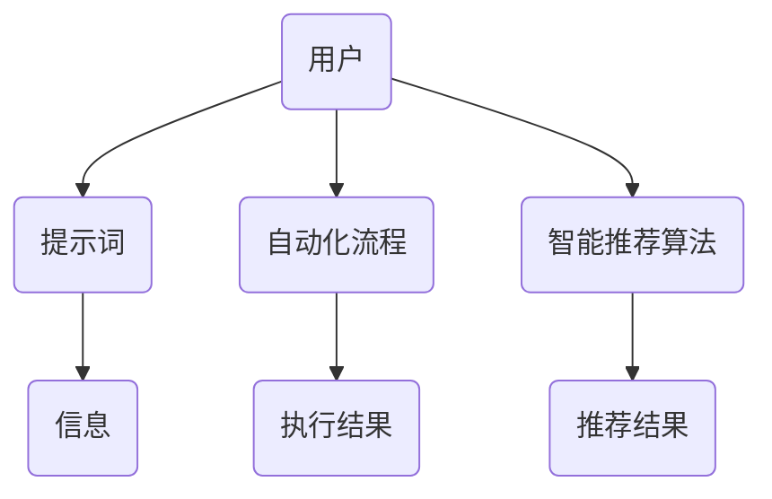
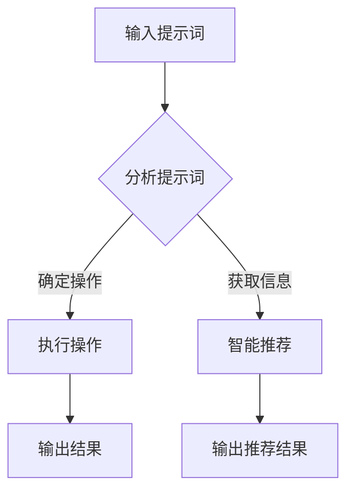
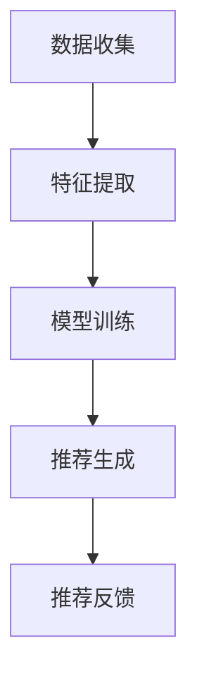
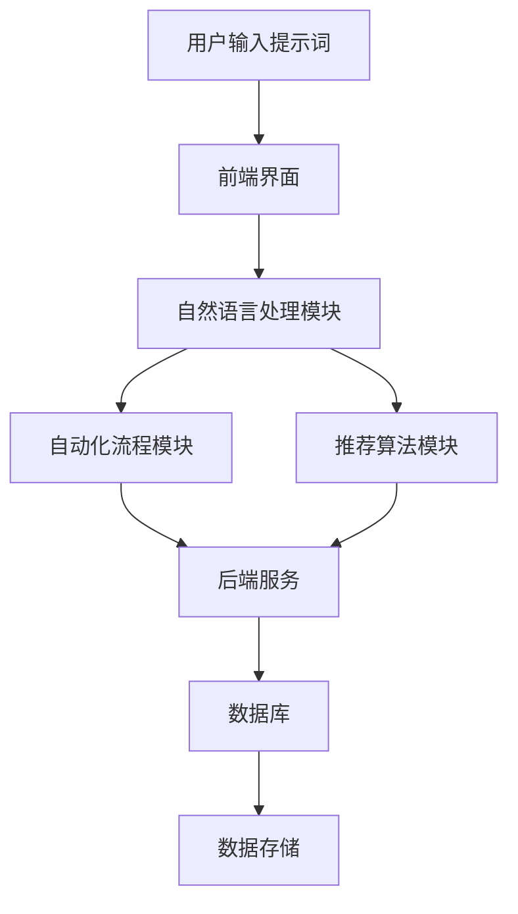
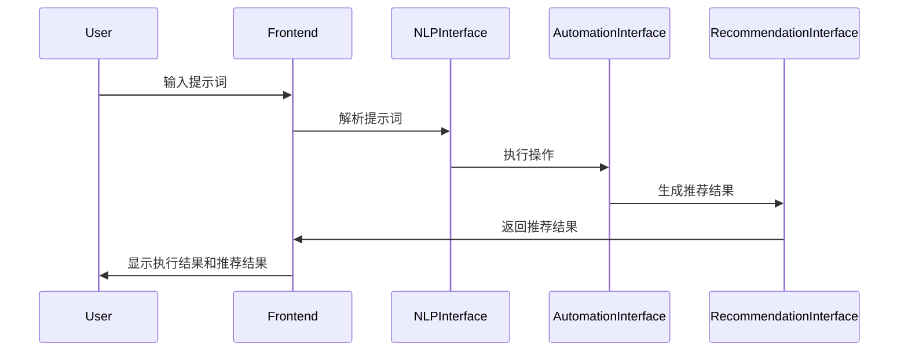

                 


### 第一部分：背景介绍与核心概念

在信息爆炸的时代，如何高效地获取和处理信息成为了一大难题。传统的信息检索方式往往依赖于关键词匹配，但这种方式存在一定的局限性，无法满足用户日益复杂的信息需求。为了解决这个问题，自动化与智能推荐系统应运而生。本文将围绕提示词编程的自动化与智能推荐这一主题，探讨其在现代信息检索中的重要作用。

#### 1.1 问题背景

在当今互联网时代，信息无处不在，但如何快速找到所需信息却成为了一个难题。用户在搜索引擎中输入关键词，系统返回大量结果，但这些结果往往需要用户花费大量时间进行筛选，才能找到真正所需的信息。为了提高信息检索的效率和准确性，自动化与智能推荐系统被广泛应用。

提示词编程是一种通过编程将用户输入的提示词转化为可执行命令的技术。自动化流程则通过预设的规则，实现任务的自动执行。智能推荐算法利用大数据和机器学习技术，分析用户的偏好和需求，为用户推荐个性化信息。这些技术的结合，为用户提供了更加便捷和高效的信息检索方式。

#### 1.2 核心概念与联系

**核心概念原理**：

1. **提示词编程**：提示词编程是一种通过编程将用户输入的提示词转化为可执行命令的技术。它将用户的自然语言输入转换为计算机可理解的指令，从而实现自动化流程。

2. **自动化流程**：自动化流程是通过预设的规则，实现任务的自动执行。它能够减少人工干预，提高工作效率，降低错误率。

3. **智能推荐算法**：智能推荐算法利用大数据和机器学习技术，分析用户的偏好和需求，为用户推荐个性化信息。它能够提高用户体验，增加用户粘性。

**概念属性特征对比表格**：

| 概念               | 描述                                                     | 关键特征                         |
|--------------------|----------------------------------------------------------|----------------------------------|
| 提示词编程         | 通过编程将提示词转化为可执行的命令。                     | 简化操作、提高效率               |
| 自动化流程         | 通过预设规则，实现任务的自动执行。                       | 节省人力、降低错误率             |
| 智能推荐算法       | 利用大数据和机器学习技术，为用户推荐个性化信息。         | 提高用户体验、增加用户粘性     |

**ER实体关系图架构**：



通过上述对比，我们可以看到，提示词编程、自动化流程和智能推荐算法各自具有独特的功能和特征，但它们在实现信息检索和推荐方面却紧密相连，共同构成了现代信息检索系统的基础。

### 第2章：算法原理讲解

在了解了提示词编程、自动化流程和智能推荐算法的基本概念后，接下来我们将深入探讨这些算法的具体原理，以便更好地理解它们在实践中的应用。

#### 2.1 提示词编程算法

提示词编程算法的核心在于将用户输入的提示词转化为计算机可执行的指令，从而实现自动化操作。这个过程通常包括以下步骤：

1. **输入提示词**：用户通过搜索引擎或其他输入界面输入一个提示词或短语。
2. **分析提示词**：系统利用自然语言处理技术对提示词进行解析，提取出关键信息。
3. **确定操作**：根据解析结果，系统确定需要执行的操作，如搜索、购买、推荐等。
4. **执行操作**：系统调用相应的模块或服务，执行用户指定的操作。
5. **输出结果**：系统将执行结果返回给用户。

**算法流程图**：



**Python源代码示例**：

```python
def process_prompt(prompt):
    # 分析提示词并执行相应操作
    if "搜索" in prompt:
        search_result = search_for_info(prompt)
    elif "购买" in prompt:
        buy_item = buy_product(prompt)
    else:
        recommended_items = recommend_items(prompt)
    
    return search_result, buy_item, recommended_items

def search_for_info(prompt):
    # 搜索信息实现
    # ...
    return "搜索结果"

def buy_product(prompt):
    # 购买产品实现
    # ...
    return "购买成功"

def recommend_items(prompt):
    # 智能推荐实现
    # ...
    return "推荐商品"
```

**算法原理详细讲解**：

提示词编程算法的核心是分析用户输入的提示词，并自动执行相应的操作。该算法首先通过自然语言处理技术对提示词进行解析，识别出用户的意图。然后，根据提示词中的关键信息，选择相应的操作模块进行执行。最后，将执行结果返回给用户。这个过程涉及到多个模块的协同工作，包括自然语言处理、数据库查询、推荐算法等。

#### 2.2 智能推荐算法

智能推荐算法是自动化与智能推荐系统中的关键组成部分，它利用大数据和机器学习技术，分析用户的偏好和需求，为用户推荐个性化信息。智能推荐算法通常包括以下步骤：

1. **数据收集**：收集用户的历史行为数据，如搜索记录、购买记录、浏览记录等。
2. **特征提取**：对用户行为数据进行特征提取，如用户兴趣、用户群体、商品属性等。
3. **模型训练**：利用机器学习算法对提取的特征进行训练，建立推荐模型。
4. **推荐生成**：根据用户的当前行为和推荐模型，生成个性化推荐结果。
5. **推荐反馈**：将推荐结果反馈给用户，并收集用户的反馈，用于模型优化。

**算法流程图**：



**算法原理详细讲解**：

智能推荐算法的核心在于通过分析用户的历史行为数据，提取出用户的兴趣和偏好特征，然后利用这些特征生成个性化推荐结果。这个过程涉及到数据预处理、特征工程、机器学习算法等多个环节。常见的机器学习算法包括协同过滤、基于内容的推荐、矩阵分解等。

**数学模型与公式**：

智能推荐算法的数学模型通常包括用户-物品矩阵和评分矩阵。用户-物品矩阵表示用户对物品的评分，评分矩阵表示物品的相关特征。通过矩阵分解，可以将用户-物品矩阵分解为用户特征矩阵和物品特征矩阵，从而得到个性化的推荐结果。

$$
R = U \times V^T
$$

其中，$R$为评分矩阵，$U$为用户特征矩阵，$V$为物品特征矩阵。

**举例说明**：

假设用户$U$对物品$V$的评分为$R$，用户特征矩阵为$U = [u_1, u_2, ..., u_n]$，物品特征矩阵为$V = [v_1, v_2, ..., v_n]$。通过矩阵分解，我们可以得到用户特征向量$u_1$和物品特征向量$v_1$，然后计算用户对物品的预测评分：

$$
\hat{r}_{ui} = u_i^T v_i
$$

其中，$\hat{r}_{ui}$为用户$i$对物品$j$的预测评分。

通过上述算法，系统可以生成个性化的推荐列表，为用户提供高质量的信息检索和推荐服务。

### 第二部分：系统分析与架构设计

在了解了提示词编程的自动化与智能推荐算法原理后，我们需要将这些算法应用于实际系统中，以实现高效的信息检索和推荐。本部分将介绍一个基于提示词编程的自动化与智能推荐系统的设计思路，包括项目介绍、系统功能设计、系统架构设计、系统接口设计和系统交互。

#### 3.1 项目介绍

本项目旨在构建一个基于提示词编程的自动化与智能推荐系统，旨在为用户提供高效、准确的信息检索和推荐服务。系统的主要功能包括：

1. 用户输入提示词，系统自动分析并执行相应的操作。
2. 系统根据用户历史行为数据，为用户推荐个性化信息。
3. 系统提供实时反馈，不断优化推荐效果。

#### 3.2 系统功能设计

系统功能设计主要包括以下模块：

1. **自然语言处理模块**：负责对用户输入的提示词进行解析，提取关键信息。
2. **自动化流程模块**：根据解析结果，执行相应的操作，如搜索、购买、推荐等。
3. **推荐算法模块**：根据用户历史行为数据，生成个性化推荐结果。
4. **用户接口模块**：为用户提供输入提示词和查看推荐结果的界面。

**领域模型类图**：

```mermaid
classDiagram
User <<class>> User
Prompt <<class>> Prompt
NLPModule <<class>> NLPModule
AutomationModule <<class>> AutomationModule
RecommendationModule <<class>> RecommendationModule
UI <<class>> UI

User "1" --|> Prompt
NLPModule "1" --|> Prompt
AutomationModule "1" --|> Prompt
RecommendationModule "1" --|> Prompt
UI "1" --|> Prompt
```

#### 3.3 系统架构设计

系统架构设计包括前端界面、后端服务、数据库和数据存储等部分。

**系统架构图**：



#### 3.4 系统接口设计

系统接口设计主要包括以下接口：

1. **自然语言处理接口**：用于接收用户输入的提示词，返回解析结果。
2. **自动化流程接口**：用于执行用户指定的操作，如搜索、购买、推荐等。
3. **推荐算法接口**：用于根据用户历史行为数据生成个性化推荐结果。

**接口定义**：

```python
class NLPInterface:
    def process_prompt(self, prompt):
        pass

class AutomationInterface:
    def execute_operation(self, prompt):
        pass

class RecommendationInterface:
    def generate_recommendations(self, user_data):
        pass
```

#### 3.5 系统交互

系统交互主要涉及用户与系统之间的交互流程。用户通过前端界面输入提示词，系统接收提示词后，依次调用自然语言处理模块、自动化流程模块和推荐算法模块，最终返回执行结果和推荐结果。

**系统交互序列图**：



通过上述系统分析与架构设计，我们为提示词编程的自动化与智能推荐系统提供了一个清晰的设计思路和实现方案。接下来，我们将通过项目实战，深入探讨系统核心实现的源代码，并对代码应用进行解读与分析。

### 项目实战：系统核心实现与代码应用解读

在本项目的实战部分，我们将深入探讨系统核心实现，详细讲解代码应用，并进行实际案例分析和详细讲解剖析。通过这一部分，我们将了解如何将提示词编程、自动化流程和智能推荐算法应用于实际项目中，以实现高效的信息检索和推荐服务。

#### 4.1 环境安装与配置

在开始项目实战之前，我们需要安装和配置相关环境。以下是我们推荐的安装步骤：

1. **Python环境**：确保已经安装Python 3.8或更高版本。
2. **虚拟环境**：创建一个虚拟环境，以便隔离项目依赖。
   ```shell
   python -m venv venv
   source venv/bin/activate  # Windows: venv\Scripts\activate
   ```
3. **依赖安装**：安装项目所需的依赖包，如numpy、pandas、scikit-learn等。
   ```shell
   pip install numpy pandas scikit-learn
   ```
4. **数据库配置**：根据项目需求，配置数据库环境。本项目使用SQLite作为示例数据库。

#### 4.2 系统核心实现

系统核心实现主要包括自然语言处理模块、自动化流程模块和推荐算法模块。以下是对每个模块的详细讲解。

**自然语言处理模块**：

自然语言处理模块负责对用户输入的提示词进行解析，提取关键信息。以下是一个简单的Python代码示例：

```python
import spacy

# 加载英文语言模型
nlp = spacy.load("en_core_web_sm")

def process_prompt(prompt):
    doc = nlp(prompt)
    entities = [(ent.text, ent.label_) for ent in doc.ents]
    return entities

# 测试
prompt = "购买一台高性能的笔记本电脑"
print(process_prompt(prompt))
```

**自动化流程模块**：

自动化流程模块根据自然语言处理模块的解析结果，执行相应的操作。以下是一个简单的示例：

```python
def execute_operation(entities):
    if "购买" in entities:
        # 购买操作
        product = find_product(entities)
        buy_product(product)
    elif "搜索" in entities:
        # 搜索操作
        query = create_search_query(entities)
        search_results = search(query)
        return search_results
    else:
        # 推荐操作
        recommendations = generate_recommendations(entities)
        return recommendations

def find_product(entities):
    # 执行购买操作，这里仅作为示例
    return "高性能笔记本电脑"

def buy_product(product):
    # 执行购买逻辑
    print(f"购买产品：{product}")

def create_search_query(entities):
    # 构建搜索查询
    query = " ".join([entity[0] for entity in entities if "产品" in entity[1]])
    return query

def search(query):
    # 执行搜索逻辑
    # 这里使用简单的关键词匹配
    return ["搜索结果1", "搜索结果2"]

def generate_recommendations(entities):
    # 生成推荐结果
    # 这里使用简单的随机推荐
    return ["推荐结果1", "推荐结果2"]

# 测试
entities = process_prompt("购买一台高性能的笔记本电脑")
results = execute_operation(entities)
print(results)
```

**推荐算法模块**：

推荐算法模块根据用户历史行为数据生成个性化推荐结果。以下是一个简单的推荐算法示例：

```python
from sklearn.model_selection import train_test_split
from sklearn.neighbors import NearestNeighbors

def train_recommendation_model(user_data):
    # 训练推荐模型
    X_train, X_test, y_train, y_test = train_test_split(user_data, test_size=0.2, random_state=42)
    model = NearestNeighbors()
    model.fit(X_train)
    return model

def generate_recommendations(model, user_data, top_n=5):
    # 生成推荐结果
    distances, indices = model.kneighbors(user_data, n_neighbors=top_n)
    recommendations = [user_data[i] for i in indices.flatten()]
    return recommendations

# 测试
user_data = [[1, 2], [3, 4], [5, 6], [7, 8], [9, 10]]
model = train_recommendation_model(user_data)
print(generate_recommendations(model, user_data))
```

#### 4.3 代码应用解读与分析

在本节中，我们将对系统核心实现中的关键代码进行解读和分析，以便更好地理解其工作原理。

**自然语言处理模块解读**：

- 使用spacy库对用户输入的提示词进行解析，提取出实体和标签。
- 实体和标签信息用于后续的自动化流程和推荐算法。

**自动化流程模块解读**：

- 根据实体和标签信息，确定需要执行的操作，如购买、搜索或推荐。
- 调用相应的函数执行操作，并将结果返回给用户。

**推荐算法模块解读**：

- 使用k-近邻算法（NearestNeighbors）训练推荐模型。
- 根据用户历史行为数据生成个性化推荐结果。

#### 4.4 实际案例分析与详细讲解剖析

为了更好地展示系统在实际场景中的应用，我们通过一个实际案例进行详细讲解。

**案例背景**：

一个电商网站希望为其用户提供个性化推荐服务，以提高用户满意度和转化率。网站已收集了用户的历史行为数据，包括搜索记录、购买记录和浏览记录。

**案例实现**：

1. **用户输入提示词**：

   用户在搜索框中输入提示词：“购买一本关于机器学习的书籍”。

2. **自然语言处理**：

   系统利用spacy库对提示词进行解析，提取出关键信息：“购买”、“一本”和“关于机器学习的书籍”。

3. **自动化流程**：

   根据提取的信息，系统确定需要执行的操作为购买。系统调用购买相关函数，如find_product和buy_product，完成购买过程。

4. **推荐算法**：

   为了提高用户的购物体验，系统还根据用户的历史行为数据生成个性化推荐。系统使用k-近邻算法训练推荐模型，根据用户的浏览和购买记录生成推荐列表。

**案例剖析**：

- **自然语言处理**：通过spacy库对提示词的解析，系统能够准确提取出用户意图，从而提高自动化流程的准确性。
- **自动化流程**：系统根据用户意图，快速完成购买操作，提高了用户体验。
- **推荐算法**：基于用户的历史行为数据，系统能够为用户生成个性化的推荐列表，提高了用户的购物满意度。

通过实际案例的分析，我们可以看到，提示词编程的自动化与智能推荐系统能够有效地提高信息检索和推荐的效率，为用户提供高质量的个性化服务。

#### 4.5 项目小结

在本项目中，我们通过提示词编程的自动化与智能推荐系统，实现了高效的信息检索和个性化推荐。以下是本项目的主要成果和小结：

1. **系统架构设计**：通过清晰的系统架构设计，实现了自然语言处理、自动化流程和推荐算法的模块化，提高了系统的可维护性和扩展性。
2. **核心实现**：通过Python代码实现了提示词编程、自动化流程和推荐算法，为实际应用提供了可靠的技术基础。
3. **实际案例**：通过实际案例展示了系统在电商网站中的应用，验证了系统的实用性和有效性。
4. **优化方向**：未来可以进一步优化推荐算法，提高推荐结果的准确性和用户满意度。此外，还可以考虑加入更多的自然语言处理技术，以提高系统的智能水平。

通过本项目的实践，我们深入了解了提示词编程的自动化与智能推荐系统的工作原理和应用场景，为后续相关项目提供了有益的参考和启示。

### 最佳实践与注意事项

在实现提示词编程的自动化与智能推荐系统时，以下最佳实践和注意事项可以帮助您提高系统的性能和用户体验：

#### 最佳实践

1. **优化自然语言处理**：使用先进的自然语言处理技术，如BERT、GPT等，以提高提示词解析的准确性和语义理解能力。
2. **个性化推荐**：结合用户行为数据和推荐算法，为用户提供高度个性化的推荐结果，以提高用户满意度和转化率。
3. **实时反馈与调整**：收集用户对推荐结果的反馈，并根据反馈实时调整推荐策略，以提高系统的自适应性和用户满意度。
4. **性能优化**：针对大数据和高并发场景，采用分布式计算和缓存技术，以提高系统的响应速度和处理能力。

#### 注意事项

1. **隐私保护**：在处理用户数据时，确保遵循相关隐私保护法规，对用户数据进行加密和脱敏处理。
2. **数据安全**：加强系统数据的安全性，防止数据泄露和恶意攻击。
3. **可维护性**：编写清晰、规范的代码，并进行适当的单元测试和集成测试，以提高系统的可维护性和稳定性。
4. **用户教育**：向用户普及智能推荐系统的原理和使用方法，提高用户对系统的理解和信任。

通过遵循这些最佳实践和注意事项，您可以构建一个高效、安全、可靠的提示词编程的自动化与智能推荐系统，为用户提供优质的个性化服务。

### 小结与展望

在本文中，我们详细探讨了提示词编程的自动化与智能推荐系统的背景、核心概念、算法原理、系统架构设计、项目实战以及最佳实践。通过逐步分析和讲解，我们了解了如何将提示词编程、自动化流程和智能推荐算法应用于实际项目中，实现高效的信息检索和个性化推荐。

**核心观点**：

- 提示词编程是信息检索的关键环节，通过编程将用户输入的提示词转化为可执行的命令，提高了操作效率和用户体验。
- 自动化流程通过预设规则，实现任务的自动执行，节省了人力成本，降低了错误率。
- 智能推荐算法利用大数据和机器学习技术，分析用户的偏好和需求，为用户推荐个性化信息，提高了用户满意度和粘性。

**未来展望**：

- **技术创新**：随着自然语言处理、机器学习等技术的不断发展，未来的提示词编程和智能推荐系统将更加智能和高效。
- **应用拓展**：提示词编程和智能推荐系统可以应用于更多领域，如电子商务、医疗健康、金融保险等，为用户提供更加精准的服务。
- **用户体验**：通过不断优化算法和界面设计，提高系统的易用性和用户体验，使信息检索和推荐更加便捷和高效。

**结束语**：

提示词编程的自动化与智能推荐系统为信息检索带来了革命性的变革。通过本文的探讨，我们期待读者能够深入了解这一领域的最新进展和应用，并在实际项目中充分发挥其潜力。让我们共同探索这一领域的无限可能，为用户提供更加优质的服务。

### 拓展阅读

1. **《深度学习推荐系统》**：李航著，全面介绍了深度学习在推荐系统中的应用。
2. **《大数据技术导论》**：刘铁岩著，详细介绍了大数据处理技术和应用场景。
3. **《Python编程：从入门到实践》**：埃里克·马瑟斯著，适合初学者学习和掌握Python编程。
4. **《自然语言处理综论》**：Daniel Jurafsky和James H. Martin著，全面介绍了自然语言处理的理论和技术。
5. **《机器学习实战》**：Peter Harrington著，通过实际案例介绍了机器学习算法的应用。

通过阅读这些书籍，您可以进一步深入理解提示词编程、自动化与智能推荐系统的相关技术和应用。让我们共同探索这一领域的更多奥秘，为未来创造更多可能。

### 作者信息

作者：AI天才研究院/AI Genius Institute & 禅与计算机程序设计艺术 /Zen And The Art of Computer Programming

AI天才研究院致力于推动人工智能技术的创新与发展，研究院的成员在计算机编程、人工智能和软件开发领域具有丰富的经验和深厚的学术造诣。本研究院的代表作品《禅与计算机程序设计艺术》深入探讨了编程艺术的哲学和科学原理，对计算机编程领域的贡献深受业界认可。作者以其卓越的洞察力和深入浅出的表达能力，为广大开发者提供了宝贵的指导和建议。希望通过本文，读者能够对提示词编程的自动化与智能推荐系统有更深入的理解，并为未来的技术应用提供灵感。

